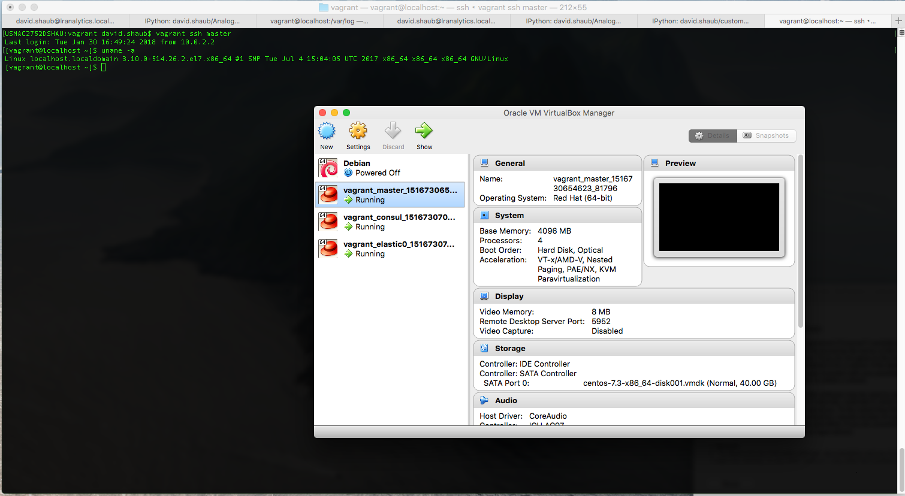
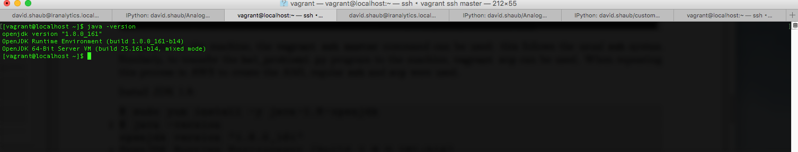
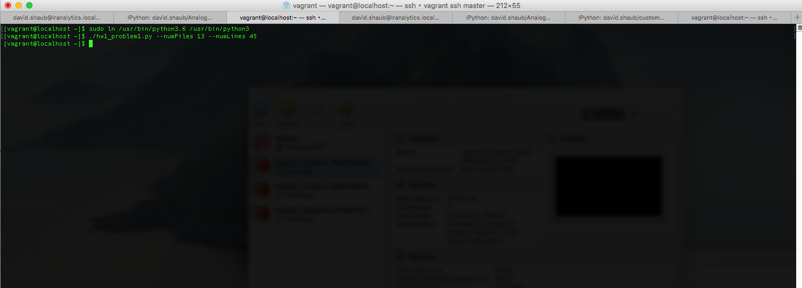
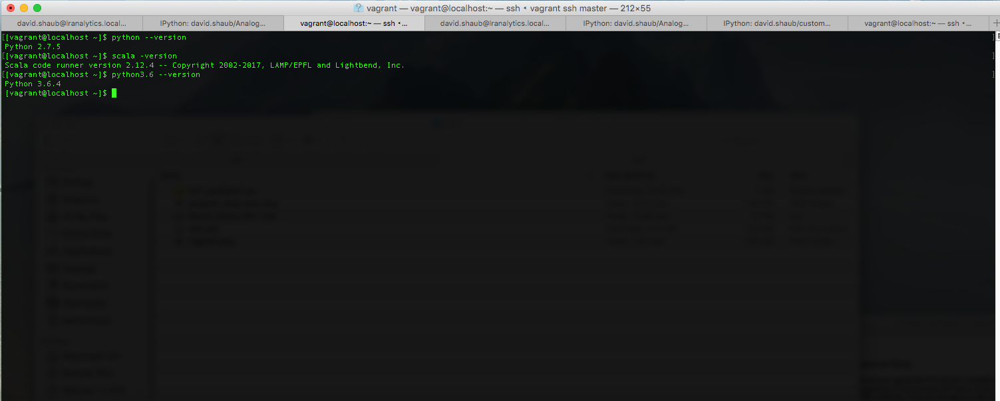
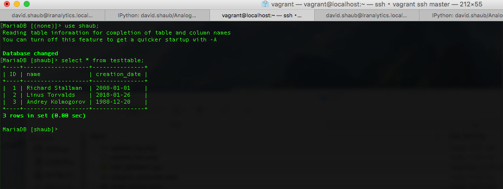
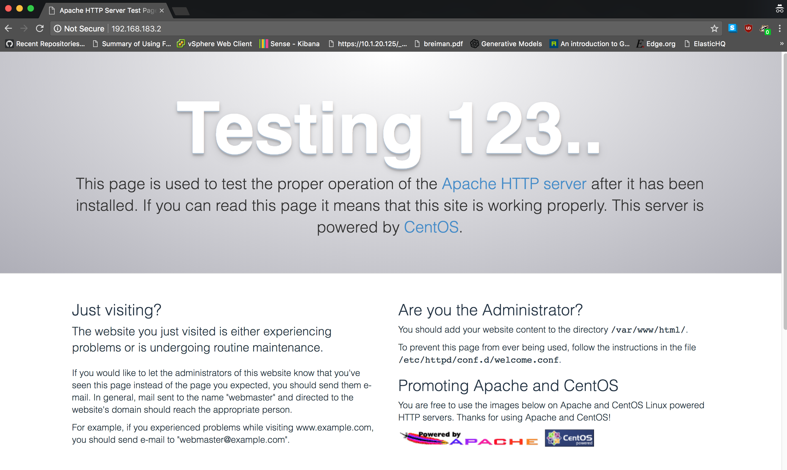
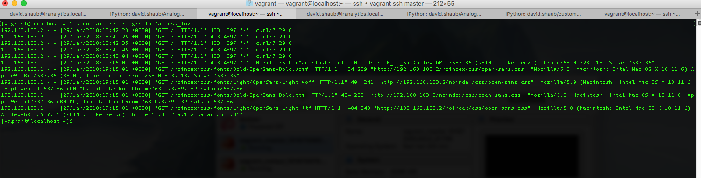

Completed all problems--including Problem 4.

### Problem 1
See `hw1_problem1.py`.
```
#!/usr/bin/python3
"""
Generates files with random numbers
"""
import argparse
from multiprocessing.dummy import Pool as ThreadPool
from random import randint

parser = argparse.ArgumentParser()
parser.add_argument('--numFiles', type=int,
                    help='Number of files to write')
parser.add_argument('--numLines', type=int,
                    help='Number of lines to write in each file')
args = parser.parse_args()
num_files = args.numFiles
num_lines = args.numLines

def generate_random():
    """
    Generate a single string containing three random numbers between
    0 and 10 (inclusive) and separated by a space.
    """
    result = str(randint(0, 10)) + ' ' + str(randint(0, 10)) + ' '
    result += str(randint(0, 10)) + '\n'
    return result


def write_file(file_number, num_lines):
    """
    Write a file with random numbers in the specified format
    a given number of lines
    :param file_number: The number of the file--will appear in filename
    :param num_lines: The number of lines to generate in the file
    """
    file_name = 'david_shaub_' + str(file_number) + '.txt'
    with open(file_name, 'w') as outfile:
        for _ in range(num_lines):
            result = generate_random()
            outfile.write(result)


workers = [i for i in range(num_files)]
pool = ThreadPool(num_files)
_ = pool.map(lambda x: write_file(file_number=x, num_lines=num_lines),
             workers)

```

Run the program:
```
$ ./hw1_problem1.py --numFiles 13 --numLines 45
```
We see that the expected files are generated:
```
$ ls *.txt
david_shaub_0.txt   david_shaub_12.txt  david_shaub_5.txt  david_shaub_9.txt
david_shaub_1.txt   david_shaub_2.txt   david_shaub_6.txt
david_shaub_10.txt  david_shaub_3.txt   david_shaub_7.txt
david_shaub_11.txt  david_shaub_4.txt   david_shaub_8.txt

```
The files have the expected number of lines:
```
$ wc -l *.txt
  45 david_shaub_0.txt
  45 david_shaub_1.txt
  45 david_shaub_10.txt
  45 david_shaub_11.txt
  45 david_shaub_12.txt
  45 david_shaub_2.txt
  45 david_shaub_3.txt
  45 david_shaub_4.txt
  45 david_shaub_5.txt
  45 david_shaub_6.txt
  45 david_shaub_7.txt
  45 david_shaub_8.txt
  45 david_shaub_9.txt
 585 total
```
And there are three random numbers per line between 0 and 10, inclusive:
```
$ head david_shaub_0.txt
8 0 5
7 2 3
4 6 10
2 7 1
8 9 8
9 5 9
4 3 3
5 6 7
9 2 6
3 3 9

```

### Problem 2
For a first round of development and testing, a CentOS VM was created using Vagrant and VirtualBox as the backend hypervisor. The usename is `vagrant` and the machine name is `master`.



To connect to the machine, the `vagrant ssh master` command can be used: this follows the usual `ssh` syntax. Similarly, to transfer the `hw1_problem1.py` program to the machine, `vagrant scp` can be used. When repeating this process in AWS to create the AMI, regular `ssh` and `scp` were used.

Install JDK 1.8:
```
$ sudo yum install -y java-1.8.0-openjdk
$ java -version
openjdk version "1.8.0_161"
OpenJDK Runtime Environment (build 1.8.0_161-b14)
OpenJDK 64-Bit Server VM (build 25.161-b14, mixed mode)
```



Python 2.7 is already installed:
```
$ python2 --version
Python 2.7.5
```

Install python 3.6:
```
$ sudo yum install -y yum-utils
$ sudo yum groupinstall -y development
$ sudo yum install -y https://centos7.iuscommunity.org/ius-release.rpm
$ sudo yum install -y python36u python36u-pip python36u-devel
$ python3.6 --version
Python 3.6.4
```

Install scala:
```
$ wget https://www.scala-lang.org/files/archive/scala-2.12.4.rpm
$ sudo yum install -y scala-2.12.4.rpm
$ scala -version
Scala code runner version 2.12.4 -- Copyright 2002-2017, LAMP/EPFL and Lightbend, Inc.
```

We'll create a link to python3.6 for convenience. The program can run in this environment:
```
$ sudo ln /usr/bin/python3.6 /usr/bin/python3
$ ./hw1_problem1.py --numFiles 13 --numLines 45
```

Note: we may have to set execution permissions with `chmod a+x hw1_problem1.py`.

We see that scala and python also exist in this environment:



### Problem 3
#### MariaDB

Install mariadb:
```
$ sudo yum install -y mariadb-server
$ sudo systemctl start mariadb
$ sudo systemctl enable mariadb
Created symlink from /etc/systemd/system/multi-user.target.wants/mariadb.service to /usr/lib/systemd/system/mariadb.service.
$ mysql --version
mysql  Ver 15.1 Distrib 5.5.56-MariaDB, for Linux (x86_64) using readline 5.1
```

Enter the MariaDB shell. Note that our installation from the CentOS repo *does not* require a password:
```
$ mysql -u root
```

Inside the mariadb shell, we create our database and select it:
```
> create database shaub;
Query OK, 1 row affected (0.01 sec)

> use shaub;
Database changed

```
We create the table with the specified schema:
```
> create table testtable
(
ID int not null auto_increment primary key,
name varchar(30) not null,
creation_date date
);
Query OK, 0 rows affected (0.10 sec)

```
We insert three records:
```
> insert into testtable (name, creation_date) values ('Richard Stallman', '2000-01-01');
Query OK, 1 row affected (0.04 sec)

> insert into testtable (name, creation_date) values ('Linus Torvalds', '2018-01-26');
Query OK, 1 row affected (0.02 sec)

> insert into testtable (name, creation_date) values ('Andrey Kolmogorov', '1980-12-20');
Query OK, 1 row affected (0.01 sec)
```
And query to see that the results appear:
```
> select * from testtable;
+----+-------------------+---------------+
| ID | name              | creation_date |
+----+-------------------+---------------+
|  1 | Richard Stallman  | 2000-01-01    |
|  2 | Linus Torvalds    | 2018-01-26    |
|  3 | Andrey Kolmogorov | 1980-12-20    |
+----+-------------------+---------------+
3 rows in set (0.00 sec)

```


#### Apache
Install Apache:
```
$ sudo yum install httpd
```

Modify `firewalld` to allow connections:
```
$ sudo firewall-cmd --permanent --add-port=80/tcp
success
$ sudo firewall-cmd --permanent --add-port=443/tcp
success
$ sudo firewall-cmd --reload
success
```

Start the service, and enable it when the system boots
```
sudo systemctl start httpd
sudo systemctl enable httpd
```

Now we can connect to our IP `192.168.183.2` found using `ip a s`
```
$ ip a s
1: lo: <LOOPBACK,UP,LOWER_UP> mtu 65536 qdisc noqueue state UNKNOWN qlen 1
    link/loopback 00:00:00:00:00:00 brd 00:00:00:00:00:00
    inet 127.0.0.1/8 scope host lo
       valid_lft forever preferred_lft forever
    inet6 ::1/128 scope host 
       valid_lft forever preferred_lft forever
2: enp0s3: <BROADCAST,MULTICAST,UP,LOWER_UP> mtu 1500 qdisc pfifo_fast state UP qlen 1000
    link/ether 08:00:27:37:f8:46 brd ff:ff:ff:ff:ff:ff
    inet 10.0.2.15/24 brd 10.0.2.255 scope global dynamic enp0s3
       valid_lft 85432sec preferred_lft 85432sec
    inet6 fe80::8d63:a80d:f96e:1463/64 scope link 
       valid_lft forever preferred_lft forever
3: enp0s8: <BROADCAST,MULTICAST,UP,LOWER_UP> mtu 1500 qdisc pfifo_fast state UP qlen 1000
    link/ether 08:00:27:f7:8b:c2 brd ff:ff:ff:ff:ff:ff
    inet 192.168.183.2/24 brd 192.168.183.255 scope global enp0s8
       valid_lft forever preferred_lft forever
    inet6 fe80::a00:27ff:fef7:8bc2/64 scope link 
       valid_lft forever preferred_lft forever
```



From our host OS, we can validate that the Apache server is running within our guest VM by opening our webbrowser to the IP address, or we can use curl:
```
$ curl 192.168.183.2 | head -n70
  % Total    % Received % Xferd  Average Speed   Time    Time     Time  Current
                                 Dload  Upload   Total   Spent    Left  Speed
100  4897  100  4897    0     0  6754k      0 --:--:-- --:--:-- --:--:-- 4782k
<!DOCTYPE html PUBLIC "-//W3C//DTD XHTML 1.1//EN" "http://www.w3.org/TR/xhtml11/DTD/xhtml11.dtd"><html><head>
<meta http-equiv="content-type" content="text/html; charset=UTF-8">
		<title>Apache HTTP Server Test Page powered by CentOS</title>
		<meta http-equiv="Content-Type" content="text/html; charset=UTF-8">

    <!-- Bootstrap -->
    <link href="/noindex/css/bootstrap.min.css" rel="stylesheet">
    <link rel="stylesheet" href="noindex/css/open-sans.css" type="text/css" />

<style type="text/css"><!--		 

body {
  font-family: "Open Sans", Helvetica, sans-serif;
  font-weight: 100;
  color: #ccc;
  background: rgba(10, 24, 55, 1);
  font-size: 16px;
}

h2, h3, h4 {
  font-weight: 200;
}

h2 {
  font-size: 28px;
}

.jumbotron {
  margin-bottom: 0;
  color: #333;
  background: rgb(212,212,221); /* Old browsers */
  background: radial-gradient(ellipse at center top, rgba(255,255,255,1) 0%,rgba(174,174,183,1) 100%); /* W3C */
}

.jumbotron h1 {
  font-size: 128px;
  font-weight: 700;
  color: white;
  text-shadow: 0px 2px 0px #abc,
               0px 4px 10px rgba(0,0,0,0.15),
               0px 5px 2px rgba(0,0,0,0.1),
               0px 6px 30px rgba(0,0,0,0.1);
}

.jumbotron p {
  font-size: 28px;
  font-weight: 100;
}

.main {
   background: white;
   color: #234;
   border-top: 1px solid rgba(0,0,0,0.12);
   padding-top: 30px;
   padding-bottom: 40px;
}

.footer {
   border-top: 1px solid rgba(255,255,255,0.2);
   padding-top: 30px;
}

    --></style>
</head>
<body>
  <div class="jumbotron text-center">
    <div class="container">
   	  <h1>Testing 123..</h1>
  		<p class="lead">This page is used to test the proper operation of the <a href="http://apache.org">Apache HTTP server</a> after it has been installed. If you can read this page it means that this site is working properly. This server is powered by <a href="http://centos.org">CentOS</a>.</p>
		</div>
```

We also see that this access is logged. Both a browser and curl request from our OS X host OS appear:
```
$ sudo cat /var/log/httpd/access_log
192.168.183.1 - - [29/Jan/2018:18:27:00 +0000] "GET /noindex/css/fonts/Light/OpenSans-Light.ttf HTTP/1.1" 404 240 "http://192.168.183.1/noindex/css/open-sans.css" "Mozilla/5.0 (Macintosh; Intel Mac OS X 10_11_6) AppleWebKit/537.36 (KHTML, like Gecko) Chrome/63.0.3239.132 Safari/537.36"
192.168.183.1 - - [29/Jan/2018:18:40:19 +0000] "GET / HTTP/1.1" 403 4897 "-" "curl/7.29.0"
```


### Problem 4
The AMI is named `cscie88--de1b01d7bbd13438dfbf1e25d75a472e3c9e37de` and is in the Ohio region.
