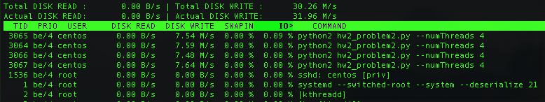

Completed all problems including problem 5.

### Problem 1
See `hw2_problem1.py`
```
```
Screenshots of the program launched with 2, 4, 8, and 16 threads on a **4 CPU** instance are included below:

2 Threads


4 Threads


8 Threads


16 Threads


### Problem 2
```

```
Screenshots of the program launched with 2, 4, 8, and 16 threads on a *4 CPU* instance are included below:

2 Threads


4 Threads



8 Threads


16 Threads


Although this is an IO-heavy task, when the number of threads becomes large, we also start placing a nontrivial load on the CPU. See below the screenshot with 16 threads:


### Problem 3

### Problem 4
See `hw2_problem4.py`:
```
"""
Load 4 logfiles--each with a thread--and answer 3 queries about the data

```
The processed data are held inside of a nested python dictionary. The outer dict has keys for each URL. The value for each key is then another dict that has keys for each user and values that are counts for the number of vists that user made to the URL. So the dictionaries look like `{url: {user: count}}`, and an example might look like `{'http://www.foo.com/bar': {'alice': 13}}`. To update the shared state, we acquire a lock before we modify the data structure and then remove the lock immediately after we finished the modification: this allows other worker threads to read and parse data in the log file simultaneously while another thread is updating a count, adding a new user, or adding a new URL.

This structure was chosen because it makes answering the queries relatively easy.

1.  To get the number of unique urls, we simply need to count the length of the keys of the outer dict.
2.  To get the number of disctinct visitors to each URL, we count the number of values for each URL.
3.  To return the number of visits for each URL per user, sum all of the values of each URL's subdictionary.


### Problem 5
To install the python package, we required `libmariadb-devel`. Then use `pip` to install the `mysqlclient` package in python2:
```
sudo yum install -y mariadb-devel python-devel
sudo pip install mysqlclient
```
Create a database `shaub` and specify the schema for the `logs` table:
```
create database shaub;
use shaub;
create table logs(
uid char(32) primary key,
timestamp timestamp(6),
url varchar(100),
user_id varchar(30)
);
```
When our application inserts a record, we will generate a hash of the data to uniqely identify that record.

Now run two instances concurrently of our program--one handlings files 1 and 2 and the other handling files 3 and 4. Note that we run with `sudo` so it can connect to the MariaDB sever, but in production we would instead designate username/password credentials to avoid granting excess privileges to the process:
```
sudo python hw2_problem5.py --startingFile 1 & sudo python hw2_problem5.py --startingFile 3
```
