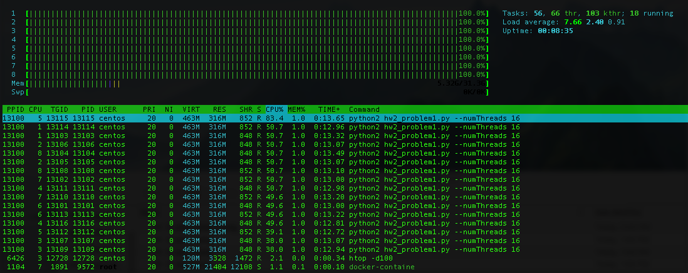

Completed all problems including problem 5.

### Problem 1
See `hw2_problem1.py`
```
"""
Launch several threads, each performing a CPU-intensive task
"""
import argparse
import multiprocessing
import time

parser = argparse.ArgumentParser()
parser.add_argument('--numThreads', type=int,
                    help='Number of threads to launch')
args = parser.parse_args()
num_threads = args.numThreads


def calc_fib(number):
    """
    A naive implementation to generate the specified Fibonacci number
    :param number: The Fibonacci number to generate
    """
    current_num = 0
    next_num = 1
    for _ in range(number):
        tmp = current_num
        current_num = next_num
        next_num += tmp
    return current_num


def work_cpu(thread_num):
    """
    Generate a CPU load. This function will never terminate.
    :param thread_num: A number to identify this process.
    """
    while True:
        time.sleep(1)
        print('Launching worker ' + str(thread_num))
        calc_fib(10**7)

for thread_num in range(num_threads):
    job = multiprocessing.Process(target=work_cpu, args=(thread_num, ))
    job.start()

```
\newpage
Resource utilization statistics were collected with `htop -d100` and `sudo iotop -d10` to smooth results. Screenshots of the program launched with 2, 4, 8, and 16 threads on a **4 CPU** instance are included below:


\newpage
Screenshots of the program launched with 2, 4, 8, and 16 threads on a **8 CPU** instance are included below:




Unsurprisingly, the machine with 8 cores research saturation slower than the 4 core machine: when 8 threads are running these does not appear to be resource contention, and even when we rearch 16 threads each process appears to be scheduled half of the time.

\newpage
### Problem 2
For an IO-intensive task, each thread generates and writes 1,000,000 random numbers into its own file. After this completes, it loops and continues the process indefinitely, overwriting the same file. Each of these files reaches a size of ~14MB and we write a single number at a time, so this becomes an IO-heavy task. Although the kernel may buffer some of the writes, when many threads are active we very likely also perform more disk seek operations. The instance was launched with conventional storage rather than SSDs to demonstrate this.

See `hw2_problem2.py`.
```
"""
Launch several threads, each performing an IO-intensive task
"""
import argparse
import multiprocessing
import random
import time

parser = argparse.ArgumentParser()
parser.add_argument('--numThreads', type=int,
                    help='Number of threads to launch')
args = parser.parse_args()
num_threads = args.numThreads


def write_data(thread_num):
    """
    Write junk data to a data_*.dat file
    :param thread_num: A suffix that is added to each file.
    """
    num = 1000000
    source = 'data_' + str(thread_num) + '.dat'
    with open(source, 'w') as file_con:
        for _ in range(num):
            file_con.write(str(random.random()))


def work_io(thread_num):
    """
    Generate IO load. This function will never terminate.
    :param thread_num: A number to identify this process.
    """
    while True:
        time.sleep(1)
        print('Launching worker ' + str(thread_num))
        write_data(thread_num)

for thread_num in range(num_threads):
    job = multiprocessing.Process(target=work_io, args=(thread_num, ))
    job.start()

```
\newpage
Screenshots of the program launched with 2, 4, 8, and 16 threads on a *4 CPU* instance are included below:


Although this is an IO-heavy task, when the number of threads becomes large, we also start placing a nontrivial load on the CPU. See below the screenshot with 16 threads:


\newpage
When we repeat this experiment on a **8 CPU** instance, the results do not markedly change:


IO does not improve on a machine with more CPU cores, because we are saturating IO and not CPU resources.

\newpage
### Problem 3
Screenshots of both programs launched with 2, 4, 8, and 16 threads on a *4 CPU* instance are included below:


\newpage
Screenshots of both programs launched with 2, 4, 8, and 16 threads on a *4 CPU* instance are included below:


\newpage
Some notable differences between the 4 CPU and 8 CPU configuration include:

* CPU saturation occurs later: with each program running with 2 threads, there is not contention for the CPU, and even up to 4 threads each both programs run contentedly.
* The kernel appears to provide more "fair" scheduling the two competeting resources when 8 threads are used: the IO-heavy job does not entirely crowd out the CPU-heavy job

\newpage
### Problem 4
See `hw2_problem4.py`:
```
"""
Load 4 logfiles--each with a thread--and answer 3 queries about the data
"""
import threading
from multiprocessing.dummy import Pool as ThreadPool

SEP = '\t'
class LogProcessor(object):
    """
    A class for processing log files and printing information about them
    """
    def __init__(self, num_files=4):
        """
        Constructor
        :param num_files: The number of files (and threads)
        """
        self.num_threads = num_files
        # Lock for the shared state
        self.lock = threading.Lock()
        # The shared state, stored as nested dict
        self.shared = {}
        # The filenames to process
        self.files = ['log_file_0' + str(i + 1) + '.txt' for i in range(num_files)]

    def process_data(self, url, user):
        """
        Add a single observation to the shared state
        :param url: The URL of the observation
        :param user: The uesr of the observation
        """
        try:
            # Test if the URL exists already
            _ = self.shared[url]
            try:
                # Now test if the subdict exists
                count = self.shared[url][user]
                # Increment the count
                self.shared[url][user] = count + 1
            except KeyError:
                # User does not exist in subdict, so create it
                self.shared[url][user] = 1
        except KeyError:
            # URL does not exist, so create it and a subdict with the user
            self.shared[url] = {user: 1}

    def process_log(self, filename):
        """
        Process a single logfile
        :param filename: The filename of the log to process
        """
        with open(filename, 'r') as file_con:
            # Read first line
            line = file_con.readline()
            # Stop reading on EOF
            while line:
                # Split the string into a list with timestamp, URL, and user
                parsed = line.split(SEP)
                # Timestamp isn't actually needed
                url = parsed[1]
                # User has trailing newline
                user = parsed[2].split('\n')[0]
                self.lock.acquire()
                self.process_data(url, user)
                self.lock.release()
                # Read next line
                line = file_con.readline()

    def process_all(self):
        """
        Process all the log files. Use one thread for each log file.
        """
        pool = ThreadPool(self.num_threads)
        _ = pool.map(lambda x: self.process_log(filename=x), self.files)

    def print_results(self):
        """
        Print all the results
        """
        self.print_q1()
        self.print_q2()
        self.print_q3()

    def print_q1(self):
        """
        Print the results for the first query
        Count of unique URLs
        """
        num_logs = len(self.shared)
        print('Number of distinct URLs: {}'.format(num_logs))

    def print_q2(self):
        """
        Print the results for the second query
        Count of unique visitors per URL
        """
        print('Number of distinct visitors for each URL')
        for url in self.shared:
            num_visitors = len(self.shared[url])
            print('{}: {}'.format(url, num_visitors))

    def print_q3(self):
        """
        Print the results for the third query
        Number of visits for each URL per user
        """
        print('Number of visits for each URL')
        for url in self.shared:
            num_visits = 0
            for user in self.shared[url]:
                num_visits += self.shared[url][user]
            print('{}: {}'.format(url, num_visits))

log_processor = LogProcessor()
log_processor.process_all()
log_processor.print_results()

```
\newpage
The processed data are held inside of a nested python dictionary. The outer dict has keys for each URL. The value for each key is then another dict that has keys for each user and values that are counts for the number of vists that user made to the URL. The dictionaries look like `{url: {user: count}}`, and an example might look like `{'http://foo.com/bar': {'alice': 13}}`. To update the shared state, we acquire a lock before we modify the data structure and then remove the lock immediately after we finished the modification: this allows other worker threads to read and parse data in the log file simultaneously while another thread is updating a count, adding a new user, or adding a new URL.

This structure was chosen because it makes answering the queries easy:

1.  To get the number of unique urls, we simply count the length of the keys of the outer dict.
2.  To get the number of disctinct visitors to each URL, we count the number of values for each URL.
3.  To return the number of visits for each URL per user, sum all of the values of each URL's subdictionary.

The program's output follows below:
```
$ python3.6 hw2_problem4.py 
Number of distinct URLs: 101
Number of distinct visitors for each URL
http://example.com/?url=0: 45
http://example.com/?url=1: 45
http://example.com/?url=2: 45
http://example.com/?url=3: 45
http://example.com/?url=4: 45
http://example.com/?url=5: 21
http://example.com/?url=6: 21
http://example.com/?url=7: 21
http://example.com/?url=8: 21
http://example.com/?url=9: 21
http://example.com/?url=10: 21
http://example.com/?url=11: 21
http://example.com/?url=12: 21
http://example.com/?url=13: 21
http://example.com/?url=14: 21
http://example.com/?url=15: 21
http://example.com/?url=16: 21
http://example.com/?url=17: 21
http://example.com/?url=18: 21
http://example.com/?url=19: 21
http://example.com/?url=20: 21
http://example.com/?url=21: 21
http://example.com/?url=22: 21
http://example.com/?url=23: 21
http://example.com/?url=24: 21
http://example.com/?url=25: 21
http://example.com/?url=26: 21
http://example.com/?url=27: 21
http://example.com/?url=28: 21
http://example.com/?url=29: 21
http://example.com/?url=30: 21
http://example.com/?url=31: 21
http://example.com/?url=32: 21
http://example.com/?url=33: 21
http://example.com/?url=34: 21
http://example.com/?url=35: 21
http://example.com/?url=36: 21
http://example.com/?url=37: 21
http://example.com/?url=38: 21
http://example.com/?url=39: 21
http://example.com/?url=40: 21
http://example.com/?url=41: 21
http://example.com/?url=42: 21
http://example.com/?url=43: 21
http://example.com/?url=44: 21
http://example.com/?url=45: 21
http://example.com/?url=46: 21
http://example.com/?url=47: 21
http://example.com/?url=48: 21
http://example.com/?url=49: 21
http://example.com/?url=50: 21
http://example.com/?url=51: 21
http://example.com/?url=52: 21
http://example.com/?url=53: 21
http://example.com/?url=54: 21
http://example.com/?url=55: 21
http://example.com/?url=56: 21
http://example.com/?url=57: 21
http://example.com/?url=58: 21
http://example.com/?url=59: 21
http://example.com/?url=60: 21
http://example.com/?url=61: 21
http://example.com/?url=62: 21
http://example.com/?url=63: 21
http://example.com/?url=64: 21
http://example.com/?url=65: 21
http://example.com/?url=66: 21
http://example.com/?url=67: 21
http://example.com/?url=68: 21
http://example.com/?url=69: 21
http://example.com/?url=70: 21
http://example.com/?url=71: 21
http://example.com/?url=72: 21
http://example.com/?url=73: 21
http://example.com/?url=74: 21
http://example.com/?url=75: 21
http://example.com/?url=76: 21
http://example.com/?url=77: 21
http://example.com/?url=78: 21
http://example.com/?url=79: 21
http://example.com/?url=80: 21
http://example.com/?url=81: 21
http://example.com/?url=82: 21
http://example.com/?url=83: 21
http://example.com/?url=84: 21
http://example.com/?url=85: 21
http://example.com/?url=86: 21
http://example.com/?url=87: 21
http://example.com/?url=88: 21
http://example.com/?url=89: 21
http://example.com/?url=90: 21
http://example.com/?url=91: 21
http://example.com/?url=92: 21
http://example.com/?url=93: 21
http://example.com/?url=94: 21
http://example.com/?url=95: 21
http://example.com/?url=96: 21
http://example.com/?url=97: 21
http://example.com/?url=98: 21
http://example.com/?url=99: 21
http://example.com/?url=100: 21
Number of visits for each URL
http://example.com/?url=0: 10382
http://example.com/?url=1: 10382
http://example.com/?url=2: 10382
http://example.com/?url=3: 10382
http://example.com/?url=4: 10382
http://example.com/?url=5: 4532
http://example.com/?url=6: 4532
http://example.com/?url=7: 4532
http://example.com/?url=8: 4532
http://example.com/?url=9: 4532
http://example.com/?url=10: 4532
http://example.com/?url=11: 4532
http://example.com/?url=12: 4532
http://example.com/?url=13: 1932
http://example.com/?url=14: 1932
http://example.com/?url=15: 252
http://example.com/?url=16: 252
http://example.com/?url=17: 252
http://example.com/?url=18: 252
http://example.com/?url=19: 252
http://example.com/?url=20: 252
http://example.com/?url=21: 252
http://example.com/?url=22: 252
http://example.com/?url=23: 252
http://example.com/?url=24: 252
http://example.com/?url=25: 252
http://example.com/?url=26: 252
http://example.com/?url=27: 252
http://example.com/?url=28: 252
http://example.com/?url=29: 252
http://example.com/?url=30: 252
http://example.com/?url=31: 252
http://example.com/?url=32: 252
http://example.com/?url=33: 252
http://example.com/?url=34: 252
http://example.com/?url=35: 252
http://example.com/?url=36: 252
http://example.com/?url=37: 252
http://example.com/?url=38: 252
http://example.com/?url=39: 252
http://example.com/?url=40: 252
http://example.com/?url=41: 252
http://example.com/?url=42: 252
http://example.com/?url=43: 252
http://example.com/?url=44: 252
http://example.com/?url=45: 252
http://example.com/?url=46: 252
http://example.com/?url=47: 252
http://example.com/?url=48: 252
http://example.com/?url=49: 252
http://example.com/?url=50: 252
http://example.com/?url=51: 252
http://example.com/?url=52: 252
http://example.com/?url=53: 252
http://example.com/?url=54: 252
http://example.com/?url=55: 252
http://example.com/?url=56: 252
http://example.com/?url=57: 252
http://example.com/?url=58: 252
http://example.com/?url=59: 252
http://example.com/?url=60: 252
http://example.com/?url=61: 252
http://example.com/?url=62: 252
http://example.com/?url=63: 252
http://example.com/?url=64: 252
http://example.com/?url=65: 252
http://example.com/?url=66: 252
http://example.com/?url=67: 252
http://example.com/?url=68: 252
http://example.com/?url=69: 252
http://example.com/?url=70: 252
http://example.com/?url=71: 252
http://example.com/?url=72: 252
http://example.com/?url=73: 252
http://example.com/?url=74: 252
http://example.com/?url=75: 252
http://example.com/?url=76: 252
http://example.com/?url=77: 252
http://example.com/?url=78: 252
http://example.com/?url=79: 252
http://example.com/?url=80: 252
http://example.com/?url=81: 252
http://example.com/?url=82: 252
http://example.com/?url=83: 252
http://example.com/?url=84: 252
http://example.com/?url=85: 252
http://example.com/?url=86: 252
http://example.com/?url=87: 252
http://example.com/?url=88: 252
http://example.com/?url=89: 252
http://example.com/?url=90: 252
http://example.com/?url=91: 252
http://example.com/?url=92: 252
http://example.com/?url=93: 252
http://example.com/?url=94: 252
http://example.com/?url=95: 252
http://example.com/?url=96: 252
http://example.com/?url=97: 252
http://example.com/?url=98: 252
http://example.com/?url=99: 252
http://example.com/?url=100: 252
```

\newpage
### Problem 5
See `hw2_problem5.py`
```
"""
Load 4 logfiles--each with a thread--and answer 3 queries about the data
"""
import argparse
import hashlib
import MySQLdb
import _mysql_exceptions
import threading
from multiprocessing.dummy import Pool as ThreadPool

parser = argparse.ArgumentParser()
parser.add_argument('--startingFile', type=int,
                    help='The number of the first file to process.'
                         'One more file after this will also be processed')
args = parser.parse_args()
starting_file = args.startingFile

SEP = '\t'
class LogProcessor(object):
    """
    A class for processing log files and printing information about them
    """
    def __init__(self, starting_file):
        """
        Constructor
        :param starting_file: The first file to process
        """
        # Always use two threads
        self.num_threads = 2
        # Lock for the client's transactions
        self.lock = threading.Lock()
        # The two filenames to process
        self.files = ['log_file_0' + str(i + starting_file) + '.txt' for i in range(2)]
        # Database connection
        self.db = MySQLdb.connect(user='root', passwd='passwd', db='shaub')

    def insert_data(self, timestamp, url, user):
        """
        Insert a single observation into MariaDB
        :param timestamp: The timestamp of the observation
        :param url: The URL of the observation
        :param user: The uesr of the observation
        """
        # Generate a uid for the record
        uid = hashlib.md5(timestamp + url + user).hexdigest()
        statement = 'insert into logs values ("{}", "{}", "{}", "{}");'.format(uid,timestamp,
                                                                      url, user)
        print statement
        self.lock.acquire()
        try:
            self.db.cursor().execute(statement)
            self.db.commit()
        except _mysql_exceptions.IntegrityError:
            # Duplicate key
            next
        self.lock.release()
        pass

    def process_log(self, filename):
        """
        Process a single logfile
        :param filename: The filename of the log to process
        """
        print 'processing file ' + filename
        with open(filename, 'r') as file_con:
            # Read first line
            line = file_con.readline()
            # Stop reading on EOF
            while line:
                # Split the string into a list with timestamp, URL, and user
                parsed = line.split(SEP)
                # Timestamp is needed here
                timestamp = parsed[0]
                url = parsed[1]
                # User has trailing newline
                user = parsed[2].split('\n')[0]
                self.insert_data(timestamp, url, user)
                # Read next line
                line = file_con.readline()

    def process_all(self):
        """
        Process all the log files. Use one thread for each log file.
        """
        pool = ThreadPool(self.num_threads)
        _ = pool.map(lambda x: self.process_log(filename=x), self.files)

log_processor = LogProcessor(starting_file=starting_file)
log_processor.process_all()

```

\newpage
To install the python package, we required `libmariadb-devel`. Then use `pip` to install the `mysqlclient` package in **python2**:
```
sudo yum install -y mariadb-devel python-devel openssl-devel MySQL-python
sudo pip install mysqlclient ConfigParser
```
Create a database `shaub` and specify the schema for the `logs` table:
```
> create database shaub;
Query OK, 1 row affected (0.00 sec)

> use shaub;
Database changed

create table logs(
uid char(32) primary key,
timestamp timestamp(6),
url varchar(100),
user_id varchar(30)
);
Query OK, 0 rows affected (0.01 sec)

```
When our application inserts a record, we will generate a hash of the data to uniqely identify that record. This will prevent duplicate records from being inserted.

Now run two instances concurrently of our program--one handling files 1 and 2 in two threads and the other handling files 3 and 4 in two threads. Note that we run with `sudo` so it can connect to the MariaDB sever, but in production we would instead designate username/password credentials to avoid granting excess privileges to the process:
```
sudo python2 hw2_problem5.py --startingFile 1 & sudo python2 hw2_problem5.py --startingFile 3
```
During the insert, we see decent IO (mainly writes) from several `mysqld` threads and some CPU load:


Now we can query our database (and ignore the `uid` column since the output is too verbose for this document).
```
> > select timestamp, url, user_id from logs limit 10;
+----------------------------+----------------------------+---------+
| timestamp                  | url                        | user_id |
+----------------------------+----------------------------+---------+
| 2018-02-02 15:55:26.349000 | http://example.com/?url=2  | User_10 |
| 2018-02-02 07:15:09.832000 | http://example.com/?url=12 | User_3  |
| 2018-02-02 09:46:27.832000 | http://example.com/?url=9  | User_4  |
| 2018-02-01 21:54:36.135000 | http://example.com/?url=33 | User_2  |
| 2018-02-03 06:30:10.152000 | http://example.com/?url=1  | User_43 |
| 2018-02-01 20:08:58.349000 | http://example.com/?url=10 | User_0  |
| 2018-02-02 08:23:35.349000 | http://example.com/?url=7  | User_6  |
| 2018-02-02 16:46:35.832000 | http://example.com/?url=12 | User_6  |
| 2018-02-02 09:15:14.832000 | http://example.com/?url=6  | User_4  |
| 2018-02-01 21:07:54.349000 | http://example.com/?url=3  | User_1  |
+----------------------------+----------------------------+---------+
10 rows in set (0.00 sec)
```

With the duplicates dropped, we have fewer records:
```
> select count(*) from logs;
+----------+
| count(*) |
+----------+
|   102544 |
+----------+
1 row in set (0.02 sec)
```

Note that this matches the number of unique records:
```
$ cat log_file_0*.txt | sort | uniq  | wc -l
  102544
```

Originally we had more records:
```
$ wc -l *.txt
  25452 log_file_01.txt
  33800 log_file_02.txt
  25200 log_file_03.txt
  29250 log_file_04.txt
 113702 total
```

We can use SQL to answer the three queries, but since we have removed duplicates our results will not always match our earlier analysis in **Problem 4** where duplicates were allowed.

For Q1:
```
> select count(distinct(url)) from logs;
+----------------------+
| count(distinct(url)) |
+----------------------+
|                  101 |
+----------------------+
1 row in set (0.05 sec)

```

For Q2:
```
> select url, count(distinct(user_id)) as num_visitors from logs group by url order by num_visitors desc;
+-----------------------------+--------------+
| url                         | num_visitors |
+-----------------------------+--------------+
| http://example.com/?url=0   |           45 |
| http://example.com/?url=4   |           45 |
| http://example.com/?url=1   |           45 |
| http://example.com/?url=3   |           45 |
| http://example.com/?url=2   |           45 |
| http://example.com/?url=66  |           21 |
| http://example.com/?url=80  |           21 |
| http://example.com/?url=95  |           21 |
| http://example.com/?url=22  |           21 |
| http://example.com/?url=37  |           21 |
| http://example.com/?url=51  |           21 |
| http://example.com/?url=58  |           21 |
| http://example.com/?url=72  |           21 |
| http://example.com/?url=87  |           21 |
| http://example.com/?url=14  |           21 |
| http://example.com/?url=29  |           21 |
| http://example.com/?url=43  |           21 |
| http://example.com/?url=64  |           21 |
| http://example.com/?url=79  |           21 |
| http://example.com/?url=93  |           21 |
| http://example.com/?url=20  |           21 |
| http://example.com/?url=35  |           21 |
| http://example.com/?url=5   |           21 |
| http://example.com/?url=70  |           21 |
| http://example.com/?url=85  |           21 |
| http://example.com/?url=12  |           21 |
| http://example.com/?url=27  |           21 |
| http://example.com/?url=41  |           21 |
| http://example.com/?url=56  |           21 |
| http://example.com/?url=62  |           21 |
| http://example.com/?url=77  |           21 |
| http://example.com/?url=91  |           21 |
| http://example.com/?url=19  |           21 |
| http://example.com/?url=33  |           21 |
| http://example.com/?url=48  |           21 |
| http://example.com/?url=69  |           21 |
| http://example.com/?url=83  |           21 |
| http://example.com/?url=98  |           21 |
| http://example.com/?url=100 |           21 |
| http://example.com/?url=25  |           21 |
| http://example.com/?url=54  |           21 |
| http://example.com/?url=60  |           21 |
| http://example.com/?url=75  |           21 |
| http://example.com/?url=9   |           21 |
| http://example.com/?url=17  |           21 |
| http://example.com/?url=31  |           21 |
| http://example.com/?url=46  |           21 |
| http://example.com/?url=67  |           21 |
| http://example.com/?url=81  |           21 |
| http://example.com/?url=96  |           21 |
| http://example.com/?url=23  |           21 |
| http://example.com/?url=38  |           21 |
| http://example.com/?url=52  |           21 |
| http://example.com/?url=59  |           21 |
| http://example.com/?url=73  |           21 |
| http://example.com/?url=88  |           21 |
| http://example.com/?url=15  |           21 |
| http://example.com/?url=44  |           21 |
| http://example.com/?url=65  |           21 |
| http://example.com/?url=8   |           21 |
| http://example.com/?url=94  |           21 |
| http://example.com/?url=21  |           21 |
| http://example.com/?url=36  |           21 |
| http://example.com/?url=50  |           21 |
| http://example.com/?url=71  |           21 |
| http://example.com/?url=86  |           21 |
| http://example.com/?url=13  |           21 |
| http://example.com/?url=28  |           21 |
| http://example.com/?url=42  |           21 |
| http://example.com/?url=57  |           21 |
| http://example.com/?url=63  |           21 |
| http://example.com/?url=78  |           21 |
| http://example.com/?url=92  |           21 |
| http://example.com/?url=34  |           21 |
| http://example.com/?url=49  |           21 |
| http://example.com/?url=7   |           21 |
| http://example.com/?url=84  |           21 |
| http://example.com/?url=99  |           21 |
| http://example.com/?url=11  |           21 |
| http://example.com/?url=26  |           21 |
| http://example.com/?url=40  |           21 |
| http://example.com/?url=55  |           21 |
| http://example.com/?url=61  |           21 |
| http://example.com/?url=76  |           21 |
| http://example.com/?url=90  |           21 |
| http://example.com/?url=18  |           21 |
| http://example.com/?url=32  |           21 |
| http://example.com/?url=47  |           21 |
| http://example.com/?url=68  |           21 |
| http://example.com/?url=82  |           21 |
| http://example.com/?url=97  |           21 |
| http://example.com/?url=10  |           21 |
| http://example.com/?url=24  |           21 |
| http://example.com/?url=39  |           21 |
| http://example.com/?url=53  |           21 |
| http://example.com/?url=6   |           21 |
| http://example.com/?url=74  |           21 |
| http://example.com/?url=89  |           21 |
| http://example.com/?url=16  |           21 |
| http://example.com/?url=30  |           21 |
| http://example.com/?url=45  |           21 |
+-----------------------------+--------------+
101 rows in set (0.17 sec)


```

For Q3:
```
> select url, count(*) as num_events from logs group by url order by num_events desc;
+-----------------------------+------------+
| url                         | num_events |
+-----------------------------+------------+
| http://example.com/?url=2   |       9372 |
| http://example.com/?url=0   |       9348 |
| http://example.com/?url=3   |       9347 |
| http://example.com/?url=1   |       9344 |
| http://example.com/?url=4   |       9316 |
| http://example.com/?url=12  |       4103 |
| http://example.com/?url=9   |       4090 |
| http://example.com/?url=6   |       4087 |
| http://example.com/?url=8   |       4083 |
| http://example.com/?url=5   |       4071 |
| http://example.com/?url=7   |       4066 |
| http://example.com/?url=11  |       4062 |
| http://example.com/?url=10  |       4053 |
| http://example.com/?url=13  |       1752 |
| http://example.com/?url=14  |       1735 |
| http://example.com/?url=85  |        240 |
| http://example.com/?url=89  |        239 |
| http://example.com/?url=82  |        239 |
| http://example.com/?url=47  |        235 |
| http://example.com/?url=51  |        235 |
| http://example.com/?url=64  |        235 |
| http://example.com/?url=65  |        235 |
| http://example.com/?url=39  |        234 |
| http://example.com/?url=45  |        234 |
| http://example.com/?url=42  |        234 |
| http://example.com/?url=81  |        234 |
| http://example.com/?url=30  |        233 |
| http://example.com/?url=88  |        233 |
| http://example.com/?url=60  |        233 |
| http://example.com/?url=17  |        233 |
| http://example.com/?url=67  |        233 |
| http://example.com/?url=31  |        233 |
| http://example.com/?url=96  |        233 |
| http://example.com/?url=73  |        233 |
| http://example.com/?url=71  |        233 |
| http://example.com/?url=23  |        233 |
| http://example.com/?url=16  |        232 |
| http://example.com/?url=52  |        232 |
| http://example.com/?url=91  |        232 |
| http://example.com/?url=22  |        232 |
| http://example.com/?url=26  |        232 |
| http://example.com/?url=69  |        232 |
| http://example.com/?url=61  |        232 |
| http://example.com/?url=66  |        232 |
| http://example.com/?url=21  |        231 |
| http://example.com/?url=100 |        231 |
| http://example.com/?url=77  |        231 |
| http://example.com/?url=48  |        231 |
| http://example.com/?url=80  |        231 |
| http://example.com/?url=20  |        231 |
| http://example.com/?url=62  |        231 |
| http://example.com/?url=83  |        230 |
| http://example.com/?url=95  |        230 |
| http://example.com/?url=50  |        230 |
| http://example.com/?url=29  |        230 |
| http://example.com/?url=49  |        230 |
| http://example.com/?url=58  |        230 |
| http://example.com/?url=76  |        229 |
| http://example.com/?url=74  |        229 |
| http://example.com/?url=32  |        229 |
| http://example.com/?url=70  |        229 |
| http://example.com/?url=63  |        229 |
| http://example.com/?url=19  |        229 |
| http://example.com/?url=33  |        229 |
| http://example.com/?url=78  |        229 |
| http://example.com/?url=90  |        229 |
| http://example.com/?url=93  |        229 |
| http://example.com/?url=92  |        229 |
| http://example.com/?url=18  |        229 |
| http://example.com/?url=97  |        228 |
| http://example.com/?url=59  |        228 |
| http://example.com/?url=68  |        228 |
| http://example.com/?url=86  |        228 |
| http://example.com/?url=46  |        228 |
| http://example.com/?url=40  |        228 |
| http://example.com/?url=44  |        228 |
| http://example.com/?url=35  |        227 |
| http://example.com/?url=94  |        227 |
| http://example.com/?url=41  |        227 |
| http://example.com/?url=27  |        227 |
| http://example.com/?url=72  |        227 |
| http://example.com/?url=37  |        226 |
| http://example.com/?url=99  |        226 |
| http://example.com/?url=54  |        226 |
| http://example.com/?url=34  |        226 |
| http://example.com/?url=24  |        226 |
| http://example.com/?url=75  |        225 |
| http://example.com/?url=36  |        225 |
| http://example.com/?url=84  |        225 |
| http://example.com/?url=25  |        224 |
| http://example.com/?url=98  |        224 |
| http://example.com/?url=87  |        224 |
| http://example.com/?url=43  |        223 |
| http://example.com/?url=55  |        223 |
| http://example.com/?url=53  |        222 |
| http://example.com/?url=79  |        222 |
| http://example.com/?url=28  |        222 |
| http://example.com/?url=57  |        220 |
| http://example.com/?url=56  |        219 |
| http://example.com/?url=38  |        216 |
| http://example.com/?url=15  |        215 |
+-----------------------------+------------+
101 rows in set (0.07 sec)

```
