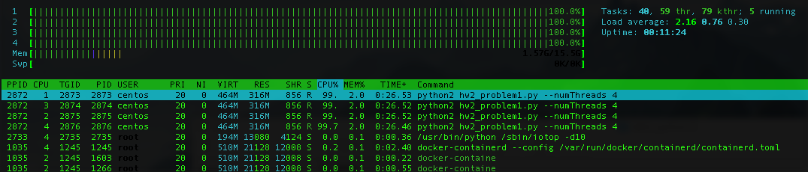
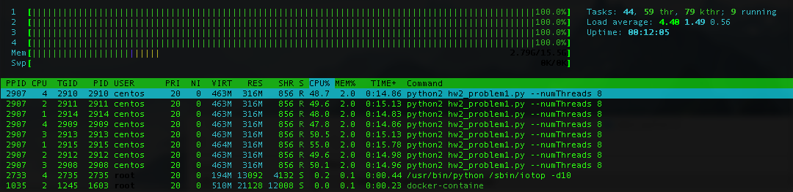

Completed all problems including problem 5.

### Problem 1
See `hw2_problem1.py`
```
```
Screenshots of the program launched with 2, 4, 8, and 16 threads on a **4 CPU** instance are included below:







### Problem 2
```

```
Screenshots of the program launched with 2, 4, 8, and 16 threads on a *4 CPU* instance are included below:


Although this is an IO-heavy task, when the number of threads becomes large, we also start placing a nontrivial load on the CPU. See below the screenshot with 16 threads:


### Problem 3


### Problem 4
See `hw2_problem4.py`:
```
```
The processed data are held inside of a nested python dictionary. The outer dict has keys for each URL. The value for each key is then another dict that has keys for each user and values that are counts for the number of vists that user made to the URL. The dictionaries look like `{url: {user: count}}`, and an example might look like `{'http://foo.com/bar': {'alice': 13}}`. To update the shared state, we acquire a lock before we modify the data structure and then remove the lock immediately after we finished the modification: this allows other worker threads to read and parse data in the log file simultaneously while another thread is updating a count, adding a new user, or adding a new URL.

This structure was chosen because it makes answering the queries easy:

1.  To get the number of unique urls, we simply count the length of the keys of the outer dict.
2.  To get the number of disctinct visitors to each URL, we count the number of values for each URL.
3.  To return the number of visits for each URL per user, sum all of the values of each URL's subdictionary.

The program's output follows below:
```
$ python3.6 hw2_problem4.py 
Number of distinct URLs: 101
Number of distinct visitors for each URL
http://example.com/?url=0: 45
http://example.com/?url=1: 45
http://example.com/?url=2: 45
http://example.com/?url=3: 45
http://example.com/?url=4: 45
http://example.com/?url=5: 21
http://example.com/?url=6: 21
http://example.com/?url=7: 21
http://example.com/?url=8: 21
http://example.com/?url=9: 21
http://example.com/?url=10: 21
http://example.com/?url=11: 21
http://example.com/?url=12: 21
http://example.com/?url=13: 21
http://example.com/?url=14: 21
http://example.com/?url=15: 21
http://example.com/?url=16: 21
http://example.com/?url=17: 21
http://example.com/?url=18: 21
http://example.com/?url=19: 21
http://example.com/?url=20: 21
http://example.com/?url=21: 21
http://example.com/?url=22: 21
http://example.com/?url=23: 21
http://example.com/?url=24: 21
http://example.com/?url=25: 21
http://example.com/?url=26: 21
http://example.com/?url=27: 21
http://example.com/?url=28: 21
http://example.com/?url=29: 21
http://example.com/?url=30: 21
http://example.com/?url=31: 21
http://example.com/?url=32: 21
http://example.com/?url=33: 21
http://example.com/?url=34: 21
http://example.com/?url=35: 21
http://example.com/?url=36: 21
http://example.com/?url=37: 21
http://example.com/?url=38: 21
http://example.com/?url=39: 21
http://example.com/?url=40: 21
http://example.com/?url=41: 21
http://example.com/?url=42: 21
http://example.com/?url=43: 21
http://example.com/?url=44: 21
http://example.com/?url=45: 21
http://example.com/?url=46: 21
http://example.com/?url=47: 21
http://example.com/?url=48: 21
http://example.com/?url=49: 21
http://example.com/?url=50: 21
http://example.com/?url=51: 21
http://example.com/?url=52: 21
http://example.com/?url=53: 21
http://example.com/?url=54: 21
http://example.com/?url=55: 21
http://example.com/?url=56: 21
http://example.com/?url=57: 21
http://example.com/?url=58: 21
http://example.com/?url=59: 21
http://example.com/?url=60: 21
http://example.com/?url=61: 21
http://example.com/?url=62: 21
http://example.com/?url=63: 21
http://example.com/?url=64: 21
http://example.com/?url=65: 21
http://example.com/?url=66: 21
http://example.com/?url=67: 21
http://example.com/?url=68: 21
http://example.com/?url=69: 21
http://example.com/?url=70: 21
http://example.com/?url=71: 21
http://example.com/?url=72: 21
http://example.com/?url=73: 21
http://example.com/?url=74: 21
http://example.com/?url=75: 21
http://example.com/?url=76: 21
http://example.com/?url=77: 21
http://example.com/?url=78: 21
http://example.com/?url=79: 21
http://example.com/?url=80: 21
http://example.com/?url=81: 21
http://example.com/?url=82: 21
http://example.com/?url=83: 21
http://example.com/?url=84: 21
http://example.com/?url=85: 21
http://example.com/?url=86: 21
http://example.com/?url=87: 21
http://example.com/?url=88: 21
http://example.com/?url=89: 21
http://example.com/?url=90: 21
http://example.com/?url=91: 21
http://example.com/?url=92: 21
http://example.com/?url=93: 21
http://example.com/?url=94: 21
http://example.com/?url=95: 21
http://example.com/?url=96: 21
http://example.com/?url=97: 21
http://example.com/?url=98: 21
http://example.com/?url=99: 21
http://example.com/?url=100: 21
Number of visits for each URL
http://example.com/?url=0: 10382
http://example.com/?url=1: 10382
http://example.com/?url=2: 10382
http://example.com/?url=3: 10382
http://example.com/?url=4: 10382
http://example.com/?url=5: 4532
http://example.com/?url=6: 4532
http://example.com/?url=7: 4532
http://example.com/?url=8: 4532
http://example.com/?url=9: 4532
http://example.com/?url=10: 4532
http://example.com/?url=11: 4532
http://example.com/?url=12: 4532
http://example.com/?url=13: 1932
http://example.com/?url=14: 1932
http://example.com/?url=15: 252
http://example.com/?url=16: 252
http://example.com/?url=17: 252
http://example.com/?url=18: 252
http://example.com/?url=19: 252
http://example.com/?url=20: 252
http://example.com/?url=21: 252
http://example.com/?url=22: 252
http://example.com/?url=23: 252
http://example.com/?url=24: 252
http://example.com/?url=25: 252
http://example.com/?url=26: 252
http://example.com/?url=27: 252
http://example.com/?url=28: 252
http://example.com/?url=29: 252
http://example.com/?url=30: 252
http://example.com/?url=31: 252
http://example.com/?url=32: 252
http://example.com/?url=33: 252
http://example.com/?url=34: 252
http://example.com/?url=35: 252
http://example.com/?url=36: 252
http://example.com/?url=37: 252
http://example.com/?url=38: 252
http://example.com/?url=39: 252
http://example.com/?url=40: 252
http://example.com/?url=41: 252
http://example.com/?url=42: 252
http://example.com/?url=43: 252
http://example.com/?url=44: 252
http://example.com/?url=45: 252
http://example.com/?url=46: 252
http://example.com/?url=47: 252
http://example.com/?url=48: 252
http://example.com/?url=49: 252
http://example.com/?url=50: 252
http://example.com/?url=51: 252
http://example.com/?url=52: 252
http://example.com/?url=53: 252
http://example.com/?url=54: 252
http://example.com/?url=55: 252
http://example.com/?url=56: 252
http://example.com/?url=57: 252
http://example.com/?url=58: 252
http://example.com/?url=59: 252
http://example.com/?url=60: 252
http://example.com/?url=61: 252
http://example.com/?url=62: 252
http://example.com/?url=63: 252
http://example.com/?url=64: 252
http://example.com/?url=65: 252
http://example.com/?url=66: 252
http://example.com/?url=67: 252
http://example.com/?url=68: 252
http://example.com/?url=69: 252
http://example.com/?url=70: 252
http://example.com/?url=71: 252
http://example.com/?url=72: 252
http://example.com/?url=73: 252
http://example.com/?url=74: 252
http://example.com/?url=75: 252
http://example.com/?url=76: 252
http://example.com/?url=77: 252
http://example.com/?url=78: 252
http://example.com/?url=79: 252
http://example.com/?url=80: 252
http://example.com/?url=81: 252
http://example.com/?url=82: 252
http://example.com/?url=83: 252
http://example.com/?url=84: 252
http://example.com/?url=85: 252
http://example.com/?url=86: 252
http://example.com/?url=87: 252
http://example.com/?url=88: 252
http://example.com/?url=89: 252
http://example.com/?url=90: 252
http://example.com/?url=91: 252
http://example.com/?url=92: 252
http://example.com/?url=93: 252
http://example.com/?url=94: 252
http://example.com/?url=95: 252
http://example.com/?url=96: 252
http://example.com/?url=97: 252
http://example.com/?url=98: 252
http://example.com/?url=99: 252
http://example.com/?url=100: 252
```

### Problem 5
To install the python package, we required `libmariadb-devel`. Then use `pip` to install the `mysqlclient` package in **python2**:
```
sudo yum install -y mariadb-devel python-devel
sudo pip install mysqlclient
```
Create a database `shaub` and specify the schema for the `logs` table:
```
> create database shaub;
Query OK, 1 row affected (0.00 sec)

> use shaub;
Database changed

create table logs(
uid char(32) primary key,
timestamp timestamp(6),
url varchar(100),
user_id varchar(30)
);
Query OK, 0 rows affected (0.01 sec)

```
When our application inserts a record, we will generate a hash of the data to uniqely identify that record. This will prevent duplicate records from being inserted.

Now run two instances concurrently of our program--one handling files 1 and 2 in two threads and the other handling files 3 and 4 in two threads. Note that we run with `sudo` so it can connect to the MariaDB sever, but in production we would instead designate username/password credentials to avoid granting excess privileges to the process:
```
sudo python2 hw2_problem5.py --startingFile 1 & sudo python2 hw2_problem5.py --startingFile 3
```
Now we can query our database (and ignore the `uid` column since the output is too verbose for this document).
```
> > select timestamp, url, user_id from logs limit 10;
+----------------------------+----------------------------+---------+
| timestamp                  | url                        | user_id |
+----------------------------+----------------------------+---------+
| 2018-02-02 15:55:26.349000 | http://example.com/?url=2  | User_10 |
| 2018-02-02 07:15:09.832000 | http://example.com/?url=12 | User_3  |
| 2018-02-02 09:46:27.832000 | http://example.com/?url=9  | User_4  |
| 2018-02-01 21:54:36.135000 | http://example.com/?url=33 | User_2  |
| 2018-02-03 06:30:10.152000 | http://example.com/?url=1  | User_43 |
| 2018-02-01 20:08:58.349000 | http://example.com/?url=10 | User_0  |
| 2018-02-02 08:23:35.349000 | http://example.com/?url=7  | User_6  |
| 2018-02-02 16:46:35.832000 | http://example.com/?url=12 | User_6  |
| 2018-02-02 09:15:14.832000 | http://example.com/?url=6  | User_4  |
| 2018-02-01 21:07:54.349000 | http://example.com/?url=3  | User_1  |
+----------------------------+----------------------------+---------+
10 rows in set (0.00 sec)
```

With the duplicates dropped, we have fewer records:
```
> select count(*) from logs;
+----------+
| count(*) |
+----------+
|   102544 |
+----------+
1 row in set (0.02 sec)
```

Note that this matches the number of unique records:
```
$ cat log_file_0*.txt | sort | uniq  | wc -l
  102544
```

Originally we had more records:
```
$ wc -l *.txt
  25452 log_file_01.txt
  33800 log_file_02.txt
  25200 log_file_03.txt
  29250 log_file_04.txt
 113702 total
```

We can use SQL to answer the three queries, but since we have removed duplicates our results will not always match our earlier analysis in **Problem 4** where duplicates were allowed.

For Q1:
```
> select count(distinct(url)) from logs;
+----------------------+
| count(distinct(url)) |
+----------------------+
|                  101 |
+----------------------+
1 row in set (0.05 sec)

```

For Q2:
```
> select url, count(distinct(user_id)) as num_visitors from logs group by url order by num_visitors desc;
+-----------------------------+--------------+
| url                         | num_visitors |
+-----------------------------+--------------+
| http://example.com/?url=0   |           45 |
| http://example.com/?url=4   |           45 |
| http://example.com/?url=1   |           45 |
| http://example.com/?url=3   |           45 |
| http://example.com/?url=2   |           45 |
| http://example.com/?url=66  |           21 |
| http://example.com/?url=80  |           21 |
| http://example.com/?url=95  |           21 |
| http://example.com/?url=22  |           21 |
| http://example.com/?url=37  |           21 |
| http://example.com/?url=51  |           21 |
| http://example.com/?url=58  |           21 |
| http://example.com/?url=72  |           21 |
| http://example.com/?url=87  |           21 |
| http://example.com/?url=14  |           21 |
| http://example.com/?url=29  |           21 |
| http://example.com/?url=43  |           21 |
| http://example.com/?url=64  |           21 |
| http://example.com/?url=79  |           21 |
| http://example.com/?url=93  |           21 |
| http://example.com/?url=20  |           21 |
| http://example.com/?url=35  |           21 |
| http://example.com/?url=5   |           21 |
| http://example.com/?url=70  |           21 |
| http://example.com/?url=85  |           21 |
| http://example.com/?url=12  |           21 |
| http://example.com/?url=27  |           21 |
| http://example.com/?url=41  |           21 |
| http://example.com/?url=56  |           21 |
| http://example.com/?url=62  |           21 |
| http://example.com/?url=77  |           21 |
| http://example.com/?url=91  |           21 |
| http://example.com/?url=19  |           21 |
| http://example.com/?url=33  |           21 |
| http://example.com/?url=48  |           21 |
| http://example.com/?url=69  |           21 |
| http://example.com/?url=83  |           21 |
| http://example.com/?url=98  |           21 |
| http://example.com/?url=100 |           21 |
| http://example.com/?url=25  |           21 |
| http://example.com/?url=54  |           21 |
| http://example.com/?url=60  |           21 |
| http://example.com/?url=75  |           21 |
| http://example.com/?url=9   |           21 |
| http://example.com/?url=17  |           21 |
| http://example.com/?url=31  |           21 |
| http://example.com/?url=46  |           21 |
| http://example.com/?url=67  |           21 |
| http://example.com/?url=81  |           21 |
| http://example.com/?url=96  |           21 |
| http://example.com/?url=23  |           21 |
| http://example.com/?url=38  |           21 |
| http://example.com/?url=52  |           21 |
| http://example.com/?url=59  |           21 |
| http://example.com/?url=73  |           21 |
| http://example.com/?url=88  |           21 |
| http://example.com/?url=15  |           21 |
| http://example.com/?url=44  |           21 |
| http://example.com/?url=65  |           21 |
| http://example.com/?url=8   |           21 |
| http://example.com/?url=94  |           21 |
| http://example.com/?url=21  |           21 |
| http://example.com/?url=36  |           21 |
| http://example.com/?url=50  |           21 |
| http://example.com/?url=71  |           21 |
| http://example.com/?url=86  |           21 |
| http://example.com/?url=13  |           21 |
| http://example.com/?url=28  |           21 |
| http://example.com/?url=42  |           21 |
| http://example.com/?url=57  |           21 |
| http://example.com/?url=63  |           21 |
| http://example.com/?url=78  |           21 |
| http://example.com/?url=92  |           21 |
| http://example.com/?url=34  |           21 |
| http://example.com/?url=49  |           21 |
| http://example.com/?url=7   |           21 |
| http://example.com/?url=84  |           21 |
| http://example.com/?url=99  |           21 |
| http://example.com/?url=11  |           21 |
| http://example.com/?url=26  |           21 |
| http://example.com/?url=40  |           21 |
| http://example.com/?url=55  |           21 |
| http://example.com/?url=61  |           21 |
| http://example.com/?url=76  |           21 |
| http://example.com/?url=90  |           21 |
| http://example.com/?url=18  |           21 |
| http://example.com/?url=32  |           21 |
| http://example.com/?url=47  |           21 |
| http://example.com/?url=68  |           21 |
| http://example.com/?url=82  |           21 |
| http://example.com/?url=97  |           21 |
| http://example.com/?url=10  |           21 |
| http://example.com/?url=24  |           21 |
| http://example.com/?url=39  |           21 |
| http://example.com/?url=53  |           21 |
| http://example.com/?url=6   |           21 |
| http://example.com/?url=74  |           21 |
| http://example.com/?url=89  |           21 |
| http://example.com/?url=16  |           21 |
| http://example.com/?url=30  |           21 |
| http://example.com/?url=45  |           21 |
+-----------------------------+--------------+
101 rows in set (0.17 sec)


```

For Q3:
```
> select url, count(*) as num_events from logs group by url order by num_events desc;
+-----------------------------+------------+
| url                         | num_events |
+-----------------------------+------------+
| http://example.com/?url=2   |       9372 |
| http://example.com/?url=0   |       9348 |
| http://example.com/?url=3   |       9347 |
| http://example.com/?url=1   |       9344 |
| http://example.com/?url=4   |       9316 |
| http://example.com/?url=12  |       4103 |
| http://example.com/?url=9   |       4090 |
| http://example.com/?url=6   |       4087 |
| http://example.com/?url=8   |       4083 |
| http://example.com/?url=5   |       4071 |
| http://example.com/?url=7   |       4066 |
| http://example.com/?url=11  |       4062 |
| http://example.com/?url=10  |       4053 |
| http://example.com/?url=13  |       1752 |
| http://example.com/?url=14  |       1735 |
| http://example.com/?url=85  |        240 |
| http://example.com/?url=89  |        239 |
| http://example.com/?url=82  |        239 |
| http://example.com/?url=47  |        235 |
| http://example.com/?url=51  |        235 |
| http://example.com/?url=64  |        235 |
| http://example.com/?url=65  |        235 |
| http://example.com/?url=39  |        234 |
| http://example.com/?url=45  |        234 |
| http://example.com/?url=42  |        234 |
| http://example.com/?url=81  |        234 |
| http://example.com/?url=30  |        233 |
| http://example.com/?url=88  |        233 |
| http://example.com/?url=60  |        233 |
| http://example.com/?url=17  |        233 |
| http://example.com/?url=67  |        233 |
| http://example.com/?url=31  |        233 |
| http://example.com/?url=96  |        233 |
| http://example.com/?url=73  |        233 |
| http://example.com/?url=71  |        233 |
| http://example.com/?url=23  |        233 |
| http://example.com/?url=16  |        232 |
| http://example.com/?url=52  |        232 |
| http://example.com/?url=91  |        232 |
| http://example.com/?url=22  |        232 |
| http://example.com/?url=26  |        232 |
| http://example.com/?url=69  |        232 |
| http://example.com/?url=61  |        232 |
| http://example.com/?url=66  |        232 |
| http://example.com/?url=21  |        231 |
| http://example.com/?url=100 |        231 |
| http://example.com/?url=77  |        231 |
| http://example.com/?url=48  |        231 |
| http://example.com/?url=80  |        231 |
| http://example.com/?url=20  |        231 |
| http://example.com/?url=62  |        231 |
| http://example.com/?url=83  |        230 |
| http://example.com/?url=95  |        230 |
| http://example.com/?url=50  |        230 |
| http://example.com/?url=29  |        230 |
| http://example.com/?url=49  |        230 |
| http://example.com/?url=58  |        230 |
| http://example.com/?url=76  |        229 |
| http://example.com/?url=74  |        229 |
| http://example.com/?url=32  |        229 |
| http://example.com/?url=70  |        229 |
| http://example.com/?url=63  |        229 |
| http://example.com/?url=19  |        229 |
| http://example.com/?url=33  |        229 |
| http://example.com/?url=78  |        229 |
| http://example.com/?url=90  |        229 |
| http://example.com/?url=93  |        229 |
| http://example.com/?url=92  |        229 |
| http://example.com/?url=18  |        229 |
| http://example.com/?url=97  |        228 |
| http://example.com/?url=59  |        228 |
| http://example.com/?url=68  |        228 |
| http://example.com/?url=86  |        228 |
| http://example.com/?url=46  |        228 |
| http://example.com/?url=40  |        228 |
| http://example.com/?url=44  |        228 |
| http://example.com/?url=35  |        227 |
| http://example.com/?url=94  |        227 |
| http://example.com/?url=41  |        227 |
| http://example.com/?url=27  |        227 |
| http://example.com/?url=72  |        227 |
| http://example.com/?url=37  |        226 |
| http://example.com/?url=99  |        226 |
| http://example.com/?url=54  |        226 |
| http://example.com/?url=34  |        226 |
| http://example.com/?url=24  |        226 |
| http://example.com/?url=75  |        225 |
| http://example.com/?url=36  |        225 |
| http://example.com/?url=84  |        225 |
| http://example.com/?url=25  |        224 |
| http://example.com/?url=98  |        224 |
| http://example.com/?url=87  |        224 |
| http://example.com/?url=43  |        223 |
| http://example.com/?url=55  |        223 |
| http://example.com/?url=53  |        222 |
| http://example.com/?url=79  |        222 |
| http://example.com/?url=28  |        222 |
| http://example.com/?url=57  |        220 |
| http://example.com/?url=56  |        219 |
| http://example.com/?url=38  |        216 |
| http://example.com/?url=15  |        215 |
+-----------------------------+------------+
101 rows in set (0.07 sec)

```
