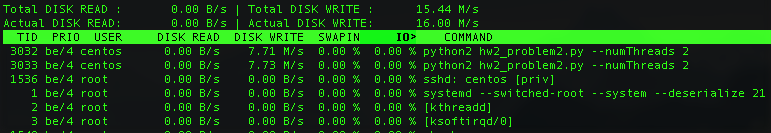
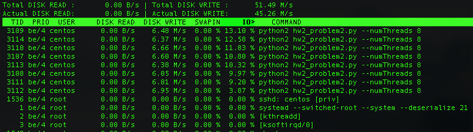
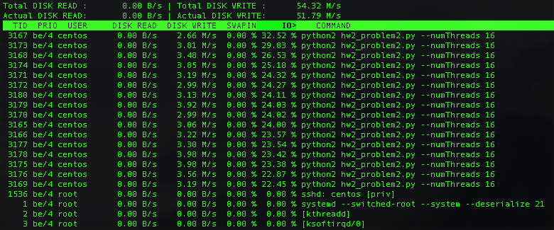

Completed all problems including problem 5.

### Problem 1
See `hw2_problem1.py`
```
```
Screenshots of the program launched with 2, 4, 8, and 16 threads on a **4 CPU** instance are included below:

2 Threads


4 Threads


8 Threads


16 Threads


### Problem 2
```

```
Screenshots of the program launched with 2, 4, 8, and 16 threads on a *4 CPU* instance are included below:

2 Threads



4 Threads


8 Threads



16 Threads



Although this is an IO-heavy task, when the number of threads becomes large, we also start placing a nontrivial load on the CPU. See below the screenshot with 16 threads:


### Problem 3

### Problem 4
See `hw2_problem4.py`:
```
"""
Load 4 logfiles--each with a thread--and answer 3 queries about the data
"""
import threading
from multiprocessing.dummy import Pool as ThreadPool

SEP = '\t'
class LogProcessor(object):
    """
    A class for processing log files and printing information about them
    """
    def __init__(self, num_files=4):
        """
        Constructor
        :param num_files: The number of files (and threads)
        """
        self.num_threads = num_files
        # Lock for the shared state
        self.lock = threading.Lock()
        # The shared state, stored as nested dict
        self.shared = {}
        # The filenames to process
        self.files = ['log_file_0' + str(i + 1) + '.txt' for i in range(num_files)]

    def process_data(self, url, user):
        """
        Add a single observation to the shared state
        :param timestamp: The timestamp of the observation
        :param url: The URL of the observation
        :param user: The uesr of the observation
        """
        try:
            # Test if the URL exists already
            _ = self.shared[url]
            try:
                # Now test if the subdict exists
                count = self.shared[url][user]
                # Increment the count
                self.shared[url][user] = count + 1
            except KeyError:
                # User does not exist in subdict, so create it
                self.shared[url][user] = 1
        except KeyError:
            # URL does not exist, so create it and a subdict with the user
            self.shared[url] = {user: 1}

    def process_log(self, filename):
        """
        Process a single logfile
        :param filename: The filename of the log to process
        """
        with open(filename, 'r') as file_con:
            # Read first line
            line = file_con.readline()
            # Stop reading on EOF
            while line:
                # Split the string into a list with timestamp, URL, and user
                parsed = line.split(SEP)
                # Timestamp isn't actually needed
                url = parsed[1]
                # User has trailing newline
                user = parsed[2].split('\n')[0]
                self.lock.acquire()
                self.process_data(url, user)
                self.lock.release()
                # Read next line
                line = file_con.readline()

    def process_all(self):
        """
        Process all the log files. Use one thread for each log file.
        """
        pool = ThreadPool(self.num_threads)
        _ = pool.map(lambda x: self.process_log(filename=x), self.files)

    def print_results(self):
        """
        Print all the results
        """
        self.print_q1()
        self.print_q2()
        self.print_q3()

    def print_q1(self):
        """
        Print the results for the first query
        Count of unique URLs
        """
        num_logs = len(self.shared)
        print('Number of distinct URLs: {}'.format(num_logs))

    def print_q2(self):
        """
        Print the results for the second query
        Count of unique visitors per URL
        """
        print('Number of distinct visitors for each URL')
        for url in self.shared:
            num_visitors = len(self.shared[url])
            print('{}: {}'.format(url, num_visitors))

    def print_q3(self):
        """
        Print the results for the third query
        Number of visits for each URL per user
        """
        print('Number of visits for each URL-user combination')
        for url in self.shared:
            for user in self.shared[url]:
                num_visits = self.shared[url][user]
                print('{}: {}: {}'.format(url, user, num_visits))

log_processor = LogProcessor()
log_processor.process_all()
log_processor.print_results()
```
The processed data are held inside of a nested python dictionary. The outer dict has keys for each URL. The value for each key is then another dict that has keys for each user and values that are counts for the number of vists that user made to the URL. So the dictionaries look like `{url: {user: count}}`, and an example might look like `{'http://www.foo.com/bar': {'alice': 13}}`. To update the shared state, we acquire a lock before we modify the data structure and then remove the lock immediately after we finished the modification: this allows other worker threads to read and parse data in the log file simultaneously while another thread is updating a count, adding a new user, or adding a new URL.

This structure was chosen because it makes answering the queries relatively easy.

1.  To get the number of unique urls, we simply need to count the length of the keys of the outer dict.
2.  To get the number of disctinct visitors to each URL, we count the number of values for each URL.
3.  To return the number of visits for each URL per user, sum all of the values of each URL's subdictionary.


### Problem 5
To install the python package, we required `libmariadb-devel`. Then use `pip` to install the `mysqlclient` package in python2:
```
sudo yum install -y libmariadb-devel
pip install mysqlclient
```
Create a database `shaub` and specify the schema for the `logs` table:
```
create database shaub;
use shaub;
create table logs(
uid char(32) primary key,
timestamp timestamp(6),
url varchar(100),
user_id varchar(30)
);
```
When our application inserts a record, we will generate a hash of the data to uniqely identify that record.

Now run two instances concurrently of our program--one handlings files 1 and 2 and the other handling files 3 and 4. Note that we run with `sudo` so it can connect to the MariaDB sever, but in production we would instead designate username/password credentials to avoid granting excess privileges to the process:
```
sudo python hw2_problem5.py --startingFile 1 & sudo python hw2_problem5.py --startingFile 3
```
