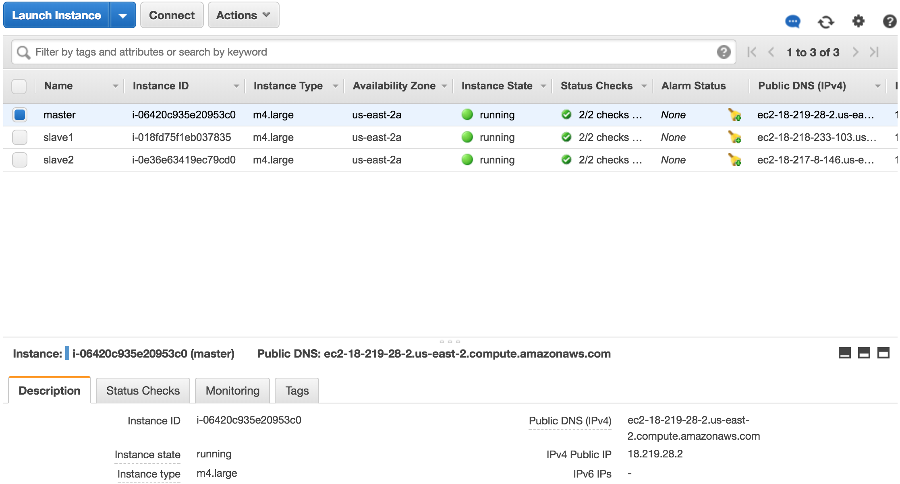

All problems were completed, including problem 5.

## Problem 1

Our cluster has one master node and two slave nodes:



Note that the second screenshot showing the individual instances is from a second cluster that was launched to rerun several of the map reduce jobs.

We connect to the master node:
```
$ ssh -i ~/ohio.pem hadoop@ec2-18-221-60-255.us-east-2.compute.amazonaws.com
The authenticity of host 'ec2-18-221-60-255.us-east-2.compute.amazonaws.com (18.221.60.255)' can't be established.
ECDSA key fingerprint is SHA256:753xHLDs0hHFD/hr6b3y0a9yyCDzULJHXKSYUvJQm/Y.
Are you sure you want to continue connecting (yes/no)? yes
Warning: Permanently added 'ec2-18-221-60-255.us-east-2.compute.amazonaws.com,18.221.60.255' (ECDSA) to the list of known hosts.

       __|  __|_  )
       _|  (     /   Amazon Linux AMI
      ___|\___|___|

https://aws.amazon.com/amazon-linux-ami/2017.09-release-notes/
11 package(s) needed for security, out of 13 available
Run "sudo yum update" to apply all updates.
                                                                    
EEEEEEEEEEEEEEEEEEEE MMMMMMMM           MMMMMMMM RRRRRRRRRRRRRRR    
E::::::::::::::::::E M:::::::M         M:::::::M R::::::::::::::R   
EE:::::EEEEEEEEE:::E M::::::::M       M::::::::M R:::::RRRRRR:::::R 
  E::::E       EEEEE M:::::::::M     M:::::::::M RR::::R      R::::R
  E::::E             M::::::M:::M   M:::M::::::M   R:::R      R::::R
  E:::::EEEEEEEEEE   M:::::M M:::M M:::M M:::::M   R:::RRRRRR:::::R 
  E::::::::::::::E   M:::::M  M:::M:::M  M:::::M   R:::::::::::RR   
  E:::::EEEEEEEEEE   M:::::M   M:::::M   M:::::M   R:::RRRRRR::::R  
  E::::E             M:::::M    M:::M    M:::::M   R:::R      R::::R
  E::::E       EEEEE M:::::M     MMM     M:::::M   R:::R      R::::R
EE:::::EEEEEEEE::::E M:::::M             M:::::M   R:::R      R::::R
E::::::::::::::::::E M:::::M             M:::::M RR::::R      R::::R
EEEEEEEEEEEEEEEEEEEE MMMMMMM             MMMMMMM RRRRRRR      RRRRRR
```

Using the `hdfs version` command we can see which version we have:


We perform some manipulations on hdfs (i.e. creating a directory, copying our data files, verifying our files have been copied):


## Problem 2

We upload the log files to a S3 bucket:


We launch the job on our S3 data:
```
$ $ hadoop jar /usr/lib/hadoop-mapreduce/hadoop-mapreduce-examples.jar wordcount s3n://aws-logs-607380799823-us-east-2/logs/ s3n://aws-logs-607380799823-us-east-2/wordcountoutput
18/02/16 06:21:53 INFO impl.TimelineClientImpl: Timeline service address: http://ip-172-31-6-65.us-east-2.compute.internal:8188/ws/v1/timeline/
18/02/16 06:21:53 INFO client.RMProxy: Connecting to ResourceManager at ip-172-31-6-65.us-east-2.compute.internal/172.31.6.65:8032
18/02/16 06:21:54 INFO input.FileInputFormat: Total input paths to process : 4
18/02/16 06:21:54 INFO lzo.GPLNativeCodeLoader: Loaded native gpl library
18/02/16 06:21:55 INFO lzo.LzoCodec: Successfully loaded & initialized native-lzo library [hadoop-lzo rev fc548a0642e795113789414490c9e59e6a8b91e4]
18/02/16 06:21:55 INFO mapreduce.JobSubmitter: number of splits:4
18/02/16 06:21:55 INFO mapreduce.JobSubmitter: Submitting tokens for job: job_1518759988148_0001
18/02/16 06:21:55 INFO impl.YarnClientImpl: Submitted application application_1518759988148_0001
18/02/16 06:21:56 INFO mapreduce.Job: The url to track the job: http://ip-172-31-6-65.us-east-2.compute.internal:20888/proxy/application_1518759988148_0001/
18/02/16 06:21:56 INFO mapreduce.Job: Running job: job_1518759988148_0001
18/02/16 06:22:07 INFO mapreduce.Job: Job job_1518759988148_0001 running in uber mode : false
18/02/16 06:22:07 INFO mapreduce.Job:  map 0% reduce 0%
18/02/16 06:22:21 INFO mapreduce.Job:  map 25% reduce 0%
18/02/16 06:22:23 INFO mapreduce.Job:  map 50% reduce 0%
18/02/16 06:22:24 INFO mapreduce.Job:  map 75% reduce 0%
18/02/16 06:22:25 INFO mapreduce.Job:  map 100% reduce 0%
18/02/16 06:22:30 INFO mapreduce.Job:  map 100% reduce 33%
18/02/16 06:22:36 INFO mapreduce.Job:  map 100% reduce 67%
18/02/16 06:22:37 INFO mapreduce.Job:  map 100% reduce 100%
18/02/16 06:22:38 INFO mapreduce.Job: Job job_1518759988148_0001 completed successfully
18/02/16 06:22:38 INFO mapreduce.Job: Counters: 56
	File System Counters
		FILE: Number of bytes read=21553
		FILE: Number of bytes written=938759
		FILE: Number of read operations=0
		FILE: Number of large read operations=0
		FILE: Number of write operations=0
		HDFS: Number of bytes read=472
		HDFS: Number of bytes written=0
		HDFS: Number of read operations=4
		HDFS: Number of large read operations=0
		HDFS: Number of write operations=0
		S3N: Number of bytes read=13998750
		S3N: Number of bytes written=102484
		S3N: Number of read operations=0
		S3N: Number of large read operations=0
		S3N: Number of write operations=0
	Job Counters 
		Killed map tasks=1
		Killed reduce tasks=1
		Launched map tasks=4
		Launched reduce tasks=3
		Data-local map tasks=4
		Total time spent by all maps in occupied slots (ms)=2744160
		Total time spent by all reduces in occupied slots (ms)=2838048
		Total time spent by all map tasks (ms)=57170
		Total time spent by all reduce tasks (ms)=29563
		Total vcore-milliseconds taken by all map tasks=57170
		Total vcore-milliseconds taken by all reduce tasks=29563
		Total megabyte-milliseconds taken by all map tasks=87813120
		Total megabyte-milliseconds taken by all reduce tasks=90817536
	Map-Reduce Framework
		Map input records=243750
		Map output records=731250
		Map output bytes=16923750
		Map output materialized bytes=24847
		Input split bytes=472
		Combine input records=731250
		Combine output records=3822
		Reduce input groups=3768
		Reduce shuffle bytes=24847
		Reduce input records=3822
		Reduce output records=3768
		Spilled Records=7644
		Shuffled Maps =12
		Failed Shuffles=0
		Merged Map outputs=12
		GC time elapsed (ms)=2583
		CPU time spent (ms)=16510
		Physical memory (bytes) snapshot=3460730880
		Virtual memory (bytes) snapshot=27196649472
		Total committed heap usage (bytes)=3340763136
	Shuffle Errors
		BAD_ID=0
		CONNECTION=0
		IO_ERROR=0
		WRONG_LENGTH=0
		WRONG_MAP=0
		WRONG_REDUCE=0
	File Input Format Counters 
		Bytes Read=13998750
	File Output Format Counters 
		Bytes Written=102484
```

We see from the job output that we had **4** mappers and **3** reducers with **4** splits.

## Problem 3

**Q1**

The mapper is `p3_q1_mapper.py`:
```
#!/usr/bin/python

import sys

for line in sys.stdin:
    current_line = line.strip().split('\t')
    if current_line is not None:
        url = current_line[1]
        # Send all URLs to the same reducer. Since our data is not too large, we can get away
        # with this. If we really had "Big Data" and wished to reduce the load better, we should
        # utilize a combiner here so far fewer duplicate rows of input must be processed by the reducer.
        # Or we could implement a two-stage MR job as mentioned in the reducer comments.
        print("1\t{}".format(url))

```

The reducer is `p3_q1_reducer.py`:
```
#!/usr/bin/python

import sys

current_user = None
count = 0

# For our data we do not have that many distinct users. If the cardinality of this was very large,
# this set would not be safe for memory. The solution is to use a two stage MR job.
all_users = set()

for line in sys.stdin:
    current_line = line.strip().split('\t')
    if len(current_line) == 2:
        user = current_line[1]
        # If we have very high cardinality for number of users, this implementation is not memory safe.
        # For our dataset this is not a problem, but if it were we could do a two-stage MR job
        # Where the first job is a "word count" type job and the second stage then returns
        # a count for the total number of records.
        all_users.add(user)

print(len(all_users))

```

We run our map-reduce program on a single node:
```
$ cat logs_*.txt | ./p3_q1_mapper.py | sort | ./p3_q1_reducer.py
13

```
We can also validate that this is the correct result by comparing a shell one-liner:
```
$ cat logs_*.txt | gawk '{print $2}' | sort | uniq | wc -l
13

```

We launch the Hadoop job:
```
$ hadoop jar /usr/lib/hadoop-mapreduce/hadoop-streaming.jar -mapper p3_q1_mapper.py -reducer p3_q1_reducer.py -file p3_q1_mapper.py -file p3_q1_reducer.py -input hdfs:///user/hadoop/input/ -output hdfs:///usr/hadoop/p3_q1
18/02/17 02:03:24 WARN streaming.StreamJob: -file option is deprecated, please use generic option -files instead.
packageJobJar: [p3_q1_mapper.py, p3_q1_reducer.py] [/usr/lib/hadoop/hadoop-streaming-2.7.3-amzn-6.jar] /tmp/streamjob4146106047656784771.jar tmpDir=null
18/02/17 02:03:26 INFO impl.TimelineClientImpl: Timeline service address: http://ip-172-31-13-128.us-east-2.compute.internal:8188/ws/v1/timeline/
18/02/17 02:03:26 INFO client.RMProxy: Connecting to ResourceManager at ip-172-31-13-128.us-east-2.compute.internal/172.31.13.128:8032
18/02/17 02:03:26 INFO impl.TimelineClientImpl: Timeline service address: http://ip-172-31-13-128.us-east-2.compute.internal:8188/ws/v1/timeline/
18/02/17 02:03:26 INFO client.RMProxy: Connecting to ResourceManager at ip-172-31-13-128.us-east-2.compute.internal/172.31.13.128:8032
18/02/17 02:03:27 INFO lzo.GPLNativeCodeLoader: Loaded native gpl library
18/02/17 02:03:27 INFO lzo.LzoCodec: Successfully loaded & initialized native-lzo library [hadoop-lzo rev fc548a0642e795113789414490c9e59e6a8b91e4]
18/02/17 02:03:27 INFO mapred.FileInputFormat: Total input paths to process : 4
18/02/17 02:03:28 INFO mapreduce.JobSubmitter: number of splits:8
18/02/17 02:03:28 INFO mapreduce.JobSubmitter: Submitting tokens for job: job_1518832184941_0002
18/02/17 02:03:29 INFO impl.YarnClientImpl: Submitted application application_1518832184941_0002
18/02/17 02:03:30 INFO mapreduce.Job: The url to track the job: http://ip-172-31-13-128.us-east-2.compute.internal:20888/proxy/application_1518832184941_0002/
18/02/17 02:03:30 INFO mapreduce.Job: Running job: job_1518832184941_0002
18/02/17 02:03:39 INFO mapreduce.Job: Job job_1518832184941_0002 running in uber mode : false
18/02/17 02:03:39 INFO mapreduce.Job:  map 0% reduce 0%
18/02/17 02:03:48 INFO mapreduce.Job:  map 25% reduce 0%
18/02/17 02:03:55 INFO mapreduce.Job:  map 38% reduce 0%
18/02/17 02:03:56 INFO mapreduce.Job:  map 75% reduce 0%
18/02/17 02:03:57 INFO mapreduce.Job:  map 100% reduce 0%
18/02/17 02:04:01 INFO mapreduce.Job:  map 100% reduce 33%
18/02/17 02:04:04 INFO mapreduce.Job:  map 100% reduce 67%
18/02/17 02:04:05 INFO mapreduce.Job:  map 100% reduce 100%
18/02/17 02:04:05 INFO mapreduce.Job: Job job_1518832184941_0002 completed successfully
18/02/17 02:04:05 INFO mapreduce.Job: Counters: 50
	File System Counters
		FILE: Number of bytes read=354667
		FILE: Number of bytes written=2147876
		FILE: Number of read operations=0
		FILE: Number of large read operations=0
		FILE: Number of write operations=0
		HDFS: Number of bytes read=14078354
		HDFS: Number of bytes written=4
		HDFS: Number of read operations=33
		HDFS: Number of large read operations=0
		HDFS: Number of write operations=6
	Job Counters 
		Killed map tasks=1
		Launched map tasks=8
		Launched reduce tasks=3
		Data-local map tasks=8
		Total time spent by all maps in occupied slots (ms)=4246224
		Total time spent by all reduces in occupied slots (ms)=1821024
		Total time spent by all map tasks (ms)=88463
		Total time spent by all reduce tasks (ms)=18969
		Total vcore-milliseconds taken by all map tasks=88463
		Total vcore-milliseconds taken by all reduce tasks=18969
		Total megabyte-milliseconds taken by all map tasks=135879168
		Total megabyte-milliseconds taken by all reduce tasks=58272768
	Map-Reduce Framework
		Map input records=243750
		Map output records=243750
		Map output bytes=6881250
		Map output materialized bytes=355070
		Input split bytes=1088
		Combine input records=0
		Combine output records=0
		Reduce input groups=1
		Reduce shuffle bytes=355070
		Reduce input records=243750
		Reduce output records=1
		Spilled Records=487500
		Shuffled Maps =24
		Failed Shuffles=0
		Merged Map outputs=24
		GC time elapsed (ms)=2100
		CPU time spent (ms)=13100
		Physical memory (bytes) snapshot=3905753088
		Virtual memory (bytes) snapshot=40065871872
		Total committed heap usage (bytes)=3618635776
	Shuffle Errors
		BAD_ID=0
		CONNECTION=0
		IO_ERROR=0
		WRONG_LENGTH=0
		WRONG_MAP=0
		WRONG_REDUCE=0
	File Input Format Counters 
		Bytes Read=14077266
	File Output Format Counters 
		Bytes Written=4
18/02/17 02:04:05 INFO streaming.StreamJob: Output directory: hdfs:///usr/hadoop/p3_q1
```
This job executed with **8** splits and **8** mappers and **3** reducers.

Examining the output:
```
$ hadoop fs -ls hdfs:///usr/hadoop/p3_q1
Found 4 items
-rw-r--r--   1 hadoop hadoop          0 2018-02-17 02:04 hdfs:///usr/hadoop/p3_q1/_SUCCESS
-rw-r--r--   1 hadoop hadoop          0 2018-02-17 02:04 hdfs:///usr/hadoop/p3_q1/part-00000
-rw-r--r--   1 hadoop hadoop          0 2018-02-17 02:03 hdfs:///usr/hadoop/p3_q1/part-00001
-rw-r--r--   1 hadoop hadoop          4 2018-02-17 02:04 hdfs:///usr/hadoop/p3_q1/part-00002
$ hadoop fs -cat hdfs:///usr/hadoop/p3_q1/*
13	
```

**Q2**

The mapper is `p3_q2_mapper.py`:
```
#!/usr/bin/python

import sys

for line in sys.stdin:
    current_line = line.strip().split('\t')
    if current_line is not None:
        url = current_line[1]
        user = current_line[2]
        # Build key of url and value of user
        print("{}\t{}".format(url, user))
```

The reducer is `p3_q2_reducer.py`:
```
#!/usr/bin/python

import sys

current_url = None
count = 0
# For our data we do not have that many users for each URL. If the cardinality of this was very large,
# this set would not be safe for memory. The solution is to once again use a two stage MR job.
distinct_users = set()

for line in sys.stdin:
    try:
        url, user = line.strip().split('\t')
        # If same URL, we might increment count
        if url == current_url:
            distinct_users.add(user)
        else:
            # Only emit results if there is data
            if len(distinct_users) > 0:
                print("{}\t{}".format(current_url, len(distinct_users)))
            distinct_users = set()
        current_url = url
    except ValueError:
        continue

if len(distinct_users) > 0:
    print("{}\t{}".format(current_url, len(distinct_users)))
```

We run our map-reduce program on a single node:
```
$ cat logs_*.txt | ./p3_q2_mapper.py | sort | ./p3_q2_reducer.py 
http://example.com/?url=0	5
http://example.com/?url=1	5
http://example.com/?url=10	5
http://example.com/?url=11	5
http://example.com/?url=12	5
http://example.com/?url=2	5
http://example.com/?url=3	5
http://example.com/?url=4	5
http://example.com/?url=5	5
http://example.com/?url=6	5
http://example.com/?url=7	5
http://example.com/?url=8	5
http://example.com/?url=9	5
```

And a similar shell verification:
```
$ cat logs_*.txt | gawk '{print $2, $3}' | sort | uniq | gawk '{print $1}' | sort | uniq -c
   5 http://example.com/?url=0
   5 http://example.com/?url=1
   5 http://example.com/?url=10
   5 http://example.com/?url=11
   5 http://example.com/?url=12
   5 http://example.com/?url=2
   5 http://example.com/?url=3
   5 http://example.com/?url=4
   5 http://example.com/?url=5
   5 http://example.com/?url=6
   5 http://example.com/?url=7
   5 http://example.com/?url=8
   5 http://example.com/?url=9
```
We launch the Hadoop job:
```
$ hadoop jar /usr/lib/hadoop-mapreduce/hadoop-streaming.jar -mapper p3_q2_mapper.py -reducer p3_q2_reducer.py -file p3_q2_mapper.py -file p3_q2_reducer.py -input hdfs:///user/hadoop/input/ -output hdfs:///usr/hadoop/p3_q2
18/02/17 02:07:41 WARN streaming.StreamJob: -file option is deprecated, please use generic option -files instead.
packageJobJar: [p3_q2_mapper.py, p3_q2_reducer.py] [/usr/lib/hadoop/hadoop-streaming-2.7.3-amzn-6.jar] /tmp/streamjob3916501766417120251.jar tmpDir=null
18/02/17 02:07:43 INFO impl.TimelineClientImpl: Timeline service address: http://ip-172-31-13-128.us-east-2.compute.internal:8188/ws/v1/timeline/
18/02/17 02:07:43 INFO client.RMProxy: Connecting to ResourceManager at ip-172-31-13-128.us-east-2.compute.internal/172.31.13.128:8032
18/02/17 02:07:44 INFO impl.TimelineClientImpl: Timeline service address: http://ip-172-31-13-128.us-east-2.compute.internal:8188/ws/v1/timeline/
18/02/17 02:07:44 INFO client.RMProxy: Connecting to ResourceManager at ip-172-31-13-128.us-east-2.compute.internal/172.31.13.128:8032
18/02/17 02:07:45 INFO lzo.GPLNativeCodeLoader: Loaded native gpl library
18/02/17 02:07:45 INFO lzo.LzoCodec: Successfully loaded & initialized native-lzo library [hadoop-lzo rev fc548a0642e795113789414490c9e59e6a8b91e4]
18/02/17 02:07:45 INFO mapred.FileInputFormat: Total input paths to process : 4
18/02/17 02:07:45 INFO mapreduce.JobSubmitter: number of splits:8
18/02/17 02:07:45 INFO mapreduce.JobSubmitter: Submitting tokens for job: job_1518832184941_0003
18/02/17 02:07:46 INFO impl.YarnClientImpl: Submitted application application_1518832184941_0003
18/02/17 02:07:46 INFO mapreduce.Job: The url to track the job: http://ip-172-31-13-128.us-east-2.compute.internal:20888/proxy/application_1518832184941_0003/
18/02/17 02:07:46 INFO mapreduce.Job: Running job: job_1518832184941_0003
18/02/17 02:07:53 INFO mapreduce.Job: Job job_1518832184941_0003 running in uber mode : false
18/02/17 02:07:53 INFO mapreduce.Job:  map 0% reduce 0%
18/02/17 02:08:02 INFO mapreduce.Job:  map 25% reduce 0%
18/02/17 02:08:10 INFO mapreduce.Job:  map 100% reduce 0%
18/02/17 02:08:15 INFO mapreduce.Job:  map 100% reduce 33%
18/02/17 02:08:17 INFO mapreduce.Job:  map 100% reduce 67%
18/02/17 02:08:19 INFO mapreduce.Job:  map 100% reduce 100%
18/02/17 02:08:19 INFO mapreduce.Job: Job job_1518832184941_0003 completed successfully
18/02/17 02:08:19 INFO mapreduce.Job: Counters: 50
	File System Counters
		FILE: Number of bytes read=418970
		FILE: Number of bytes written=2277949
		FILE: Number of read operations=0
		FILE: Number of large read operations=0
		FILE: Number of write operations=0
		HDFS: Number of bytes read=14078354
		HDFS: Number of bytes written=367
		HDFS: Number of read operations=33
		HDFS: Number of large read operations=0
		HDFS: Number of write operations=6
	Job Counters 
		Killed map tasks=1
		Launched map tasks=8
		Launched reduce tasks=3
		Data-local map tasks=8
		Total time spent by all maps in occupied slots (ms)=4253808
		Total time spent by all reduces in occupied slots (ms)=1651584
		Total time spent by all map tasks (ms)=88621
		Total time spent by all reduce tasks (ms)=17204
		Total vcore-milliseconds taken by all map tasks=88621
		Total vcore-milliseconds taken by all reduce tasks=17204
		Total megabyte-milliseconds taken by all map tasks=136121856
		Total megabyte-milliseconds taken by all reduce tasks=52850688
	Map-Reduce Framework
		Map input records=243750
		Map output records=243750
		Map output bytes=8100000
		Map output materialized bytes=420840
		Input split bytes=1088
		Combine input records=0
		Combine output records=0
		Reduce input groups=13
		Reduce shuffle bytes=420840
		Reduce input records=243750
		Reduce output records=13
		Spilled Records=487500
		Shuffled Maps =24
		Failed Shuffles=0
		Merged Map outputs=24
		GC time elapsed (ms)=2225
		CPU time spent (ms)=15930
		Physical memory (bytes) snapshot=4028030976
		Virtual memory (bytes) snapshot=40072458240
		Total committed heap usage (bytes)=3697278976
	Shuffle Errors
		BAD_ID=0
		CONNECTION=0
		IO_ERROR=0
		WRONG_LENGTH=0
		WRONG_MAP=0
		WRONG_REDUCE=0
	File Input Format Counters 
		Bytes Read=14077266
	File Output Format Counters 
		Bytes Written=367
18/02/17 02:08:19 INFO streaming.StreamJob: Output directory: hdfs:///usr/hadoop/p3_q2
```

This job executed with **8** splits and **8** mappers and **3** reducers.

Examining the output:
```
$ hadoop fs -ls hdfs:///usr/hadoop/p3_q2
Found 4 items
-rw-r--r--   1 hadoop hadoop          0 2018-02-17 02:08 hdfs:///usr/hadoop/p3_q2/_SUCCESS
-rw-r--r--   1 hadoop hadoop        113 2018-02-17 02:08 hdfs:///usr/hadoop/p3_q2/part-00000
-rw-r--r--   1 hadoop hadoop        113 2018-02-17 02:08 hdfs:///usr/hadoop/p3_q2/part-00001
-rw-r--r--   1 hadoop hadoop        141 2018-02-17 02:08 hdfs:///usr/hadoop/p3_q2/part-00002
$ hadoop fs -cat hdfs:///usr/hadoop/p3_q2/*
http://example.com/?url=1	5
http://example.com/?url=11	5
http://example.com/?url=4	5
http://example.com/?url=7	5
http://example.com/?url=12	5
http://example.com/?url=2	5
http://example.com/?url=5	5
http://example.com/?url=8	5
http://example.com/?url=0	5
http://example.com/?url=10	5
http://example.com/?url=3	5
http://example.com/?url=6	5
http://example.com/?url=9	5
```

**Q3**

The mapper is `p3_q3_mapper.py`:
```
#!/usr/bin/python

import sys

for line in sys.stdin:
    current_line = line.strip().split('\t')
    if current_line is not None:
        url = current_line[1]
        user = current_line[2]
        # Build key is url/user and the value is a count 1
        print("{} : {}\t{}".format(url, user, 1))
```

The reducer is `p3_q3_reducer.py`:
```
#!/usr/bin/python

import sys

current_user_url = None
count = 0

for line in sys.stdin:
    user_url, value = line.strip().split('\t')
    # If same URL/user, we might increment count
    if user_url == current_user_url:
        count += int(value)
    else:
        # Only emit results if there is data
        if count > 0:
            print("{}\t{}".format(current_user_url, count))
        current_user_url = user_url
        count = 1

if count > 0:
    print("{}\t{}".format(user_url, count))
```

We run our map-reduce program on a single node:
```
$ cat logs_*.txt | ./p3_q3_mapper.py | sort | ./p3_q3_reducer.py 
http://example.com/?url=0 : User_0	3750
http://example.com/?url=0 : User_1	3750
http://example.com/?url=0 : User_2	3750
http://example.com/?url=0 : User_3	3750
http://example.com/?url=0 : User_4	3750
http://example.com/?url=1 : User_0	3750
http://example.com/?url=1 : User_1	3750
http://example.com/?url=1 : User_2	3750
http://example.com/?url=1 : User_3	3750
http://example.com/?url=1 : User_4	3750
http://example.com/?url=10 : User_0	3750
http://example.com/?url=10 : User_1	3750
http://example.com/?url=10 : User_2	3750
http://example.com/?url=10 : User_3	3750
http://example.com/?url=10 : User_4	3750
http://example.com/?url=11 : User_0	3750
http://example.com/?url=11 : User_1	3750
http://example.com/?url=11 : User_2	3750
http://example.com/?url=11 : User_3	3750
http://example.com/?url=11 : User_4	3750
http://example.com/?url=12 : User_0	3750
http://example.com/?url=12 : User_1	3750
http://example.com/?url=12 : User_2	3750
http://example.com/?url=12 : User_3	3750
http://example.com/?url=12 : User_4	3750
http://example.com/?url=2 : User_0	3750
http://example.com/?url=2 : User_1	3750
http://example.com/?url=2 : User_2	3750
http://example.com/?url=2 : User_3	3750
http://example.com/?url=2 : User_4	3750
http://example.com/?url=3 : User_0	3750
http://example.com/?url=3 : User_1	3750
http://example.com/?url=3 : User_2	3750
http://example.com/?url=3 : User_3	3750
http://example.com/?url=3 : User_4	3750
http://example.com/?url=4 : User_0	3750
http://example.com/?url=4 : User_1	3750
http://example.com/?url=4 : User_2	3750
http://example.com/?url=4 : User_3	3750
http://example.com/?url=4 : User_4	3750
http://example.com/?url=5 : User_0	3750
http://example.com/?url=5 : User_1	3750
http://example.com/?url=5 : User_2	3750
http://example.com/?url=5 : User_3	3750
http://example.com/?url=5 : User_4	3750
http://example.com/?url=6 : User_0	3750
http://example.com/?url=6 : User_1	3750
http://example.com/?url=6 : User_2	3750
http://example.com/?url=6 : User_3	3750
http://example.com/?url=6 : User_4	3750
http://example.com/?url=7 : User_0	3750
http://example.com/?url=7 : User_1	3750
http://example.com/?url=7 : User_2	3750
http://example.com/?url=7 : User_3	3750
http://example.com/?url=7 : User_4	3750
http://example.com/?url=8 : User_0	3750
http://example.com/?url=8 : User_1	3750
http://example.com/?url=8 : User_2	3750
http://example.com/?url=8 : User_3	3750
http://example.com/?url=8 : User_4	3750
http://example.com/?url=9 : User_0	3750
http://example.com/?url=9 : User_1	3750
http://example.com/?url=9 : User_2	3750
http://example.com/?url=9 : User_3	3750
http://example.com/?url=9 : User_4	3750
```

And a similar shell verification:
```
$ cat logs_*.txt | gawk '{print $2, $3}' | sort | uniq -c
3750 http://example.com/?url=0 User_0
3750 http://example.com/?url=0 User_1
3750 http://example.com/?url=0 User_2
3750 http://example.com/?url=0 User_3
3750 http://example.com/?url=0 User_4
3750 http://example.com/?url=1 User_0
3750 http://example.com/?url=1 User_1
3750 http://example.com/?url=1 User_2
3750 http://example.com/?url=1 User_3
3750 http://example.com/?url=1 User_4
3750 http://example.com/?url=10 User_0
3750 http://example.com/?url=10 User_1
3750 http://example.com/?url=10 User_2
3750 http://example.com/?url=10 User_3
3750 http://example.com/?url=10 User_4
3750 http://example.com/?url=11 User_0
3750 http://example.com/?url=11 User_1
3750 http://example.com/?url=11 User_2
3750 http://example.com/?url=11 User_3
3750 http://example.com/?url=11 User_4
3750 http://example.com/?url=12 User_0
3750 http://example.com/?url=12 User_1
3750 http://example.com/?url=12 User_2
3750 http://example.com/?url=12 User_3
3750 http://example.com/?url=12 User_4
3750 http://example.com/?url=2 User_0
3750 http://example.com/?url=2 User_1
3750 http://example.com/?url=2 User_2
3750 http://example.com/?url=2 User_3
3750 http://example.com/?url=2 User_4
3750 http://example.com/?url=3 User_0
3750 http://example.com/?url=3 User_1
3750 http://example.com/?url=3 User_2
3750 http://example.com/?url=3 User_3
3750 http://example.com/?url=3 User_4
3750 http://example.com/?url=4 User_0
3750 http://example.com/?url=4 User_1
3750 http://example.com/?url=4 User_2
3750 http://example.com/?url=4 User_3
3750 http://example.com/?url=4 User_4
3750 http://example.com/?url=5 User_0
3750 http://example.com/?url=5 User_1
3750 http://example.com/?url=5 User_2
3750 http://example.com/?url=5 User_3
3750 http://example.com/?url=5 User_4
3750 http://example.com/?url=6 User_0
3750 http://example.com/?url=6 User_1
3750 http://example.com/?url=6 User_2
3750 http://example.com/?url=6 User_3
3750 http://example.com/?url=6 User_4
3750 http://example.com/?url=7 User_0
3750 http://example.com/?url=7 User_1
3750 http://example.com/?url=7 User_2
3750 http://example.com/?url=7 User_3
3750 http://example.com/?url=7 User_4
3750 http://example.com/?url=8 User_0
3750 http://example.com/?url=8 User_1
3750 http://example.com/?url=8 User_2
3750 http://example.com/?url=8 User_3
3750 http://example.com/?url=8 User_4
3750 http://example.com/?url=9 User_0
3750 http://example.com/?url=9 User_1
3750 http://example.com/?url=9 User_2
3750 http://example.com/?url=9 User_3
3750 http://example.com/?url=9 User_4
```

We launch the Hadoop job:
```
$ hadoop jar /usr/lib/hadoop-mapreduce/hadoop-streaming.jar -mapper p3_q3_mapper.py -reducer p3_q3_reducer.py -file p3_q3_mapper.py -file p3_q3_reducer.py -input hdfs:///user/hadoop/input/ -output hdfs:///usr/hadoop/p3_q3
18/02/16 06:53:44 WARN streaming.StreamJob: -file option is deprecated, please use generic option -files instead.
packageJobJar: [p3_q3_mapper.py, p3_q3_reducer.py] [/usr/lib/hadoop/hadoop-streaming-2.7.3-amzn-6.jar] /tmp/streamjob5710341119674011680.jar tmpDir=null
18/02/16 06:53:46 INFO impl.TimelineClientImpl: Timeline service address: http://ip-172-31-6-65.us-east-2.compute.internal:8188/ws/v1/timeline/
18/02/16 06:53:46 INFO client.RMProxy: Connecting to ResourceManager at ip-172-31-6-65.us-east-2.compute.internal/172.31.6.65:8032
18/02/16 06:53:47 INFO impl.TimelineClientImpl: Timeline service address: http://ip-172-31-6-65.us-east-2.compute.internal:8188/ws/v1/timeline/
18/02/16 06:53:47 INFO client.RMProxy: Connecting to ResourceManager at ip-172-31-6-65.us-east-2.compute.internal/172.31.6.65:8032
18/02/16 06:53:48 INFO lzo.GPLNativeCodeLoader: Loaded native gpl library
18/02/16 06:53:48 INFO lzo.LzoCodec: Successfully loaded & initialized native-lzo library [hadoop-lzo rev fc548a0642e795113789414490c9e59e6a8b91e4]
18/02/16 06:53:48 INFO mapred.FileInputFormat: Total input paths to process : 4
18/02/16 06:53:48 INFO mapreduce.JobSubmitter: number of splits:8
18/02/16 06:53:49 INFO mapreduce.JobSubmitter: Submitting tokens for job: job_1518759988148_0004
18/02/16 06:53:49 INFO impl.YarnClientImpl: Submitted application application_1518759988148_0004
18/02/16 06:53:49 INFO mapreduce.Job: The url to track the job: http://ip-172-31-6-65.us-east-2.compute.internal:20888/proxy/application_1518759988148_0004/
18/02/16 06:53:49 INFO mapreduce.Job: Running job: job_1518759988148_0004
18/02/16 06:53:57 INFO mapreduce.Job: Job job_1518759988148_0004 running in uber mode : false
18/02/16 06:53:57 INFO mapreduce.Job:  map 0% reduce 0%
18/02/16 06:54:07 INFO mapreduce.Job:  map 25% reduce 0%
18/02/16 06:54:13 INFO mapreduce.Job:  map 75% reduce 0%
18/02/16 06:54:14 INFO mapreduce.Job:  map 100% reduce 0%
18/02/16 06:54:19 INFO mapreduce.Job:  map 100% reduce 33%
18/02/16 06:54:21 INFO mapreduce.Job:  map 100% reduce 100%
18/02/16 06:54:21 INFO mapreduce.Job: Job job_1518759988148_0004 completed successfully
18/02/16 06:54:21 INFO mapreduce.Job: Counters: 50
	File System Counters
		FILE: Number of bytes read=461590
		FILE: Number of bytes written=2364403
		FILE: Number of read operations=0
		FILE: Number of large read operations=0
		FILE: Number of write operations=0
		HDFS: Number of bytes read=14078338
		HDFS: Number of bytes written=2615
		HDFS: Number of read operations=33
		HDFS: Number of large read operations=0
		HDFS: Number of write operations=6
	Job Counters 
		Killed map tasks=1
		Launched map tasks=8
		Launched reduce tasks=3
		Data-local map tasks=8
		Total time spent by all maps in occupied slots (ms)=4091232
		Total time spent by all reduces in occupied slots (ms)=1771104
		Total time spent by all map tasks (ms)=85234
		Total time spent by all reduce tasks (ms)=18449
		Total vcore-milliseconds taken by all map tasks=85234
		Total vcore-milliseconds taken by all reduce tasks=18449
		Total megabyte-milliseconds taken by all map tasks=130919424
		Total megabyte-milliseconds taken by all reduce tasks=56675328
	Map-Reduce Framework
		Map input records=243750
		Map output records=243750
		Map output bytes=9075000
		Map output materialized bytes=465092
		Input split bytes=1072
		Combine input records=0
		Combine output records=0
		Reduce input groups=65
		Reduce shuffle bytes=465092
		Reduce input records=243750
		Reduce output records=65
		Spilled Records=487500
		Shuffled Maps =24
		Failed Shuffles=0
		Merged Map outputs=24
		GC time elapsed (ms)=1984
		CPU time spent (ms)=16800
		Physical memory (bytes) snapshot=3956629504
		Virtual memory (bytes) snapshot=40086147072
		Total committed heap usage (bytes)=3613917184
	Shuffle Errors
		BAD_ID=0
		CONNECTION=0
		IO_ERROR=0
		WRONG_LENGTH=0
		WRONG_MAP=0
		WRONG_REDUCE=0
	File Input Format Counters 
		Bytes Read=14077266
	File Output Format Counters 
		Bytes Written=2615
18/02/16 06:54:21 INFO streaming.StreamJob: Output directory: hdfs:///usr/hadoop/p3_q3
```

This job executed with **8** splits and **8** mappers and **3** reducers.

We examine the output:
```
$ hadoop fs -ls hdfs:///usr/hadoop/p3_q3
Found 4 items
-rw-r--r--   1 hadoop hadoop          0 2018-02-16 06:54 hdfs:///usr/hadoop/p3_q3/_SUCCESS
-rw-r--r--   1 hadoop hadoop        885 2018-02-16 06:54 hdfs:///usr/hadoop/p3_q3/part-00000
-rw-r--r--   1 hadoop hadoop        885 2018-02-16 06:54 hdfs:///usr/hadoop/p3_q3/part-00001
-rw-r--r--   1 hadoop hadoop        845 2018-02-16 06:54 hdfs:///usr/hadoop/p3_q3/part-00002
$ hadoop fs -cat hdfs:///usr/hadoop/p3_q3/part-00000 | head
http://example.com/?url=0 : User_2	3750
http://example.com/?url=1 : User_1	3750
http://example.com/?url=1 : User_4	3750
http://example.com/?url=10 : User_0	3750
http://example.com/?url=10 : User_3	3750
http://example.com/?url=11 : User_2	3750
http://example.com/?url=12 : User_1	3750
http://example.com/?url=12 : User_4	3750
http://example.com/?url=2 : User_0	3750
http://example.com/?url=2 : User_3	3750
$ hadoop fs -cat hdfs:///usr/hadoop/p3_q3/part-00001 | head
http://example.com/?url=0 : User_0	3750
http://example.com/?url=0 : User_3	3750
http://example.com/?url=1 : User_2	3750
http://example.com/?url=10 : User_1	3750
http://example.com/?url=10 : User_4	3750
http://example.com/?url=11 : User_0	3750
http://example.com/?url=11 : User_3	3750
http://example.com/?url=12 : User_2	3750
http://example.com/?url=2 : User_1	3750
http://example.com/?url=2 : User_4	3750
$ hadoop fs -cat hdfs:///usr/hadoop/p3_q3/part-00002 | head
http://example.com/?url=0 : User_1	3750
http://example.com/?url=0 : User_4	3750
http://example.com/?url=1 : User_0	3750
http://example.com/?url=1 : User_3	3750
http://example.com/?url=10 : User_2	3750
http://example.com/?url=11 : User_1	3750
http://example.com/?url=11 : User_4	3750
http://example.com/?url=12 : User_0	3750
http://example.com/?url=12 : User_3	3750
http://example.com/?url=2 : User_2	3750
$ hadoop fs -cat hdfs:///usr/hadoop/p3_q3/part-00000 | tail -n5
http://example.com/?url=7 : User_2	3750
http://example.com/?url=8 : User_1	3750
http://example.com/?url=8 : User_4	3750
http://example.com/?url=9 : User_0	3750
http://example.com/?url=9 : User_3	3750
$ hadoop fs -cat hdfs:///usr/hadoop/p3_q3/part-00001 | tail -n5
http://example.com/?url=7 : User_0	3750
http://example.com/?url=7 : User_3	3750
http://example.com/?url=8 : User_2	3750
http://example.com/?url=9 : User_1	3750
http://example.com/?url=9 : User_4	3750
$ hadoop fs -cat hdfs:///usr/hadoop/p3_q3/part-00002 | tail -n5
http://example.com/?url=7 : User_1	3750
http://example.com/?url=7 : User_4	3750
http://example.com/?url=8 : User_0	3750
http://example.com/?url=8 : User_3	3750
http://example.com/?url=9 : User_2	3750
```


### Problem 4

**Q1**

The mapper is `p4_q1_mapper.py`:
```
#!/usr/bin/python

import sys

def extract_hour(timestamp):
    """
    Return a timestamp with no more precision than the hour.
    :param timestamp: A string representation of a timestamp
    """
    return timestamp[:13]

for line in sys.stdin:
    current_line = line.strip().split('\t')
    if current_line is not None:
        timestamp = current_line[0]
        hour = extract_hour(timestamp)
        url = current_line[1]
        # Key is the hour, value is url
        print("{}\t{}".format(hour, url))
```

The reducer is `p4_q1_reducer.py`:
```
#!/usr/bin/python

import sys


current_hour = None
# For our data we do not have that many URLs for each hour. If the cardinality of this was very large,
# this set would not be safe for memory. The solution is to once again use a two stage MR job.
url_set = set()

for line in sys.stdin:
    try:
        hour, url = line.strip().split('\t')
        # If same hour, we might increment count
        if hour == current_hour:
            url_set.add(url)
        else:
            # Only emit results if there is data
            if len(url_set) > 0:
                print("{}\t{}".format(current_hour, len(url_set)))
            url_set = set()
        current_hour = hour
    except ValueError:
        continue

if len(url_set) > 0:
    print("{}\t{}".format(current_hour, len(url_set)))
```

Since we are grouping by hour, we no longer send every URL to the same reducer and instead send each hour's activity to its own reducer. This advantageously has the effect of distributing our load better.

We run our map-reduce program on a single node:
```
$ cat logs_*.txt | ./p4_q1_mapper.py | sort | ./p4_q1_reducer.py 
2018-02-13T00	13
2018-02-13T01	13
2018-02-13T02	13
2018-02-13T03	13
2018-02-13T04	13
```
We launch the Hadoop job:
```
$ hadoop jar /usr/lib/hadoop-mapreduce/hadoop-streaming.jar -mapper p4_q1_mapper.py -reducer p4_q1_reducer.py -file p4_q1_mapper.py -file p4_q1_reducer.py -input hdfs:///user/hadoop/input/ -output hdfs:///usr/hadoop/p4_q1
```
The map-reduce job status:
```
18/02/17 02:23:08 INFO mapreduce.Job: The url to track the job: http://ip-172-31-13-128.us-east-2.compute.internal:20888/proxy/application_1518832184941_0004/
18/02/17 02:23:08 INFO mapreduce.Job: Running job: job_1518832184941_0004
18/02/17 02:23:15 INFO mapreduce.Job: Job job_1518832184941_0004 running in uber mode : false
18/02/17 02:23:15 INFO mapreduce.Job:  map 0% reduce 0%
18/02/17 02:23:24 INFO mapreduce.Job:  map 13% reduce 0%
18/02/17 02:23:25 INFO mapreduce.Job:  map 25% reduce 0%
18/02/17 02:23:32 INFO mapreduce.Job:  map 100% reduce 0%
18/02/17 02:23:37 INFO mapreduce.Job:  map 100% reduce 33%
18/02/17 02:23:39 INFO mapreduce.Job:  map 100% reduce 100%
18/02/17 02:23:40 INFO mapreduce.Job: Job job_1518832184941_0004 completed successfully
18/02/17 02:23:40 INFO mapreduce.Job: Counters: 50
```
The job had **8** splits with **8** mappers and **3** reducers.

The job results:
```
$ hadoop fs -ls hdfs:///usr/hadoop/p4_q1
Found 4 items
-rw-r--r--   1 hadoop hadoop          0 2018-02-17 02:23 hdfs:///usr/hadoop/p4_q1/_SUCCESS
-rw-r--r--   1 hadoop hadoop         34 2018-02-17 02:23 hdfs:///usr/hadoop/p4_q1/part-00000
-rw-r--r--   1 hadoop hadoop         17 2018-02-17 02:23 hdfs:///usr/hadoop/p4_q1/part-00001
-rw-r--r--   1 hadoop hadoop         34 2018-02-17 02:23 hdfs:///usr/hadoop/p4_q1/part-00002
$ hadoop fs -cat hdfs:///usr/hadoop/p4_q1/*
2018-02-13T01	13
2018-02-13T04	13
2018-02-13T02	13
2018-02-13T00	13
2018-02-13T03	13
```

**Q2**

The mapper is `p4_q2_mapper.py`:
```
#!/usr/bin/python
import sys

def extract_hour(timestamp):
    """
    Return a timestamp with no more precision than the hour.
    :param timestamp: A string representation of a timestamp
    """
    return timestamp[:13]

for line in sys.stdin:
    current_line = line.strip().split('\t')
    if current_line is not None:
        timestamp = current_line[0]
        hour = extract_hour(timestamp)
        url = current_line[1]
        user = current_line[2]
        url_hour = url + ' : ' + hour
        # Build key-value pairs url/hour as the key and user as the value
        print("{}\t{}".format(url_hour, user))
```

The reducer is `p4_q2_reducer.py`:
```
#!/usr/bin/python

import sys

current_url_hour = None
# For our data we do not have that many users for each URL/hour combination. If the cardinality of this was very large,
# this set would not be safe for memory. The solution is to once again use a two stage MR job.
user_set = set()
count = 0

for line in sys.stdin:
    try:
        url_hour, user = line.strip().split('\t')
        # If same URL/hour, we might increment count
        if url_hour == current_url_hour:
            user_set.add(user)
        else:
            # Only emit results if there is data
            if len(user_set) > 0:
                print("{}\t{}".format(current_url_hour, len(user_set)))
            user_set = set()
        current_url_hour = url_hour
    except ValueError:
        continue

if len(user_set) > 0:
    print("{}\t{}".format(current_url_hour, len(user_set)))
```

The change here from Problme 3 is we now form a key for the mapper that is a combination of the url and hour so that these go to the same reducer.

We run our map-reduce program on a single node:
```
$ cat logs_*.txt | ./p4_q2_mapper.py | sort | ./p4_q2_reducer.py 
http://example.com/?url=0 : 2018-02-13T00	5
http://example.com/?url=0 : 2018-02-13T01	5
http://example.com/?url=0 : 2018-02-13T02	5
http://example.com/?url=0 : 2018-02-13T03	5
http://example.com/?url=0 : 2018-02-13T04	5
http://example.com/?url=1 : 2018-02-13T00	5
http://example.com/?url=1 : 2018-02-13T01	5
http://example.com/?url=1 : 2018-02-13T02	5
http://example.com/?url=1 : 2018-02-13T03	5
http://example.com/?url=1 : 2018-02-13T04	5
http://example.com/?url=10 : 2018-02-13T00	5
http://example.com/?url=10 : 2018-02-13T01	5
http://example.com/?url=10 : 2018-02-13T02	5
http://example.com/?url=10 : 2018-02-13T03	5
http://example.com/?url=10 : 2018-02-13T04	5
http://example.com/?url=11 : 2018-02-13T00	5
http://example.com/?url=11 : 2018-02-13T01	5
http://example.com/?url=11 : 2018-02-13T02	5
http://example.com/?url=11 : 2018-02-13T03	5
http://example.com/?url=11 : 2018-02-13T04	5
http://example.com/?url=12 : 2018-02-13T00	5
http://example.com/?url=12 : 2018-02-13T01	5
http://example.com/?url=12 : 2018-02-13T02	5
http://example.com/?url=12 : 2018-02-13T03	5
http://example.com/?url=12 : 2018-02-13T04	5
http://example.com/?url=2 : 2018-02-13T00	5
http://example.com/?url=2 : 2018-02-13T01	5
http://example.com/?url=2 : 2018-02-13T02	5
http://example.com/?url=2 : 2018-02-13T03	5
http://example.com/?url=2 : 2018-02-13T04	5
http://example.com/?url=3 : 2018-02-13T00	5
http://example.com/?url=3 : 2018-02-13T01	5
http://example.com/?url=3 : 2018-02-13T02	5
http://example.com/?url=3 : 2018-02-13T03	5
http://example.com/?url=3 : 2018-02-13T04	5
http://example.com/?url=4 : 2018-02-13T00	5
http://example.com/?url=4 : 2018-02-13T01	5
http://example.com/?url=4 : 2018-02-13T02	5
http://example.com/?url=4 : 2018-02-13T03	5
http://example.com/?url=4 : 2018-02-13T04	5
http://example.com/?url=5 : 2018-02-13T00	5
http://example.com/?url=5 : 2018-02-13T01	5
http://example.com/?url=5 : 2018-02-13T02	5
http://example.com/?url=5 : 2018-02-13T03	5
http://example.com/?url=5 : 2018-02-13T04	5
http://example.com/?url=6 : 2018-02-13T00	5
http://example.com/?url=6 : 2018-02-13T01	5
http://example.com/?url=6 : 2018-02-13T02	5
http://example.com/?url=6 : 2018-02-13T03	5
http://example.com/?url=6 : 2018-02-13T04	5
http://example.com/?url=7 : 2018-02-13T00	5
http://example.com/?url=7 : 2018-02-13T01	5
http://example.com/?url=7 : 2018-02-13T02	5
http://example.com/?url=7 : 2018-02-13T03	5
http://example.com/?url=7 : 2018-02-13T04	5
http://example.com/?url=8 : 2018-02-13T00	5
http://example.com/?url=8 : 2018-02-13T01	5
http://example.com/?url=8 : 2018-02-13T02	5
http://example.com/?url=8 : 2018-02-13T03	5
http://example.com/?url=8 : 2018-02-13T04	5
http://example.com/?url=9 : 2018-02-13T00	5
http://example.com/?url=9 : 2018-02-13T01	5
http://example.com/?url=9 : 2018-02-13T02	5
http://example.com/?url=9 : 2018-02-13T03	5
http://example.com/?url=9 : 2018-02-13T04	5
```

We launch the Hadoop job:
```
$ hadoop jar /usr/lib/hadoop-mapreduce/hadoop-streaming.jar -mapper p4_q2_mapper.py -reducer p4_q2_reducer.py -file p4_q2_mapper.py -file p4_q2_reducer.py -input hdfs:///user/hadoop/input/ -output hdfs:///usr/hadoop/p4_q2
```

The map-reduce job status:
```
18/02/17 02:27:00 INFO mapreduce.Job: The url to track the job: http://ip-172-31-13-128.us-east-2.compute.internal:20888/proxy/application_1518832184941_0005/
18/02/17 02:27:00 INFO mapreduce.Job: Running job: job_1518832184941_0005
18/02/17 02:27:08 INFO mapreduce.Job: Job job_1518832184941_0005 running in uber mode : false
18/02/17 02:27:08 INFO mapreduce.Job:  map 0% reduce 0%
18/02/17 02:27:17 INFO mapreduce.Job:  map 25% reduce 0%
18/02/17 02:27:24 INFO mapreduce.Job:  map 75% reduce 0%
18/02/17 02:27:25 INFO mapreduce.Job:  map 100% reduce 0%
18/02/17 02:27:29 INFO mapreduce.Job:  map 100% reduce 33%
18/02/17 02:27:32 INFO mapreduce.Job:  map 100% reduce 100%
18/02/17 02:27:32 INFO mapreduce.Job: Job job_1518832184941_0005 completed successfully
18/02/17 02:27:32 INFO mapreduce.Job: Counters: 50
```

The job ran with **8** splits and **8** mappers and **3** reducers.

The results:
```
$ hadoop fs -ls hdfs:///usr/hadoop/p4_q2
Found 4 items
-rw-r--r--   1 hadoop hadoop          0 2018-02-17 02:27 hdfs:///usr/hadoop/p4_q2/_SUCCESS
-rw-r--r--   1 hadoop hadoop        884 2018-02-17 02:27 hdfs:///usr/hadoop/p4_q2/part-00000
-rw-r--r--   1 hadoop hadoop       1062 2018-02-17 02:27 hdfs:///usr/hadoop/p4_q2/part-00001
-rw-r--r--   1 hadoop hadoop        929 2018-02-17 02:27 hdfs:///usr/hadoop/p4_q2/part-00002
$ hadoop fs -cat hdfs:///usr/hadoop/p4_q2/part-00000 | head -n5
http://example.com/?url=0 : 2018-02-13T02	5
http://example.com/?url=1 : 2018-02-13T00	5
http://example.com/?url=1 : 2018-02-13T03	5
http://example.com/?url=10 : 2018-02-13T02	5
http://example.com/?url=11 : 2018-02-13T00	5
$ hadoop fs -cat hdfs:///usr/hadoop/p4_q2/part-00001 | head -n5
http://example.com/?url=0 : 2018-02-13T00	5
http://example.com/?url=0 : 2018-02-13T03	5
http://example.com/?url=1 : 2018-02-13T01	5
http://example.com/?url=1 : 2018-02-13T04	5
http://example.com/?url=10 : 2018-02-13T00	5
$ hadoop fs -cat hdfs:///usr/hadoop/p4_q2/part-00002 | head -n5
http://example.com/?url=0 : 2018-02-13T01	5
http://example.com/?url=0 : 2018-02-13T04	5
http://example.com/?url=1 : 2018-02-13T02	5
http://example.com/?url=10 : 2018-02-13T01	5
http://example.com/?url=10 : 2018-02-13T04	5
$  hadoop fs -cat hdfs:///usr/hadoop/p4_q2/part-00000 | tail -n5
http://example.com/?url=7 : 2018-02-13T00	5
http://example.com/?url=7 : 2018-02-13T03	5
http://example.com/?url=8 : 2018-02-13T01	5
http://example.com/?url=8 : 2018-02-13T04	5
http://example.com/?url=9 : 2018-02-13T02	5
$ hadoop fs -cat hdfs:///usr/hadoop/p4_q2/part-00001 | tail -n5
http://example.com/?url=7 : 2018-02-13T01	5
http://example.com/?url=7 : 2018-02-13T04	5
http://example.com/?url=8 : 2018-02-13T02	5
http://example.com/?url=9 : 2018-02-13T00	5
http://example.com/?url=9 : 2018-02-13T03	5
$ hadoop fs -cat hdfs:///usr/hadoop/p4_q2/part-00002 | tail -n5
http://example.com/?url=7 : 2018-02-13T02	5
http://example.com/?url=8 : 2018-02-13T00	5
http://example.com/?url=8 : 2018-02-13T03	5
http://example.com/?url=9 : 2018-02-13T01	5
http://example.com/?url=9 : 2018-02-13T04	5
```

**Q3**

The mapper is `p4_q3_mapper.py`:
```
#!/usr/bin/python

import sys

def extract_hour(timestamp):
    """
    Return a timestamp with no more precision than the hour.
    :param timestamp: A string representation of a timestamp
    """
    return timestamp[:13]


for line in sys.stdin:
    current_line = line.strip().split('\t')
    if current_line is not None:
        timestamp = current_line[0]
        hour = extract_hour(timestamp)
        url = current_line[1]
        user = current_line[2]
        url_user_hour = url + ' : ' + user + ' : ' + hour
        # Build key with URL-user and value 1
        print("{}\t{}".format(url_user_hour, 1))
```

The reducer is `p4_q3_reducer.py`:
```
#!/usr/bin/python

import sys

current_url_user_hour = None
count = 0

for line in sys.stdin:
    url_user_hour, value = line.strip().split('\t')
    # If same URL/user/hour, increment the count
    if url_user_hour == current_url_user_hour:
        count += int(value)
    else:
        # Only emit results if there is data
        if count > 0:
            print("{}\t{}".format(current_url_user_hour, count))
        current_url_user_hour = url_user_hour
        count = 1

if count > 0:
    print("{}\t{}".format(url_user_hour, count))
```
The output key from out mapper is now a combination of URL, user, and hour. If we think of these as "words", then our reducer is now performing word count.

We run our map-reduce program on a single node. This is very verbose output, so we'll only print 10 lines here:
```
$ cat logs_*.txt | ./p4_q3_mapper.py | sort | ./p4_q3_reducer.py | head
http://example.com/?url=0 : User_0 : 2018-02-13T00	750
http://example.com/?url=0 : User_0 : 2018-02-13T01	750
http://example.com/?url=0 : User_0 : 2018-02-13T02	750
http://example.com/?url=0 : User_0 : 2018-02-13T03	750
http://example.com/?url=0 : User_0 : 2018-02-13T04	750
http://example.com/?url=0 : User_1 : 2018-02-13T00	750
http://example.com/?url=0 : User_1 : 2018-02-13T01	750
http://example.com/?url=0 : User_1 : 2018-02-13T02	750
http://example.com/?url=0 : User_1 : 2018-02-13T03	750
http://example.com/?url=0 : User_1 : 2018-02-13T04	750
```

We launch the Hadoop job:
```
$ hadoop jar /usr/lib/hadoop-mapreduce/hadoop-streaming.jar -mapper p4_q3_mapper.py -reducer p4_q3_reducer.py -file p4_q3_mapper.py -file p4_q3_reducer.py -input hdfs:///user/hadoop/input/ -output hdfs:///usr/hadoop/p4_q3
```
The job status:
```
18/02/16 07:19:23 INFO mapreduce.Job: Running job: job_1518759988148_0007
18/02/16 07:19:31 INFO mapreduce.Job: Job job_1518759988148_0007 running in uber mode : false
18/02/16 07:19:31 INFO mapreduce.Job:  map 0% reduce 0%
18/02/16 07:19:40 INFO mapreduce.Job:  map 25% reduce 0%
18/02/16 07:19:46 INFO mapreduce.Job:  map 50% reduce 0%
18/02/16 07:19:47 INFO mapreduce.Job:  map 75% reduce 0%
18/02/16 07:19:49 INFO mapreduce.Job:  map 100% reduce 0%
18/02/16 07:19:55 INFO mapreduce.Job:  map 100% reduce 67%
18/02/16 07:19:56 INFO mapreduce.Job:  map 100% reduce 100%
18/02/16 07:19:56 INFO mapreduce.Job: Job job_1518759988148_0007 completed successfully
18/02/16 07:19:56 INFO mapreduce.Job: Counters: 50
```

The job resutls:
```
$ hadoop fs -ls hdfs:///usr/hadoop/p4_q3
Found 4 items
-rw-r--r--   1 hadoop hadoop          0 2018-02-16 07:19 hdfs:///usr/hadoop/p4_q3/_SUCCESS
-rw-r--r--   1 hadoop hadoop       6075 2018-02-16 07:19 hdfs:///usr/hadoop/p4_q3/part-00000
-rw-r--r--   1 hadoop hadoop       5965 2018-02-16 07:19 hdfs:///usr/hadoop/p4_q3/part-00001
-rw-r--r--   1 hadoop hadoop       5910 2018-02-16 07:19 hdfs:///usr/hadoop/p4_q3/part-00002
$ hadoop fs -cat hdfs:///usr/hadoop/p4_q3/part-00000 | head -n5
http://example.com/?url=0 : User_0 : 2018-02-13T02	750
http://example.com/?url=0 : User_1 : 2018-02-13T00	750
http://example.com/?url=0 : User_1 : 2018-02-13T03	750
http://example.com/?url=0 : User_2 : 2018-02-13T01	750
http://example.com/?url=0 : User_2 : 2018-02-13T04	750
$ hadoop fs -cat hdfs:///usr/hadoop/p4_q3/part-00001 | head -n5
http://example.com/?url=0 : User_0 : 2018-02-13T00	750
http://example.com/?url=0 : User_0 : 2018-02-13T03	750
http://example.com/?url=0 : User_1 : 2018-02-13T01	750
http://example.com/?url=0 : User_1 : 2018-02-13T04	750
http://example.com/?url=0 : User_2 : 2018-02-13T02	750
$ hadoop fs -cat hdfs:///usr/hadoop/p4_q3/part-00002 | head -n5
http://example.com/?url=0 : User_0 : 2018-02-13T01	750
http://example.com/?url=0 : User_0 : 2018-02-13T04	750
http://example.com/?url=0 : User_1 : 2018-02-13T02	750
http://example.com/?url=0 : User_2 : 2018-02-13T00	750
http://example.com/?url=0 : User_2 : 2018-02-13T03	750
$ hadoop fs -cat hdfs:///usr/hadoop/p4_q3/part-00000 | tail -n5
http://example.com/?url=9 : User_2 : 2018-02-13T04	750
http://example.com/?url=9 : User_3 : 2018-02-13T00	750
http://example.com/?url=9 : User_3 : 2018-02-13T03	750
http://example.com/?url=9 : User_4 : 2018-02-13T01	750
http://example.com/?url=9 : User_4 : 2018-02-13T04	750
$ hadoop fs -cat hdfs:///usr/hadoop/p4_q3/part-00001 | tail -n5
http://example.com/?url=9 : User_1 : 2018-02-13T04	750
http://example.com/?url=9 : User_2 : 2018-02-13T02	750
http://example.com/?url=9 : User_3 : 2018-02-13T01	750
http://example.com/?url=9 : User_3 : 2018-02-13T04	750
http://example.com/?url=9 : User_4 : 2018-02-13T02	750
$ hadoop fs -cat hdfs:///usr/hadoop/p4_q3/part-00002 | tail -n5
http://example.com/?url=9 : User_2 : 2018-02-13T00	750
http://example.com/?url=9 : User_2 : 2018-02-13T03	750
http://example.com/?url=9 : User_3 : 2018-02-13T02	750
http://example.com/?url=9 : User_4 : 2018-02-13T00	750
http://example.com/?url=9 : User_4 : 2018-02-13T03	750
```

The job ran with **8** splits and **8** mappers and **3** reducers.

### Problem 5

The approach for this problem will be to run two map reduce jobs. The first job is essentially a "word count" job (a mapper that outputs tuples with URL and count 1 and a reducer that outputs the total number of times each URL is observed). The second job sends all URLs and their counts to the same reducer so we can emit only those URLs that are the five most common. Note that this implementation does not implement a stable sort algorithm, decides ties in favor of the first present, and *doesn't* necessarily print the final top 5 results in order of frequency since these requirements were not specified. Since these are properties that could plausibly be desired to be altered, however, comments in the program source code suggest how this could be done.


The first mapper is `p5_s1_mapper.py`:
```
#!/usr/bin/python

import sys

for line in sys.stdin:
    current_line = line.strip().split('\t')
    if current_line is not None:
        url = current_line[1]
        # Key is the url, value is count 1
        print("{}\t{}".format(url, 1))
```

The first reducer is `p5_s1_reducer.py`:
```
#!/usr/bin/python

import sys


current_url = None
count = 0

for line in sys.stdin:
    try:
        url, value = line.strip().split('\t')
        # If same url, we increment count
        if url == current_url:
            count += 1
        else:
            # Only emit results if there is data
            if count > 0:
                print("{}\t{}".format(current_url, count))
            count = 1
        current_url = url
    except ValueError:
        continue

if count > 0:
    print("{}\t{}".format(current_url, count))

```

The second mapper is `p5_s2_mapper.py`:
```
#!/usr/bin/python

import sys

for line in sys.stdin:
    current_line = line.strip().split('\t')
    if current_line is not None:
        url = current_line[0]
        count = current_line[1]
        # Send all URLs/counts to the same reducer
        # Since we are dealing with aggregated counts, this should not be a lot of data, so we
        # won't overload one reducer with load
        print("1\t{}\t{}".format(url, count))

```

The second reducer is `p5_s2_reducer.py`:
```
#!/usr/bin/python

import sys

# Dictionary to hold the top items
count_dict = {}
# Number of top items we want to print
TOP_N = 5

def add_to_dict(current_dict, url, count):
    """
    Update an return a dictionary with the highest-count URLs
    :param current_dict: A dictionary that holds the current state of the highest-count URLs
    :param url: A candidate URl that could be included in the top count
    :param count: The count value for the URL
    """
    # If we don't yet have the TOP_N items, add the url and count to the dict
    if len(current_dict) < TOP_N:
        current_dict[url] = count
        return current_dict

    current_min = min(current_dict.values())
    # Add to the dict only if the new count is greater than the current min
    # We could modify this rule to >= if we wished different tie-breaking rules for replacements
    if count > current_min:
        # Remove one instance of the current min and add new key/value to the dict
        for k, v in current_dict.iteritems():
            if v == current_min:
                del(current_dict[k])
                current_dict[url] = count
                break
    return current_dict


for line in sys.stdin:
    try:
        _, url, value = line.strip().split('\t')
        # If same url, we increment count
        count_dict = add_to_dict(count_dict, url, value)
    except ValueError:
        continue

# This won't print the items in the order of decreasing count. If we did care about this, we should sort
# before printing
for k, v in count_dict.iteritems():
    print("{}\t{}".format(k, v))
```


We run two chained map reduce jobs on a single node:
```
$ cat logs_*.txt | ./p5_s1_mapper.py | sort | ./p5_s1_reducer.py | ./p5_s2_mapper.py | sort | ./p5_s2_reducer.py 
http://example.com/?url=10	18750
http://example.com/?url=11	18750
http://example.com/?url=12	18750
http://example.com/?url=0	18750
http://example.com/?url=1	18750
```

Our first job will read and write to S3. Our second job will then read these results from S3 and write the final results to HDFS. On Hadoop we will launch two jobs. The first stage:
```
$ hadoop jar /usr/lib/hadoop-mapreduce/hadoop-streaming.jar -mapper p5_s1_mapper.py -reducer p5_s1_reducer.py -file p5_s1_mapper.py -file p5_s1_reducer.py -input s3n://aws-logs-607380799823-us-east-2/logs/  -output s3n://aws-logs-607380799823-us-east-2/p5_s1
18/02/17 02:39:10 WARN streaming.StreamJob: -file option is deprecated, please use generic option -files instead.
packageJobJar: [p5_s1_mapper.py, p5_s1_reducer.py] [/usr/lib/hadoop/hadoop-streaming-2.7.3-amzn-6.jar] /tmp/streamjob4016911128321623831.jar tmpDir=null
18/02/17 02:39:12 INFO impl.TimelineClientImpl: Timeline service address: http://ip-172-31-13-128.us-east-2.compute.internal:8188/ws/v1/timeline/
18/02/17 02:39:12 INFO client.RMProxy: Connecting to ResourceManager at ip-172-31-13-128.us-east-2.compute.internal/172.31.13.128:8032
18/02/17 02:39:12 INFO impl.TimelineClientImpl: Timeline service address: http://ip-172-31-13-128.us-east-2.compute.internal:8188/ws/v1/timeline/
18/02/17 02:39:12 INFO client.RMProxy: Connecting to ResourceManager at ip-172-31-13-128.us-east-2.compute.internal/172.31.13.128:8032
18/02/17 02:39:16 INFO lzo.GPLNativeCodeLoader: Loaded native gpl library
18/02/17 02:39:16 INFO lzo.LzoCodec: Successfully loaded & initialized native-lzo library [hadoop-lzo rev fc548a0642e795113789414490c9e59e6a8b91e4]
18/02/17 02:39:16 INFO mapred.FileInputFormat: Total input paths to process : 4
18/02/17 02:39:16 INFO mapreduce.JobSubmitter: number of splits:8
18/02/17 02:39:16 INFO mapreduce.JobSubmitter: Submitting tokens for job: job_1518832184941_0007
18/02/17 02:39:16 INFO impl.YarnClientImpl: Submitted application application_1518832184941_0007
18/02/17 02:39:16 INFO mapreduce.Job: The url to track the job: http://ip-172-31-13-128.us-east-2.compute.internal:20888/proxy/application_1518832184941_0007/
18/02/17 02:39:16 INFO mapreduce.Job: Running job: job_1518832184941_0007
18/02/17 02:39:24 INFO mapreduce.Job: Job job_1518832184941_0007 running in uber mode : false
18/02/17 02:39:24 INFO mapreduce.Job:  map 0% reduce 0%
18/02/17 02:39:40 INFO mapreduce.Job:  map 13% reduce 0%
18/02/17 02:39:41 INFO mapreduce.Job:  map 25% reduce 0%
18/02/17 02:39:48 INFO mapreduce.Job:  map 38% reduce 0%
18/02/17 02:39:52 INFO mapreduce.Job:  map 63% reduce 0%
18/02/17 02:39:53 INFO mapreduce.Job:  map 88% reduce 0%
18/02/17 02:39:55 INFO mapreduce.Job:  map 100% reduce 0%
18/02/17 02:40:00 INFO mapreduce.Job:  map 100% reduce 33%
18/02/17 02:40:08 INFO mapreduce.Job:  map 100% reduce 67%
18/02/17 02:40:10 INFO mapreduce.Job:  map 100% reduce 100%
18/02/17 02:40:10 INFO mapreduce.Job: Job job_1518832184941_0007 completed successfully
18/02/17 02:40:10 INFO mapreduce.Job: Counters: 56
	File System Counters
		FILE: Number of bytes read=353318
		FILE: Number of bytes written=2145697
		FILE: Number of read operations=0
		FILE: Number of large read operations=0
		FILE: Number of write operations=0
		HDFS: Number of bytes read=840
		HDFS: Number of bytes written=0
		HDFS: Number of read operations=8
		HDFS: Number of large read operations=0
		HDFS: Number of write operations=0
		S3N: Number of bytes read=14026310
		S3N: Number of bytes written=419
		S3N: Number of read operations=0
		S3N: Number of large read operations=0
		S3N: Number of write operations=0
	Job Counters 
		Killed map tasks=1
		Killed reduce tasks=1
		Launched map tasks=8
		Launched reduce tasks=3
		Data-local map tasks=8
		Total time spent by all maps in occupied slots (ms)=6626016
		Total time spent by all reduces in occupied slots (ms)=3379776
		Total time spent by all map tasks (ms)=138042
		Total time spent by all reduce tasks (ms)=35206
		Total vcore-milliseconds taken by all map tasks=138042
		Total vcore-milliseconds taken by all reduce tasks=35206
		Total megabyte-milliseconds taken by all map tasks=212032512
		Total megabyte-milliseconds taken by all reduce tasks=108152832
	Map-Reduce Framework
		Map input records=243750
		Map output records=243750
		Map output bytes=6881250
		Map output materialized bytes=354350
		Input split bytes=840
		Combine input records=0
		Combine output records=0
		Reduce input groups=13
		Reduce shuffle bytes=354350
		Reduce input records=243750
		Reduce output records=13
		Spilled Records=487500
		Shuffled Maps =24
		Failed Shuffles=0
		Merged Map outputs=24
		GC time elapsed (ms)=5287
		CPU time spent (ms)=18900
		Physical memory (bytes) snapshot=5492535296
		Virtual memory (bytes) snapshot=40420642816
		Total committed heap usage (bytes)=5015863296
	Shuffle Errors
		BAD_ID=0
		CONNECTION=0
		IO_ERROR=0
		WRONG_LENGTH=0
		WRONG_MAP=0
		WRONG_REDUCE=0
	File Input Format Counters 
		Bytes Read=14026310
	File Output Format Counters 
		Bytes Written=419
18/02/17 02:40:10 INFO streaming.StreamJob: Output directory: s3n://aws-logs-607380799823-us-east-2/p5_s1
```
This job had **8** splits and **8** mappers and **3** reducers.

The second stage job:
```
$ hadoop jar /usr/lib/hadoop-mapreduce/hadoop-streaming.jar -mapper p5_s2_mapper.py -reducer p5_s2_reducer.py -file p5_s2_mapper.py -file p5_s2_reducer.py -input s3n://aws-logs-607380799823-us-east-2/p5_s1 -output hdfs:///usr/hadoop/p5_s2
18/02/17 02:40:33 WARN streaming.StreamJob: -file option is deprecated, please use generic option -files instead.
packageJobJar: [p5_s2_mapper.py, p5_s2_reducer.py] [/usr/lib/hadoop/hadoop-streaming-2.7.3-amzn-6.jar] /tmp/streamjob3300520828920945149.jar tmpDir=null
18/02/17 02:40:35 INFO impl.TimelineClientImpl: Timeline service address: http://ip-172-31-13-128.us-east-2.compute.internal:8188/ws/v1/timeline/
18/02/17 02:40:35 INFO client.RMProxy: Connecting to ResourceManager at ip-172-31-13-128.us-east-2.compute.internal/172.31.13.128:8032
18/02/17 02:40:35 INFO impl.TimelineClientImpl: Timeline service address: http://ip-172-31-13-128.us-east-2.compute.internal:8188/ws/v1/timeline/
18/02/17 02:40:35 INFO client.RMProxy: Connecting to ResourceManager at ip-172-31-13-128.us-east-2.compute.internal/172.31.13.128:8032
18/02/17 02:40:36 INFO lzo.GPLNativeCodeLoader: Loaded native gpl library
18/02/17 02:40:36 INFO lzo.LzoCodec: Successfully loaded & initialized native-lzo library [hadoop-lzo rev fc548a0642e795113789414490c9e59e6a8b91e4]
18/02/17 02:40:41 INFO mapred.FileInputFormat: Total input paths to process : 3
18/02/17 02:40:41 INFO mapreduce.JobSubmitter: number of splits:9
18/02/17 02:40:41 INFO mapreduce.JobSubmitter: Submitting tokens for job: job_1518832184941_0008
18/02/17 02:40:42 INFO impl.YarnClientImpl: Submitted application application_1518832184941_0008
18/02/17 02:40:42 INFO mapreduce.Job: The url to track the job: http://ip-172-31-13-128.us-east-2.compute.internal:20888/proxy/application_1518832184941_0008/
18/02/17 02:40:42 INFO mapreduce.Job: Running job: job_1518832184941_0008
18/02/17 02:40:49 INFO mapreduce.Job: Job job_1518832184941_0008 running in uber mode : false
18/02/17 02:40:49 INFO mapreduce.Job:  map 0% reduce 0%
18/02/17 02:41:01 INFO mapreduce.Job:  map 11% reduce 0%
18/02/17 02:41:03 INFO mapreduce.Job:  map 22% reduce 0%
18/02/17 02:41:12 INFO mapreduce.Job:  map 33% reduce 0%
18/02/17 02:41:14 INFO mapreduce.Job:  map 56% reduce 0%
18/02/17 02:41:15 INFO mapreduce.Job:  map 67% reduce 0%
18/02/17 02:41:17 INFO mapreduce.Job:  map 78% reduce 0%
18/02/17 02:41:18 INFO mapreduce.Job:  map 89% reduce 0%
18/02/17 02:41:25 INFO mapreduce.Job:  map 100% reduce 33%
18/02/17 02:41:26 INFO mapreduce.Job:  map 100% reduce 67%
18/02/17 02:41:29 INFO mapreduce.Job:  map 100% reduce 100%
18/02/17 02:41:29 INFO mapreduce.Job: Job job_1518832184941_0008 completed successfully
18/02/17 02:41:29 INFO mapreduce.Job: Counters: 55
	File System Counters
		FILE: Number of bytes read=169
		FILE: Number of bytes written=1570100
		FILE: Number of read operations=0
		FILE: Number of large read operations=0
		FILE: Number of write operations=0
		HDFS: Number of bytes read=954
		HDFS: Number of bytes written=162
		HDFS: Number of read operations=27
		HDFS: Number of large read operations=0
		HDFS: Number of write operations=6
		S3N: Number of bytes read=789
		S3N: Number of bytes written=0
		S3N: Number of read operations=0
		S3N: Number of large read operations=0
		S3N: Number of write operations=0
	Job Counters 
		Killed map tasks=1
		Launched map tasks=9
		Launched reduce tasks=3
		Data-local map tasks=9
		Total time spent by all maps in occupied slots (ms)=7104528
		Total time spent by all reduces in occupied slots (ms)=2073696
		Total time spent by all map tasks (ms)=148011
		Total time spent by all reduce tasks (ms)=21601
		Total vcore-milliseconds taken by all map tasks=148011
		Total vcore-milliseconds taken by all reduce tasks=21601
		Total megabyte-milliseconds taken by all map tasks=227344896
		Total megabyte-milliseconds taken by all reduce tasks=66358272
	Map-Reduce Framework
		Map input records=13
		Map output records=13
		Map output bytes=445
		Map output materialized bytes=772
		Input split bytes=954
		Combine input records=0
		Combine output records=0
		Reduce input groups=1
		Reduce shuffle bytes=772
		Reduce input records=13
		Reduce output records=5
		Spilled Records=26
		Shuffled Maps =27
		Failed Shuffles=0
		Merged Map outputs=27
		GC time elapsed (ms)=4859
		CPU time spent (ms)=53730
		Physical memory (bytes) snapshot=4975263744
		Virtual memory (bytes) snapshot=43609673728
		Total committed heap usage (bytes)=4563927040
	Shuffle Errors
		BAD_ID=0
		CONNECTION=0
		IO_ERROR=0
		WRONG_LENGTH=0
		WRONG_MAP=0
		WRONG_REDUCE=0
	File Input Format Counters 
		Bytes Read=789
	File Output Format Counters 
		Bytes Written=162
18/02/17 02:41:29 INFO streaming.StreamJob: Output directory: hdfs:///usr/hadoop/p5_s2
```

This job had **9** splits with **9** mappers and **3** reducers.
The results:
```
$ hadoop fs -ls hdfs:///usr/hadoop/p5_s2
Found 4 items
-rw-r--r--   1 hadoop hadoop          0 2018-02-17 02:41 hdfs:///usr/hadoop/p5_s2/_SUCCESS
-rw-r--r--   1 hadoop hadoop          0 2018-02-17 02:41 hdfs:///usr/hadoop/p5_s2/part-00000
-rw-r--r--   1 hadoop hadoop          0 2018-02-17 02:41 hdfs:///usr/hadoop/p5_s2/part-00001
-rw-r--r--   1 hadoop hadoop        162 2018-02-17 02:41 hdfs:///usr/hadoop/p5_s2/part-00002
$ hadoop fs -cat hdfs:///usr/hadoop/p5_s2/*
http://example.com/?url=10	18750
http://example.com/?url=12	18750
http://example.com/?url=2	18750
http://example.com/?url=0	18750
http://example.com/?url=9	18750
```
The exact URLs returned do not match the results from our single node, but since all of the URLs are tied and our implementation does not implement a stable sort algorithm, this is not unexpected nor does it prove the run is flawed.
