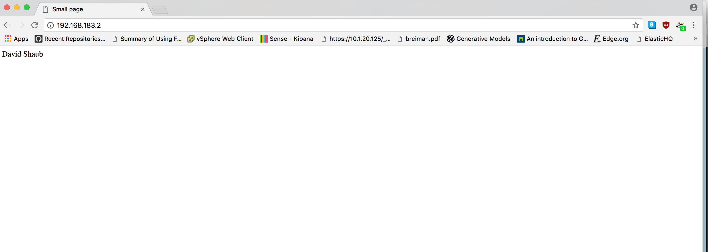

All problems were completed, including problem 5.

## Problem 1

We download Flume and after verifying the signature extract to `~/apache-flume-1.8.0-bin`.

The flume configuration file `p1.conf`:
```
a1.channels = ch-1
a1.channels.ch-1.type = memory
a1.sources = src-1
a1.sinks = k1

a1.sources.src-1.type = spooldir
a1.sources.src-1.channels = ch-1
a1.sources.src-1.spoolDir = /home/vagrant/PBDP/hw5/hw5_p1_source


a1.sinks.k1.type = file_roll
a1.sinks.k1.channel = ch-1
a1.sinks.k1.sink.directory = /home/vagrant/PBDP/hw5/hw5_p1_sink
```

Initially both our source and sink directories are empty:
```
$ wc -l hw5_p1_source/*
wc: hw5_p1_source/*: No such file or directory
$ wc -l hw5_p1_sink/*
wc: hw5_p1_sink/*: No such file or directory
```

We start our flume agent with the log appearing in our console:
```
$ ~/apache-flume-1.8.0-bin/bin/flume-ng agent --conf ~/apache-flume-1.8.0-bin/conf --conf-file p1.conf --name a1 -Dflume.root.logger=INFO,console
Info: Including Hive libraries found via () for Hive access
+ exec /usr/lib/jvm/jre-1.8.0-openjdk/bin/java -Xmx20m -Dflume.root.logger=INFO,console -cp '/home/vagrant/apache-flume-1.8.0-bin/conf:/home/vagrant/apache-flume-1.8.0-bin/lib/*:/lib/*' -Djava.library.path= org.apache.flume.node.Application --conf-file p1.conf --name a1
2018-02-27 03:42:14,802 (lifecycleSupervisor-1-0) [INFO - org.apache.flume.node.PollingPropertiesFileConfigurationProvider.start(PollingPropertiesFileConfigurationProvider.java:62)] Configuration provider starting
2018-02-27 03:42:14,806 (conf-file-poller-0) [INFO - org.apache.flume.node.PollingPropertiesFileConfigurationProvider$FileWatcherRunnable.run(PollingPropertiesFileConfigurationProvider.java:134)] Reloading configuration file:p1.conf
2018-02-27 03:42:14,812 (conf-file-poller-0) [INFO - org.apache.flume.conf.FlumeConfiguration$AgentConfiguration.addProperty(FlumeConfiguration.java:1016)] Processing:k1
2018-02-27 03:42:14,812 (conf-file-poller-0) [INFO - org.apache.flume.conf.FlumeConfiguration$AgentConfiguration.addProperty(FlumeConfiguration.java:930)] Added sinks: k1 Agent: a1
2018-02-27 03:42:14,813 (conf-file-poller-0) [INFO - org.apache.flume.conf.FlumeConfiguration$AgentConfiguration.addProperty(FlumeConfiguration.java:1016)] Processing:k1
2018-02-27 03:42:14,813 (conf-file-poller-0) [INFO - org.apache.flume.conf.FlumeConfiguration$AgentConfiguration.addProperty(FlumeConfiguration.java:1016)] Processing:k1
2018-02-27 03:42:14,820 (conf-file-poller-0) [INFO - org.apache.flume.conf.FlumeConfiguration.validateConfiguration(FlumeConfiguration.java:140)] Post-validation flume configuration contains configuration for agents: [a1]
2018-02-27 03:42:14,821 (conf-file-poller-0) [INFO - org.apache.flume.node.AbstractConfigurationProvider.loadChannels(AbstractConfigurationProvider.java:147)] Creating channels
2018-02-27 03:42:14,825 (conf-file-poller-0) [INFO - org.apache.flume.channel.DefaultChannelFactory.create(DefaultChannelFactory.java:42)] Creating instance of channel ch-1 type memory
2018-02-27 03:42:14,828 (conf-file-poller-0) [INFO - org.apache.flume.node.AbstractConfigurationProvider.loadChannels(AbstractConfigurationProvider.java:201)] Created channel ch-1
2018-02-27 03:42:14,832 (conf-file-poller-0) [INFO - org.apache.flume.source.DefaultSourceFactory.create(DefaultSourceFactory.java:41)] Creating instance of source src-1, type spooldir
2018-02-27 03:42:14,838 (conf-file-poller-0) [INFO - org.apache.flume.sink.DefaultSinkFactory.create(DefaultSinkFactory.java:42)] Creating instance of sink: k1, type: file_roll
2018-02-27 03:42:14,842 (conf-file-poller-0) [INFO - org.apache.flume.node.AbstractConfigurationProvider.getConfiguration(AbstractConfigurationProvider.java:116)] Channel ch-1 connected to [src-1, k1]
2018-02-27 03:42:14,847 (conf-file-poller-0) [INFO - org.apache.flume.node.Application.startAllComponents(Application.java:137)] Starting new configuration:{ sourceRunners:{src-1=EventDrivenSourceRunner: { source:Spool Directory source src-1: { spoolDir: /home/vagrant/PBDP/hw5/hw5_p1_source } }} sinkRunners:{k1=SinkRunner: { policy:org.apache.flume.sink.DefaultSinkProcessor@5d3cee04 counterGroup:{ name:null counters:{} } }} channels:{ch-1=org.apache.flume.channel.MemoryChannel{name: ch-1}} }
2018-02-27 03:42:14,853 (conf-file-poller-0) [INFO - org.apache.flume.node.Application.startAllComponents(Application.java:144)] Starting Channel ch-1
2018-02-27 03:42:14,896 (lifecycleSupervisor-1-0) [INFO - org.apache.flume.instrumentation.MonitoredCounterGroup.register(MonitoredCounterGroup.java:119)] Monitored counter group for type: CHANNEL, name: ch-1: Successfully registered new MBean.
2018-02-27 03:42:14,897 (lifecycleSupervisor-1-0) [INFO - org.apache.flume.instrumentation.MonitoredCounterGroup.start(MonitoredCounterGroup.java:95)] Component type: CHANNEL, name: ch-1 started
2018-02-27 03:42:14,898 (conf-file-poller-0) [INFO - org.apache.flume.node.Application.startAllComponents(Application.java:171)] Starting Sink k1
2018-02-27 03:42:14,898 (lifecycleSupervisor-1-1) [INFO - org.apache.flume.sink.RollingFileSink.start(RollingFileSink.java:110)] Starting org.apache.flume.sink.RollingFileSink{name:k1, channel:ch-1}...
2018-02-27 03:42:14,899 (lifecycleSupervisor-1-1) [INFO - org.apache.flume.instrumentation.MonitoredCounterGroup.register(MonitoredCounterGroup.java:119)] Monitored counter group for type: SINK, name: k1: Successfully registered new MBean.
2018-02-27 03:42:14,899 (conf-file-poller-0) [INFO - org.apache.flume.node.Application.startAllComponents(Application.java:182)] Starting Source src-1
2018-02-27 03:42:14,899 (lifecycleSupervisor-1-1) [INFO - org.apache.flume.instrumentation.MonitoredCounterGroup.start(MonitoredCounterGroup.java:95)] Component type: SINK, name: k1 started
2018-02-27 03:42:14,899 (lifecycleSupervisor-1-0) [INFO - org.apache.flume.source.SpoolDirectorySource.start(SpoolDirectorySource.java:83)] SpoolDirectorySource source starting with directory: /home/vagrant/PBDP/hw5/hw5_p1_source
2018-02-27 03:42:14,901 (lifecycleSupervisor-1-1) [INFO - org.apache.flume.sink.RollingFileSink.start(RollingFileSink.java:142)] RollingFileSink k1 started.
2018-02-27 03:42:14,922 (lifecycleSupervisor-1-0) [INFO - org.apache.flume.instrumentation.MonitoredCounterGroup.register(MonitoredCounterGroup.java:119)] Monitored counter group for type: SOURCE, name: src-1: Successfully registered new MBean.
2018-02-27 03:42:14,922 (lifecycleSupervisor-1-0) [INFO - org.apache.flume.instrumentation.MonitoredCounterGroup.start(MonitoredCounterGroup.java:95)] Component type: SOURCE, name: src-1 started
```

We copy the four log files into the source directory, and in the log notice that Flume is processing the data:
```
2018-02-27 03:43:26,433 (pool-4-thread-1) [INFO - org.apache.flume.client.avro.ReliableSpoolingFileEventReader.readEvents(ReliableSpoolingFileEventReader.java:324)] Last read took us just up to a file boundary. Rolling to the next file, if there is one.
2018-02-27 03:43:26,434 (pool-4-thread-1) [INFO - org.apache.flume.client.avro.ReliableSpoolingFileEventReader.rollCurrentFile(ReliableSpoolingFileEventReader.java:433)] Preparing to move file /home/vagrant/PBDP/hw5/hw5_p1_source/log_file_01.txt to /home/vagrant/PBDP/hw5/hw5_p1_source/log_file_01.txt.COMPLETED
2018-02-27 03:43:30,542 (pool-4-thread-1) [INFO - org.apache.flume.client.avro.ReliableSpoolingFileEventReader.readEvents(ReliableSpoolingFileEventReader.java:324)] Last read took us just up to a file boundary. Rolling to the next file, if there is one.
2018-02-27 03:43:30,542 (pool-4-thread-1) [INFO - org.apache.flume.client.avro.ReliableSpoolingFileEventReader.rollCurrentFile(ReliableSpoolingFileEventReader.java:433)] Preparing to move file /home/vagrant/PBDP/hw5/hw5_p1_source/log_file_02.txt to /home/vagrant/PBDP/hw5/hw5_p1_source/log_file_02.txt.COMPLETED
2018-02-27 03:43:30,611 (pool-4-thread-1) [INFO - org.apache.flume.client.avro.ReliableSpoolingFileEventReader.readEvents(ReliableSpoolingFileEventReader.java:324)] Last read took us just up to a file boundary. Rolling to the next file, if there is one.
2018-02-27 03:43:30,611 (pool-4-thread-1) [INFO - org.apache.flume.client.avro.ReliableSpoolingFileEventReader.rollCurrentFile(ReliableSpoolingFileEventReader.java:433)] Preparing to move file /home/vagrant/PBDP/hw5/hw5_p1_source/log_file_03.txt to /home/vagrant/PBDP/hw5/hw5_p1_source/log_file_03.txt.COMPLETED
2018-02-27 03:43:30,680 (pool-4-thread-1) [INFO - org.apache.flume.client.avro.ReliableSpoolingFileEventReader.readEvents(ReliableSpoolingFileEventReader.java:324)] Last read took us just up to a file boundary. Rolling to the next file, if there is one.
2018-02-27 03:43:30,681 (pool-4-thread-1) [INFO - org.apache.flume.client.avro.ReliableSpoolingFileEventReader.rollCurrentFile(ReliableSpoolingFileEventReader.java:433)] Preparing to move file /home/vagrant/PBDP/hw5/hw5_p1_source/log_file_04.txt to /home/vagrant/PBDP/hw5/hw5_p1_source/log_file_04.txt.COMPLETED
```

We can also validated that the data in the source have been processed and now appear in the sink:
```
$ wc -l hw5_p1_source/*
  25452 hw5_p1_source/log_file_01.txt.COMPLETED
  33800 hw5_p1_source/log_file_02.txt.COMPLETED
  25200 hw5_p1_source/log_file_03.txt.COMPLETED
  29250 hw5_p1_source/log_file_04.txt.COMPLETED
 113702 total

$ wc -l hw5_p1_sink/*
      0 hw5_p1_sink/1519702934840-1
      0 hw5_p1_sink/1519702934840-2
 113702 hw5_p1_sink/1519702934840-3
      0 hw5_p1_sink/1519702934840-4
      0 hw5_p1_sink/1519702934840-5
 113702 total
```

For experiment 1, we copy the same log files into the source directory. The Flume documentation explains that "If a file name is reused at a later time, Flume will print an error to its log file and stop processing". Indeed, in the log we see that Flume halts:
```
2018-02-27 03:46:00,829 (pool-4-thread-1) [INFO - org.apache.flume.client.avro.ReliableSpoolingFileEventReader.readEvents(ReliableSpoolingFileEventReader.java:324)] Last read took us just up to a file boundary. Rolling to the next file, if there is one.
2018-02-27 03:46:00,829 (pool-4-thread-1) [INFO - org.apache.flume.client.avro.ReliableSpoolingFileEventReader.rollCurrentFile(ReliableSpoolingFileEventReader.java:433)] Preparing to move file /home/vagrant/PBDP/hw5/hw5_p1_source/log_file_01.txt to /home/vagrant/PBDP/hw5/hw5_p1_source/log_file_01.txt.COMPLETED
2018-02-27 03:46:00,830 (pool-4-thread-1) [ERROR - org.apache.flume.source.SpoolDirectorySource$SpoolDirectoryRunnable.run(SpoolDirectorySource.java:280)] FATAL: Spool Directory source src-1: { spoolDir: /home/vagrant/PBDP/hw5/hw5_p1_source }: Uncaught exception in SpoolDirectorySource thread. Restart or reconfigure Flume to continue processing.
java.lang.IllegalStateException: File name has been re-used with different files. Spooling assumptions violated for /home/vagrant/PBDP/hw5/hw5_p1_source/log_file_01.txt.COMPLETED
	at org.apache.flume.client.avro.ReliableSpoolingFileEventReader.rollCurrentFile(ReliableSpoolingFileEventReader.java:463)
	at org.apache.flume.client.avro.ReliableSpoolingFileEventReader.retireCurrentFile(ReliableSpoolingFileEventReader.java:414)
	at org.apache.flume.client.avro.ReliableSpoolingFileEventReader.readEvents(ReliableSpoolingFileEventReader.java:326)
	at org.apache.flume.source.SpoolDirectorySource$SpoolDirectoryRunnable.run(SpoolDirectorySource.java:250)
	at java.util.concurrent.Executors$RunnableAdapter.call(Executors.java:511)
	at java.util.concurrent.FutureTask.runAndReset(FutureTask.java:308)
	at java.util.concurrent.ScheduledThreadPoolExecutor$ScheduledFutureTask.access$301(ScheduledThreadPoolExecutor.java:180)
	at java.util.concurrent.ScheduledThreadPoolExecutor$ScheduledFutureTask.run(ScheduledThreadPoolExecutor.java:294)
	at java.util.concurrent.ThreadPoolExecutor.runWorker(ThreadPoolExecutor.java:1149)
	at java.util.concurrent.ThreadPoolExecutor$Worker.run(ThreadPoolExecutor.java:624)
	at java.lang.Thread.run(Thread.java:748)
```

And a look into the source directory reveals no duplicate files marked as complated:
```
$ wc -l hw5_p1_source/*
   25452 hw5_p1_source/log_file_01.txt
   25452 hw5_p1_source/log_file_01.txt.COMPLETED
   33800 hw5_p1_source/log_file_02.txt
   33800 hw5_p1_source/log_file_02.txt.COMPLETED
   25200 hw5_p1_source/log_file_03.txt
   25200 hw5_p1_source/log_file_03.txt.COMPLETED
   29250 hw5_p1_source/log_file_04.txt
   29250 hw5_p1_source/log_file_04.txt.COMPLETED
  227404 total
```

But in the sink directory we do notice a new file processed, so it appears some duplicate data did in fact enter our sink:
```
$ wc -l hw5_p1_sink/*
      0 hw5_p1_sink/1519702934840-1
      0 hw5_p1_sink/1519702934840-10
      0 hw5_p1_sink/1519702934840-11
      0 hw5_p1_sink/1519702934840-2
 113702 hw5_p1_sink/1519702934840-3
      0 hw5_p1_sink/1519702934840-4
      0 hw5_p1_sink/1519702934840-5
      0 hw5_p1_sink/1519702934840-6
      0 hw5_p1_sink/1519702934840-7
  25452 hw5_p1_sink/1519702934840-8
      0 hw5_p1_sink/1519702934840-9
 139154 total
```
The documentation does explain that "Despite the reliability guarantees of this source, there are still cases in which events may be duplicated if certain downstream failures occur. This is consistent with the guarantees offered by other Flume components."

For the next experiment, we stop the agent and will copy some new text files into the source directory. We'll delete the unprocessed log files and add a few Shakespears books to the source directory while the Flume agent is not running:
```
$ wget https://www.gutenberg.org/cache/epub/1791/pg1791.txt
--2018-02-27 04:09:55--  https://www.gutenberg.org/cache/epub/1791/pg1791.txt
Resolving www.gutenberg.org (www.gutenberg.org)... 152.19.134.47, 2610:28:3090:3000:0:bad:cafe:47
Connecting to www.gutenberg.org (www.gutenberg.org)|152.19.134.47|:443... connected.
HTTP request sent, awaiting response... 200 OK
Length: 160623 (157K) [text/plain]
Saving to: ‘pg1791.txt.1’

100%[==================================================================================================================================================================>] 160,623      590KB/s   in 0.3s   

2018-02-27 04:09:56 (590 KB/s) - ‘pg1791.txt.1’ saved [160623/160623]
$ wget https://www.gutenberg.org/cache/epub/1121/pg1121.txt
--2018-02-27 04:10:14--  https://www.gutenberg.org/cache/epub/1121/pg1121.txt
Resolving www.gutenberg.org (www.gutenberg.org)... 152.19.134.47, 2610:28:3090:3000:0:bad:cafe:47
Connecting to www.gutenberg.org (www.gutenberg.org)|152.19.134.47|:443... connected.
HTTP request sent, awaiting response... 200 OK
Length: 162250 (158K) [text/plain]
Saving to: ‘pg1121.txt’

100%[==================================================================================================================================================================>] 162,250      627KB/s   in 0.3s   

2018-02-27 04:10:15 (627 KB/s) - ‘pg1121.txt’ saved [162250/162250]
$ rm hw5_p1_source/*.txt
$ cp pg1121.txt pg1791.txt hw5_p1_source/
$ wc -l hw5_p1_source/*
  25452 hw5_p1_source/log_file_01.txt.COMPLETED
  33800 hw5_p1_source/log_file_02.txt.COMPLETED
  25200 hw5_p1_source/log_file_03.txt.COMPLETED
  29250 hw5_p1_source/log_file_04.txt.COMPLETED
   4204 hw5_p1_source/pg1121.txt
   3969 hw5_p1_source/pg1791.txt
 121875 total
$ wc -l hw5_p1_sink/*
      0 hw5_p1_sink/1519702934840-1
      0 hw5_p1_sink/1519702934840-10
      0 hw5_p1_sink/1519702934840-11
      0 hw5_p1_sink/1519702934840-12
      0 hw5_p1_sink/1519702934840-13
      0 hw5_p1_sink/1519702934840-14
      0 hw5_p1_sink/1519702934840-15
      0 hw5_p1_sink/1519702934840-16
      0 hw5_p1_sink/1519702934840-17
      0 hw5_p1_sink/1519702934840-18
      0 hw5_p1_sink/1519702934840-19
      0 hw5_p1_sink/1519702934840-2
      0 hw5_p1_sink/1519702934840-20
      0 hw5_p1_sink/1519702934840-21
      0 hw5_p1_sink/1519702934840-22
      0 hw5_p1_sink/1519702934840-23
      0 hw5_p1_sink/1519702934840-24
      0 hw5_p1_sink/1519702934840-25
      0 hw5_p1_sink/1519702934840-26
      0 hw5_p1_sink/1519702934840-27
      0 hw5_p1_sink/1519702934840-28
      0 hw5_p1_sink/1519702934840-29
 113702 hw5_p1_sink/1519702934840-3
      0 hw5_p1_sink/1519702934840-30
      0 hw5_p1_sink/1519702934840-31
      0 hw5_p1_sink/1519702934840-32
      0 hw5_p1_sink/1519702934840-33
      0 hw5_p1_sink/1519702934840-34
      0 hw5_p1_sink/1519702934840-35
      0 hw5_p1_sink/1519702934840-36
      0 hw5_p1_sink/1519702934840-37
      0 hw5_p1_sink/1519702934840-38
      0 hw5_p1_sink/1519702934840-39
      0 hw5_p1_sink/1519702934840-4
      0 hw5_p1_sink/1519702934840-40
      0 hw5_p1_sink/1519702934840-41
      0 hw5_p1_sink/1519702934840-42
      0 hw5_p1_sink/1519702934840-43
      0 hw5_p1_sink/1519702934840-44
      0 hw5_p1_sink/1519702934840-45
      0 hw5_p1_sink/1519702934840-46
      0 hw5_p1_sink/1519702934840-47
      0 hw5_p1_sink/1519702934840-48
      0 hw5_p1_sink/1519702934840-49
      0 hw5_p1_sink/1519702934840-5
      0 hw5_p1_sink/1519702934840-50
      0 hw5_p1_sink/1519702934840-51
      0 hw5_p1_sink/1519702934840-52
      0 hw5_p1_sink/1519702934840-53
      0 hw5_p1_sink/1519702934840-54
      0 hw5_p1_sink/1519702934840-55
      0 hw5_p1_sink/1519702934840-56
      0 hw5_p1_sink/1519702934840-57
      0 hw5_p1_sink/1519702934840-6
      0 hw5_p1_sink/1519702934840-7
  25452 hw5_p1_sink/1519702934840-8
      0 hw5_p1_sink/1519702934840-9
      0 hw5_p1_sink/1519704795345-1
 139154 total
```

We restart the Flume agent and watch it pick up the files:
```
$ ~/apache-flume-1.8.0-bin/bin/flume-ng agent --conf ~/apache-flume-1.8.0-bin/conf --conf-file p1.conf --name a1 -Dflume.root.logger=INFO,console
Info: Including Hive libraries found via () for Hive access
+ exec /usr/lib/jvm/jre-1.8.0-openjdk/bin/java -Xmx20m -Dflume.root.logger=INFO,console -cp '/home/vagrant/apache-flume-1.8.0-bin/conf:/home/vagrant/apache-flume-1.8.0-bin/lib/*:/lib/*' -Djava.library.path= org.apache.flume.node.Application --conf-file p1.conf --name a1
2018-02-27 04:15:05,352 (lifecycleSupervisor-1-0) [INFO - org.apache.flume.node.PollingPropertiesFileConfigurationProvider.start(PollingPropertiesFileConfigurationProvider.java:62)] Configuration provider starting
2018-02-27 04:15:05,356 (conf-file-poller-0) [INFO - org.apache.flume.node.PollingPropertiesFileConfigurationProvider$FileWatcherRunnable.run(PollingPropertiesFileConfigurationProvider.java:134)] Reloading configuration file:p1.conf
2018-02-27 04:15:05,361 (conf-file-poller-0) [INFO - org.apache.flume.conf.FlumeConfiguration$AgentConfiguration.addProperty(FlumeConfiguration.java:1016)] Processing:k1
2018-02-27 04:15:05,361 (conf-file-poller-0) [INFO - org.apache.flume.conf.FlumeConfiguration$AgentConfiguration.addProperty(FlumeConfiguration.java:930)] Added sinks: k1 Agent: a1
2018-02-27 04:15:05,362 (conf-file-poller-0) [INFO - org.apache.flume.conf.FlumeConfiguration$AgentConfiguration.addProperty(FlumeConfiguration.java:1016)] Processing:k1
2018-02-27 04:15:05,362 (conf-file-poller-0) [INFO - org.apache.flume.conf.FlumeConfiguration$AgentConfiguration.addProperty(FlumeConfiguration.java:1016)] Processing:k1
2018-02-27 04:15:05,369 (conf-file-poller-0) [INFO - org.apache.flume.conf.FlumeConfiguration.validateConfiguration(FlumeConfiguration.java:140)] Post-validation flume configuration contains configuration for agents: [a1]
2018-02-27 04:15:05,370 (conf-file-poller-0) [INFO - org.apache.flume.node.AbstractConfigurationProvider.loadChannels(AbstractConfigurationProvider.java:147)] Creating channels
2018-02-27 04:15:05,374 (conf-file-poller-0) [INFO - org.apache.flume.channel.DefaultChannelFactory.create(DefaultChannelFactory.java:42)] Creating instance of channel ch-1 type memory
2018-02-27 04:15:05,377 (conf-file-poller-0) [INFO - org.apache.flume.node.AbstractConfigurationProvider.loadChannels(AbstractConfigurationProvider.java:201)] Created channel ch-1
2018-02-27 04:15:05,380 (conf-file-poller-0) [INFO - org.apache.flume.source.DefaultSourceFactory.create(DefaultSourceFactory.java:41)] Creating instance of source src-1, type spooldir
2018-02-27 04:15:05,385 (conf-file-poller-0) [INFO - org.apache.flume.sink.DefaultSinkFactory.create(DefaultSinkFactory.java:42)] Creating instance of sink: k1, type: file_roll
2018-02-27 04:15:05,389 (conf-file-poller-0) [INFO - org.apache.flume.node.AbstractConfigurationProvider.getConfiguration(AbstractConfigurationProvider.java:116)] Channel ch-1 connected to [src-1, k1]
2018-02-27 04:15:05,394 (conf-file-poller-0) [INFO - org.apache.flume.node.Application.startAllComponents(Application.java:137)] Starting new configuration:{ sourceRunners:{src-1=EventDrivenSourceRunner: { source:Spool Directory source src-1: { spoolDir: /home/vagrant/PBDP/hw5/hw5_p1_source } }} sinkRunners:{k1=SinkRunner: { policy:org.apache.flume.sink.DefaultSinkProcessor@5d3cee04 counterGroup:{ name:null counters:{} } }} channels:{ch-1=org.apache.flume.channel.MemoryChannel{name: ch-1}} }
2018-02-27 04:15:05,400 (conf-file-poller-0) [INFO - org.apache.flume.node.Application.startAllComponents(Application.java:144)] Starting Channel ch-1
2018-02-27 04:15:05,443 (lifecycleSupervisor-1-0) [INFO - org.apache.flume.instrumentation.MonitoredCounterGroup.register(MonitoredCounterGroup.java:119)] Monitored counter group for type: CHANNEL, name: ch-1: Successfully registered new MBean.
2018-02-27 04:15:05,444 (lifecycleSupervisor-1-0) [INFO - org.apache.flume.instrumentation.MonitoredCounterGroup.start(MonitoredCounterGroup.java:95)] Component type: CHANNEL, name: ch-1 started
2018-02-27 04:15:05,445 (conf-file-poller-0) [INFO - org.apache.flume.node.Application.startAllComponents(Application.java:171)] Starting Sink k1
2018-02-27 04:15:05,445 (lifecycleSupervisor-1-0) [INFO - org.apache.flume.sink.RollingFileSink.start(RollingFileSink.java:110)] Starting org.apache.flume.sink.RollingFileSink{name:k1, channel:ch-1}...
2018-02-27 04:15:05,445 (conf-file-poller-0) [INFO - org.apache.flume.node.Application.startAllComponents(Application.java:182)] Starting Source src-1
2018-02-27 04:15:05,446 (lifecycleSupervisor-1-1) [INFO - org.apache.flume.source.SpoolDirectorySource.start(SpoolDirectorySource.java:83)] SpoolDirectorySource source starting with directory: /home/vagrant/PBDP/hw5/hw5_p1_source
2018-02-27 04:15:05,446 (lifecycleSupervisor-1-0) [INFO - org.apache.flume.instrumentation.MonitoredCounterGroup.register(MonitoredCounterGroup.java:119)] Monitored counter group for type: SINK, name: k1: Successfully registered new MBean.
2018-02-27 04:15:05,446 (lifecycleSupervisor-1-0) [INFO - org.apache.flume.instrumentation.MonitoredCounterGroup.start(MonitoredCounterGroup.java:95)] Component type: SINK, name: k1 started
2018-02-27 04:15:05,447 (lifecycleSupervisor-1-0) [INFO - org.apache.flume.sink.RollingFileSink.start(RollingFileSink.java:142)] RollingFileSink k1 started.
2018-02-27 04:15:05,467 (lifecycleSupervisor-1-1) [INFO - org.apache.flume.instrumentation.MonitoredCounterGroup.register(MonitoredCounterGroup.java:119)] Monitored counter group for type: SOURCE, name: src-1: Successfully registered new MBean.
2018-02-27 04:15:05,467 (lifecycleSupervisor-1-1) [INFO - org.apache.flume.instrumentation.MonitoredCounterGroup.start(MonitoredCounterGroup.java:95)] Component type: SOURCE, name: src-1 started
2018-02-27 04:15:05,671 (pool-3-thread-1) [INFO - org.apache.flume.client.avro.ReliableSpoolingFileEventReader.readEvents(ReliableSpoolingFileEventReader.java:324)] Last read took us just up to a file boundary. Rolling to the next file, if there is one.
2018-02-27 04:15:05,672 (pool-3-thread-1) [INFO - org.apache.flume.client.avro.ReliableSpoolingFileEventReader.rollCurrentFile(ReliableSpoolingFileEventReader.java:433)] Preparing to move file /home/vagrant/PBDP/hw5/hw5_p1_source/pg1121.txt to /home/vagrant/PBDP/hw5/hw5_p1_source/pg1121.txt.COMPLETED
2018-02-27 04:15:09,695 (pool-3-thread-1) [INFO - org.apache.flume.client.avro.ReliableSpoolingFileEventReader.readEvents(ReliableSpoolingFileEventReader.java:324)] Last read took us just up to a file boundary. Rolling to the next file, if there is one.
2018-02-27 04:15:09,695 (pool-3-thread-1) [INFO - org.apache.flume.client.avro.ReliableSpoolingFileEventReader.rollCurrentFile(ReliableSpoolingFileEventReader.java:433)] Preparing to move file /home/vagrant/PBDP/hw5/hw5_p1_source/pg1791.txt to /home/vagrant/PBDP/hw5/hw5_p1_source/pg1791.txt.COMPLETED
```

The source text files are marked completed, and we now have additional data in the sink directory:
```
$ wc -l hw5_p1_source/*
  25452 hw5_p1_source/log_file_01.txt.COMPLETED
  33800 hw5_p1_source/log_file_02.txt.COMPLETED
  25200 hw5_p1_source/log_file_03.txt.COMPLETED
  29250 hw5_p1_source/log_file_04.txt.COMPLETED
   4204 hw5_p1_source/pg1121.txt.COMPLETED
   3969 hw5_p1_source/pg1791.txt.COMPLETED
 121875 total
$ wc -l hw5_p1_sink/*
      0 hw5_p1_sink/1519702934840-1
      0 hw5_p1_sink/1519702934840-10
      0 hw5_p1_sink/1519702934840-11
      0 hw5_p1_sink/1519702934840-12
      0 hw5_p1_sink/1519702934840-13
      0 hw5_p1_sink/1519702934840-14
      0 hw5_p1_sink/1519702934840-15
      0 hw5_p1_sink/1519702934840-16
      0 hw5_p1_sink/1519702934840-17
      0 hw5_p1_sink/1519702934840-18
      0 hw5_p1_sink/1519702934840-19
      0 hw5_p1_sink/1519702934840-2
      0 hw5_p1_sink/1519702934840-20
      0 hw5_p1_sink/1519702934840-21
      0 hw5_p1_sink/1519702934840-22
      0 hw5_p1_sink/1519702934840-23
      0 hw5_p1_sink/1519702934840-24
      0 hw5_p1_sink/1519702934840-25
      0 hw5_p1_sink/1519702934840-26
      0 hw5_p1_sink/1519702934840-27
      0 hw5_p1_sink/1519702934840-28
      0 hw5_p1_sink/1519702934840-29
 113702 hw5_p1_sink/1519702934840-3
      0 hw5_p1_sink/1519702934840-30
      0 hw5_p1_sink/1519702934840-31
      0 hw5_p1_sink/1519702934840-32
      0 hw5_p1_sink/1519702934840-33
      0 hw5_p1_sink/1519702934840-34
      0 hw5_p1_sink/1519702934840-35
      0 hw5_p1_sink/1519702934840-36
      0 hw5_p1_sink/1519702934840-37
      0 hw5_p1_sink/1519702934840-38
      0 hw5_p1_sink/1519702934840-39
      0 hw5_p1_sink/1519702934840-4
      0 hw5_p1_sink/1519702934840-40
      0 hw5_p1_sink/1519702934840-41
      0 hw5_p1_sink/1519702934840-42
      0 hw5_p1_sink/1519702934840-43
      0 hw5_p1_sink/1519702934840-44
      0 hw5_p1_sink/1519702934840-45
      0 hw5_p1_sink/1519702934840-46
      0 hw5_p1_sink/1519702934840-47
      0 hw5_p1_sink/1519702934840-48
      0 hw5_p1_sink/1519702934840-49
      0 hw5_p1_sink/1519702934840-5
      0 hw5_p1_sink/1519702934840-50
      0 hw5_p1_sink/1519702934840-51
      0 hw5_p1_sink/1519702934840-52
      0 hw5_p1_sink/1519702934840-53
      0 hw5_p1_sink/1519702934840-54
      0 hw5_p1_sink/1519702934840-55
      0 hw5_p1_sink/1519702934840-56
      0 hw5_p1_sink/1519702934840-57
      0 hw5_p1_sink/1519702934840-6
      0 hw5_p1_sink/1519702934840-7
  25452 hw5_p1_sink/1519702934840-8
      0 hw5_p1_sink/1519702934840-9
      0 hw5_p1_sink/1519704795345-1
   8173 hw5_p1_sink/1519704905388-1
      0 hw5_p1_sink/1519704905388-2
      0 hw5_p1_sink/1519704905388-3
 147327 total
```
As the Flume documentation explains, although our agent will die if duplicate logs enter the source, "this source is reliable and will not miss data, even if Flume is restarted or killed."


## Probem 2


Inside of a Vagrant machine (IP `192.168.183.2`) we create a hello world html file for our Apache server:
```
<html>
<header><title>Small page</title></header>
<body>
David Shaub
</body>
</html>
```



We see that this access appears in `access_log`:
```
$ sudo tail /var/log/httpd/access_log
192.168.183.1 - - [28/Feb/2018:03:53:59 +0000] "GET /noindex/css/bootstrap.min.css HTTP/1.1" 200 19341 "http://192.168.183.2/" "Mozilla/5.0 (Macintosh; Intel Mac OS X 10_11_6) AppleWebKit/537.36 (KHTML, like Gecko) Chrome/64.0.3282.167 Safari/537.36"
192.168.183.1 - - [28/Feb/2018:03:53:59 +0000] "GET /noindex/css/open-sans.css HTTP/1.1" 200 5081 "http://192.168.183.2/" "Mozilla/5.0 (Macintosh; Intel Mac OS X 10_11_6) AppleWebKit/537.36 (KHTML, like Gecko) Chrome/64.0.3282.167 Safari/537.36"
192.168.183.1 - - [28/Feb/2018:03:53:59 +0000] "GET /images/apache_pb.gif HTTP/1.1" 200 2326 "http://192.168.183.2/" "Mozilla/5.0 (Macintosh; Intel Mac OS X 10_11_6) AppleWebKit/537.36 (KHTML, like Gecko) Chrome/64.0.3282.167 Safari/537.36"
192.168.183.1 - - [28/Feb/2018:03:53:59 +0000] "GET /images/poweredby.png HTTP/1.1" 200 3956 "http://192.168.183.2/" "Mozilla/5.0 (Macintosh; Intel Mac OS X 10_11_6) AppleWebKit/537.36 (KHTML, like Gecko) Chrome/64.0.3282.167 Safari/537.36"
192.168.183.1 - - [28/Feb/2018:03:53:59 +0000] "GET /noindex/css/fonts/Light/OpenSans-Light.woff HTTP/1.1" 404 241 "http://192.168.183.2/noindex/css/open-sans.css" "Mozilla/5.0 (Macintosh; Intel Mac OS X 10_11_6) AppleWebKit/537.36 (KHTML, like Gecko) Chrome/64.0.3282.167 Safari/537.36"
192.168.183.1 - - [28/Feb/2018:03:53:59 +0000] "GET /noindex/css/fonts/Bold/OpenSans-Bold.woff HTTP/1.1" 404 239 "http://192.168.183.2/noindex/css/open-sans.css" "Mozilla/5.0 (Macintosh; Intel Mac OS X 10_11_6) AppleWebKit/537.36 (KHTML, like Gecko) Chrome/64.0.3282.167 Safari/537.36"
192.168.183.1 - - [28/Feb/2018:03:53:59 +0000] "GET /noindex/css/fonts/Light/OpenSans-Light.ttf HTTP/1.1" 404 240 "http://192.168.183.2/noindex/css/open-sans.css" "Mozilla/5.0 (Macintosh; Intel Mac OS X 10_11_6) AppleWebKit/537.36 (KHTML, like Gecko) Chrome/64.0.3282.167 Safari/537.36"
192.168.183.1 - - [28/Feb/2018:03:53:59 +0000] "GET /noindex/css/fonts/Bold/OpenSans-Bold.ttf HTTP/1.1" 404 238 "http://192.168.183.2/noindex/css/open-sans.css" "Mozilla/5.0 (Macintosh; Intel Mac OS X 10_11_6) AppleWebKit/537.36 (KHTML, like Gecko) Chrome/64.0.3282.167 Safari/537.36"
192.168.183.1 - - [28/Feb/2018:03:53:59 +0000] "GET /favicon.ico HTTP/1.1" 404 209 "http://192.168.183.2/" "Mozilla/5.0 (Macintosh; Intel Mac OS X 10_11_6) AppleWebKit/537.36 (KHTML, like Gecko) Chrome/64.0.3282.167 Safari/537.36"
192.168.183.1 - - [28/Feb/2018:03:54:58 +0000] "GET / HTTP/1.1" 200 86 "-" "Mozilla/5.0 (Macintosh; Intel Mac OS X 10_11_6) AppleWebKit/537.36 (KHTML, like Gecko) Chrome/64.0.3282.167 Safari/537.36"
```

To generate access events to our http server we use the below shell script:
```
#!/usr/bin/env bash
# This script requires 'bc', 'curl', and GNU coreutils 'sleep'

if (( "$1" != 1 )); then
    rate=$(echo "1 / $1" | bc -l)
    while true; do
        curl 'localhost:80'
        sleep $rate
    done
fi
echo "Must supply a numeric rate argument"
exit 1
```

We setup our Flume agent with the following `p2.conf` config file so that a new file in the sink is created every 5 seconds:
```
a1.channels = ch-1
a1.channels.ch-1.type = memory
a1.channels.ch-1.capacity = 100
a1.channels.ch-1.transactionCapacity = 100
a1.sources = src-1
a1.sinks = k1

a1.sources.src-1.type = exec
a1.sources.src-1.channels = ch-1
a1.sources.r1.command = tail -F /var/log/secure

a1.sinks.k1.type = file_roll
a1.sinks.k1.channel = ch-1
a1.sinks.k1.sink.directory = /home/vagrant/PBDP/hw5/hw5_p2_sink
a1.sinks.k1.sink.directory.rollInterval = 5
```

Launch the Flume agent:
```
$ mkdir -p /home/vagrant/PBDP/hw5/hw5_p2_sink
$ ~/apache-flume-1.8.0-bin/bin/flume-ng agent --conf ~/apache-flume-1.8.0-bin/conf --conf-file p2.conf --name a1 -Dflume.root.logger=INFO,console
Warning: JAVA_HOME is not set!
Info: Including Hive libraries found via () for Hive access
+ exec /usr/bin/java -Xmx20m -Dflume.root.logger=INFO,console -cp '/home/vagrant/apache-flume-1.8.0-bin/conf:/home/vagrant/apache-flume-1.8.0-bin/lib/*:/lib/*' -Djava.library.path= org.apache.flume.node.Application --conf-file p2.conf --name a1
2018-02-27 15:50:29,862 (lifecycleSupervisor-1-0) [INFO - org.apache.flume.node.PollingPropertiesFileConfigurationProvider.start(PollingPropertiesFileConfigurationProvider.java:62)] Configuration provider starting
2018-02-27 15:50:29,866 (conf-file-poller-0) [INFO - org.apache.flume.node.PollingPropertiesFileConfigurationProvider$FileWatcherRunnable.run(PollingPropertiesFileConfigurationProvider.java:134)] Reloading configuration file:p2.conf
2018-02-27 15:50:29,872 (conf-file-poller-0) [INFO - org.apache.flume.conf.FlumeConfiguration$AgentConfiguration.addProperty(FlumeConfiguration.java:930)] Added sinks: k1 Agent: a1
2018-02-27 15:50:29,872 (conf-file-poller-0) [INFO - org.apache.flume.conf.FlumeConfiguration$AgentConfiguration.addProperty(FlumeConfiguration.java:1016)] Processing:k1
2018-02-27 15:50:29,872 (conf-file-poller-0) [INFO - org.apache.flume.conf.FlumeConfiguration$AgentConfiguration.addProperty(FlumeConfiguration.java:1016)] Processing:k1
2018-02-27 15:50:29,872 (conf-file-poller-0) [INFO - org.apache.flume.conf.FlumeConfiguration$AgentConfiguration.addProperty(FlumeConfiguration.java:1016)] Processing:k1
2018-02-27 15:50:29,872 (conf-file-poller-0) [INFO - org.apache.flume.conf.FlumeConfiguration$AgentConfiguration.addProperty(FlumeConfiguration.java:1016)] Processing:k1
2018-02-27 15:50:29,881 (conf-file-poller-0) [INFO - org.apache.flume.conf.FlumeConfiguration.validateConfiguration(FlumeConfiguration.java:140)] Post-validation flume configuration contains configuration for agents: [a1]
2018-02-27 15:50:29,881 (conf-file-poller-0) [INFO - org.apache.flume.node.AbstractConfigurationProvider.loadChannels(AbstractConfigurationProvider.java:147)] Creating channels
2018-02-27 15:50:29,886 (conf-file-poller-0) [INFO - org.apache.flume.channel.DefaultChannelFactory.create(DefaultChannelFactory.java:42)] Creating instance of channel ch-1 type memory
2018-02-27 15:50:29,889 (conf-file-poller-0) [INFO - org.apache.flume.node.AbstractConfigurationProvider.loadChannels(AbstractConfigurationProvider.java:201)] Created channel ch-1
2018-02-27 15:50:29,893 (conf-file-poller-0) [INFO - org.apache.flume.source.DefaultSourceFactory.create(DefaultSourceFactory.java:41)] Creating instance of source src-1, type exec
2018-02-27 15:50:29,898 (conf-file-poller-0) [INFO - org.apache.flume.sink.DefaultSinkFactory.create(DefaultSinkFactory.java:42)] Creating instance of sink: k1, type: file_roll
2018-02-27 15:50:29,903 (conf-file-poller-0) [INFO - org.apache.flume.node.AbstractConfigurationProvider.getConfiguration(AbstractConfigurationProvider.java:116)] Channel ch-1 connected to [src-1, k1]
2018-02-27 15:50:29,908 (conf-file-poller-0) [INFO - org.apache.flume.node.Application.startAllComponents(Application.java:137)] Starting new configuration:{ sourceRunners:{src-1=EventDrivenSourceRunner: { source:org.apache.flume.source.ExecSource{name:src-1,state:IDLE} }} sinkRunners:{k1=SinkRunner: { policy:org.apache.flume.sink.DefaultSinkProcessor@18ca564c counterGroup:{ name:null counters:{} } }} channels:{ch-1=org.apache.flume.channel.MemoryChannel{name: ch-1}} }
2018-02-27 15:50:29,915 (conf-file-poller-0) [INFO - org.apache.flume.node.Application.startAllComponents(Application.java:144)] Starting Channel ch-1
2018-02-27 15:50:29,918 (conf-file-poller-0) [INFO - org.apache.flume.node.Application.startAllComponents(Application.java:159)] Waiting for channel: ch-1 to start. Sleeping for 500 ms
2018-02-27 15:50:29,961 (lifecycleSupervisor-1-0) [INFO - org.apache.flume.instrumentation.MonitoredCounterGroup.register(MonitoredCounterGroup.java:119)] Monitored counter group for type: CHANNEL, name: ch-1: Successfully registered new MBean.
2018-02-27 15:50:29,962 (lifecycleSupervisor-1-0) [INFO - org.apache.flume.instrumentation.MonitoredCounterGroup.start(MonitoredCounterGroup.java:95)] Component type: CHANNEL, name: ch-1 started
2018-02-27 15:50:30,443 (conf-file-poller-0) [INFO - org.apache.flume.node.Application.startAllComponents(Application.java:171)] Starting Sink k1
2018-02-27 15:50:30,444 (lifecycleSupervisor-1-2) [INFO - org.apache.flume.sink.RollingFileSink.start(RollingFileSink.java:110)] Starting org.apache.flume.sink.RollingFileSink{name:k1, channel:ch-1}...
2018-02-27 15:50:30,444 (conf-file-poller-0) [INFO - org.apache.flume.node.Application.startAllComponents(Application.java:182)] Starting Source src-1
2018-02-27 15:50:30,444 (lifecycleSupervisor-1-2) [INFO - org.apache.flume.instrumentation.MonitoredCounterGroup.register(MonitoredCounterGroup.java:119)] Monitored counter group for type: SINK, name: k1: Successfully registered new MBean.
2018-02-27 15:50:30,444 (lifecycleSupervisor-1-2) [INFO - org.apache.flume.instrumentation.MonitoredCounterGroup.start(MonitoredCounterGroup.java:95)] Component type: SINK, name: k1 started
2018-02-27 15:50:30,444 (lifecycleSupervisor-1-0) [INFO - org.apache.flume.source.ExecSource.start(ExecSource.java:168)] Exec source starting with command: sudo tail -F /var/log/httpd/access_log
2018-02-27 15:50:30,445 (lifecycleSupervisor-1-0) [INFO - org.apache.flume.instrumentation.MonitoredCounterGroup.register(MonitoredCounterGroup.java:119)] Monitored counter group for type: SOURCE, name: src-1: Successfully registered new MBean.
2018-02-27 15:50:30,445 (lifecycleSupervisor-1-0) [INFO - org.apache.flume.instrumentation.MonitoredCounterGroup.start(MonitoredCounterGroup.java:95)] Component type: SOURCE, name: src-1 started
2018-02-27 15:50:30,447 (lifecycleSupervisor-1-2) [INFO - org.apache.flume.sink.RollingFileSink.start(RollingFileSink.java:142)] RollingFileSink k1 started.
```

**Experiment 1**

For our first experiment, we launch our script to generate access to the server at 20 events per second and then revoke permissions so that Flume can no longer create new sink files. We'll wait 5 seconds before revoking permissions and checking the files created in the sink. Then after 5 minutes we'll restore access and again check the sink file contents.
```
$ ./p2_generator.sh 20 & sleep 5
$ chmod 444 /home/vagrant/PBDP/hw5/hw5_p2_sink
$ sleep 5
$ sudo wc -l /home/vagrant/PBDP/hw5/hw5_p2_sink/*
   0 /home/vagrant/PBDP/hw5/hw5_p2_sink/1519746629901-1
   0 /home/vagrant/PBDP/hw5/hw5_p2_sink/1519746629901-2
   0 /home/vagrant/PBDP/hw5/hw5_p2_sink/1519746629901-3
  81 /home/vagrant/PBDP/hw5/hw5_p2_sink/1519746629901-4
  81 total
$ sleep 300
$ chmod 775 /home/vagrant/PBDP/hw5/hw5_p2_sink
$ wc -l /home/vagrant/PBDP/hw5/hw5_p2_sink/*
   0 /home/vagrant/PBDP/hw5/hw5_p2_sink/1519746629901-1
   0 /home/vagrant/PBDP/hw5/hw5_p2_sink/1519746629901-2
   0 /home/vagrant/PBDP/hw5/hw5_p2_sink/1519746629901-3
  81 /home/vagrant/PBDP/hw5/hw5_p2_sink/1519746629901-4
  81 total
$ sleep 5
$ wc -l /home/vagrant/PBDP/hw5/hw5_p2_sink/*
    0 /home/vagrant/PBDP/hw5/hw5_p2_sink/1519746629901-1
    0 /home/vagrant/PBDP/hw5/hw5_p2_sink/1519746629901-2
    0 /home/vagrant/PBDP/hw5/hw5_p2_sink/1519746629901-3
   81 /home/vagrant/PBDP/hw5/hw5_p2_sink/1519746629901-4
  100 /home/vagrant/PBDP/hw5/hw5_p2_sink/1519746629901-5
    0 /home/vagrant/PBDP/hw5/hw5_p2_sink/1519746629901-6
  181 total
$ sudo wc -l /var/log/httpd/access_log
6268 /var/log/httpd/access_log
```

We notice that after we alter permissions, 81 lines have been written (somewhat less than the 20 * 5 = 100 we would expect). Once permissions have been revoked new data cannot enter the sink, and the Flume agent alerts us: 
```
2018-02-27 15:55:12,119 (SinkRunner-PollingRunner-DefaultSinkProcessor) [ERROR - org.apache.flume.SinkRunner$PollingRunner.run(SinkRunner.java:158)] Unable to deliver event. Exception follows.
org.apache.flume.EventDeliveryException: Failed to open file /home/vagrant/PBDP/hw5/hw5_p2_sink/1519746629901-5 while delivering event
	at org.apache.flume.sink.RollingFileSink.process(RollingFileSink.java:184)
	at org.apache.flume.sink.DefaultSinkProcessor.process(DefaultSinkProcessor.java:67)
	at org.apache.flume.SinkRunner$PollingRunner.run(SinkRunner.java:145)
	at java.lang.Thread.run(Thread.java:748)
Caused by: java.io.FileNotFoundException: /home/vagrant/PBDP/hw5/hw5_p2_sink/1519746629901-5 (Permission denied)
	at java.io.FileOutputStream.open0(Native Method)
	at java.io.FileOutputStream.open(FileOutputStream.java:270)
	at java.io.FileOutputStream.<init>(FileOutputStream.java:213)
	at java.io.FileOutputStream.<init>(FileOutputStream.java:162)
	at org.apache.flume.sink.RollingFileSink.process(RollingFileSink.java:175)
	... 3 more
```
Since we use a memory channel with a capacity for 100 messages, we expect to loose many messages during the five minutes (approximately 20 * 60 * 5 - 100 = 5900). After the five minutes have elapsed, we check the sink again and indeed see that no new messages have been written. After the next five second sleep, we see that exactly 100 messages have been added--those held in the memory channel. At this point our Flume log is no longer generating errors. Finally, we can compare this to the 6268 entries generated in the httpd log: indeed approximately 6000 entries never made it to our Flume sink while permissions were revoked.

**Experiment 2**

We delete all data in our sink and the Apache log.
For this experiment we will

1. Start a flume agent and give it 10 seconds to start up
2. Start our log generator running at 20 events per second
3. Continue for 20 seconds
4. Shutdown our Flume agent and wait five minutes.
5. Restart our Flume agent and wait another 20 seconds.
6. Stop all processes and examine the httpd access logs


The full output of the experiment is included in `p2_experiment2.txt` and is mostly filled with verbose Flume startup logs, killing tasks, and sending tasks to the background (which are not our primary focus here to understand Flume's message delivery guarantees). A sanitized version of a script's relevant output follows:
```
# Start flume and give it some time to begin
$ ~/apache-flume-1.8.0-bin/bin/flume-ng agent --conf ~/apache-flume-1.8.0-bin/conf --conf-file p2.conf --name a1 -Dflume.root.logger=INFO,console & sleep 10
# Start log generator
$ ./p2_generator.sh 20 & sleep 20

# Stop Flume and wait 5 minutes
$ ps aux | grep /home/vagrant/apache-flume-1.8.0-bin | awk '{{print $2}}' | xargs kill -9 & wc -l hw5_p2_sink/*
281 hw5_p2_sink/1519845860255-1

$ sleep 300

# Restart Flume and wait 20 seconds
$ ~/apache-flume-1.8.0-bin/bin/flume-ng agent --conf ~/apache-flume-1.8.0-bin/conf --conf-file p2.conf --name a1 -Dflume.root.logger=INFO,console & sleep 20
# Stop all generator scripts
$ ps aux | grep p2_generator.sh | awk '{{print $2}}' | xargs kill

# Examine results
$ wc -l hw5_p2_sink/*
  281 hw5_p2_sink/1519845860255-1
  300 hw5_p2_sink/1519846190270-1
  581 total
$ sudo wc -l /var/log/httpd/access_log
5226 /var/log/httpd/access_log
```

From the 281 events generated by our script while the Flume agent was running for the first 20 second, we see the generator script is not hitting the 20 mps target and is only achieving ~14 mps. By the end of the experiment, a total of 5226 messages appear in the Apache access log, but once Flume is resumed after 5 minutes we still only have 281 + 300 = 581 messages: we see that unsurprisingly Flume does not recover the messages from a `tail -f` source while it is not running. The clear warning in the Flume documentation makes this quite clear: "Your application can never guarantee data has been received when using a unidirectional asynchronous interface such as ExecSource! As an extension of this warning - and to be completely clear - there is absolutely zero guarantee of event delivery when using this source."

**Experiment 3**

We delete all data in our sink and the Apache log. For the third experiment, our approach will be to launch additional message generator scripts and monitor the Flume process until it is overwhelmed. Since we have seen that our generator script does not acctualy generate messages in the access log at the claimed messages-per-second argument, we will also monitor the output of `/var/log/httpd/access_log` with `logtop` to see the true mps rate. In one terminal we launch the Flume agent and will monitor this for when Flume alerts us of an error.
```
$ ~/apache-flume-1.8.0-bin/bin/flume-ng agent --conf ~/apache-flume-1.8.0-bin/conf --conf-file p2.conf --name a1 -Dflume.root.logger=INFO,console
```

In a second terminal, we launch the following to start new message generators.
```
msg_rate='50'
while true; do
    echo "Generating logs at $msg_rate mps"
    ./p2_generator.sh 50 & 
    msg_rate=$((msg_rate + 50))
    sleep 10
done
```
And finally in a third terminal we will check the mps access rate in Apache:
```
sudo tail -f /var/log/httpd/access_log | logtop
```

Flume produced an error when we were using 5 generators for a supposed throughput of 250 mps (although the `logtop` output was lower). This experimental procedure with the desired Flume failure could not be reproduced, however.


In another trial with a single generator, Flume failed to keep up at 500 mps. This process also could not be deterministically reproduced.
```
./p2_generator.sh 500
```

The Flume sink reports that it cannot keep up with the messages we are generating.
```
2018-02-28 23:41:06,043 (pool-4-thread-1) [ERROR - org.apache.flume.source.ExecSource$ExecRunnable.run(ExecSource.java:349)] Failed while running command: sudo tail -F /var/log/httpd/access_log
org.apache.flume.ChannelFullException: Space for commit to queue couldn't be acquired. Sinks are likely not keeping up with sources, or the buffer size is too tight
	at org.apache.flume.channel.MemoryChannel$MemoryTransaction.doCommit(MemoryChannel.java:128)
	at org.apache.flume.channel.BasicTransactionSemantics.commit(BasicTransactionSemantics.java:151)
	at org.apache.flume.channel.ChannelProcessor.processEventBatch(ChannelProcessor.java:194)
	at org.apache.flume.source.ExecSource$ExecRunnable.flushEventBatch(ExecSource.java:378)
	at org.apache.flume.source.ExecSource$ExecRunnable.run(ExecSource.java:338)
	at java.util.concurrent.Executors$RunnableAdapter.call(Executors.java:511)
	at java.util.concurrent.FutureTask.run(FutureTask.java:266)
	at java.util.concurrent.ThreadPoolExecutor.runWorker(ThreadPoolExecutor.java:1149)
	at java.util.concurrent.ThreadPoolExecutor$Worker.run(ThreadPoolExecutor.java:624)
	at java.lang.Thread.run(Thread.java:748)
2018-02-28 23:41:06,057 (timedFlushExecService20-0) [ERROR - org.apache.flume.source.ExecSource$ExecRunnable$1.run(ExecSource.java:324)] Exception occurred when processing event batch
org.apache.flume.ChannelException: java.lang.InterruptedException
	at org.apache.flume.channel.BasicTransactionSemantics.commit(BasicTransactionSemantics.java:154)
	at org.apache.flume.channel.ChannelProcessor.processEventBatch(ChannelProcessor.java:194)
	at org.apache.flume.source.ExecSource$ExecRunnable.flushEventBatch(ExecSource.java:378)
	at org.apache.flume.source.ExecSource$ExecRunnable.access$100(ExecSource.java:251)
	at org.apache.flume.source.ExecSource$ExecRunnable$1.run(ExecSource.java:320)
	at java.util.concurrent.Executors$RunnableAdapter.call(Executors.java:511)
	at java.util.concurrent.FutureTask.runAndReset(FutureTask.java:308)
	at java.util.concurrent.ScheduledThreadPoolExecutor$ScheduledFutureTask.access$301(ScheduledThreadPoolExecutor.java:180)
	at java.util.concurrent.ScheduledThreadPoolExecutor$ScheduledFutureTask.run(ScheduledThreadPoolExecutor.java:294)
	at java.util.concurrent.ThreadPoolExecutor.runWorker(ThreadPoolExecutor.java:1149)
	at java.util.concurrent.ThreadPoolExecutor$Worker.run(ThreadPoolExecutor.java:624)
	at java.lang.Thread.run(Thread.java:748)
Caused by: java.lang.InterruptedException
	at java.util.concurrent.locks.AbstractQueuedSynchronizer.doAcquireSharedNanos(AbstractQueuedSynchronizer.java:1039)
	at java.util.concurrent.locks.AbstractQueuedSynchronizer.tryAcquireSharedNanos(AbstractQueuedSynchronizer.java:1328)
	at java.util.concurrent.Semaphore.tryAcquire(Semaphore.java:582)
	at org.apache.flume.channel.MemoryChannel$MemoryTransaction.doCommit(MemoryChannel.java:126)
	at org.apache.flume.channel.BasicTransactionSemantics.commit(BasicTransactionSemantics.java:151)
	... 11 more
```

We see from the logtop output that our actual message generation rate was much lower at ~57 mps thaan the supposed 500 mps.
```
$ sudo tail -f /var/log/httpd/access_log | logtop
5322 lines, 57.85 lines/s
RANK    CNT   LINE/S LINE
   1     81     0.88 ::1 - - [28/Feb/2018:23:44:44 +0000] "GET / HTTP/1.1" 200 85 "-" "curl/7.29.0"                                                                                                              
   2     78     0.85 ::1 - - [28/Feb/2018:23:44:49 +0000] "GET / HTTP/1.1" 200 85 "-" "curl/7.29.0"                                                                                                              
   3     77     0.84 ::1 - - [28/Feb/2018:23:44:31 +0000] "GET / HTTP/1.1" 200 85 "-" "curl/7.29.0"                                                                                                              
   4     77     0.84 ::1 - - [28/Feb/2018:23:44:37 +0000] "GET / HTTP/1.1" 200 85 "-" "curl/7.29.0"                                                                                                              
   5     77     0.84 ::1 - - [28/Feb/2018:23:44:38 +0000] "GET / HTTP/1.1" 200 85 "-" "curl/7.29.0"                                                                                                              
   6     77     0.84 ::1 - - [28/Feb/2018:23:44:39 +0000] "GET / HTTP/1.1" 200 85 "-" "curl/7.29.0"                                                                                                              
   7     76     0.83 ::1 - - [28/Feb/2018:23:44:21 +0000] "GET / HTTP/1.1" 200 85 "-" "curl/7.29.0"                                                                                                              
   8     76     0.83 ::1 - - [28/Feb/2018:23:44:22 +0000] "GET / HTTP/1.1" 200 85 "-" "curl/7.29.0"                                                                                                              
   9     76     0.83 ::1 - - [28/Feb/2018:23:44:23 +0000] "GET / HTTP/1.1" 200 85 "-" "curl/7.29.0"                                                                                                              
  10     76     0.83 ::1 - - [28/Feb/2018:23:44:25 +0000] "GET / HTTP/1.1" 200 85 "-" "curl/7.29.0"   
```

Overall we see that Flume is surprisingly difficult to disrupt: the experimental procedures that sometimes produced failures could not always be reproduced despite adjusting the message generation rate in a single process in increments of 50 or even running many separate message generation programs. CPU resources were frequently saturated between the `httpd`, Flume, and generator script functions: in one trial, more than 100 generator scripts were running at a rate of 10 mps each and Flume still did not fail. In another with a generation rate of 100 mps, 35 scripts resulted in a theoretical 3500 mps and Flume still did not fail. It was observed, however, that the actual generation rate in `logtop` never climbed above the 350-400 mps range. 


## Problem 3

The Flume configuration file is very similar to Problem 2 but we now use a file channel and expect lower performance but stronger delivery guarantees.
```
a1.channels = ch-1
a1.channels.ch-1.type = file
a1.channels.ch-1.capacity = 100
a1.channels.ch-1.transactionCapacity = 100
a1.channels.ch-1.checkpointDir = /home/vagrant/PBDP/hw5/hw5_p3_checkpoint
a1.channels.ch-1.dataDirs = /home/vagrant/PBDP/hw5/hw5_p3_datadir
a1.sources = src-1
a1.sinks = k1

a1.sources.src-1.type = exec
a1.sources.src-1.channels = ch-1
a1.sources.src-1.command = sudo tail -F /var/log/httpd/access_log

a1.sinks.k1.type = file_roll
a1.sinks.k1.channel = ch-1
a1.sinks.k1.sink.directory = /home/vagrant/PBDP/hw5/hw5_p2_sink
a1.sinks.k1.sink.directory.rollInterval = 5
```

Flume behaves as earlier when we run with 20 events per second:
```
# Start Flume and the generator; run the generator for 30 seconds
$ ~/apache-flume-1.8.0-bin/bin/flume-ng agent --conf ~/apache-flume-1.8.0-bin/conf --conf-file p3.conf --name a1 -Dflume.root.logger=INFO,console & sleep 10
$ ./p2_generator.sh 20 & sleep 30

# Stop the generator and give Flume some time to process the final events
$ ps aux | grep p2_generator.sh | awk '{{print $2}}' | xargs kill
$ sleep 30

# Compare results
$ sudo wc -l /var/log/httpd/access_log
451 /var/log/httpd/access_log
$ wc -l hw5_p3_sink/*
  221 hw5_p3_sink/1519900074409-1
  230 hw5_p3_sink/1519900074409-2
    0 hw5_p3_sink/1519900074409-3
  451 total
```

The Flume agent processed all the logs.

**Experiment 1**

We launch our Flume agent:
```
$ ~/apache-flume-1.8.0-bin/bin/flume-ng agent --conf ~/apache-flume-1.8.0-bin/conf --conf-file p3.conf --name a1 -Dflume.root.logger=INFO,console
Warning: JAVA_HOME is not set!
Info: Including Hive libraries found via () for Hive access
+ exec /usr/bin/java -Xmx20m -Dflume.root.logger=INFO,console -cp '/home/vagrant/apache-flume-1.8.0-bin/conf:/home/vagrant/apache-flume-1.8.0-bin/lib/*:/lib/*' -Djava.library.path= org.apache.flume.node.Application --conf-file p3.conf --name a1
2018-03-01 04:33:22,520 (lifecycleSupervisor-1-0) [INFO - org.apache.flume.node.PollingPropertiesFileConfigurationProvider.start(PollingPropertiesFileConfigurationProvider.java:62)] Configuration provider starting
2018-03-01 04:33:22,523 (conf-file-poller-0) [INFO - org.apache.flume.node.PollingPropertiesFileConfigurationProvider$FileWatcherRunnable.run(PollingPropertiesFileConfigurationProvider.java:134)] Reloading configuration file:p3.conf
2018-03-01 04:33:22,529 (conf-file-poller-0) [INFO - org.apache.flume.conf.FlumeConfiguration$AgentConfiguration.addProperty(FlumeConfiguration.java:930)] Added sinks: k1 Agent: a1
2018-03-01 04:33:22,529 (conf-file-poller-0) [INFO - org.apache.flume.conf.FlumeConfiguration$AgentConfiguration.addProperty(FlumeConfiguration.java:1016)] Processing:k1
2018-03-01 04:33:22,529 (conf-file-poller-0) [INFO - org.apache.flume.conf.FlumeConfiguration$AgentConfiguration.addProperty(FlumeConfiguration.java:1016)] Processing:k1
2018-03-01 04:33:22,529 (conf-file-poller-0) [INFO - org.apache.flume.conf.FlumeConfiguration$AgentConfiguration.addProperty(FlumeConfiguration.java:1016)] Processing:k1
2018-03-01 04:33:22,529 (conf-file-poller-0) [INFO - org.apache.flume.conf.FlumeConfiguration$AgentConfiguration.addProperty(FlumeConfiguration.java:1016)] Processing:k1
2018-03-01 04:33:22,537 (conf-file-poller-0) [INFO - org.apache.flume.conf.FlumeConfiguration.validateConfiguration(FlumeConfiguration.java:140)] Post-validation flume configuration contains configuration for agents: [a1]
2018-03-01 04:33:22,538 (conf-file-poller-0) [INFO - org.apache.flume.node.AbstractConfigurationProvider.loadChannels(AbstractConfigurationProvider.java:147)] Creating channels
2018-03-01 04:33:22,542 (conf-file-poller-0) [INFO - org.apache.flume.channel.DefaultChannelFactory.create(DefaultChannelFactory.java:42)] Creating instance of channel ch-1 type file
2018-03-01 04:33:22,561 (conf-file-poller-0) [INFO - org.apache.flume.node.AbstractConfigurationProvider.loadChannels(AbstractConfigurationProvider.java:201)] Created channel ch-1
2018-03-01 04:33:22,561 (conf-file-poller-0) [INFO - org.apache.flume.source.DefaultSourceFactory.create(DefaultSourceFactory.java:41)] Creating instance of source src-1, type exec
2018-03-01 04:33:22,566 (conf-file-poller-0) [INFO - org.apache.flume.sink.DefaultSinkFactory.create(DefaultSinkFactory.java:42)] Creating instance of sink: k1, type: file_roll
2018-03-01 04:33:22,571 (conf-file-poller-0) [INFO - org.apache.flume.node.AbstractConfigurationProvider.getConfiguration(AbstractConfigurationProvider.java:116)] Channel ch-1 connected to [src-1, k1]
2018-03-01 04:33:22,575 (conf-file-poller-0) [INFO - org.apache.flume.node.Application.startAllComponents(Application.java:137)] Starting new configuration:{ sourceRunners:{src-1=EventDrivenSourceRunner: { source:org.apache.flume.source.ExecSource{name:src-1,state:IDLE} }} sinkRunners:{k1=SinkRunner: { policy:org.apache.flume.sink.DefaultSinkProcessor@7425e104 counterGroup:{ name:null counters:{} } }} channels:{ch-1=FileChannel ch-1 { dataDirs: [/home/vagrant/PBDP/hw5/hw5_p3_datadir] }} }
2018-03-01 04:33:22,582 (conf-file-poller-0) [INFO - org.apache.flume.node.Application.startAllComponents(Application.java:144)] Starting Channel ch-1
2018-03-01 04:33:22,584 (conf-file-poller-0) [INFO - org.apache.flume.node.Application.startAllComponents(Application.java:159)] Waiting for channel: ch-1 to start. Sleeping for 500 ms
2018-03-01 04:33:22,584 (lifecycleSupervisor-1-0) [INFO - org.apache.flume.channel.file.FileChannel.start(FileChannel.java:277)] Starting FileChannel ch-1 { dataDirs: [/home/vagrant/PBDP/hw5/hw5_p3_datadir] }...
2018-03-01 04:33:22,624 (lifecycleSupervisor-1-0) [INFO - org.apache.flume.instrumentation.MonitoredCounterGroup.register(MonitoredCounterGroup.java:119)] Monitored counter group for type: CHANNEL, name: ch-1: Successfully registered new MBean.
2018-03-01 04:33:22,625 (lifecycleSupervisor-1-0) [INFO - org.apache.flume.instrumentation.MonitoredCounterGroup.start(MonitoredCounterGroup.java:95)] Component type: CHANNEL, name: ch-1 started
2018-03-01 04:33:22,631 (lifecycleSupervisor-1-0) [INFO - org.apache.flume.channel.file.Log.<init>(Log.java:356)] Encryption is not enabled
2018-03-01 04:33:22,632 (lifecycleSupervisor-1-0) [INFO - org.apache.flume.channel.file.Log.replay(Log.java:406)] Replay started
2018-03-01 04:33:22,639 (lifecycleSupervisor-1-0) [INFO - org.apache.flume.channel.file.Log.replay(Log.java:418)] Found NextFileID 1, from [/home/vagrant/PBDP/hw5/hw5_p3_datadir/log-1]
2018-03-01 04:33:22,643 (lifecycleSupervisor-1-0) [INFO - org.apache.flume.channel.file.EventQueueBackingStoreFileV3.<init>(EventQueueBackingStoreFileV3.java:55)] Starting up with /home/vagrant/PBDP/hw5/hw5_p3_checkpoint/checkpoint and /home/vagrant/PBDP/hw5/hw5_p3_checkpoint/checkpoint.meta
2018-03-01 04:33:22,643 (lifecycleSupervisor-1-0) [INFO - org.apache.flume.channel.file.EventQueueBackingStoreFileV3.<init>(EventQueueBackingStoreFileV3.java:59)] Reading checkpoint metadata from /home/vagrant/PBDP/hw5/hw5_p3_checkpoint/checkpoint.meta
2018-03-01 04:33:22,708 (lifecycleSupervisor-1-0) [INFO - org.apache.flume.channel.file.FlumeEventQueue.<init>(FlumeEventQueue.java:115)] QueueSet population inserting 0 took 0
2018-03-01 04:33:22,710 (lifecycleSupervisor-1-0) [INFO - org.apache.flume.channel.file.Log.replay(Log.java:457)] Last Checkpoint Thu Mar 01 04:19:07 UTC 2018, queue depth = 0
2018-03-01 04:33:22,713 (lifecycleSupervisor-1-0) [INFO - org.apache.flume.channel.file.Log.doReplay(Log.java:542)] Replaying logs with v2 replay logic
2018-03-01 04:33:22,715 (lifecycleSupervisor-1-0) [INFO - org.apache.flume.channel.file.ReplayHandler.replayLog(ReplayHandler.java:249)] Starting replay of [/home/vagrant/PBDP/hw5/hw5_p3_datadir/log-1]
2018-03-01 04:33:22,716 (lifecycleSupervisor-1-0) [INFO - org.apache.flume.channel.file.ReplayHandler.replayLog(ReplayHandler.java:262)] Replaying /home/vagrant/PBDP/hw5/hw5_p3_datadir/log-1
2018-03-01 04:33:22,721 (lifecycleSupervisor-1-0) [INFO - org.apache.flume.tools.DirectMemoryUtils.getDefaultDirectMemorySize(DirectMemoryUtils.java:112)] Unable to get maxDirectMemory from VM: NoSuchMethodException: sun.misc.VM.maxDirectMemory(null)
2018-03-01 04:33:22,722 (lifecycleSupervisor-1-0) [INFO - org.apache.flume.tools.DirectMemoryUtils.allocate(DirectMemoryUtils.java:48)] Direct Memory Allocation:  Allocation = 1048576, Allocated = 0, MaxDirectMemorySize = 20447232, Remaining = 20447232
2018-03-01 04:33:22,781 (lifecycleSupervisor-1-0) [INFO - org.apache.flume.channel.file.LogFile$SequentialReader.skipToLastCheckpointPosition(LogFile.java:660)] Checkpoint for file(/home/vagrant/PBDP/hw5/hw5_p3_datadir/log-1) is: 1519877936989, which is beyond the requested checkpoint time: 1519877936989 and position 0
2018-03-01 04:33:22,781 (lifecycleSupervisor-1-0) [INFO - org.apache.flume.channel.file.ReplayHandler.replayLog(ReplayHandler.java:345)] read: 0, put: 0, take: 0, rollback: 0, commit: 0, skip: 0, eventCount:0
2018-03-01 04:33:22,781 (lifecycleSupervisor-1-0) [INFO - org.apache.flume.channel.file.FlumeEventQueue.replayComplete(FlumeEventQueue.java:417)] Search Count = 0, Search Time = 0, Copy Count = 0, Copy Time = 0
2018-03-01 04:33:22,787 (lifecycleSupervisor-1-0) [INFO - org.apache.flume.channel.file.Log.replay(Log.java:505)] Rolling /home/vagrant/PBDP/hw5/hw5_p3_datadir
2018-03-01 04:33:22,788 (lifecycleSupervisor-1-0) [INFO - org.apache.flume.channel.file.Log.roll(Log.java:990)] Roll start /home/vagrant/PBDP/hw5/hw5_p3_datadir
2018-03-01 04:33:22,791 (lifecycleSupervisor-1-0) [INFO - org.apache.flume.channel.file.LogFile$Writer.<init>(LogFile.java:220)] Opened /home/vagrant/PBDP/hw5/hw5_p3_datadir/log-2
2018-03-01 04:33:22,797 (lifecycleSupervisor-1-0) [INFO - org.apache.flume.channel.file.Log.roll(Log.java:1006)] Roll end
2018-03-01 04:33:22,797 (lifecycleSupervisor-1-0) [INFO - org.apache.flume.channel.file.EventQueueBackingStoreFile.beginCheckpoint(EventQueueBackingStoreFile.java:230)] Start checkpoint for /home/vagrant/PBDP/hw5/hw5_p3_checkpoint/checkpoint, elements to sync = 0
2018-03-01 04:33:22,800 (lifecycleSupervisor-1-0) [INFO - org.apache.flume.channel.file.EventQueueBackingStoreFile.checkpoint(EventQueueBackingStoreFile.java:255)] Updating checkpoint metadata: logWriteOrderID: 1519878802654, queueSize: 0, queueHead: 0
2018-03-01 04:33:22,810 (lifecycleSupervisor-1-0) [INFO - org.apache.flume.channel.file.Log.writeCheckpoint(Log.java:1065)] Updated checkpoint for file: /home/vagrant/PBDP/hw5/hw5_p3_datadir/log-2 position: 0 logWriteOrderID: 1519878802654
2018-03-01 04:33:22,811 (lifecycleSupervisor-1-0) [INFO - org.apache.flume.channel.file.FileChannel.start(FileChannel.java:288)] Queue Size after replay: 0 [channel=ch-1]
2018-03-01 04:33:23,090 (conf-file-poller-0) [INFO - org.apache.flume.node.Application.startAllComponents(Application.java:171)] Starting Sink k1
2018-03-01 04:33:23,091 (lifecycleSupervisor-1-2) [INFO - org.apache.flume.sink.RollingFileSink.start(RollingFileSink.java:110)] Starting org.apache.flume.sink.RollingFileSink{name:k1, channel:ch-1}...
2018-03-01 04:33:23,091 (conf-file-poller-0) [INFO - org.apache.flume.node.Application.startAllComponents(Application.java:182)] Starting Source src-1
2018-03-01 04:33:23,092 (lifecycleSupervisor-1-2) [INFO - org.apache.flume.instrumentation.MonitoredCounterGroup.register(MonitoredCounterGroup.java:119)] Monitored counter group for type: SINK, name: k1: Successfully registered new MBean.
2018-03-01 04:33:23,092 (lifecycleSupervisor-1-2) [INFO - org.apache.flume.instrumentation.MonitoredCounterGroup.start(MonitoredCounterGroup.java:95)] Component type: SINK, name: k1 started
2018-03-01 04:33:23,092 (lifecycleSupervisor-1-4) [INFO - org.apache.flume.source.ExecSource.start(ExecSource.java:168)] Exec source starting with command: sudo tail -F /var/log/httpd/access_log
2018-03-01 04:33:23,093 (lifecycleSupervisor-1-4) [INFO - org.apache.flume.instrumentation.MonitoredCounterGroup.register(MonitoredCounterGroup.java:119)] Monitored counter group for type: SOURCE, name: src-1: Successfully registered new MBean.
2018-03-01 04:33:23,093 (lifecycleSupervisor-1-4) [INFO - org.apache.flume.instrumentation.MonitoredCounterGroup.start(MonitoredCounterGroup.java:95)] Component type: SOURCE, name: src-1 started
2018-03-01 04:33:23,093 (lifecycleSupervisor-1-2) [INFO - org.apache.flume.sink.RollingFileSink.start(RollingFileSink.java:142)] RollingFileSink k1 started.
```

The testing procedure is the same as in Problem 2:
```
$ ./p2_generator.sh 20 & sleep 5
$ chmod 444 /home/vagrant/PBDP/hw5/hw5_p3_sink
$ sleep 5
$ sudo wc -l /home/vagrant/PBDP/hw5/hw5_p3_sink/*
41 /home/vagrant/PBDP/hw5/hw5_p3_sink/1519879307523-1
$ sleep 300
$ chmod 775 /home/vagrant/PBDP/hw5/hw5_p3_sink
$ wc -l /home/vagrant/PBDP/hw5/hw5_p3_sink/*
41 /home/vagrant/PBDP/hw5/hw5_p3_sink/1519879307523-1
$ sleep 5
$ wc -l /home/vagrant/PBDP/hw5/hw5_p3_sink/*
  41 /home/vagrant/PBDP/hw5/hw5_p3_sink/1519879307523-1
   0 /home/vagrant/PBDP/hw5/hw5_p3_sink/1519879307523-2
  41 total
$ sudo wc -l /var/log/httpd/access_log
4877 /var/log/httpd/access_log
```

While the permissions were revoked, Flume reports that it cannot write to the sink:
```
2018-03-01 04:43:22,822 (SinkRunner-PollingRunner-DefaultSinkProcessor) [ERROR - org.apache.flume.SinkRunner$PollingRunner.run(SinkRunner.java:158)] Unable to deliver event. Exception follows.
org.apache.flume.EventDeliveryException: Failed to open file /home/vagrant/PBDP/hw5/hw5_p3_sink/1519879307523-2 while delivering event
	at org.apache.flume.sink.RollingFileSink.process(RollingFileSink.java:184)
	at org.apache.flume.sink.DefaultSinkProcessor.process(DefaultSinkProcessor.java:67)
	at org.apache.flume.SinkRunner$PollingRunner.run(SinkRunner.java:145)
	at java.lang.Thread.run(Thread.java:748)
Caused by: java.io.FileNotFoundException: /home/vagrant/PBDP/hw5/hw5_p3_sink/1519879307523-2 (Permission denied)
	at java.io.FileOutputStream.open0(Native Method)
	at java.io.FileOutputStream.open(FileOutputStream.java:270)
	at java.io.FileOutputStream.<init>(FileOutputStream.java:213)
	at java.io.FileOutputStream.<init>(FileOutputStream.java:162)
	at org.apache.flume.sink.RollingFileSink.process(RollingFileSink.java:175)
	... 3 more
```

After permissions are restored, we see that Flume has not written new data although the Apache log has grown significantly to 4877. After waiting another few minutes, we see the 100 log events in the Flume file channel are not in the sink, but new events appearing in the Apache log do not make it to the sink:
```
$ wc -l /home/vagrant/PBDP/hw5/hw5_p3_sink/*
   41 /home/vagrant/PBDP/hw5/hw5_p3_sink/1519879307523-1
    0 /home/vagrant/PBDP/hw5/hw5_p3_sink/1519879307523-10
    0 /home/vagrant/PBDP/hw5/hw5_p3_sink/1519879307523-11
    0 /home/vagrant/PBDP/hw5/hw5_p3_sink/1519879307523-2
  100 /home/vagrant/PBDP/hw5/hw5_p3_sink/1519879307523-3
    0 /home/vagrant/PBDP/hw5/hw5_p3_sink/1519879307523-4
    0 /home/vagrant/PBDP/hw5/hw5_p3_sink/1519879307523-5
    0 /home/vagrant/PBDP/hw5/hw5_p3_sink/1519879307523-6
    0 /home/vagrant/PBDP/hw5/hw5_p3_sink/1519879307523-7
    0 /home/vagrant/PBDP/hw5/hw5_p3_sink/1519879307523-8
    0 /home/vagrant/PBDP/hw5/hw5_p3_sink/1519879307523-9
  141 total
$ sudo wc -l /var/log/httpd/access_log
8804 /var/log/httpd/access_log
```

The lesson here appears to be that once the file channel limit is exceeded, all future messages are not delivered and we only receive the messages that were in our channel once the sink is restored. The results match what we saw in Problem 2, but while the memory channel contents were immediately written to the sink once permissions were restored, the file channel took some time to write to the sink. This makes sense for the performance-durability tradeoff between the two channel types.

**Experiment 2**

We delete all data in the Apache log, our sink, and the data/checkpoint directories. Once again we follow the same procedure as in Problem 2:
```
# Start flume and give it some time to begin
$ ~/apache-flume-1.8.0-bin/bin/flume-ng agent --conf ~/apache-flume-1.8.0-bin/conf --conf-file p3.conf --name a1 -Dflume.root.logger=INFO,console & sleep 10
# Start log generator
$ ./p2_generator.sh 20 & sleep 20
[2] 17096
# Stop Flume and wait 5 minutes
$ ps aux | grep /home/vagrant/apache-flume-1.8.0-bin | awk '{{print $2}}' | xargs kill -9 & wc -l hw5_p3_sink/*
[3] 18037
241 hw5_p3_sink/1519880804218-1

$ sleep 300

# Restart Flume and wait 20 seconds
$ ~/apache-flume-1.8.0-bin/bin/flume-ng agent --conf ~/apache-flume-1.8.0-bin/conf --conf-file p3.conf --name a1 -Dflume.root.logger=INFO,console & sleep 20
# Stop all generator scripts
$ ps aux | grep p2_generator.sh | awk '{{print $2}}' | xargs kill

# Examine results
$ wc -l hw5_p3_sink/*
  241 hw5_p3_sink/1519880804218-1
  370 hw5_p3_sink/1519881159476-1
  611 total
$ sudo wc -l /var/log/httpd/access_log
5286 /var/log/httpd/access_log
```
The Flume log shows the ReplayHandler detecting data in the datadir to process:
```
$  ~/apache-flume-1.8.0-bin/bin/flume-ng agent --conf ~/apache-flume-1.8.0-bin/conf --conf-file p3.conf --name a1 -Dflume.root.logger=INFO,console & sleep 20
[1] 533
Warning: JAVA_HOME is not set!
Info: Including Hive libraries found via () for Hive access
+ exec /usr/bin/java -Xmx20m -Dflume.root.logger=INFO,console -cp '/home/vagrant/apache-flume-1.8.0-bin/conf:/home/vagrant/apache-flume-1.8.0-bin/lib/*:/lib/*' -Djava.library.path= org.apache.flume.node.Application --conf-file p3.conf --name a1
2018-03-01 05:12:39,422 (lifecycleSupervisor-1-0) [INFO - org.apache.flume.node.PollingPropertiesFileConfigurationProvider.start(PollingPropertiesFileConfigurationProvider.java:62)] Configuration provider starting
2018-03-01 05:12:39,425 (conf-file-poller-0) [INFO - org.apache.flume.node.PollingPropertiesFileConfigurationProvider$FileWatcherRunnable.run(PollingPropertiesFileConfigurationProvider.java:134)] Reloading configuration file:p3.conf
2018-03-01 05:12:39,431 (conf-file-poller-0) [INFO - org.apache.flume.conf.FlumeConfiguration$AgentConfiguration.addProperty(FlumeConfiguration.java:930)] Added sinks: k1 Agent: a1
2018-03-01 05:12:39,431 (conf-file-poller-0) [INFO - org.apache.flume.conf.FlumeConfiguration$AgentConfiguration.addProperty(FlumeConfiguration.java:1016)] Processing:k1
2018-03-01 05:12:39,431 (conf-file-poller-0) [INFO - org.apache.flume.conf.FlumeConfiguration$AgentConfiguration.addProperty(FlumeConfiguration.java:1016)] Processing:k1
2018-03-01 05:12:39,431 (conf-file-poller-0) [INFO - org.apache.flume.conf.FlumeConfiguration$AgentConfiguration.addProperty(FlumeConfiguration.java:1016)] Processing:k1
2018-03-01 05:12:39,431 (conf-file-poller-0) [INFO - org.apache.flume.conf.FlumeConfiguration$AgentConfiguration.addProperty(FlumeConfiguration.java:1016)] Processing:k1
2018-03-01 05:12:39,439 (conf-file-poller-0) [INFO - org.apache.flume.conf.FlumeConfiguration.validateConfiguration(FlumeConfiguration.java:140)] Post-validation flume configuration contains configuration for agents: [a1]
2018-03-01 05:12:39,439 (conf-file-poller-0) [INFO - org.apache.flume.node.AbstractConfigurationProvider.loadChannels(AbstractConfigurationProvider.java:147)] Creating channels
2018-03-01 05:12:39,444 (conf-file-poller-0) [INFO - org.apache.flume.channel.DefaultChannelFactory.create(DefaultChannelFactory.java:42)] Creating instance of channel ch-1 type file
2018-03-01 05:12:39,467 (conf-file-poller-0) [INFO - org.apache.flume.node.AbstractConfigurationProvider.loadChannels(AbstractConfigurationProvider.java:201)] Created channel ch-1
2018-03-01 05:12:39,467 (conf-file-poller-0) [INFO - org.apache.flume.source.DefaultSourceFactory.create(DefaultSourceFactory.java:41)] Creating instance of source src-1, type exec
2018-03-01 05:12:39,472 (conf-file-poller-0) [INFO - org.apache.flume.sink.DefaultSinkFactory.create(DefaultSinkFactory.java:42)] Creating instance of sink: k1, type: file_roll
2018-03-01 05:12:39,477 (conf-file-poller-0) [INFO - org.apache.flume.node.AbstractConfigurationProvider.getConfiguration(AbstractConfigurationProvider.java:116)] Channel ch-1 connected to [src-1, k1]
2018-03-01 05:12:39,483 (conf-file-poller-0) [INFO - org.apache.flume.node.Application.startAllComponents(Application.java:137)] Starting new configuration:{ sourceRunners:{src-1=EventDrivenSourceRunner: { source:org.apache.flume.source.ExecSource{name:src-1,state:IDLE} }} sinkRunners:{k1=SinkRunner: { policy:org.apache.flume.sink.DefaultSinkProcessor@6dee213e counterGroup:{ name:null counters:{} } }} channels:{ch-1=FileChannel ch-1 { dataDirs: [/home/vagrant/PBDP/hw5/hw5_p3_datadir] }} }
2018-03-01 05:12:39,488 (conf-file-poller-0) [INFO - org.apache.flume.node.Application.startAllComponents(Application.java:144)] Starting Channel ch-1
2018-03-01 05:12:39,490 (conf-file-poller-0) [INFO - org.apache.flume.node.Application.startAllComponents(Application.java:159)] Waiting for channel: ch-1 to start. Sleeping for 500 ms
2018-03-01 05:12:39,490 (lifecycleSupervisor-1-0) [INFO - org.apache.flume.channel.file.FileChannel.start(FileChannel.java:277)] Starting FileChannel ch-1 { dataDirs: [/home/vagrant/PBDP/hw5/hw5_p3_datadir] }...
2018-03-01 05:12:39,538 (lifecycleSupervisor-1-0) [INFO - org.apache.flume.instrumentation.MonitoredCounterGroup.register(MonitoredCounterGroup.java:119)] Monitored counter group for type: CHANNEL, name: ch-1: Successfully registered new MBean.
2018-03-01 05:12:39,538 (lifecycleSupervisor-1-0) [INFO - org.apache.flume.instrumentation.MonitoredCounterGroup.start(MonitoredCounterGroup.java:95)] Component type: CHANNEL, name: ch-1 started
2018-03-01 05:12:39,546 (lifecycleSupervisor-1-0) [INFO - org.apache.flume.channel.file.Log.<init>(Log.java:356)] Encryption is not enabled
2018-03-01 05:12:39,547 (lifecycleSupervisor-1-0) [INFO - org.apache.flume.channel.file.Log.replay(Log.java:406)] Replay started
2018-03-01 05:12:39,554 (lifecycleSupervisor-1-0) [INFO - org.apache.flume.channel.file.Log.replay(Log.java:418)] Found NextFileID 1, from [/home/vagrant/PBDP/hw5/hw5_p3_datadir/log-1]
2018-03-01 05:12:39,559 (lifecycleSupervisor-1-0) [INFO - org.apache.flume.channel.file.EventQueueBackingStoreFileV3.<init>(EventQueueBackingStoreFileV3.java:55)] Starting up with /home/vagrant/PBDP/hw5/hw5_p3_checkpoint/checkpoint and /home/vagrant/PBDP/hw5/hw5_p3_checkpoint/checkpoint.meta
2018-03-01 05:12:39,559 (lifecycleSupervisor-1-0) [INFO - org.apache.flume.channel.file.EventQueueBackingStoreFileV3.<init>(EventQueueBackingStoreFileV3.java:59)] Reading checkpoint metadata from /home/vagrant/PBDP/hw5/hw5_p3_checkpoint/checkpoint.meta
2018-03-01 05:12:39,635 (lifecycleSupervisor-1-0) [INFO - org.apache.flume.channel.file.FlumeEventQueue.<init>(FlumeEventQueue.java:115)] QueueSet population inserting 0 took 0
2018-03-01 05:12:39,637 (lifecycleSupervisor-1-0) [INFO - org.apache.flume.channel.file.Log.replay(Log.java:457)] Last Checkpoint Thu Mar 01 05:06:44 UTC 2018, queue depth = 0
2018-03-01 05:12:39,640 (lifecycleSupervisor-1-0) [INFO - org.apache.flume.channel.file.Log.doReplay(Log.java:542)] Replaying logs with v2 replay logic
2018-03-01 05:12:39,641 (lifecycleSupervisor-1-0) [INFO - org.apache.flume.channel.file.ReplayHandler.replayLog(ReplayHandler.java:249)] Starting replay of [/home/vagrant/PBDP/hw5/hw5_p3_datadir/log-1]
2018-03-01 05:12:39,643 (lifecycleSupervisor-1-0) [INFO - org.apache.flume.channel.file.ReplayHandler.replayLog(ReplayHandler.java:262)] Replaying /home/vagrant/PBDP/hw5/hw5_p3_datadir/log-1
2018-03-01 05:12:39,648 (lifecycleSupervisor-1-0) [INFO - org.apache.flume.tools.DirectMemoryUtils.getDefaultDirectMemorySize(DirectMemoryUtils.java:112)] Unable to get maxDirectMemory from VM: NoSuchMethodException: sun.misc.VM.maxDirectMemory(null)
2018-03-01 05:12:39,649 (lifecycleSupervisor-1-0) [INFO - org.apache.flume.tools.DirectMemoryUtils.allocate(DirectMemoryUtils.java:48)] Direct Memory Allocation:  Allocation = 1048576, Allocated = 0, MaxDirectMemorySize = 20447232, Remaining = 20447232
2018-03-01 05:12:39,716 (lifecycleSupervisor-1-0) [INFO - org.apache.flume.channel.file.LogFile$SequentialReader.skipToLastCheckpointPosition(LogFile.java:660)] Checkpoint for file(/home/vagrant/PBDP/hw5/hw5_p3_datadir/log-1) is: 1519880804380, which is beyond the requested checkpoint time: 1519880804380 and position 0
2018-03-01 05:12:39,803 (lifecycleSupervisor-1-0) [INFO - org.apache.flume.channel.file.LogFile$SequentialReader.next(LogFile.java:683)] Encountered EOF at 47323 in /home/vagrant/PBDP/hw5/hw5_p3_datadir/log-1
2018-03-01 05:12:39,804 (lifecycleSupervisor-1-0) [INFO - org.apache.flume.channel.file.ReplayHandler.replayLog(ReplayHandler.java:345)] read: 562, put: 301, take: 241, rollback: 0, commit: 20, skip: 0, eventCount:542
2018-03-01 05:12:39,804 (lifecycleSupervisor-1-0) [INFO - org.apache.flume.channel.file.FlumeEventQueue.replayComplete(FlumeEventQueue.java:417)] Search Count = 241, Search Time = 12, Copy Count = 241, Copy Time = 9
2018-03-01 05:12:39,809 (lifecycleSupervisor-1-0) [INFO - org.apache.flume.channel.file.Log.replay(Log.java:505)] Rolling /home/vagrant/PBDP/hw5/hw5_p3_datadir
2018-03-01 05:12:39,810 (lifecycleSupervisor-1-0) [INFO - org.apache.flume.channel.file.Log.roll(Log.java:990)] Roll start /home/vagrant/PBDP/hw5/hw5_p3_datadir
2018-03-01 05:12:39,811 (lifecycleSupervisor-1-0) [INFO - org.apache.flume.channel.file.LogFile$Writer.<init>(LogFile.java:220)] Opened /home/vagrant/PBDP/hw5/hw5_p3_datadir/log-2
2018-03-01 05:12:39,817 (lifecycleSupervisor-1-0) [INFO - org.apache.flume.channel.file.Log.roll(Log.java:1006)] Roll end
2018-03-01 05:12:39,817 (lifecycleSupervisor-1-0) [INFO - org.apache.flume.channel.file.EventQueueBackingStoreFile.beginCheckpoint(EventQueueBackingStoreFile.java:230)] Start checkpoint for /home/vagrant/PBDP/hw5/hw5_p3_checkpoint/checkpoint, elements to sync = 100
2018-03-01 05:12:39,820 (lifecycleSupervisor-1-0) [INFO - org.apache.flume.channel.file.EventQueueBackingStoreFile.checkpoint(EventQueueBackingStoreFile.java:255)] Updating checkpoint metadata: logWriteOrderID: 1519881159570, queueSize: 60, queueHead: 32
2018-03-01 05:12:39,833 (lifecycleSupervisor-1-0) [INFO - org.apache.flume.channel.file.Log.writeCheckpoint(Log.java:1065)] Updated checkpoint for file: /home/vagrant/PBDP/hw5/hw5_p3_datadir/log-2 position: 0 logWriteOrderID: 1519881159570
2018-03-01 05:12:39,833 (lifecycleSupervisor-1-0) [INFO - org.apache.flume.channel.file.LogFile$RandomReader.close(LogFile.java:520)] Closing RandomReader /home/vagrant/PBDP/hw5/hw5_p3_datadir/log-1
2018-03-01 05:12:39,847 (lifecycleSupervisor-1-0) [INFO - org.apache.flume.channel.file.FileChannel.start(FileChannel.java:288)] Queue Size after replay: 60 [channel=ch-1]
2018-03-01 05:12:39,991 (conf-file-poller-0) [INFO - org.apache.flume.node.Application.startAllComponents(Application.java:171)] Starting Sink k1
2018-03-01 05:12:39,992 (lifecycleSupervisor-1-1) [INFO - org.apache.flume.sink.RollingFileSink.start(RollingFileSink.java:110)] Starting org.apache.flume.sink.RollingFileSink{name:k1, channel:ch-1}...
2018-03-01 05:12:39,992 (conf-file-poller-0) [INFO - org.apache.flume.node.Application.startAllComponents(Application.java:182)] Starting Source src-1
2018-03-01 05:12:39,992 (lifecycleSupervisor-1-4) [INFO - org.apache.flume.source.ExecSource.start(ExecSource.java:168)] Exec source starting with command: sudo tail -F /var/log/httpd/access_log
2018-03-01 05:12:39,992 (lifecycleSupervisor-1-1) [INFO - org.apache.flume.instrumentation.MonitoredCounterGroup.register(MonitoredCounterGroup.java:119)] Monitored counter group for type: SINK, name: k1: Successfully registered new MBean.
2018-03-01 05:12:39,992 (lifecycleSupervisor-1-1) [INFO - org.apache.flume.instrumentation.MonitoredCounterGroup.start(MonitoredCounterGroup.java:95)] Component type: SINK, name: k1 started
2018-03-01 05:12:39,993 (lifecycleSupervisor-1-4) [INFO - org.apache.flume.instrumentation.MonitoredCounterGroup.register(MonitoredCounterGroup.java:119)] Monitored counter group for type: SOURCE, name: src-1: Successfully registered new MBean.
2018-03-01 05:12:39,993 (lifecycleSupervisor-1-4) [INFO - org.apache.flume.instrumentation.MonitoredCounterGroup.start(MonitoredCounterGroup.java:95)] Component type: SOURCE, name: src-1 started
2018-03-01 05:12:39,993 (lifecycleSupervisor-1-1) [INFO - org.apache.flume.sink.RollingFileSink.start(RollingFileSink.java:142)] RollingFileSink k1 started.
```

Once again, we see that Flume did not process ~5000 messages with the `tail -f` source while it was down. Once Flume begins running again, it adds 370 new lines to the existing sink for 611 total lines: 100 of these 370 lines should be recovered while the remainder were generated during the final 20 seconds. Recall that in Problem 2 we only wrote 300 new lines from the 20 seconds of new data.

Interestingly, if you delete your checkpoint directory while Flume is running, Flume reports that the required data is not there:
```
2018-03-01 05:22:39,594 (Log-BackgroundWorker-ch-1) [ERROR - org.apache.flume.channel.file.Log$BackgroundWorker.run(Log.java:1238)] Error doing checkpoint
java.io.IOException: Usable space exhausted, only 0 bytes remaining, required 524288000 bytes
	at org.apache.flume.channel.file.Log.writeCheckpoint(Log.java:1033)
	at org.apache.flume.channel.file.Log.writeCheckpoint(Log.java:1015)
	at org.apache.flume.channel.file.Log.access$200(Log.java:76)
	at org.apache.flume.channel.file.Log$BackgroundWorker.run(Log.java:1234)
	at java.util.concurrent.Executors$RunnableAdapter.call(Executors.java:511)
	at java.util.concurrent.FutureTask.runAndReset(FutureTask.java:308)
	at java.util.concurrent.ScheduledThreadPoolExecutor$ScheduledFutureTask.access$301(ScheduledThreadPoolExecutor.java:180)
	at java.util.concurrent.ScheduledThreadPoolExecutor$ScheduledFutureTask.run(ScheduledThreadPoolExecutor.java:294)
	at java.util.concurrent.ThreadPoolExecutor.runWorker(ThreadPoolExecutor.java:1149)
	at java.util.concurrent.ThreadPoolExecutor$Worker.run(ThreadPoolExecutor.java:624)
	at java.lang.Thread.run(Thread.java:748)
```

**Experiment 3**

We delete all data in the Apache log, our sink, and the data/checkpoint directories.

```
$ ~/apache-flume-1.8.0-bin/bin/flume-ng agent --conf ~/apache-flume-1.8.0-bin/conf --conf-file p3.conf --name a1 -Dflume.root.logger=INFO,console
```

In a second terminal, we launch the following to start new message generators.
```
msg_rate='50'
while true; do
    echo "Generating logs at $msg_rate mps"
    ./p2_generator.sh 50 & 
    msg_rate=$((msg_rate + 50))
    sleep 10
done
```
And finally in a third terminal we will check the mps access rate in Apache:
```
sudo tail -f /var/log/httpd/access_log | logtop
```

Even when we are using the file channel, Flume is still quite difficult to knock over: we stop this experiment when we are using 60 separate generator processes each geneating at a theoretical 50 mps for a total theoretical 3000 mps:
```
Generating logs at 2250 mps
[45] 20113
Generating logs at 2300 mps
[46] 31282
Generating logs at 2350 mps
[47] 10788
Generating logs at 2400 mps
[48] 21845
Generating logs at 2450 mps
[49] 464
Generating logs at 2500 mps
[50] 11964
Generating logs at 2550 mps
[51] 23328
Generating logs at 2600 mps
[52] 2201
Generating logs at 2650 mps
[53] 14031
Generating logs at 2700 mps
[54] 25235
Generating logs at 2750 mps
[55] 4182
Generating logs at 2800 mps
[56] 15991
Generating logs at 2850 mps
[57] 27000
Generating logs at 2900 mps
[58] 6521
Generating logs at 2950 mps
[59] 17768
Generating logs at 3000 mps
[60] 29409
Generating logs at 3050 mps
[61] 8088
```

The `logtop` program reports we are in fact generating approximately 370 mps:
```
10000 lines, 370.37 lines/s
RANK    CNT   LINE/S LINE                                                                                                                                                                                          
   1	402    14.89 ::1 - - [01/Mar/2018:08:27:32 +0000] "GET / HTTP/1.1" 200 85 "-" "curl/7.29.0"
   2    391    14.48 ::1 - - [01/Mar/2018:08:27:28 +0000] "GET / HTTP/1.1" 200 85 "-" "curl/7.29.0"
   3    391    14.48 ::1 - - [01/Mar/2018:08:27:46 +0000] "GET / HTTP/1.1" 200 85 "-" "curl/7.29.0"
   4    389    14.41 ::1 - - [01/Mar/2018:08:27:31 +0000] "GET / HTTP/1.1" 200 85 "-" "curl/7.29.0"
   5    387    14.33 ::1 - - [01/Mar/2018:08:27:29 +0000] "GET / HTTP/1.1" 200 85 "-" "curl/7.29.0"
   6    383    14.19 ::1 - - [01/Mar/2018:08:27:27 +0000] "GET / HTTP/1.1" 200 85 "-" "curl/7.29.0"
   7    382    14.15 ::1 - - [01/Mar/2018:08:27:30 +0000] "GET / HTTP/1.1" 200 85 "-" "curl/7.29.0"
   8    379    14.04 ::1 - - [01/Mar/2018:08:27:25 +0000] "GET / HTTP/1.1" 200 85 "-" "curl/7.29.0"
   9    378    14.00 ::1 - - [01/Mar/2018:08:27:33 +0000] "GET / HTTP/1.1" 200 85 "-" "curl/7.29.0"
  10    377    13.96 ::1 - - [01/Mar/2018:08:27:24 +0000] "GET / HTTP/1.1" 200 85 "-" "curl/7.29.0"
  11    375    13.89 ::1 - - [01/Mar/2018:08:27:44 +0000] "GET / HTTP/1.1" 200 85 "-" "curl/7.29.0"
```

We see that Flume is generating checkpoints for the data but still processing all events:
```
2018-03-01 08:25:19,855 (Log-BackgroundWorker-ch-1) [INFO - org.apache.flume.channel.file.Log.writeCheckpoint(Log.java:1065)] Updated checkpoint for file: /home/vagrant/PBDP/hw5/hw5_p3_datadir/log-1 position: 8924699 logWriteOrderID: 1519892230711
2018-03-01 08:25:49,858 (Log-BackgroundWorker-ch-1) [INFO - org.apache.flume.channel.file.EventQueueBackingStoreFile.beginCheckpoint(EventQueueBackingStoreFile.java:230)] Start checkpoint for /home/vagrant/PBDP/hw5/hw5_p3_checkpoint/checkpoint, elements to sync = 100
2018-03-01 08:25:49,878 (Log-BackgroundWorker-ch-1) [INFO - org.apache.flume.channel.file.EventQueueBackingStoreFile.checkpoint(EventQueueBackingStoreFile.java:255)] Updating checkpoint metadata: logWriteOrderID: 1519892236892, queueSize: 100, queueHead: 15
2018-03-01 08:25:49,885 (Log-BackgroundWorker-ch-1) [INFO - org.apache.flume.channel.file.Log.writeCheckpoint(Log.java:1065)] Updated checkpoint for file: /home/vagrant/PBDP/hw5/hw5_p3_datadir/log-1 position: 9420179 logWriteOrderID: 1519892236892
2018-03-01 08:26:19,886 (Log-BackgroundWorker-ch-1) [INFO - org.apache.flume.channel.file.EventQueueBackingStoreFile.beginCheckpoint(EventQueueBackingStoreFile.java:230)] Start checkpoint for /home/vagrant/PBDP/hw5/hw5_p3_checkpoint/checkpoint, elements to sync = 100
2018-03-01 08:26:19,905 (Log-BackgroundWorker-ch-1) [INFO - org.apache.flume.channel.file.EventQueueBackingStoreFile.checkpoint(EventQueueBackingStoreFile.java:255)] Updating checkpoint metadata: logWriteOrderID: 1519892242867, queueSize: 100, queueHead: 57
2018-03-01 08:26:19,911 (Log-BackgroundWorker-ch-1) [INFO - org.apache.flume.channel.file.Log.writeCheckpoint(Log.java:1065)] Updated checkpoint for file: /home/vagrant/PBDP/hw5/hw5_p3_datadir/log-1 position: 9899143 logWriteOrderID: 1519892242867
2018-03-01 08:26:49,916 (Log-BackgroundWorker-ch-1) [INFO - org.apache.flume.channel.file.EventQueueBackingStoreFile.beginCheckpoint(EventQueueBackingStoreFile.java:230)] Start checkpoint for /home/vagrant/PBDP/hw5/hw5_p3_checkpoint/checkpoint, elements to sync = 100
2018-03-01 08:26:49,923 (Log-BackgroundWorker-ch-1) [INFO - org.apache.flume.channel.file.EventQueueBackingStoreFile.checkpoint(EventQueueBackingStoreFile.java:255)] Updating checkpoint metadata: logWriteOrderID: 1519892249048, queueSize: 100, queueHead: 97
2018-03-01 08:26:49,937 (Log-BackgroundWorker-ch-1) [INFO - org.apache.flume.channel.file.Log.writeCheckpoint(Log.java:1065)] Updated checkpoint for file: /home/vagrant/PBDP/hw5/hw5_p3_datadir/log-1 position: 10394623 logWriteOrderID: 1519892249048
```

We compare the Apache log with the Flume sink:
```
$ sudo wc -l /var/log/httpd/access_log
256654 /var/log/httpd/access_log
$ wc -l hw5_p3_sink/*
       0 hw5_p3_sink/1519881159476-357
       0 hw5_p3_sink/1519881159476-358
       0 hw5_p3_sink/1519881159476-359
       0 hw5_p3_sink/1519881159476-360
       0 hw5_p3_sink/1519881159476-361
       0 hw5_p3_sink/1519881159476-362
       0 hw5_p3_sink/1519881159476-363
       0 hw5_p3_sink/1519881159476-364
       0 hw5_p3_sink/1519881159476-365
       0 hw5_p3_sink/1519881159476-366
       0 hw5_p3_sink/1519881159476-367
       0 hw5_p3_sink/1519892119254-1
    3000 hw5_p3_sink/1519892119254-10
    2900 hw5_p3_sink/1519892119254-11
    3000 hw5_p3_sink/1519892119254-12
    2900 hw5_p3_sink/1519892119254-13
    3000 hw5_p3_sink/1519892119254-14
    2900 hw5_p3_sink/1519892119254-15
    3000 hw5_p3_sink/1519892119254-16
    2900 hw5_p3_sink/1519892119254-17
    3000 hw5_p3_sink/1519892119254-18
    2900 hw5_p3_sink/1519892119254-19
     881 hw5_p3_sink/1519892119254-2
    3000 hw5_p3_sink/1519892119254-20
    3000 hw5_p3_sink/1519892119254-21
    2900 hw5_p3_sink/1519892119254-22
    3000 hw5_p3_sink/1519892119254-23
    2900 hw5_p3_sink/1519892119254-24
    3000 hw5_p3_sink/1519892119254-25
    2900 hw5_p3_sink/1519892119254-26
    3000 hw5_p3_sink/1519892119254-27
    2900 hw5_p3_sink/1519892119254-28
    2900 hw5_p3_sink/1519892119254-29
    2780 hw5_p3_sink/1519892119254-3
    3000 hw5_p3_sink/1519892119254-30
    2900 hw5_p3_sink/1519892119254-31
    2900 hw5_p3_sink/1519892119254-32
    3000 hw5_p3_sink/1519892119254-33
    2900 hw5_p3_sink/1519892119254-34
    2900 hw5_p3_sink/1519892119254-35
    2900 hw5_p3_sink/1519892119254-36
    2900 hw5_p3_sink/1519892119254-37
    2900 hw5_p3_sink/1519892119254-38
    2900 hw5_p3_sink/1519892119254-39
    3000 hw5_p3_sink/1519892119254-4
    2900 hw5_p3_sink/1519892119254-40
    2900 hw5_p3_sink/1519892119254-41
    2900 hw5_p3_sink/1519892119254-42
    2900 hw5_p3_sink/1519892119254-43
    3000 hw5_p3_sink/1519892119254-44
    2900 hw5_p3_sink/1519892119254-45
    2900 hw5_p3_sink/1519892119254-46
    2900 hw5_p3_sink/1519892119254-47
    2900 hw5_p3_sink/1519892119254-48
    2900 hw5_p3_sink/1519892119254-49
    3000 hw5_p3_sink/1519892119254-5
    2900 hw5_p3_sink/1519892119254-50
    2900 hw5_p3_sink/1519892119254-51
    2900 hw5_p3_sink/1519892119254-52
    3000 hw5_p3_sink/1519892119254-53
    2900 hw5_p3_sink/1519892119254-54
    3000 hw5_p3_sink/1519892119254-55
    2900 hw5_p3_sink/1519892119254-56
    2900 hw5_p3_sink/1519892119254-57
    2900 hw5_p3_sink/1519892119254-58
    2900 hw5_p3_sink/1519892119254-59
    2900 hw5_p3_sink/1519892119254-6
    2900 hw5_p3_sink/1519892119254-60
    2900 hw5_p3_sink/1519892119254-61
    2900 hw5_p3_sink/1519892119254-62
     500 hw5_p3_sink/1519892119254-63
    3000 hw5_p3_sink/1519892119254-7
    3000 hw5_p3_sink/1519892119254-8
    2900 hw5_p3_sink/1519892119254-9
  177161 total
```

Flume is quite far behind and catching up. If we rerun the `wc` command frequently we see that updates happen 100 at a time (the value of our `transactionCapacity`). Eventually it does catch up, however, and no events were lost:
```
$ wc -l hw5_p3_sink/*
       0 hw5_p3_sink/1519881159476-357
       0 hw5_p3_sink/1519881159476-358
       0 hw5_p3_sink/1519881159476-359
       0 hw5_p3_sink/1519881159476-360
       0 hw5_p3_sink/1519881159476-361
       0 hw5_p3_sink/1519881159476-362
       0 hw5_p3_sink/1519881159476-363
       0 hw5_p3_sink/1519881159476-364
       0 hw5_p3_sink/1519881159476-365
       0 hw5_p3_sink/1519881159476-366
       0 hw5_p3_sink/1519881159476-367
       0 hw5_p3_sink/1519892119254-1
    3000 hw5_p3_sink/1519892119254-10
       0 hw5_p3_sink/1519892119254-100
       0 hw5_p3_sink/1519892119254-101
       0 hw5_p3_sink/1519892119254-102
       0 hw5_p3_sink/1519892119254-103
       0 hw5_p3_sink/1519892119254-104
       0 hw5_p3_sink/1519892119254-105
       0 hw5_p3_sink/1519892119254-106
       0 hw5_p3_sink/1519892119254-107
       0 hw5_p3_sink/1519892119254-108
       0 hw5_p3_sink/1519892119254-109
    2900 hw5_p3_sink/1519892119254-11
       0 hw5_p3_sink/1519892119254-110
    3000 hw5_p3_sink/1519892119254-12
    2900 hw5_p3_sink/1519892119254-13
    3000 hw5_p3_sink/1519892119254-14
    2900 hw5_p3_sink/1519892119254-15
    3000 hw5_p3_sink/1519892119254-16
    2900 hw5_p3_sink/1519892119254-17
    3000 hw5_p3_sink/1519892119254-18
    2900 hw5_p3_sink/1519892119254-19
     881 hw5_p3_sink/1519892119254-2
    3000 hw5_p3_sink/1519892119254-20
    3000 hw5_p3_sink/1519892119254-21
    2900 hw5_p3_sink/1519892119254-22
    3000 hw5_p3_sink/1519892119254-23
    2900 hw5_p3_sink/1519892119254-24
    3000 hw5_p3_sink/1519892119254-25
    2900 hw5_p3_sink/1519892119254-26
    3000 hw5_p3_sink/1519892119254-27
    2900 hw5_p3_sink/1519892119254-28
    2900 hw5_p3_sink/1519892119254-29
    2780 hw5_p3_sink/1519892119254-3
    3000 hw5_p3_sink/1519892119254-30
    2900 hw5_p3_sink/1519892119254-31
    2900 hw5_p3_sink/1519892119254-32
    3000 hw5_p3_sink/1519892119254-33
    2900 hw5_p3_sink/1519892119254-34
    2900 hw5_p3_sink/1519892119254-35
    2900 hw5_p3_sink/1519892119254-36
    2900 hw5_p3_sink/1519892119254-37
    2900 hw5_p3_sink/1519892119254-38
    2900 hw5_p3_sink/1519892119254-39
    3000 hw5_p3_sink/1519892119254-4
    2900 hw5_p3_sink/1519892119254-40
    2900 hw5_p3_sink/1519892119254-41
    2900 hw5_p3_sink/1519892119254-42
    2900 hw5_p3_sink/1519892119254-43
    3000 hw5_p3_sink/1519892119254-44
    2900 hw5_p3_sink/1519892119254-45
    2900 hw5_p3_sink/1519892119254-46
    2900 hw5_p3_sink/1519892119254-47
    2900 hw5_p3_sink/1519892119254-48
    2900 hw5_p3_sink/1519892119254-49
    3000 hw5_p3_sink/1519892119254-5
    2900 hw5_p3_sink/1519892119254-50
    2900 hw5_p3_sink/1519892119254-51
    2900 hw5_p3_sink/1519892119254-52
    3000 hw5_p3_sink/1519892119254-53
    2900 hw5_p3_sink/1519892119254-54
    3000 hw5_p3_sink/1519892119254-55
    2900 hw5_p3_sink/1519892119254-56
    2900 hw5_p3_sink/1519892119254-57
    2900 hw5_p3_sink/1519892119254-58
    2900 hw5_p3_sink/1519892119254-59
    2900 hw5_p3_sink/1519892119254-6
    2900 hw5_p3_sink/1519892119254-60
    2900 hw5_p3_sink/1519892119254-61
    2900 hw5_p3_sink/1519892119254-62
    3000 hw5_p3_sink/1519892119254-63
    2900 hw5_p3_sink/1519892119254-64
    2900 hw5_p3_sink/1519892119254-65
    3000 hw5_p3_sink/1519892119254-66
    2900 hw5_p3_sink/1519892119254-67
    3000 hw5_p3_sink/1519892119254-68
    2900 hw5_p3_sink/1519892119254-69
    3000 hw5_p3_sink/1519892119254-7
    3000 hw5_p3_sink/1519892119254-70
    2900 hw5_p3_sink/1519892119254-71
    3000 hw5_p3_sink/1519892119254-72
    2900 hw5_p3_sink/1519892119254-73
    3000 hw5_p3_sink/1519892119254-74
    2900 hw5_p3_sink/1519892119254-75
    2900 hw5_p3_sink/1519892119254-76
    2900 hw5_p3_sink/1519892119254-77
    2900 hw5_p3_sink/1519892119254-78
    3000 hw5_p3_sink/1519892119254-79
    3000 hw5_p3_sink/1519892119254-8
    2800 hw5_p3_sink/1519892119254-80
    2900 hw5_p3_sink/1519892119254-81
    2900 hw5_p3_sink/1519892119254-82
    2900 hw5_p3_sink/1519892119254-83
    2900 hw5_p3_sink/1519892119254-84
    2900 hw5_p3_sink/1519892119254-85
    2900 hw5_p3_sink/1519892119254-86
    3000 hw5_p3_sink/1519892119254-87
    2900 hw5_p3_sink/1519892119254-88
    3000 hw5_p3_sink/1519892119254-89
    2900 hw5_p3_sink/1519892119254-9
     893 hw5_p3_sink/1519892119254-90
       0 hw5_p3_sink/1519892119254-91
       0 hw5_p3_sink/1519892119254-92
       0 hw5_p3_sink/1519892119254-93
       0 hw5_p3_sink/1519892119254-94
       0 hw5_p3_sink/1519892119254-95
       0 hw5_p3_sink/1519892119254-96
       0 hw5_p3_sink/1519892119254-97
       0 hw5_p3_sink/1519892119254-98
       0 hw5_p3_sink/1519892119254-99
  256654 total
```

We run this experiment again but this time using a single generator process with 50, 100, 500, and 1000 mps to see if we can disrupt the Flume agent:
```
./p2_generator.sh 1000
```

We are able to generate a failure:
```
2018-03-01 09:50:47,257 (SinkRunner-PollingRunner-DefaultSinkProcessor) [INFO - org.apache.flume.channel.file.Log.roll(Log.java:990)] Roll start /home/vagrant/PBDP/hw5/hw5_p3_datadir
2018-03-01 09:50:47,258 (SinkRunner-PollingRunner-DefaultSinkProcessor) [INFO - org.apache.flume.channel.file.LogFile$Writer.<init>(LogFile.java:220)] Opened /home/vagrant/PBDP/hw5/hw5_p3_datadir/log-3
2018-03-01 09:50:47,259 (SinkRunner-PollingRunner-DefaultSinkProcessor) [INFO - org.apache.flume.channel.file.Log.roll(Log.java:1006)] Roll end
2018-03-01 09:50:47,260 (SinkRunner-PollingRunner-DefaultSinkProcessor) [ERROR - org.apache.flume.SinkRunner$PollingRunner.run(SinkRunner.java:158)] Unable to deliver event. Exception follows.
org.apache.flume.EventDeliveryException: Failed to process transaction
	at org.apache.flume.sink.RollingFileSink.process(RollingFileSink.java:224)
	at org.apache.flume.sink.DefaultSinkProcessor.process(DefaultSinkProcessor.java:67)
	at org.apache.flume.SinkRunner$PollingRunner.run(SinkRunner.java:145)
	at java.lang.Thread.run(Thread.java:748)
Caused by: org.apache.flume.ChannelException: Take failed due to IO error [channel=ch-1]
	at org.apache.flume.channel.file.FileChannel$FileBackedTransaction.doTake(FileChannel.java:562)
	at org.apache.flume.channel.BasicTransactionSemantics.take(BasicTransactionSemantics.java:113)
	at org.apache.flume.channel.BasicChannelSemantics.take(BasicChannelSemantics.java:95)
	at org.apache.flume.sink.RollingFileSink.process(RollingFileSink.java:197)
	... 3 more
Caused by: java.nio.channels.ClosedChannelException
	at sun.nio.ch.FileChannelImpl.ensureOpen(FileChannelImpl.java:110)
	at sun.nio.ch.FileChannelImpl.position(FileChannelImpl.java:253)
	at org.apache.flume.channel.file.LogFile$Writer.position(LogFile.java:266)
	at org.apache.flume.channel.file.LogFile$Writer.write(LogFile.java:308)
	at org.apache.flume.channel.file.LogFile$Writer.take(LogFile.java:284)
	at org.apache.flume.channel.file.Log.take(Log.java:707)
	at org.apache.flume.channel.file.FileChannel$FileBackedTransaction.doTake(FileChannel.java:557)
	... 6 more
2018-03-01 09:50:58,277 (Log-BackgroundWorker-ch-1) [INFO - org.apache.flume.channel.file.EventQueueBackingStoreFile.beginCheckpoint(EventQueueBackingStoreFile.java:230)] Start checkpoint for /home/vagrant/PBDP/hw5/hw5_p3_checkpoint/checkpoint, elements to sync = 81
2018-03-01 09:50:58,281 (Log-BackgroundWorker-ch-1) [INFO - org.apache.flume.channel.file.EventQueueBackingStoreFile.checkpoint(EventQueueBackingStoreFile.java:255)] Updating checkpoint metadata: logWriteOrderID: 1519897606347, queueSize: 0, queueHead: 19
```

At this piont logtop informs us we are actually generating approximately 80 mps:
```
2218 lines, 79.21 lines/s
RANK    CNT   LINE/S LINE                                                                                                                                                                                          
   1     82     2.93 ::1 - - [01/Mar/2018:09:50:51 +0000] "GET / HTTP/1.1" 200 85 "-" "curl/7.29.0"
   2     81     2.89 ::1 - - [01/Mar/2018:09:50:56 +0000] "GET / HTTP/1.1" 200 85 "-" "curl/7.29.0"
   3     81     2.89 ::1 - - [01/Mar/2018:09:50:58 +0000] "GET / HTTP/1.1" 200 85 "-" "curl/7.29.0"
   4     81     2.89 ::1 - - [01/Mar/2018:09:51:04 +0000] "GET / HTTP/1.1" 200 85 "-" "curl/7.29.0"
   5     81     2.89 ::1 - - [01/Mar/2018:09:51:06 +0000] "GET / HTTP/1.1" 200 85 "-" "curl/7.29.0"
   6     81     2.89 ::1 - - [01/Mar/2018:09:51:11 +0000] "GET / HTTP/1.1" 200 85 "-" "curl/7.29.0"
   7     80     2.86 ::1 - - [01/Mar/2018:09:50:50 +0000] "GET / HTTP/1.1" 200 85 "-" "curl/7.29.0"
   8     80     2.86 ::1 - - [01/Mar/2018:09:50:55 +0000] "GET / HTTP/1.1" 200 85 "-" "curl/7.29.0"
   9     80     2.86 ::1 - - [01/Mar/2018:09:50:57 +0000] "GET / HTTP/1.1" 200 85 "-" "curl/7.29.0"
  10     80     2.86 ::1 - - [01/Mar/2018:09:50:59 +0000] "GET / HTTP/1.1" 200 85 "-" "curl/7.29.0"
  11     80     2.86 ::1 - - [01/Mar/2018:09:51:05 +0000] "GET / HTTP/1.1" 200 85 "-" "curl/7.29.0"
```

We see that Flume has now lost messages:
```
$ sudo wc -l /var/log/httpd/access_log
16218 /var/log/httpd/access_log
$ wc -l hw5_p3_sink/*
   241 hw5_p3_sink/1519897588123-1
     0 hw5_p3_sink/1519897588123-10
     0 hw5_p3_sink/1519897588123-11
     0 hw5_p3_sink/1519897588123-12
     0 hw5_p3_sink/1519897588123-13
     0 hw5_p3_sink/1519897588123-14
     0 hw5_p3_sink/1519897588123-15
     0 hw5_p3_sink/1519897588123-16
     0 hw5_p3_sink/1519897588123-17
     0 hw5_p3_sink/1519897588123-18
     0 hw5_p3_sink/1519897588123-19
   720 hw5_p3_sink/1519897588123-2
     0 hw5_p3_sink/1519897588123-20
     0 hw5_p3_sink/1519897588123-21
     0 hw5_p3_sink/1519897588123-22
     0 hw5_p3_sink/1519897588123-23
  1240 hw5_p3_sink/1519897588123-3
  2180 hw5_p3_sink/1519897588123-4
  2000 hw5_p3_sink/1519897588123-5
  1980 hw5_p3_sink/1519897588123-6
   282 hw5_p3_sink/1519897588123-7
     0 hw5_p3_sink/1519897588123-8
    81 hw5_p3_sink/1519897588123-9
  8724 total
```

~/apache-flume-1.8.0-bin/bin/flume-ng agent --conf ~/apache-flume-1.8.0-bin/conf --conf-file p3.conf --name a1 -Dflume.root.logger=INFO,console

ps aux | grep p2_generator.sh | awk '{{print $2}}' | xargs kill
ps aux | grep /home/vagrant/apache-flume-1.8.0-bin | awk '{{print $2}}' | xargs kill -9
rm -r hw5_p3_datadir/ hw5_p3_checkpoint/ hw5_p3_sink/*
sudo rm /var/log/httpd/access_log
sudo systemctl restart httpd
