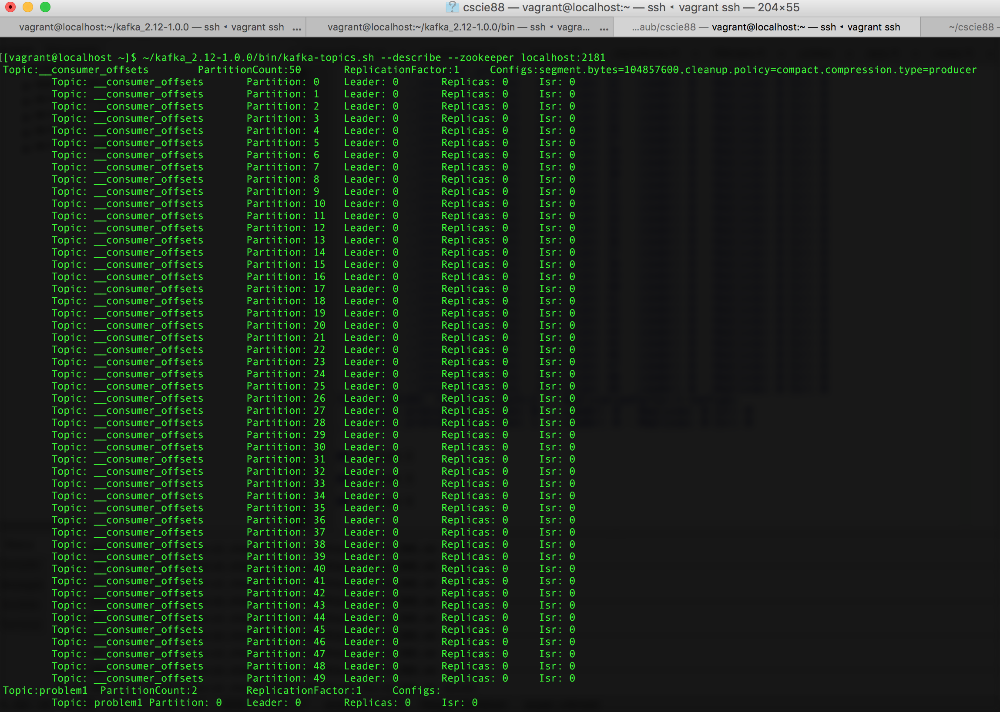

All problems were completed, including problem 5.

## Problem 1

Download Kafka:
```
$ wget http://apache.cs.utah.edu/kafka/1.0.0/kafka_2.12-1.0.0.tgz
$ tar xvf kafka_2.12-1.0.0.tgz
```

Launch Zookeper and Kafka:
```
$ ~/kafka_2.12-1.0.0/bin/zookeeper-server-start.sh ~/kafka_2.12-1.0.0/config/zookeeper.properties
[2018-03-02 18:59:27,513] INFO Reading configuration from: /home/vagrant/kafka_2.12-1.0.0/config/zookeeper.properties (org.apache.zookeeper.server.quorum.QuorumPeerConfig)
[2018-03-02 18:59:27,515] INFO autopurge.snapRetainCount set to 3 (org.apache.zookeeper.server.DatadirCleanupManager)
[2018-03-02 18:59:27,515] INFO autopurge.purgeInterval set to 0 (org.apache.zookeeper.server.DatadirCleanupManager)
[2018-03-02 18:59:27,515] INFO Purge task is not scheduled. (org.apache.zookeeper.server.DatadirCleanupManager)
[2018-03-02 18:59:27,515] WARN Either no config or no quorum defined in config, running  in standalone mode (org.apache.zookeeper.server.quorum.QuorumPeerMain)
[2018-03-02 18:59:27,531] INFO Reading configuration from: /home/vagrant/kafka_2.12-1.0.0/config/zookeeper.properties (org.apache.zookeeper.server.quorum.QuorumPeerConfig)
[2018-03-02 18:59:27,531] INFO Starting server (org.apache.zookeeper.server.ZooKeeperServerMain)
[2018-03-02 18:59:27,540] INFO Server environment:zookeeper.version=3.4.10-39d3a4f269333c922ed3db283be479f9deacaa0f, built on 03/23/2017 10:13 GMT (org.apache.zookeeper.server.ZooKeeperServer)
[2018-03-02 18:59:27,540] INFO Server environment:host.name=localhost (org.apache.zookeeper.server.ZooKeeperServer)
[2018-03-02 18:59:27,540] INFO Server environment:java.version=1.8.0_161 (org.apache.zookeeper.server.ZooKeeperServer)
[2018-03-02 18:59:27,540] INFO Server environment:java.vendor=Oracle Corporation (org.apache.zookeeper.server.ZooKeeperServer)
[2018-03-02 18:59:27,540] INFO Server environment:java.home=/usr/lib/jvm/java-1.8.0-openjdk-1.8.0.161-0.b14.el7_4.x86_64/jre (org.apache.zookeeper.server.ZooKeeperServer)

$ ~/kafka_2.12-1.0.0/bin/kafka-server-start.sh ~/kafka_2.12-1.0.0/config/server.properties
[2018-03-02 19:00:26,379] INFO KafkaConfig values: 
	advertised.host.name = null
	advertised.listeners = null
	advertised.port = null
	alter.config.policy.class.name = null
	authorizer.class.name = 
	auto.create.topics.enable = true
	auto.leader.rebalance.enable = true
	background.threads = 10
	broker.id = 0
	broker.id.generation.enable = true
	broker.rack = null
	compression.type = producer
	connections.max.idle.ms = 600000
	controlled.shutdown.enable = true
	controlled.shutdown.max.retries = 3
	controlled.shutdown.retry.backoff.ms = 5000
	controller.socket.timeout.ms = 30000
	create.topic.policy.class.name = null
	default.replication.factor = 1
	delete.records.purgatory.purge.interval.requests = 1
	delete.topic.enable = true
	fetch.purgatory.purge.interval.requests = 1000
	group.initial.rebalance.delay.ms = 0
	group.max.session.timeout.ms = 300000
	group.min.session.timeout.ms = 6000
	host.name = 
	inter.broker.listener.name = null
	inter.broker.protocol.version = 1.0-IV0
	leader.imbalance.check.interval.seconds = 300
	leader.imbalance.per.broker.percentage = 10
	listener.security.protocol.map = PLAINTEXT:PLAINTEXT,SSL:SSL,SASL_PLAINTEXT:SASL_PLAINTEXT,SASL_SSL:SASL_SSL
	listeners = null
	log.cleaner.backoff.ms = 15000
	log.cleaner.dedupe.buffer.size = 134217728
	log.cleaner.delete.retention.ms = 86400000
	log.cleaner.enable = true
	log.cleaner.io.buffer.load.factor = 0.9
	log.cleaner.io.buffer.size = 524288
	log.cleaner.io.max.bytes.per.second = 1.7976931348623157E308
	log.cleaner.min.cleanable.ratio = 0.5
	log.cleaner.min.compaction.lag.ms = 0
	log.cleaner.threads = 1
	log.cleanup.policy = [delete]
	log.dir = /tmp/kafka-logs
	log.dirs = /tmp/kafka-logs
	log.flush.interval.messages = 9223372036854775807
	log.flush.interval.ms = null
	log.flush.offset.checkpoint.interval.ms = 60000
	log.flush.scheduler.interval.ms = 9223372036854775807
	log.flush.start.offset.checkpoint.interval.ms = 60000
	log.index.interval.bytes = 4096
	log.index.size.max.bytes = 10485760
	log.message.format.version = 1.0-IV0
	log.message.timestamp.difference.max.ms = 9223372036854775807
	log.message.timestamp.type = CreateTime
	log.preallocate = false
	log.retention.bytes = -1
	log.retention.check.interval.ms = 300000
	log.retention.hours = 168
	log.retention.minutes = null
	log.retention.ms = null
	log.roll.hours = 168
	log.roll.jitter.hours = 0
	log.roll.jitter.ms = null
	log.roll.ms = null
	log.segment.bytes = 1073741824
	log.segment.delete.delay.ms = 60000
	max.connections.per.ip = 2147483647
	max.connections.per.ip.overrides = 
	message.max.bytes = 1000012
	metric.reporters = []
	metrics.num.samples = 2
	metrics.recording.level = INFO
	metrics.sample.window.ms = 30000
	min.insync.replicas = 1
	num.io.threads = 8
	num.network.threads = 3
	num.partitions = 1
	num.recovery.threads.per.data.dir = 1
	num.replica.fetchers = 1
	offset.metadata.max.bytes = 4096
	offsets.commit.required.acks = -1
	offsets.commit.timeout.ms = 5000
	offsets.load.buffer.size = 5242880
	offsets.retention.check.interval.ms = 600000
	offsets.retention.minutes = 1440
	offsets.topic.compression.codec = 0
	offsets.topic.num.partitions = 50
	offsets.topic.replication.factor = 1
	offsets.topic.segment.bytes = 104857600
	port = 9092
	principal.builder.class = null
	producer.purgatory.purge.interval.requests = 1000
	queued.max.request.bytes = -1
	queued.max.requests = 500
	quota.consumer.default = 9223372036854775807
	quota.producer.default = 9223372036854775807
	quota.window.num = 11
	quota.window.size.seconds = 1
	replica.fetch.backoff.ms = 1000
	replica.fetch.max.bytes = 1048576
	replica.fetch.min.bytes = 1
	replica.fetch.response.max.bytes = 10485760
	replica.fetch.wait.max.ms = 500
	replica.high.watermark.checkpoint.interval.ms = 5000
	replica.lag.time.max.ms = 10000
	replica.socket.receive.buffer.bytes = 65536
	replica.socket.timeout.ms = 30000
	replication.quota.window.num = 11
	replication.quota.window.size.seconds = 1
	request.timeout.ms = 30000
	reserved.broker.max.id = 1000
	sasl.enabled.mechanisms = [GSSAPI]
	sasl.kerberos.kinit.cmd = /usr/bin/kinit
	sasl.kerberos.min.time.before.relogin = 60000
	sasl.kerberos.principal.to.local.rules = [DEFAULT]
	sasl.kerberos.service.name = null
	sasl.kerberos.ticket.renew.jitter = 0.05
	sasl.kerberos.ticket.renew.window.factor = 0.8
	sasl.mechanism.inter.broker.protocol = GSSAPI
	security.inter.broker.protocol = PLAINTEXT
	socket.receive.buffer.bytes = 102400
	socket.request.max.bytes = 104857600
	socket.send.buffer.bytes = 102400
	ssl.cipher.suites = null
	ssl.client.auth = none
	ssl.enabled.protocols = [TLSv1.2, TLSv1.1, TLSv1]
	ssl.endpoint.identification.algorithm = null
	ssl.key.password = null
	ssl.keymanager.algorithm = SunX509
	ssl.keystore.location = null
	ssl.keystore.password = null
	ssl.keystore.type = JKS
	ssl.protocol = TLS
	ssl.provider = null
	ssl.secure.random.implementation = null
	ssl.trustmanager.algorithm = PKIX
	ssl.truststore.location = null
	ssl.truststore.password = null
	ssl.truststore.type = JKS
	transaction.abort.timed.out.transaction.cleanup.interval.ms = 60000
	transaction.max.timeout.ms = 900000
	transaction.remove.expired.transaction.cleanup.interval.ms = 3600000
	transaction.state.log.load.buffer.size = 5242880
	transaction.state.log.min.isr = 1
	transaction.state.log.num.partitions = 50
	transaction.state.log.replication.factor = 1
	transaction.state.log.segment.bytes = 104857600
	transactional.id.expiration.ms = 604800000
	unclean.leader.election.enable = false
	zookeeper.connect = localhost:2181
	zookeeper.connection.timeout.ms = 6000
	zookeeper.session.timeout.ms = 6000
	zookeeper.set.acl = false
	zookeeper.sync.time.ms = 2000
 (kafka.server.KafkaConfig)
[2018-03-02 19:00:26,449] INFO starting (kafka.server.KafkaServer)
[2018-03-02 19:00:26,453] INFO Connecting to zookeeper on localhost:2181 (kafka.server.KafkaServer)
[2018-03-02 19:00:26,473] INFO Starting ZkClient event thread. (org.I0Itec.zkclient.ZkEventThread)
[2018-03-02 19:00:26,480] INFO Client environment:zookeeper.version=3.4.10-39d3a4f269333c922ed3db283be479f9deacaa0f, built on 03/23/2017 10:13 GMT (org.apache.zookeeper.ZooKeeper)
[2018-03-02 19:00:26,480] INFO Client environment:host.name=localhost (org.apache.zookeeper.ZooKeeper)
[2018-03-02 19:00:26,480] INFO Client environment:java.version=1.8.0_161 (org.apache.zookeeper.ZooKeeper)
[2018-03-02 19:00:26,480] INFO Client environment:java.vendor=Oracle Corporation (org.apache.zookeeper.ZooKeeper)
[2018-03-02 19:00:26,480] INFO Client environment:java.home=/usr/lib/jvm/java-1.8.0-openjdk-1.8.0.161-0.b14.el7_4.x86_64/jre (org.apache.zookeeper.ZooKeeper)
```

Now create out topic and verify that it has been created:
```
$ ~/kafka_2.12-1.0.0/bin/kafka-topics.sh --create --zookeeper localhost:2181 --replication-factor 1 --partitions 2 --topic problem1
Created topic "problem1".
$ ~/kafka_2.12-1.0.0/bin/kafka-topics.sh --list --zookeeper localhost:2181
problem1
```

View the cluster and its state:
```
$ ~/kafka_2.12-1.0.0/bin/kafka-topics.sh --describe --zookeeper localhost:2181
Topic:problem1	PartitionCount:2	ReplicationFactor:1	Configs:
	Topic: problem1	Partition: 0	Leader: 0	Replicas: 0	Isr: 0
	Topic: problem1	Partition: 1	Leader: 0	Replicas: 0	Isr: 0
```

We will launch two new terminal session for the producer and the consumer. For the producer we submit four messages:
```
$ ~/kafka_2.12-1.0.0/bin/kafka-console-producer.sh --broker-list localhost:9092 --topic problem1
>hello
>world
>foo
>bar
```

In the consumer we view these messages
```
$ ~/kafka_2.12-1.0.0/bin/kafka-console-consumer.sh --bootstrap-server localhost:9092 --topic problem1 --from-beginning
world
bar
hello
foo
```

We run `describe` again to look at the cluster's state:
```
$ ~/kafka_2.12-1.0.0/bin/kafka-topics.sh --describe --zookeeper localhost:2181
Topic:__consumer_offsets	PartitionCount:50	ReplicationFactor:1	Configs:segment.bytes=104857600,cleanup.policy=compact,compression.type=producer
	Topic: __consumer_offsets	Partition: 0	Leader: 0	Replicas: 0	Isr: 0
	Topic: __consumer_offsets	Partition: 1	Leader: 0	Replicas: 0	Isr: 0
	Topic: __consumer_offsets	Partition: 2	Leader: 0	Replicas: 0	Isr: 0
	Topic: __consumer_offsets	Partition: 3	Leader: 0	Replicas: 0	Isr: 0
	Topic: __consumer_offsets	Partition: 4	Leader: 0	Replicas: 0	Isr: 0
	Topic: __consumer_offsets	Partition: 5	Leader: 0	Replicas: 0	Isr: 0
	Topic: __consumer_offsets	Partition: 6	Leader: 0	Replicas: 0	Isr: 0
	Topic: __consumer_offsets	Partition: 7	Leader: 0	Replicas: 0	Isr: 0
	Topic: __consumer_offsets	Partition: 8	Leader: 0	Replicas: 0	Isr: 0
	Topic: __consumer_offsets	Partition: 9	Leader: 0	Replicas: 0	Isr: 0
	Topic: __consumer_offsets	Partition: 10	Leader: 0	Replicas: 0	Isr: 0
	Topic: __consumer_offsets	Partition: 11	Leader: 0	Replicas: 0	Isr: 0
	Topic: __consumer_offsets	Partition: 12	Leader: 0	Replicas: 0	Isr: 0
	Topic: __consumer_offsets	Partition: 13	Leader: 0	Replicas: 0	Isr: 0
	Topic: __consumer_offsets	Partition: 14	Leader: 0	Replicas: 0	Isr: 0
	Topic: __consumer_offsets	Partition: 15	Leader: 0	Replicas: 0	Isr: 0
	Topic: __consumer_offsets	Partition: 16	Leader: 0	Replicas: 0	Isr: 0
	Topic: __consumer_offsets	Partition: 17	Leader: 0	Replicas: 0	Isr: 0
	Topic: __consumer_offsets	Partition: 18	Leader: 0	Replicas: 0	Isr: 0
	Topic: __consumer_offsets	Partition: 19	Leader: 0	Replicas: 0	Isr: 0
	Topic: __consumer_offsets	Partition: 20	Leader: 0	Replicas: 0	Isr: 0
	Topic: __consumer_offsets	Partition: 21	Leader: 0	Replicas: 0	Isr: 0
	Topic: __consumer_offsets	Partition: 22	Leader: 0	Replicas: 0	Isr: 0
	Topic: __consumer_offsets	Partition: 23	Leader: 0	Replicas: 0	Isr: 0
	Topic: __consumer_offsets	Partition: 24	Leader: 0	Replicas: 0	Isr: 0
	Topic: __consumer_offsets	Partition: 25	Leader: 0	Replicas: 0	Isr: 0
	Topic: __consumer_offsets	Partition: 26	Leader: 0	Replicas: 0	Isr: 0
	Topic: __consumer_offsets	Partition: 27	Leader: 0	Replicas: 0	Isr: 0
	Topic: __consumer_offsets	Partition: 28	Leader: 0	Replicas: 0	Isr: 0
	Topic: __consumer_offsets	Partition: 29	Leader: 0	Replicas: 0	Isr: 0
	Topic: __consumer_offsets	Partition: 30	Leader: 0	Replicas: 0	Isr: 0
	Topic: __consumer_offsets	Partition: 31	Leader: 0	Replicas: 0	Isr: 0
	Topic: __consumer_offsets	Partition: 32	Leader: 0	Replicas: 0	Isr: 0
	Topic: __consumer_offsets	Partition: 33	Leader: 0	Replicas: 0	Isr: 0
	Topic: __consumer_offsets	Partition: 34	Leader: 0	Replicas: 0	Isr: 0
	Topic: __consumer_offsets	Partition: 35	Leader: 0	Replicas: 0	Isr: 0
	Topic: __consumer_offsets	Partition: 36	Leader: 0	Replicas: 0	Isr: 0
	Topic: __consumer_offsets	Partition: 37	Leader: 0	Replicas: 0	Isr: 0
	Topic: __consumer_offsets	Partition: 38	Leader: 0	Replicas: 0	Isr: 0
	Topic: __consumer_offsets	Partition: 39	Leader: 0	Replicas: 0	Isr: 0
	Topic: __consumer_offsets	Partition: 40	Leader: 0	Replicas: 0	Isr: 0
	Topic: __consumer_offsets	Partition: 41	Leader: 0	Replicas: 0	Isr: 0
	Topic: __consumer_offsets	Partition: 42	Leader: 0	Replicas: 0	Isr: 0
	Topic: __consumer_offsets	Partition: 43	Leader: 0	Replicas: 0	Isr: 0
	Topic: __consumer_offsets	Partition: 44	Leader: 0	Replicas: 0	Isr: 0
	Topic: __consumer_offsets	Partition: 45	Leader: 0	Replicas: 0	Isr: 0
	Topic: __consumer_offsets	Partition: 46	Leader: 0	Replicas: 0	Isr: 0
	Topic: __consumer_offsets	Partition: 47	Leader: 0	Replicas: 0	Isr: 0
	Topic: __consumer_offsets	Partition: 48	Leader: 0	Replicas: 0	Isr: 0
	Topic: __consumer_offsets	Partition: 49	Leader: 0	Replicas: 0	Isr: 0
Topic:problem1	PartitionCount:2	ReplicationFactor:1	Configs:
	Topic: problem1	Partition: 0	Leader: 0	Replicas: 0	Isr: 0
	Topic: problem1	Partition: 1	Leader: 0	Replicas: 0	Isr: 0
```


Finally, we check the commit log for each of the two partitions:
```
$ ~/kafka_2.12-1.0.0/bin/kafka-run-class.sh kafka.tools.DumpLogSegments  --transaction-log-decoder --files /tmp/kafka-logs/problem1-0/00000000000000000000.log
Dumping /tmp/kafka-logs/problem1-0/00000000000000000000.log
Starting offset: 0
baseOffset: 0 lastOffset: 0 baseSequence: -1 lastSequence: -1 producerId: -1 producerEpoch: -1 partitionLeaderEpoch: 0 isTransactional: false position: 0 CreateTime: 1520017981884 isvalid: true size: 73 magic: 2 compresscodec: NONE crc: 1614140345
baseOffset: 1 lastOffset: 1 baseSequence: -1 lastSequence: -1 producerId: -1 producerEpoch: -1 partitionLeaderEpoch: 0 isTransactional: false position: 73 CreateTime: 1520017985299 isvalid: true size: 71 magic: 2 compresscodec: NONE crc: 3833554304

$ ~/kafka_2.12-1.0.0/bin/kafka-run-class.sh kafka.tools.DumpLogSegments  --transaction-log-decoder --files /tmp/kafka-logs/problem1-1/00000000000000000000.log
Dumping /tmp/kafka-logs/problem1-1/00000000000000000000.log
Starting offset: 0
baseOffset: 0 lastOffset: 0 baseSequence: -1 lastSequence: -1 producerId: -1 producerEpoch: -1 partitionLeaderEpoch: 0 isTransactional: false position: 0 CreateTime: 1520017980068 isvalid: true size: 73 magic: 2 compresscodec: NONE crc: 1790533959
baseOffset: 1 lastOffset: 1 baseSequence: -1 lastSequence: -1 producerId: -1 producerEpoch: -1 partitionLeaderEpoch: 0 isTransactional: false position: 73 CreateTime: 1520017983436 isvalid: true size: 71 magic: 2 compresscodec: NONE crc: 2860924450
```

## Problem 2

The Flume configuration in `p2.conf`:
```
a1.channels = ch-1
a1.channels.ch-1.type = memory
a1.channels.ch-1.capacity = 10000
a1.channels.ch-1.transactionCapacity = 100

a1.sources = src-1
a1.sources.src-1.type = exec
a1.sources.src-1.channels = ch-1
a1.sources.src-1.command = sudo tail -F /var/log/httpd/access_log

a1.sinks = k1
a1.sinks.k1.type = org.apache.flume.sink.kafka.KafkaSink
a1.sinks.k1.channel = ch-1
a1.sinks.k1.kafka.topic = problem2
a1.sinks.k1.kafka.bootstrap.servers = localhost:9092
```
We create our topic:
```
$ ~/kafka_2.12-1.0.0/bin/kafka-topics.sh --create --zookeeper localhost:2181 --replication-factor 1 --partitions 2 --topic problem2
Created topic "problem2".
```

Launch the Flume agent and our generator script to create a modest 10 mps:
```
$ ./generator.sh 10
$ ~/apache-flume-1.8.0-bin/bin/flume-ng agent --conf ~/apache-flume-1.8.0-bin/conf --conf-file p2.conf --name a1 -Dflume.root.logger=INFO,console
``

We'll launch a console consumer to watch the messages passed from Flume:
```
$ ~/kafka_2.12-1.0.0/bin/kafka-console-consumer.sh --bootstrap-server localhost:9092 --topic problem2 --from-beginning
::1 - - [02/Mar/2018:15:16:04 +0000] "GET / HTTP/1.1" 200 85 "-" "curl/7.29.0"
::1 - - [02/Mar/2018:15:16:04 +0000] "GET / HTTP/1.1" 200 85 "-" "curl/7.29.0"
::1 - - [02/Mar/2018:15:16:04 +0000] "GET / HTTP/1.1" 200 85 "-" "curl/7.29.0"
::1 - - [02/Mar/2018:15:16:04 +0000] "GET / HTTP/1.1" 200 85 "-" "curl/7.29.0"
::1 - - [02/Mar/2018:15:16:04 +0000] "GET / HTTP/1.1" 200 85 "-" "curl/7.29.0"
::1 - - [02/Mar/2018:15:16:04 +0000] "GET / HTTP/1.1" 200 85 "-" "curl/7.29.0"
::1 - - [02/Mar/2018:15:16:04 +0000] "GET / HTTP/1.1" 200 85 "-" "curl/7.29.0"
::1 - - [02/Mar/2018:15:16:04 +0000] "GET / HTTP/1.1" 200 85 "-" "curl/7.29.0"
::1 - - [02/Mar/2018:15:16:04 +0000] "GET / HTTP/1.1" 200 85 "-" "curl/7.29.0"
::1 - - [02/Mar/2018:15:16:04 +0000] "GET / HTTP/1.1" 200 85 "-" "curl/7.29.0"
::1 - - [03/Mar/2018:09:07:01 +0000] "GET / HTTP/1.1" 200 85 "-" "curl/7.29.0"
::1 - - [03/Mar/2018:09:07:01 +0000] "GET / HTTP/1.1" 200 85 "-" "curl/7.29.0"
::1 - - [03/Mar/2018:09:07:01 +0000] "GET / HTTP/1.1" 200 85 "-" "curl/7.29.0"
::1 - - [03/Mar/2018:09:07:01 +0000] "GET / HTTP/1.1" 200 85 "-" "curl/7.29.0"
::1 - - [03/Mar/2018:09:07:01 +0000] "GET / HTTP/1.1" 200 85 "-" "curl/7.29.0"
::1 - - [03/Mar/2018:09:07:02 +0000] "GET / HTTP/1.1" 200 85 "-" "curl/7.29.0"
::1 - - [03/Mar/2018:09:07:02 +0000] "GET / HTTP/1.1" 200 85 "-" "curl/7.29.0"
::1 - - [03/Mar/2018:09:07:02 +0000] "GET / HTTP/1.1" 200 85 "-" "curl/7.29.0"
::1 - - [03/Mar/2018:09:07:02 +0000] "GET / HTTP/1.1" 200 85 "-" "curl/7.29.0"
::1 - - [03/Mar/2018:09:07:03 +0000] "GET / HTTP/1.1" 200 85 "-" "curl/7.29.0"
::1 - - [03/Mar/2018:09:07:03 +0000] "GET / HTTP/1.1" 200 85 "-" "curl/7.29.0"
::1 - - [03/Mar/2018:09:07:01 +0000] "GET / HTTP/1.1" 200 85 "-" "curl/7.29.0"
::1 - - [03/Mar/2018:09:07:01 +0000] "GET / HTTP/1.1" 200 85 "-" "curl/7.29.0"
::1 - - [03/Mar/2018:09:07:01 +0000] "GET / HTTP/1.1" 200 85 "-" "curl/7.29.0"
::1 - - [03/Mar/2018:09:07:02 +0000] "GET / HTTP/1.1" 200 85 "-" "curl/7.29.0"
::1 - - [03/Mar/2018:09:07:02 +0000] "GET / HTTP/1.1" 200 85 "-" "curl/7.29.0"
::1 - - [03/Mar/2018:09:07:02 +0000] "GET / HTTP/1.1" 200 85 "-" "curl/7.29.0"
::1 - - [03/Mar/2018:09:07:02 +0000] "GET / HTTP/1.1" 200 85 "-" "curl/7.29.0"
::1 - - [03/Mar/2018:09:07:03 +0000] "GET / HTTP/1.1" 200 85 "-" "curl/7.29.0"
::1 - - [03/Mar/2018:09:07:03 +0000] "GET / HTTP/1.1" 200 85 "-" "curl/7.29.0"
::1 - - [03/Mar/2018:09:07:03 +0000] "GET / HTTP/1.1" 200 85 "-" "curl/7.29.0"
::1 - - [03/Mar/2018:09:07:03 +0000] "GET / HTTP/1.1" 200 85 "-" "curl/7.29.0"
::1 - - [03/Mar/2018:09:07:03 +0000] "GET / HTTP/1.1" 200 85 "-" "curl/7.29.0"
::1 - - [03/Mar/2018:09:07:04 +0000] "GET / HTTP/1.1" 200 85 "-" "curl/7.29.0"
::1 - - [03/Mar/2018:09:07:04 +0000] "GET / HTTP/1.1" 200 85 "-" "curl/7.29.0"
::1 - - [03/Mar/2018:09:07:04 +0000] "GET / HTTP/1.1" 200 85 "-" "curl/7.29.0"
::1 - - [03/Mar/2018:09:07:04 +0000] "GET / HTTP/1.1" 200 85 "-" "curl/7.29.0"
::1 - - [03/Mar/2018:09:07:05 +0000] "GET / HTTP/1.1" 200 85 "-" "curl/7.29.0"
::1 - - [03/Mar/2018:09:07:03 +0000] "GET / HTTP/1.1" 200 85 "-" "curl/7.29.0"
::1 - - [03/Mar/2018:09:07:03 +0000] "GET / HTTP/1.1" 200 85 "-" "curl/7.29.0"
::1 - - [03/Mar/2018:09:07:04 +0000] "GET / HTTP/1.1" 200 85 "-" "curl/7.29.0"
::1 - - [03/Mar/2018:09:07:04 +0000] "GET / HTTP/1.1" 200 85 "-" "curl/7.29.0"
::1 - - [03/Mar/2018:09:07:04 +0000] "GET / HTTP/1.1" 200 85 "-" "curl/7.29.0"
::1 - - [03/Mar/2018:09:07:04 +0000] "GET / HTTP/1.1" 200 85 "-" "curl/7.29.0"
::1 - - [03/Mar/2018:09:07:05 +0000] "GET / HTTP/1.1" 200 85 "-" "curl/7.29.0"
::1 - - [03/Mar/2018:09:07:05 +0000] "GET / HTTP/1.1" 200 85 "-" "curl/7.29.0"
::1 - - [03/Mar/2018:09:07:05 +0000] "GET / HTTP/1.1" 200 85 "-" "curl/7.29.0"
::1 - - [03/Mar/2018:09:07:05 +0000] "GET / HTTP/1.1" 200 85 "-" "curl/7.29.0"
::1 - - [03/Mar/2018:09:07:05 +0000] "GET / HTTP/1.1" 200 85 "-" "curl/7.29.0"
::1 - - [03/Mar/2018:09:07:05 +0000] "GET / HTTP/1.1" 200 85 "-" "curl/7.29.0"
::1 - - [03/Mar/2018:09:07:05 +0000] "GET / HTTP/1.1" 200 85 "-" "curl/7.29.0"
```

The we compare the timestamp of the last events in our Kafka consume with the last events that appear in our access log and see that they match:
```
$ sudo tail -f /var/log/httpd/access_log
::1 - - [03/Mar/2018:09:07:04 +0000] "GET / HTTP/1.1" 200 85 "-" "curl/7.29.0"
::1 - - [03/Mar/2018:09:07:04 +0000] "GET / HTTP/1.1" 200 85 "-" "curl/7.29.0"
::1 - - [03/Mar/2018:09:07:05 +0000] "GET / HTTP/1.1" 200 85 "-" "curl/7.29.0"
::1 - - [03/Mar/2018:09:07:05 +0000] "GET / HTTP/1.1" 200 85 "-" "curl/7.29.0"
::1 - - [03/Mar/2018:09:07:05 +0000] "GET / HTTP/1.1" 200 85 "-" "curl/7.29.0"
::1 - - [03/Mar/2018:09:07:05 +0000] "GET / HTTP/1.1" 200 85 "-" "curl/7.29.0"
::1 - - [03/Mar/2018:09:07:05 +0000] "GET / HTTP/1.1" 200 85 "-" "curl/7.29.0"
::1 - - [03/Mar/2018:09:07:05 +0000] "GET / HTTP/1.1" 200 85 "-" "curl/7.29.0"
::1 - - [03/Mar/2018:09:07:05 +0000] "GET / HTTP/1.1" 200 85 "-" "curl/7.29.0"
::1 - - [03/Mar/2018:09:07:05 +0000] "GET / HTTP/1.1" 200 85 "-" "curl/7.29.0"
```

Now to utilize a UUID with the kafka record headers we modify our Flume configuration to include an interceptor that adds a UUID in `p2_interceptor.conf`:
```
a1.channels = ch-1
a1.channels.ch-1.type = memory
a1.channels.ch-1.capacity = 10000
a1.channels.ch-1.transactionCapacity = 100

a1.sources = src-1
a1.sources.src-1.type = exec
a1.sources.src-1.channels = ch-1
a1.sources.src-1.command = sudo tail -F /var/log/httpd/access_log
a1.sources.src-1.interceptors = i1
a1.sources.src-1.interceptors.i1.type = org.apache.flume.sink.solr.morphline.UUIDInterceptor$Builder

a1.sinks = k1
a1.sinks.k1.type = org.apache.flume.sink.kafka.KafkaSink
a1.sinks.k1.channel = ch-1
a1.sinks.k1.kafka.topic = problem2
a1.sinks.k1.kafka.bootstrap.servers = localhost:9092
```

TODO: verify UUID appear in record headers

## Problem 3

To produce messages, we will run `p3_producer.py`:
```
"""
A Kafka producer that generates events at a specified rate with a timestamp, user, and URL.
"""
import argparse
import datetime
import hashlib
import random
import time

from kafka import KafkaProducer

parser = argparse.ArgumentParser()
parser.add_argument('--rate', type=float, default=1,
                    help='Number of events per second to generate')
parser.add_argument('--seed', type=int, default=12345,
                    help='See to use for reproducibility')
args = parser.parse_args()
sleep_time = 1 / args.rate
seed = args.seed

users = ['foo', 'bar', 'baz']
urls = ['https://en.wikipedia.org/wiki/Apache_Flume',
        'https://en.wikipedia.org/wiki/Main_Page',
        'https://en.wikipedia.org/wiki/Apache_Kafka']

producer = KafkaProducer(bootstrap_servers='localhost:9092')
random.seed(seed)
while True:
    # Select a random user and URL
    user = random.choice(users)
    url = random.choice(urls)
    # Get the current time in UTC
    current_time = str(datetime.datetime.utcnow())
    # Generate a UUID for the event
    identifier = str([current_time, url, user]).encode('utf-8')
    uuid = hashlib.md5(identifier).hexdigest()
    # Build final message and send to the Kafka cluster
    message = '{}\t{}\t{}\t{}'.format(uuid, current_time, url, user)
    producer.send('problem3', message)
    time.sleep(sleep_time)

```

Create out topic with 3 partitions and launch our Python producer:
```
$ ~/kafka_2.12-1.0.0/bin/kafka-topics.sh --create --zookeeper localhost:2181 --replication-factor 1 --partitions 3 --topic problem3
Created topic "problem3".
$ python p3_producer.py 
```

And then we see the messages appear in our Kafka console consumer:
```
$ ~/kafka_2.12-1.0.0/bin/kafka-console-consumer.sh --bootstrap-server localhost:9092 --topic problem3 --from-beginning
af5c05a04b473e16ceffff0e8effc4bf	2018-03-03 19:11:13.831716	https://en.wikipedia.org/wiki/Apache_Flume	bar
cf3ed4ec135000c7e6a986f9d6b251a0	2018-03-03 19:11:14.834083	https://en.wikipedia.org/wiki/Main_Page	foo
82caef1d9d22a0af965d82c70d62c9d6	2018-03-03 19:11:15.834735	https://en.wikipedia.org/wiki/Apache_Flume	bar
b196992ef248e94de3fb8ff3af0bef3e	2018-03-03 19:11:16.837919	https://en.wikipedia.org/wiki/Main_Page	bar
8cf5636b706a85246febc367d5c667b6	2018-03-03 19:11:17.850812	https://en.wikipedia.org/wiki/Main_Page	bar
b500b7fea3f52a5b894bda13ed426466	2018-03-03 19:11:18.851872	https://en.wikipedia.org/wiki/Apache_Kafka	foo
823a0957e63b47a007f5793570219dce	2018-03-03 19:11:19.859302	https://en.wikipedia.org/wiki/Apache_Flume	bar
9405349f3b06faa9761d118cba1e533a	2018-03-03 19:11:20.864085	https://en.wikipedia.org/wiki/Main_Page	foo
3c3b647bac90ff5c39d4a1879f670d05	2018-03-03 19:11:21.869171	https://en.wikipedia.org/wiki/Apache_Kafka	bar
268a419180c043ad4f840789932fa4e1	2018-03-03 19:11:22.871213	https://en.wikipedia.org/wiki/Apache_Flume	baz
31ecde0365edc556ea7c3ff5403d3e76	2018-03-03 19:11:23.874269	https://en.wikipedia.org/wiki/Apache_Kafka	baz
c82c35a9471ecf07b9907d20fb7f7691	2018-03-03 19:11:24.879059	https://en.wikipedia.org/wiki/Main_Page	foo
b4022af71efbe643cf7fb494d9b16ec4	2018-03-03 19:11:25.880389	https://en.wikipedia.org/wiki/Apache_Kafka	bar
6cd9df7d0ebb504a244c828cb00353b8	2018-03-03 19:11:26.884465	https://en.wikipedia.org/wiki/Apache_Kafka	bar
bc12afae1a425def3f83904a1f84e5e7	2018-03-03 19:11:27.885213	https://en.wikipedia.org/wiki/Apache_Flume	baz
21af41fd5e08d3d8b19288f4e5ded1a8	2018-03-03 19:11:28.886150	https://en.wikipedia.org/wiki/Apache_Kafka	foo
```

Now we hook up a Python consumer `p3_consumer.py` to read the data:
```
"""
A Kafka consumer that consumes from the problem3 topic.
"""

from kafka import KafkaConsumer

def print_distribution(data):
    """
    Print a summary of the frequency of each partition encounter. This will show the balance of
    load across the partitions
    :param data: A list containing the partition numbers
    """
    unique_partitions = list(set(data))
    num_elements = len(data)
    for partition in unique_partitions:
        partition_count = data.count(partition)
        print('Partition {}: {}'.format(partition, partition_count))


consumer = KafkaConsumer('problem3')
count = 0
# Keep track of which partitions 
partitions = []
for msg in consumer:
    print(msg)
    count += 1
    partitions.append(msg.partition)
    # Print a distribution of the partitions every 1000 events
    if not count % 1000:
        print_distribution(partitions)
```


To demonstrate that the load distribution is split evenly across the partitions, after 1000 messages it will also print out a summary of the load across the partitions. So that we do not need to wait very long to reach 1000 messages, our producer was launcher with a faster `--rate 50` argument. The last few events before the partition statistics are included below:
```
$ python p3_consumer.py 
ConsumerRecord(topic=u'problem3', partition=1, offset=745, timestamp=1520114161551, timestamp_type=0, key=None, value='e4e0650557a9060e98a39525637b0733\t2018-03-03 21:56:01.550845\thttps://en.wikipedia.org/wiki/Main_Page\tbar', checksum=None, serialized_key_size=-1, serialized_value_size=103)
ConsumerRecord(topic=u'problem3', partition=0, offset=899, timestamp=1520114161756, timestamp_type=0, key=None, value='005057a2e5354080c860d4ccb9928a6a\t2018-03-03 21:56:01.755995\thttps://en.wikipedia.org/wiki/Apache_Flume\tfoo', checksum=None, serialized_key_size=-1, serialized_value_size=106)
ConsumerRecord(topic=u'problem3', partition=1, offset=746, timestamp=1520114161573, timestamp_type=0, key=None, value='b42ce2e616ca368d762429caa8312e6c\t2018-03-03 21:56:01.572880\thttps://en.wikipedia.org/wiki/Main_Page\tfoo', checksum=None, serialized_key_size=-1, serialized_value_size=103)
ConsumerRecord(topic=u'problem3', partition=1, offset=747, timestamp=1520114161602, timestamp_type=0, key=None, value='852adc4d33d5b51ecc2375979e8ce0a5\t2018-03-03 21:56:01.602628\thttps://en.wikipedia.org/wiki/Apache_Kafka\tfoo', checksum=None, serialized_key_size=-1, serialized_value_size=106)
ConsumerRecord(topic=u'problem3', partition=1, offset=748, timestamp=1520114161677, timestamp_type=0, key=None, value='a2dbf13ffc20f8d434696956a231d885\t2018-03-03 21:56:01.677720\thttps://en.wikipedia.org/wiki/Apache_Flume\tfoo', checksum=None, serialized_key_size=-1, serialized_value_size=106)
ConsumerRecord(topic=u'problem3', partition=1, offset=749, timestamp=1520114161700, timestamp_type=0, key=None, value='55e35718f75671f8c65ab8db65293269\t2018-03-03 21:56:01.699985\thttps://en.wikipedia.org/wiki/Apache_Kafka\tbar', checksum=None, serialized_key_size=-1, serialized_value_size=106)
ConsumerRecord(topic=u'problem3', partition=2, offset=757, timestamp=1520114161631, timestamp_type=0, key=None, value='9e19b07d922efa44ab7084eeb36181b7\t2018-03-03 21:56:01.630908\thttps://en.wikipedia.org/wiki/Main_Page\tbaz', checksum=None, serialized_key_size=-1, serialized_value_size=103)
ConsumerRecord(topic=u'problem3', partition=2, offset=758, timestamp=1520114161654, timestamp_type=0, key=None, value='0f5d95cddf150fe213d5f0c705896718\t2018-03-03 21:56:01.654250\thttps://en.wikipedia.org/wiki/Main_Page\tfoo', checksum=None, serialized_key_size=-1, serialized_value_size=103)
ConsumerRecord(topic=u'problem3', partition=2, offset=759, timestamp=1520114161729, timestamp_type=0, key=None, value='eb9b2497d7e2bcc2c3ffecbd2c747221\t2018-03-03 21:56:01.728838\thttps://en.wikipedia.org/wiki/Apache_Flume\tfoo', checksum=None, serialized_key_size=-1, serialized_value_size=106)
ConsumerRecord(topic=u'problem3', partition=0, offset=900, timestamp=1520114161786, timestamp_type=0, key=None, value='06879b5ddda9cee3a35105968b758f61\t2018-03-03 21:56:01.786486\thttps://en.wikipedia.org/wiki/Apache_Kafka\tbar', checksum=None, serialized_key_size=-1, serialized_value_size=106)
ConsumerRecord(topic=u'problem3', partition=1, offset=750, timestamp=1520114161815, timestamp_type=0, key=None, value='fb96cf64a3d95420e6e351402adaf6d3\t2018-03-03 21:56:01.815605\thttps://en.wikipedia.org/wiki/Apache_Kafka\tbar', checksum=None, serialized_key_size=-1, serialized_value_size=106)
ConsumerRecord(topic=u'problem3', partition=0, offset=901, timestamp=1520114161915, timestamp_type=0, key=None, value='d81bb8b120598b0f555a5fd07d922bd4\t2018-03-03 21:56:01.915159\thttps://en.wikipedia.org/wiki/Apache_Flume\tfoo', checksum=None, serialized_key_size=-1, serialized_value_size=106)
Partition 0: 365
Partition 1: 318
Partition 2: 317
```

We can see the offsets, partitions, the headers, and the body of the events. The last three lines show that each partition receives approximately one third of the messages.

## Problem 4

