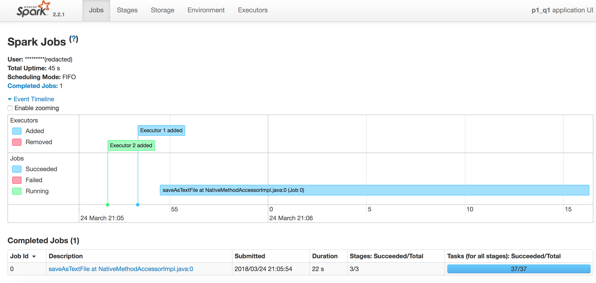
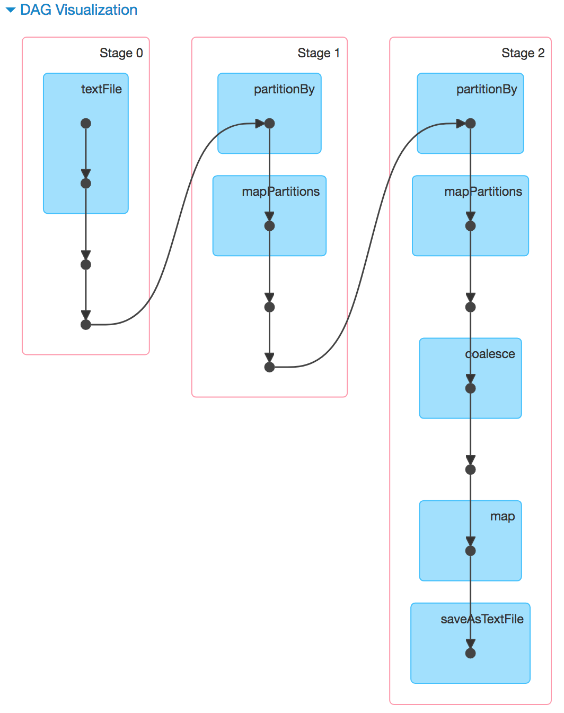
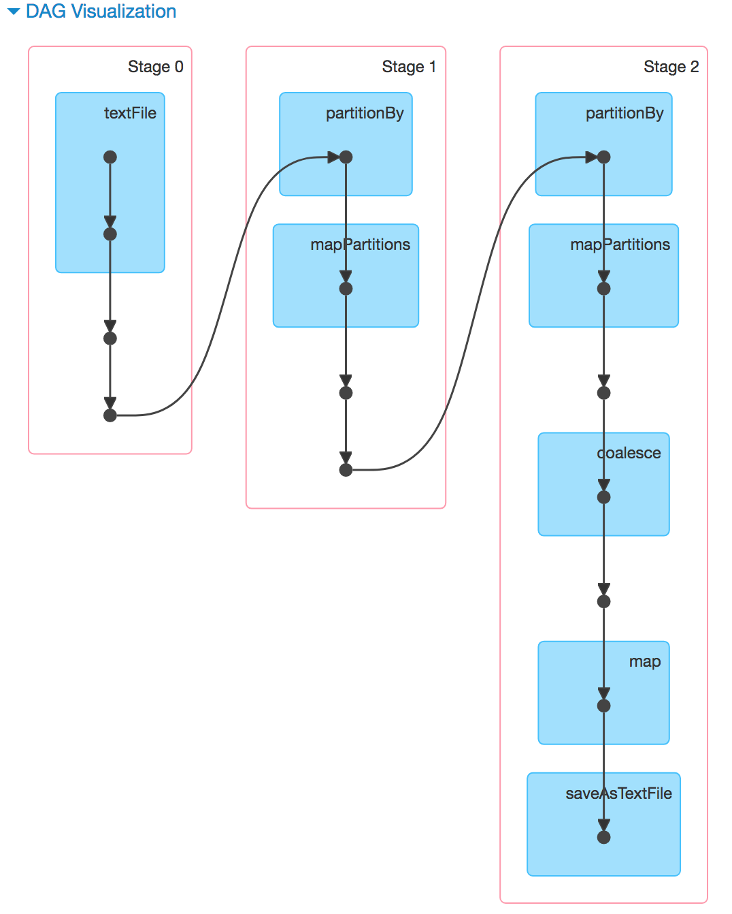
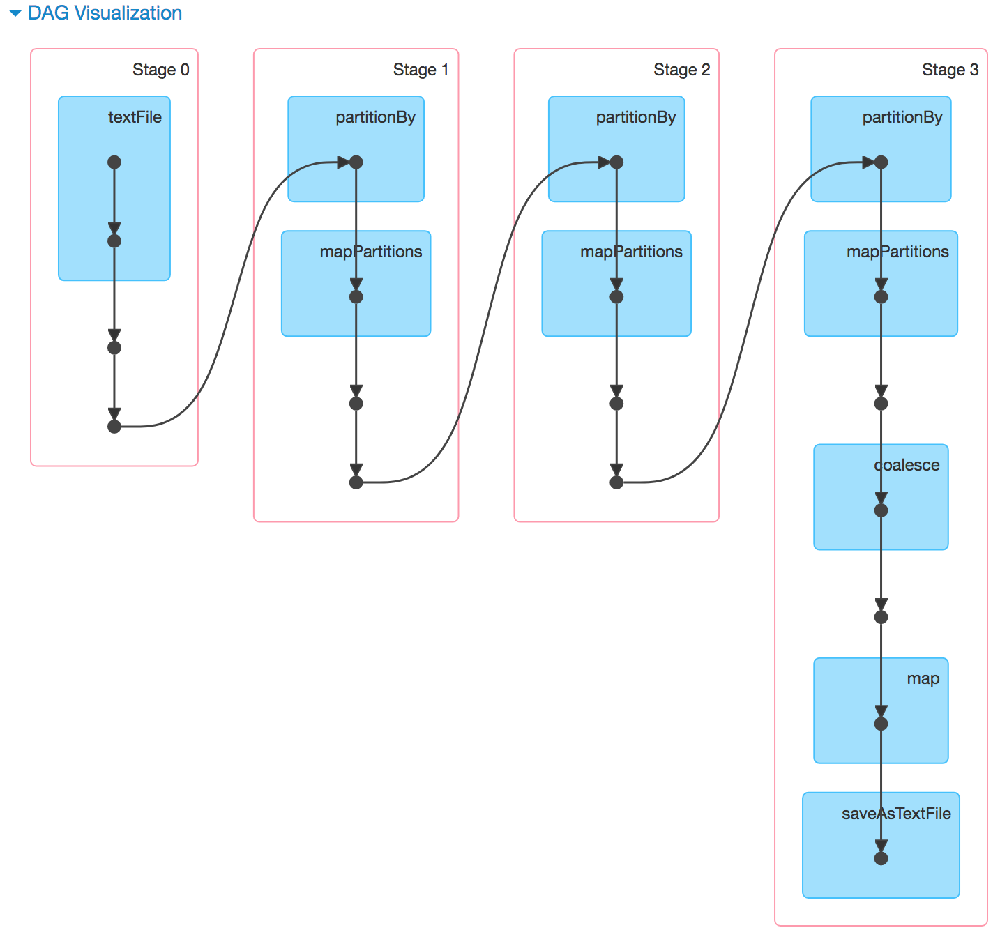
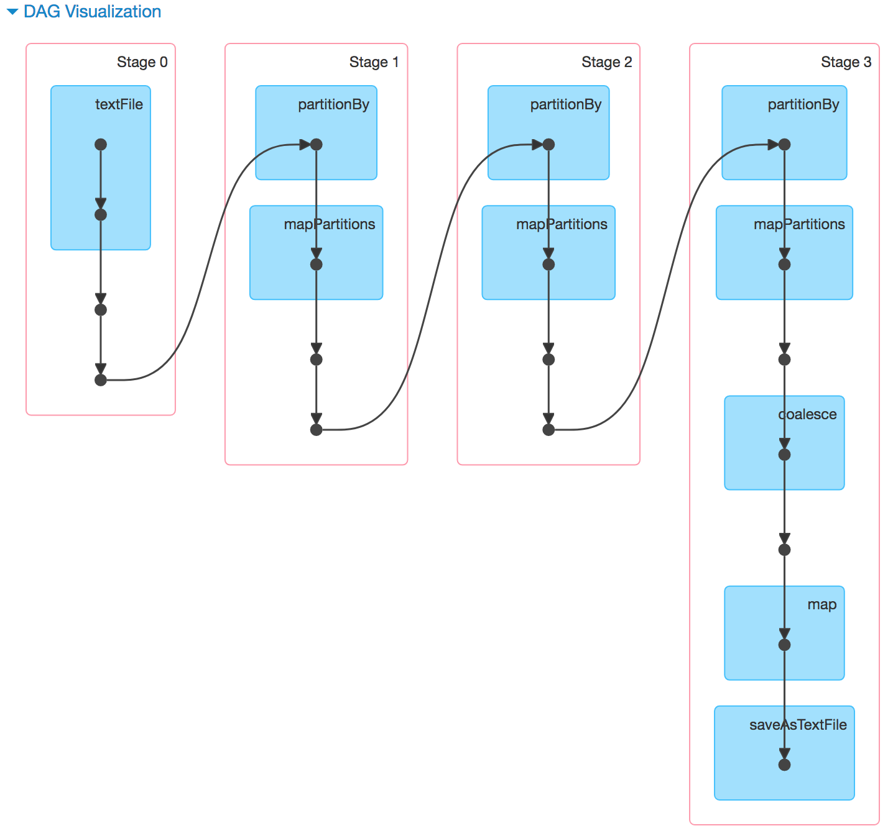
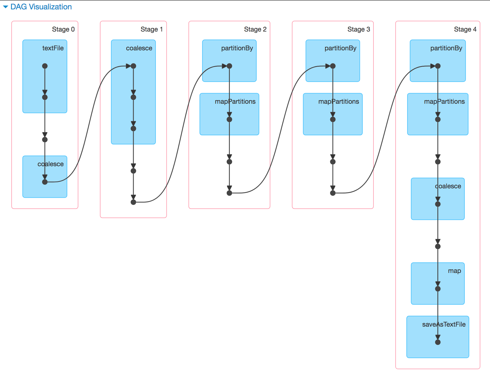
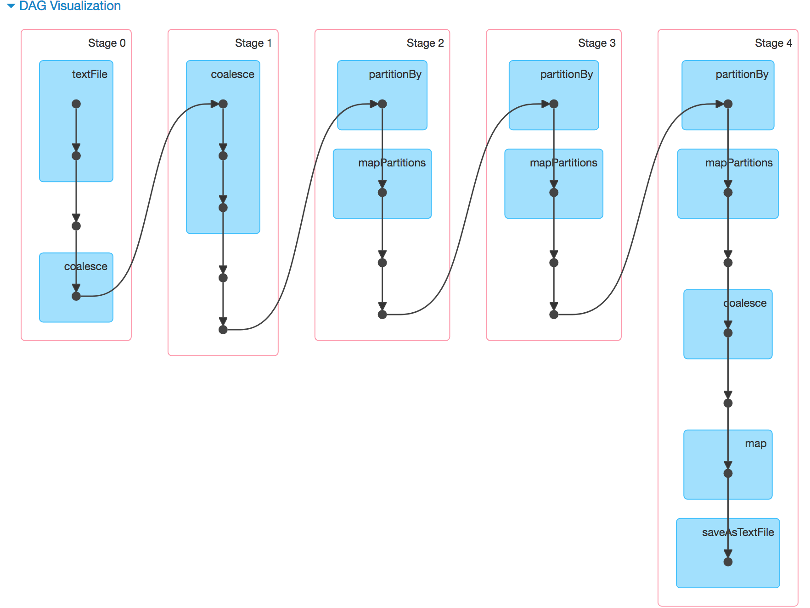
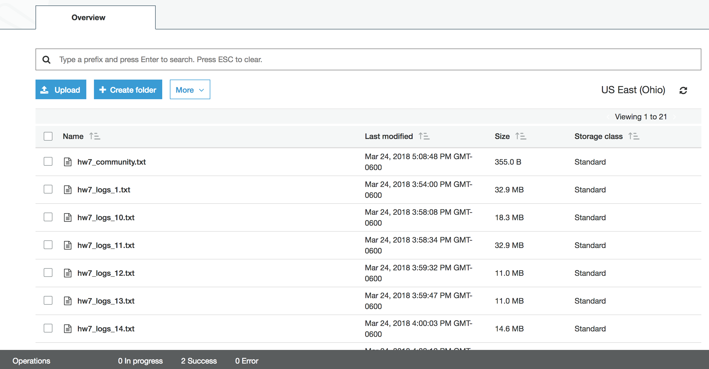
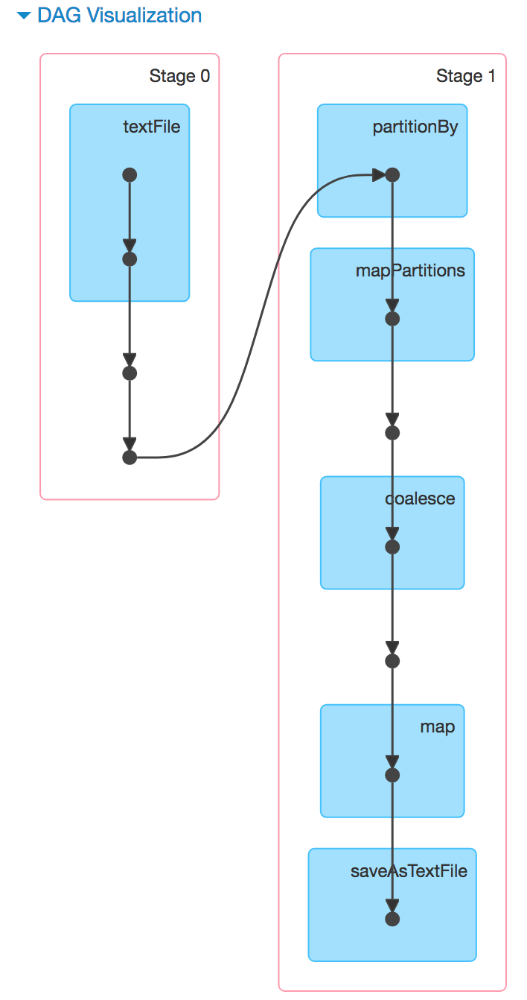
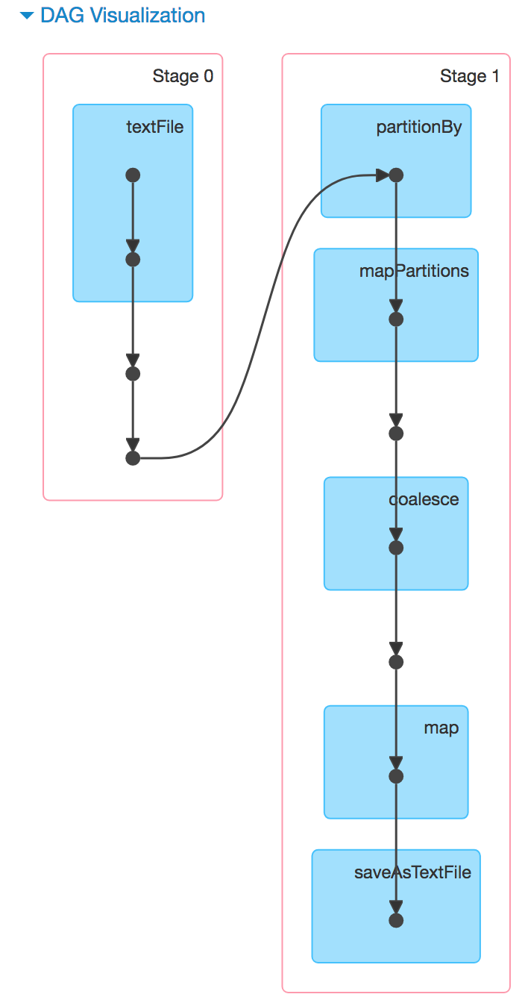

All problems were completed including Problem 5.
export PYSPARK_DRIVER_PYTHON=ipython

## Problem 1
We make place the log files in HDFS:
```
$ hadoop fs -mkdir /hw7
$ hadoop fs -put hw7_logs_*.txt /hw7
```


**Query 1**
The Spark program `p1_q1.py`:
```
```

We submit the job to Spark:
```
$ spark-submit p1_q1.py 
18/03/24 21:05:31 INFO SparkContext: Running Spark version 2.2.1
18/03/24 21:05:32 INFO SparkContext: Submitted application: p1_q1
18/03/24 21:05:32 INFO SecurityManager: Changing view acls to: hadoop
18/03/24 21:05:32 INFO SecurityManager: Changing modify acls to: hadoop
18/03/24 21:05:32 INFO SecurityManager: Changing view acls groups to: 
18/03/24 21:05:32 INFO SecurityManager: Changing modify acls groups to: 
18/03/24 21:05:32 INFO SecurityManager: SecurityManager: authentication disabled; ui acls disabled; users  with view permissions: Set(hadoop); groups with view permissions: Set(); users  with modify permissions: Set(hadoop); groups with modify permissions: Set()
18/03/24 21:05:32 INFO Utils: Successfully started service 'sparkDriver' on port 46223.
18/03/24 21:05:32 INFO SparkEnv: Registering MapOutputTracker
18/03/24 21:05:32 INFO SparkEnv: Registering BlockManagerMaster
18/03/24 21:05:32 INFO BlockManagerMasterEndpoint: Using org.apache.spark.storage.DefaultTopologyMapper for getting topology information
18/03/24 21:05:32 INFO BlockManagerMasterEndpoint: BlockManagerMasterEndpoint up
18/03/24 21:05:32 INFO DiskBlockManager: Created local directory at /mnt/tmp/blockmgr-1fc009bd-80d8-4b35-b47e-61cbf500b585
18/03/24 21:05:32 INFO MemoryStore: MemoryStore started with capacity 3.1 GB
18/03/24 21:05:33 INFO SparkEnv: Registering OutputCommitCoordinator
18/03/24 21:05:33 INFO Utils: Successfully started service 'SparkUI' on port 4040.
18/03/24 21:05:33 INFO SparkUI: Bound SparkUI to 0.0.0.0, and started at http://ip-172-31-24-43.us-east-2.compute.internal:4040
18/03/24 21:05:33 INFO Utils: Using initial executors = 2, max of spark.dynamicAllocation.initialExecutors, spark.dynamicAllocation.minExecutors and spark.executor.instances
18/03/24 21:05:34 INFO RMProxy: Connecting to ResourceManager at ip-172-31-24-43.us-east-2.compute.internal/172.31.24.43:8032
18/03/24 21:05:35 INFO Client: Requesting a new application from cluster with 2 NodeManagers
18/03/24 21:05:35 INFO Client: Verifying our application has not requested more than the maximum memory capability of the cluster (6144 MB per container)
18/03/24 21:05:35 INFO Client: Will allocate AM container, with 896 MB memory including 384 MB overhead
18/03/24 21:05:35 INFO Client: Setting up container launch context for our AM
18/03/24 21:05:35 INFO Client: Setting up the launch environment for our AM container
18/03/24 21:05:35 INFO Client: Preparing resources for our AM container
18/03/24 21:05:36 WARN Client: Neither spark.yarn.jars nor spark.yarn.archive is set, falling back to uploading libraries under SPARK_HOME.
18/03/24 21:05:38 INFO Client: Uploading resource file:/mnt/tmp/spark-151ececf-5380-4fa6-b578-4261a100e52f/__spark_libs__3726949574768902160.zip -> hdfs://ip-172-31-24-43.us-east-2.compute.internal:8020/user/hadoop/.sparkStaging/application_1521923763184_0002/__spark_libs__3726949574768902160.zip
18/03/24 21:05:40 INFO Client: Uploading resource file:/usr/lib/spark/python/lib/pyspark.zip -> hdfs://ip-172-31-24-43.us-east-2.compute.internal:8020/user/hadoop/.sparkStaging/application_1521923763184_0002/pyspark.zip
18/03/24 21:05:41 INFO Client: Uploading resource file:/usr/lib/spark/python/lib/py4j-0.10.4-src.zip -> hdfs://ip-172-31-24-43.us-east-2.compute.internal:8020/user/hadoop/.sparkStaging/application_1521923763184_0002/py4j-0.10.4-src.zip
18/03/24 21:05:41 INFO Client: Uploading resource file:/mnt/tmp/spark-151ececf-5380-4fa6-b578-4261a100e52f/__spark_conf__5723821386720264130.zip -> hdfs://ip-172-31-24-43.us-east-2.compute.internal:8020/user/hadoop/.sparkStaging/application_1521923763184_0002/__spark_conf__.zip
18/03/24 21:05:41 INFO SecurityManager: Changing view acls to: hadoop
18/03/24 21:05:41 INFO SecurityManager: Changing modify acls to: hadoop
18/03/24 21:05:41 INFO SecurityManager: Changing view acls groups to: 
18/03/24 21:05:41 INFO SecurityManager: Changing modify acls groups to: 
18/03/24 21:05:41 INFO SecurityManager: SecurityManager: authentication disabled; ui acls disabled; users  with view permissions: Set(hadoop); groups with view permissions: Set(); users  with modify permissions: Set(hadoop); groups with modify permissions: Set()
18/03/24 21:05:41 INFO Client: Submitting application application_1521923763184_0002 to ResourceManager
18/03/24 21:05:41 INFO YarnClientImpl: Submitted application application_1521923763184_0002
18/03/24 21:05:41 INFO SchedulerExtensionServices: Starting Yarn extension services with app application_1521923763184_0002 and attemptId None
18/03/24 21:05:42 INFO Client: Application report for application_1521923763184_0002 (state: ACCEPTED)
18/03/24 21:05:42 INFO Client: 
	 client token: N/A
	 diagnostics: AM container is launched, waiting for AM container to Register with RM
	 ApplicationMaster host: N/A
	 ApplicationMaster RPC port: -1
	 queue: default
	 start time: 1521925541684
	 final status: UNDEFINED
	 tracking URL: http://ip-172-31-24-43.us-east-2.compute.internal:20888/proxy/application_1521923763184_0002/
	 user: hadoop
18/03/24 21:05:43 INFO Client: Application report for application_1521923763184_0002 (state: ACCEPTED)
18/03/24 21:05:44 INFO Client: Application report for application_1521923763184_0002 (state: ACCEPTED)
18/03/24 21:05:45 INFO Client: Application report for application_1521923763184_0002 (state: ACCEPTED)
18/03/24 21:05:46 INFO Client: Application report for application_1521923763184_0002 (state: ACCEPTED)
18/03/24 21:05:46 INFO YarnSchedulerBackend$YarnSchedulerEndpoint: ApplicationMaster registered as NettyRpcEndpointRef(spark-client://YarnAM)
18/03/24 21:05:46 INFO YarnClientSchedulerBackend: Add WebUI Filter. org.apache.hadoop.yarn.server.webproxy.amfilter.AmIpFilter, Map(PROXY_HOSTS -> ip-172-31-24-43.us-east-2.compute.internal, PROXY_URI_BASES -> http://ip-172-31-24-43.us-east-2.compute.internal:20888/proxy/application_1521923763184_0002), /proxy/application_1521923763184_0002
18/03/24 21:05:46 INFO JettyUtils: Adding filter: org.apache.hadoop.yarn.server.webproxy.amfilter.AmIpFilter
18/03/24 21:05:47 INFO Client: Application report for application_1521923763184_0002 (state: RUNNING)
18/03/24 21:05:47 INFO Client: 
	 client token: N/A
	 diagnostics: N/A
	 ApplicationMaster host: 172.31.26.62
	 ApplicationMaster RPC port: 0
	 queue: default
	 start time: 1521925541684
	 final status: UNDEFINED
	 tracking URL: http://ip-172-31-24-43.us-east-2.compute.internal:20888/proxy/application_1521923763184_0002/
	 user: hadoop
18/03/24 21:05:47 INFO YarnClientSchedulerBackend: Application application_1521923763184_0002 has started running.
18/03/24 21:05:47 INFO Utils: Successfully started service 'org.apache.spark.network.netty.NettyBlockTransferService' on port 44851.
18/03/24 21:05:47 INFO NettyBlockTransferService: Server created on 172.31.24.43:44851
18/03/24 21:05:47 INFO BlockManager: Using org.apache.spark.storage.RandomBlockReplicationPolicy for block replication policy
18/03/24 21:05:47 INFO BlockManagerMaster: Registering BlockManager BlockManagerId(driver, 172.31.24.43, 44851, None)
18/03/24 21:05:47 INFO BlockManagerMasterEndpoint: Registering block manager 172.31.24.43:44851 with 3.1 GB RAM, BlockManagerId(driver, 172.31.24.43, 44851, None)
18/03/24 21:05:47 INFO BlockManagerMaster: Registered BlockManager BlockManagerId(driver, 172.31.24.43, 44851, None)
18/03/24 21:05:47 INFO BlockManager: external shuffle service port = 7337
18/03/24 21:05:47 INFO BlockManager: Initialized BlockManager: BlockManagerId(driver, 172.31.24.43, 44851, None)
18/03/24 21:05:48 INFO EventLoggingListener: Logging events to hdfs:///var/log/spark/apps/application_1521923763184_0002
18/03/24 21:05:48 INFO Utils: Using initial executors = 2, max of spark.dynamicAllocation.initialExecutors, spark.dynamicAllocation.minExecutors and spark.executor.instances
18/03/24 21:05:51 INFO YarnSchedulerBackend$YarnDriverEndpoint: Registered executor NettyRpcEndpointRef(spark-client://Executor) (172.31.26.62:52738) with ID 2
18/03/24 21:05:51 INFO ExecutorAllocationManager: New executor 2 has registered (new total is 1)
18/03/24 21:05:51 INFO BlockManagerMasterEndpoint: Registering block manager ip-172-31-26-62.us-east-2.compute.internal:45139 with 2.6 GB RAM, BlockManagerId(2, ip-172-31-26-62.us-east-2.compute.internal, 45139, None)
18/03/24 21:05:53 INFO YarnSchedulerBackend$YarnDriverEndpoint: Registered executor NettyRpcEndpointRef(spark-client://Executor) (172.31.30.96:37684) with ID 1
18/03/24 21:05:53 INFO ExecutorAllocationManager: New executor 1 has registered (new total is 2)
18/03/24 21:05:53 INFO YarnClientSchedulerBackend: SchedulerBackend is ready for scheduling beginning after reached minRegisteredResourcesRatio: 0.8
18/03/24 21:05:53 INFO BlockManagerMasterEndpoint: Registering block manager ip-172-31-30-96.us-east-2.compute.internal:45223 with 2.6 GB RAM, BlockManagerId(1, ip-172-31-30-96.us-east-2.compute.internal, 45223, None)
18/03/24 21:05:53 INFO MemoryStore: Block broadcast_0 stored as values in memory (estimated size 273.9 KB, free 3.1 GB)
18/03/24 21:05:54 INFO MemoryStore: Block broadcast_0_piece0 stored as bytes in memory (estimated size 23.3 KB, free 3.1 GB)
18/03/24 21:05:54 INFO BlockManagerInfo: Added broadcast_0_piece0 in memory on 172.31.24.43:44851 (size: 23.3 KB, free: 3.1 GB)
18/03/24 21:05:54 INFO SparkContext: Created broadcast 0 from textFile at NativeMethodAccessorImpl.java:0
18/03/24 21:05:54 INFO FileOutputCommitter: File Output Committer Algorithm version is 1
18/03/24 21:05:54 INFO FileOutputCommitter: FileOutputCommitter skip cleanup _temporary folders under output directory:false, ignore cleanup failures: false
18/03/24 21:05:54 INFO SparkContext: Starting job: saveAsTextFile at NativeMethodAccessorImpl.java:0
18/03/24 21:05:54 INFO GPLNativeCodeLoader: Loaded native gpl library
18/03/24 21:05:54 INFO LzoCodec: Successfully loaded & initialized native-lzo library [hadoop-lzo rev cfe28705e7dfdec92539cc7b24fc97936c259a05]
18/03/24 21:05:54 INFO FileInputFormat: Total input files to process : 20
18/03/24 21:05:54 INFO DAGScheduler: Registering RDD 3 (distinct at /home/hadoop/hw7/p1_q1.py:23)
18/03/24 21:05:54 INFO DAGScheduler: Registering RDD 7 (reduceByKey at /home/hadoop/hw7/p1_q1.py:26)
18/03/24 21:05:54 INFO DAGScheduler: Got job 0 (saveAsTextFile at NativeMethodAccessorImpl.java:0) with 1 output partitions
18/03/24 21:05:54 INFO DAGScheduler: Final stage: ResultStage 2 (saveAsTextFile at NativeMethodAccessorImpl.java:0)
18/03/24 21:05:54 INFO DAGScheduler: Parents of final stage: List(ShuffleMapStage 1)
18/03/24 21:05:54 INFO DAGScheduler: Missing parents: List(ShuffleMapStage 1)
18/03/24 21:05:54 INFO DAGScheduler: Submitting ShuffleMapStage 0 (PairwiseRDD[3] at distinct at /home/hadoop/hw7/p1_q1.py:23), which has no missing parents
18/03/24 21:05:54 INFO MemoryStore: Block broadcast_1 stored as values in memory (estimated size 9.4 KB, free 3.1 GB)
18/03/24 21:05:54 INFO MemoryStore: Block broadcast_1_piece0 stored as bytes in memory (estimated size 5.9 KB, free 3.1 GB)
18/03/24 21:05:54 INFO BlockManagerInfo: Added broadcast_1_piece0 in memory on 172.31.24.43:44851 (size: 5.9 KB, free: 3.1 GB)
18/03/24 21:05:54 INFO SparkContext: Created broadcast 1 from broadcast at DAGScheduler.scala:1047
18/03/24 21:05:54 INFO DAGScheduler: Submitting 20 missing tasks from ShuffleMapStage 0 (PairwiseRDD[3] at distinct at /home/hadoop/hw7/p1_q1.py:23) (first 15 tasks are for partitions Vector(0, 1, 2, 3, 4, 5, 6, 7, 8, 9, 10, 11, 12, 13, 14))
18/03/24 21:05:54 INFO YarnScheduler: Adding task set 0.0 with 20 tasks
18/03/24 21:05:54 INFO TaskSetManager: Starting task 0.0 in stage 0.0 (TID 0, ip-172-31-30-96.us-east-2.compute.internal, executor 1, partition 0, NODE_LOCAL, 4892 bytes)
18/03/24 21:05:54 INFO TaskSetManager: Starting task 1.0 in stage 0.0 (TID 1, ip-172-31-26-62.us-east-2.compute.internal, executor 2, partition 1, NODE_LOCAL, 4893 bytes)
18/03/24 21:05:54 INFO TaskSetManager: Starting task 4.0 in stage 0.0 (TID 2, ip-172-31-30-96.us-east-2.compute.internal, executor 1, partition 4, NODE_LOCAL, 4893 bytes)
18/03/24 21:05:54 INFO TaskSetManager: Starting task 2.0 in stage 0.0 (TID 3, ip-172-31-26-62.us-east-2.compute.internal, executor 2, partition 2, NODE_LOCAL, 4893 bytes)
18/03/24 21:05:54 INFO TaskSetManager: Starting task 5.0 in stage 0.0 (TID 4, ip-172-31-30-96.us-east-2.compute.internal, executor 1, partition 5, NODE_LOCAL, 4893 bytes)
18/03/24 21:05:54 INFO TaskSetManager: Starting task 3.0 in stage 0.0 (TID 5, ip-172-31-26-62.us-east-2.compute.internal, executor 2, partition 3, NODE_LOCAL, 4893 bytes)
18/03/24 21:05:54 INFO TaskSetManager: Starting task 12.0 in stage 0.0 (TID 6, ip-172-31-30-96.us-east-2.compute.internal, executor 1, partition 12, NODE_LOCAL, 4893 bytes)
18/03/24 21:05:54 INFO TaskSetManager: Starting task 6.0 in stage 0.0 (TID 7, ip-172-31-26-62.us-east-2.compute.internal, executor 2, partition 6, NODE_LOCAL, 4893 bytes)
18/03/24 21:05:55 INFO BlockManagerInfo: Added broadcast_1_piece0 in memory on ip-172-31-30-96.us-east-2.compute.internal:45223 (size: 5.9 KB, free: 2.6 GB)
18/03/24 21:05:55 INFO BlockManagerInfo: Added broadcast_1_piece0 in memory on ip-172-31-26-62.us-east-2.compute.internal:45139 (size: 5.9 KB, free: 2.6 GB)
18/03/24 21:05:55 INFO BlockManagerInfo: Added broadcast_0_piece0 in memory on ip-172-31-30-96.us-east-2.compute.internal:45223 (size: 23.3 KB, free: 2.6 GB)
18/03/24 21:05:55 INFO BlockManagerInfo: Added broadcast_0_piece0 in memory on ip-172-31-26-62.us-east-2.compute.internal:45139 (size: 23.3 KB, free: 2.6 GB)
18/03/24 21:05:55 INFO ExecutorAllocationManager: Requesting 1 new executor because tasks are backlogged (new desired total will be 3)
18/03/24 21:05:56 INFO ExecutorAllocationManager: Requesting 2 new executors because tasks are backlogged (new desired total will be 5)
18/03/24 21:06:01 INFO TaskSetManager: Starting task 7.0 in stage 0.0 (TID 8, ip-172-31-26-62.us-east-2.compute.internal, executor 2, partition 7, NODE_LOCAL, 4893 bytes)
18/03/24 21:06:01 INFO TaskSetManager: Finished task 3.0 in stage 0.0 (TID 5) in 6966 ms on ip-172-31-26-62.us-east-2.compute.internal (executor 2) (1/20)
18/03/24 21:06:02 INFO TaskSetManager: Starting task 13.0 in stage 0.0 (TID 9, ip-172-31-30-96.us-east-2.compute.internal, executor 1, partition 13, NODE_LOCAL, 4892 bytes)
18/03/24 21:06:02 INFO TaskSetManager: Finished task 4.0 in stage 0.0 (TID 2) in 7414 ms on ip-172-31-30-96.us-east-2.compute.internal (executor 1) (2/20)
18/03/24 21:06:02 INFO TaskSetManager: Starting task 15.0 in stage 0.0 (TID 10, ip-172-31-30-96.us-east-2.compute.internal, executor 1, partition 15, NODE_LOCAL, 4892 bytes)
18/03/24 21:06:02 INFO TaskSetManager: Finished task 5.0 in stage 0.0 (TID 4) in 7439 ms on ip-172-31-30-96.us-east-2.compute.internal (executor 1) (3/20)
18/03/24 21:06:02 INFO TaskSetManager: Starting task 8.0 in stage 0.0 (TID 11, ip-172-31-26-62.us-east-2.compute.internal, executor 2, partition 8, NODE_LOCAL, 4893 bytes)
18/03/24 21:06:02 INFO TaskSetManager: Finished task 1.0 in stage 0.0 (TID 1) in 7900 ms on ip-172-31-26-62.us-east-2.compute.internal (executor 2) (4/20)
18/03/24 21:06:03 INFO TaskSetManager: Starting task 9.0 in stage 0.0 (TID 12, ip-172-31-26-62.us-east-2.compute.internal, executor 2, partition 9, NODE_LOCAL, 4893 bytes)
18/03/24 21:06:03 INFO TaskSetManager: Finished task 7.0 in stage 0.0 (TID 8) in 1526 ms on ip-172-31-26-62.us-east-2.compute.internal (executor 2) (5/20)
18/03/24 21:06:03 INFO TaskSetManager: Starting task 19.0 in stage 0.0 (TID 13, ip-172-31-30-96.us-east-2.compute.internal, executor 1, partition 19, NODE_LOCAL, 4892 bytes)
18/03/24 21:06:03 INFO TaskSetManager: Finished task 12.0 in stage 0.0 (TID 6) in 8678 ms on ip-172-31-30-96.us-east-2.compute.internal (executor 1) (6/20)
18/03/24 21:06:05 INFO TaskSetManager: Finished task 13.0 in stage 0.0 (TID 9) in 3376 ms on ip-172-31-30-96.us-east-2.compute.internal (executor 1) (7/20)
18/03/24 21:06:06 INFO TaskSetManager: Starting task 10.0 in stage 0.0 (TID 14, ip-172-31-26-62.us-east-2.compute.internal, executor 2, partition 10, NODE_LOCAL, 4893 bytes)
18/03/24 21:06:06 INFO TaskSetManager: Finished task 6.0 in stage 0.0 (TID 7) in 11523 ms on ip-172-31-26-62.us-east-2.compute.internal (executor 2) (8/20)
18/03/24 21:06:06 INFO TaskSetManager: Finished task 0.0 in stage 0.0 (TID 0) in 11568 ms on ip-172-31-30-96.us-east-2.compute.internal (executor 1) (9/20)
18/03/24 21:06:06 INFO TaskSetManager: Starting task 11.0 in stage 0.0 (TID 15, ip-172-31-26-62.us-east-2.compute.internal, executor 2, partition 11, NODE_LOCAL, 4892 bytes)
18/03/24 21:06:06 INFO TaskSetManager: Finished task 8.0 in stage 0.0 (TID 11) in 3783 ms on ip-172-31-26-62.us-east-2.compute.internal (executor 2) (10/20)
18/03/24 21:06:06 INFO TaskSetManager: Starting task 14.0 in stage 0.0 (TID 16, ip-172-31-26-62.us-east-2.compute.internal, executor 2, partition 14, NODE_LOCAL, 4892 bytes)
18/03/24 21:06:06 INFO TaskSetManager: Finished task 2.0 in stage 0.0 (TID 3) in 11873 ms on ip-172-31-26-62.us-east-2.compute.internal (executor 2) (11/20)
18/03/24 21:06:08 INFO TaskSetManager: Finished task 19.0 in stage 0.0 (TID 13) in 4662 ms on ip-172-31-30-96.us-east-2.compute.internal (executor 1) (12/20)
18/03/24 21:06:08 INFO TaskSetManager: Finished task 15.0 in stage 0.0 (TID 10) in 6064 ms on ip-172-31-30-96.us-east-2.compute.internal (executor 1) (13/20)
18/03/24 21:06:09 INFO TaskSetManager: Starting task 16.0 in stage 0.0 (TID 17, ip-172-31-26-62.us-east-2.compute.internal, executor 2, partition 16, NODE_LOCAL, 4892 bytes)
18/03/24 21:06:09 INFO TaskSetManager: Finished task 11.0 in stage 0.0 (TID 15) in 3002 ms on ip-172-31-26-62.us-east-2.compute.internal (executor 2) (14/20)
18/03/24 21:06:10 INFO TaskSetManager: Starting task 17.0 in stage 0.0 (TID 18, ip-172-31-26-62.us-east-2.compute.internal, executor 2, partition 17, NODE_LOCAL, 4892 bytes)
18/03/24 21:06:10 INFO TaskSetManager: Finished task 16.0 in stage 0.0 (TID 17) in 1001 ms on ip-172-31-26-62.us-east-2.compute.internal (executor 2) (15/20)
18/03/24 21:06:10 INFO TaskSetManager: Starting task 18.0 in stage 0.0 (TID 19, ip-172-31-26-62.us-east-2.compute.internal, executor 2, partition 18, NODE_LOCAL, 4892 bytes)
18/03/24 21:06:10 INFO TaskSetManager: Finished task 14.0 in stage 0.0 (TID 16) in 3800 ms on ip-172-31-26-62.us-east-2.compute.internal (executor 2) (16/20)
18/03/24 21:06:10 INFO TaskSetManager: Finished task 9.0 in stage 0.0 (TID 12) in 7611 ms on ip-172-31-26-62.us-east-2.compute.internal (executor 2) (17/20)
18/03/24 21:06:12 INFO TaskSetManager: Finished task 10.0 in stage 0.0 (TID 14) in 6687 ms on ip-172-31-26-62.us-east-2.compute.internal (executor 2) (18/20)
18/03/24 21:06:13 INFO TaskSetManager: Finished task 17.0 in stage 0.0 (TID 18) in 2985 ms on ip-172-31-26-62.us-east-2.compute.internal (executor 2) (19/20)
18/03/24 21:06:14 INFO TaskSetManager: Finished task 18.0 in stage 0.0 (TID 19) in 4040 ms on ip-172-31-26-62.us-east-2.compute.internal (executor 2) (20/20)
18/03/24 21:06:14 INFO YarnScheduler: Removed TaskSet 0.0, whose tasks have all completed, from pool 
18/03/24 21:06:14 INFO DAGScheduler: ShuffleMapStage 0 (distinct at /home/hadoop/hw7/p1_q1.py:23) finished in 19.746 s
18/03/24 21:06:14 INFO DAGScheduler: looking for newly runnable stages
18/03/24 21:06:14 INFO DAGScheduler: running: Set()
18/03/24 21:06:14 INFO DAGScheduler: waiting: Set(ShuffleMapStage 1, ResultStage 2)
18/03/24 21:06:14 INFO DAGScheduler: failed: Set()
18/03/24 21:06:14 INFO DAGScheduler: Submitting ShuffleMapStage 1 (PairwiseRDD[7] at reduceByKey at /home/hadoop/hw7/p1_q1.py:26), which has no missing parents
18/03/24 21:06:14 INFO MemoryStore: Block broadcast_2 stored as values in memory (estimated size 8.5 KB, free 3.1 GB)
18/03/24 21:06:14 INFO MemoryStore: Block broadcast_2_piece0 stored as bytes in memory (estimated size 5.4 KB, free 3.1 GB)
18/03/24 21:06:14 INFO BlockManagerInfo: Added broadcast_2_piece0 in memory on 172.31.24.43:44851 (size: 5.4 KB, free: 3.1 GB)
18/03/24 21:06:14 INFO SparkContext: Created broadcast 2 from broadcast at DAGScheduler.scala:1047
18/03/24 21:06:14 INFO DAGScheduler: Submitting 16 missing tasks from ShuffleMapStage 1 (PairwiseRDD[7] at reduceByKey at /home/hadoop/hw7/p1_q1.py:26) (first 15 tasks are for partitions Vector(0, 1, 2, 3, 4, 5, 6, 7, 8, 9, 10, 11, 12, 13, 14))
18/03/24 21:06:14 INFO YarnScheduler: Adding task set 1.0 with 16 tasks
18/03/24 21:06:14 INFO TaskSetManager: Starting task 0.0 in stage 1.0 (TID 20, ip-172-31-26-62.us-east-2.compute.internal, executor 2, partition 0, NODE_LOCAL, 4621 bytes)
18/03/24 21:06:14 INFO TaskSetManager: Starting task 1.0 in stage 1.0 (TID 21, ip-172-31-30-96.us-east-2.compute.internal, executor 1, partition 1, NODE_LOCAL, 4621 bytes)
18/03/24 21:06:14 INFO TaskSetManager: Starting task 2.0 in stage 1.0 (TID 22, ip-172-31-26-62.us-east-2.compute.internal, executor 2, partition 2, NODE_LOCAL, 4621 bytes)
18/03/24 21:06:14 INFO TaskSetManager: Starting task 3.0 in stage 1.0 (TID 23, ip-172-31-30-96.us-east-2.compute.internal, executor 1, partition 3, NODE_LOCAL, 4621 bytes)
18/03/24 21:06:14 INFO TaskSetManager: Starting task 4.0 in stage 1.0 (TID 24, ip-172-31-26-62.us-east-2.compute.internal, executor 2, partition 4, NODE_LOCAL, 4621 bytes)
18/03/24 21:06:14 INFO TaskSetManager: Starting task 5.0 in stage 1.0 (TID 25, ip-172-31-30-96.us-east-2.compute.internal, executor 1, partition 5, NODE_LOCAL, 4621 bytes)
18/03/24 21:06:14 INFO TaskSetManager: Starting task 6.0 in stage 1.0 (TID 26, ip-172-31-26-62.us-east-2.compute.internal, executor 2, partition 6, NODE_LOCAL, 4621 bytes)
18/03/24 21:06:14 INFO TaskSetManager: Starting task 7.0 in stage 1.0 (TID 27, ip-172-31-30-96.us-east-2.compute.internal, executor 1, partition 7, NODE_LOCAL, 4621 bytes)
18/03/24 21:06:14 INFO BlockManagerInfo: Added broadcast_2_piece0 in memory on ip-172-31-26-62.us-east-2.compute.internal:45139 (size: 5.4 KB, free: 2.6 GB)
18/03/24 21:06:14 INFO BlockManagerInfo: Added broadcast_2_piece0 in memory on ip-172-31-30-96.us-east-2.compute.internal:45223 (size: 5.4 KB, free: 2.6 GB)
18/03/24 21:06:14 INFO MapOutputTrackerMasterEndpoint: Asked to send map output locations for shuffle 1 to 172.31.26.62:52738
18/03/24 21:06:14 INFO MapOutputTrackerMaster: Size of output statuses for shuffle 1 is 229 bytes
18/03/24 21:06:14 INFO MapOutputTrackerMasterEndpoint: Asked to send map output locations for shuffle 1 to 172.31.30.96:37684
18/03/24 21:06:14 INFO TaskSetManager: Starting task 8.0 in stage 1.0 (TID 28, ip-172-31-30-96.us-east-2.compute.internal, executor 1, partition 8, NODE_LOCAL, 4621 bytes)
18/03/24 21:06:14 INFO TaskSetManager: Finished task 7.0 in stage 1.0 (TID 27) in 305 ms on ip-172-31-30-96.us-east-2.compute.internal (executor 1) (1/16)
18/03/24 21:06:14 INFO TaskSetManager: Starting task 9.0 in stage 1.0 (TID 29, ip-172-31-30-96.us-east-2.compute.internal, executor 1, partition 9, NODE_LOCAL, 4621 bytes)
18/03/24 21:06:14 INFO TaskSetManager: Finished task 1.0 in stage 1.0 (TID 21) in 326 ms on ip-172-31-30-96.us-east-2.compute.internal (executor 1) (2/16)
18/03/24 21:06:14 INFO TaskSetManager: Starting task 10.0 in stage 1.0 (TID 30, ip-172-31-30-96.us-east-2.compute.internal, executor 1, partition 10, NODE_LOCAL, 4621 bytes)
18/03/24 21:06:14 INFO TaskSetManager: Finished task 3.0 in stage 1.0 (TID 23) in 331 ms on ip-172-31-30-96.us-east-2.compute.internal (executor 1) (3/16)
18/03/24 21:06:14 INFO TaskSetManager: Starting task 11.0 in stage 1.0 (TID 31, ip-172-31-30-96.us-east-2.compute.internal, executor 1, partition 11, NODE_LOCAL, 4621 bytes)
18/03/24 21:06:14 INFO TaskSetManager: Finished task 5.0 in stage 1.0 (TID 25) in 336 ms on ip-172-31-30-96.us-east-2.compute.internal (executor 1) (4/16)
18/03/24 21:06:14 INFO TaskSetManager: Starting task 12.0 in stage 1.0 (TID 32, ip-172-31-26-62.us-east-2.compute.internal, executor 2, partition 12, NODE_LOCAL, 4621 bytes)
18/03/24 21:06:14 INFO TaskSetManager: Finished task 2.0 in stage 1.0 (TID 22) in 357 ms on ip-172-31-26-62.us-east-2.compute.internal (executor 2) (5/16)
18/03/24 21:06:14 INFO TaskSetManager: Starting task 13.0 in stage 1.0 (TID 33, ip-172-31-26-62.us-east-2.compute.internal, executor 2, partition 13, NODE_LOCAL, 4621 bytes)
18/03/24 21:06:14 INFO TaskSetManager: Finished task 0.0 in stage 1.0 (TID 20) in 359 ms on ip-172-31-26-62.us-east-2.compute.internal (executor 2) (6/16)
18/03/24 21:06:14 INFO TaskSetManager: Starting task 14.0 in stage 1.0 (TID 34, ip-172-31-26-62.us-east-2.compute.internal, executor 2, partition 14, NODE_LOCAL, 4621 bytes)
18/03/24 21:06:14 INFO TaskSetManager: Finished task 4.0 in stage 1.0 (TID 24) in 365 ms on ip-172-31-26-62.us-east-2.compute.internal (executor 2) (7/16)
18/03/24 21:06:14 INFO TaskSetManager: Starting task 15.0 in stage 1.0 (TID 35, ip-172-31-26-62.us-east-2.compute.internal, executor 2, partition 15, NODE_LOCAL, 4621 bytes)
18/03/24 21:06:14 INFO TaskSetManager: Finished task 6.0 in stage 1.0 (TID 26) in 426 ms on ip-172-31-26-62.us-east-2.compute.internal (executor 2) (8/16)
18/03/24 21:06:14 INFO TaskSetManager: Finished task 12.0 in stage 1.0 (TID 32) in 162 ms on ip-172-31-26-62.us-east-2.compute.internal (executor 2) (9/16)
18/03/24 21:06:15 INFO TaskSetManager: Finished task 10.0 in stage 1.0 (TID 30) in 208 ms on ip-172-31-30-96.us-east-2.compute.internal (executor 1) (10/16)
18/03/24 21:06:15 INFO TaskSetManager: Finished task 9.0 in stage 1.0 (TID 29) in 219 ms on ip-172-31-30-96.us-east-2.compute.internal (executor 1) (11/16)
18/03/24 21:06:15 INFO TaskSetManager: Finished task 8.0 in stage 1.0 (TID 28) in 240 ms on ip-172-31-30-96.us-east-2.compute.internal (executor 1) (12/16)
18/03/24 21:06:15 INFO TaskSetManager: Finished task 11.0 in stage 1.0 (TID 31) in 213 ms on ip-172-31-30-96.us-east-2.compute.internal (executor 1) (13/16)
18/03/24 21:06:15 INFO TaskSetManager: Finished task 14.0 in stage 1.0 (TID 34) in 192 ms on ip-172-31-26-62.us-east-2.compute.internal (executor 2) (14/16)
18/03/24 21:06:15 INFO TaskSetManager: Finished task 13.0 in stage 1.0 (TID 33) in 203 ms on ip-172-31-26-62.us-east-2.compute.internal (executor 2) (15/16)
18/03/24 21:06:15 INFO TaskSetManager: Finished task 15.0 in stage 1.0 (TID 35) in 138 ms on ip-172-31-26-62.us-east-2.compute.internal (executor 2) (16/16)
18/03/24 21:06:15 INFO YarnScheduler: Removed TaskSet 1.0, whose tasks have all completed, from pool 
18/03/24 21:06:15 INFO DAGScheduler: ShuffleMapStage 1 (reduceByKey at /home/hadoop/hw7/p1_q1.py:26) finished in 0.562 s
18/03/24 21:06:15 INFO DAGScheduler: looking for newly runnable stages
18/03/24 21:06:15 INFO DAGScheduler: running: Set()
18/03/24 21:06:15 INFO DAGScheduler: waiting: Set(ResultStage 2)
18/03/24 21:06:15 INFO DAGScheduler: failed: Set()
18/03/24 21:06:15 INFO DAGScheduler: Submitting ResultStage 2 (MapPartitionsRDD[14] at saveAsTextFile at NativeMethodAccessorImpl.java:0), which has no missing parents
18/03/24 21:06:15 INFO MemoryStore: Block broadcast_3 stored as values in memory (estimated size 75.7 KB, free 3.1 GB)
18/03/24 21:06:15 INFO MemoryStore: Block broadcast_3_piece0 stored as bytes in memory (estimated size 29.0 KB, free 3.1 GB)
18/03/24 21:06:15 INFO BlockManagerInfo: Added broadcast_3_piece0 in memory on 172.31.24.43:44851 (size: 29.0 KB, free: 3.1 GB)
18/03/24 21:06:15 INFO SparkContext: Created broadcast 3 from broadcast at DAGScheduler.scala:1047
18/03/24 21:06:15 INFO DAGScheduler: Submitting 1 missing tasks from ResultStage 2 (MapPartitionsRDD[14] at saveAsTextFile at NativeMethodAccessorImpl.java:0) (first 15 tasks are for partitions Vector(0))
18/03/24 21:06:15 INFO YarnScheduler: Adding task set 2.0 with 1 tasks
18/03/24 21:06:15 INFO TaskSetManager: Starting task 0.0 in stage 2.0 (TID 36, ip-172-31-30-96.us-east-2.compute.internal, executor 1, partition 0, NODE_LOCAL, 5178 bytes)
18/03/24 21:06:15 INFO BlockManagerInfo: Removed broadcast_1_piece0 on ip-172-31-30-96.us-east-2.compute.internal:45223 in memory (size: 5.9 KB, free: 2.6 GB)
18/03/24 21:06:15 INFO BlockManagerInfo: Removed broadcast_1_piece0 on ip-172-31-26-62.us-east-2.compute.internal:45139 in memory (size: 5.9 KB, free: 2.6 GB)
18/03/24 21:06:15 INFO BlockManagerInfo: Removed broadcast_1_piece0 on 172.31.24.43:44851 in memory (size: 5.9 KB, free: 3.1 GB)
18/03/24 21:06:15 INFO BlockManagerInfo: Added broadcast_3_piece0 in memory on ip-172-31-30-96.us-east-2.compute.internal:45223 (size: 29.0 KB, free: 2.6 GB)
18/03/24 21:06:15 INFO MapOutputTrackerMasterEndpoint: Asked to send map output locations for shuffle 0 to 172.31.30.96:37684
18/03/24 21:06:15 INFO MapOutputTrackerMaster: Size of output statuses for shuffle 0 is 312 bytes
18/03/24 21:06:16 INFO TaskSetManager: Finished task 0.0 in stage 2.0 (TID 36) in 1202 ms on ip-172-31-30-96.us-east-2.compute.internal (executor 1) (1/1)
18/03/24 21:06:16 INFO YarnScheduler: Removed TaskSet 2.0, whose tasks have all completed, from pool 
18/03/24 21:06:16 INFO DAGScheduler: ResultStage 2 (saveAsTextFile at NativeMethodAccessorImpl.java:0) finished in 1.198 s
18/03/24 21:06:16 INFO DAGScheduler: Job 0 finished: saveAsTextFile at NativeMethodAccessorImpl.java:0, took 21.952929 s
18/03/24 21:06:16 INFO SparkContext: Invoking stop() from shutdown hook
18/03/24 21:06:16 INFO SparkUI: Stopped Spark web UI at http://ip-172-31-24-43.us-east-2.compute.internal:4040
18/03/24 21:06:16 INFO YarnClientSchedulerBackend: Interrupting monitor thread
18/03/24 21:06:16 INFO YarnClientSchedulerBackend: Shutting down all executors
18/03/24 21:06:16 INFO YarnSchedulerBackend$YarnDriverEndpoint: Asking each executor to shut down
18/03/24 21:06:16 INFO SchedulerExtensionServices: Stopping SchedulerExtensionServices
(serviceOption=None,
 services=List(),
 started=false)
18/03/24 21:06:16 INFO YarnClientSchedulerBackend: Stopped
18/03/24 21:06:16 INFO MapOutputTrackerMasterEndpoint: MapOutputTrackerMasterEndpoint stopped!
18/03/24 21:06:16 INFO MemoryStore: MemoryStore cleared
18/03/24 21:06:16 INFO BlockManager: BlockManager stopped
18/03/24 21:06:16 INFO BlockManagerMaster: BlockManagerMaster stopped
18/03/24 21:06:16 INFO OutputCommitCoordinator$OutputCommitCoordinatorEndpoint: OutputCommitCoordinator stopped!
18/03/24 21:06:16 INFO SparkContext: Successfully stopped SparkContext
18/03/24 21:06:16 INFO ShutdownHookManager: Shutdown hook called
18/03/24 21:06:16 INFO ShutdownHookManager: Deleting directory /mnt/tmp/spark-151ececf-5380-4fa6-b578-4261a100e52f/pyspark-78b104dc-7775-4b62-ad8d-a596617de3fb
18/03/24 21:06:16 INFO ShutdownHookManager: Deleting directory /mnt/tmp/spark-151ececf-5380-4fa6-b578-4261a100e52f
```

The job completed in 22 seconds and used three stages (a distinct operation, group by operation, and file saving operation).


The DAG for the job:


Furthermore, by exmining *stage 1* in the DAG we see that the RDD had 16 partitions, and that median shuffle read and write size is 46.8 KB and 3.2 KB, respectively.

The full set of logs from the Spark job are in *p1_q1_sparklogs.zip*.

We look at the job results:
```
$ hadoop fs -cat /output_p1_q1/part* | head
('2018-02-22T19', 10)
('2018-03-01T00', 10)
('2018-03-04T03', 10)
('2018-03-02T01', 10)
('2018-02-28T08', 10)
('2018-02-21T10', 10)
('2018-03-03T20', 10)
('2018-02-23T12', 10)
('2018-02-22T20', 10)
('2018-02-26T15', 10)

$ hadoop fs -cat /output_p1_q1/part* | tail
('2018-02-28T10', 10)
('2018-03-04T13', 10)
('2018-03-03T16', 10)
('2018-02-24T03', 10)
('2018-02-22T16', 10)
('2018-02-25T13', 10)
('2018-03-01T18', 10)
('2018-02-27T02', 10)
('2018-02-23T20', 10)
('2018-02-21T08', 10)
```

**Query 2**
The Spark program `p1_q2.py`:
```
```

We submit the job to Spark:
```
$ spark-submit p1_q2.py 
18/03/24 21:30:05 INFO SparkContext: Running Spark version 2.2.1
18/03/24 21:30:06 INFO SparkContext: Submitted application: p1_q2
18/03/24 21:30:06 INFO SecurityManager: Changing view acls to: hadoop
18/03/24 21:30:06 INFO SecurityManager: Changing modify acls to: hadoop
18/03/24 21:30:06 INFO SecurityManager: Changing view acls groups to: 
18/03/24 21:30:06 INFO SecurityManager: Changing modify acls groups to: 
18/03/24 21:30:06 INFO SecurityManager: SecurityManager: authentication disabled; ui acls disabled; users  with view permissions: Set(hadoop); groups with view permissions: Set(); users  with modify permissions: Set(hadoop); groups with modify permissions: Set()
18/03/24 21:30:06 INFO Utils: Successfully started service 'sparkDriver' on port 36767.
18/03/24 21:30:06 INFO SparkEnv: Registering MapOutputTracker
18/03/24 21:30:06 INFO SparkEnv: Registering BlockManagerMaster
18/03/24 21:30:06 INFO BlockManagerMasterEndpoint: Using org.apache.spark.storage.DefaultTopologyMapper for getting topology information
18/03/24 21:30:06 INFO BlockManagerMasterEndpoint: BlockManagerMasterEndpoint up
18/03/24 21:30:06 INFO DiskBlockManager: Created local directory at /mnt/tmp/blockmgr-c9581927-fd6d-417d-a245-8a41a9c3b922
18/03/24 21:30:06 INFO MemoryStore: MemoryStore started with capacity 3.1 GB
18/03/24 21:30:07 INFO SparkEnv: Registering OutputCommitCoordinator
18/03/24 21:30:07 INFO Utils: Successfully started service 'SparkUI' on port 4040.
18/03/24 21:30:07 INFO SparkUI: Bound SparkUI to 0.0.0.0, and started at http://ip-172-31-24-43.us-east-2.compute.internal:4040
18/03/24 21:30:07 INFO Utils: Using initial executors = 2, max of spark.dynamicAllocation.initialExecutors, spark.dynamicAllocation.minExecutors and spark.executor.instances
18/03/24 21:30:08 INFO RMProxy: Connecting to ResourceManager at ip-172-31-24-43.us-east-2.compute.internal/172.31.24.43:8032
18/03/24 21:30:09 INFO Client: Requesting a new application from cluster with 2 NodeManagers
18/03/24 21:30:09 INFO Client: Verifying our application has not requested more than the maximum memory capability of the cluster (6144 MB per container)
18/03/24 21:30:09 INFO Client: Will allocate AM container, with 896 MB memory including 384 MB overhead
18/03/24 21:30:09 INFO Client: Setting up container launch context for our AM
18/03/24 21:30:09 INFO Client: Setting up the launch environment for our AM container
18/03/24 21:30:09 INFO Client: Preparing resources for our AM container
18/03/24 21:30:10 WARN Client: Neither spark.yarn.jars nor spark.yarn.archive is set, falling back to uploading libraries under SPARK_HOME.
18/03/24 21:30:12 INFO Client: Uploading resource file:/mnt/tmp/spark-efeef0e4-ce70-4997-bfa8-ce14280d92d0/__spark_libs__6950093246502793835.zip -> hdfs://ip-172-31-24-43.us-east-2.compute.internal:8020/user/hadoop/.sparkStaging/application_1521923763184_0003/__spark_libs__6950093246502793835.zip
18/03/24 21:30:14 INFO Client: Uploading resource file:/usr/lib/spark/python/lib/pyspark.zip -> hdfs://ip-172-31-24-43.us-east-2.compute.internal:8020/user/hadoop/.sparkStaging/application_1521923763184_0003/pyspark.zip
18/03/24 21:30:14 INFO Client: Uploading resource file:/usr/lib/spark/python/lib/py4j-0.10.4-src.zip -> hdfs://ip-172-31-24-43.us-east-2.compute.internal:8020/user/hadoop/.sparkStaging/application_1521923763184_0003/py4j-0.10.4-src.zip
18/03/24 21:30:14 INFO Client: Uploading resource file:/mnt/tmp/spark-efeef0e4-ce70-4997-bfa8-ce14280d92d0/__spark_conf__5430417008070508570.zip -> hdfs://ip-172-31-24-43.us-east-2.compute.internal:8020/user/hadoop/.sparkStaging/application_1521923763184_0003/__spark_conf__.zip
18/03/24 21:30:15 INFO SecurityManager: Changing view acls to: hadoop
18/03/24 21:30:15 INFO SecurityManager: Changing modify acls to: hadoop
18/03/24 21:30:15 INFO SecurityManager: Changing view acls groups to: 
18/03/24 21:30:15 INFO SecurityManager: Changing modify acls groups to: 
18/03/24 21:30:15 INFO SecurityManager: SecurityManager: authentication disabled; ui acls disabled; users  with view permissions: Set(hadoop); groups with view permissions: Set(); users  with modify permissions: Set(hadoop); groups with modify permissions: Set()
18/03/24 21:30:15 INFO Client: Submitting application application_1521923763184_0003 to ResourceManager
18/03/24 21:30:15 INFO YarnClientImpl: Submitted application application_1521923763184_0003
18/03/24 21:30:15 INFO SchedulerExtensionServices: Starting Yarn extension services with app application_1521923763184_0003 and attemptId None
18/03/24 21:30:16 INFO Client: Application report for application_1521923763184_0003 (state: ACCEPTED)
18/03/24 21:30:16 INFO Client: 
	 client token: N/A
	 diagnostics: AM container is launched, waiting for AM container to Register with RM
	 ApplicationMaster host: N/A
	 ApplicationMaster RPC port: -1
	 queue: default
	 start time: 1521927015027
	 final status: UNDEFINED
	 tracking URL: http://ip-172-31-24-43.us-east-2.compute.internal:20888/proxy/application_1521923763184_0003/
	 user: hadoop
18/03/24 21:30:17 INFO Client: Application report for application_1521923763184_0003 (state: ACCEPTED)
18/03/24 21:30:18 INFO Client: Application report for application_1521923763184_0003 (state: ACCEPTED)
18/03/24 21:30:19 INFO Client: Application report for application_1521923763184_0003 (state: ACCEPTED)
18/03/24 21:30:20 INFO Client: Application report for application_1521923763184_0003 (state: ACCEPTED)
18/03/24 21:30:21 INFO Client: Application report for application_1521923763184_0003 (state: ACCEPTED)
18/03/24 21:30:21 INFO YarnSchedulerBackend$YarnSchedulerEndpoint: ApplicationMaster registered as NettyRpcEndpointRef(spark-client://YarnAM)
18/03/24 21:30:21 INFO YarnClientSchedulerBackend: Add WebUI Filter. org.apache.hadoop.yarn.server.webproxy.amfilter.AmIpFilter, Map(PROXY_HOSTS -> ip-172-31-24-43.us-east-2.compute.internal, PROXY_URI_BASES -> http://ip-172-31-24-43.us-east-2.compute.internal:20888/proxy/application_1521923763184_0003), /proxy/application_1521923763184_0003
18/03/24 21:30:21 INFO JettyUtils: Adding filter: org.apache.hadoop.yarn.server.webproxy.amfilter.AmIpFilter
18/03/24 21:30:22 INFO Client: Application report for application_1521923763184_0003 (state: RUNNING)
18/03/24 21:30:22 INFO Client: 
	 client token: N/A
	 diagnostics: N/A
	 ApplicationMaster host: 172.31.30.96
	 ApplicationMaster RPC port: 0
	 queue: default
	 start time: 1521927015027
	 final status: UNDEFINED
	 tracking URL: http://ip-172-31-24-43.us-east-2.compute.internal:20888/proxy/application_1521923763184_0003/
	 user: hadoop
18/03/24 21:30:22 INFO YarnClientSchedulerBackend: Application application_1521923763184_0003 has started running.
18/03/24 21:30:22 INFO Utils: Successfully started service 'org.apache.spark.network.netty.NettyBlockTransferService' on port 35111.
18/03/24 21:30:22 INFO NettyBlockTransferService: Server created on 172.31.24.43:35111
18/03/24 21:30:22 INFO BlockManager: Using org.apache.spark.storage.RandomBlockReplicationPolicy for block replication policy
18/03/24 21:30:22 INFO BlockManagerMaster: Registering BlockManager BlockManagerId(driver, 172.31.24.43, 35111, None)
18/03/24 21:30:22 INFO BlockManagerMasterEndpoint: Registering block manager 172.31.24.43:35111 with 3.1 GB RAM, BlockManagerId(driver, 172.31.24.43, 35111, None)
18/03/24 21:30:22 INFO BlockManagerMaster: Registered BlockManager BlockManagerId(driver, 172.31.24.43, 35111, None)
18/03/24 21:30:22 INFO BlockManager: external shuffle service port = 7337
18/03/24 21:30:22 INFO BlockManager: Initialized BlockManager: BlockManagerId(driver, 172.31.24.43, 35111, None)
18/03/24 21:30:22 INFO EventLoggingListener: Logging events to hdfs:///var/log/spark/apps/application_1521923763184_0003
18/03/24 21:30:22 INFO Utils: Using initial executors = 2, max of spark.dynamicAllocation.initialExecutors, spark.dynamicAllocation.minExecutors and spark.executor.instances
18/03/24 21:30:27 INFO YarnSchedulerBackend$YarnDriverEndpoint: Registered executor NettyRpcEndpointRef(spark-client://Executor) (172.31.30.96:49818) with ID 1
18/03/24 21:30:27 INFO ExecutorAllocationManager: New executor 1 has registered (new total is 1)
18/03/24 21:30:27 INFO BlockManagerMasterEndpoint: Registering block manager ip-172-31-30-96.us-east-2.compute.internal:35791 with 2.6 GB RAM, BlockManagerId(1, ip-172-31-30-96.us-east-2.compute.internal, 35791, None)
18/03/24 21:30:28 INFO YarnSchedulerBackend$YarnDriverEndpoint: Registered executor NettyRpcEndpointRef(spark-client://Executor) (172.31.26.62:46376) with ID 2
18/03/24 21:30:28 INFO ExecutorAllocationManager: New executor 2 has registered (new total is 2)
18/03/24 21:30:28 INFO YarnClientSchedulerBackend: SchedulerBackend is ready for scheduling beginning after reached minRegisteredResourcesRatio: 0.8
18/03/24 21:30:28 INFO BlockManagerMasterEndpoint: Registering block manager ip-172-31-26-62.us-east-2.compute.internal:33185 with 2.6 GB RAM, BlockManagerId(2, ip-172-31-26-62.us-east-2.compute.internal, 33185, None)
18/03/24 21:30:29 INFO MemoryStore: Block broadcast_0 stored as values in memory (estimated size 273.9 KB, free 3.1 GB)
18/03/24 21:30:29 INFO MemoryStore: Block broadcast_0_piece0 stored as bytes in memory (estimated size 23.3 KB, free 3.1 GB)
18/03/24 21:30:29 INFO BlockManagerInfo: Added broadcast_0_piece0 in memory on 172.31.24.43:35111 (size: 23.3 KB, free: 3.1 GB)
18/03/24 21:30:29 INFO SparkContext: Created broadcast 0 from textFile at NativeMethodAccessorImpl.java:0
18/03/24 21:30:29 INFO FileOutputCommitter: File Output Committer Algorithm version is 1
18/03/24 21:30:29 INFO FileOutputCommitter: FileOutputCommitter skip cleanup _temporary folders under output directory:false, ignore cleanup failures: false
18/03/24 21:30:29 INFO SparkContext: Starting job: saveAsTextFile at NativeMethodAccessorImpl.java:0
18/03/24 21:30:29 INFO GPLNativeCodeLoader: Loaded native gpl library
18/03/24 21:30:29 INFO LzoCodec: Successfully loaded & initialized native-lzo library [hadoop-lzo rev cfe28705e7dfdec92539cc7b24fc97936c259a05]
18/03/24 21:30:29 INFO FileInputFormat: Total input files to process : 20
18/03/24 21:30:29 INFO DAGScheduler: Registering RDD 3 (distinct at /home/hadoop/hw7/p1_q2.py:23)
18/03/24 21:30:29 INFO DAGScheduler: Registering RDD 7 (reduceByKey at /home/hadoop/hw7/p1_q2.py:27)
18/03/24 21:30:29 INFO DAGScheduler: Got job 0 (saveAsTextFile at NativeMethodAccessorImpl.java:0) with 1 output partitions
18/03/24 21:30:29 INFO DAGScheduler: Final stage: ResultStage 2 (saveAsTextFile at NativeMethodAccessorImpl.java:0)
18/03/24 21:30:29 INFO DAGScheduler: Parents of final stage: List(ShuffleMapStage 1)
18/03/24 21:30:29 INFO DAGScheduler: Missing parents: List(ShuffleMapStage 1)
18/03/24 21:30:29 INFO DAGScheduler: Submitting ShuffleMapStage 0 (PairwiseRDD[3] at distinct at /home/hadoop/hw7/p1_q2.py:23), which has no missing parents
18/03/24 21:30:30 INFO MemoryStore: Block broadcast_1 stored as values in memory (estimated size 9.4 KB, free 3.1 GB)
18/03/24 21:30:30 INFO MemoryStore: Block broadcast_1_piece0 stored as bytes in memory (estimated size 6.0 KB, free 3.1 GB)
18/03/24 21:30:30 INFO BlockManagerInfo: Added broadcast_1_piece0 in memory on 172.31.24.43:35111 (size: 6.0 KB, free: 3.1 GB)
18/03/24 21:30:30 INFO SparkContext: Created broadcast 1 from broadcast at DAGScheduler.scala:1047
18/03/24 21:30:30 INFO DAGScheduler: Submitting 20 missing tasks from ShuffleMapStage 0 (PairwiseRDD[3] at distinct at /home/hadoop/hw7/p1_q2.py:23) (first 15 tasks are for partitions Vector(0, 1, 2, 3, 4, 5, 6, 7, 8, 9, 10, 11, 12, 13, 14))
18/03/24 21:30:30 INFO YarnScheduler: Adding task set 0.0 with 20 tasks
18/03/24 21:30:30 INFO TaskSetManager: Starting task 1.0 in stage 0.0 (TID 0, ip-172-31-26-62.us-east-2.compute.internal, executor 2, partition 1, NODE_LOCAL, 4893 bytes)
18/03/24 21:30:30 INFO TaskSetManager: Starting task 0.0 in stage 0.0 (TID 1, ip-172-31-30-96.us-east-2.compute.internal, executor 1, partition 0, NODE_LOCAL, 4892 bytes)
18/03/24 21:30:30 INFO TaskSetManager: Starting task 2.0 in stage 0.0 (TID 2, ip-172-31-26-62.us-east-2.compute.internal, executor 2, partition 2, NODE_LOCAL, 4893 bytes)
18/03/24 21:30:30 INFO TaskSetManager: Starting task 4.0 in stage 0.0 (TID 3, ip-172-31-30-96.us-east-2.compute.internal, executor 1, partition 4, NODE_LOCAL, 4893 bytes)
18/03/24 21:30:30 INFO TaskSetManager: Starting task 3.0 in stage 0.0 (TID 4, ip-172-31-26-62.us-east-2.compute.internal, executor 2, partition 3, NODE_LOCAL, 4893 bytes)
18/03/24 21:30:30 INFO TaskSetManager: Starting task 5.0 in stage 0.0 (TID 5, ip-172-31-30-96.us-east-2.compute.internal, executor 1, partition 5, NODE_LOCAL, 4893 bytes)
18/03/24 21:30:30 INFO TaskSetManager: Starting task 6.0 in stage 0.0 (TID 6, ip-172-31-26-62.us-east-2.compute.internal, executor 2, partition 6, NODE_LOCAL, 4893 bytes)
18/03/24 21:30:30 INFO TaskSetManager: Starting task 12.0 in stage 0.0 (TID 7, ip-172-31-30-96.us-east-2.compute.internal, executor 1, partition 12, NODE_LOCAL, 4893 bytes)
18/03/24 21:30:30 INFO BlockManagerInfo: Added broadcast_1_piece0 in memory on ip-172-31-26-62.us-east-2.compute.internal:33185 (size: 6.0 KB, free: 2.6 GB)
18/03/24 21:30:30 INFO BlockManagerInfo: Added broadcast_1_piece0 in memory on ip-172-31-30-96.us-east-2.compute.internal:35791 (size: 6.0 KB, free: 2.6 GB)
18/03/24 21:30:30 INFO BlockManagerInfo: Added broadcast_0_piece0 in memory on ip-172-31-30-96.us-east-2.compute.internal:35791 (size: 23.3 KB, free: 2.6 GB)
18/03/24 21:30:30 INFO BlockManagerInfo: Added broadcast_0_piece0 in memory on ip-172-31-26-62.us-east-2.compute.internal:33185 (size: 23.3 KB, free: 2.6 GB)
18/03/24 21:30:31 INFO ExecutorAllocationManager: Requesting 1 new executor because tasks are backlogged (new desired total will be 3)
18/03/24 21:30:32 INFO ExecutorAllocationManager: Requesting 2 new executors because tasks are backlogged (new desired total will be 5)
18/03/24 21:30:37 INFO TaskSetManager: Starting task 7.0 in stage 0.0 (TID 8, ip-172-31-26-62.us-east-2.compute.internal, executor 2, partition 7, NODE_LOCAL, 4893 bytes)
18/03/24 21:30:37 INFO TaskSetManager: Finished task 3.0 in stage 0.0 (TID 4) in 7607 ms on ip-172-31-26-62.us-east-2.compute.internal (executor 2) (1/20)
18/03/24 21:30:38 INFO TaskSetManager: Starting task 13.0 in stage 0.0 (TID 9, ip-172-31-30-96.us-east-2.compute.internal, executor 1, partition 13, NODE_LOCAL, 4892 bytes)
18/03/24 21:30:38 INFO TaskSetManager: Finished task 4.0 in stage 0.0 (TID 3) in 8051 ms on ip-172-31-30-96.us-east-2.compute.internal (executor 1) (2/20)
18/03/24 21:30:38 INFO TaskSetManager: Starting task 15.0 in stage 0.0 (TID 10, ip-172-31-30-96.us-east-2.compute.internal, executor 1, partition 15, NODE_LOCAL, 4892 bytes)
18/03/24 21:30:38 INFO TaskSetManager: Finished task 5.0 in stage 0.0 (TID 5) in 8585 ms on ip-172-31-30-96.us-east-2.compute.internal (executor 1) (3/20)
18/03/24 21:30:39 INFO TaskSetManager: Starting task 8.0 in stage 0.0 (TID 11, ip-172-31-26-62.us-east-2.compute.internal, executor 2, partition 8, NODE_LOCAL, 4893 bytes)
18/03/24 21:30:39 INFO TaskSetManager: Finished task 7.0 in stage 0.0 (TID 8) in 1692 ms on ip-172-31-26-62.us-east-2.compute.internal (executor 2) (4/20)
18/03/24 21:30:39 INFO TaskSetManager: Starting task 9.0 in stage 0.0 (TID 12, ip-172-31-26-62.us-east-2.compute.internal, executor 2, partition 9, NODE_LOCAL, 4893 bytes)
18/03/24 21:30:39 INFO TaskSetManager: Finished task 1.0 in stage 0.0 (TID 0) in 9587 ms on ip-172-31-26-62.us-east-2.compute.internal (executor 2) (5/20)
18/03/24 21:30:40 INFO TaskSetManager: Starting task 19.0 in stage 0.0 (TID 13, ip-172-31-30-96.us-east-2.compute.internal, executor 1, partition 19, NODE_LOCAL, 4892 bytes)
18/03/24 21:30:40 INFO TaskSetManager: Finished task 12.0 in stage 0.0 (TID 7) in 10039 ms on ip-172-31-30-96.us-east-2.compute.internal (executor 1) (6/20)
18/03/24 21:30:42 INFO TaskSetManager: Finished task 13.0 in stage 0.0 (TID 9) in 4281 ms on ip-172-31-30-96.us-east-2.compute.internal (executor 1) (7/20)
18/03/24 21:30:43 INFO TaskSetManager: Starting task 10.0 in stage 0.0 (TID 14, ip-172-31-26-62.us-east-2.compute.internal, executor 2, partition 10, NODE_LOCAL, 4893 bytes)
18/03/24 21:30:43 INFO TaskSetManager: Finished task 6.0 in stage 0.0 (TID 6) in 13661 ms on ip-172-31-26-62.us-east-2.compute.internal (executor 2) (8/20)
18/03/24 21:30:43 INFO TaskSetManager: Finished task 0.0 in stage 0.0 (TID 1) in 13695 ms on ip-172-31-30-96.us-east-2.compute.internal (executor 1) (9/20)
18/03/24 21:30:44 INFO TaskSetManager: Starting task 11.0 in stage 0.0 (TID 15, ip-172-31-26-62.us-east-2.compute.internal, executor 2, partition 11, NODE_LOCAL, 4892 bytes)
18/03/24 21:30:44 INFO TaskSetManager: Finished task 2.0 in stage 0.0 (TID 2) in 13881 ms on ip-172-31-26-62.us-east-2.compute.internal (executor 2) (10/20)
18/03/24 21:30:44 INFO TaskSetManager: Starting task 14.0 in stage 0.0 (TID 16, ip-172-31-26-62.us-east-2.compute.internal, executor 2, partition 14, NODE_LOCAL, 4892 bytes)
18/03/24 21:30:44 INFO TaskSetManager: Finished task 8.0 in stage 0.0 (TID 11) in 5347 ms on ip-172-31-26-62.us-east-2.compute.internal (executor 2) (11/20)
18/03/24 21:30:45 INFO TaskSetManager: Finished task 19.0 in stage 0.0 (TID 13) in 5584 ms on ip-172-31-30-96.us-east-2.compute.internal (executor 1) (12/20)
18/03/24 21:30:45 INFO TaskSetManager: Finished task 15.0 in stage 0.0 (TID 10) in 7155 ms on ip-172-31-30-96.us-east-2.compute.internal (executor 1) (13/20)
18/03/24 21:30:48 INFO TaskSetManager: Starting task 16.0 in stage 0.0 (TID 17, ip-172-31-30-96.us-east-2.compute.internal, executor 1, partition 16, RACK_LOCAL, 4892 bytes)
18/03/24 21:30:48 INFO TaskSetManager: Starting task 17.0 in stage 0.0 (TID 18, ip-172-31-30-96.us-east-2.compute.internal, executor 1, partition 17, RACK_LOCAL, 4892 bytes)
18/03/24 21:30:48 INFO TaskSetManager: Starting task 18.0 in stage 0.0 (TID 19, ip-172-31-30-96.us-east-2.compute.internal, executor 1, partition 18, RACK_LOCAL, 4892 bytes)
18/03/24 21:30:48 INFO TaskSetManager: Finished task 11.0 in stage 0.0 (TID 15) in 4167 ms on ip-172-31-26-62.us-east-2.compute.internal (executor 2) (14/20)
18/03/24 21:30:49 INFO TaskSetManager: Finished task 9.0 in stage 0.0 (TID 12) in 9512 ms on ip-172-31-26-62.us-east-2.compute.internal (executor 2) (15/20)
18/03/24 21:30:49 INFO TaskSetManager: Finished task 14.0 in stage 0.0 (TID 16) in 4614 ms on ip-172-31-26-62.us-east-2.compute.internal (executor 2) (16/20)
18/03/24 21:30:49 INFO TaskSetManager: Finished task 16.0 in stage 0.0 (TID 17) in 1347 ms on ip-172-31-30-96.us-east-2.compute.internal (executor 1) (17/20)
18/03/24 21:30:50 INFO TaskSetManager: Finished task 10.0 in stage 0.0 (TID 14) in 6571 ms on ip-172-31-26-62.us-east-2.compute.internal (executor 2) (18/20)
18/03/24 21:30:51 INFO TaskSetManager: Finished task 17.0 in stage 0.0 (TID 18) in 3328 ms on ip-172-31-30-96.us-east-2.compute.internal (executor 1) (19/20)
18/03/24 21:30:52 INFO TaskSetManager: Finished task 18.0 in stage 0.0 (TID 19) in 4390 ms on ip-172-31-30-96.us-east-2.compute.internal (executor 1) (20/20)
18/03/24 21:30:52 INFO YarnScheduler: Removed TaskSet 0.0, whose tasks have all completed, from pool 
18/03/24 21:30:52 INFO DAGScheduler: ShuffleMapStage 0 (distinct at /home/hadoop/hw7/p1_q2.py:23) finished in 22.394 s
18/03/24 21:30:52 INFO DAGScheduler: looking for newly runnable stages
18/03/24 21:30:52 INFO DAGScheduler: running: Set()
18/03/24 21:30:52 INFO DAGScheduler: waiting: Set(ShuffleMapStage 1, ResultStage 2)
18/03/24 21:30:52 INFO DAGScheduler: failed: Set()
18/03/24 21:30:52 INFO DAGScheduler: Submitting ShuffleMapStage 1 (PairwiseRDD[7] at reduceByKey at /home/hadoop/hw7/p1_q2.py:27), which has no missing parents
18/03/24 21:30:52 INFO MemoryStore: Block broadcast_2 stored as values in memory (estimated size 8.5 KB, free 3.1 GB)
18/03/24 21:30:52 INFO MemoryStore: Block broadcast_2_piece0 stored as bytes in memory (estimated size 5.4 KB, free 3.1 GB)
18/03/24 21:30:52 INFO BlockManagerInfo: Added broadcast_2_piece0 in memory on 172.31.24.43:35111 (size: 5.4 KB, free: 3.1 GB)
18/03/24 21:30:52 INFO SparkContext: Created broadcast 2 from broadcast at DAGScheduler.scala:1047
18/03/24 21:30:52 INFO DAGScheduler: Submitting 16 missing tasks from ShuffleMapStage 1 (PairwiseRDD[7] at reduceByKey at /home/hadoop/hw7/p1_q2.py:27) (first 15 tasks are for partitions Vector(0, 1, 2, 3, 4, 5, 6, 7, 8, 9, 10, 11, 12, 13, 14))
18/03/24 21:30:52 INFO YarnScheduler: Adding task set 1.0 with 16 tasks
18/03/24 21:30:52 INFO TaskSetManager: Starting task 0.0 in stage 1.0 (TID 20, ip-172-31-30-96.us-east-2.compute.internal, executor 1, partition 0, NODE_LOCAL, 4621 bytes)
18/03/24 21:30:52 INFO TaskSetManager: Starting task 1.0 in stage 1.0 (TID 21, ip-172-31-26-62.us-east-2.compute.internal, executor 2, partition 1, NODE_LOCAL, 4621 bytes)
18/03/24 21:30:52 INFO TaskSetManager: Starting task 2.0 in stage 1.0 (TID 22, ip-172-31-30-96.us-east-2.compute.internal, executor 1, partition 2, NODE_LOCAL, 4621 bytes)
18/03/24 21:30:52 INFO TaskSetManager: Starting task 3.0 in stage 1.0 (TID 23, ip-172-31-26-62.us-east-2.compute.internal, executor 2, partition 3, NODE_LOCAL, 4621 bytes)
18/03/24 21:30:52 INFO TaskSetManager: Starting task 4.0 in stage 1.0 (TID 24, ip-172-31-30-96.us-east-2.compute.internal, executor 1, partition 4, NODE_LOCAL, 4621 bytes)
18/03/24 21:30:52 INFO TaskSetManager: Starting task 5.0 in stage 1.0 (TID 25, ip-172-31-26-62.us-east-2.compute.internal, executor 2, partition 5, NODE_LOCAL, 4621 bytes)
18/03/24 21:30:52 INFO TaskSetManager: Starting task 6.0 in stage 1.0 (TID 26, ip-172-31-30-96.us-east-2.compute.internal, executor 1, partition 6, NODE_LOCAL, 4621 bytes)
18/03/24 21:30:52 INFO TaskSetManager: Starting task 7.0 in stage 1.0 (TID 27, ip-172-31-26-62.us-east-2.compute.internal, executor 2, partition 7, NODE_LOCAL, 4621 bytes)
18/03/24 21:30:52 INFO BlockManagerInfo: Added broadcast_2_piece0 in memory on ip-172-31-30-96.us-east-2.compute.internal:35791 (size: 5.4 KB, free: 2.6 GB)
18/03/24 21:30:52 INFO BlockManagerInfo: Added broadcast_2_piece0 in memory on ip-172-31-26-62.us-east-2.compute.internal:33185 (size: 5.4 KB, free: 2.6 GB)
18/03/24 21:30:52 INFO MapOutputTrackerMasterEndpoint: Asked to send map output locations for shuffle 1 to 172.31.26.62:46376
18/03/24 21:30:52 INFO MapOutputTrackerMasterEndpoint: Asked to send map output locations for shuffle 1 to 172.31.30.96:49818
18/03/24 21:30:52 INFO MapOutputTrackerMaster: Size of output statuses for shuffle 1 is 264 bytes
18/03/24 21:30:53 INFO TaskSetManager: Starting task 8.0 in stage 1.0 (TID 28, ip-172-31-26-62.us-east-2.compute.internal, executor 2, partition 8, NODE_LOCAL, 4621 bytes)
18/03/24 21:30:53 INFO TaskSetManager: Finished task 7.0 in stage 1.0 (TID 27) in 865 ms on ip-172-31-26-62.us-east-2.compute.internal (executor 2) (1/16)
18/03/24 21:30:53 INFO TaskSetManager: Starting task 9.0 in stage 1.0 (TID 29, ip-172-31-30-96.us-east-2.compute.internal, executor 1, partition 9, NODE_LOCAL, 4621 bytes)
18/03/24 21:30:53 INFO TaskSetManager: Starting task 10.0 in stage 1.0 (TID 30, ip-172-31-30-96.us-east-2.compute.internal, executor 1, partition 10, NODE_LOCAL, 4621 bytes)
18/03/24 21:30:53 INFO TaskSetManager: Finished task 2.0 in stage 1.0 (TID 22) in 942 ms on ip-172-31-30-96.us-east-2.compute.internal (executor 1) (2/16)
18/03/24 21:30:53 INFO TaskSetManager: Finished task 6.0 in stage 1.0 (TID 26) in 941 ms on ip-172-31-30-96.us-east-2.compute.internal (executor 1) (3/16)
18/03/24 21:30:53 INFO TaskSetManager: Starting task 11.0 in stage 1.0 (TID 31, ip-172-31-30-96.us-east-2.compute.internal, executor 1, partition 11, NODE_LOCAL, 4621 bytes)
18/03/24 21:30:53 INFO TaskSetManager: Finished task 4.0 in stage 1.0 (TID 24) in 982 ms on ip-172-31-30-96.us-east-2.compute.internal (executor 1) (4/16)
18/03/24 21:30:53 INFO TaskSetManager: Starting task 12.0 in stage 1.0 (TID 32, ip-172-31-26-62.us-east-2.compute.internal, executor 2, partition 12, NODE_LOCAL, 4621 bytes)
18/03/24 21:30:53 INFO TaskSetManager: Finished task 3.0 in stage 1.0 (TID 23) in 1011 ms on ip-172-31-26-62.us-east-2.compute.internal (executor 2) (5/16)
18/03/24 21:30:53 INFO ExecutorAllocationManager: Requesting 2 new executors because tasks are backlogged (new desired total will be 3)
18/03/24 21:30:53 INFO TaskSetManager: Starting task 13.0 in stage 1.0 (TID 33, ip-172-31-26-62.us-east-2.compute.internal, executor 2, partition 13, NODE_LOCAL, 4621 bytes)
18/03/24 21:30:53 INFO TaskSetManager: Finished task 5.0 in stage 1.0 (TID 25) in 1079 ms on ip-172-31-26-62.us-east-2.compute.internal (executor 2) (6/16)
18/03/24 21:30:53 INFO TaskSetManager: Starting task 14.0 in stage 1.0 (TID 34, ip-172-31-26-62.us-east-2.compute.internal, executor 2, partition 14, NODE_LOCAL, 4621 bytes)
18/03/24 21:30:53 INFO TaskSetManager: Finished task 1.0 in stage 1.0 (TID 21) in 1127 ms on ip-172-31-26-62.us-east-2.compute.internal (executor 2) (7/16)
18/03/24 21:30:53 INFO TaskSetManager: Starting task 15.0 in stage 1.0 (TID 35, ip-172-31-30-96.us-east-2.compute.internal, executor 1, partition 15, NODE_LOCAL, 4621 bytes)
18/03/24 21:30:53 INFO TaskSetManager: Finished task 0.0 in stage 1.0 (TID 20) in 1140 ms on ip-172-31-30-96.us-east-2.compute.internal (executor 1) (8/16)
18/03/24 21:30:54 INFO TaskSetManager: Finished task 8.0 in stage 1.0 (TID 28) in 715 ms on ip-172-31-26-62.us-east-2.compute.internal (executor 2) (9/16)
18/03/24 21:30:54 INFO TaskSetManager: Finished task 14.0 in stage 1.0 (TID 34) in 625 ms on ip-172-31-26-62.us-east-2.compute.internal (executor 2) (10/16)
18/03/24 21:30:54 INFO TaskSetManager: Finished task 12.0 in stage 1.0 (TID 32) in 742 ms on ip-172-31-26-62.us-east-2.compute.internal (executor 2) (11/16)
18/03/24 21:30:54 INFO TaskSetManager: Finished task 11.0 in stage 1.0 (TID 31) in 780 ms on ip-172-31-30-96.us-east-2.compute.internal (executor 1) (12/16)
18/03/24 21:30:54 INFO TaskSetManager: Finished task 9.0 in stage 1.0 (TID 29) in 822 ms on ip-172-31-30-96.us-east-2.compute.internal (executor 1) (13/16)
18/03/24 21:30:54 INFO TaskSetManager: Finished task 10.0 in stage 1.0 (TID 30) in 828 ms on ip-172-31-30-96.us-east-2.compute.internal (executor 1) (14/16)
18/03/24 21:30:54 INFO TaskSetManager: Finished task 13.0 in stage 1.0 (TID 33) in 705 ms on ip-172-31-26-62.us-east-2.compute.internal (executor 2) (15/16)
18/03/24 21:30:54 INFO TaskSetManager: Finished task 15.0 in stage 1.0 (TID 35) in 674 ms on ip-172-31-30-96.us-east-2.compute.internal (executor 1) (16/16)
18/03/24 21:30:54 INFO YarnScheduler: Removed TaskSet 1.0, whose tasks have all completed, from pool 
18/03/24 21:30:54 INFO DAGScheduler: ShuffleMapStage 1 (reduceByKey at /home/hadoop/hw7/p1_q2.py:27) finished in 1.815 s
18/03/24 21:30:54 INFO DAGScheduler: looking for newly runnable stages
18/03/24 21:30:54 INFO DAGScheduler: running: Set()
18/03/24 21:30:54 INFO DAGScheduler: waiting: Set(ResultStage 2)
18/03/24 21:30:54 INFO DAGScheduler: failed: Set()
18/03/24 21:30:54 INFO DAGScheduler: Submitting ResultStage 2 (MapPartitionsRDD[14] at saveAsTextFile at NativeMethodAccessorImpl.java:0), which has no missing parents
18/03/24 21:30:54 INFO MemoryStore: Block broadcast_3 stored as values in memory (estimated size 75.7 KB, free 3.1 GB)
18/03/24 21:30:54 INFO MemoryStore: Block broadcast_3_piece0 stored as bytes in memory (estimated size 29.0 KB, free 3.1 GB)
18/03/24 21:30:54 INFO BlockManagerInfo: Added broadcast_3_piece0 in memory on 172.31.24.43:35111 (size: 29.0 KB, free: 3.1 GB)
18/03/24 21:30:54 INFO SparkContext: Created broadcast 3 from broadcast at DAGScheduler.scala:1047
18/03/24 21:30:54 INFO DAGScheduler: Submitting 1 missing tasks from ResultStage 2 (MapPartitionsRDD[14] at saveAsTextFile at NativeMethodAccessorImpl.java:0) (first 15 tasks are for partitions Vector(0))
18/03/24 21:30:54 INFO YarnScheduler: Adding task set 2.0 with 1 tasks
18/03/24 21:30:54 INFO TaskSetManager: Starting task 0.0 in stage 2.0 (TID 36, ip-172-31-26-62.us-east-2.compute.internal, executor 2, partition 0, NODE_LOCAL, 5178 bytes)
18/03/24 21:30:54 INFO BlockManagerInfo: Added broadcast_3_piece0 in memory on ip-172-31-26-62.us-east-2.compute.internal:33185 (size: 29.0 KB, free: 2.6 GB)
18/03/24 21:30:54 INFO MapOutputTrackerMasterEndpoint: Asked to send map output locations for shuffle 0 to 172.31.26.62:46376
18/03/24 21:30:54 INFO MapOutputTrackerMaster: Size of output statuses for shuffle 0 is 235 bytes
18/03/24 21:30:55 INFO TaskSetManager: Finished task 0.0 in stage 2.0 (TID 36) in 955 ms on ip-172-31-26-62.us-east-2.compute.internal (executor 2) (1/1)
18/03/24 21:30:55 INFO YarnScheduler: Removed TaskSet 2.0, whose tasks have all completed, from pool 
18/03/24 21:30:55 INFO DAGScheduler: ResultStage 2 (saveAsTextFile at NativeMethodAccessorImpl.java:0) finished in 0.956 s
18/03/24 21:30:55 INFO DAGScheduler: Job 0 finished: saveAsTextFile at NativeMethodAccessorImpl.java:0, took 25.553541 s
18/03/24 21:30:55 INFO SparkContext: Invoking stop() from shutdown hook
18/03/24 21:30:55 INFO SparkUI: Stopped Spark web UI at http://ip-172-31-24-43.us-east-2.compute.internal:4040
18/03/24 21:30:55 INFO YarnClientSchedulerBackend: Interrupting monitor thread
18/03/24 21:30:55 INFO YarnClientSchedulerBackend: Shutting down all executors
18/03/24 21:30:55 INFO YarnSchedulerBackend$YarnDriverEndpoint: Asking each executor to shut down
18/03/24 21:30:55 INFO SchedulerExtensionServices: Stopping SchedulerExtensionServices
(serviceOption=None,
 services=List(),
 started=false)
18/03/24 21:30:55 INFO YarnClientSchedulerBackend: Stopped
18/03/24 21:30:55 INFO MapOutputTrackerMasterEndpoint: MapOutputTrackerMasterEndpoint stopped!
18/03/24 21:30:55 INFO MemoryStore: MemoryStore cleared
18/03/24 21:30:55 INFO BlockManager: BlockManager stopped
18/03/24 21:30:55 INFO BlockManagerMaster: BlockManagerMaster stopped
18/03/24 21:30:55 INFO OutputCommitCoordinator$OutputCommitCoordinatorEndpoint: OutputCommitCoordinator stopped!
18/03/24 21:30:55 INFO SparkContext: Successfully stopped SparkContext
18/03/24 21:30:55 INFO ShutdownHookManager: Shutdown hook called
18/03/24 21:30:55 INFO ShutdownHookManager: Deleting directory /mnt/tmp/spark-efeef0e4-ce70-4997-bfa8-ce14280d92d0
18/03/24 21:30:55 INFO ShutdownHookManager: Deleting directory /mnt/tmp/spark-efeef0e4-ce70-4997-bfa8-ce14280d92d0/pyspark-23fb0f91-be8e-4f34-a3bb-f5476eca5923
```

The job completed in 25 seconds and used three stages (a distinct operation, group by operation, and file saving operation).


The DAG for the job:


Furthermore, by exmining *stage 1* in the DAG we see that the RDD had 16 partitions, and that median shuffle read and write size is 2.0 MB and 38.0 KB, respectively.

The full set of logs from the Spark job are in *p1_q2_sparklogs.zip*.

We look at the job results:
```
$ hadoop fs -cat /output_p1_q2/part* | head
('2018-03-01T06 http://example.com/?url=3', 40)
('2018-02-27T09 http://example.com/?url=1', 40)
('2018-02-27T02 http://example.com/?url=2', 40)
('2018-02-27T16 http://example.com/?url=5', 40)
('2018-02-26T23 http://example.com/?url=2', 40)
('2018-02-20T22 http://example.com/?url=5', 40)
('2018-02-20T20 http://example.com/?url=7', 40)
('2018-02-25T18 http://example.com/?url=1', 40)
('2018-02-24T19 http://example.com/?url=7', 40)
('2018-02-21T04 http://example.com/?url=6', 40)

$ hadoop fs -cat /output_p1_q2/part* | tail
('2018-02-22T00 http://example.com/?url=8', 40)
('2018-02-25T09 http://example.com/?url=8', 40)
('2018-02-20T20 http://example.com/?url=8', 40)
('2018-02-25T00 http://example.com/?url=9', 40)
('2018-02-21T10 http://example.com/?url=2', 40)
('2018-02-21T13 http://example.com/?url=9', 40)
('2018-02-22T06 http://example.com/?url=6', 40)
('2018-02-24T11 http://example.com/?url=0', 40)
('2018-02-21T06 http://example.com/?url=3', 40)
('2018-03-02T00 http://example.com/?url=3', 40)
```

**Query 3**
The Spark program `p1_q3.py`:
```
```

We submit the job to Spark:
```
$ spark-submit p1_q3.py 
18/03/24 21:38:15 INFO SparkContext: Running Spark version 2.2.1
18/03/24 21:38:16 INFO SparkContext: Submitted application: p1_q3
18/03/24 21:38:16 INFO SecurityManager: Changing view acls to: hadoop
18/03/24 21:38:16 INFO SecurityManager: Changing modify acls to: hadoop
18/03/24 21:38:16 INFO SecurityManager: Changing view acls groups to: 
18/03/24 21:38:16 INFO SecurityManager: Changing modify acls groups to: 
18/03/24 21:38:16 INFO SecurityManager: SecurityManager: authentication disabled; ui acls disabled; users  with view permissions: Set(hadoop); groups with view permissions: Set(); users  with modify permissions: Set(hadoop); groups with modify permissions: Set()
18/03/24 21:38:16 INFO Utils: Successfully started service 'sparkDriver' on port 37135.
18/03/24 21:38:16 INFO SparkEnv: Registering MapOutputTracker
18/03/24 21:38:16 INFO SparkEnv: Registering BlockManagerMaster
18/03/24 21:38:16 INFO BlockManagerMasterEndpoint: Using org.apache.spark.storage.DefaultTopologyMapper for getting topology information
18/03/24 21:38:16 INFO BlockManagerMasterEndpoint: BlockManagerMasterEndpoint up
18/03/24 21:38:16 INFO DiskBlockManager: Created local directory at /mnt/tmp/blockmgr-12cc8eba-3061-4a16-9ae0-d7275c425c23
18/03/24 21:38:16 INFO MemoryStore: MemoryStore started with capacity 3.1 GB
18/03/24 21:38:16 INFO SparkEnv: Registering OutputCommitCoordinator
18/03/24 21:38:17 INFO Utils: Successfully started service 'SparkUI' on port 4040.
18/03/24 21:38:17 INFO SparkUI: Bound SparkUI to 0.0.0.0, and started at http://ip-172-31-24-43.us-east-2.compute.internal:4040
18/03/24 21:38:17 INFO Utils: Using initial executors = 2, max of spark.dynamicAllocation.initialExecutors, spark.dynamicAllocation.minExecutors and spark.executor.instances
18/03/24 21:38:18 INFO RMProxy: Connecting to ResourceManager at ip-172-31-24-43.us-east-2.compute.internal/172.31.24.43:8032
18/03/24 21:38:18 INFO Client: Requesting a new application from cluster with 2 NodeManagers
18/03/24 21:38:18 INFO Client: Verifying our application has not requested more than the maximum memory capability of the cluster (6144 MB per container)
18/03/24 21:38:18 INFO Client: Will allocate AM container, with 896 MB memory including 384 MB overhead
18/03/24 21:38:18 INFO Client: Setting up container launch context for our AM
18/03/24 21:38:18 INFO Client: Setting up the launch environment for our AM container
18/03/24 21:38:18 INFO Client: Preparing resources for our AM container
18/03/24 21:38:20 WARN Client: Neither spark.yarn.jars nor spark.yarn.archive is set, falling back to uploading libraries under SPARK_HOME.
18/03/24 21:38:22 INFO Client: Uploading resource file:/mnt/tmp/spark-e22fd739-735e-43b4-891e-9c004f561ff7/__spark_libs__802440489466338234.zip -> hdfs://ip-172-31-24-43.us-east-2.compute.internal:8020/user/hadoop/.sparkStaging/application_1521923763184_0004/__spark_libs__802440489466338234.zip
18/03/24 21:38:24 INFO Client: Uploading resource file:/usr/lib/spark/python/lib/pyspark.zip -> hdfs://ip-172-31-24-43.us-east-2.compute.internal:8020/user/hadoop/.sparkStaging/application_1521923763184_0004/pyspark.zip
18/03/24 21:38:24 INFO Client: Uploading resource file:/usr/lib/spark/python/lib/py4j-0.10.4-src.zip -> hdfs://ip-172-31-24-43.us-east-2.compute.internal:8020/user/hadoop/.sparkStaging/application_1521923763184_0004/py4j-0.10.4-src.zip
18/03/24 21:38:24 INFO Client: Uploading resource file:/mnt/tmp/spark-e22fd739-735e-43b4-891e-9c004f561ff7/__spark_conf__4702585636499410133.zip -> hdfs://ip-172-31-24-43.us-east-2.compute.internal:8020/user/hadoop/.sparkStaging/application_1521923763184_0004/__spark_conf__.zip
18/03/24 21:38:24 INFO SecurityManager: Changing view acls to: hadoop
18/03/24 21:38:24 INFO SecurityManager: Changing modify acls to: hadoop
18/03/24 21:38:24 INFO SecurityManager: Changing view acls groups to: 
18/03/24 21:38:24 INFO SecurityManager: Changing modify acls groups to: 
18/03/24 21:38:24 INFO SecurityManager: SecurityManager: authentication disabled; ui acls disabled; users  with view permissions: Set(hadoop); groups with view permissions: Set(); users  with modify permissions: Set(hadoop); groups with modify permissions: Set()
18/03/24 21:38:24 INFO Client: Submitting application application_1521923763184_0004 to ResourceManager
18/03/24 21:38:24 INFO YarnClientImpl: Submitted application application_1521923763184_0004
18/03/24 21:38:24 INFO SchedulerExtensionServices: Starting Yarn extension services with app application_1521923763184_0004 and attemptId None
18/03/24 21:38:25 INFO Client: Application report for application_1521923763184_0004 (state: ACCEPTED)
18/03/24 21:38:25 INFO Client: 
	 client token: N/A
	 diagnostics: AM container is launched, waiting for AM container to Register with RM
	 ApplicationMaster host: N/A
	 ApplicationMaster RPC port: -1
	 queue: default
	 start time: 1521927504731
	 final status: UNDEFINED
	 tracking URL: http://ip-172-31-24-43.us-east-2.compute.internal:20888/proxy/application_1521923763184_0004/
	 user: hadoop
18/03/24 21:38:26 INFO Client: Application report for application_1521923763184_0004 (state: ACCEPTED)
18/03/24 21:38:27 INFO Client: Application report for application_1521923763184_0004 (state: ACCEPTED)
18/03/24 21:38:28 INFO Client: Application report for application_1521923763184_0004 (state: ACCEPTED)
18/03/24 21:38:29 INFO Client: Application report for application_1521923763184_0004 (state: ACCEPTED)
18/03/24 21:38:30 INFO YarnSchedulerBackend$YarnSchedulerEndpoint: ApplicationMaster registered as NettyRpcEndpointRef(spark-client://YarnAM)
18/03/24 21:38:30 INFO YarnClientSchedulerBackend: Add WebUI Filter. org.apache.hadoop.yarn.server.webproxy.amfilter.AmIpFilter, Map(PROXY_HOSTS -> ip-172-31-24-43.us-east-2.compute.internal, PROXY_URI_BASES -> http://ip-172-31-24-43.us-east-2.compute.internal:20888/proxy/application_1521923763184_0004), /proxy/application_1521923763184_0004
18/03/24 21:38:30 INFO JettyUtils: Adding filter: org.apache.hadoop.yarn.server.webproxy.amfilter.AmIpFilter
18/03/24 21:38:30 INFO Client: Application report for application_1521923763184_0004 (state: RUNNING)
18/03/24 21:38:30 INFO Client: 
	 client token: N/A
	 diagnostics: N/A
	 ApplicationMaster host: 172.31.26.62
	 ApplicationMaster RPC port: 0
	 queue: default
	 start time: 1521927504731
	 final status: UNDEFINED
	 tracking URL: http://ip-172-31-24-43.us-east-2.compute.internal:20888/proxy/application_1521923763184_0004/
	 user: hadoop
18/03/24 21:38:30 INFO YarnClientSchedulerBackend: Application application_1521923763184_0004 has started running.
18/03/24 21:38:30 INFO Utils: Successfully started service 'org.apache.spark.network.netty.NettyBlockTransferService' on port 39457.
18/03/24 21:38:30 INFO NettyBlockTransferService: Server created on 172.31.24.43:39457
18/03/24 21:38:30 INFO BlockManager: Using org.apache.spark.storage.RandomBlockReplicationPolicy for block replication policy
18/03/24 21:38:30 INFO BlockManagerMaster: Registering BlockManager BlockManagerId(driver, 172.31.24.43, 39457, None)
18/03/24 21:38:30 INFO BlockManagerMasterEndpoint: Registering block manager 172.31.24.43:39457 with 3.1 GB RAM, BlockManagerId(driver, 172.31.24.43, 39457, None)
18/03/24 21:38:30 INFO BlockManagerMaster: Registered BlockManager BlockManagerId(driver, 172.31.24.43, 39457, None)
18/03/24 21:38:30 INFO BlockManager: external shuffle service port = 7337
18/03/24 21:38:30 INFO BlockManager: Initialized BlockManager: BlockManagerId(driver, 172.31.24.43, 39457, None)
18/03/24 21:38:31 INFO EventLoggingListener: Logging events to hdfs:///var/log/spark/apps/application_1521923763184_0004
18/03/24 21:38:31 INFO Utils: Using initial executors = 2, max of spark.dynamicAllocation.initialExecutors, spark.dynamicAllocation.minExecutors and spark.executor.instances
18/03/24 21:38:36 INFO YarnSchedulerBackend$YarnDriverEndpoint: Registered executor NettyRpcEndpointRef(spark-client://Executor) (172.31.26.62:51310) with ID 1
18/03/24 21:38:36 INFO ExecutorAllocationManager: New executor 1 has registered (new total is 1)
18/03/24 21:38:36 INFO BlockManagerMasterEndpoint: Registering block manager ip-172-31-26-62.us-east-2.compute.internal:33073 with 2.6 GB RAM, BlockManagerId(1, ip-172-31-26-62.us-east-2.compute.internal, 33073, None)
18/03/24 21:38:37 INFO YarnSchedulerBackend$YarnDriverEndpoint: Registered executor NettyRpcEndpointRef(spark-client://Executor) (172.31.30.96:56588) with ID 2
18/03/24 21:38:37 INFO ExecutorAllocationManager: New executor 2 has registered (new total is 2)
18/03/24 21:38:37 INFO YarnClientSchedulerBackend: SchedulerBackend is ready for scheduling beginning after reached minRegisteredResourcesRatio: 0.8
18/03/24 21:38:37 INFO BlockManagerMasterEndpoint: Registering block manager ip-172-31-30-96.us-east-2.compute.internal:37253 with 2.6 GB RAM, BlockManagerId(2, ip-172-31-30-96.us-east-2.compute.internal, 37253, None)
18/03/24 21:38:38 INFO MemoryStore: Block broadcast_0 stored as values in memory (estimated size 273.9 KB, free 3.1 GB)
18/03/24 21:38:38 INFO MemoryStore: Block broadcast_0_piece0 stored as bytes in memory (estimated size 23.3 KB, free 3.1 GB)
18/03/24 21:38:38 INFO BlockManagerInfo: Added broadcast_0_piece0 in memory on 172.31.24.43:39457 (size: 23.3 KB, free: 3.1 GB)
18/03/24 21:38:38 INFO SparkContext: Created broadcast 0 from textFile at NativeMethodAccessorImpl.java:0
18/03/24 21:38:38 INFO FileOutputCommitter: File Output Committer Algorithm version is 1
18/03/24 21:38:38 INFO FileOutputCommitter: FileOutputCommitter skip cleanup _temporary folders under output directory:false, ignore cleanup failures: false
18/03/24 21:38:38 INFO SparkContext: Starting job: saveAsTextFile at NativeMethodAccessorImpl.java:0
18/03/24 21:38:38 INFO GPLNativeCodeLoader: Loaded native gpl library
18/03/24 21:38:38 INFO LzoCodec: Successfully loaded & initialized native-lzo library [hadoop-lzo rev cfe28705e7dfdec92539cc7b24fc97936c259a05]
18/03/24 21:38:38 INFO FileInputFormat: Total input files to process : 20
18/03/24 21:38:38 INFO DAGScheduler: Registering RDD 3 (distinct at /home/hadoop/hw7/p1_q3.py:23)
18/03/24 21:38:38 INFO DAGScheduler: Registering RDD 7 (reduceByKey at /home/hadoop/hw7/p1_q3.py:27)
18/03/24 21:38:38 INFO DAGScheduler: Got job 0 (saveAsTextFile at NativeMethodAccessorImpl.java:0) with 1 output partitions
18/03/24 21:38:38 INFO DAGScheduler: Final stage: ResultStage 2 (saveAsTextFile at NativeMethodAccessorImpl.java:0)
18/03/24 21:38:38 INFO DAGScheduler: Parents of final stage: List(ShuffleMapStage 1)
18/03/24 21:38:38 INFO DAGScheduler: Missing parents: List(ShuffleMapStage 1)
18/03/24 21:38:38 INFO DAGScheduler: Submitting ShuffleMapStage 0 (PairwiseRDD[3] at distinct at /home/hadoop/hw7/p1_q3.py:23), which has no missing parents
18/03/24 21:38:38 INFO MemoryStore: Block broadcast_1 stored as values in memory (estimated size 9.4 KB, free 3.1 GB)
18/03/24 21:38:38 INFO MemoryStore: Block broadcast_1_piece0 stored as bytes in memory (estimated size 6.0 KB, free 3.1 GB)
18/03/24 21:38:38 INFO BlockManagerInfo: Added broadcast_1_piece0 in memory on 172.31.24.43:39457 (size: 6.0 KB, free: 3.1 GB)
18/03/24 21:38:38 INFO SparkContext: Created broadcast 1 from broadcast at DAGScheduler.scala:1047
18/03/24 21:38:38 INFO DAGScheduler: Submitting 20 missing tasks from ShuffleMapStage 0 (PairwiseRDD[3] at distinct at /home/hadoop/hw7/p1_q3.py:23) (first 15 tasks are for partitions Vector(0, 1, 2, 3, 4, 5, 6, 7, 8, 9, 10, 11, 12, 13, 14))
18/03/24 21:38:38 INFO YarnScheduler: Adding task set 0.0 with 20 tasks
18/03/24 21:38:39 INFO TaskSetManager: Starting task 0.0 in stage 0.0 (TID 0, ip-172-31-30-96.us-east-2.compute.internal, executor 2, partition 0, NODE_LOCAL, 4892 bytes)
18/03/24 21:38:39 INFO TaskSetManager: Starting task 1.0 in stage 0.0 (TID 1, ip-172-31-26-62.us-east-2.compute.internal, executor 1, partition 1, NODE_LOCAL, 4893 bytes)
18/03/24 21:38:39 INFO TaskSetManager: Starting task 4.0 in stage 0.0 (TID 2, ip-172-31-30-96.us-east-2.compute.internal, executor 2, partition 4, NODE_LOCAL, 4893 bytes)
18/03/24 21:38:39 INFO TaskSetManager: Starting task 2.0 in stage 0.0 (TID 3, ip-172-31-26-62.us-east-2.compute.internal, executor 1, partition 2, NODE_LOCAL, 4893 bytes)
18/03/24 21:38:39 INFO TaskSetManager: Starting task 5.0 in stage 0.0 (TID 4, ip-172-31-30-96.us-east-2.compute.internal, executor 2, partition 5, NODE_LOCAL, 4893 bytes)
18/03/24 21:38:39 INFO TaskSetManager: Starting task 3.0 in stage 0.0 (TID 5, ip-172-31-26-62.us-east-2.compute.internal, executor 1, partition 3, NODE_LOCAL, 4893 bytes)
18/03/24 21:38:39 INFO TaskSetManager: Starting task 12.0 in stage 0.0 (TID 6, ip-172-31-30-96.us-east-2.compute.internal, executor 2, partition 12, NODE_LOCAL, 4893 bytes)
18/03/24 21:38:39 INFO TaskSetManager: Starting task 6.0 in stage 0.0 (TID 7, ip-172-31-26-62.us-east-2.compute.internal, executor 1, partition 6, NODE_LOCAL, 4893 bytes)
18/03/24 21:38:39 INFO BlockManagerInfo: Added broadcast_1_piece0 in memory on ip-172-31-30-96.us-east-2.compute.internal:37253 (size: 6.0 KB, free: 2.6 GB)
18/03/24 21:38:39 INFO BlockManagerInfo: Added broadcast_1_piece0 in memory on ip-172-31-26-62.us-east-2.compute.internal:33073 (size: 6.0 KB, free: 2.6 GB)
18/03/24 21:38:39 INFO BlockManagerInfo: Added broadcast_0_piece0 in memory on ip-172-31-26-62.us-east-2.compute.internal:33073 (size: 23.3 KB, free: 2.6 GB)
18/03/24 21:38:39 INFO BlockManagerInfo: Added broadcast_0_piece0 in memory on ip-172-31-30-96.us-east-2.compute.internal:37253 (size: 23.3 KB, free: 2.6 GB)
18/03/24 21:38:40 INFO ExecutorAllocationManager: Requesting 1 new executor because tasks are backlogged (new desired total will be 3)
18/03/24 21:38:41 INFO ExecutorAllocationManager: Requesting 2 new executors because tasks are backlogged (new desired total will be 5)
18/03/24 21:38:46 INFO TaskSetManager: Starting task 13.0 in stage 0.0 (TID 8, ip-172-31-30-96.us-east-2.compute.internal, executor 2, partition 13, NODE_LOCAL, 4892 bytes)
18/03/24 21:38:46 INFO TaskSetManager: Finished task 4.0 in stage 0.0 (TID 2) in 7587 ms on ip-172-31-30-96.us-east-2.compute.internal (executor 2) (1/20)
18/03/24 21:38:46 INFO TaskSetManager: Starting task 7.0 in stage 0.0 (TID 9, ip-172-31-26-62.us-east-2.compute.internal, executor 1, partition 7, NODE_LOCAL, 4893 bytes)
18/03/24 21:38:46 INFO TaskSetManager: Finished task 3.0 in stage 0.0 (TID 5) in 7712 ms on ip-172-31-26-62.us-east-2.compute.internal (executor 1) (2/20)
18/03/24 21:38:47 INFO TaskSetManager: Starting task 15.0 in stage 0.0 (TID 10, ip-172-31-30-96.us-east-2.compute.internal, executor 2, partition 15, NODE_LOCAL, 4892 bytes)
18/03/24 21:38:47 INFO TaskSetManager: Finished task 5.0 in stage 0.0 (TID 4) in 7975 ms on ip-172-31-30-96.us-east-2.compute.internal (executor 2) (3/20)
18/03/24 21:38:48 INFO TaskSetManager: Starting task 8.0 in stage 0.0 (TID 11, ip-172-31-26-62.us-east-2.compute.internal, executor 1, partition 8, NODE_LOCAL, 4893 bytes)
18/03/24 21:38:48 INFO TaskSetManager: Finished task 7.0 in stage 0.0 (TID 9) in 1681 ms on ip-172-31-26-62.us-east-2.compute.internal (executor 1) (4/20)
18/03/24 21:38:48 INFO TaskSetManager: Starting task 19.0 in stage 0.0 (TID 12, ip-172-31-30-96.us-east-2.compute.internal, executor 2, partition 19, NODE_LOCAL, 4892 bytes)
18/03/24 21:38:48 INFO TaskSetManager: Finished task 12.0 in stage 0.0 (TID 6) in 9685 ms on ip-172-31-30-96.us-east-2.compute.internal (executor 2) (5/20)
18/03/24 21:38:48 INFO TaskSetManager: Starting task 9.0 in stage 0.0 (TID 13, ip-172-31-26-62.us-east-2.compute.internal, executor 1, partition 9, NODE_LOCAL, 4893 bytes)
18/03/24 21:38:48 INFO TaskSetManager: Finished task 1.0 in stage 0.0 (TID 1) in 9750 ms on ip-172-31-26-62.us-east-2.compute.internal (executor 1) (6/20)
18/03/24 21:38:50 INFO TaskSetManager: Finished task 13.0 in stage 0.0 (TID 8) in 4382 ms on ip-172-31-30-96.us-east-2.compute.internal (executor 2) (7/20)
18/03/24 21:38:51 INFO TaskSetManager: Starting task 10.0 in stage 0.0 (TID 14, ip-172-31-30-96.us-east-2.compute.internal, executor 2, partition 10, RACK_LOCAL, 4893 bytes)
18/03/24 21:38:52 INFO TaskSetManager: Starting task 11.0 in stage 0.0 (TID 15, ip-172-31-26-62.us-east-2.compute.internal, executor 1, partition 11, NODE_LOCAL, 4892 bytes)
18/03/24 21:38:52 INFO TaskSetManager: Finished task 6.0 in stage 0.0 (TID 7) in 13553 ms on ip-172-31-26-62.us-east-2.compute.internal (executor 1) (8/20)
18/03/24 21:38:52 INFO TaskSetManager: Finished task 0.0 in stage 0.0 (TID 0) in 13640 ms on ip-172-31-30-96.us-east-2.compute.internal (executor 2) (9/20)
18/03/24 21:38:52 INFO TaskSetManager: Starting task 14.0 in stage 0.0 (TID 16, ip-172-31-26-62.us-east-2.compute.internal, executor 1, partition 14, NODE_LOCAL, 4892 bytes)
18/03/24 21:38:52 INFO TaskSetManager: Finished task 2.0 in stage 0.0 (TID 3) in 13913 ms on ip-172-31-26-62.us-east-2.compute.internal (executor 1) (10/20)
18/03/24 21:38:53 INFO TaskSetManager: Starting task 16.0 in stage 0.0 (TID 17, ip-172-31-26-62.us-east-2.compute.internal, executor 1, partition 16, NODE_LOCAL, 4892 bytes)
18/03/24 21:38:53 INFO TaskSetManager: Finished task 8.0 in stage 0.0 (TID 11) in 5450 ms on ip-172-31-26-62.us-east-2.compute.internal (executor 1) (11/20)
18/03/24 21:38:55 INFO TaskSetManager: Starting task 17.0 in stage 0.0 (TID 18, ip-172-31-26-62.us-east-2.compute.internal, executor 1, partition 17, NODE_LOCAL, 4892 bytes)
18/03/24 21:38:55 INFO TaskSetManager: Finished task 16.0 in stage 0.0 (TID 17) in 1309 ms on ip-172-31-26-62.us-east-2.compute.internal (executor 1) (12/20)
18/03/24 21:38:55 INFO TaskSetManager: Finished task 19.0 in stage 0.0 (TID 12) in 6752 ms on ip-172-31-30-96.us-east-2.compute.internal (executor 2) (13/20)
18/03/24 21:38:55 INFO TaskSetManager: Finished task 15.0 in stage 0.0 (TID 10) in 8737 ms on ip-172-31-30-96.us-east-2.compute.internal (executor 2) (14/20)
18/03/24 21:38:56 INFO TaskSetManager: Starting task 18.0 in stage 0.0 (TID 19, ip-172-31-26-62.us-east-2.compute.internal, executor 1, partition 18, NODE_LOCAL, 4892 bytes)
18/03/24 21:38:56 INFO TaskSetManager: Finished task 11.0 in stage 0.0 (TID 15) in 3979 ms on ip-172-31-26-62.us-east-2.compute.internal (executor 1) (15/20)
18/03/24 21:38:56 INFO TaskSetManager: Finished task 10.0 in stage 0.0 (TID 14) in 4864 ms on ip-172-31-30-96.us-east-2.compute.internal (executor 2) (16/20)
18/03/24 21:38:58 INFO TaskSetManager: Finished task 9.0 in stage 0.0 (TID 13) in 9401 ms on ip-172-31-26-62.us-east-2.compute.internal (executor 1) (17/20)
18/03/24 21:38:58 INFO TaskSetManager: Finished task 14.0 in stage 0.0 (TID 16) in 5254 ms on ip-172-31-26-62.us-east-2.compute.internal (executor 1) (18/20)
18/03/24 21:38:59 INFO TaskSetManager: Finished task 17.0 in stage 0.0 (TID 18) in 4103 ms on ip-172-31-26-62.us-east-2.compute.internal (executor 1) (19/20)
18/03/24 21:39:00 INFO TaskSetManager: Finished task 18.0 in stage 0.0 (TID 19) in 4188 ms on ip-172-31-26-62.us-east-2.compute.internal (executor 1) (20/20)
18/03/24 21:39:00 INFO YarnScheduler: Removed TaskSet 0.0, whose tasks have all completed, from pool 
18/03/24 21:39:00 INFO DAGScheduler: ShuffleMapStage 0 (distinct at /home/hadoop/hw7/p1_q3.py:23) finished in 21.745 s
18/03/24 21:39:00 INFO DAGScheduler: looking for newly runnable stages
18/03/24 21:39:00 INFO DAGScheduler: running: Set()
18/03/24 21:39:00 INFO DAGScheduler: waiting: Set(ShuffleMapStage 1, ResultStage 2)
18/03/24 21:39:00 INFO DAGScheduler: failed: Set()
18/03/24 21:39:00 INFO DAGScheduler: Submitting ShuffleMapStage 1 (PairwiseRDD[7] at reduceByKey at /home/hadoop/hw7/p1_q3.py:27), which has no missing parents
18/03/24 21:39:00 INFO MemoryStore: Block broadcast_2 stored as values in memory (estimated size 8.5 KB, free 3.1 GB)
18/03/24 21:39:00 INFO MemoryStore: Block broadcast_2_piece0 stored as bytes in memory (estimated size 5.4 KB, free 3.1 GB)
18/03/24 21:39:00 INFO BlockManagerInfo: Added broadcast_2_piece0 in memory on 172.31.24.43:39457 (size: 5.4 KB, free: 3.1 GB)
18/03/24 21:39:00 INFO SparkContext: Created broadcast 2 from broadcast at DAGScheduler.scala:1047
18/03/24 21:39:00 INFO DAGScheduler: Submitting 16 missing tasks from ShuffleMapStage 1 (PairwiseRDD[7] at reduceByKey at /home/hadoop/hw7/p1_q3.py:27) (first 15 tasks are for partitions Vector(0, 1, 2, 3, 4, 5, 6, 7, 8, 9, 10, 11, 12, 13, 14))
18/03/24 21:39:00 INFO YarnScheduler: Adding task set 1.0 with 16 tasks
18/03/24 21:39:00 INFO TaskSetManager: Starting task 0.0 in stage 1.0 (TID 20, ip-172-31-30-96.us-east-2.compute.internal, executor 2, partition 0, NODE_LOCAL, 4621 bytes)
18/03/24 21:39:00 INFO TaskSetManager: Starting task 1.0 in stage 1.0 (TID 21, ip-172-31-26-62.us-east-2.compute.internal, executor 1, partition 1, NODE_LOCAL, 4621 bytes)
18/03/24 21:39:00 INFO TaskSetManager: Starting task 2.0 in stage 1.0 (TID 22, ip-172-31-30-96.us-east-2.compute.internal, executor 2, partition 2, NODE_LOCAL, 4621 bytes)
18/03/24 21:39:00 INFO TaskSetManager: Starting task 3.0 in stage 1.0 (TID 23, ip-172-31-26-62.us-east-2.compute.internal, executor 1, partition 3, NODE_LOCAL, 4621 bytes)
18/03/24 21:39:00 INFO TaskSetManager: Starting task 4.0 in stage 1.0 (TID 24, ip-172-31-30-96.us-east-2.compute.internal, executor 2, partition 4, NODE_LOCAL, 4621 bytes)
18/03/24 21:39:00 INFO TaskSetManager: Starting task 5.0 in stage 1.0 (TID 25, ip-172-31-26-62.us-east-2.compute.internal, executor 1, partition 5, NODE_LOCAL, 4621 bytes)
18/03/24 21:39:00 INFO TaskSetManager: Starting task 6.0 in stage 1.0 (TID 26, ip-172-31-30-96.us-east-2.compute.internal, executor 2, partition 6, NODE_LOCAL, 4621 bytes)
18/03/24 21:39:00 INFO TaskSetManager: Starting task 7.0 in stage 1.0 (TID 27, ip-172-31-26-62.us-east-2.compute.internal, executor 1, partition 7, NODE_LOCAL, 4621 bytes)
18/03/24 21:39:00 INFO BlockManagerInfo: Added broadcast_2_piece0 in memory on ip-172-31-26-62.us-east-2.compute.internal:33073 (size: 5.4 KB, free: 2.6 GB)
18/03/24 21:39:00 INFO BlockManagerInfo: Added broadcast_2_piece0 in memory on ip-172-31-30-96.us-east-2.compute.internal:37253 (size: 5.4 KB, free: 2.6 GB)
18/03/24 21:39:00 INFO MapOutputTrackerMasterEndpoint: Asked to send map output locations for shuffle 1 to 172.31.30.96:56588
18/03/24 21:39:00 INFO MapOutputTrackerMasterEndpoint: Asked to send map output locations for shuffle 1 to 172.31.26.62:51310
18/03/24 21:39:00 INFO MapOutputTrackerMaster: Size of output statuses for shuffle 1 is 255 bytes
18/03/24 21:39:01 INFO TaskSetManager: Starting task 8.0 in stage 1.0 (TID 28, ip-172-31-26-62.us-east-2.compute.internal, executor 1, partition 8, NODE_LOCAL, 4621 bytes)
18/03/24 21:39:01 INFO TaskSetManager: Finished task 5.0 in stage 1.0 (TID 25) in 854 ms on ip-172-31-26-62.us-east-2.compute.internal (executor 1) (1/16)
18/03/24 21:39:01 INFO TaskSetManager: Starting task 9.0 in stage 1.0 (TID 29, ip-172-31-30-96.us-east-2.compute.internal, executor 2, partition 9, NODE_LOCAL, 4621 bytes)
18/03/24 21:39:01 INFO TaskSetManager: Finished task 6.0 in stage 1.0 (TID 26) in 863 ms on ip-172-31-30-96.us-east-2.compute.internal (executor 2) (2/16)
18/03/24 21:39:01 INFO TaskSetManager: Starting task 10.0 in stage 1.0 (TID 30, ip-172-31-30-96.us-east-2.compute.internal, executor 2, partition 10, NODE_LOCAL, 4621 bytes)
18/03/24 21:39:01 INFO TaskSetManager: Finished task 2.0 in stage 1.0 (TID 22) in 907 ms on ip-172-31-30-96.us-east-2.compute.internal (executor 2) (3/16)
18/03/24 21:39:01 INFO TaskSetManager: Starting task 11.0 in stage 1.0 (TID 31, ip-172-31-26-62.us-east-2.compute.internal, executor 1, partition 11, NODE_LOCAL, 4621 bytes)
18/03/24 21:39:01 INFO TaskSetManager: Finished task 3.0 in stage 1.0 (TID 23) in 937 ms on ip-172-31-26-62.us-east-2.compute.internal (executor 1) (4/16)
18/03/24 21:39:01 INFO TaskSetManager: Starting task 12.0 in stage 1.0 (TID 32, ip-172-31-26-62.us-east-2.compute.internal, executor 1, partition 12, NODE_LOCAL, 4621 bytes)
18/03/24 21:39:01 INFO TaskSetManager: Finished task 7.0 in stage 1.0 (TID 27) in 943 ms on ip-172-31-26-62.us-east-2.compute.internal (executor 1) (5/16)
18/03/24 21:39:01 INFO TaskSetManager: Starting task 13.0 in stage 1.0 (TID 33, ip-172-31-30-96.us-east-2.compute.internal, executor 2, partition 13, NODE_LOCAL, 4621 bytes)
18/03/24 21:39:01 INFO TaskSetManager: Finished task 4.0 in stage 1.0 (TID 24) in 972 ms on ip-172-31-30-96.us-east-2.compute.internal (executor 2) (6/16)
18/03/24 21:39:01 INFO ExecutorAllocationManager: Requesting 2 new executors because tasks are backlogged (new desired total will be 3)
18/03/24 21:39:01 INFO TaskSetManager: Starting task 14.0 in stage 1.0 (TID 34, ip-172-31-26-62.us-east-2.compute.internal, executor 1, partition 14, NODE_LOCAL, 4621 bytes)
18/03/24 21:39:01 INFO TaskSetManager: Finished task 1.0 in stage 1.0 (TID 21) in 1069 ms on ip-172-31-26-62.us-east-2.compute.internal (executor 1) (7/16)
18/03/24 21:39:01 INFO TaskSetManager: Starting task 15.0 in stage 1.0 (TID 35, ip-172-31-30-96.us-east-2.compute.internal, executor 2, partition 15, NODE_LOCAL, 4621 bytes)
18/03/24 21:39:01 INFO TaskSetManager: Finished task 0.0 in stage 1.0 (TID 20) in 1116 ms on ip-172-31-30-96.us-east-2.compute.internal (executor 2) (8/16)
18/03/24 21:39:02 INFO TaskSetManager: Finished task 10.0 in stage 1.0 (TID 30) in 624 ms on ip-172-31-30-96.us-east-2.compute.internal (executor 2) (9/16)
18/03/24 21:39:02 INFO TaskSetManager: Finished task 8.0 in stage 1.0 (TID 28) in 679 ms on ip-172-31-26-62.us-east-2.compute.internal (executor 1) (10/16)
18/03/24 21:39:02 INFO TaskSetManager: Finished task 12.0 in stage 1.0 (TID 32) in 604 ms on ip-172-31-26-62.us-east-2.compute.internal (executor 1) (11/16)
18/03/24 21:39:02 INFO TaskSetManager: Finished task 11.0 in stage 1.0 (TID 31) in 644 ms on ip-172-31-26-62.us-east-2.compute.internal (executor 1) (12/16)
18/03/24 21:39:02 INFO TaskSetManager: Finished task 14.0 in stage 1.0 (TID 34) in 519 ms on ip-172-31-26-62.us-east-2.compute.internal (executor 1) (13/16)
18/03/24 21:39:02 INFO TaskSetManager: Finished task 9.0 in stage 1.0 (TID 29) in 765 ms on ip-172-31-30-96.us-east-2.compute.internal (executor 2) (14/16)
18/03/24 21:39:02 INFO TaskSetManager: Finished task 13.0 in stage 1.0 (TID 33) in 675 ms on ip-172-31-30-96.us-east-2.compute.internal (executor 2) (15/16)
18/03/24 21:39:02 INFO TaskSetManager: Finished task 15.0 in stage 1.0 (TID 35) in 583 ms on ip-172-31-30-96.us-east-2.compute.internal (executor 2) (16/16)
18/03/24 21:39:02 INFO YarnScheduler: Removed TaskSet 1.0, whose tasks have all completed, from pool 
18/03/24 21:39:02 INFO DAGScheduler: ShuffleMapStage 1 (reduceByKey at /home/hadoop/hw7/p1_q3.py:27) finished in 1.699 s
18/03/24 21:39:02 INFO DAGScheduler: looking for newly runnable stages
18/03/24 21:39:02 INFO DAGScheduler: running: Set()
18/03/24 21:39:02 INFO DAGScheduler: waiting: Set(ResultStage 2)
18/03/24 21:39:02 INFO DAGScheduler: failed: Set()
18/03/24 21:39:02 INFO DAGScheduler: Submitting ResultStage 2 (MapPartitionsRDD[14] at saveAsTextFile at NativeMethodAccessorImpl.java:0), which has no missing parents
18/03/24 21:39:02 INFO MemoryStore: Block broadcast_3 stored as values in memory (estimated size 75.7 KB, free 3.1 GB)
18/03/24 21:39:02 INFO MemoryStore: Block broadcast_3_piece0 stored as bytes in memory (estimated size 29.1 KB, free 3.1 GB)
18/03/24 21:39:02 INFO BlockManagerInfo: Added broadcast_3_piece0 in memory on 172.31.24.43:39457 (size: 29.1 KB, free: 3.1 GB)
18/03/24 21:39:02 INFO SparkContext: Created broadcast 3 from broadcast at DAGScheduler.scala:1047
18/03/24 21:39:02 INFO DAGScheduler: Submitting 1 missing tasks from ResultStage 2 (MapPartitionsRDD[14] at saveAsTextFile at NativeMethodAccessorImpl.java:0) (first 15 tasks are for partitions Vector(0))
18/03/24 21:39:02 INFO YarnScheduler: Adding task set 2.0 with 1 tasks
18/03/24 21:39:02 INFO TaskSetManager: Starting task 0.0 in stage 2.0 (TID 36, ip-172-31-30-96.us-east-2.compute.internal, executor 2, partition 0, NODE_LOCAL, 5178 bytes)
18/03/24 21:39:02 INFO BlockManagerInfo: Added broadcast_3_piece0 in memory on ip-172-31-30-96.us-east-2.compute.internal:37253 (size: 29.1 KB, free: 2.6 GB)
18/03/24 21:39:02 INFO MapOutputTrackerMasterEndpoint: Asked to send map output locations for shuffle 0 to 172.31.30.96:56588
18/03/24 21:39:02 INFO MapOutputTrackerMaster: Size of output statuses for shuffle 0 is 268 bytes
18/03/24 21:39:04 INFO TaskSetManager: Finished task 0.0 in stage 2.0 (TID 36) in 1480 ms on ip-172-31-30-96.us-east-2.compute.internal (executor 2) (1/1)
18/03/24 21:39:04 INFO YarnScheduler: Removed TaskSet 2.0, whose tasks have all completed, from pool 
18/03/24 21:39:04 INFO DAGScheduler: ResultStage 2 (saveAsTextFile at NativeMethodAccessorImpl.java:0) finished in 1.474 s
18/03/24 21:39:04 INFO DAGScheduler: Job 0 finished: saveAsTextFile at NativeMethodAccessorImpl.java:0, took 25.342809 s
18/03/24 21:39:04 INFO SparkContext: Invoking stop() from shutdown hook
18/03/24 21:39:04 INFO SparkUI: Stopped Spark web UI at http://ip-172-31-24-43.us-east-2.compute.internal:4040
18/03/24 21:39:04 INFO YarnClientSchedulerBackend: Interrupting monitor thread
18/03/24 21:39:04 INFO YarnClientSchedulerBackend: Shutting down all executors
18/03/24 21:39:04 INFO YarnSchedulerBackend$YarnDriverEndpoint: Asking each executor to shut down
18/03/24 21:39:04 INFO SchedulerExtensionServices: Stopping SchedulerExtensionServices
(serviceOption=None,
 services=List(),
 started=false)
18/03/24 21:39:04 INFO YarnClientSchedulerBackend: Stopped
18/03/24 21:39:04 INFO MapOutputTrackerMasterEndpoint: MapOutputTrackerMasterEndpoint stopped!
18/03/24 21:39:04 INFO MemoryStore: MemoryStore cleared
18/03/24 21:39:04 INFO BlockManager: BlockManager stopped
18/03/24 21:39:04 INFO BlockManagerMaster: BlockManagerMaster stopped
18/03/24 21:39:04 INFO OutputCommitCoordinator$OutputCommitCoordinatorEndpoint: OutputCommitCoordinator stopped!
18/03/24 21:39:04 INFO SparkContext: Successfully stopped SparkContext
18/03/24 21:39:04 INFO ShutdownHookManager: Shutdown hook called
18/03/24 21:39:04 INFO ShutdownHookManager: Deleting directory /mnt/tmp/spark-e22fd739-735e-43b4-891e-9c004f561ff7/pyspark-4a2d614b-1599-4adf-83bc-fcdbafb6a973
18/03/24 21:39:04 INFO ShutdownHookManager: Deleting directory /mnt/tmp/spark-e22fd739-735e-43b4-891e-9c004f561ff7
```

The job completed in 25 seconds and used three stages (a distinct operation, group by operation, and file saving operation). The DAG for the job:


Furthermore, by exmining *stage 1* in the DAG we see that the RDD had 16 partitions, and that median shuffle read and write size is 2.0 MB and 134.8 KB, respectively.

The full set of logs from the Spark job are in *p1_q3_sparklogs.zip*.

We look at the job results:
```
$ hadoop fs -cat /output_p1_q3/part* | head
('2018-02-23T05 http://example.com/?url=4 User_0', 1)
('2018-03-03T04 http://example.com/?url=4 User_18', 1)
('2018-03-02T22 http://example.com/?url=3 User_29', 1)
('2018-03-02T04 http://example.com/?url=4 User_13', 1)
('2018-03-02T06 http://example.com/?url=0 User_20', 1)
('2018-02-25T22 http://example.com/?url=5 User_18', 1)
('2018-02-21T08 http://example.com/?url=1 User_6', 1)
('2018-03-03T16 http://example.com/?url=2 User_17', 1)
('2018-03-03T12 http://example.com/?url=6 User_26', 1)
('2018-02-21T13 http://example.com/?url=4 User_28', 1)

$ hadoop fs -cat /output_p1_q3/part* | tail
('2018-03-03T06 http://example.com/?url=2 User_1', 1)
('2018-02-20T17 http://example.com/?url=4 User_28', 1)
('2018-03-02T10 http://example.com/?url=1 User_30', 1)
('2018-03-03T10 http://example.com/?url=9 User_7', 1)
('2018-03-02T11 http://example.com/?url=7 User_3', 1)
('2018-02-22T02 http://example.com/?url=7 User_34', 1)
('2018-02-28T00 http://example.com/?url=7 User_34', 1)
('2018-03-03T22 http://example.com/?url=4 User_26', 1)
('2018-02-20T21 http://example.com/?url=9 User_22', 1)
('2018-02-22T09 http://example.com/?url=7 User_33', 1)
```

When comparing the DAGs produced from these three jobs, the high-level view of the DAGs shows they all have the same three stages. However, the second and third queries shufle far more data than the first job: this happens because we are creating far more lines of data by grouping into keys that include hour/url/user, and far more records need to be sent between the cluster nodes.

## Problem 2
The Spark program `p2_q1.py`:
```
```

We launch the Spark job:
```
$ spark-submit p2_q1.py 
18/03/24 22:09:02 INFO SparkContext: Running Spark version 2.2.1
18/03/24 22:09:03 INFO SparkContext: Submitted application: p2_q1
18/03/24 22:09:03 INFO SecurityManager: Changing view acls to: hadoop
18/03/24 22:09:03 INFO SecurityManager: Changing modify acls to: hadoop
18/03/24 22:09:03 INFO SecurityManager: Changing view acls groups to: 
18/03/24 22:09:03 INFO SecurityManager: Changing modify acls groups to: 
18/03/24 22:09:03 INFO SecurityManager: SecurityManager: authentication disabled; ui acls disabled; users  with view permissions: Set(hadoop); groups with view permissions: Set(); users  with modify permissions: Set(hadoop); groups with modify permissions: Set()
18/03/24 22:09:03 INFO Utils: Successfully started service 'sparkDriver' on port 39339.
18/03/24 22:09:03 INFO SparkEnv: Registering MapOutputTracker
18/03/24 22:09:03 INFO SparkEnv: Registering BlockManagerMaster
18/03/24 22:09:03 INFO BlockManagerMasterEndpoint: Using org.apache.spark.storage.DefaultTopologyMapper for getting topology information
18/03/24 22:09:03 INFO BlockManagerMasterEndpoint: BlockManagerMasterEndpoint up
18/03/24 22:09:03 INFO DiskBlockManager: Created local directory at /mnt/tmp/blockmgr-cbce7db0-e257-4d29-aa59-18b61cc0402f
18/03/24 22:09:03 INFO MemoryStore: MemoryStore started with capacity 3.1 GB
18/03/24 22:09:03 INFO SparkEnv: Registering OutputCommitCoordinator
18/03/24 22:09:04 INFO Utils: Successfully started service 'SparkUI' on port 4040.
18/03/24 22:09:04 INFO SparkUI: Bound SparkUI to 0.0.0.0, and started at http://ip-172-31-24-43.us-east-2.compute.internal:4040
18/03/24 22:09:04 INFO Utils: Using initial executors = 2, max of spark.dynamicAllocation.initialExecutors, spark.dynamicAllocation.minExecutors and spark.executor.instances
18/03/24 22:09:05 INFO RMProxy: Connecting to ResourceManager at ip-172-31-24-43.us-east-2.compute.internal/172.31.24.43:8032
18/03/24 22:09:05 INFO Client: Requesting a new application from cluster with 2 NodeManagers
18/03/24 22:09:05 INFO Client: Verifying our application has not requested more than the maximum memory capability of the cluster (6144 MB per container)
18/03/24 22:09:06 INFO Client: Will allocate AM container, with 896 MB memory including 384 MB overhead
18/03/24 22:09:06 INFO Client: Setting up container launch context for our AM
18/03/24 22:09:06 INFO Client: Setting up the launch environment for our AM container
18/03/24 22:09:06 INFO Client: Preparing resources for our AM container
18/03/24 22:09:07 WARN Client: Neither spark.yarn.jars nor spark.yarn.archive is set, falling back to uploading libraries under SPARK_HOME.
18/03/24 22:09:09 INFO Client: Uploading resource file:/mnt/tmp/spark-4932322e-43aa-413d-b82d-6d8e7a682bb2/__spark_libs__6102177012187012331.zip -> hdfs://ip-172-31-24-43.us-east-2.compute.internal:8020/user/hadoop/.sparkStaging/application_1521923763184_0007/__spark_libs__6102177012187012331.zip
18/03/24 22:09:11 INFO Client: Uploading resource file:/usr/lib/spark/python/lib/pyspark.zip -> hdfs://ip-172-31-24-43.us-east-2.compute.internal:8020/user/hadoop/.sparkStaging/application_1521923763184_0007/pyspark.zip
18/03/24 22:09:11 INFO Client: Uploading resource file:/usr/lib/spark/python/lib/py4j-0.10.4-src.zip -> hdfs://ip-172-31-24-43.us-east-2.compute.internal:8020/user/hadoop/.sparkStaging/application_1521923763184_0007/py4j-0.10.4-src.zip
18/03/24 22:09:11 INFO Client: Uploading resource file:/mnt/tmp/spark-4932322e-43aa-413d-b82d-6d8e7a682bb2/__spark_conf__1083073270238314135.zip -> hdfs://ip-172-31-24-43.us-east-2.compute.internal:8020/user/hadoop/.sparkStaging/application_1521923763184_0007/__spark_conf__.zip
18/03/24 22:09:11 INFO SecurityManager: Changing view acls to: hadoop
18/03/24 22:09:11 INFO SecurityManager: Changing modify acls to: hadoop
18/03/24 22:09:11 INFO SecurityManager: Changing view acls groups to: 
18/03/24 22:09:11 INFO SecurityManager: Changing modify acls groups to: 
18/03/24 22:09:11 INFO SecurityManager: SecurityManager: authentication disabled; ui acls disabled; users  with view permissions: Set(hadoop); groups with view permissions: Set(); users  with modify permissions: Set(hadoop); groups with modify permissions: Set()
18/03/24 22:09:11 INFO Client: Submitting application application_1521923763184_0007 to ResourceManager
18/03/24 22:09:11 INFO YarnClientImpl: Submitted application application_1521923763184_0007
18/03/24 22:09:11 INFO SchedulerExtensionServices: Starting Yarn extension services with app application_1521923763184_0007 and attemptId None
18/03/24 22:09:12 INFO Client: Application report for application_1521923763184_0007 (state: ACCEPTED)
18/03/24 22:09:12 INFO Client: 
	 client token: N/A
	 diagnostics: AM container is launched, waiting for AM container to Register with RM
	 ApplicationMaster host: N/A
	 ApplicationMaster RPC port: -1
	 queue: default
	 start time: 1521929351457
	 final status: UNDEFINED
	 tracking URL: http://ip-172-31-24-43.us-east-2.compute.internal:20888/proxy/application_1521923763184_0007/
	 user: hadoop
18/03/24 22:09:13 INFO Client: Application report for application_1521923763184_0007 (state: ACCEPTED)
18/03/24 22:09:14 INFO Client: Application report for application_1521923763184_0007 (state: ACCEPTED)
18/03/24 22:09:15 INFO Client: Application report for application_1521923763184_0007 (state: ACCEPTED)
18/03/24 22:09:16 INFO Client: Application report for application_1521923763184_0007 (state: ACCEPTED)
18/03/24 22:09:17 INFO Client: Application report for application_1521923763184_0007 (state: ACCEPTED)
18/03/24 22:09:17 INFO YarnSchedulerBackend$YarnSchedulerEndpoint: ApplicationMaster registered as NettyRpcEndpointRef(spark-client://YarnAM)
18/03/24 22:09:17 INFO YarnClientSchedulerBackend: Add WebUI Filter. org.apache.hadoop.yarn.server.webproxy.amfilter.AmIpFilter, Map(PROXY_HOSTS -> ip-172-31-24-43.us-east-2.compute.internal, PROXY_URI_BASES -> http://ip-172-31-24-43.us-east-2.compute.internal:20888/proxy/application_1521923763184_0007), /proxy/application_1521923763184_0007
18/03/24 22:09:17 INFO JettyUtils: Adding filter: org.apache.hadoop.yarn.server.webproxy.amfilter.AmIpFilter
18/03/24 22:09:18 INFO Client: Application report for application_1521923763184_0007 (state: RUNNING)
18/03/24 22:09:18 INFO Client: 
	 client token: N/A
	 diagnostics: N/A
	 ApplicationMaster host: 172.31.30.96
	 ApplicationMaster RPC port: 0
	 queue: default
	 start time: 1521929351457
	 final status: UNDEFINED
	 tracking URL: http://ip-172-31-24-43.us-east-2.compute.internal:20888/proxy/application_1521923763184_0007/
	 user: hadoop
18/03/24 22:09:18 INFO YarnClientSchedulerBackend: Application application_1521923763184_0007 has started running.
18/03/24 22:09:18 INFO Utils: Successfully started service 'org.apache.spark.network.netty.NettyBlockTransferService' on port 43399.
18/03/24 22:09:18 INFO NettyBlockTransferService: Server created on 172.31.24.43:43399
18/03/24 22:09:18 INFO BlockManager: Using org.apache.spark.storage.RandomBlockReplicationPolicy for block replication policy
18/03/24 22:09:18 INFO BlockManagerMaster: Registering BlockManager BlockManagerId(driver, 172.31.24.43, 43399, None)
18/03/24 22:09:18 INFO BlockManagerMasterEndpoint: Registering block manager 172.31.24.43:43399 with 3.1 GB RAM, BlockManagerId(driver, 172.31.24.43, 43399, None)
18/03/24 22:09:18 INFO BlockManagerMaster: Registered BlockManager BlockManagerId(driver, 172.31.24.43, 43399, None)
18/03/24 22:09:18 INFO BlockManager: external shuffle service port = 7337
18/03/24 22:09:18 INFO BlockManager: Initialized BlockManager: BlockManagerId(driver, 172.31.24.43, 43399, None)
18/03/24 22:09:19 INFO EventLoggingListener: Logging events to hdfs:///var/log/spark/apps/application_1521923763184_0007
18/03/24 22:09:19 INFO Utils: Using initial executors = 2, max of spark.dynamicAllocation.initialExecutors, spark.dynamicAllocation.minExecutors and spark.executor.instances
18/03/24 22:09:23 INFO YarnSchedulerBackend$YarnDriverEndpoint: Registered executor NettyRpcEndpointRef(spark-client://Executor) (172.31.30.96:40990) with ID 1
18/03/24 22:09:23 INFO ExecutorAllocationManager: New executor 1 has registered (new total is 1)
18/03/24 22:09:23 INFO BlockManagerMasterEndpoint: Registering block manager ip-172-31-30-96.us-east-2.compute.internal:33009 with 2.6 GB RAM, BlockManagerId(1, ip-172-31-30-96.us-east-2.compute.internal, 33009, None)
18/03/24 22:09:24 INFO YarnSchedulerBackend$YarnDriverEndpoint: Registered executor NettyRpcEndpointRef(spark-client://Executor) (172.31.26.62:33032) with ID 2
18/03/24 22:09:24 INFO ExecutorAllocationManager: New executor 2 has registered (new total is 2)
18/03/24 22:09:24 INFO BlockManagerMasterEndpoint: Registering block manager ip-172-31-26-62.us-east-2.compute.internal:38491 with 2.6 GB RAM, BlockManagerId(2, ip-172-31-26-62.us-east-2.compute.internal, 38491, None)
18/03/24 22:09:24 INFO YarnClientSchedulerBackend: SchedulerBackend is ready for scheduling beginning after reached minRegisteredResourcesRatio: 0.8
18/03/24 22:09:24 INFO MemoryStore: Block broadcast_0 stored as values in memory (estimated size 273.9 KB, free 3.1 GB)
18/03/24 22:09:24 INFO MemoryStore: Block broadcast_0_piece0 stored as bytes in memory (estimated size 23.3 KB, free 3.1 GB)
18/03/24 22:09:24 INFO BlockManagerInfo: Added broadcast_0_piece0 in memory on 172.31.24.43:43399 (size: 23.3 KB, free: 3.1 GB)
18/03/24 22:09:24 INFO SparkContext: Created broadcast 0 from textFile at NativeMethodAccessorImpl.java:0
18/03/24 22:09:25 INFO FileOutputCommitter: File Output Committer Algorithm version is 1
18/03/24 22:09:25 INFO FileOutputCommitter: FileOutputCommitter skip cleanup _temporary folders under output directory:false, ignore cleanup failures: false
18/03/24 22:09:25 INFO SparkContext: Starting job: saveAsTextFile at NativeMethodAccessorImpl.java:0
18/03/24 22:09:25 INFO GPLNativeCodeLoader: Loaded native gpl library
18/03/24 22:09:25 INFO LzoCodec: Successfully loaded & initialized native-lzo library [hadoop-lzo rev cfe28705e7dfdec92539cc7b24fc97936c259a05]
18/03/24 22:09:27 INFO FileInputFormat: Total input files to process : 20
18/03/24 22:09:27 INFO DAGScheduler: Registering RDD 3 (distinct at /home/hadoop/hw7/p2_q1.py:22)
18/03/24 22:09:27 INFO DAGScheduler: Registering RDD 7 (distinct at /home/hadoop/hw7/p2_q1.py:24)
18/03/24 22:09:27 INFO DAGScheduler: Registering RDD 11 (reduceByKey at /home/hadoop/hw7/p2_q1.py:27)
18/03/24 22:09:27 INFO DAGScheduler: Got job 0 (saveAsTextFile at NativeMethodAccessorImpl.java:0) with 1 output partitions
18/03/24 22:09:27 INFO DAGScheduler: Final stage: ResultStage 3 (saveAsTextFile at NativeMethodAccessorImpl.java:0)
18/03/24 22:09:27 INFO DAGScheduler: Parents of final stage: List(ShuffleMapStage 2)
18/03/24 22:09:27 INFO DAGScheduler: Missing parents: List(ShuffleMapStage 2)
18/03/24 22:09:27 INFO DAGScheduler: Submitting ShuffleMapStage 0 (PairwiseRDD[3] at distinct at /home/hadoop/hw7/p2_q1.py:22), which has no missing parents
18/03/24 22:09:27 INFO MemoryStore: Block broadcast_1 stored as values in memory (estimated size 9.0 KB, free 3.1 GB)
18/03/24 22:09:27 INFO MemoryStore: Block broadcast_1_piece0 stored as bytes in memory (estimated size 5.6 KB, free 3.1 GB)
18/03/24 22:09:27 INFO BlockManagerInfo: Added broadcast_1_piece0 in memory on 172.31.24.43:43399 (size: 5.6 KB, free: 3.1 GB)
18/03/24 22:09:27 INFO SparkContext: Created broadcast 1 from broadcast at DAGScheduler.scala:1047
18/03/24 22:09:27 INFO DAGScheduler: Submitting 20 missing tasks from ShuffleMapStage 0 (PairwiseRDD[3] at distinct at /home/hadoop/hw7/p2_q1.py:22) (first 15 tasks are for partitions Vector(0, 1, 2, 3, 4, 5, 6, 7, 8, 9, 10, 11, 12, 13, 14))
18/03/24 22:09:27 INFO YarnScheduler: Adding task set 0.0 with 20 tasks
18/03/24 22:09:27 INFO TaskSetManager: Starting task 0.0 in stage 0.0 (TID 0, ip-172-31-26-62.us-east-2.compute.internal, executor 2, partition 0, RACK_LOCAL, 4874 bytes)
18/03/24 22:09:27 INFO TaskSetManager: Starting task 1.0 in stage 0.0 (TID 1, ip-172-31-30-96.us-east-2.compute.internal, executor 1, partition 1, RACK_LOCAL, 4875 bytes)
18/03/24 22:09:27 INFO TaskSetManager: Starting task 2.0 in stage 0.0 (TID 2, ip-172-31-26-62.us-east-2.compute.internal, executor 2, partition 2, RACK_LOCAL, 4875 bytes)
18/03/24 22:09:27 INFO TaskSetManager: Starting task 3.0 in stage 0.0 (TID 3, ip-172-31-30-96.us-east-2.compute.internal, executor 1, partition 3, RACK_LOCAL, 4875 bytes)
18/03/24 22:09:27 INFO TaskSetManager: Starting task 4.0 in stage 0.0 (TID 4, ip-172-31-26-62.us-east-2.compute.internal, executor 2, partition 4, RACK_LOCAL, 4875 bytes)
18/03/24 22:09:27 INFO TaskSetManager: Starting task 5.0 in stage 0.0 (TID 5, ip-172-31-30-96.us-east-2.compute.internal, executor 1, partition 5, RACK_LOCAL, 4875 bytes)
18/03/24 22:09:27 INFO TaskSetManager: Starting task 6.0 in stage 0.0 (TID 6, ip-172-31-26-62.us-east-2.compute.internal, executor 2, partition 6, RACK_LOCAL, 4875 bytes)
18/03/24 22:09:27 INFO TaskSetManager: Starting task 7.0 in stage 0.0 (TID 7, ip-172-31-30-96.us-east-2.compute.internal, executor 1, partition 7, RACK_LOCAL, 4875 bytes)
18/03/24 22:09:27 INFO BlockManagerInfo: Added broadcast_1_piece0 in memory on ip-172-31-30-96.us-east-2.compute.internal:33009 (size: 5.6 KB, free: 2.6 GB)
18/03/24 22:09:27 INFO BlockManagerInfo: Added broadcast_1_piece0 in memory on ip-172-31-26-62.us-east-2.compute.internal:38491 (size: 5.6 KB, free: 2.6 GB)
18/03/24 22:09:28 INFO BlockManagerInfo: Added broadcast_0_piece0 in memory on ip-172-31-30-96.us-east-2.compute.internal:33009 (size: 23.3 KB, free: 2.6 GB)
18/03/24 22:09:28 INFO BlockManagerInfo: Added broadcast_0_piece0 in memory on ip-172-31-26-62.us-east-2.compute.internal:38491 (size: 23.3 KB, free: 2.6 GB)
18/03/24 22:09:28 INFO ExecutorAllocationManager: Requesting 1 new executor because tasks are backlogged (new desired total will be 3)
18/03/24 22:09:29 INFO ExecutorAllocationManager: Requesting 2 new executors because tasks are backlogged (new desired total will be 5)
18/03/24 22:09:35 INFO TaskSetManager: Starting task 8.0 in stage 0.0 (TID 8, ip-172-31-30-96.us-east-2.compute.internal, executor 1, partition 8, RACK_LOCAL, 4875 bytes)
18/03/24 22:09:35 INFO TaskSetManager: Finished task 7.0 in stage 0.0 (TID 7) in 7811 ms on ip-172-31-30-96.us-east-2.compute.internal (executor 1) (1/20)
18/03/24 22:09:37 INFO TaskSetManager: Starting task 9.0 in stage 0.0 (TID 9, ip-172-31-30-96.us-east-2.compute.internal, executor 1, partition 9, RACK_LOCAL, 4875 bytes)
18/03/24 22:09:37 INFO TaskSetManager: Finished task 3.0 in stage 0.0 (TID 3) in 9845 ms on ip-172-31-30-96.us-east-2.compute.internal (executor 1) (2/20)
18/03/24 22:09:38 INFO TaskSetManager: Starting task 10.0 in stage 0.0 (TID 10, ip-172-31-30-96.us-east-2.compute.internal, executor 1, partition 10, RACK_LOCAL, 4875 bytes)
18/03/24 22:09:38 INFO TaskSetManager: Finished task 5.0 in stage 0.0 (TID 5) in 11276 ms on ip-172-31-30-96.us-east-2.compute.internal (executor 1) (3/20)
18/03/24 22:09:38 INFO TaskSetManager: Starting task 11.0 in stage 0.0 (TID 11, ip-172-31-26-62.us-east-2.compute.internal, executor 2, partition 11, RACK_LOCAL, 4874 bytes)
18/03/24 22:09:38 INFO TaskSetManager: Finished task 4.0 in stage 0.0 (TID 4) in 11401 ms on ip-172-31-26-62.us-east-2.compute.internal (executor 2) (4/20)
18/03/24 22:09:40 INFO TaskSetManager: Starting task 12.0 in stage 0.0 (TID 12, ip-172-31-30-96.us-east-2.compute.internal, executor 1, partition 12, RACK_LOCAL, 4875 bytes)
18/03/24 22:09:40 INFO TaskSetManager: Finished task 1.0 in stage 0.0 (TID 1) in 12929 ms on ip-172-31-30-96.us-east-2.compute.internal (executor 1) (5/20)
18/03/24 22:09:41 INFO TaskSetManager: Starting task 13.0 in stage 0.0 (TID 13, ip-172-31-30-96.us-east-2.compute.internal, executor 1, partition 13, RACK_LOCAL, 4874 bytes)
18/03/24 22:09:41 INFO TaskSetManager: Finished task 8.0 in stage 0.0 (TID 8) in 6101 ms on ip-172-31-30-96.us-east-2.compute.internal (executor 1) (6/20)
18/03/24 22:09:42 INFO TaskSetManager: Starting task 14.0 in stage 0.0 (TID 14, ip-172-31-26-62.us-east-2.compute.internal, executor 2, partition 14, RACK_LOCAL, 4874 bytes)
18/03/24 22:09:42 INFO TaskSetManager: Finished task 11.0 in stage 0.0 (TID 11) in 4001 ms on ip-172-31-26-62.us-east-2.compute.internal (executor 2) (7/20)
18/03/24 22:09:45 INFO TaskSetManager: Starting task 15.0 in stage 0.0 (TID 15, ip-172-31-30-96.us-east-2.compute.internal, executor 1, partition 15, RACK_LOCAL, 4874 bytes)
18/03/24 22:09:45 INFO TaskSetManager: Finished task 13.0 in stage 0.0 (TID 13) in 4040 ms on ip-172-31-30-96.us-east-2.compute.internal (executor 1) (8/20)
18/03/24 22:09:45 INFO TaskSetManager: Starting task 16.0 in stage 0.0 (TID 16, ip-172-31-26-62.us-east-2.compute.internal, executor 2, partition 16, RACK_LOCAL, 4874 bytes)
18/03/24 22:09:45 INFO TaskSetManager: Finished task 2.0 in stage 0.0 (TID 2) in 18244 ms on ip-172-31-26-62.us-east-2.compute.internal (executor 2) (9/20)
18/03/24 22:09:46 INFO TaskSetManager: Starting task 17.0 in stage 0.0 (TID 17, ip-172-31-26-62.us-east-2.compute.internal, executor 2, partition 17, RACK_LOCAL, 4874 bytes)
18/03/24 22:09:46 INFO TaskSetManager: Finished task 0.0 in stage 0.0 (TID 0) in 18471 ms on ip-172-31-26-62.us-east-2.compute.internal (executor 2) (10/20)
18/03/24 22:09:46 INFO TaskSetManager: Starting task 18.0 in stage 0.0 (TID 18, ip-172-31-26-62.us-east-2.compute.internal, executor 2, partition 18, RACK_LOCAL, 4874 bytes)
18/03/24 22:09:46 INFO TaskSetManager: Finished task 6.0 in stage 0.0 (TID 6) in 18802 ms on ip-172-31-26-62.us-east-2.compute.internal (executor 2) (11/20)
18/03/24 22:09:47 INFO TaskSetManager: Starting task 19.0 in stage 0.0 (TID 19, ip-172-31-30-96.us-east-2.compute.internal, executor 1, partition 19, RACK_LOCAL, 4874 bytes)
18/03/24 22:09:47 INFO TaskSetManager: Finished task 12.0 in stage 0.0 (TID 12) in 6700 ms on ip-172-31-30-96.us-east-2.compute.internal (executor 1) (12/20)
18/03/24 22:09:47 INFO TaskSetManager: Finished task 16.0 in stage 0.0 (TID 16) in 1647 ms on ip-172-31-26-62.us-east-2.compute.internal (executor 2) (13/20)
18/03/24 22:09:47 INFO TaskSetManager: Finished task 14.0 in stage 0.0 (TID 14) in 5031 ms on ip-172-31-26-62.us-east-2.compute.internal (executor 2) (14/20)
18/03/24 22:09:48 INFO TaskSetManager: Finished task 10.0 in stage 0.0 (TID 10) in 9740 ms on ip-172-31-30-96.us-east-2.compute.internal (executor 1) (15/20)
18/03/24 22:09:48 INFO TaskSetManager: Finished task 9.0 in stage 0.0 (TID 9) in 11368 ms on ip-172-31-30-96.us-east-2.compute.internal (executor 1) (16/20)
18/03/24 22:09:49 INFO TaskSetManager: Finished task 17.0 in stage 0.0 (TID 17) in 3428 ms on ip-172-31-26-62.us-east-2.compute.internal (executor 2) (17/20)
18/03/24 22:09:50 INFO TaskSetManager: Finished task 18.0 in stage 0.0 (TID 18) in 4576 ms on ip-172-31-26-62.us-east-2.compute.internal (executor 2) (18/20)
18/03/24 22:09:52 INFO TaskSetManager: Finished task 19.0 in stage 0.0 (TID 19) in 5142 ms on ip-172-31-30-96.us-east-2.compute.internal (executor 1) (19/20)
18/03/24 22:09:52 INFO TaskSetManager: Finished task 15.0 in stage 0.0 (TID 15) in 7274 ms on ip-172-31-30-96.us-east-2.compute.internal (executor 1) (20/20)
18/03/24 22:09:52 INFO YarnScheduler: Removed TaskSet 0.0, whose tasks have all completed, from pool 
18/03/24 22:09:52 INFO DAGScheduler: ShuffleMapStage 0 (distinct at /home/hadoop/hw7/p2_q1.py:22) finished in 25.235 s
18/03/24 22:09:52 INFO DAGScheduler: looking for newly runnable stages
18/03/24 22:09:52 INFO DAGScheduler: running: Set()
18/03/24 22:09:52 INFO DAGScheduler: waiting: Set(ShuffleMapStage 1, ShuffleMapStage 2, ResultStage 3)
18/03/24 22:09:52 INFO DAGScheduler: failed: Set()
18/03/24 22:09:52 INFO DAGScheduler: Submitting ShuffleMapStage 1 (PairwiseRDD[7] at distinct at /home/hadoop/hw7/p2_q1.py:24), which has no missing parents
18/03/24 22:09:52 INFO MemoryStore: Block broadcast_2 stored as values in memory (estimated size 8.9 KB, free 3.1 GB)
18/03/24 22:09:52 INFO MemoryStore: Block broadcast_2_piece0 stored as bytes in memory (estimated size 5.6 KB, free 3.1 GB)
18/03/24 22:09:52 INFO BlockManagerInfo: Added broadcast_2_piece0 in memory on 172.31.24.43:43399 (size: 5.6 KB, free: 3.1 GB)
18/03/24 22:09:52 INFO SparkContext: Created broadcast 2 from broadcast at DAGScheduler.scala:1047
18/03/24 22:09:52 INFO DAGScheduler: Submitting 16 missing tasks from ShuffleMapStage 1 (PairwiseRDD[7] at distinct at /home/hadoop/hw7/p2_q1.py:24) (first 15 tasks are for partitions Vector(0, 1, 2, 3, 4, 5, 6, 7, 8, 9, 10, 11, 12, 13, 14))
18/03/24 22:09:52 INFO YarnScheduler: Adding task set 1.0 with 16 tasks
18/03/24 22:09:52 INFO TaskSetManager: Starting task 0.0 in stage 1.0 (TID 20, ip-172-31-30-96.us-east-2.compute.internal, executor 1, partition 0, NODE_LOCAL, 4621 bytes)
18/03/24 22:09:52 INFO TaskSetManager: Starting task 1.0 in stage 1.0 (TID 21, ip-172-31-26-62.us-east-2.compute.internal, executor 2, partition 1, NODE_LOCAL, 4621 bytes)
18/03/24 22:09:52 INFO TaskSetManager: Starting task 2.0 in stage 1.0 (TID 22, ip-172-31-30-96.us-east-2.compute.internal, executor 1, partition 2, NODE_LOCAL, 4621 bytes)
18/03/24 22:09:52 INFO TaskSetManager: Starting task 3.0 in stage 1.0 (TID 23, ip-172-31-26-62.us-east-2.compute.internal, executor 2, partition 3, NODE_LOCAL, 4621 bytes)
18/03/24 22:09:52 INFO TaskSetManager: Starting task 4.0 in stage 1.0 (TID 24, ip-172-31-30-96.us-east-2.compute.internal, executor 1, partition 4, NODE_LOCAL, 4621 bytes)
18/03/24 22:09:52 INFO TaskSetManager: Starting task 5.0 in stage 1.0 (TID 25, ip-172-31-26-62.us-east-2.compute.internal, executor 2, partition 5, NODE_LOCAL, 4621 bytes)
18/03/24 22:09:52 INFO TaskSetManager: Starting task 6.0 in stage 1.0 (TID 26, ip-172-31-30-96.us-east-2.compute.internal, executor 1, partition 6, NODE_LOCAL, 4621 bytes)
18/03/24 22:09:52 INFO TaskSetManager: Starting task 7.0 in stage 1.0 (TID 27, ip-172-31-26-62.us-east-2.compute.internal, executor 2, partition 7, NODE_LOCAL, 4621 bytes)
18/03/24 22:09:52 INFO BlockManagerInfo: Added broadcast_2_piece0 in memory on ip-172-31-30-96.us-east-2.compute.internal:33009 (size: 5.6 KB, free: 2.6 GB)
18/03/24 22:09:52 INFO BlockManagerInfo: Added broadcast_2_piece0 in memory on ip-172-31-26-62.us-east-2.compute.internal:38491 (size: 5.6 KB, free: 2.6 GB)
18/03/24 22:09:52 INFO MapOutputTrackerMasterEndpoint: Asked to send map output locations for shuffle 2 to 172.31.30.96:40990
18/03/24 22:09:52 INFO MapOutputTrackerMasterEndpoint: Asked to send map output locations for shuffle 2 to 172.31.26.62:33032
18/03/24 22:09:52 INFO MapOutputTrackerMaster: Size of output statuses for shuffle 2 is 302 bytes
18/03/24 22:09:53 INFO ExecutorAllocationManager: Requesting 2 new executors because tasks are backlogged (new desired total will be 3)
18/03/24 22:09:54 INFO ExecutorAllocationManager: Requesting 1 new executor because tasks are backlogged (new desired total will be 4)
18/03/24 22:09:56 INFO TaskSetManager: Starting task 8.0 in stage 1.0 (TID 28, ip-172-31-26-62.us-east-2.compute.internal, executor 2, partition 8, NODE_LOCAL, 4621 bytes)
18/03/24 22:09:56 INFO TaskSetManager: Finished task 7.0 in stage 1.0 (TID 27) in 3618 ms on ip-172-31-26-62.us-east-2.compute.internal (executor 2) (1/16)
18/03/24 22:09:56 INFO TaskSetManager: Starting task 9.0 in stage 1.0 (TID 29, ip-172-31-26-62.us-east-2.compute.internal, executor 2, partition 9, NODE_LOCAL, 4621 bytes)
18/03/24 22:09:56 INFO TaskSetManager: Finished task 5.0 in stage 1.0 (TID 25) in 3811 ms on ip-172-31-26-62.us-east-2.compute.internal (executor 2) (2/16)
18/03/24 22:09:56 INFO TaskSetManager: Starting task 10.0 in stage 1.0 (TID 30, ip-172-31-30-96.us-east-2.compute.internal, executor 1, partition 10, NODE_LOCAL, 4621 bytes)
18/03/24 22:09:56 INFO TaskSetManager: Finished task 2.0 in stage 1.0 (TID 22) in 3823 ms on ip-172-31-30-96.us-east-2.compute.internal (executor 1) (3/16)
18/03/24 22:09:56 INFO TaskSetManager: Starting task 11.0 in stage 1.0 (TID 31, ip-172-31-26-62.us-east-2.compute.internal, executor 2, partition 11, NODE_LOCAL, 4621 bytes)
18/03/24 22:09:56 INFO TaskSetManager: Finished task 1.0 in stage 1.0 (TID 21) in 3827 ms on ip-172-31-26-62.us-east-2.compute.internal (executor 2) (4/16)
18/03/24 22:09:56 INFO TaskSetManager: Starting task 12.0 in stage 1.0 (TID 32, ip-172-31-26-62.us-east-2.compute.internal, executor 2, partition 12, NODE_LOCAL, 4621 bytes)
18/03/24 22:09:56 INFO TaskSetManager: Finished task 3.0 in stage 1.0 (TID 23) in 3894 ms on ip-172-31-26-62.us-east-2.compute.internal (executor 2) (5/16)
18/03/24 22:09:56 INFO TaskSetManager: Starting task 13.0 in stage 1.0 (TID 33, ip-172-31-30-96.us-east-2.compute.internal, executor 1, partition 13, NODE_LOCAL, 4621 bytes)
18/03/24 22:09:56 INFO TaskSetManager: Finished task 4.0 in stage 1.0 (TID 24) in 4035 ms on ip-172-31-30-96.us-east-2.compute.internal (executor 1) (6/16)
18/03/24 22:09:57 INFO TaskSetManager: Starting task 14.0 in stage 1.0 (TID 34, ip-172-31-30-96.us-east-2.compute.internal, executor 1, partition 14, NODE_LOCAL, 4621 bytes)
18/03/24 22:09:57 INFO TaskSetManager: Finished task 6.0 in stage 1.0 (TID 26) in 4217 ms on ip-172-31-30-96.us-east-2.compute.internal (executor 1) (7/16)
18/03/24 22:09:57 INFO TaskSetManager: Starting task 15.0 in stage 1.0 (TID 35, ip-172-31-30-96.us-east-2.compute.internal, executor 1, partition 15, NODE_LOCAL, 4621 bytes)
18/03/24 22:09:57 INFO TaskSetManager: Finished task 0.0 in stage 1.0 (TID 20) in 4358 ms on ip-172-31-30-96.us-east-2.compute.internal (executor 1) (8/16)
18/03/24 22:09:59 INFO TaskSetManager: Finished task 8.0 in stage 1.0 (TID 28) in 3497 ms on ip-172-31-26-62.us-east-2.compute.internal (executor 2) (9/16)
18/03/24 22:10:00 INFO TaskSetManager: Finished task 9.0 in stage 1.0 (TID 29) in 3449 ms on ip-172-31-26-62.us-east-2.compute.internal (executor 2) (10/16)
18/03/24 22:10:00 INFO TaskSetManager: Finished task 11.0 in stage 1.0 (TID 31) in 3440 ms on ip-172-31-26-62.us-east-2.compute.internal (executor 2) (11/16)
18/03/24 22:10:00 INFO TaskSetManager: Finished task 12.0 in stage 1.0 (TID 32) in 3458 ms on ip-172-31-26-62.us-east-2.compute.internal (executor 2) (12/16)
18/03/24 22:10:00 INFO TaskSetManager: Finished task 10.0 in stage 1.0 (TID 30) in 3650 ms on ip-172-31-30-96.us-east-2.compute.internal (executor 1) (13/16)
18/03/24 22:10:00 INFO TaskSetManager: Finished task 13.0 in stage 1.0 (TID 33) in 3495 ms on ip-172-31-30-96.us-east-2.compute.internal (executor 1) (14/16)
18/03/24 22:10:00 INFO TaskSetManager: Finished task 14.0 in stage 1.0 (TID 34) in 3612 ms on ip-172-31-30-96.us-east-2.compute.internal (executor 1) (15/16)
18/03/24 22:10:00 INFO BlockManagerInfo: Removed broadcast_1_piece0 on ip-172-31-26-62.us-east-2.compute.internal:38491 in memory (size: 5.6 KB, free: 2.6 GB)
18/03/24 22:10:00 INFO BlockManagerInfo: Removed broadcast_1_piece0 on 172.31.24.43:43399 in memory (size: 5.6 KB, free: 3.1 GB)
18/03/24 22:10:00 INFO BlockManagerInfo: Removed broadcast_1_piece0 on ip-172-31-30-96.us-east-2.compute.internal:33009 in memory (size: 5.6 KB, free: 2.6 GB)
18/03/24 22:10:00 INFO TaskSetManager: Finished task 15.0 in stage 1.0 (TID 35) in 3603 ms on ip-172-31-30-96.us-east-2.compute.internal (executor 1) (16/16)
18/03/24 22:10:00 INFO YarnScheduler: Removed TaskSet 1.0, whose tasks have all completed, from pool 
18/03/24 22:10:00 INFO DAGScheduler: ShuffleMapStage 1 (distinct at /home/hadoop/hw7/p2_q1.py:24) finished in 7.952 s
18/03/24 22:10:00 INFO DAGScheduler: looking for newly runnable stages
18/03/24 22:10:00 INFO DAGScheduler: running: Set()
18/03/24 22:10:00 INFO DAGScheduler: waiting: Set(ShuffleMapStage 2, ResultStage 3)
18/03/24 22:10:00 INFO DAGScheduler: failed: Set()
18/03/24 22:10:00 INFO DAGScheduler: Submitting ShuffleMapStage 2 (PairwiseRDD[11] at reduceByKey at /home/hadoop/hw7/p2_q1.py:27), which has no missing parents
18/03/24 22:10:00 INFO MemoryStore: Block broadcast_3 stored as values in memory (estimated size 8.5 KB, free 3.1 GB)
18/03/24 22:10:00 INFO MemoryStore: Block broadcast_3_piece0 stored as bytes in memory (estimated size 5.4 KB, free 3.1 GB)
18/03/24 22:10:00 INFO BlockManagerInfo: Added broadcast_3_piece0 in memory on 172.31.24.43:43399 (size: 5.4 KB, free: 3.1 GB)
18/03/24 22:10:00 INFO SparkContext: Created broadcast 3 from broadcast at DAGScheduler.scala:1047
18/03/24 22:10:00 INFO DAGScheduler: Submitting 16 missing tasks from ShuffleMapStage 2 (PairwiseRDD[11] at reduceByKey at /home/hadoop/hw7/p2_q1.py:27) (first 15 tasks are for partitions Vector(0, 1, 2, 3, 4, 5, 6, 7, 8, 9, 10, 11, 12, 13, 14))
18/03/24 22:10:00 INFO YarnScheduler: Adding task set 2.0 with 16 tasks
18/03/24 22:10:00 INFO TaskSetManager: Starting task 0.0 in stage 2.0 (TID 36, ip-172-31-26-62.us-east-2.compute.internal, executor 2, partition 0, NODE_LOCAL, 4621 bytes)
18/03/24 22:10:00 INFO TaskSetManager: Starting task 1.0 in stage 2.0 (TID 37, ip-172-31-30-96.us-east-2.compute.internal, executor 1, partition 1, NODE_LOCAL, 4621 bytes)
18/03/24 22:10:00 INFO TaskSetManager: Starting task 2.0 in stage 2.0 (TID 38, ip-172-31-26-62.us-east-2.compute.internal, executor 2, partition 2, NODE_LOCAL, 4621 bytes)
18/03/24 22:10:00 INFO TaskSetManager: Starting task 3.0 in stage 2.0 (TID 39, ip-172-31-30-96.us-east-2.compute.internal, executor 1, partition 3, NODE_LOCAL, 4621 bytes)
18/03/24 22:10:00 INFO TaskSetManager: Starting task 4.0 in stage 2.0 (TID 40, ip-172-31-26-62.us-east-2.compute.internal, executor 2, partition 4, NODE_LOCAL, 4621 bytes)
18/03/24 22:10:00 INFO TaskSetManager: Starting task 5.0 in stage 2.0 (TID 41, ip-172-31-30-96.us-east-2.compute.internal, executor 1, partition 5, NODE_LOCAL, 4621 bytes)
18/03/24 22:10:00 INFO TaskSetManager: Starting task 6.0 in stage 2.0 (TID 42, ip-172-31-26-62.us-east-2.compute.internal, executor 2, partition 6, NODE_LOCAL, 4621 bytes)
18/03/24 22:10:00 INFO TaskSetManager: Starting task 7.0 in stage 2.0 (TID 43, ip-172-31-30-96.us-east-2.compute.internal, executor 1, partition 7, NODE_LOCAL, 4621 bytes)
18/03/24 22:10:00 INFO BlockManagerInfo: Added broadcast_3_piece0 in memory on ip-172-31-26-62.us-east-2.compute.internal:38491 (size: 5.4 KB, free: 2.6 GB)
18/03/24 22:10:00 INFO BlockManagerInfo: Added broadcast_3_piece0 in memory on ip-172-31-30-96.us-east-2.compute.internal:33009 (size: 5.4 KB, free: 2.6 GB)
18/03/24 22:10:00 INFO MapOutputTrackerMasterEndpoint: Asked to send map output locations for shuffle 1 to 172.31.30.96:40990
18/03/24 22:10:00 INFO MapOutputTrackerMaster: Size of output statuses for shuffle 1 is 232 bytes
18/03/24 22:10:00 INFO MapOutputTrackerMasterEndpoint: Asked to send map output locations for shuffle 1 to 172.31.26.62:33032
18/03/24 22:10:00 INFO TaskSetManager: Starting task 8.0 in stage 2.0 (TID 44, ip-172-31-30-96.us-east-2.compute.internal, executor 1, partition 8, NODE_LOCAL, 4621 bytes)
18/03/24 22:10:00 INFO TaskSetManager: Finished task 1.0 in stage 2.0 (TID 37) in 143 ms on ip-172-31-30-96.us-east-2.compute.internal (executor 1) (1/16)
18/03/24 22:10:00 INFO TaskSetManager: Starting task 9.0 in stage 2.0 (TID 45, ip-172-31-26-62.us-east-2.compute.internal, executor 2, partition 9, NODE_LOCAL, 4621 bytes)
18/03/24 22:10:00 INFO TaskSetManager: Finished task 0.0 in stage 2.0 (TID 36) in 175 ms on ip-172-31-26-62.us-east-2.compute.internal (executor 2) (2/16)
18/03/24 22:10:00 INFO TaskSetManager: Starting task 10.0 in stage 2.0 (TID 46, ip-172-31-26-62.us-east-2.compute.internal, executor 2, partition 10, NODE_LOCAL, 4621 bytes)
18/03/24 22:10:00 INFO TaskSetManager: Finished task 4.0 in stage 2.0 (TID 40) in 190 ms on ip-172-31-26-62.us-east-2.compute.internal (executor 2) (3/16)
18/03/24 22:10:00 INFO TaskSetManager: Starting task 11.0 in stage 2.0 (TID 47, ip-172-31-26-62.us-east-2.compute.internal, executor 2, partition 11, NODE_LOCAL, 4621 bytes)
18/03/24 22:10:00 INFO TaskSetManager: Finished task 2.0 in stage 2.0 (TID 38) in 195 ms on ip-172-31-26-62.us-east-2.compute.internal (executor 2) (4/16)
18/03/24 22:10:01 INFO TaskSetManager: Starting task 12.0 in stage 2.0 (TID 48, ip-172-31-26-62.us-east-2.compute.internal, executor 2, partition 12, NODE_LOCAL, 4621 bytes)
18/03/24 22:10:01 INFO TaskSetManager: Finished task 6.0 in stage 2.0 (TID 42) in 212 ms on ip-172-31-26-62.us-east-2.compute.internal (executor 2) (5/16)
18/03/24 22:10:01 INFO TaskSetManager: Starting task 13.0 in stage 2.0 (TID 49, ip-172-31-30-96.us-east-2.compute.internal, executor 1, partition 13, NODE_LOCAL, 4621 bytes)
18/03/24 22:10:01 INFO TaskSetManager: Finished task 3.0 in stage 2.0 (TID 39) in 237 ms on ip-172-31-30-96.us-east-2.compute.internal (executor 1) (6/16)
18/03/24 22:10:01 INFO TaskSetManager: Starting task 14.0 in stage 2.0 (TID 50, ip-172-31-30-96.us-east-2.compute.internal, executor 1, partition 14, NODE_LOCAL, 4621 bytes)
18/03/24 22:10:01 INFO TaskSetManager: Starting task 15.0 in stage 2.0 (TID 51, ip-172-31-30-96.us-east-2.compute.internal, executor 1, partition 15, NODE_LOCAL, 4621 bytes)
18/03/24 22:10:01 INFO TaskSetManager: Finished task 8.0 in stage 2.0 (TID 44) in 132 ms on ip-172-31-30-96.us-east-2.compute.internal (executor 1) (7/16)
18/03/24 22:10:01 INFO TaskSetManager: Finished task 5.0 in stage 2.0 (TID 41) in 274 ms on ip-172-31-30-96.us-east-2.compute.internal (executor 1) (8/16)
18/03/24 22:10:01 INFO TaskSetManager: Finished task 7.0 in stage 2.0 (TID 43) in 290 ms on ip-172-31-30-96.us-east-2.compute.internal (executor 1) (9/16)
18/03/24 22:10:01 INFO TaskSetManager: Finished task 10.0 in stage 2.0 (TID 46) in 135 ms on ip-172-31-26-62.us-east-2.compute.internal (executor 2) (10/16)
18/03/24 22:10:01 INFO TaskSetManager: Finished task 11.0 in stage 2.0 (TID 47) in 128 ms on ip-172-31-26-62.us-east-2.compute.internal (executor 2) (11/16)
18/03/24 22:10:01 INFO TaskSetManager: Finished task 13.0 in stage 2.0 (TID 49) in 96 ms on ip-172-31-30-96.us-east-2.compute.internal (executor 1) (12/16)
18/03/24 22:10:01 INFO TaskSetManager: Finished task 9.0 in stage 2.0 (TID 45) in 160 ms on ip-172-31-26-62.us-east-2.compute.internal (executor 2) (13/16)
18/03/24 22:10:01 INFO TaskSetManager: Finished task 12.0 in stage 2.0 (TID 48) in 164 ms on ip-172-31-26-62.us-east-2.compute.internal (executor 2) (14/16)
18/03/24 22:10:01 INFO TaskSetManager: Finished task 15.0 in stage 2.0 (TID 51) in 113 ms on ip-172-31-30-96.us-east-2.compute.internal (executor 1) (15/16)
18/03/24 22:10:01 INFO TaskSetManager: Finished task 14.0 in stage 2.0 (TID 50) in 117 ms on ip-172-31-30-96.us-east-2.compute.internal (executor 1) (16/16)
18/03/24 22:10:01 INFO YarnScheduler: Removed TaskSet 2.0, whose tasks have all completed, from pool 
18/03/24 22:10:01 INFO DAGScheduler: ShuffleMapStage 2 (reduceByKey at /home/hadoop/hw7/p2_q1.py:27) finished in 0.384 s
18/03/24 22:10:01 INFO DAGScheduler: looking for newly runnable stages
18/03/24 22:10:01 INFO DAGScheduler: running: Set()
18/03/24 22:10:01 INFO DAGScheduler: waiting: Set(ResultStage 3)
18/03/24 22:10:01 INFO DAGScheduler: failed: Set()
18/03/24 22:10:01 INFO DAGScheduler: Submitting ResultStage 3 (MapPartitionsRDD[18] at saveAsTextFile at NativeMethodAccessorImpl.java:0), which has no missing parents
18/03/24 22:10:01 INFO MemoryStore: Block broadcast_4 stored as values in memory (estimated size 75.7 KB, free 3.1 GB)
18/03/24 22:10:01 INFO MemoryStore: Block broadcast_4_piece0 stored as bytes in memory (estimated size 29.0 KB, free 3.1 GB)
18/03/24 22:10:01 INFO BlockManagerInfo: Added broadcast_4_piece0 in memory on 172.31.24.43:43399 (size: 29.0 KB, free: 3.1 GB)
18/03/24 22:10:01 INFO SparkContext: Created broadcast 4 from broadcast at DAGScheduler.scala:1047
18/03/24 22:10:01 INFO DAGScheduler: Submitting 1 missing tasks from ResultStage 3 (MapPartitionsRDD[18] at saveAsTextFile at NativeMethodAccessorImpl.java:0) (first 15 tasks are for partitions Vector(0))
18/03/24 22:10:01 INFO YarnScheduler: Adding task set 3.0 with 1 tasks
18/03/24 22:10:01 INFO TaskSetManager: Starting task 0.0 in stage 3.0 (TID 52, ip-172-31-26-62.us-east-2.compute.internal, executor 2, partition 0, NODE_LOCAL, 5178 bytes)
18/03/24 22:10:01 INFO BlockManagerInfo: Added broadcast_4_piece0 in memory on ip-172-31-26-62.us-east-2.compute.internal:38491 (size: 29.0 KB, free: 2.6 GB)
18/03/24 22:10:01 INFO MapOutputTrackerMasterEndpoint: Asked to send map output locations for shuffle 0 to 172.31.26.62:33032
18/03/24 22:10:01 INFO MapOutputTrackerMaster: Size of output statuses for shuffle 0 is 314 bytes
18/03/24 22:10:02 INFO TaskSetManager: Finished task 0.0 in stage 3.0 (TID 52) in 1213 ms on ip-172-31-26-62.us-east-2.compute.internal (executor 2) (1/1)
18/03/24 22:10:02 INFO YarnScheduler: Removed TaskSet 3.0, whose tasks have all completed, from pool 
18/03/24 22:10:02 INFO DAGScheduler: ResultStage 3 (saveAsTextFile at NativeMethodAccessorImpl.java:0) finished in 1.207 s
18/03/24 22:10:02 INFO DAGScheduler: Job 0 finished: saveAsTextFile at NativeMethodAccessorImpl.java:0, took 37.487427 s
18/03/24 22:10:02 INFO BlockManagerInfo: Removed broadcast_3_piece0 on 172.31.24.43:43399 in memory (size: 5.4 KB, free: 3.1 GB)
18/03/24 22:10:02 INFO BlockManagerInfo: Removed broadcast_3_piece0 on ip-172-31-30-96.us-east-2.compute.internal:33009 in memory (size: 5.4 KB, free: 2.6 GB)
18/03/24 22:10:02 INFO BlockManagerInfo: Removed broadcast_3_piece0 on ip-172-31-26-62.us-east-2.compute.internal:38491 in memory (size: 5.4 KB, free: 2.6 GB)
18/03/24 22:10:02 INFO BlockManagerInfo: Removed broadcast_4_piece0 on 172.31.24.43:43399 in memory (size: 29.0 KB, free: 3.1 GB)
18/03/24 22:10:02 INFO BlockManagerInfo: Removed broadcast_4_piece0 on ip-172-31-26-62.us-east-2.compute.internal:38491 in memory (size: 29.0 KB, free: 2.6 GB)
18/03/24 22:10:02 INFO BlockManagerInfo: Removed broadcast_2_piece0 on 172.31.24.43:43399 in memory (size: 5.6 KB, free: 3.1 GB)
18/03/24 22:10:02 INFO BlockManagerInfo: Removed broadcast_2_piece0 on ip-172-31-26-62.us-east-2.compute.internal:38491 in memory (size: 5.6 KB, free: 2.6 GB)
18/03/24 22:10:02 INFO BlockManagerInfo: Removed broadcast_2_piece0 on ip-172-31-30-96.us-east-2.compute.internal:33009 in memory (size: 5.6 KB, free: 2.6 GB)
18/03/24 22:10:02 INFO SparkContext: Invoking stop() from shutdown hook
18/03/24 22:10:02 INFO SparkUI: Stopped Spark web UI at http://ip-172-31-24-43.us-east-2.compute.internal:4040
18/03/24 22:10:03 INFO YarnClientSchedulerBackend: Interrupting monitor thread
18/03/24 22:10:03 INFO YarnClientSchedulerBackend: Shutting down all executors
18/03/24 22:10:03 INFO YarnSchedulerBackend$YarnDriverEndpoint: Asking each executor to shut down
18/03/24 22:10:03 INFO SchedulerExtensionServices: Stopping SchedulerExtensionServices
(serviceOption=None,
 services=List(),
 started=false)
18/03/24 22:10:03 INFO YarnClientSchedulerBackend: Stopped
18/03/24 22:10:03 INFO MapOutputTrackerMasterEndpoint: MapOutputTrackerMasterEndpoint stopped!
18/03/24 22:10:03 INFO MemoryStore: MemoryStore cleared
18/03/24 22:10:03 INFO BlockManager: BlockManager stopped
18/03/24 22:10:03 INFO BlockManagerMaster: BlockManagerMaster stopped
18/03/24 22:10:03 INFO OutputCommitCoordinator$OutputCommitCoordinatorEndpoint: OutputCommitCoordinator stopped!
18/03/24 22:10:03 INFO SparkContext: Successfully stopped SparkContext
18/03/24 22:10:03 INFO ShutdownHookManager: Shutdown hook called
18/03/24 22:10:03 INFO ShutdownHookManager: Deleting directory /mnt/tmp/spark-4932322e-43aa-413d-b82d-6d8e7a682bb2/pyspark-085b8cb6-6b6a-4f05-b70a-5f72933f96c7
18/03/24 22:10:03 INFO ShutdownHookManager: Deleting directory /mnt/tmp/spark-4932322e-43aa-413d-b82d-6d8e7a682bb2
```

The job completed in 35 seconds and used four stages (two distinct operations, group by operation, and file saving operation). The DAG for the job:


Furthermore, by exmining *stage 1* in the DAG we see that the RDD had 16 partitions, and that median shuffle read and write size is 15.7 MB and 37.8 KB, respectively.

The full set of logs from the Spark job are in *p1_q3_sparklogs.zip*.

We look at the job results:
```
$ hadoop fs -cat /output_p2_q1/part* | head
('2018-02-22T19', 10)
('2018-02-28T08', 10)
('2018-02-24T13', 10)
('2018-02-23T01', 10)
('2018-02-20T17', 10)
('2018-03-01T00', 10)
('2018-02-22T20', 10)
('2018-02-26T15', 10)
('2018-02-23T12', 10)
('2018-03-03T20', 10)

$ hadoop fs -cat /output_p2_q1/part* | tail
('2018-03-01T18', 10)
('2018-02-28T10', 10)
('2018-03-04T13', 10)
('2018-03-03T16', 10)
('2018-02-24T03', 10)
('2018-02-22T16', 10)
('2018-02-25T13', 10)
('2018-02-27T02', 10)
('2018-02-23T20', 10)
('2018-02-21T08', 10)
```

This job is very similar to the job in p1_q1--the only difference being we run distinct on each line of data that is loaded into the first RDD. However, the DAG for this is different and requires 4 stages: this occurs since duplicate lines cannot be detected without comparing against the whole dataset, so an additional shuffle across the cluster is required.


## Problem 3
The Spark program `p3_groupbykey.py`:
```
```

We launch the Spark program:
```
$ spark-submit p3_groupbykey.py 
18/03/24 22:27:29 INFO SparkContext: Running Spark version 2.2.1
18/03/24 22:27:29 INFO SparkContext: Submitted application: p3_groupbykey
18/03/24 22:27:29 INFO SecurityManager: Changing view acls to: hadoop
18/03/24 22:27:29 INFO SecurityManager: Changing modify acls to: hadoop
18/03/24 22:27:29 INFO SecurityManager: Changing view acls groups to: 
18/03/24 22:27:29 INFO SecurityManager: Changing modify acls groups to: 
18/03/24 22:27:29 INFO SecurityManager: SecurityManager: authentication disabled; ui acls disabled; users  with view permissions: Set(hadoop); groups with view permissions: Set(); users  with modify permissions: Set(hadoop); groups with modify permissions: Set()
18/03/24 22:27:30 INFO Utils: Successfully started service 'sparkDriver' on port 42815.
18/03/24 22:27:30 INFO SparkEnv: Registering MapOutputTracker
18/03/24 22:27:30 INFO SparkEnv: Registering BlockManagerMaster
18/03/24 22:27:30 INFO BlockManagerMasterEndpoint: Using org.apache.spark.storage.DefaultTopologyMapper for getting topology information
18/03/24 22:27:30 INFO BlockManagerMasterEndpoint: BlockManagerMasterEndpoint up
18/03/24 22:27:30 INFO DiskBlockManager: Created local directory at /mnt/tmp/blockmgr-4d74dcb3-69dd-43eb-ba35-7b7e0b54fede
18/03/24 22:27:30 INFO MemoryStore: MemoryStore started with capacity 3.1 GB
18/03/24 22:27:30 INFO SparkEnv: Registering OutputCommitCoordinator
18/03/24 22:27:31 INFO Utils: Successfully started service 'SparkUI' on port 4040.
18/03/24 22:27:31 INFO SparkUI: Bound SparkUI to 0.0.0.0, and started at http://ip-172-31-24-43.us-east-2.compute.internal:4040
18/03/24 22:27:31 INFO Utils: Using initial executors = 2, max of spark.dynamicAllocation.initialExecutors, spark.dynamicAllocation.minExecutors and spark.executor.instances
18/03/24 22:27:32 INFO RMProxy: Connecting to ResourceManager at ip-172-31-24-43.us-east-2.compute.internal/172.31.24.43:8032
18/03/24 22:27:32 INFO Client: Requesting a new application from cluster with 2 NodeManagers
18/03/24 22:27:32 INFO Client: Verifying our application has not requested more than the maximum memory capability of the cluster (6144 MB per container)
18/03/24 22:27:32 INFO Client: Will allocate AM container, with 896 MB memory including 384 MB overhead
18/03/24 22:27:32 INFO Client: Setting up container launch context for our AM
18/03/24 22:27:32 INFO Client: Setting up the launch environment for our AM container
18/03/24 22:27:32 INFO Client: Preparing resources for our AM container
18/03/24 22:27:34 WARN Client: Neither spark.yarn.jars nor spark.yarn.archive is set, falling back to uploading libraries under SPARK_HOME.
18/03/24 22:27:36 INFO Client: Uploading resource file:/mnt/tmp/spark-becd67d2-f068-45a5-a4fa-92796164bc9c/__spark_libs__8323593297835482431.zip -> hdfs://ip-172-31-24-43.us-east-2.compute.internal:8020/user/hadoop/.sparkStaging/application_1521923763184_0008/__spark_libs__8323593297835482431.zip
18/03/24 22:27:38 INFO Client: Uploading resource file:/usr/lib/spark/python/lib/pyspark.zip -> hdfs://ip-172-31-24-43.us-east-2.compute.internal:8020/user/hadoop/.sparkStaging/application_1521923763184_0008/pyspark.zip
18/03/24 22:27:38 INFO Client: Uploading resource file:/usr/lib/spark/python/lib/py4j-0.10.4-src.zip -> hdfs://ip-172-31-24-43.us-east-2.compute.internal:8020/user/hadoop/.sparkStaging/application_1521923763184_0008/py4j-0.10.4-src.zip
18/03/24 22:27:38 INFO Client: Uploading resource file:/mnt/tmp/spark-becd67d2-f068-45a5-a4fa-92796164bc9c/__spark_conf__3401913578657986626.zip -> hdfs://ip-172-31-24-43.us-east-2.compute.internal:8020/user/hadoop/.sparkStaging/application_1521923763184_0008/__spark_conf__.zip
18/03/24 22:27:38 INFO SecurityManager: Changing view acls to: hadoop
18/03/24 22:27:38 INFO SecurityManager: Changing modify acls to: hadoop
18/03/24 22:27:38 INFO SecurityManager: Changing view acls groups to: 
18/03/24 22:27:38 INFO SecurityManager: Changing modify acls groups to: 
18/03/24 22:27:38 INFO SecurityManager: SecurityManager: authentication disabled; ui acls disabled; users  with view permissions: Set(hadoop); groups with view permissions: Set(); users  with modify permissions: Set(hadoop); groups with modify permissions: Set()
18/03/24 22:27:38 INFO Client: Submitting application application_1521923763184_0008 to ResourceManager
18/03/24 22:27:38 INFO YarnClientImpl: Submitted application application_1521923763184_0008
18/03/24 22:27:38 INFO SchedulerExtensionServices: Starting Yarn extension services with app application_1521923763184_0008 and attemptId None
18/03/24 22:27:39 INFO Client: Application report for application_1521923763184_0008 (state: ACCEPTED)
18/03/24 22:27:39 INFO Client: 
	 client token: N/A
	 diagnostics: AM container is launched, waiting for AM container to Register with RM
	 ApplicationMaster host: N/A
	 ApplicationMaster RPC port: -1
	 queue: default
	 start time: 1521930458240
	 final status: UNDEFINED
	 tracking URL: http://ip-172-31-24-43.us-east-2.compute.internal:20888/proxy/application_1521923763184_0008/
	 user: hadoop
18/03/24 22:27:40 INFO Client: Application report for application_1521923763184_0008 (state: ACCEPTED)
18/03/24 22:27:41 INFO Client: Application report for application_1521923763184_0008 (state: ACCEPTED)
18/03/24 22:27:42 INFO Client: Application report for application_1521923763184_0008 (state: ACCEPTED)
18/03/24 22:27:43 INFO Client: Application report for application_1521923763184_0008 (state: ACCEPTED)
18/03/24 22:27:43 INFO YarnSchedulerBackend$YarnSchedulerEndpoint: ApplicationMaster registered as NettyRpcEndpointRef(spark-client://YarnAM)
18/03/24 22:27:43 INFO YarnClientSchedulerBackend: Add WebUI Filter. org.apache.hadoop.yarn.server.webproxy.amfilter.AmIpFilter, Map(PROXY_HOSTS -> ip-172-31-24-43.us-east-2.compute.internal, PROXY_URI_BASES -> http://ip-172-31-24-43.us-east-2.compute.internal:20888/proxy/application_1521923763184_0008), /proxy/application_1521923763184_0008
18/03/24 22:27:43 INFO JettyUtils: Adding filter: org.apache.hadoop.yarn.server.webproxy.amfilter.AmIpFilter
18/03/24 22:27:44 INFO Client: Application report for application_1521923763184_0008 (state: RUNNING)
18/03/24 22:27:44 INFO Client: 
	 client token: N/A
	 diagnostics: N/A
	 ApplicationMaster host: 172.31.26.62
	 ApplicationMaster RPC port: 0
	 queue: default
	 start time: 1521930458240
	 final status: UNDEFINED
	 tracking URL: http://ip-172-31-24-43.us-east-2.compute.internal:20888/proxy/application_1521923763184_0008/
	 user: hadoop
18/03/24 22:27:44 INFO YarnClientSchedulerBackend: Application application_1521923763184_0008 has started running.
18/03/24 22:27:44 INFO Utils: Successfully started service 'org.apache.spark.network.netty.NettyBlockTransferService' on port 41319.
18/03/24 22:27:44 INFO NettyBlockTransferService: Server created on 172.31.24.43:41319
18/03/24 22:27:44 INFO BlockManager: Using org.apache.spark.storage.RandomBlockReplicationPolicy for block replication policy
18/03/24 22:27:44 INFO BlockManagerMaster: Registering BlockManager BlockManagerId(driver, 172.31.24.43, 41319, None)
18/03/24 22:27:44 INFO BlockManagerMasterEndpoint: Registering block manager 172.31.24.43:41319 with 3.1 GB RAM, BlockManagerId(driver, 172.31.24.43, 41319, None)
18/03/24 22:27:44 INFO BlockManagerMaster: Registered BlockManager BlockManagerId(driver, 172.31.24.43, 41319, None)
18/03/24 22:27:44 INFO BlockManager: external shuffle service port = 7337
18/03/24 22:27:44 INFO BlockManager: Initialized BlockManager: BlockManagerId(driver, 172.31.24.43, 41319, None)
18/03/24 22:27:44 INFO EventLoggingListener: Logging events to hdfs:///var/log/spark/apps/application_1521923763184_0008
18/03/24 22:27:44 INFO Utils: Using initial executors = 2, max of spark.dynamicAllocation.initialExecutors, spark.dynamicAllocation.minExecutors and spark.executor.instances
18/03/24 22:27:48 INFO YarnSchedulerBackend$YarnDriverEndpoint: Registered executor NettyRpcEndpointRef(spark-client://Executor) (172.31.26.62:45346) with ID 1
18/03/24 22:27:48 INFO ExecutorAllocationManager: New executor 1 has registered (new total is 1)
18/03/24 22:27:48 INFO BlockManagerMasterEndpoint: Registering block manager ip-172-31-26-62.us-east-2.compute.internal:39669 with 2.6 GB RAM, BlockManagerId(1, ip-172-31-26-62.us-east-2.compute.internal, 39669, None)
18/03/24 22:27:50 INFO YarnSchedulerBackend$YarnDriverEndpoint: Registered executor NettyRpcEndpointRef(spark-client://Executor) (172.31.30.96:52836) with ID 2
18/03/24 22:27:50 INFO ExecutorAllocationManager: New executor 2 has registered (new total is 2)
18/03/24 22:27:50 INFO BlockManagerMasterEndpoint: Registering block manager ip-172-31-30-96.us-east-2.compute.internal:36687 with 2.6 GB RAM, BlockManagerId(2, ip-172-31-30-96.us-east-2.compute.internal, 36687, None)
18/03/24 22:27:50 INFO YarnClientSchedulerBackend: SchedulerBackend is ready for scheduling beginning after reached minRegisteredResourcesRatio: 0.8
18/03/24 22:27:50 INFO MemoryStore: Block broadcast_0 stored as values in memory (estimated size 273.9 KB, free 3.1 GB)
18/03/24 22:27:50 INFO MemoryStore: Block broadcast_0_piece0 stored as bytes in memory (estimated size 23.3 KB, free 3.1 GB)
18/03/24 22:27:50 INFO BlockManagerInfo: Added broadcast_0_piece0 in memory on 172.31.24.43:41319 (size: 23.3 KB, free: 3.1 GB)
18/03/24 22:27:50 INFO SparkContext: Created broadcast 0 from textFile at NativeMethodAccessorImpl.java:0
18/03/24 22:27:51 INFO FileOutputCommitter: File Output Committer Algorithm version is 1
18/03/24 22:27:51 INFO FileOutputCommitter: FileOutputCommitter skip cleanup _temporary folders under output directory:false, ignore cleanup failures: false
18/03/24 22:27:51 INFO SparkContext: Starting job: saveAsTextFile at NativeMethodAccessorImpl.java:0
18/03/24 22:27:51 INFO GPLNativeCodeLoader: Loaded native gpl library
18/03/24 22:27:51 INFO LzoCodec: Successfully loaded & initialized native-lzo library [hadoop-lzo rev cfe28705e7dfdec92539cc7b24fc97936c259a05]
18/03/24 22:27:53 INFO FileInputFormat: Total input files to process : 20
18/03/24 22:27:53 INFO DAGScheduler: Registering RDD 3 (distinct at /home/hadoop/hw7/p3_groupbykey.py:21)
18/03/24 22:27:53 INFO DAGScheduler: Registering RDD 7 (distinct at /home/hadoop/hw7/p3_groupbykey.py:23)
18/03/24 22:27:53 INFO DAGScheduler: Registering RDD 11 (groupByKey at /home/hadoop/hw7/p3_groupbykey.py:27)
18/03/24 22:27:53 INFO DAGScheduler: Got job 0 (saveAsTextFile at NativeMethodAccessorImpl.java:0) with 1 output partitions
18/03/24 22:27:53 INFO DAGScheduler: Final stage: ResultStage 3 (saveAsTextFile at NativeMethodAccessorImpl.java:0)
18/03/24 22:27:53 INFO DAGScheduler: Parents of final stage: List(ShuffleMapStage 2)
18/03/24 22:27:53 INFO DAGScheduler: Missing parents: List(ShuffleMapStage 2)
18/03/24 22:27:53 INFO DAGScheduler: Submitting ShuffleMapStage 0 (PairwiseRDD[3] at distinct at /home/hadoop/hw7/p3_groupbykey.py:21), which has no missing parents
18/03/24 22:27:53 INFO MemoryStore: Block broadcast_1 stored as values in memory (estimated size 9.0 KB, free 3.1 GB)
18/03/24 22:27:53 INFO MemoryStore: Block broadcast_1_piece0 stored as bytes in memory (estimated size 5.6 KB, free 3.1 GB)
18/03/24 22:27:53 INFO BlockManagerInfo: Added broadcast_1_piece0 in memory on 172.31.24.43:41319 (size: 5.6 KB, free: 3.1 GB)
18/03/24 22:27:53 INFO SparkContext: Created broadcast 1 from broadcast at DAGScheduler.scala:1047
18/03/24 22:27:53 INFO DAGScheduler: Submitting 20 missing tasks from ShuffleMapStage 0 (PairwiseRDD[3] at distinct at /home/hadoop/hw7/p3_groupbykey.py:21) (first 15 tasks are for partitions Vector(0, 1, 2, 3, 4, 5, 6, 7, 8, 9, 10, 11, 12, 13, 14))
18/03/24 22:27:53 INFO YarnScheduler: Adding task set 0.0 with 20 tasks
18/03/24 22:27:54 INFO TaskSetManager: Starting task 0.0 in stage 0.0 (TID 0, ip-172-31-26-62.us-east-2.compute.internal, executor 1, partition 0, RACK_LOCAL, 4874 bytes)
18/03/24 22:27:54 INFO TaskSetManager: Starting task 1.0 in stage 0.0 (TID 1, ip-172-31-30-96.us-east-2.compute.internal, executor 2, partition 1, RACK_LOCAL, 4875 bytes)
18/03/24 22:27:54 INFO TaskSetManager: Starting task 2.0 in stage 0.0 (TID 2, ip-172-31-26-62.us-east-2.compute.internal, executor 1, partition 2, RACK_LOCAL, 4875 bytes)
18/03/24 22:27:54 INFO TaskSetManager: Starting task 3.0 in stage 0.0 (TID 3, ip-172-31-30-96.us-east-2.compute.internal, executor 2, partition 3, RACK_LOCAL, 4875 bytes)
18/03/24 22:27:54 INFO TaskSetManager: Starting task 4.0 in stage 0.0 (TID 4, ip-172-31-26-62.us-east-2.compute.internal, executor 1, partition 4, RACK_LOCAL, 4875 bytes)
18/03/24 22:27:54 INFO TaskSetManager: Starting task 5.0 in stage 0.0 (TID 5, ip-172-31-30-96.us-east-2.compute.internal, executor 2, partition 5, RACK_LOCAL, 4875 bytes)
18/03/24 22:27:54 INFO TaskSetManager: Starting task 6.0 in stage 0.0 (TID 6, ip-172-31-26-62.us-east-2.compute.internal, executor 1, partition 6, RACK_LOCAL, 4875 bytes)
18/03/24 22:27:54 INFO TaskSetManager: Starting task 7.0 in stage 0.0 (TID 7, ip-172-31-30-96.us-east-2.compute.internal, executor 2, partition 7, RACK_LOCAL, 4875 bytes)
18/03/24 22:27:54 INFO BlockManagerInfo: Added broadcast_1_piece0 in memory on ip-172-31-30-96.us-east-2.compute.internal:36687 (size: 5.6 KB, free: 2.6 GB)
18/03/24 22:27:54 INFO BlockManagerInfo: Added broadcast_1_piece0 in memory on ip-172-31-26-62.us-east-2.compute.internal:39669 (size: 5.6 KB, free: 2.6 GB)
18/03/24 22:27:54 INFO BlockManagerInfo: Added broadcast_0_piece0 in memory on ip-172-31-30-96.us-east-2.compute.internal:36687 (size: 23.3 KB, free: 2.6 GB)
18/03/24 22:27:54 INFO BlockManagerInfo: Added broadcast_0_piece0 in memory on ip-172-31-26-62.us-east-2.compute.internal:39669 (size: 23.3 KB, free: 2.6 GB)
18/03/24 22:27:55 INFO ExecutorAllocationManager: Requesting 1 new executor because tasks are backlogged (new desired total will be 3)
18/03/24 22:27:56 INFO ExecutorAllocationManager: Requesting 2 new executors because tasks are backlogged (new desired total will be 5)
18/03/24 22:28:02 INFO TaskSetManager: Starting task 8.0 in stage 0.0 (TID 8, ip-172-31-30-96.us-east-2.compute.internal, executor 2, partition 8, RACK_LOCAL, 4875 bytes)
18/03/24 22:28:02 INFO TaskSetManager: Finished task 7.0 in stage 0.0 (TID 7) in 8326 ms on ip-172-31-30-96.us-east-2.compute.internal (executor 2) (1/20)
18/03/24 22:28:04 INFO TaskSetManager: Starting task 9.0 in stage 0.0 (TID 9, ip-172-31-30-96.us-east-2.compute.internal, executor 2, partition 9, RACK_LOCAL, 4875 bytes)
18/03/24 22:28:04 INFO TaskSetManager: Finished task 3.0 in stage 0.0 (TID 3) in 10080 ms on ip-172-31-30-96.us-east-2.compute.internal (executor 2) (2/20)
18/03/24 22:28:04 INFO TaskSetManager: Starting task 10.0 in stage 0.0 (TID 10, ip-172-31-26-62.us-east-2.compute.internal, executor 1, partition 10, RACK_LOCAL, 4875 bytes)
18/03/24 22:28:04 INFO TaskSetManager: Finished task 4.0 in stage 0.0 (TID 4) in 10895 ms on ip-172-31-26-62.us-east-2.compute.internal (executor 1) (3/20)
18/03/24 22:28:05 INFO TaskSetManager: Starting task 11.0 in stage 0.0 (TID 11, ip-172-31-30-96.us-east-2.compute.internal, executor 2, partition 11, RACK_LOCAL, 4874 bytes)
18/03/24 22:28:05 INFO TaskSetManager: Finished task 5.0 in stage 0.0 (TID 5) in 11435 ms on ip-172-31-30-96.us-east-2.compute.internal (executor 2) (4/20)
18/03/24 22:28:07 INFO TaskSetManager: Starting task 12.0 in stage 0.0 (TID 12, ip-172-31-30-96.us-east-2.compute.internal, executor 2, partition 12, RACK_LOCAL, 4875 bytes)
18/03/24 22:28:07 INFO TaskSetManager: Finished task 1.0 in stage 0.0 (TID 1) in 13004 ms on ip-172-31-30-96.us-east-2.compute.internal (executor 2) (5/20)
18/03/24 22:28:08 INFO TaskSetManager: Starting task 13.0 in stage 0.0 (TID 13, ip-172-31-30-96.us-east-2.compute.internal, executor 2, partition 13, RACK_LOCAL, 4874 bytes)
18/03/24 22:28:08 INFO TaskSetManager: Finished task 8.0 in stage 0.0 (TID 8) in 5923 ms on ip-172-31-30-96.us-east-2.compute.internal (executor 2) (6/20)
18/03/24 22:28:09 INFO TaskSetManager: Starting task 14.0 in stage 0.0 (TID 14, ip-172-31-30-96.us-east-2.compute.internal, executor 2, partition 14, RACK_LOCAL, 4874 bytes)
18/03/24 22:28:09 INFO TaskSetManager: Finished task 11.0 in stage 0.0 (TID 11) in 3849 ms on ip-172-31-30-96.us-east-2.compute.internal (executor 2) (7/20)
18/03/24 22:28:11 INFO TaskSetManager: Starting task 15.0 in stage 0.0 (TID 15, ip-172-31-30-96.us-east-2.compute.internal, executor 2, partition 15, RACK_LOCAL, 4874 bytes)
18/03/24 22:28:11 INFO TaskSetManager: Finished task 13.0 in stage 0.0 (TID 13) in 3682 ms on ip-172-31-30-96.us-east-2.compute.internal (executor 2) (8/20)
18/03/24 22:28:12 INFO TaskSetManager: Starting task 16.0 in stage 0.0 (TID 16, ip-172-31-26-62.us-east-2.compute.internal, executor 1, partition 16, RACK_LOCAL, 4874 bytes)
18/03/24 22:28:12 INFO TaskSetManager: Finished task 6.0 in stage 0.0 (TID 6) in 18094 ms on ip-172-31-26-62.us-east-2.compute.internal (executor 1) (9/20)
18/03/24 22:28:12 INFO TaskSetManager: Starting task 17.0 in stage 0.0 (TID 17, ip-172-31-26-62.us-east-2.compute.internal, executor 1, partition 17, RACK_LOCAL, 4874 bytes)
18/03/24 22:28:12 INFO TaskSetManager: Finished task 0.0 in stage 0.0 (TID 0) in 18212 ms on ip-172-31-26-62.us-east-2.compute.internal (executor 1) (10/20)
18/03/24 22:28:12 INFO TaskSetManager: Starting task 18.0 in stage 0.0 (TID 18, ip-172-31-26-62.us-east-2.compute.internal, executor 1, partition 18, RACK_LOCAL, 4874 bytes)
18/03/24 22:28:12 INFO TaskSetManager: Finished task 2.0 in stage 0.0 (TID 2) in 18206 ms on ip-172-31-26-62.us-east-2.compute.internal (executor 1) (11/20)
18/03/24 22:28:13 INFO TaskSetManager: Starting task 19.0 in stage 0.0 (TID 19, ip-172-31-30-96.us-east-2.compute.internal, executor 2, partition 19, RACK_LOCAL, 4874 bytes)
18/03/24 22:28:13 INFO TaskSetManager: Finished task 12.0 in stage 0.0 (TID 12) in 6386 ms on ip-172-31-30-96.us-east-2.compute.internal (executor 2) (12/20)
18/03/24 22:28:14 INFO TaskSetManager: Finished task 10.0 in stage 0.0 (TID 10) in 9117 ms on ip-172-31-26-62.us-east-2.compute.internal (executor 1) (13/20)
18/03/24 22:28:14 INFO TaskSetManager: Finished task 16.0 in stage 0.0 (TID 16) in 1919 ms on ip-172-31-26-62.us-east-2.compute.internal (executor 1) (14/20)
18/03/24 22:28:14 INFO TaskSetManager: Finished task 14.0 in stage 0.0 (TID 14) in 5276 ms on ip-172-31-30-96.us-east-2.compute.internal (executor 2) (15/20)
18/03/24 22:28:14 INFO TaskSetManager: Finished task 9.0 in stage 0.0 (TID 9) in 10680 ms on ip-172-31-30-96.us-east-2.compute.internal (executor 2) (16/20)
18/03/24 22:28:15 INFO TaskSetManager: Finished task 17.0 in stage 0.0 (TID 17) in 3596 ms on ip-172-31-26-62.us-east-2.compute.internal (executor 1) (17/20)
18/03/24 22:28:17 INFO TaskSetManager: Finished task 18.0 in stage 0.0 (TID 18) in 5088 ms on ip-172-31-26-62.us-east-2.compute.internal (executor 1) (18/20)
18/03/24 22:28:18 INFO TaskSetManager: Finished task 19.0 in stage 0.0 (TID 19) in 4867 ms on ip-172-31-30-96.us-east-2.compute.internal (executor 2) (19/20)
18/03/24 22:28:18 INFO TaskSetManager: Finished task 15.0 in stage 0.0 (TID 15) in 6622 ms on ip-172-31-30-96.us-east-2.compute.internal (executor 2) (20/20)
18/03/24 22:28:18 INFO YarnScheduler: Removed TaskSet 0.0, whose tasks have all completed, from pool 
18/03/24 22:28:18 INFO DAGScheduler: ShuffleMapStage 0 (distinct at /home/hadoop/hw7/p3_groupbykey.py:21) finished in 24.573 s
18/03/24 22:28:18 INFO DAGScheduler: looking for newly runnable stages
18/03/24 22:28:18 INFO DAGScheduler: running: Set()
18/03/24 22:28:18 INFO DAGScheduler: waiting: Set(ShuffleMapStage 1, ShuffleMapStage 2, ResultStage 3)
18/03/24 22:28:18 INFO DAGScheduler: failed: Set()
18/03/24 22:28:18 INFO DAGScheduler: Submitting ShuffleMapStage 1 (PairwiseRDD[7] at distinct at /home/hadoop/hw7/p3_groupbykey.py:23), which has no missing parents
18/03/24 22:28:18 INFO MemoryStore: Block broadcast_2 stored as values in memory (estimated size 8.9 KB, free 3.1 GB)
18/03/24 22:28:18 INFO MemoryStore: Block broadcast_2_piece0 stored as bytes in memory (estimated size 5.7 KB, free 3.1 GB)
18/03/24 22:28:18 INFO BlockManagerInfo: Added broadcast_2_piece0 in memory on 172.31.24.43:41319 (size: 5.7 KB, free: 3.1 GB)
18/03/24 22:28:18 INFO SparkContext: Created broadcast 2 from broadcast at DAGScheduler.scala:1047
18/03/24 22:28:18 INFO DAGScheduler: Submitting 16 missing tasks from ShuffleMapStage 1 (PairwiseRDD[7] at distinct at /home/hadoop/hw7/p3_groupbykey.py:23) (first 15 tasks are for partitions Vector(0, 1, 2, 3, 4, 5, 6, 7, 8, 9, 10, 11, 12, 13, 14))
18/03/24 22:28:18 INFO YarnScheduler: Adding task set 1.0 with 16 tasks
18/03/24 22:28:18 INFO TaskSetManager: Starting task 0.0 in stage 1.0 (TID 20, ip-172-31-30-96.us-east-2.compute.internal, executor 2, partition 0, NODE_LOCAL, 4621 bytes)
18/03/24 22:28:18 INFO TaskSetManager: Starting task 1.0 in stage 1.0 (TID 21, ip-172-31-26-62.us-east-2.compute.internal, executor 1, partition 1, NODE_LOCAL, 4621 bytes)
18/03/24 22:28:18 INFO TaskSetManager: Starting task 2.0 in stage 1.0 (TID 22, ip-172-31-30-96.us-east-2.compute.internal, executor 2, partition 2, NODE_LOCAL, 4621 bytes)
18/03/24 22:28:18 INFO TaskSetManager: Starting task 3.0 in stage 1.0 (TID 23, ip-172-31-26-62.us-east-2.compute.internal, executor 1, partition 3, NODE_LOCAL, 4621 bytes)
18/03/24 22:28:18 INFO TaskSetManager: Starting task 4.0 in stage 1.0 (TID 24, ip-172-31-30-96.us-east-2.compute.internal, executor 2, partition 4, NODE_LOCAL, 4621 bytes)
18/03/24 22:28:18 INFO TaskSetManager: Starting task 5.0 in stage 1.0 (TID 25, ip-172-31-26-62.us-east-2.compute.internal, executor 1, partition 5, NODE_LOCAL, 4621 bytes)
18/03/24 22:28:18 INFO TaskSetManager: Starting task 6.0 in stage 1.0 (TID 26, ip-172-31-30-96.us-east-2.compute.internal, executor 2, partition 6, NODE_LOCAL, 4621 bytes)
18/03/24 22:28:18 INFO TaskSetManager: Starting task 7.0 in stage 1.0 (TID 27, ip-172-31-26-62.us-east-2.compute.internal, executor 1, partition 7, NODE_LOCAL, 4621 bytes)
18/03/24 22:28:18 INFO BlockManagerInfo: Added broadcast_2_piece0 in memory on ip-172-31-30-96.us-east-2.compute.internal:36687 (size: 5.7 KB, free: 2.6 GB)
18/03/24 22:28:18 INFO BlockManagerInfo: Added broadcast_2_piece0 in memory on ip-172-31-26-62.us-east-2.compute.internal:39669 (size: 5.7 KB, free: 2.6 GB)
18/03/24 22:28:18 INFO MapOutputTrackerMasterEndpoint: Asked to send map output locations for shuffle 2 to 172.31.30.96:52836
18/03/24 22:28:18 INFO MapOutputTrackerMasterEndpoint: Asked to send map output locations for shuffle 2 to 172.31.26.62:45346
18/03/24 22:28:18 INFO MapOutputTrackerMaster: Size of output statuses for shuffle 2 is 300 bytes
18/03/24 22:28:19 INFO ExecutorAllocationManager: Requesting 2 new executors because tasks are backlogged (new desired total will be 3)
18/03/24 22:28:20 INFO ExecutorAllocationManager: Requesting 1 new executor because tasks are backlogged (new desired total will be 4)
18/03/24 22:28:23 INFO TaskSetManager: Starting task 8.0 in stage 1.0 (TID 28, ip-172-31-26-62.us-east-2.compute.internal, executor 1, partition 8, NODE_LOCAL, 4621 bytes)
18/03/24 22:28:23 INFO TaskSetManager: Finished task 7.0 in stage 1.0 (TID 27) in 4570 ms on ip-172-31-26-62.us-east-2.compute.internal (executor 1) (1/16)
18/03/24 22:28:23 INFO TaskSetManager: Starting task 9.0 in stage 1.0 (TID 29, ip-172-31-30-96.us-east-2.compute.internal, executor 2, partition 9, NODE_LOCAL, 4621 bytes)
18/03/24 22:28:23 INFO TaskSetManager: Finished task 0.0 in stage 1.0 (TID 20) in 4583 ms on ip-172-31-30-96.us-east-2.compute.internal (executor 2) (2/16)
18/03/24 22:28:23 INFO TaskSetManager: Starting task 10.0 in stage 1.0 (TID 30, ip-172-31-30-96.us-east-2.compute.internal, executor 2, partition 10, NODE_LOCAL, 4621 bytes)
18/03/24 22:28:23 INFO TaskSetManager: Finished task 6.0 in stage 1.0 (TID 26) in 4641 ms on ip-172-31-30-96.us-east-2.compute.internal (executor 2) (3/16)
18/03/24 22:28:23 INFO TaskSetManager: Starting task 11.0 in stage 1.0 (TID 31, ip-172-31-26-62.us-east-2.compute.internal, executor 1, partition 11, NODE_LOCAL, 4621 bytes)
18/03/24 22:28:23 INFO TaskSetManager: Finished task 1.0 in stage 1.0 (TID 21) in 4737 ms on ip-172-31-26-62.us-east-2.compute.internal (executor 1) (4/16)
18/03/24 22:28:23 INFO TaskSetManager: Starting task 12.0 in stage 1.0 (TID 32, ip-172-31-26-62.us-east-2.compute.internal, executor 1, partition 12, NODE_LOCAL, 4621 bytes)
18/03/24 22:28:23 INFO TaskSetManager: Finished task 3.0 in stage 1.0 (TID 23) in 4880 ms on ip-172-31-26-62.us-east-2.compute.internal (executor 1) (5/16)
18/03/24 22:28:23 INFO TaskSetManager: Starting task 13.0 in stage 1.0 (TID 33, ip-172-31-30-96.us-east-2.compute.internal, executor 2, partition 13, NODE_LOCAL, 4621 bytes)
18/03/24 22:28:23 INFO TaskSetManager: Starting task 14.0 in stage 1.0 (TID 34, ip-172-31-30-96.us-east-2.compute.internal, executor 2, partition 14, NODE_LOCAL, 4621 bytes)
18/03/24 22:28:23 INFO TaskSetManager: Finished task 4.0 in stage 1.0 (TID 24) in 4992 ms on ip-172-31-30-96.us-east-2.compute.internal (executor 2) (6/16)
18/03/24 22:28:23 INFO TaskSetManager: Finished task 2.0 in stage 1.0 (TID 22) in 4993 ms on ip-172-31-30-96.us-east-2.compute.internal (executor 2) (7/16)
18/03/24 22:28:23 INFO TaskSetManager: Starting task 15.0 in stage 1.0 (TID 35, ip-172-31-26-62.us-east-2.compute.internal, executor 1, partition 15, NODE_LOCAL, 4621 bytes)
18/03/24 22:28:23 INFO TaskSetManager: Finished task 5.0 in stage 1.0 (TID 25) in 5060 ms on ip-172-31-26-62.us-east-2.compute.internal (executor 1) (8/16)
18/03/24 22:28:27 INFO TaskSetManager: Finished task 10.0 in stage 1.0 (TID 30) in 4396 ms on ip-172-31-30-96.us-east-2.compute.internal (executor 2) (9/16)
18/03/24 22:28:27 INFO TaskSetManager: Finished task 9.0 in stage 1.0 (TID 29) in 4494 ms on ip-172-31-30-96.us-east-2.compute.internal (executor 2) (10/16)
18/03/24 22:28:27 INFO TaskSetManager: Finished task 13.0 in stage 1.0 (TID 33) in 4157 ms on ip-172-31-30-96.us-east-2.compute.internal (executor 2) (11/16)
18/03/24 22:28:27 INFO TaskSetManager: Finished task 14.0 in stage 1.0 (TID 34) in 4182 ms on ip-172-31-30-96.us-east-2.compute.internal (executor 2) (12/16)
18/03/24 22:28:28 INFO TaskSetManager: Finished task 8.0 in stage 1.0 (TID 28) in 4891 ms on ip-172-31-26-62.us-east-2.compute.internal (executor 1) (13/16)
18/03/24 22:28:28 INFO TaskSetManager: Finished task 11.0 in stage 1.0 (TID 31) in 4788 ms on ip-172-31-26-62.us-east-2.compute.internal (executor 1) (14/16)
18/03/24 22:28:28 INFO TaskSetManager: Finished task 15.0 in stage 1.0 (TID 35) in 4554 ms on ip-172-31-26-62.us-east-2.compute.internal (executor 1) (15/16)
18/03/24 22:28:28 INFO TaskSetManager: Finished task 12.0 in stage 1.0 (TID 32) in 4766 ms on ip-172-31-26-62.us-east-2.compute.internal (executor 1) (16/16)
18/03/24 22:28:28 INFO YarnScheduler: Removed TaskSet 1.0, whose tasks have all completed, from pool 
18/03/24 22:28:28 INFO DAGScheduler: ShuffleMapStage 1 (distinct at /home/hadoop/hw7/p3_groupbykey.py:23) finished in 9.647 s
18/03/24 22:28:28 INFO DAGScheduler: looking for newly runnable stages
18/03/24 22:28:28 INFO DAGScheduler: running: Set()
18/03/24 22:28:28 INFO DAGScheduler: waiting: Set(ShuffleMapStage 2, ResultStage 3)
18/03/24 22:28:28 INFO DAGScheduler: failed: Set()
18/03/24 22:28:28 INFO DAGScheduler: Submitting ShuffleMapStage 2 (PairwiseRDD[11] at groupByKey at /home/hadoop/hw7/p3_groupbykey.py:27), which has no missing parents
18/03/24 22:28:28 INFO MemoryStore: Block broadcast_3 stored as values in memory (estimated size 8.9 KB, free 3.1 GB)
18/03/24 22:28:28 INFO MemoryStore: Block broadcast_3_piece0 stored as bytes in memory (estimated size 5.5 KB, free 3.1 GB)
18/03/24 22:28:28 INFO BlockManagerInfo: Added broadcast_3_piece0 in memory on 172.31.24.43:41319 (size: 5.5 KB, free: 3.1 GB)
18/03/24 22:28:28 INFO SparkContext: Created broadcast 3 from broadcast at DAGScheduler.scala:1047
18/03/24 22:28:28 INFO DAGScheduler: Submitting 16 missing tasks from ShuffleMapStage 2 (PairwiseRDD[11] at groupByKey at /home/hadoop/hw7/p3_groupbykey.py:27) (first 15 tasks are for partitions Vector(0, 1, 2, 3, 4, 5, 6, 7, 8, 9, 10, 11, 12, 13, 14))
18/03/24 22:28:28 INFO YarnScheduler: Adding task set 2.0 with 16 tasks
18/03/24 22:28:28 INFO TaskSetManager: Starting task 0.0 in stage 2.0 (TID 36, ip-172-31-30-96.us-east-2.compute.internal, executor 2, partition 0, NODE_LOCAL, 4621 bytes)
18/03/24 22:28:28 INFO TaskSetManager: Starting task 1.0 in stage 2.0 (TID 37, ip-172-31-26-62.us-east-2.compute.internal, executor 1, partition 1, NODE_LOCAL, 4621 bytes)
18/03/24 22:28:28 INFO TaskSetManager: Starting task 2.0 in stage 2.0 (TID 38, ip-172-31-30-96.us-east-2.compute.internal, executor 2, partition 2, NODE_LOCAL, 4621 bytes)
18/03/24 22:28:28 INFO TaskSetManager: Starting task 3.0 in stage 2.0 (TID 39, ip-172-31-26-62.us-east-2.compute.internal, executor 1, partition 3, NODE_LOCAL, 4621 bytes)
18/03/24 22:28:28 INFO TaskSetManager: Starting task 4.0 in stage 2.0 (TID 40, ip-172-31-30-96.us-east-2.compute.internal, executor 2, partition 4, NODE_LOCAL, 4621 bytes)
18/03/24 22:28:28 INFO TaskSetManager: Starting task 5.0 in stage 2.0 (TID 41, ip-172-31-26-62.us-east-2.compute.internal, executor 1, partition 5, NODE_LOCAL, 4621 bytes)
18/03/24 22:28:28 INFO TaskSetManager: Starting task 6.0 in stage 2.0 (TID 42, ip-172-31-30-96.us-east-2.compute.internal, executor 2, partition 6, NODE_LOCAL, 4621 bytes)
18/03/24 22:28:28 INFO TaskSetManager: Starting task 7.0 in stage 2.0 (TID 43, ip-172-31-26-62.us-east-2.compute.internal, executor 1, partition 7, NODE_LOCAL, 4621 bytes)
18/03/24 22:28:28 INFO BlockManagerInfo: Added broadcast_3_piece0 in memory on ip-172-31-30-96.us-east-2.compute.internal:36687 (size: 5.5 KB, free: 2.6 GB)
18/03/24 22:28:28 INFO BlockManagerInfo: Added broadcast_3_piece0 in memory on ip-172-31-26-62.us-east-2.compute.internal:39669 (size: 5.5 KB, free: 2.6 GB)
18/03/24 22:28:28 INFO MapOutputTrackerMasterEndpoint: Asked to send map output locations for shuffle 1 to 172.31.30.96:52836
18/03/24 22:28:28 INFO MapOutputTrackerMaster: Size of output statuses for shuffle 1 is 298 bytes
18/03/24 22:28:28 INFO MapOutputTrackerMasterEndpoint: Asked to send map output locations for shuffle 1 to 172.31.26.62:45346
18/03/24 22:28:28 INFO TaskSetManager: Starting task 8.0 in stage 2.0 (TID 44, ip-172-31-30-96.us-east-2.compute.internal, executor 2, partition 8, NODE_LOCAL, 4621 bytes)
18/03/24 22:28:28 INFO TaskSetManager: Finished task 6.0 in stage 2.0 (TID 42) in 518 ms on ip-172-31-30-96.us-east-2.compute.internal (executor 2) (1/16)
18/03/24 22:28:28 INFO TaskSetManager: Starting task 9.0 in stage 2.0 (TID 45, ip-172-31-26-62.us-east-2.compute.internal, executor 1, partition 9, NODE_LOCAL, 4621 bytes)
18/03/24 22:28:28 INFO TaskSetManager: Starting task 10.0 in stage 2.0 (TID 46, ip-172-31-26-62.us-east-2.compute.internal, executor 1, partition 10, NODE_LOCAL, 4621 bytes)
18/03/24 22:28:28 INFO TaskSetManager: Starting task 11.0 in stage 2.0 (TID 47, ip-172-31-26-62.us-east-2.compute.internal, executor 1, partition 11, NODE_LOCAL, 4621 bytes)
18/03/24 22:28:28 INFO TaskSetManager: Finished task 3.0 in stage 2.0 (TID 39) in 559 ms on ip-172-31-26-62.us-east-2.compute.internal (executor 1) (2/16)
18/03/24 22:28:28 INFO TaskSetManager: Finished task 7.0 in stage 2.0 (TID 43) in 558 ms on ip-172-31-26-62.us-east-2.compute.internal (executor 1) (3/16)
18/03/24 22:28:28 INFO TaskSetManager: Finished task 1.0 in stage 2.0 (TID 37) in 560 ms on ip-172-31-26-62.us-east-2.compute.internal (executor 1) (4/16)
18/03/24 22:28:28 INFO TaskSetManager: Starting task 12.0 in stage 2.0 (TID 48, ip-172-31-30-96.us-east-2.compute.internal, executor 2, partition 12, NODE_LOCAL, 4621 bytes)
18/03/24 22:28:28 INFO TaskSetManager: Finished task 4.0 in stage 2.0 (TID 40) in 571 ms on ip-172-31-30-96.us-east-2.compute.internal (executor 2) (5/16)
18/03/24 22:28:28 INFO TaskSetManager: Starting task 13.0 in stage 2.0 (TID 49, ip-172-31-26-62.us-east-2.compute.internal, executor 1, partition 13, NODE_LOCAL, 4621 bytes)
18/03/24 22:28:28 INFO TaskSetManager: Finished task 5.0 in stage 2.0 (TID 41) in 672 ms on ip-172-31-26-62.us-east-2.compute.internal (executor 1) (6/16)
18/03/24 22:28:28 INFO TaskSetManager: Starting task 14.0 in stage 2.0 (TID 50, ip-172-31-30-96.us-east-2.compute.internal, executor 2, partition 14, NODE_LOCAL, 4621 bytes)
18/03/24 22:28:28 INFO TaskSetManager: Finished task 0.0 in stage 2.0 (TID 36) in 700 ms on ip-172-31-30-96.us-east-2.compute.internal (executor 2) (7/16)
18/03/24 22:28:29 INFO TaskSetManager: Starting task 15.0 in stage 2.0 (TID 51, ip-172-31-30-96.us-east-2.compute.internal, executor 2, partition 15, NODE_LOCAL, 4621 bytes)
18/03/24 22:28:29 INFO TaskSetManager: Finished task 2.0 in stage 2.0 (TID 38) in 738 ms on ip-172-31-30-96.us-east-2.compute.internal (executor 2) (8/16)
18/03/24 22:28:29 INFO TaskSetManager: Finished task 8.0 in stage 2.0 (TID 44) in 553 ms on ip-172-31-30-96.us-east-2.compute.internal (executor 2) (9/16)
18/03/24 22:28:29 INFO TaskSetManager: Finished task 10.0 in stage 2.0 (TID 46) in 582 ms on ip-172-31-26-62.us-east-2.compute.internal (executor 1) (10/16)
18/03/24 22:28:29 INFO TaskSetManager: Finished task 11.0 in stage 2.0 (TID 47) in 584 ms on ip-172-31-26-62.us-east-2.compute.internal (executor 1) (11/16)
18/03/24 22:28:29 INFO TaskSetManager: Finished task 9.0 in stage 2.0 (TID 45) in 586 ms on ip-172-31-26-62.us-east-2.compute.internal (executor 1) (12/16)
18/03/24 22:28:29 INFO TaskSetManager: Finished task 12.0 in stage 2.0 (TID 48) in 571 ms on ip-172-31-30-96.us-east-2.compute.internal (executor 2) (13/16)
18/03/24 22:28:29 INFO TaskSetManager: Finished task 13.0 in stage 2.0 (TID 49) in 475 ms on ip-172-31-26-62.us-east-2.compute.internal (executor 1) (14/16)
18/03/24 22:28:29 INFO TaskSetManager: Finished task 15.0 in stage 2.0 (TID 51) in 439 ms on ip-172-31-30-96.us-east-2.compute.internal (executor 2) (15/16)
18/03/24 22:28:29 INFO TaskSetManager: Finished task 14.0 in stage 2.0 (TID 50) in 512 ms on ip-172-31-30-96.us-east-2.compute.internal (executor 2) (16/16)
18/03/24 22:28:29 INFO YarnScheduler: Removed TaskSet 2.0, whose tasks have all completed, from pool 
18/03/24 22:28:29 INFO DAGScheduler: ShuffleMapStage 2 (groupByKey at /home/hadoop/hw7/p3_groupbykey.py:27) finished in 1.203 s
18/03/24 22:28:29 INFO DAGScheduler: looking for newly runnable stages
18/03/24 22:28:29 INFO DAGScheduler: running: Set()
18/03/24 22:28:29 INFO DAGScheduler: waiting: Set(ResultStage 3)
18/03/24 22:28:29 INFO DAGScheduler: failed: Set()
18/03/24 22:28:29 INFO DAGScheduler: Submitting ResultStage 3 (MapPartitionsRDD[18] at saveAsTextFile at NativeMethodAccessorImpl.java:0), which has no missing parents
18/03/24 22:28:29 INFO MemoryStore: Block broadcast_4 stored as values in memory (estimated size 76.6 KB, free 3.1 GB)
18/03/24 22:28:29 INFO MemoryStore: Block broadcast_4_piece0 stored as bytes in memory (estimated size 29.7 KB, free 3.1 GB)
18/03/24 22:28:29 INFO BlockManagerInfo: Added broadcast_4_piece0 in memory on 172.31.24.43:41319 (size: 29.7 KB, free: 3.1 GB)
18/03/24 22:28:29 INFO SparkContext: Created broadcast 4 from broadcast at DAGScheduler.scala:1047
18/03/24 22:28:29 INFO DAGScheduler: Submitting 1 missing tasks from ResultStage 3 (MapPartitionsRDD[18] at saveAsTextFile at NativeMethodAccessorImpl.java:0) (first 15 tasks are for partitions Vector(0))
18/03/24 22:28:29 INFO YarnScheduler: Adding task set 3.0 with 1 tasks
18/03/24 22:28:29 INFO BlockManagerInfo: Removed broadcast_2_piece0 on ip-172-31-26-62.us-east-2.compute.internal:39669 in memory (size: 5.7 KB, free: 2.6 GB)
18/03/24 22:28:29 INFO BlockManagerInfo: Removed broadcast_2_piece0 on ip-172-31-30-96.us-east-2.compute.internal:36687 in memory (size: 5.7 KB, free: 2.6 GB)
18/03/24 22:28:29 INFO BlockManagerInfo: Removed broadcast_2_piece0 on 172.31.24.43:41319 in memory (size: 5.7 KB, free: 3.1 GB)
18/03/24 22:28:29 INFO TaskSetManager: Starting task 0.0 in stage 3.0 (TID 52, ip-172-31-26-62.us-east-2.compute.internal, executor 1, partition 0, NODE_LOCAL, 5178 bytes)
18/03/24 22:28:29 INFO BlockManagerInfo: Added broadcast_4_piece0 in memory on ip-172-31-26-62.us-east-2.compute.internal:39669 (size: 29.7 KB, free: 2.6 GB)
18/03/24 22:28:29 INFO MapOutputTrackerMasterEndpoint: Asked to send map output locations for shuffle 0 to 172.31.26.62:45346
18/03/24 22:28:29 INFO MapOutputTrackerMaster: Size of output statuses for shuffle 0 is 276 bytes
18/03/24 22:28:30 INFO TaskSetManager: Finished task 0.0 in stage 3.0 (TID 52) in 1006 ms on ip-172-31-26-62.us-east-2.compute.internal (executor 1) (1/1)
18/03/24 22:28:30 INFO YarnScheduler: Removed TaskSet 3.0, whose tasks have all completed, from pool 
18/03/24 22:28:30 INFO DAGScheduler: ResultStage 3 (saveAsTextFile at NativeMethodAccessorImpl.java:0) finished in 1.004 s
18/03/24 22:28:30 INFO DAGScheduler: Job 0 finished: saveAsTextFile at NativeMethodAccessorImpl.java:0, took 39.316613 s
18/03/24 22:28:30 INFO SparkContext: Invoking stop() from shutdown hook
18/03/24 22:28:30 INFO SparkUI: Stopped Spark web UI at http://ip-172-31-24-43.us-east-2.compute.internal:4040
18/03/24 22:28:30 INFO YarnClientSchedulerBackend: Interrupting monitor thread
18/03/24 22:28:30 INFO YarnClientSchedulerBackend: Shutting down all executors
18/03/24 22:28:30 INFO YarnSchedulerBackend$YarnDriverEndpoint: Asking each executor to shut down
18/03/24 22:28:30 INFO SchedulerExtensionServices: Stopping SchedulerExtensionServices
(serviceOption=None,
 services=List(),
 started=false)
18/03/24 22:28:30 INFO YarnClientSchedulerBackend: Stopped
18/03/24 22:28:30 INFO MapOutputTrackerMasterEndpoint: MapOutputTrackerMasterEndpoint stopped!
18/03/24 22:28:30 INFO MemoryStore: MemoryStore cleared
18/03/24 22:28:30 INFO BlockManager: BlockManager stopped
18/03/24 22:28:30 INFO BlockManagerMaster: BlockManagerMaster stopped
18/03/24 22:28:30 INFO OutputCommitCoordinator$OutputCommitCoordinatorEndpoint: OutputCommitCoordinator stopped!
18/03/24 22:28:30 INFO SparkContext: Successfully stopped SparkContext
18/03/24 22:28:30 INFO ShutdownHookManager: Shutdown hook called
18/03/24 22:28:30 INFO ShutdownHookManager: Deleting directory /mnt/tmp/spark-becd67d2-f068-45a5-a4fa-92796164bc9c/pyspark-0d278b5a-59d1-4798-9441-1e7723e3c026
18/03/24 22:28:30 INFO ShutdownHookManager: Deleting directory /mnt/tmp/spark-becd67d2-f068-45a5-a4fa-92796164bc9c
```

The job completed in 37 seconds and used four stages (two distinct operations, group by operation, and file saving operation). The DAG for the job:


Furthermore, by exmining *stage 1* in the DAG we see that the RDD had 16 partitions, and that median shuffle read and write size is 15.7 MB and 1438.9 KB, respectively.

The full set of logs from the Spark job are in *p3_groupbykey_sparklogs.zip*.

We look at the job results:
```
$ hadoop fs -cat /output_p3_groupbykey/part* | head
('2018-03-01T06 http://example.com/?url=3', 40)
('2018-02-27T09 http://example.com/?url=1', 40)
('2018-02-27T02 http://example.com/?url=2', 40)
('2018-02-27T16 http://example.com/?url=5', 40)
('2018-02-26T23 http://example.com/?url=2', 40)
('2018-02-20T22 http://example.com/?url=5', 40)
('2018-02-20T20 http://example.com/?url=7', 40)
('2018-02-25T18 http://example.com/?url=1', 40)
('2018-02-24T19 http://example.com/?url=7', 40)
('2018-02-21T04 http://example.com/?url=6', 40)

$ hadoop fs -cat /output_p3_groupbykey/part* | tail
('2018-02-22T00 http://example.com/?url=8', 40)
('2018-02-25T09 http://example.com/?url=8', 40)
('2018-02-20T20 http://example.com/?url=8', 40)
('2018-02-25T00 http://example.com/?url=9', 40)
('2018-02-21T05 http://example.com/?url=0', 40)
('2018-02-21T13 http://example.com/?url=9', 40)
('2018-02-27T07 http://example.com/?url=8', 40)
('2018-02-24T11 http://example.com/?url=0', 40)
('2018-02-21T06 http://example.com/?url=3', 40)
('2018-03-02T00 http://example.com/?url=3', 40)
```

**Note**: The implementation in **Problem 2** used `reducebykey` already, so this follows exactly from problem 2 and is copy/pasted from above.

The Spark program `p3_reducebykey.py`:
```
```

We launch the Spark job:
```
$ spark-submit p2_q1.py 
18/03/24 22:09:02 INFO SparkContext: Running Spark version 2.2.1
18/03/24 22:09:03 INFO SparkContext: Submitted application: p2_q1
18/03/24 22:09:03 INFO SecurityManager: Changing view acls to: hadoop
18/03/24 22:09:03 INFO SecurityManager: Changing modify acls to: hadoop
18/03/24 22:09:03 INFO SecurityManager: Changing view acls groups to: 
18/03/24 22:09:03 INFO SecurityManager: Changing modify acls groups to: 
18/03/24 22:09:03 INFO SecurityManager: SecurityManager: authentication disabled; ui acls disabled; users  with view permissions: Set(hadoop); groups with view permissions: Set(); users  with modify permissions: Set(hadoop); groups with modify permissions: Set()
18/03/24 22:09:03 INFO Utils: Successfully started service 'sparkDriver' on port 39339.
18/03/24 22:09:03 INFO SparkEnv: Registering MapOutputTracker
18/03/24 22:09:03 INFO SparkEnv: Registering BlockManagerMaster
18/03/24 22:09:03 INFO BlockManagerMasterEndpoint: Using org.apache.spark.storage.DefaultTopologyMapper for getting topology information
18/03/24 22:09:03 INFO BlockManagerMasterEndpoint: BlockManagerMasterEndpoint up
18/03/24 22:09:03 INFO DiskBlockManager: Created local directory at /mnt/tmp/blockmgr-cbce7db0-e257-4d29-aa59-18b61cc0402f
18/03/24 22:09:03 INFO MemoryStore: MemoryStore started with capacity 3.1 GB
18/03/24 22:09:03 INFO SparkEnv: Registering OutputCommitCoordinator
18/03/24 22:09:04 INFO Utils: Successfully started service 'SparkUI' on port 4040.
18/03/24 22:09:04 INFO SparkUI: Bound SparkUI to 0.0.0.0, and started at http://ip-172-31-24-43.us-east-2.compute.internal:4040
18/03/24 22:09:04 INFO Utils: Using initial executors = 2, max of spark.dynamicAllocation.initialExecutors, spark.dynamicAllocation.minExecutors and spark.executor.instances
18/03/24 22:09:05 INFO RMProxy: Connecting to ResourceManager at ip-172-31-24-43.us-east-2.compute.internal/172.31.24.43:8032
18/03/24 22:09:05 INFO Client: Requesting a new application from cluster with 2 NodeManagers
18/03/24 22:09:05 INFO Client: Verifying our application has not requested more than the maximum memory capability of the cluster (6144 MB per container)
18/03/24 22:09:06 INFO Client: Will allocate AM container, with 896 MB memory including 384 MB overhead
18/03/24 22:09:06 INFO Client: Setting up container launch context for our AM
18/03/24 22:09:06 INFO Client: Setting up the launch environment for our AM container
18/03/24 22:09:06 INFO Client: Preparing resources for our AM container
18/03/24 22:09:07 WARN Client: Neither spark.yarn.jars nor spark.yarn.archive is set, falling back to uploading libraries under SPARK_HOME.
18/03/24 22:09:09 INFO Client: Uploading resource file:/mnt/tmp/spark-4932322e-43aa-413d-b82d-6d8e7a682bb2/__spark_libs__6102177012187012331.zip -> hdfs://ip-172-31-24-43.us-east-2.compute.internal:8020/user/hadoop/.sparkStaging/application_1521923763184_0007/__spark_libs__6102177012187012331.zip
18/03/24 22:09:11 INFO Client: Uploading resource file:/usr/lib/spark/python/lib/pyspark.zip -> hdfs://ip-172-31-24-43.us-east-2.compute.internal:8020/user/hadoop/.sparkStaging/application_1521923763184_0007/pyspark.zip
18/03/24 22:09:11 INFO Client: Uploading resource file:/usr/lib/spark/python/lib/py4j-0.10.4-src.zip -> hdfs://ip-172-31-24-43.us-east-2.compute.internal:8020/user/hadoop/.sparkStaging/application_1521923763184_0007/py4j-0.10.4-src.zip
18/03/24 22:09:11 INFO Client: Uploading resource file:/mnt/tmp/spark-4932322e-43aa-413d-b82d-6d8e7a682bb2/__spark_conf__1083073270238314135.zip -> hdfs://ip-172-31-24-43.us-east-2.compute.internal:8020/user/hadoop/.sparkStaging/application_1521923763184_0007/__spark_conf__.zip
18/03/24 22:09:11 INFO SecurityManager: Changing view acls to: hadoop
18/03/24 22:09:11 INFO SecurityManager: Changing modify acls to: hadoop
18/03/24 22:09:11 INFO SecurityManager: Changing view acls groups to: 
18/03/24 22:09:11 INFO SecurityManager: Changing modify acls groups to: 
18/03/24 22:09:11 INFO SecurityManager: SecurityManager: authentication disabled; ui acls disabled; users  with view permissions: Set(hadoop); groups with view permissions: Set(); users  with modify permissions: Set(hadoop); groups with modify permissions: Set()
18/03/24 22:09:11 INFO Client: Submitting application application_1521923763184_0007 to ResourceManager
18/03/24 22:09:11 INFO YarnClientImpl: Submitted application application_1521923763184_0007
18/03/24 22:09:11 INFO SchedulerExtensionServices: Starting Yarn extension services with app application_1521923763184_0007 and attemptId None
18/03/24 22:09:12 INFO Client: Application report for application_1521923763184_0007 (state: ACCEPTED)
18/03/24 22:09:12 INFO Client: 
	 client token: N/A
	 diagnostics: AM container is launched, waiting for AM container to Register with RM
	 ApplicationMaster host: N/A
	 ApplicationMaster RPC port: -1
	 queue: default
	 start time: 1521929351457
	 final status: UNDEFINED
	 tracking URL: http://ip-172-31-24-43.us-east-2.compute.internal:20888/proxy/application_1521923763184_0007/
	 user: hadoop
18/03/24 22:09:13 INFO Client: Application report for application_1521923763184_0007 (state: ACCEPTED)
18/03/24 22:09:14 INFO Client: Application report for application_1521923763184_0007 (state: ACCEPTED)
18/03/24 22:09:15 INFO Client: Application report for application_1521923763184_0007 (state: ACCEPTED)
18/03/24 22:09:16 INFO Client: Application report for application_1521923763184_0007 (state: ACCEPTED)
18/03/24 22:09:17 INFO Client: Application report for application_1521923763184_0007 (state: ACCEPTED)
18/03/24 22:09:17 INFO YarnSchedulerBackend$YarnSchedulerEndpoint: ApplicationMaster registered as NettyRpcEndpointRef(spark-client://YarnAM)
18/03/24 22:09:17 INFO YarnClientSchedulerBackend: Add WebUI Filter. org.apache.hadoop.yarn.server.webproxy.amfilter.AmIpFilter, Map(PROXY_HOSTS -> ip-172-31-24-43.us-east-2.compute.internal, PROXY_URI_BASES -> http://ip-172-31-24-43.us-east-2.compute.internal:20888/proxy/application_1521923763184_0007), /proxy/application_1521923763184_0007
18/03/24 22:09:17 INFO JettyUtils: Adding filter: org.apache.hadoop.yarn.server.webproxy.amfilter.AmIpFilter
18/03/24 22:09:18 INFO Client: Application report for application_1521923763184_0007 (state: RUNNING)
18/03/24 22:09:18 INFO Client: 
	 client token: N/A
	 diagnostics: N/A
	 ApplicationMaster host: 172.31.30.96
	 ApplicationMaster RPC port: 0
	 queue: default
	 start time: 1521929351457
	 final status: UNDEFINED
	 tracking URL: http://ip-172-31-24-43.us-east-2.compute.internal:20888/proxy/application_1521923763184_0007/
	 user: hadoop
18/03/24 22:09:18 INFO YarnClientSchedulerBackend: Application application_1521923763184_0007 has started running.
18/03/24 22:09:18 INFO Utils: Successfully started service 'org.apache.spark.network.netty.NettyBlockTransferService' on port 43399.
18/03/24 22:09:18 INFO NettyBlockTransferService: Server created on 172.31.24.43:43399
18/03/24 22:09:18 INFO BlockManager: Using org.apache.spark.storage.RandomBlockReplicationPolicy for block replication policy
18/03/24 22:09:18 INFO BlockManagerMaster: Registering BlockManager BlockManagerId(driver, 172.31.24.43, 43399, None)
18/03/24 22:09:18 INFO BlockManagerMasterEndpoint: Registering block manager 172.31.24.43:43399 with 3.1 GB RAM, BlockManagerId(driver, 172.31.24.43, 43399, None)
18/03/24 22:09:18 INFO BlockManagerMaster: Registered BlockManager BlockManagerId(driver, 172.31.24.43, 43399, None)
18/03/24 22:09:18 INFO BlockManager: external shuffle service port = 7337
18/03/24 22:09:18 INFO BlockManager: Initialized BlockManager: BlockManagerId(driver, 172.31.24.43, 43399, None)
18/03/24 22:09:19 INFO EventLoggingListener: Logging events to hdfs:///var/log/spark/apps/application_1521923763184_0007
18/03/24 22:09:19 INFO Utils: Using initial executors = 2, max of spark.dynamicAllocation.initialExecutors, spark.dynamicAllocation.minExecutors and spark.executor.instances
18/03/24 22:09:23 INFO YarnSchedulerBackend$YarnDriverEndpoint: Registered executor NettyRpcEndpointRef(spark-client://Executor) (172.31.30.96:40990) with ID 1
18/03/24 22:09:23 INFO ExecutorAllocationManager: New executor 1 has registered (new total is 1)
18/03/24 22:09:23 INFO BlockManagerMasterEndpoint: Registering block manager ip-172-31-30-96.us-east-2.compute.internal:33009 with 2.6 GB RAM, BlockManagerId(1, ip-172-31-30-96.us-east-2.compute.internal, 33009, None)
18/03/24 22:09:24 INFO YarnSchedulerBackend$YarnDriverEndpoint: Registered executor NettyRpcEndpointRef(spark-client://Executor) (172.31.26.62:33032) with ID 2
18/03/24 22:09:24 INFO ExecutorAllocationManager: New executor 2 has registered (new total is 2)
18/03/24 22:09:24 INFO BlockManagerMasterEndpoint: Registering block manager ip-172-31-26-62.us-east-2.compute.internal:38491 with 2.6 GB RAM, BlockManagerId(2, ip-172-31-26-62.us-east-2.compute.internal, 38491, None)
18/03/24 22:09:24 INFO YarnClientSchedulerBackend: SchedulerBackend is ready for scheduling beginning after reached minRegisteredResourcesRatio: 0.8
18/03/24 22:09:24 INFO MemoryStore: Block broadcast_0 stored as values in memory (estimated size 273.9 KB, free 3.1 GB)
18/03/24 22:09:24 INFO MemoryStore: Block broadcast_0_piece0 stored as bytes in memory (estimated size 23.3 KB, free 3.1 GB)
18/03/24 22:09:24 INFO BlockManagerInfo: Added broadcast_0_piece0 in memory on 172.31.24.43:43399 (size: 23.3 KB, free: 3.1 GB)
18/03/24 22:09:24 INFO SparkContext: Created broadcast 0 from textFile at NativeMethodAccessorImpl.java:0
18/03/24 22:09:25 INFO FileOutputCommitter: File Output Committer Algorithm version is 1
18/03/24 22:09:25 INFO FileOutputCommitter: FileOutputCommitter skip cleanup _temporary folders under output directory:false, ignore cleanup failures: false
18/03/24 22:09:25 INFO SparkContext: Starting job: saveAsTextFile at NativeMethodAccessorImpl.java:0
18/03/24 22:09:25 INFO GPLNativeCodeLoader: Loaded native gpl library
18/03/24 22:09:25 INFO LzoCodec: Successfully loaded & initialized native-lzo library [hadoop-lzo rev cfe28705e7dfdec92539cc7b24fc97936c259a05]
18/03/24 22:09:27 INFO FileInputFormat: Total input files to process : 20
18/03/24 22:09:27 INFO DAGScheduler: Registering RDD 3 (distinct at /home/hadoop/hw7/p2_q1.py:22)
18/03/24 22:09:27 INFO DAGScheduler: Registering RDD 7 (distinct at /home/hadoop/hw7/p2_q1.py:24)
18/03/24 22:09:27 INFO DAGScheduler: Registering RDD 11 (reduceByKey at /home/hadoop/hw7/p2_q1.py:27)
18/03/24 22:09:27 INFO DAGScheduler: Got job 0 (saveAsTextFile at NativeMethodAccessorImpl.java:0) with 1 output partitions
18/03/24 22:09:27 INFO DAGScheduler: Final stage: ResultStage 3 (saveAsTextFile at NativeMethodAccessorImpl.java:0)
18/03/24 22:09:27 INFO DAGScheduler: Parents of final stage: List(ShuffleMapStage 2)
18/03/24 22:09:27 INFO DAGScheduler: Missing parents: List(ShuffleMapStage 2)
18/03/24 22:09:27 INFO DAGScheduler: Submitting ShuffleMapStage 0 (PairwiseRDD[3] at distinct at /home/hadoop/hw7/p2_q1.py:22), which has no missing parents
18/03/24 22:09:27 INFO MemoryStore: Block broadcast_1 stored as values in memory (estimated size 9.0 KB, free 3.1 GB)
18/03/24 22:09:27 INFO MemoryStore: Block broadcast_1_piece0 stored as bytes in memory (estimated size 5.6 KB, free 3.1 GB)
18/03/24 22:09:27 INFO BlockManagerInfo: Added broadcast_1_piece0 in memory on 172.31.24.43:43399 (size: 5.6 KB, free: 3.1 GB)
18/03/24 22:09:27 INFO SparkContext: Created broadcast 1 from broadcast at DAGScheduler.scala:1047
18/03/24 22:09:27 INFO DAGScheduler: Submitting 20 missing tasks from ShuffleMapStage 0 (PairwiseRDD[3] at distinct at /home/hadoop/hw7/p2_q1.py:22) (first 15 tasks are for partitions Vector(0, 1, 2, 3, 4, 5, 6, 7, 8, 9, 10, 11, 12, 13, 14))
18/03/24 22:09:27 INFO YarnScheduler: Adding task set 0.0 with 20 tasks
18/03/24 22:09:27 INFO TaskSetManager: Starting task 0.0 in stage 0.0 (TID 0, ip-172-31-26-62.us-east-2.compute.internal, executor 2, partition 0, RACK_LOCAL, 4874 bytes)
18/03/24 22:09:27 INFO TaskSetManager: Starting task 1.0 in stage 0.0 (TID 1, ip-172-31-30-96.us-east-2.compute.internal, executor 1, partition 1, RACK_LOCAL, 4875 bytes)
18/03/24 22:09:27 INFO TaskSetManager: Starting task 2.0 in stage 0.0 (TID 2, ip-172-31-26-62.us-east-2.compute.internal, executor 2, partition 2, RACK_LOCAL, 4875 bytes)
18/03/24 22:09:27 INFO TaskSetManager: Starting task 3.0 in stage 0.0 (TID 3, ip-172-31-30-96.us-east-2.compute.internal, executor 1, partition 3, RACK_LOCAL, 4875 bytes)
18/03/24 22:09:27 INFO TaskSetManager: Starting task 4.0 in stage 0.0 (TID 4, ip-172-31-26-62.us-east-2.compute.internal, executor 2, partition 4, RACK_LOCAL, 4875 bytes)
18/03/24 22:09:27 INFO TaskSetManager: Starting task 5.0 in stage 0.0 (TID 5, ip-172-31-30-96.us-east-2.compute.internal, executor 1, partition 5, RACK_LOCAL, 4875 bytes)
18/03/24 22:09:27 INFO TaskSetManager: Starting task 6.0 in stage 0.0 (TID 6, ip-172-31-26-62.us-east-2.compute.internal, executor 2, partition 6, RACK_LOCAL, 4875 bytes)
18/03/24 22:09:27 INFO TaskSetManager: Starting task 7.0 in stage 0.0 (TID 7, ip-172-31-30-96.us-east-2.compute.internal, executor 1, partition 7, RACK_LOCAL, 4875 bytes)
18/03/24 22:09:27 INFO BlockManagerInfo: Added broadcast_1_piece0 in memory on ip-172-31-30-96.us-east-2.compute.internal:33009 (size: 5.6 KB, free: 2.6 GB)
18/03/24 22:09:27 INFO BlockManagerInfo: Added broadcast_1_piece0 in memory on ip-172-31-26-62.us-east-2.compute.internal:38491 (size: 5.6 KB, free: 2.6 GB)
18/03/24 22:09:28 INFO BlockManagerInfo: Added broadcast_0_piece0 in memory on ip-172-31-30-96.us-east-2.compute.internal:33009 (size: 23.3 KB, free: 2.6 GB)
18/03/24 22:09:28 INFO BlockManagerInfo: Added broadcast_0_piece0 in memory on ip-172-31-26-62.us-east-2.compute.internal:38491 (size: 23.3 KB, free: 2.6 GB)
18/03/24 22:09:28 INFO ExecutorAllocationManager: Requesting 1 new executor because tasks are backlogged (new desired total will be 3)
18/03/24 22:09:29 INFO ExecutorAllocationManager: Requesting 2 new executors because tasks are backlogged (new desired total will be 5)
18/03/24 22:09:35 INFO TaskSetManager: Starting task 8.0 in stage 0.0 (TID 8, ip-172-31-30-96.us-east-2.compute.internal, executor 1, partition 8, RACK_LOCAL, 4875 bytes)
18/03/24 22:09:35 INFO TaskSetManager: Finished task 7.0 in stage 0.0 (TID 7) in 7811 ms on ip-172-31-30-96.us-east-2.compute.internal (executor 1) (1/20)
18/03/24 22:09:37 INFO TaskSetManager: Starting task 9.0 in stage 0.0 (TID 9, ip-172-31-30-96.us-east-2.compute.internal, executor 1, partition 9, RACK_LOCAL, 4875 bytes)
18/03/24 22:09:37 INFO TaskSetManager: Finished task 3.0 in stage 0.0 (TID 3) in 9845 ms on ip-172-31-30-96.us-east-2.compute.internal (executor 1) (2/20)
18/03/24 22:09:38 INFO TaskSetManager: Starting task 10.0 in stage 0.0 (TID 10, ip-172-31-30-96.us-east-2.compute.internal, executor 1, partition 10, RACK_LOCAL, 4875 bytes)
18/03/24 22:09:38 INFO TaskSetManager: Finished task 5.0 in stage 0.0 (TID 5) in 11276 ms on ip-172-31-30-96.us-east-2.compute.internal (executor 1) (3/20)
18/03/24 22:09:38 INFO TaskSetManager: Starting task 11.0 in stage 0.0 (TID 11, ip-172-31-26-62.us-east-2.compute.internal, executor 2, partition 11, RACK_LOCAL, 4874 bytes)
18/03/24 22:09:38 INFO TaskSetManager: Finished task 4.0 in stage 0.0 (TID 4) in 11401 ms on ip-172-31-26-62.us-east-2.compute.internal (executor 2) (4/20)
18/03/24 22:09:40 INFO TaskSetManager: Starting task 12.0 in stage 0.0 (TID 12, ip-172-31-30-96.us-east-2.compute.internal, executor 1, partition 12, RACK_LOCAL, 4875 bytes)
18/03/24 22:09:40 INFO TaskSetManager: Finished task 1.0 in stage 0.0 (TID 1) in 12929 ms on ip-172-31-30-96.us-east-2.compute.internal (executor 1) (5/20)
18/03/24 22:09:41 INFO TaskSetManager: Starting task 13.0 in stage 0.0 (TID 13, ip-172-31-30-96.us-east-2.compute.internal, executor 1, partition 13, RACK_LOCAL, 4874 bytes)
18/03/24 22:09:41 INFO TaskSetManager: Finished task 8.0 in stage 0.0 (TID 8) in 6101 ms on ip-172-31-30-96.us-east-2.compute.internal (executor 1) (6/20)
18/03/24 22:09:42 INFO TaskSetManager: Starting task 14.0 in stage 0.0 (TID 14, ip-172-31-26-62.us-east-2.compute.internal, executor 2, partition 14, RACK_LOCAL, 4874 bytes)
18/03/24 22:09:42 INFO TaskSetManager: Finished task 11.0 in stage 0.0 (TID 11) in 4001 ms on ip-172-31-26-62.us-east-2.compute.internal (executor 2) (7/20)
18/03/24 22:09:45 INFO TaskSetManager: Starting task 15.0 in stage 0.0 (TID 15, ip-172-31-30-96.us-east-2.compute.internal, executor 1, partition 15, RACK_LOCAL, 4874 bytes)
18/03/24 22:09:45 INFO TaskSetManager: Finished task 13.0 in stage 0.0 (TID 13) in 4040 ms on ip-172-31-30-96.us-east-2.compute.internal (executor 1) (8/20)
18/03/24 22:09:45 INFO TaskSetManager: Starting task 16.0 in stage 0.0 (TID 16, ip-172-31-26-62.us-east-2.compute.internal, executor 2, partition 16, RACK_LOCAL, 4874 bytes)
18/03/24 22:09:45 INFO TaskSetManager: Finished task 2.0 in stage 0.0 (TID 2) in 18244 ms on ip-172-31-26-62.us-east-2.compute.internal (executor 2) (9/20)
18/03/24 22:09:46 INFO TaskSetManager: Starting task 17.0 in stage 0.0 (TID 17, ip-172-31-26-62.us-east-2.compute.internal, executor 2, partition 17, RACK_LOCAL, 4874 bytes)
18/03/24 22:09:46 INFO TaskSetManager: Finished task 0.0 in stage 0.0 (TID 0) in 18471 ms on ip-172-31-26-62.us-east-2.compute.internal (executor 2) (10/20)
18/03/24 22:09:46 INFO TaskSetManager: Starting task 18.0 in stage 0.0 (TID 18, ip-172-31-26-62.us-east-2.compute.internal, executor 2, partition 18, RACK_LOCAL, 4874 bytes)
18/03/24 22:09:46 INFO TaskSetManager: Finished task 6.0 in stage 0.0 (TID 6) in 18802 ms on ip-172-31-26-62.us-east-2.compute.internal (executor 2) (11/20)
18/03/24 22:09:47 INFO TaskSetManager: Starting task 19.0 in stage 0.0 (TID 19, ip-172-31-30-96.us-east-2.compute.internal, executor 1, partition 19, RACK_LOCAL, 4874 bytes)
18/03/24 22:09:47 INFO TaskSetManager: Finished task 12.0 in stage 0.0 (TID 12) in 6700 ms on ip-172-31-30-96.us-east-2.compute.internal (executor 1) (12/20)
18/03/24 22:09:47 INFO TaskSetManager: Finished task 16.0 in stage 0.0 (TID 16) in 1647 ms on ip-172-31-26-62.us-east-2.compute.internal (executor 2) (13/20)
18/03/24 22:09:47 INFO TaskSetManager: Finished task 14.0 in stage 0.0 (TID 14) in 5031 ms on ip-172-31-26-62.us-east-2.compute.internal (executor 2) (14/20)
18/03/24 22:09:48 INFO TaskSetManager: Finished task 10.0 in stage 0.0 (TID 10) in 9740 ms on ip-172-31-30-96.us-east-2.compute.internal (executor 1) (15/20)
18/03/24 22:09:48 INFO TaskSetManager: Finished task 9.0 in stage 0.0 (TID 9) in 11368 ms on ip-172-31-30-96.us-east-2.compute.internal (executor 1) (16/20)
18/03/24 22:09:49 INFO TaskSetManager: Finished task 17.0 in stage 0.0 (TID 17) in 3428 ms on ip-172-31-26-62.us-east-2.compute.internal (executor 2) (17/20)
18/03/24 22:09:50 INFO TaskSetManager: Finished task 18.0 in stage 0.0 (TID 18) in 4576 ms on ip-172-31-26-62.us-east-2.compute.internal (executor 2) (18/20)
18/03/24 22:09:52 INFO TaskSetManager: Finished task 19.0 in stage 0.0 (TID 19) in 5142 ms on ip-172-31-30-96.us-east-2.compute.internal (executor 1) (19/20)
18/03/24 22:09:52 INFO TaskSetManager: Finished task 15.0 in stage 0.0 (TID 15) in 7274 ms on ip-172-31-30-96.us-east-2.compute.internal (executor 1) (20/20)
18/03/24 22:09:52 INFO YarnScheduler: Removed TaskSet 0.0, whose tasks have all completed, from pool 
18/03/24 22:09:52 INFO DAGScheduler: ShuffleMapStage 0 (distinct at /home/hadoop/hw7/p2_q1.py:22) finished in 25.235 s
18/03/24 22:09:52 INFO DAGScheduler: looking for newly runnable stages
18/03/24 22:09:52 INFO DAGScheduler: running: Set()
18/03/24 22:09:52 INFO DAGScheduler: waiting: Set(ShuffleMapStage 1, ShuffleMapStage 2, ResultStage 3)
18/03/24 22:09:52 INFO DAGScheduler: failed: Set()
18/03/24 22:09:52 INFO DAGScheduler: Submitting ShuffleMapStage 1 (PairwiseRDD[7] at distinct at /home/hadoop/hw7/p2_q1.py:24), which has no missing parents
18/03/24 22:09:52 INFO MemoryStore: Block broadcast_2 stored as values in memory (estimated size 8.9 KB, free 3.1 GB)
18/03/24 22:09:52 INFO MemoryStore: Block broadcast_2_piece0 stored as bytes in memory (estimated size 5.6 KB, free 3.1 GB)
18/03/24 22:09:52 INFO BlockManagerInfo: Added broadcast_2_piece0 in memory on 172.31.24.43:43399 (size: 5.6 KB, free: 3.1 GB)
18/03/24 22:09:52 INFO SparkContext: Created broadcast 2 from broadcast at DAGScheduler.scala:1047
18/03/24 22:09:52 INFO DAGScheduler: Submitting 16 missing tasks from ShuffleMapStage 1 (PairwiseRDD[7] at distinct at /home/hadoop/hw7/p2_q1.py:24) (first 15 tasks are for partitions Vector(0, 1, 2, 3, 4, 5, 6, 7, 8, 9, 10, 11, 12, 13, 14))
18/03/24 22:09:52 INFO YarnScheduler: Adding task set 1.0 with 16 tasks
18/03/24 22:09:52 INFO TaskSetManager: Starting task 0.0 in stage 1.0 (TID 20, ip-172-31-30-96.us-east-2.compute.internal, executor 1, partition 0, NODE_LOCAL, 4621 bytes)
18/03/24 22:09:52 INFO TaskSetManager: Starting task 1.0 in stage 1.0 (TID 21, ip-172-31-26-62.us-east-2.compute.internal, executor 2, partition 1, NODE_LOCAL, 4621 bytes)
18/03/24 22:09:52 INFO TaskSetManager: Starting task 2.0 in stage 1.0 (TID 22, ip-172-31-30-96.us-east-2.compute.internal, executor 1, partition 2, NODE_LOCAL, 4621 bytes)
18/03/24 22:09:52 INFO TaskSetManager: Starting task 3.0 in stage 1.0 (TID 23, ip-172-31-26-62.us-east-2.compute.internal, executor 2, partition 3, NODE_LOCAL, 4621 bytes)
18/03/24 22:09:52 INFO TaskSetManager: Starting task 4.0 in stage 1.0 (TID 24, ip-172-31-30-96.us-east-2.compute.internal, executor 1, partition 4, NODE_LOCAL, 4621 bytes)
18/03/24 22:09:52 INFO TaskSetManager: Starting task 5.0 in stage 1.0 (TID 25, ip-172-31-26-62.us-east-2.compute.internal, executor 2, partition 5, NODE_LOCAL, 4621 bytes)
18/03/24 22:09:52 INFO TaskSetManager: Starting task 6.0 in stage 1.0 (TID 26, ip-172-31-30-96.us-east-2.compute.internal, executor 1, partition 6, NODE_LOCAL, 4621 bytes)
18/03/24 22:09:52 INFO TaskSetManager: Starting task 7.0 in stage 1.0 (TID 27, ip-172-31-26-62.us-east-2.compute.internal, executor 2, partition 7, NODE_LOCAL, 4621 bytes)
18/03/24 22:09:52 INFO BlockManagerInfo: Added broadcast_2_piece0 in memory on ip-172-31-30-96.us-east-2.compute.internal:33009 (size: 5.6 KB, free: 2.6 GB)
18/03/24 22:09:52 INFO BlockManagerInfo: Added broadcast_2_piece0 in memory on ip-172-31-26-62.us-east-2.compute.internal:38491 (size: 5.6 KB, free: 2.6 GB)
18/03/24 22:09:52 INFO MapOutputTrackerMasterEndpoint: Asked to send map output locations for shuffle 2 to 172.31.30.96:40990
18/03/24 22:09:52 INFO MapOutputTrackerMasterEndpoint: Asked to send map output locations for shuffle 2 to 172.31.26.62:33032
18/03/24 22:09:52 INFO MapOutputTrackerMaster: Size of output statuses for shuffle 2 is 302 bytes
18/03/24 22:09:53 INFO ExecutorAllocationManager: Requesting 2 new executors because tasks are backlogged (new desired total will be 3)
18/03/24 22:09:54 INFO ExecutorAllocationManager: Requesting 1 new executor because tasks are backlogged (new desired total will be 4)
18/03/24 22:09:56 INFO TaskSetManager: Starting task 8.0 in stage 1.0 (TID 28, ip-172-31-26-62.us-east-2.compute.internal, executor 2, partition 8, NODE_LOCAL, 4621 bytes)
18/03/24 22:09:56 INFO TaskSetManager: Finished task 7.0 in stage 1.0 (TID 27) in 3618 ms on ip-172-31-26-62.us-east-2.compute.internal (executor 2) (1/16)
18/03/24 22:09:56 INFO TaskSetManager: Starting task 9.0 in stage 1.0 (TID 29, ip-172-31-26-62.us-east-2.compute.internal, executor 2, partition 9, NODE_LOCAL, 4621 bytes)
18/03/24 22:09:56 INFO TaskSetManager: Finished task 5.0 in stage 1.0 (TID 25) in 3811 ms on ip-172-31-26-62.us-east-2.compute.internal (executor 2) (2/16)
18/03/24 22:09:56 INFO TaskSetManager: Starting task 10.0 in stage 1.0 (TID 30, ip-172-31-30-96.us-east-2.compute.internal, executor 1, partition 10, NODE_LOCAL, 4621 bytes)
18/03/24 22:09:56 INFO TaskSetManager: Finished task 2.0 in stage 1.0 (TID 22) in 3823 ms on ip-172-31-30-96.us-east-2.compute.internal (executor 1) (3/16)
18/03/24 22:09:56 INFO TaskSetManager: Starting task 11.0 in stage 1.0 (TID 31, ip-172-31-26-62.us-east-2.compute.internal, executor 2, partition 11, NODE_LOCAL, 4621 bytes)
18/03/24 22:09:56 INFO TaskSetManager: Finished task 1.0 in stage 1.0 (TID 21) in 3827 ms on ip-172-31-26-62.us-east-2.compute.internal (executor 2) (4/16)
18/03/24 22:09:56 INFO TaskSetManager: Starting task 12.0 in stage 1.0 (TID 32, ip-172-31-26-62.us-east-2.compute.internal, executor 2, partition 12, NODE_LOCAL, 4621 bytes)
18/03/24 22:09:56 INFO TaskSetManager: Finished task 3.0 in stage 1.0 (TID 23) in 3894 ms on ip-172-31-26-62.us-east-2.compute.internal (executor 2) (5/16)
18/03/24 22:09:56 INFO TaskSetManager: Starting task 13.0 in stage 1.0 (TID 33, ip-172-31-30-96.us-east-2.compute.internal, executor 1, partition 13, NODE_LOCAL, 4621 bytes)
18/03/24 22:09:56 INFO TaskSetManager: Finished task 4.0 in stage 1.0 (TID 24) in 4035 ms on ip-172-31-30-96.us-east-2.compute.internal (executor 1) (6/16)
18/03/24 22:09:57 INFO TaskSetManager: Starting task 14.0 in stage 1.0 (TID 34, ip-172-31-30-96.us-east-2.compute.internal, executor 1, partition 14, NODE_LOCAL, 4621 bytes)
18/03/24 22:09:57 INFO TaskSetManager: Finished task 6.0 in stage 1.0 (TID 26) in 4217 ms on ip-172-31-30-96.us-east-2.compute.internal (executor 1) (7/16)
18/03/24 22:09:57 INFO TaskSetManager: Starting task 15.0 in stage 1.0 (TID 35, ip-172-31-30-96.us-east-2.compute.internal, executor 1, partition 15, NODE_LOCAL, 4621 bytes)
18/03/24 22:09:57 INFO TaskSetManager: Finished task 0.0 in stage 1.0 (TID 20) in 4358 ms on ip-172-31-30-96.us-east-2.compute.internal (executor 1) (8/16)
18/03/24 22:09:59 INFO TaskSetManager: Finished task 8.0 in stage 1.0 (TID 28) in 3497 ms on ip-172-31-26-62.us-east-2.compute.internal (executor 2) (9/16)
18/03/24 22:10:00 INFO TaskSetManager: Finished task 9.0 in stage 1.0 (TID 29) in 3449 ms on ip-172-31-26-62.us-east-2.compute.internal (executor 2) (10/16)
18/03/24 22:10:00 INFO TaskSetManager: Finished task 11.0 in stage 1.0 (TID 31) in 3440 ms on ip-172-31-26-62.us-east-2.compute.internal (executor 2) (11/16)
18/03/24 22:10:00 INFO TaskSetManager: Finished task 12.0 in stage 1.0 (TID 32) in 3458 ms on ip-172-31-26-62.us-east-2.compute.internal (executor 2) (12/16)
18/03/24 22:10:00 INFO TaskSetManager: Finished task 10.0 in stage 1.0 (TID 30) in 3650 ms on ip-172-31-30-96.us-east-2.compute.internal (executor 1) (13/16)
18/03/24 22:10:00 INFO TaskSetManager: Finished task 13.0 in stage 1.0 (TID 33) in 3495 ms on ip-172-31-30-96.us-east-2.compute.internal (executor 1) (14/16)
18/03/24 22:10:00 INFO TaskSetManager: Finished task 14.0 in stage 1.0 (TID 34) in 3612 ms on ip-172-31-30-96.us-east-2.compute.internal (executor 1) (15/16)
18/03/24 22:10:00 INFO BlockManagerInfo: Removed broadcast_1_piece0 on ip-172-31-26-62.us-east-2.compute.internal:38491 in memory (size: 5.6 KB, free: 2.6 GB)
18/03/24 22:10:00 INFO BlockManagerInfo: Removed broadcast_1_piece0 on 172.31.24.43:43399 in memory (size: 5.6 KB, free: 3.1 GB)
18/03/24 22:10:00 INFO BlockManagerInfo: Removed broadcast_1_piece0 on ip-172-31-30-96.us-east-2.compute.internal:33009 in memory (size: 5.6 KB, free: 2.6 GB)
18/03/24 22:10:00 INFO TaskSetManager: Finished task 15.0 in stage 1.0 (TID 35) in 3603 ms on ip-172-31-30-96.us-east-2.compute.internal (executor 1) (16/16)
18/03/24 22:10:00 INFO YarnScheduler: Removed TaskSet 1.0, whose tasks have all completed, from pool 
18/03/24 22:10:00 INFO DAGScheduler: ShuffleMapStage 1 (distinct at /home/hadoop/hw7/p2_q1.py:24) finished in 7.952 s
18/03/24 22:10:00 INFO DAGScheduler: looking for newly runnable stages
18/03/24 22:10:00 INFO DAGScheduler: running: Set()
18/03/24 22:10:00 INFO DAGScheduler: waiting: Set(ShuffleMapStage 2, ResultStage 3)
18/03/24 22:10:00 INFO DAGScheduler: failed: Set()
18/03/24 22:10:00 INFO DAGScheduler: Submitting ShuffleMapStage 2 (PairwiseRDD[11] at reduceByKey at /home/hadoop/hw7/p2_q1.py:27), which has no missing parents
18/03/24 22:10:00 INFO MemoryStore: Block broadcast_3 stored as values in memory (estimated size 8.5 KB, free 3.1 GB)
18/03/24 22:10:00 INFO MemoryStore: Block broadcast_3_piece0 stored as bytes in memory (estimated size 5.4 KB, free 3.1 GB)
18/03/24 22:10:00 INFO BlockManagerInfo: Added broadcast_3_piece0 in memory on 172.31.24.43:43399 (size: 5.4 KB, free: 3.1 GB)
18/03/24 22:10:00 INFO SparkContext: Created broadcast 3 from broadcast at DAGScheduler.scala:1047
18/03/24 22:10:00 INFO DAGScheduler: Submitting 16 missing tasks from ShuffleMapStage 2 (PairwiseRDD[11] at reduceByKey at /home/hadoop/hw7/p2_q1.py:27) (first 15 tasks are for partitions Vector(0, 1, 2, 3, 4, 5, 6, 7, 8, 9, 10, 11, 12, 13, 14))
18/03/24 22:10:00 INFO YarnScheduler: Adding task set 2.0 with 16 tasks
18/03/24 22:10:00 INFO TaskSetManager: Starting task 0.0 in stage 2.0 (TID 36, ip-172-31-26-62.us-east-2.compute.internal, executor 2, partition 0, NODE_LOCAL, 4621 bytes)
18/03/24 22:10:00 INFO TaskSetManager: Starting task 1.0 in stage 2.0 (TID 37, ip-172-31-30-96.us-east-2.compute.internal, executor 1, partition 1, NODE_LOCAL, 4621 bytes)
18/03/24 22:10:00 INFO TaskSetManager: Starting task 2.0 in stage 2.0 (TID 38, ip-172-31-26-62.us-east-2.compute.internal, executor 2, partition 2, NODE_LOCAL, 4621 bytes)
18/03/24 22:10:00 INFO TaskSetManager: Starting task 3.0 in stage 2.0 (TID 39, ip-172-31-30-96.us-east-2.compute.internal, executor 1, partition 3, NODE_LOCAL, 4621 bytes)
18/03/24 22:10:00 INFO TaskSetManager: Starting task 4.0 in stage 2.0 (TID 40, ip-172-31-26-62.us-east-2.compute.internal, executor 2, partition 4, NODE_LOCAL, 4621 bytes)
18/03/24 22:10:00 INFO TaskSetManager: Starting task 5.0 in stage 2.0 (TID 41, ip-172-31-30-96.us-east-2.compute.internal, executor 1, partition 5, NODE_LOCAL, 4621 bytes)
18/03/24 22:10:00 INFO TaskSetManager: Starting task 6.0 in stage 2.0 (TID 42, ip-172-31-26-62.us-east-2.compute.internal, executor 2, partition 6, NODE_LOCAL, 4621 bytes)
18/03/24 22:10:00 INFO TaskSetManager: Starting task 7.0 in stage 2.0 (TID 43, ip-172-31-30-96.us-east-2.compute.internal, executor 1, partition 7, NODE_LOCAL, 4621 bytes)
18/03/24 22:10:00 INFO BlockManagerInfo: Added broadcast_3_piece0 in memory on ip-172-31-26-62.us-east-2.compute.internal:38491 (size: 5.4 KB, free: 2.6 GB)
18/03/24 22:10:00 INFO BlockManagerInfo: Added broadcast_3_piece0 in memory on ip-172-31-30-96.us-east-2.compute.internal:33009 (size: 5.4 KB, free: 2.6 GB)
18/03/24 22:10:00 INFO MapOutputTrackerMasterEndpoint: Asked to send map output locations for shuffle 1 to 172.31.30.96:40990
18/03/24 22:10:00 INFO MapOutputTrackerMaster: Size of output statuses for shuffle 1 is 232 bytes
18/03/24 22:10:00 INFO MapOutputTrackerMasterEndpoint: Asked to send map output locations for shuffle 1 to 172.31.26.62:33032
18/03/24 22:10:00 INFO TaskSetManager: Starting task 8.0 in stage 2.0 (TID 44, ip-172-31-30-96.us-east-2.compute.internal, executor 1, partition 8, NODE_LOCAL, 4621 bytes)
18/03/24 22:10:00 INFO TaskSetManager: Finished task 1.0 in stage 2.0 (TID 37) in 143 ms on ip-172-31-30-96.us-east-2.compute.internal (executor 1) (1/16)
18/03/24 22:10:00 INFO TaskSetManager: Starting task 9.0 in stage 2.0 (TID 45, ip-172-31-26-62.us-east-2.compute.internal, executor 2, partition 9, NODE_LOCAL, 4621 bytes)
18/03/24 22:10:00 INFO TaskSetManager: Finished task 0.0 in stage 2.0 (TID 36) in 175 ms on ip-172-31-26-62.us-east-2.compute.internal (executor 2) (2/16)
18/03/24 22:10:00 INFO TaskSetManager: Starting task 10.0 in stage 2.0 (TID 46, ip-172-31-26-62.us-east-2.compute.internal, executor 2, partition 10, NODE_LOCAL, 4621 bytes)
18/03/24 22:10:00 INFO TaskSetManager: Finished task 4.0 in stage 2.0 (TID 40) in 190 ms on ip-172-31-26-62.us-east-2.compute.internal (executor 2) (3/16)
18/03/24 22:10:00 INFO TaskSetManager: Starting task 11.0 in stage 2.0 (TID 47, ip-172-31-26-62.us-east-2.compute.internal, executor 2, partition 11, NODE_LOCAL, 4621 bytes)
18/03/24 22:10:00 INFO TaskSetManager: Finished task 2.0 in stage 2.0 (TID 38) in 195 ms on ip-172-31-26-62.us-east-2.compute.internal (executor 2) (4/16)
18/03/24 22:10:01 INFO TaskSetManager: Starting task 12.0 in stage 2.0 (TID 48, ip-172-31-26-62.us-east-2.compute.internal, executor 2, partition 12, NODE_LOCAL, 4621 bytes)
18/03/24 22:10:01 INFO TaskSetManager: Finished task 6.0 in stage 2.0 (TID 42) in 212 ms on ip-172-31-26-62.us-east-2.compute.internal (executor 2) (5/16)
18/03/24 22:10:01 INFO TaskSetManager: Starting task 13.0 in stage 2.0 (TID 49, ip-172-31-30-96.us-east-2.compute.internal, executor 1, partition 13, NODE_LOCAL, 4621 bytes)
18/03/24 22:10:01 INFO TaskSetManager: Finished task 3.0 in stage 2.0 (TID 39) in 237 ms on ip-172-31-30-96.us-east-2.compute.internal (executor 1) (6/16)
18/03/24 22:10:01 INFO TaskSetManager: Starting task 14.0 in stage 2.0 (TID 50, ip-172-31-30-96.us-east-2.compute.internal, executor 1, partition 14, NODE_LOCAL, 4621 bytes)
18/03/24 22:10:01 INFO TaskSetManager: Starting task 15.0 in stage 2.0 (TID 51, ip-172-31-30-96.us-east-2.compute.internal, executor 1, partition 15, NODE_LOCAL, 4621 bytes)
18/03/24 22:10:01 INFO TaskSetManager: Finished task 8.0 in stage 2.0 (TID 44) in 132 ms on ip-172-31-30-96.us-east-2.compute.internal (executor 1) (7/16)
18/03/24 22:10:01 INFO TaskSetManager: Finished task 5.0 in stage 2.0 (TID 41) in 274 ms on ip-172-31-30-96.us-east-2.compute.internal (executor 1) (8/16)
18/03/24 22:10:01 INFO TaskSetManager: Finished task 7.0 in stage 2.0 (TID 43) in 290 ms on ip-172-31-30-96.us-east-2.compute.internal (executor 1) (9/16)
18/03/24 22:10:01 INFO TaskSetManager: Finished task 10.0 in stage 2.0 (TID 46) in 135 ms on ip-172-31-26-62.us-east-2.compute.internal (executor 2) (10/16)
18/03/24 22:10:01 INFO TaskSetManager: Finished task 11.0 in stage 2.0 (TID 47) in 128 ms on ip-172-31-26-62.us-east-2.compute.internal (executor 2) (11/16)
18/03/24 22:10:01 INFO TaskSetManager: Finished task 13.0 in stage 2.0 (TID 49) in 96 ms on ip-172-31-30-96.us-east-2.compute.internal (executor 1) (12/16)
18/03/24 22:10:01 INFO TaskSetManager: Finished task 9.0 in stage 2.0 (TID 45) in 160 ms on ip-172-31-26-62.us-east-2.compute.internal (executor 2) (13/16)
18/03/24 22:10:01 INFO TaskSetManager: Finished task 12.0 in stage 2.0 (TID 48) in 164 ms on ip-172-31-26-62.us-east-2.compute.internal (executor 2) (14/16)
18/03/24 22:10:01 INFO TaskSetManager: Finished task 15.0 in stage 2.0 (TID 51) in 113 ms on ip-172-31-30-96.us-east-2.compute.internal (executor 1) (15/16)
18/03/24 22:10:01 INFO TaskSetManager: Finished task 14.0 in stage 2.0 (TID 50) in 117 ms on ip-172-31-30-96.us-east-2.compute.internal (executor 1) (16/16)
18/03/24 22:10:01 INFO YarnScheduler: Removed TaskSet 2.0, whose tasks have all completed, from pool 
18/03/24 22:10:01 INFO DAGScheduler: ShuffleMapStage 2 (reduceByKey at /home/hadoop/hw7/p2_q1.py:27) finished in 0.384 s
18/03/24 22:10:01 INFO DAGScheduler: looking for newly runnable stages
18/03/24 22:10:01 INFO DAGScheduler: running: Set()
18/03/24 22:10:01 INFO DAGScheduler: waiting: Set(ResultStage 3)
18/03/24 22:10:01 INFO DAGScheduler: failed: Set()
18/03/24 22:10:01 INFO DAGScheduler: Submitting ResultStage 3 (MapPartitionsRDD[18] at saveAsTextFile at NativeMethodAccessorImpl.java:0), which has no missing parents
18/03/24 22:10:01 INFO MemoryStore: Block broadcast_4 stored as values in memory (estimated size 75.7 KB, free 3.1 GB)
18/03/24 22:10:01 INFO MemoryStore: Block broadcast_4_piece0 stored as bytes in memory (estimated size 29.0 KB, free 3.1 GB)
18/03/24 22:10:01 INFO BlockManagerInfo: Added broadcast_4_piece0 in memory on 172.31.24.43:43399 (size: 29.0 KB, free: 3.1 GB)
18/03/24 22:10:01 INFO SparkContext: Created broadcast 4 from broadcast at DAGScheduler.scala:1047
18/03/24 22:10:01 INFO DAGScheduler: Submitting 1 missing tasks from ResultStage 3 (MapPartitionsRDD[18] at saveAsTextFile at NativeMethodAccessorImpl.java:0) (first 15 tasks are for partitions Vector(0))
18/03/24 22:10:01 INFO YarnScheduler: Adding task set 3.0 with 1 tasks
18/03/24 22:10:01 INFO TaskSetManager: Starting task 0.0 in stage 3.0 (TID 52, ip-172-31-26-62.us-east-2.compute.internal, executor 2, partition 0, NODE_LOCAL, 5178 bytes)
18/03/24 22:10:01 INFO BlockManagerInfo: Added broadcast_4_piece0 in memory on ip-172-31-26-62.us-east-2.compute.internal:38491 (size: 29.0 KB, free: 2.6 GB)
18/03/24 22:10:01 INFO MapOutputTrackerMasterEndpoint: Asked to send map output locations for shuffle 0 to 172.31.26.62:33032
18/03/24 22:10:01 INFO MapOutputTrackerMaster: Size of output statuses for shuffle 0 is 314 bytes
18/03/24 22:10:02 INFO TaskSetManager: Finished task 0.0 in stage 3.0 (TID 52) in 1213 ms on ip-172-31-26-62.us-east-2.compute.internal (executor 2) (1/1)
18/03/24 22:10:02 INFO YarnScheduler: Removed TaskSet 3.0, whose tasks have all completed, from pool 
18/03/24 22:10:02 INFO DAGScheduler: ResultStage 3 (saveAsTextFile at NativeMethodAccessorImpl.java:0) finished in 1.207 s
18/03/24 22:10:02 INFO DAGScheduler: Job 0 finished: saveAsTextFile at NativeMethodAccessorImpl.java:0, took 37.487427 s
18/03/24 22:10:02 INFO BlockManagerInfo: Removed broadcast_3_piece0 on 172.31.24.43:43399 in memory (size: 5.4 KB, free: 3.1 GB)
18/03/24 22:10:02 INFO BlockManagerInfo: Removed broadcast_3_piece0 on ip-172-31-30-96.us-east-2.compute.internal:33009 in memory (size: 5.4 KB, free: 2.6 GB)
18/03/24 22:10:02 INFO BlockManagerInfo: Removed broadcast_3_piece0 on ip-172-31-26-62.us-east-2.compute.internal:38491 in memory (size: 5.4 KB, free: 2.6 GB)
18/03/24 22:10:02 INFO BlockManagerInfo: Removed broadcast_4_piece0 on 172.31.24.43:43399 in memory (size: 29.0 KB, free: 3.1 GB)
18/03/24 22:10:02 INFO BlockManagerInfo: Removed broadcast_4_piece0 on ip-172-31-26-62.us-east-2.compute.internal:38491 in memory (size: 29.0 KB, free: 2.6 GB)
18/03/24 22:10:02 INFO BlockManagerInfo: Removed broadcast_2_piece0 on 172.31.24.43:43399 in memory (size: 5.6 KB, free: 3.1 GB)
18/03/24 22:10:02 INFO BlockManagerInfo: Removed broadcast_2_piece0 on ip-172-31-26-62.us-east-2.compute.internal:38491 in memory (size: 5.6 KB, free: 2.6 GB)
18/03/24 22:10:02 INFO BlockManagerInfo: Removed broadcast_2_piece0 on ip-172-31-30-96.us-east-2.compute.internal:33009 in memory (size: 5.6 KB, free: 2.6 GB)
18/03/24 22:10:02 INFO SparkContext: Invoking stop() from shutdown hook
18/03/24 22:10:02 INFO SparkUI: Stopped Spark web UI at http://ip-172-31-24-43.us-east-2.compute.internal:4040
18/03/24 22:10:03 INFO YarnClientSchedulerBackend: Interrupting monitor thread
18/03/24 22:10:03 INFO YarnClientSchedulerBackend: Shutting down all executors
18/03/24 22:10:03 INFO YarnSchedulerBackend$YarnDriverEndpoint: Asking each executor to shut down
18/03/24 22:10:03 INFO SchedulerExtensionServices: Stopping SchedulerExtensionServices
(serviceOption=None,
 services=List(),
 started=false)
18/03/24 22:10:03 INFO YarnClientSchedulerBackend: Stopped
18/03/24 22:10:03 INFO MapOutputTrackerMasterEndpoint: MapOutputTrackerMasterEndpoint stopped!
18/03/24 22:10:03 INFO MemoryStore: MemoryStore cleared
18/03/24 22:10:03 INFO BlockManager: BlockManager stopped
18/03/24 22:10:03 INFO BlockManagerMaster: BlockManagerMaster stopped
18/03/24 22:10:03 INFO OutputCommitCoordinator$OutputCommitCoordinatorEndpoint: OutputCommitCoordinator stopped!
18/03/24 22:10:03 INFO SparkContext: Successfully stopped SparkContext
18/03/24 22:10:03 INFO ShutdownHookManager: Shutdown hook called
18/03/24 22:10:03 INFO ShutdownHookManager: Deleting directory /mnt/tmp/spark-4932322e-43aa-413d-b82d-6d8e7a682bb2/pyspark-085b8cb6-6b6a-4f05-b70a-5f72933f96c7
18/03/24 22:10:03 INFO ShutdownHookManager: Deleting directory /mnt/tmp/spark-4932322e-43aa-413d-b82d-6d8e7a682bb2
```

The job completed in 35 seconds and used four stages (two distinct operations, group by operation, and file saving operation). The DAG for the job:


Furthermore, by exmining *stage 1* in the DAG we see that the RDD had 16 partitions, and that median shuffle read and write size is 15.7 MB and 37.8 KB, respectively.

The full set of logs from the Spark job are in *p1_q3_sparklogs.zip*.

We look at the job results:
```
$ hadoop fs -cat /output_p2_q1/part* | head
('2018-02-22T19', 10)
('2018-02-28T08', 10)
('2018-02-24T13', 10)
('2018-02-23T01', 10)
('2018-02-20T17', 10)
('2018-03-01T00', 10)
('2018-02-22T20', 10)
('2018-02-26T15', 10)
('2018-02-23T12', 10)
('2018-03-03T20', 10)

$ hadoop fs -cat /output_p2_q1/part* | tail
('2018-03-01T18', 10)
('2018-02-28T10', 10)
('2018-03-04T13', 10)
('2018-03-03T16', 10)
('2018-02-24T03', 10)
('2018-02-22T16', 10)
('2018-02-25T13', 10)
('2018-02-27T02', 10)
('2018-02-23T20', 10)
('2018-02-21T08', 10)
```

**200 Partitions**

We can manually specify the number of partitions in both of these Spark jobs by modifying the line that loads the data into the RDD to use 200 partitions:
```
logs = sc.textFile('s3://aws-logs-607380799823-us-east-2/hw7/hw7_logs*.txt').repartition(200).distinct()
```


We launch the *groupbykey* job again. We see several exceptions, but the job finishes:
```
$ spark-submit p3_groupbykey.py 
18/03/24 22:45:43 INFO SparkContext: Running Spark version 2.2.1
18/03/24 22:45:44 INFO SparkContext: Submitted application: p3_groupbykey
18/03/24 22:45:44 INFO SecurityManager: Changing view acls to: hadoop
18/03/24 22:45:44 INFO SecurityManager: Changing modify acls to: hadoop
18/03/24 22:45:44 INFO SecurityManager: Changing view acls groups to: 
18/03/24 22:45:44 INFO SecurityManager: Changing modify acls groups to: 
18/03/24 22:45:44 INFO SecurityManager: SecurityManager: authentication disabled; ui acls disabled; users  with view permissions: Set(hadoop); groups with view permissions: Set(); users  with modify permissions: Set(hadoop); groups with modify permissions: Set()
18/03/24 22:45:45 INFO Utils: Successfully started service 'sparkDriver' on port 40473.
18/03/24 22:45:45 INFO SparkEnv: Registering MapOutputTracker
18/03/24 22:45:45 INFO SparkEnv: Registering BlockManagerMaster
18/03/24 22:45:45 INFO BlockManagerMasterEndpoint: Using org.apache.spark.storage.DefaultTopologyMapper for getting topology information
18/03/24 22:45:45 INFO BlockManagerMasterEndpoint: BlockManagerMasterEndpoint up
18/03/24 22:45:45 INFO DiskBlockManager: Created local directory at /mnt/tmp/blockmgr-6fd177cd-1314-43d6-86e3-b98845a36f3a
18/03/24 22:45:45 INFO MemoryStore: MemoryStore started with capacity 3.1 GB
18/03/24 22:45:45 INFO SparkEnv: Registering OutputCommitCoordinator
18/03/24 22:45:45 INFO Utils: Successfully started service 'SparkUI' on port 4040.
18/03/24 22:45:45 INFO SparkUI: Bound SparkUI to 0.0.0.0, and started at http://ip-172-31-24-43.us-east-2.compute.internal:4040
18/03/24 22:45:46 INFO Utils: Using initial executors = 2, max of spark.dynamicAllocation.initialExecutors, spark.dynamicAllocation.minExecutors and spark.executor.instances
18/03/24 22:45:47 INFO RMProxy: Connecting to ResourceManager at ip-172-31-24-43.us-east-2.compute.internal/172.31.24.43:8032
18/03/24 22:45:47 INFO Client: Requesting a new application from cluster with 2 NodeManagers
18/03/24 22:45:47 INFO Client: Verifying our application has not requested more than the maximum memory capability of the cluster (6144 MB per container)
18/03/24 22:45:47 INFO Client: Will allocate AM container, with 896 MB memory including 384 MB overhead
18/03/24 22:45:47 INFO Client: Setting up container launch context for our AM
18/03/24 22:45:47 INFO Client: Setting up the launch environment for our AM container
18/03/24 22:45:47 INFO Client: Preparing resources for our AM container
18/03/24 22:45:48 WARN Client: Neither spark.yarn.jars nor spark.yarn.archive is set, falling back to uploading libraries under SPARK_HOME.
18/03/24 22:45:50 INFO Client: Uploading resource file:/mnt/tmp/spark-49936049-412a-4f40-a24c-ca6c7b7a8674/__spark_libs__7916060283048841477.zip -> hdfs://ip-172-31-24-43.us-east-2.compute.internal:8020/user/hadoop/.sparkStaging/application_1521923763184_0009/__spark_libs__7916060283048841477.zip
18/03/24 22:45:52 INFO Client: Uploading resource file:/usr/lib/spark/python/lib/pyspark.zip -> hdfs://ip-172-31-24-43.us-east-2.compute.internal:8020/user/hadoop/.sparkStaging/application_1521923763184_0009/pyspark.zip
18/03/24 22:45:52 INFO Client: Uploading resource file:/usr/lib/spark/python/lib/py4j-0.10.4-src.zip -> hdfs://ip-172-31-24-43.us-east-2.compute.internal:8020/user/hadoop/.sparkStaging/application_1521923763184_0009/py4j-0.10.4-src.zip
18/03/24 22:45:52 INFO Client: Uploading resource file:/mnt/tmp/spark-49936049-412a-4f40-a24c-ca6c7b7a8674/__spark_conf__2248453816715322386.zip -> hdfs://ip-172-31-24-43.us-east-2.compute.internal:8020/user/hadoop/.sparkStaging/application_1521923763184_0009/__spark_conf__.zip
18/03/24 22:45:52 INFO SecurityManager: Changing view acls to: hadoop
18/03/24 22:45:52 INFO SecurityManager: Changing modify acls to: hadoop
18/03/24 22:45:52 INFO SecurityManager: Changing view acls groups to: 
18/03/24 22:45:52 INFO SecurityManager: Changing modify acls groups to: 
18/03/24 22:45:52 INFO SecurityManager: SecurityManager: authentication disabled; ui acls disabled; users  with view permissions: Set(hadoop); groups with view permissions: Set(); users  with modify permissions: Set(hadoop); groups with modify permissions: Set()
18/03/24 22:45:52 INFO Client: Submitting application application_1521923763184_0009 to ResourceManager
18/03/24 22:45:52 INFO YarnClientImpl: Submitted application application_1521923763184_0009
18/03/24 22:45:52 INFO SchedulerExtensionServices: Starting Yarn extension services with app application_1521923763184_0009 and attemptId None
18/03/24 22:45:53 INFO Client: Application report for application_1521923763184_0009 (state: ACCEPTED)
18/03/24 22:45:53 INFO Client: 
	 client token: N/A
	 diagnostics: AM container is launched, waiting for AM container to Register with RM
	 ApplicationMaster host: N/A
	 ApplicationMaster RPC port: -1
	 queue: default
	 start time: 1521931552750
	 final status: UNDEFINED
	 tracking URL: http://ip-172-31-24-43.us-east-2.compute.internal:20888/proxy/application_1521923763184_0009/
	 user: hadoop
18/03/24 22:45:54 INFO Client: Application report for application_1521923763184_0009 (state: ACCEPTED)
18/03/24 22:45:55 INFO Client: Application report for application_1521923763184_0009 (state: ACCEPTED)
18/03/24 22:45:56 INFO Client: Application report for application_1521923763184_0009 (state: ACCEPTED)
18/03/24 22:45:57 INFO Client: Application report for application_1521923763184_0009 (state: ACCEPTED)
18/03/24 22:45:58 INFO YarnSchedulerBackend$YarnSchedulerEndpoint: ApplicationMaster registered as NettyRpcEndpointRef(spark-client://YarnAM)
18/03/24 22:45:58 INFO YarnClientSchedulerBackend: Add WebUI Filter. org.apache.hadoop.yarn.server.webproxy.amfilter.AmIpFilter, Map(PROXY_HOSTS -> ip-172-31-24-43.us-east-2.compute.internal, PROXY_URI_BASES -> http://ip-172-31-24-43.us-east-2.compute.internal:20888/proxy/application_1521923763184_0009), /proxy/application_1521923763184_0009
18/03/24 22:45:58 INFO JettyUtils: Adding filter: org.apache.hadoop.yarn.server.webproxy.amfilter.AmIpFilter
18/03/24 22:45:58 INFO Client: Application report for application_1521923763184_0009 (state: RUNNING)
18/03/24 22:45:58 INFO Client: 
	 client token: N/A
	 diagnostics: N/A
	 ApplicationMaster host: 172.31.30.96
	 ApplicationMaster RPC port: 0
	 queue: default
	 start time: 1521931552750
	 final status: UNDEFINED
	 tracking URL: http://ip-172-31-24-43.us-east-2.compute.internal:20888/proxy/application_1521923763184_0009/
	 user: hadoop
18/03/24 22:45:58 INFO YarnClientSchedulerBackend: Application application_1521923763184_0009 has started running.
18/03/24 22:45:58 INFO Utils: Successfully started service 'org.apache.spark.network.netty.NettyBlockTransferService' on port 39493.
18/03/24 22:45:58 INFO NettyBlockTransferService: Server created on 172.31.24.43:39493
18/03/24 22:45:58 INFO BlockManager: Using org.apache.spark.storage.RandomBlockReplicationPolicy for block replication policy
18/03/24 22:45:58 INFO BlockManagerMaster: Registering BlockManager BlockManagerId(driver, 172.31.24.43, 39493, None)
18/03/24 22:45:58 INFO BlockManagerMasterEndpoint: Registering block manager 172.31.24.43:39493 with 3.1 GB RAM, BlockManagerId(driver, 172.31.24.43, 39493, None)
18/03/24 22:45:58 INFO BlockManagerMaster: Registered BlockManager BlockManagerId(driver, 172.31.24.43, 39493, None)
18/03/24 22:45:58 INFO BlockManager: external shuffle service port = 7337
18/03/24 22:45:58 INFO BlockManager: Initialized BlockManager: BlockManagerId(driver, 172.31.24.43, 39493, None)
18/03/24 22:45:59 INFO EventLoggingListener: Logging events to hdfs:///var/log/spark/apps/application_1521923763184_0009
18/03/24 22:45:59 INFO Utils: Using initial executors = 2, max of spark.dynamicAllocation.initialExecutors, spark.dynamicAllocation.minExecutors and spark.executor.instances
18/03/24 22:46:03 INFO YarnSchedulerBackend$YarnDriverEndpoint: Registered executor NettyRpcEndpointRef(spark-client://Executor) (172.31.30.96:46418) with ID 1
18/03/24 22:46:03 INFO ExecutorAllocationManager: New executor 1 has registered (new total is 1)
18/03/24 22:46:03 INFO BlockManagerMasterEndpoint: Registering block manager ip-172-31-30-96.us-east-2.compute.internal:33199 with 2.6 GB RAM, BlockManagerId(1, ip-172-31-30-96.us-east-2.compute.internal, 33199, None)
18/03/24 22:46:04 INFO YarnSchedulerBackend$YarnDriverEndpoint: Registered executor NettyRpcEndpointRef(spark-client://Executor) (172.31.26.62:54632) with ID 2
18/03/24 22:46:04 INFO ExecutorAllocationManager: New executor 2 has registered (new total is 2)
18/03/24 22:46:04 INFO BlockManagerMasterEndpoint: Registering block manager ip-172-31-26-62.us-east-2.compute.internal:45173 with 2.6 GB RAM, BlockManagerId(2, ip-172-31-26-62.us-east-2.compute.internal, 45173, None)
18/03/24 22:46:04 INFO YarnClientSchedulerBackend: SchedulerBackend is ready for scheduling beginning after reached minRegisteredResourcesRatio: 0.8
18/03/24 22:46:04 INFO MemoryStore: Block broadcast_0 stored as values in memory (estimated size 273.9 KB, free 3.1 GB)
18/03/24 22:46:04 INFO MemoryStore: Block broadcast_0_piece0 stored as bytes in memory (estimated size 23.3 KB, free 3.1 GB)
18/03/24 22:46:04 INFO BlockManagerInfo: Added broadcast_0_piece0 in memory on 172.31.24.43:39493 (size: 23.3 KB, free: 3.1 GB)
18/03/24 22:46:04 INFO SparkContext: Created broadcast 0 from textFile at NativeMethodAccessorImpl.java:0
18/03/24 22:46:05 INFO FileOutputCommitter: File Output Committer Algorithm version is 1
18/03/24 22:46:05 INFO FileOutputCommitter: FileOutputCommitter skip cleanup _temporary folders under output directory:false, ignore cleanup failures: false
18/03/24 22:46:05 INFO SparkContext: Starting job: saveAsTextFile at NativeMethodAccessorImpl.java:0
18/03/24 22:46:05 INFO GPLNativeCodeLoader: Loaded native gpl library
18/03/24 22:46:05 INFO LzoCodec: Successfully loaded & initialized native-lzo library [hadoop-lzo rev cfe28705e7dfdec92539cc7b24fc97936c259a05]
18/03/24 22:46:07 INFO FileInputFormat: Total input files to process : 20
18/03/24 22:46:07 INFO DAGScheduler: Registering RDD 3 (coalesce at NativeMethodAccessorImpl.java:0)
18/03/24 22:46:07 INFO DAGScheduler: Registering RDD 8 (distinct at /home/hadoop/hw7/p3_groupbykey.py:21)
18/03/24 22:46:07 INFO DAGScheduler: Registering RDD 12 (distinct at /home/hadoop/hw7/p3_groupbykey.py:23)
18/03/24 22:46:07 INFO DAGScheduler: Registering RDD 16 (groupByKey at /home/hadoop/hw7/p3_groupbykey.py:27)
18/03/24 22:46:07 INFO DAGScheduler: Got job 0 (saveAsTextFile at NativeMethodAccessorImpl.java:0) with 1 output partitions
18/03/24 22:46:07 INFO DAGScheduler: Final stage: ResultStage 4 (saveAsTextFile at NativeMethodAccessorImpl.java:0)
18/03/24 22:46:07 INFO DAGScheduler: Parents of final stage: List(ShuffleMapStage 3)
18/03/24 22:46:07 INFO DAGScheduler: Missing parents: List(ShuffleMapStage 3)
18/03/24 22:46:07 INFO DAGScheduler: Submitting ShuffleMapStage 0 (MapPartitionsRDD[3] at coalesce at NativeMethodAccessorImpl.java:0), which has no missing parents
18/03/24 22:46:07 INFO MemoryStore: Block broadcast_1 stored as values in memory (estimated size 6.9 KB, free 3.1 GB)
18/03/24 22:46:07 INFO MemoryStore: Block broadcast_1_piece0 stored as bytes in memory (estimated size 4.1 KB, free 3.1 GB)
18/03/24 22:46:07 INFO BlockManagerInfo: Added broadcast_1_piece0 in memory on 172.31.24.43:39493 (size: 4.1 KB, free: 3.1 GB)
18/03/24 22:46:07 INFO SparkContext: Created broadcast 1 from broadcast at DAGScheduler.scala:1047
18/03/24 22:46:07 INFO DAGScheduler: Submitting 20 missing tasks from ShuffleMapStage 0 (MapPartitionsRDD[3] at coalesce at NativeMethodAccessorImpl.java:0) (first 15 tasks are for partitions Vector(0, 1, 2, 3, 4, 5, 6, 7, 8, 9, 10, 11, 12, 13, 14))
18/03/24 22:46:07 INFO YarnScheduler: Adding task set 0.0 with 20 tasks
18/03/24 22:46:07 INFO TaskSetManager: Starting task 0.0 in stage 0.0 (TID 0, ip-172-31-30-96.us-east-2.compute.internal, executor 1, partition 0, RACK_LOCAL, 4874 bytes)
18/03/24 22:46:07 INFO TaskSetManager: Starting task 1.0 in stage 0.0 (TID 1, ip-172-31-26-62.us-east-2.compute.internal, executor 2, partition 1, RACK_LOCAL, 4875 bytes)
18/03/24 22:46:07 INFO TaskSetManager: Starting task 2.0 in stage 0.0 (TID 2, ip-172-31-30-96.us-east-2.compute.internal, executor 1, partition 2, RACK_LOCAL, 4875 bytes)
18/03/24 22:46:07 INFO TaskSetManager: Starting task 3.0 in stage 0.0 (TID 3, ip-172-31-26-62.us-east-2.compute.internal, executor 2, partition 3, RACK_LOCAL, 4875 bytes)
18/03/24 22:46:07 INFO TaskSetManager: Starting task 4.0 in stage 0.0 (TID 4, ip-172-31-30-96.us-east-2.compute.internal, executor 1, partition 4, RACK_LOCAL, 4875 bytes)
18/03/24 22:46:07 INFO TaskSetManager: Starting task 5.0 in stage 0.0 (TID 5, ip-172-31-26-62.us-east-2.compute.internal, executor 2, partition 5, RACK_LOCAL, 4875 bytes)
18/03/24 22:46:07 INFO TaskSetManager: Starting task 6.0 in stage 0.0 (TID 6, ip-172-31-30-96.us-east-2.compute.internal, executor 1, partition 6, RACK_LOCAL, 4875 bytes)
18/03/24 22:46:07 INFO TaskSetManager: Starting task 7.0 in stage 0.0 (TID 7, ip-172-31-26-62.us-east-2.compute.internal, executor 2, partition 7, RACK_LOCAL, 4875 bytes)
18/03/24 22:46:08 INFO BlockManagerInfo: Added broadcast_1_piece0 in memory on ip-172-31-30-96.us-east-2.compute.internal:33199 (size: 4.1 KB, free: 2.6 GB)
18/03/24 22:46:08 INFO BlockManagerInfo: Added broadcast_1_piece0 in memory on ip-172-31-26-62.us-east-2.compute.internal:45173 (size: 4.1 KB, free: 2.6 GB)
18/03/24 22:46:08 INFO BlockManagerInfo: Added broadcast_0_piece0 in memory on ip-172-31-26-62.us-east-2.compute.internal:45173 (size: 23.3 KB, free: 2.6 GB)
18/03/24 22:46:08 INFO BlockManagerInfo: Added broadcast_0_piece0 in memory on ip-172-31-30-96.us-east-2.compute.internal:33199 (size: 23.3 KB, free: 2.6 GB)
18/03/24 22:46:08 INFO ExecutorAllocationManager: Requesting 1 new executor because tasks are backlogged (new desired total will be 3)
18/03/24 22:46:09 INFO ExecutorAllocationManager: Requesting 2 new executors because tasks are backlogged (new desired total will be 5)
18/03/24 22:46:17 INFO TaskSetManager: Starting task 8.0 in stage 0.0 (TID 8, ip-172-31-26-62.us-east-2.compute.internal, executor 2, partition 8, RACK_LOCAL, 4875 bytes)
18/03/24 22:46:17 INFO TaskSetManager: Finished task 7.0 in stage 0.0 (TID 7) in 9476 ms on ip-172-31-26-62.us-east-2.compute.internal (executor 2) (1/20)
18/03/24 22:46:19 INFO TaskSetManager: Starting task 9.0 in stage 0.0 (TID 9, ip-172-31-30-96.us-east-2.compute.internal, executor 1, partition 9, RACK_LOCAL, 4875 bytes)
18/03/24 22:46:19 INFO TaskSetManager: Finished task 4.0 in stage 0.0 (TID 4) in 11277 ms on ip-172-31-30-96.us-east-2.compute.internal (executor 1) (2/20)
18/03/24 22:46:20 INFO TaskSetManager: Starting task 10.0 in stage 0.0 (TID 10, ip-172-31-26-62.us-east-2.compute.internal, executor 2, partition 10, RACK_LOCAL, 4875 bytes)
18/03/24 22:46:20 INFO TaskSetManager: Finished task 3.0 in stage 0.0 (TID 3) in 13007 ms on ip-172-31-26-62.us-east-2.compute.internal (executor 2) (3/20)
18/03/24 22:46:22 INFO TaskSetManager: Starting task 11.0 in stage 0.0 (TID 11, ip-172-31-26-62.us-east-2.compute.internal, executor 2, partition 11, RACK_LOCAL, 4874 bytes)
18/03/24 22:46:22 INFO TaskSetManager: Finished task 5.0 in stage 0.0 (TID 5) in 14121 ms on ip-172-31-26-62.us-east-2.compute.internal (executor 2) (4/20)
18/03/24 22:46:23 INFO TaskSetManager: Starting task 12.0 in stage 0.0 (TID 12, ip-172-31-26-62.us-east-2.compute.internal, executor 2, partition 12, RACK_LOCAL, 4875 bytes)
18/03/24 22:46:23 INFO TaskSetManager: Finished task 8.0 in stage 0.0 (TID 8) in 5806 ms on ip-172-31-26-62.us-east-2.compute.internal (executor 2) (5/20)
18/03/24 22:46:23 INFO TaskSetManager: Starting task 13.0 in stage 0.0 (TID 13, ip-172-31-26-62.us-east-2.compute.internal, executor 2, partition 13, RACK_LOCAL, 4874 bytes)
18/03/24 22:46:23 INFO TaskSetManager: Finished task 1.0 in stage 0.0 (TID 1) in 15526 ms on ip-172-31-26-62.us-east-2.compute.internal (executor 2) (6/20)
18/03/24 22:46:25 INFO TaskSetManager: Starting task 14.0 in stage 0.0 (TID 14, ip-172-31-30-96.us-east-2.compute.internal, executor 1, partition 14, RACK_LOCAL, 4874 bytes)
18/03/24 22:46:25 INFO TaskSetManager: Finished task 2.0 in stage 0.0 (TID 2) in 17193 ms on ip-172-31-30-96.us-east-2.compute.internal (executor 1) (7/20)
18/03/24 22:46:25 INFO TaskSetManager: Starting task 15.0 in stage 0.0 (TID 15, ip-172-31-30-96.us-east-2.compute.internal, executor 1, partition 15, RACK_LOCAL, 4874 bytes)
18/03/24 22:46:25 INFO TaskSetManager: Finished task 0.0 in stage 0.0 (TID 0) in 17339 ms on ip-172-31-30-96.us-east-2.compute.internal (executor 1) (8/20)
18/03/24 22:46:25 INFO TaskSetManager: Starting task 16.0 in stage 0.0 (TID 16, ip-172-31-30-96.us-east-2.compute.internal, executor 1, partition 16, RACK_LOCAL, 4874 bytes)
18/03/24 22:46:25 INFO TaskSetManager: Finished task 6.0 in stage 0.0 (TID 6) in 17322 ms on ip-172-31-30-96.us-east-2.compute.internal (executor 1) (9/20)
18/03/24 22:46:26 INFO TaskSetManager: Starting task 17.0 in stage 0.0 (TID 17, ip-172-31-26-62.us-east-2.compute.internal, executor 2, partition 17, RACK_LOCAL, 4874 bytes)
18/03/24 22:46:26 INFO TaskSetManager: Finished task 11.0 in stage 0.0 (TID 11) in 4304 ms on ip-172-31-26-62.us-east-2.compute.internal (executor 2) (10/20)
18/03/24 22:46:27 INFO TaskSetManager: Starting task 18.0 in stage 0.0 (TID 18, ip-172-31-30-96.us-east-2.compute.internal, executor 1, partition 18, RACK_LOCAL, 4874 bytes)
18/03/24 22:46:27 INFO TaskSetManager: Finished task 9.0 in stage 0.0 (TID 9) in 8450 ms on ip-172-31-30-96.us-east-2.compute.internal (executor 1) (11/20)
18/03/24 22:46:27 INFO TaskSetManager: Starting task 19.0 in stage 0.0 (TID 19, ip-172-31-26-62.us-east-2.compute.internal, executor 2, partition 19, RACK_LOCAL, 4874 bytes)
18/03/24 22:46:27 INFO TaskSetManager: Finished task 13.0 in stage 0.0 (TID 13) in 4226 ms on ip-172-31-26-62.us-east-2.compute.internal (executor 2) (12/20)
18/03/24 22:46:27 INFO TaskSetManager: Finished task 16.0 in stage 0.0 (TID 16) in 2580 ms on ip-172-31-30-96.us-east-2.compute.internal (executor 1) (13/20)
18/03/24 22:46:29 INFO TaskSetManager: Finished task 12.0 in stage 0.0 (TID 12) in 6444 ms on ip-172-31-26-62.us-east-2.compute.internal (executor 2) (14/20)
18/03/24 22:46:29 INFO TaskSetManager: Finished task 10.0 in stage 0.0 (TID 10) in 8932 ms on ip-172-31-26-62.us-east-2.compute.internal (executor 2) (15/20)
18/03/24 22:46:30 INFO TaskSetManager: Finished task 14.0 in stage 0.0 (TID 14) in 4980 ms on ip-172-31-30-96.us-east-2.compute.internal (executor 1) (16/20)
18/03/24 22:46:30 INFO TaskSetManager: Finished task 17.0 in stage 0.0 (TID 17) in 3982 ms on ip-172-31-26-62.us-east-2.compute.internal (executor 2) (17/20)
18/03/24 22:46:31 INFO TaskSetManager: Finished task 19.0 in stage 0.0 (TID 19) in 3663 ms on ip-172-31-26-62.us-east-2.compute.internal (executor 2) (18/20)
18/03/24 22:46:31 INFO TaskSetManager: Finished task 15.0 in stage 0.0 (TID 15) in 6701 ms on ip-172-31-30-96.us-east-2.compute.internal (executor 1) (19/20)
18/03/24 22:46:32 INFO TaskSetManager: Finished task 18.0 in stage 0.0 (TID 18) in 4592 ms on ip-172-31-30-96.us-east-2.compute.internal (executor 1) (20/20)
18/03/24 22:46:32 INFO YarnScheduler: Removed TaskSet 0.0, whose tasks have all completed, from pool 
18/03/24 22:46:32 INFO DAGScheduler: ShuffleMapStage 0 (coalesce at NativeMethodAccessorImpl.java:0) finished in 24.345 s
18/03/24 22:46:32 INFO DAGScheduler: looking for newly runnable stages
18/03/24 22:46:32 INFO DAGScheduler: running: Set()
18/03/24 22:46:32 INFO DAGScheduler: waiting: Set(ShuffleMapStage 1, ShuffleMapStage 2, ShuffleMapStage 3, ResultStage 4)
18/03/24 22:46:32 INFO DAGScheduler: failed: Set()
18/03/24 22:46:32 INFO DAGScheduler: Submitting ShuffleMapStage 1 (PairwiseRDD[8] at distinct at /home/hadoop/hw7/p3_groupbykey.py:21), which has no missing parents
18/03/24 22:46:32 INFO MemoryStore: Block broadcast_2 stored as values in memory (estimated size 8.3 KB, free 3.1 GB)
18/03/24 22:46:32 INFO MemoryStore: Block broadcast_2_piece0 stored as bytes in memory (estimated size 5.2 KB, free 3.1 GB)
18/03/24 22:46:32 INFO BlockManagerInfo: Added broadcast_2_piece0 in memory on 172.31.24.43:39493 (size: 5.2 KB, free: 3.1 GB)
18/03/24 22:46:32 INFO SparkContext: Created broadcast 2 from broadcast at DAGScheduler.scala:1047
18/03/24 22:46:32 INFO DAGScheduler: Submitting 200 missing tasks from ShuffleMapStage 1 (PairwiseRDD[8] at distinct at /home/hadoop/hw7/p3_groupbykey.py:21) (first 15 tasks are for partitions Vector(0, 1, 2, 3, 4, 5, 6, 7, 8, 9, 10, 11, 12, 13, 14))
18/03/24 22:46:32 INFO YarnScheduler: Adding task set 1.0 with 200 tasks
18/03/24 22:46:32 INFO TaskSetManager: Starting task 0.0 in stage 1.0 (TID 20, ip-172-31-26-62.us-east-2.compute.internal, executor 2, partition 0, NODE_LOCAL, 4897 bytes)
18/03/24 22:46:32 INFO TaskSetManager: Starting task 1.0 in stage 1.0 (TID 21, ip-172-31-30-96.us-east-2.compute.internal, executor 1, partition 1, NODE_LOCAL, 4897 bytes)
18/03/24 22:46:32 INFO TaskSetManager: Starting task 2.0 in stage 1.0 (TID 22, ip-172-31-26-62.us-east-2.compute.internal, executor 2, partition 2, NODE_LOCAL, 4897 bytes)
18/03/24 22:46:32 INFO TaskSetManager: Starting task 3.0 in stage 1.0 (TID 23, ip-172-31-30-96.us-east-2.compute.internal, executor 1, partition 3, NODE_LOCAL, 4897 bytes)
18/03/24 22:46:32 INFO TaskSetManager: Starting task 4.0 in stage 1.0 (TID 24, ip-172-31-26-62.us-east-2.compute.internal, executor 2, partition 4, NODE_LOCAL, 4897 bytes)
18/03/24 22:46:32 INFO TaskSetManager: Starting task 5.0 in stage 1.0 (TID 25, ip-172-31-30-96.us-east-2.compute.internal, executor 1, partition 5, NODE_LOCAL, 4897 bytes)
18/03/24 22:46:32 INFO TaskSetManager: Starting task 6.0 in stage 1.0 (TID 26, ip-172-31-26-62.us-east-2.compute.internal, executor 2, partition 6, NODE_LOCAL, 4897 bytes)
18/03/24 22:46:32 INFO TaskSetManager: Starting task 7.0 in stage 1.0 (TID 27, ip-172-31-30-96.us-east-2.compute.internal, executor 1, partition 7, NODE_LOCAL, 4897 bytes)
18/03/24 22:46:32 INFO BlockManagerInfo: Added broadcast_2_piece0 in memory on ip-172-31-26-62.us-east-2.compute.internal:45173 (size: 5.2 KB, free: 2.6 GB)
18/03/24 22:46:32 INFO BlockManagerInfo: Added broadcast_2_piece0 in memory on ip-172-31-30-96.us-east-2.compute.internal:33199 (size: 5.2 KB, free: 2.6 GB)
18/03/24 22:46:32 INFO MapOutputTrackerMasterEndpoint: Asked to send map output locations for shuffle 3 to 172.31.26.62:54632
18/03/24 22:46:32 INFO MapOutputTrackerMasterEndpoint: Asked to send map output locations for shuffle 3 to 172.31.30.96:46418
18/03/24 22:46:32 INFO MapOutputTrackerMaster: Size of output statuses for shuffle 3 is 391 bytes
18/03/24 22:46:33 INFO BlockManagerInfo: Removed broadcast_1_piece0 on 172.31.24.43:39493 in memory (size: 4.1 KB, free: 3.1 GB)
18/03/24 22:46:33 INFO TaskSetManager: Starting task 8.0 in stage 1.0 (TID 28, ip-172-31-26-62.us-east-2.compute.internal, executor 2, partition 8, NODE_LOCAL, 4897 bytes)
18/03/24 22:46:33 INFO TaskSetManager: Finished task 0.0 in stage 1.0 (TID 20) in 699 ms on ip-172-31-26-62.us-east-2.compute.internal (executor 2) (1/200)
18/03/24 22:46:33 INFO TaskSetManager: Starting task 9.0 in stage 1.0 (TID 29, ip-172-31-26-62.us-east-2.compute.internal, executor 2, partition 9, NODE_LOCAL, 4897 bytes)
18/03/24 22:46:33 INFO TaskSetManager: Finished task 6.0 in stage 1.0 (TID 26) in 706 ms on ip-172-31-26-62.us-east-2.compute.internal (executor 2) (2/200)
18/03/24 22:46:33 INFO BlockManagerInfo: Removed broadcast_1_piece0 on ip-172-31-30-96.us-east-2.compute.internal:33199 in memory (size: 4.1 KB, free: 2.6 GB)
18/03/24 22:46:33 INFO BlockManagerInfo: Removed broadcast_1_piece0 on ip-172-31-26-62.us-east-2.compute.internal:45173 in memory (size: 4.1 KB, free: 2.6 GB)
18/03/24 22:46:33 INFO TaskSetManager: Starting task 10.0 in stage 1.0 (TID 30, ip-172-31-26-62.us-east-2.compute.internal, executor 2, partition 10, NODE_LOCAL, 4897 bytes)
18/03/24 22:46:33 INFO TaskSetManager: Finished task 4.0 in stage 1.0 (TID 24) in 789 ms on ip-172-31-26-62.us-east-2.compute.internal (executor 2) (3/200)
18/03/24 22:46:33 INFO TaskSetManager: Starting task 11.0 in stage 1.0 (TID 31, ip-172-31-30-96.us-east-2.compute.internal, executor 1, partition 11, NODE_LOCAL, 4897 bytes)
18/03/24 22:46:33 INFO TaskSetManager: Finished task 1.0 in stage 1.0 (TID 21) in 798 ms on ip-172-31-30-96.us-east-2.compute.internal (executor 1) (4/200)
18/03/24 22:46:33 INFO TaskSetManager: Starting task 12.0 in stage 1.0 (TID 32, ip-172-31-30-96.us-east-2.compute.internal, executor 1, partition 12, NODE_LOCAL, 4897 bytes)
18/03/24 22:46:33 INFO TaskSetManager: Finished task 7.0 in stage 1.0 (TID 27) in 829 ms on ip-172-31-30-96.us-east-2.compute.internal (executor 1) (5/200)
18/03/24 22:46:33 INFO TaskSetManager: Starting task 13.0 in stage 1.0 (TID 33, ip-172-31-26-62.us-east-2.compute.internal, executor 2, partition 13, NODE_LOCAL, 4897 bytes)
18/03/24 22:46:33 INFO TaskSetManager: Finished task 2.0 in stage 1.0 (TID 22) in 848 ms on ip-172-31-26-62.us-east-2.compute.internal (executor 2) (6/200)
18/03/24 22:46:33 INFO TaskSetManager: Starting task 14.0 in stage 1.0 (TID 34, ip-172-31-30-96.us-east-2.compute.internal, executor 1, partition 14, NODE_LOCAL, 4897 bytes)
18/03/24 22:46:33 INFO TaskSetManager: Finished task 3.0 in stage 1.0 (TID 23) in 877 ms on ip-172-31-30-96.us-east-2.compute.internal (executor 1) (7/200)
18/03/24 22:46:33 INFO TaskSetManager: Starting task 15.0 in stage 1.0 (TID 35, ip-172-31-30-96.us-east-2.compute.internal, executor 1, partition 15, NODE_LOCAL, 4897 bytes)
18/03/24 22:46:33 INFO TaskSetManager: Finished task 5.0 in stage 1.0 (TID 25) in 969 ms on ip-172-31-30-96.us-east-2.compute.internal (executor 1) (8/200)
18/03/24 22:46:33 INFO ExecutorAllocationManager: Requesting 3 new executors because tasks are backlogged (new desired total will be 3)
18/03/24 22:46:33 INFO TaskSetManager: Starting task 16.0 in stage 1.0 (TID 36, ip-172-31-26-62.us-east-2.compute.internal, executor 2, partition 16, NODE_LOCAL, 4897 bytes)
18/03/24 22:46:33 INFO TaskSetManager: Finished task 9.0 in stage 1.0 (TID 29) in 552 ms on ip-172-31-26-62.us-east-2.compute.internal (executor 2) (9/200)
18/03/24 22:46:33 INFO TaskSetManager: Starting task 17.0 in stage 1.0 (TID 37, ip-172-31-26-62.us-east-2.compute.internal, executor 2, partition 17, NODE_LOCAL, 4897 bytes)
18/03/24 22:46:33 INFO TaskSetManager: Finished task 8.0 in stage 1.0 (TID 28) in 586 ms on ip-172-31-26-62.us-east-2.compute.internal (executor 2) (10/200)
18/03/24 22:46:33 INFO TaskSetManager: Starting task 18.0 in stage 1.0 (TID 38, ip-172-31-26-62.us-east-2.compute.internal, executor 2, partition 18, NODE_LOCAL, 4897 bytes)
18/03/24 22:46:33 INFO TaskSetManager: Finished task 13.0 in stage 1.0 (TID 33) in 494 ms on ip-172-31-26-62.us-east-2.compute.internal (executor 2) (11/200)
18/03/24 22:46:33 INFO TaskSetManager: Starting task 19.0 in stage 1.0 (TID 39, ip-172-31-30-96.us-east-2.compute.internal, executor 1, partition 19, NODE_LOCAL, 4897 bytes)
18/03/24 22:46:33 INFO TaskSetManager: Finished task 11.0 in stage 1.0 (TID 31) in 570 ms on ip-172-31-30-96.us-east-2.compute.internal (executor 1) (12/200)
18/03/24 22:46:33 INFO TaskSetManager: Starting task 20.0 in stage 1.0 (TID 40, ip-172-31-26-62.us-east-2.compute.internal, executor 2, partition 20, NODE_LOCAL, 4897 bytes)
18/03/24 22:46:33 INFO TaskSetManager: Finished task 10.0 in stage 1.0 (TID 30) in 660 ms on ip-172-31-26-62.us-east-2.compute.internal (executor 2) (13/200)
18/03/24 22:46:33 INFO TaskSetManager: Starting task 21.0 in stage 1.0 (TID 41, ip-172-31-30-96.us-east-2.compute.internal, executor 1, partition 21, NODE_LOCAL, 4897 bytes)
18/03/24 22:46:33 INFO TaskSetManager: Finished task 14.0 in stage 1.0 (TID 34) in 629 ms on ip-172-31-30-96.us-east-2.compute.internal (executor 1) (14/200)
18/03/24 22:46:33 INFO TaskSetManager: Starting task 22.0 in stage 1.0 (TID 42, ip-172-31-30-96.us-east-2.compute.internal, executor 1, partition 22, NODE_LOCAL, 4897 bytes)
18/03/24 22:46:33 INFO TaskSetManager: Finished task 12.0 in stage 1.0 (TID 32) in 691 ms on ip-172-31-30-96.us-east-2.compute.internal (executor 1) (15/200)
18/03/24 22:46:33 INFO TaskSetManager: Starting task 23.0 in stage 1.0 (TID 43, ip-172-31-30-96.us-east-2.compute.internal, executor 1, partition 23, NODE_LOCAL, 4897 bytes)
18/03/24 22:46:33 INFO TaskSetManager: Finished task 15.0 in stage 1.0 (TID 35) in 684 ms on ip-172-31-30-96.us-east-2.compute.internal (executor 1) (16/200)
18/03/24 22:46:34 INFO TaskSetManager: Starting task 24.0 in stage 1.0 (TID 44, ip-172-31-26-62.us-east-2.compute.internal, executor 2, partition 24, NODE_LOCAL, 4897 bytes)
18/03/24 22:46:34 INFO TaskSetManager: Finished task 16.0 in stage 1.0 (TID 36) in 581 ms on ip-172-31-26-62.us-east-2.compute.internal (executor 2) (17/200)
18/03/24 22:46:34 INFO TaskSetManager: Starting task 25.0 in stage 1.0 (TID 45, ip-172-31-26-62.us-east-2.compute.internal, executor 2, partition 25, NODE_LOCAL, 4897 bytes)
18/03/24 22:46:34 INFO TaskSetManager: Finished task 17.0 in stage 1.0 (TID 37) in 560 ms on ip-172-31-26-62.us-east-2.compute.internal (executor 2) (18/200)
18/03/24 22:46:34 INFO TaskSetManager: Starting task 26.0 in stage 1.0 (TID 46, ip-172-31-26-62.us-east-2.compute.internal, executor 2, partition 26, NODE_LOCAL, 4897 bytes)
18/03/24 22:46:34 INFO TaskSetManager: Finished task 18.0 in stage 1.0 (TID 38) in 557 ms on ip-172-31-26-62.us-east-2.compute.internal (executor 2) (19/200)
18/03/24 22:46:34 INFO TaskSetManager: Starting task 27.0 in stage 1.0 (TID 47, ip-172-31-30-96.us-east-2.compute.internal, executor 1, partition 27, NODE_LOCAL, 4897 bytes)
18/03/24 22:46:34 INFO TaskSetManager: Finished task 19.0 in stage 1.0 (TID 39) in 662 ms on ip-172-31-30-96.us-east-2.compute.internal (executor 1) (20/200)
18/03/24 22:46:34 INFO ExecutorAllocationManager: Requesting 1 new executor because tasks are backlogged (new desired total will be 4)
18/03/24 22:46:34 INFO TaskSetManager: Starting task 28.0 in stage 1.0 (TID 48, ip-172-31-26-62.us-east-2.compute.internal, executor 2, partition 28, NODE_LOCAL, 4897 bytes)
18/03/24 22:46:34 INFO TaskSetManager: Finished task 20.0 in stage 1.0 (TID 40) in 633 ms on ip-172-31-26-62.us-east-2.compute.internal (executor 2) (21/200)
18/03/24 22:46:34 INFO TaskSetManager: Starting task 29.0 in stage 1.0 (TID 49, ip-172-31-30-96.us-east-2.compute.internal, executor 1, partition 29, NODE_LOCAL, 4897 bytes)
18/03/24 22:46:34 INFO TaskSetManager: Finished task 21.0 in stage 1.0 (TID 41) in 623 ms on ip-172-31-30-96.us-east-2.compute.internal (executor 1) (22/200)
18/03/24 22:46:34 INFO TaskSetManager: Starting task 30.0 in stage 1.0 (TID 50, ip-172-31-30-96.us-east-2.compute.internal, executor 1, partition 30, NODE_LOCAL, 4897 bytes)
18/03/24 22:46:34 INFO TaskSetManager: Finished task 22.0 in stage 1.0 (TID 42) in 644 ms on ip-172-31-30-96.us-east-2.compute.internal (executor 1) (23/200)
18/03/24 22:46:34 INFO TaskSetManager: Starting task 31.0 in stage 1.0 (TID 51, ip-172-31-30-96.us-east-2.compute.internal, executor 1, partition 31, NODE_LOCAL, 4897 bytes)
18/03/24 22:46:34 INFO TaskSetManager: Finished task 23.0 in stage 1.0 (TID 43) in 618 ms on ip-172-31-30-96.us-east-2.compute.internal (executor 1) (24/200)
18/03/24 22:46:34 INFO TaskSetManager: Starting task 32.0 in stage 1.0 (TID 52, ip-172-31-26-62.us-east-2.compute.internal, executor 2, partition 32, NODE_LOCAL, 4897 bytes)
18/03/24 22:46:34 INFO TaskSetManager: Finished task 25.0 in stage 1.0 (TID 45) in 518 ms on ip-172-31-26-62.us-east-2.compute.internal (executor 2) (25/200)
18/03/24 22:46:34 INFO TaskSetManager: Starting task 33.0 in stage 1.0 (TID 53, ip-172-31-26-62.us-east-2.compute.internal, executor 2, partition 33, NODE_LOCAL, 4897 bytes)
18/03/24 22:46:34 INFO TaskSetManager: Finished task 24.0 in stage 1.0 (TID 44) in 527 ms on ip-172-31-26-62.us-east-2.compute.internal (executor 2) (26/200)
18/03/24 22:46:34 INFO TaskSetManager: Starting task 34.0 in stage 1.0 (TID 54, ip-172-31-26-62.us-east-2.compute.internal, executor 2, partition 34, NODE_LOCAL, 4897 bytes)
18/03/24 22:46:34 INFO TaskSetManager: Finished task 26.0 in stage 1.0 (TID 46) in 575 ms on ip-172-31-26-62.us-east-2.compute.internal (executor 2) (27/200)
18/03/24 22:46:34 INFO TaskSetManager: Starting task 35.0 in stage 1.0 (TID 55, ip-172-31-26-62.us-east-2.compute.internal, executor 2, partition 35, NODE_LOCAL, 4897 bytes)
18/03/24 22:46:34 INFO TaskSetManager: Finished task 28.0 in stage 1.0 (TID 48) in 473 ms on ip-172-31-26-62.us-east-2.compute.internal (executor 2) (28/200)
18/03/24 22:46:34 INFO TaskSetManager: Starting task 36.0 in stage 1.0 (TID 56, ip-172-31-30-96.us-east-2.compute.internal, executor 1, partition 36, NODE_LOCAL, 4897 bytes)
18/03/24 22:46:34 INFO TaskSetManager: Finished task 27.0 in stage 1.0 (TID 47) in 557 ms on ip-172-31-30-96.us-east-2.compute.internal (executor 1) (29/200)
18/03/24 22:46:34 INFO TaskSetManager: Starting task 37.0 in stage 1.0 (TID 57, ip-172-31-30-96.us-east-2.compute.internal, executor 1, partition 37, NODE_LOCAL, 4897 bytes)
18/03/24 22:46:34 INFO TaskSetManager: Finished task 29.0 in stage 1.0 (TID 49) in 514 ms on ip-172-31-30-96.us-east-2.compute.internal (executor 1) (30/200)
18/03/24 22:46:35 INFO TaskSetManager: Starting task 38.0 in stage 1.0 (TID 58, ip-172-31-30-96.us-east-2.compute.internal, executor 1, partition 38, NODE_LOCAL, 4897 bytes)
18/03/24 22:46:35 INFO TaskSetManager: Finished task 30.0 in stage 1.0 (TID 50) in 557 ms on ip-172-31-30-96.us-east-2.compute.internal (executor 1) (31/200)
18/03/24 22:46:35 INFO TaskSetManager: Starting task 39.0 in stage 1.0 (TID 59, ip-172-31-30-96.us-east-2.compute.internal, executor 1, partition 39, NODE_LOCAL, 4897 bytes)
18/03/24 22:46:35 INFO TaskSetManager: Finished task 31.0 in stage 1.0 (TID 51) in 577 ms on ip-172-31-30-96.us-east-2.compute.internal (executor 1) (32/200)
18/03/24 22:46:35 INFO TaskSetManager: Starting task 40.0 in stage 1.0 (TID 60, ip-172-31-26-62.us-east-2.compute.internal, executor 2, partition 40, NODE_LOCAL, 4897 bytes)
18/03/24 22:46:35 INFO TaskSetManager: Finished task 33.0 in stage 1.0 (TID 53) in 609 ms on ip-172-31-26-62.us-east-2.compute.internal (executor 2) (33/200)
18/03/24 22:46:35 INFO TaskSetManager: Starting task 41.0 in stage 1.0 (TID 61, ip-172-31-26-62.us-east-2.compute.internal, executor 2, partition 41, NODE_LOCAL, 4897 bytes)
18/03/24 22:46:35 INFO TaskSetManager: Finished task 32.0 in stage 1.0 (TID 52) in 622 ms on ip-172-31-26-62.us-east-2.compute.internal (executor 2) (34/200)
18/03/24 22:46:35 INFO TaskSetManager: Starting task 42.0 in stage 1.0 (TID 62, ip-172-31-26-62.us-east-2.compute.internal, executor 2, partition 42, NODE_LOCAL, 4897 bytes)
18/03/24 22:46:35 INFO TaskSetManager: Finished task 34.0 in stage 1.0 (TID 54) in 568 ms on ip-172-31-26-62.us-east-2.compute.internal (executor 2) (35/200)
18/03/24 22:46:35 WARN Errors: The following warnings have been detected: WARNING: The (sub)resource method stageData in org.apache.spark.status.api.v1.OneStageResource contains empty path annotation.

18/03/24 22:46:35 INFO TaskSetManager: Starting task 43.0 in stage 1.0 (TID 63, ip-172-31-26-62.us-east-2.compute.internal, executor 2, partition 43, NODE_LOCAL, 4897 bytes)
18/03/24 22:46:35 INFO TaskSetManager: Finished task 35.0 in stage 1.0 (TID 55) in 527 ms on ip-172-31-26-62.us-east-2.compute.internal (executor 2) (36/200)
18/03/24 22:46:35 INFO ExecutorAllocationManager: Requesting 2 new executors because tasks are backlogged (new desired total will be 6)
18/03/24 22:46:35 INFO TaskSetManager: Starting task 44.0 in stage 1.0 (TID 64, ip-172-31-30-96.us-east-2.compute.internal, executor 1, partition 44, NODE_LOCAL, 4897 bytes)
18/03/24 22:46:35 INFO TaskSetManager: Finished task 37.0 in stage 1.0 (TID 57) in 539 ms on ip-172-31-30-96.us-east-2.compute.internal (executor 1) (37/200)
18/03/24 22:46:35 INFO TaskSetManager: Starting task 45.0 in stage 1.0 (TID 65, ip-172-31-30-96.us-east-2.compute.internal, executor 1, partition 45, NODE_LOCAL, 4897 bytes)
18/03/24 22:46:35 INFO TaskSetManager: Finished task 36.0 in stage 1.0 (TID 56) in 619 ms on ip-172-31-30-96.us-east-2.compute.internal (executor 1) (38/200)
18/03/24 22:46:35 WARN ServletHandler: 
javax.servlet.ServletException: java.util.NoSuchElementException: None.get
	at org.glassfish.jersey.servlet.WebComponent.serviceImpl(WebComponent.java:489)
	at org.glassfish.jersey.servlet.WebComponent.service(WebComponent.java:427)
	at org.glassfish.jersey.servlet.ServletContainer.service(ServletContainer.java:388)
	at org.glassfish.jersey.servlet.ServletContainer.service(ServletContainer.java:341)
	at org.glassfish.jersey.servlet.ServletContainer.service(ServletContainer.java:228)
	at org.spark_project.jetty.servlet.ServletHolder.handle(ServletHolder.java:845)
	at org.spark_project.jetty.servlet.ServletHandler$CachedChain.doFilter(ServletHandler.java:1689)
	at org.apache.hadoop.yarn.server.webproxy.amfilter.AmIpFilter.doFilter(AmIpFilter.java:171)
	at org.spark_project.jetty.servlet.ServletHandler$CachedChain.doFilter(ServletHandler.java:1676)
	at org.spark_project.jetty.servlet.ServletHandler.doHandle(ServletHandler.java:581)
	at org.spark_project.jetty.server.handler.ContextHandler.doHandle(ContextHandler.java:1180)
	at org.spark_project.jetty.servlet.ServletHandler.doScope(ServletHandler.java:511)
	at org.spark_project.jetty.server.handler.ContextHandler.doScope(ContextHandler.java:1112)
	at org.spark_project.jetty.server.handler.ScopedHandler.handle(ScopedHandler.java:141)
	at org.spark_project.jetty.server.handler.gzip.GzipHandler.handle(GzipHandler.java:461)
	at org.spark_project.jetty.server.handler.ContextHandlerCollection.handle(ContextHandlerCollection.java:213)
	at org.spark_project.jetty.server.handler.HandlerWrapper.handle(HandlerWrapper.java:134)
	at org.spark_project.jetty.server.Server.handle(Server.java:524)
	at org.spark_project.jetty.server.HttpChannel.handle(HttpChannel.java:319)
	at org.spark_project.jetty.server.HttpConnection.onFillable(HttpConnection.java:253)
	at org.spark_project.jetty.io.AbstractConnection$ReadCallback.succeeded(AbstractConnection.java:273)
	at org.spark_project.jetty.io.FillInterest.fillable(FillInterest.java:95)
	at org.spark_project.jetty.io.SelectChannelEndPoint$2.run(SelectChannelEndPoint.java:93)
	at org.spark_project.jetty.util.thread.strategy.ExecuteProduceConsume.executeProduceConsume(ExecuteProduceConsume.java:303)
	at org.spark_project.jetty.util.thread.strategy.ExecuteProduceConsume.produceConsume(ExecuteProduceConsume.java:148)
	at org.spark_project.jetty.util.thread.strategy.ExecuteProduceConsume.run(ExecuteProduceConsume.java:136)
	at org.spark_project.jetty.util.thread.QueuedThreadPool.runJob(QueuedThreadPool.java:671)
	at org.spark_project.jetty.util.thread.QueuedThreadPool$2.run(QueuedThreadPool.java:589)
	at java.lang.Thread.run(Thread.java:748)
Caused by: java.util.NoSuchElementException: None.get
	at scala.None$.get(Option.scala:347)
	at scala.None$.get(Option.scala:345)
	at org.apache.spark.status.api.v1.MetricHelper.submetricQuantiles(AllStagesResource.scala:313)
	at org.apache.spark.status.api.v1.AllStagesResource$$anon$1.build(AllStagesResource.scala:178)
	at org.apache.spark.status.api.v1.AllStagesResource$.taskMetricDistributions(AllStagesResource.scala:181)
	at org.apache.spark.status.api.v1.OneStageResource$$anonfun$taskSummary$1.apply(OneStageResource.scala:71)
	at org.apache.spark.status.api.v1.OneStageResource$$anonfun$taskSummary$1.apply(OneStageResource.scala:62)
	at org.apache.spark.status.api.v1.OneStageResource$$anonfun$withStageAttempt$1.apply(OneStageResource.scala:130)
	at org.apache.spark.status.api.v1.OneStageResource$$anonfun$withStageAttempt$1.apply(OneStageResource.scala:126)
	at org.apache.spark.status.api.v1.OneStageResource.withStage(OneStageResource.scala:97)
	at org.apache.spark.status.api.v1.OneStageResource.withStageAttempt(OneStageResource.scala:126)
	at org.apache.spark.status.api.v1.OneStageResource.taskSummary(OneStageResource.scala:62)
	at sun.reflect.NativeMethodAccessorImpl.invoke0(Native Method)
	at sun.reflect.NativeMethodAccessorImpl.invoke(NativeMethodAccessorImpl.java:62)
	at sun.reflect.DelegatingMethodAccessorImpl.invoke(DelegatingMethodAccessorImpl.java:43)
	at java.lang.reflect.Method.invoke(Method.java:498)
	at org.glassfish.jersey.server.model.internal.ResourceMethodInvocationHandlerFactory$1.invoke(ResourceMethodInvocationHandlerFactory.java:81)
	at org.glassfish.jersey.server.model.internal.AbstractJavaResourceMethodDispatcher$1.run(AbstractJavaResourceMethodDispatcher.java:144)
	at org.glassfish.jersey.server.model.internal.AbstractJavaResourceMethodDispatcher.invoke(AbstractJavaResourceMethodDispatcher.java:161)
	at org.glassfish.jersey.server.model.internal.JavaResourceMethodDispatcherProvider$TypeOutInvoker.doDispatch(JavaResourceMethodDispatcherProvider.java:205)
	at org.glassfish.jersey.server.model.internal.AbstractJavaResourceMethodDispatcher.dispatch(AbstractJavaResourceMethodDispatcher.java:99)
	at org.glassfish.jersey.server.model.ResourceMethodInvoker.invoke(ResourceMethodInvoker.java:389)
	at org.glassfish.jersey.server.model.ResourceMethodInvoker.apply(ResourceMethodInvoker.java:347)
	at org.glassfish.jersey.server.model.ResourceMethodInvoker.apply(ResourceMethodInvoker.java:102)
	at org.glassfish.jersey.server.ServerRuntime$2.run(ServerRuntime.java:326)
	at org.glassfish.jersey.internal.Errors$1.call(Errors.java:271)
	at org.glassfish.jersey.internal.Errors$1.call(Errors.java:267)
	at org.glassfish.jersey.internal.Errors.process(Errors.java:315)
	at org.glassfish.jersey.internal.Errors.process(Errors.java:297)
	at org.glassfish.jersey.internal.Errors.process(Errors.java:267)
	at org.glassfish.jersey.process.internal.RequestScope.runInScope(RequestScope.java:317)
	at org.glassfish.jersey.server.ServerRuntime.process(ServerRuntime.java:305)
	at org.glassfish.jersey.server.ApplicationHandler.handle(ApplicationHandler.java:1154)
	at org.glassfish.jersey.servlet.WebComponent.serviceImpl(WebComponent.java:473)
	... 28 more
18/03/24 22:46:35 WARN HttpChannel: //ip-172-31-24-43.us-east-2.compute.internal:4040/api/v1/applications/application_1521923763184_0009/stages/2/0/taskSummary?proxyapproved=true
javax.servlet.ServletException: java.util.NoSuchElementException: None.get
	at org.glassfish.jersey.servlet.WebComponent.serviceImpl(WebComponent.java:489)
	at org.glassfish.jersey.servlet.WebComponent.service(WebComponent.java:427)
	at org.glassfish.jersey.servlet.ServletContainer.service(ServletContainer.java:388)
	at org.glassfish.jersey.servlet.ServletContainer.service(ServletContainer.java:341)
	at org.glassfish.jersey.servlet.ServletContainer.service(ServletContainer.java:228)
	at org.spark_project.jetty.servlet.ServletHolder.handle(ServletHolder.java:845)
	at org.spark_project.jetty.servlet.ServletHandler$CachedChain.doFilter(ServletHandler.java:1689)
	at org.apache.hadoop.yarn.server.webproxy.amfilter.AmIpFilter.doFilter(AmIpFilter.java:171)
	at org.spark_project.jetty.servlet.ServletHandler$CachedChain.doFilter(ServletHandler.java:1676)
	at org.spark_project.jetty.servlet.ServletHandler.doHandle(ServletHandler.java:581)
	at org.spark_project.jetty.server.handler.ContextHandler.doHandle(ContextHandler.java:1180)
	at org.spark_project.jetty.servlet.ServletHandler.doScope(ServletHandler.java:511)
	at org.spark_project.jetty.server.handler.ContextHandler.doScope(ContextHandler.java:1112)
	at org.spark_project.jetty.server.handler.ScopedHandler.handle(ScopedHandler.java:141)
	at org.spark_project.jetty.server.handler.gzip.GzipHandler.handle(GzipHandler.java:461)
	at org.spark_project.jetty.server.handler.ContextHandlerCollection.handle(ContextHandlerCollection.java:213)
	at org.spark_project.jetty.server.handler.HandlerWrapper.handle(HandlerWrapper.java:134)
	at org.spark_project.jetty.server.Server.handle(Server.java:524)
	at org.spark_project.jetty.server.HttpChannel.handle(HttpChannel.java:319)
	at org.spark_project.jetty.server.HttpConnection.onFillable(HttpConnection.java:253)
	at org.spark_project.jetty.io.AbstractConnection$ReadCallback.succeeded(AbstractConnection.java:273)
	at org.spark_project.jetty.io.FillInterest.fillable(FillInterest.java:95)
	at org.spark_project.jetty.io.SelectChannelEndPoint$2.run(SelectChannelEndPoint.java:93)
	at org.spark_project.jetty.util.thread.strategy.ExecuteProduceConsume.executeProduceConsume(ExecuteProduceConsume.java:303)
	at org.spark_project.jetty.util.thread.strategy.ExecuteProduceConsume.produceConsume(ExecuteProduceConsume.java:148)
	at org.spark_project.jetty.util.thread.strategy.ExecuteProduceConsume.run(ExecuteProduceConsume.java:136)
	at org.spark_project.jetty.util.thread.QueuedThreadPool.runJob(QueuedThreadPool.java:671)
	at org.spark_project.jetty.util.thread.QueuedThreadPool$2.run(QueuedThreadPool.java:589)
	at java.lang.Thread.run(Thread.java:748)
Caused by: java.util.NoSuchElementException: None.get
	at scala.None$.get(Option.scala:347)
	at scala.None$.get(Option.scala:345)
	at org.apache.spark.status.api.v1.MetricHelper.submetricQuantiles(AllStagesResource.scala:313)
	at org.apache.spark.status.api.v1.AllStagesResource$$anon$1.build(AllStagesResource.scala:178)
	at org.apache.spark.status.api.v1.AllStagesResource$.taskMetricDistributions(AllStagesResource.scala:181)
	at org.apache.spark.status.api.v1.OneStageResource$$anonfun$taskSummary$1.apply(OneStageResource.scala:71)
	at org.apache.spark.status.api.v1.OneStageResource$$anonfun$taskSummary$1.apply(OneStageResource.scala:62)
	at org.apache.spark.status.api.v1.OneStageResource$$anonfun$withStageAttempt$1.apply(OneStageResource.scala:130)
	at org.apache.spark.status.api.v1.OneStageResource$$anonfun$withStageAttempt$1.apply(OneStageResource.scala:126)
	at org.apache.spark.status.api.v1.OneStageResource.withStage(OneStageResource.scala:97)
	at org.apache.spark.status.api.v1.OneStageResource.withStageAttempt(OneStageResource.scala:126)
	at org.apache.spark.status.api.v1.OneStageResource.taskSummary(OneStageResource.scala:62)
	at sun.reflect.NativeMethodAccessorImpl.invoke0(Native Method)
	at sun.reflect.NativeMethodAccessorImpl.invoke(NativeMethodAccessorImpl.java:62)
	at sun.reflect.DelegatingMethodAccessorImpl.invoke(DelegatingMethodAccessorImpl.java:43)
	at java.lang.reflect.Method.invoke(Method.java:498)
	at org.glassfish.jersey.server.model.internal.ResourceMethodInvocationHandlerFactory$1.invoke(ResourceMethodInvocationHandlerFactory.java:81)
	at org.glassfish.jersey.server.model.internal.AbstractJavaResourceMethodDispatcher$1.run(AbstractJavaResourceMethodDispatcher.java:144)
	at org.glassfish.jersey.server.model.internal.AbstractJavaResourceMethodDispatcher.invoke(AbstractJavaResourceMethodDispatcher.java:161)
	at org.glassfish.jersey.server.model.internal.JavaResourceMethodDispatcherProvider$TypeOutInvoker.doDispatch(JavaResourceMethodDispatcherProvider.java:205)
	at org.glassfish.jersey.server.model.internal.AbstractJavaResourceMethodDispatcher.dispatch(AbstractJavaResourceMethodDispatcher.java:99)
	at org.glassfish.jersey.server.model.ResourceMethodInvoker.invoke(ResourceMethodInvoker.java:389)
	at org.glassfish.jersey.server.model.ResourceMethodInvoker.apply(ResourceMethodInvoker.java:347)
	at org.glassfish.jersey.server.model.ResourceMethodInvoker.apply(ResourceMethodInvoker.java:102)
	at org.glassfish.jersey.server.ServerRuntime$2.run(ServerRuntime.java:326)
	at org.glassfish.jersey.internal.Errors$1.call(Errors.java:271)
	at org.glassfish.jersey.internal.Errors$1.call(Errors.java:267)
	at org.glassfish.jersey.internal.Errors.process(Errors.java:315)
	at org.glassfish.jersey.internal.Errors.process(Errors.java:297)
	at org.glassfish.jersey.internal.Errors.process(Errors.java:267)
	at org.glassfish.jersey.process.internal.RequestScope.runInScope(RequestScope.java:317)
	at org.glassfish.jersey.server.ServerRuntime.process(ServerRuntime.java:305)
	at org.glassfish.jersey.server.ApplicationHandler.handle(ApplicationHandler.java:1154)
	at org.glassfish.jersey.servlet.WebComponent.serviceImpl(WebComponent.java:473)
	... 28 more
18/03/24 22:46:35 INFO TaskSetManager: Starting task 46.0 in stage 1.0 (TID 66, ip-172-31-30-96.us-east-2.compute.internal, executor 1, partition 46, NODE_LOCAL, 4897 bytes)
18/03/24 22:46:35 INFO TaskSetManager: Finished task 38.0 in stage 1.0 (TID 58) in 557 ms on ip-172-31-30-96.us-east-2.compute.internal (executor 1) (39/200)
18/03/24 22:46:35 WARN ServletHandler: 
javax.servlet.ServletException: java.util.NoSuchElementException: None.get
	at org.glassfish.jersey.servlet.WebComponent.serviceImpl(WebComponent.java:489)
	at org.glassfish.jersey.servlet.WebComponent.service(WebComponent.java:427)
	at org.glassfish.jersey.servlet.ServletContainer.service(ServletContainer.java:388)
	at org.glassfish.jersey.servlet.ServletContainer.service(ServletContainer.java:341)
	at org.glassfish.jersey.servlet.ServletContainer.service(ServletContainer.java:228)
	at org.spark_project.jetty.servlet.ServletHolder.handle(ServletHolder.java:845)
	at org.spark_project.jetty.servlet.ServletHandler$CachedChain.doFilter(ServletHandler.java:1689)
	at org.apache.hadoop.yarn.server.webproxy.amfilter.AmIpFilter.doFilter(AmIpFilter.java:171)
	at org.spark_project.jetty.servlet.ServletHandler$CachedChain.doFilter(ServletHandler.java:1676)
	at org.spark_project.jetty.servlet.ServletHandler.doHandle(ServletHandler.java:581)
	at org.spark_project.jetty.server.handler.ContextHandler.doHandle(ContextHandler.java:1180)
	at org.spark_project.jetty.servlet.ServletHandler.doScope(ServletHandler.java:511)
	at org.spark_project.jetty.server.handler.ContextHandler.doScope(ContextHandler.java:1112)
	at org.spark_project.jetty.server.handler.ScopedHandler.handle(ScopedHandler.java:141)
	at org.spark_project.jetty.server.handler.gzip.GzipHandler.handle(GzipHandler.java:461)
	at org.spark_project.jetty.server.handler.ContextHandlerCollection.handle(ContextHandlerCollection.java:213)
	at org.spark_project.jetty.server.handler.HandlerWrapper.handle(HandlerWrapper.java:134)
	at org.spark_project.jetty.server.Server.handle(Server.java:524)
	at org.spark_project.jetty.server.HttpChannel.handle(HttpChannel.java:319)
	at org.spark_project.jetty.server.HttpConnection.onFillable(HttpConnection.java:253)
	at org.spark_project.jetty.io.AbstractConnection$ReadCallback.succeeded(AbstractConnection.java:273)
	at org.spark_project.jetty.io.FillInterest.fillable(FillInterest.java:95)
	at org.spark_project.jetty.io.SelectChannelEndPoint$2.run(SelectChannelEndPoint.java:93)
	at org.spark_project.jetty.util.thread.strategy.ExecuteProduceConsume.executeProduceConsume(ExecuteProduceConsume.java:303)
	at org.spark_project.jetty.util.thread.strategy.ExecuteProduceConsume.produceConsume(ExecuteProduceConsume.java:148)
	at org.spark_project.jetty.util.thread.strategy.ExecuteProduceConsume.run(ExecuteProduceConsume.java:136)
	at org.spark_project.jetty.util.thread.QueuedThreadPool.runJob(QueuedThreadPool.java:671)
	at org.spark_project.jetty.util.thread.QueuedThreadPool$2.run(QueuedThreadPool.java:589)
	at java.lang.Thread.run(Thread.java:748)
Caused by: java.util.NoSuchElementException: None.get
	at scala.None$.get(Option.scala:347)
	at scala.None$.get(Option.scala:345)
	at org.apache.spark.status.api.v1.MetricHelper.submetricQuantiles(AllStagesResource.scala:313)
	at org.apache.spark.status.api.v1.AllStagesResource$$anon$1.build(AllStagesResource.scala:178)
	at org.apache.spark.status.api.v1.AllStagesResource$.taskMetricDistributions(AllStagesResource.scala:181)
	at org.apache.spark.status.api.v1.OneStageResource$$anonfun$taskSummary$1.apply(OneStageResource.scala:71)
	at org.apache.spark.status.api.v1.OneStageResource$$anonfun$taskSummary$1.apply(OneStageResource.scala:62)
	at org.apache.spark.status.api.v1.OneStageResource$$anonfun$withStageAttempt$1.apply(OneStageResource.scala:130)
	at org.apache.spark.status.api.v1.OneStageResource$$anonfun$withStageAttempt$1.apply(OneStageResource.scala:126)
	at org.apache.spark.status.api.v1.OneStageResource.withStage(OneStageResource.scala:97)
	at org.apache.spark.status.api.v1.OneStageResource.withStageAttempt(OneStageResource.scala:126)
	at org.apache.spark.status.api.v1.OneStageResource.taskSummary(OneStageResource.scala:62)
	at sun.reflect.NativeMethodAccessorImpl.invoke0(Native Method)
	at sun.reflect.NativeMethodAccessorImpl.invoke(NativeMethodAccessorImpl.java:62)
	at sun.reflect.DelegatingMethodAccessorImpl.invoke(DelegatingMethodAccessorImpl.java:43)
	at java.lang.reflect.Method.invoke(Method.java:498)
	at org.glassfish.jersey.server.model.internal.ResourceMethodInvocationHandlerFactory$1.invoke(ResourceMethodInvocationHandlerFactory.java:81)
	at org.glassfish.jersey.server.model.internal.AbstractJavaResourceMethodDispatcher$1.run(AbstractJavaResourceMethodDispatcher.java:144)
	at org.glassfish.jersey.server.model.internal.AbstractJavaResourceMethodDispatcher.invoke(AbstractJavaResourceMethodDispatcher.java:161)
	at org.glassfish.jersey.server.model.internal.JavaResourceMethodDispatcherProvider$TypeOutInvoker.doDispatch(JavaResourceMethodDispatcherProvider.java:205)
	at org.glassfish.jersey.server.model.internal.AbstractJavaResourceMethodDispatcher.dispatch(AbstractJavaResourceMethodDispatcher.java:99)
	at org.glassfish.jersey.server.model.ResourceMethodInvoker.invoke(ResourceMethodInvoker.java:389)
	at org.glassfish.jersey.server.model.ResourceMethodInvoker.apply(ResourceMethodInvoker.java:347)
	at org.glassfish.jersey.server.model.ResourceMethodInvoker.apply(ResourceMethodInvoker.java:102)
	at org.glassfish.jersey.server.ServerRuntime$2.run(ServerRuntime.java:326)
	at org.glassfish.jersey.internal.Errors$1.call(Errors.java:271)
	at org.glassfish.jersey.internal.Errors$1.call(Errors.java:267)
	at org.glassfish.jersey.internal.Errors.process(Errors.java:315)
	at org.glassfish.jersey.internal.Errors.process(Errors.java:297)
	at org.glassfish.jersey.internal.Errors.process(Errors.java:267)
	at org.glassfish.jersey.process.internal.RequestScope.runInScope(RequestScope.java:317)
	at org.glassfish.jersey.server.ServerRuntime.process(ServerRuntime.java:305)
	at org.glassfish.jersey.server.ApplicationHandler.handle(ApplicationHandler.java:1154)
	at org.glassfish.jersey.servlet.WebComponent.serviceImpl(WebComponent.java:473)
	... 28 more
18/03/24 22:46:35 WARN HttpChannel: //ip-172-31-24-43.us-east-2.compute.internal:4040/api/v1/applications/application_1521923763184_0009/stages/4/0/taskSummary?proxyapproved=true
javax.servlet.ServletException: java.util.NoSuchElementException: None.get
	at org.glassfish.jersey.servlet.WebComponent.serviceImpl(WebComponent.java:489)
	at org.glassfish.jersey.servlet.WebComponent.service(WebComponent.java:427)
	at org.glassfish.jersey.servlet.ServletContainer.service(ServletContainer.java:388)
	at org.glassfish.jersey.servlet.ServletContainer.service(ServletContainer.java:341)
	at org.glassfish.jersey.servlet.ServletContainer.service(ServletContainer.java:228)
	at org.spark_project.jetty.servlet.ServletHolder.handle(ServletHolder.java:845)
	at org.spark_project.jetty.servlet.ServletHandler$CachedChain.doFilter(ServletHandler.java:1689)
	at org.apache.hadoop.yarn.server.webproxy.amfilter.AmIpFilter.doFilter(AmIpFilter.java:171)
	at org.spark_project.jetty.servlet.ServletHandler$CachedChain.doFilter(ServletHandler.java:1676)
	at org.spark_project.jetty.servlet.ServletHandler.doHandle(ServletHandler.java:581)
	at org.spark_project.jetty.server.handler.ContextHandler.doHandle(ContextHandler.java:1180)
	at org.spark_project.jetty.servlet.ServletHandler.doScope(ServletHandler.java:511)
	at org.spark_project.jetty.server.handler.ContextHandler.doScope(ContextHandler.java:1112)
	at org.spark_project.jetty.server.handler.ScopedHandler.handle(ScopedHandler.java:141)
	at org.spark_project.jetty.server.handler.gzip.GzipHandler.handle(GzipHandler.java:461)
	at org.spark_project.jetty.server.handler.ContextHandlerCollection.handle(ContextHandlerCollection.java:213)
	at org.spark_project.jetty.server.handler.HandlerWrapper.handle(HandlerWrapper.java:134)
	at org.spark_project.jetty.server.Server.handle(Server.java:524)
	at org.spark_project.jetty.server.HttpChannel.handle(HttpChannel.java:319)
	at org.spark_project.jetty.server.HttpConnection.onFillable(HttpConnection.java:253)
	at org.spark_project.jetty.io.AbstractConnection$ReadCallback.succeeded(AbstractConnection.java:273)
	at org.spark_project.jetty.io.FillInterest.fillable(FillInterest.java:95)
	at org.spark_project.jetty.io.SelectChannelEndPoint$2.run(SelectChannelEndPoint.java:93)
	at org.spark_project.jetty.util.thread.strategy.ExecuteProduceConsume.executeProduceConsume(ExecuteProduceConsume.java:303)
	at org.spark_project.jetty.util.thread.strategy.ExecuteProduceConsume.produceConsume(ExecuteProduceConsume.java:148)
	at org.spark_project.jetty.util.thread.strategy.ExecuteProduceConsume.run(ExecuteProduceConsume.java:136)
	at org.spark_project.jetty.util.thread.QueuedThreadPool.runJob(QueuedThreadPool.java:671)
	at org.spark_project.jetty.util.thread.QueuedThreadPool$2.run(QueuedThreadPool.java:589)
	at java.lang.Thread.run(Thread.java:748)
Caused by: java.util.NoSuchElementException: None.get
	at scala.None$.get(Option.scala:347)
	at scala.None$.get(Option.scala:345)
	at org.apache.spark.status.api.v1.MetricHelper.submetricQuantiles(AllStagesResource.scala:313)
	at org.apache.spark.status.api.v1.AllStagesResource$$anon$1.build(AllStagesResource.scala:178)
	at org.apache.spark.status.api.v1.AllStagesResource$.taskMetricDistributions(AllStagesResource.scala:181)
	at org.apache.spark.status.api.v1.OneStageResource$$anonfun$taskSummary$1.apply(OneStageResource.scala:71)
	at org.apache.spark.status.api.v1.OneStageResource$$anonfun$taskSummary$1.apply(OneStageResource.scala:62)
	at org.apache.spark.status.api.v1.OneStageResource$$anonfun$withStageAttempt$1.apply(OneStageResource.scala:130)
	at org.apache.spark.status.api.v1.OneStageResource$$anonfun$withStageAttempt$1.apply(OneStageResource.scala:126)
	at org.apache.spark.status.api.v1.OneStageResource.withStage(OneStageResource.scala:97)
	at org.apache.spark.status.api.v1.OneStageResource.withStageAttempt(OneStageResource.scala:126)
	at org.apache.spark.status.api.v1.OneStageResource.taskSummary(OneStageResource.scala:62)
	at sun.reflect.NativeMethodAccessorImpl.invoke0(Native Method)
	at sun.reflect.NativeMethodAccessorImpl.invoke(NativeMethodAccessorImpl.java:62)
	at sun.reflect.DelegatingMethodAccessorImpl.invoke(DelegatingMethodAccessorImpl.java:43)
	at java.lang.reflect.Method.invoke(Method.java:498)
	at org.glassfish.jersey.server.model.internal.ResourceMethodInvocationHandlerFactory$1.invoke(ResourceMethodInvocationHandlerFactory.java:81)
	at org.glassfish.jersey.server.model.internal.AbstractJavaResourceMethodDispatcher$1.run(AbstractJavaResourceMethodDispatcher.java:144)
	at org.glassfish.jersey.server.model.internal.AbstractJavaResourceMethodDispatcher.invoke(AbstractJavaResourceMethodDispatcher.java:161)
	at org.glassfish.jersey.server.model.internal.JavaResourceMethodDispatcherProvider$TypeOutInvoker.doDispatch(JavaResourceMethodDispatcherProvider.java:205)
	at org.glassfish.jersey.server.model.internal.AbstractJavaResourceMethodDispatcher.dispatch(AbstractJavaResourceMethodDispatcher.java:99)
	at org.glassfish.jersey.server.model.ResourceMethodInvoker.invoke(ResourceMethodInvoker.java:389)
	at org.glassfish.jersey.server.model.ResourceMethodInvoker.apply(ResourceMethodInvoker.java:347)
	at org.glassfish.jersey.server.model.ResourceMethodInvoker.apply(ResourceMethodInvoker.java:102)
	at org.glassfish.jersey.server.ServerRuntime$2.run(ServerRuntime.java:326)
	at org.glassfish.jersey.internal.Errors$1.call(Errors.java:271)
	at org.glassfish.jersey.internal.Errors$1.call(Errors.java:267)
	at org.glassfish.jersey.internal.Errors.process(Errors.java:315)
	at org.glassfish.jersey.internal.Errors.process(Errors.java:297)
	at org.glassfish.jersey.internal.Errors.process(Errors.java:267)
	at org.glassfish.jersey.process.internal.RequestScope.runInScope(RequestScope.java:317)
	at org.glassfish.jersey.server.ServerRuntime.process(ServerRuntime.java:305)
	at org.glassfish.jersey.server.ApplicationHandler.handle(ApplicationHandler.java:1154)
	at org.glassfish.jersey.servlet.WebComponent.serviceImpl(WebComponent.java:473)
	... 28 more
18/03/24 22:46:35 WARN ServletHandler: 
javax.servlet.ServletException: java.util.NoSuchElementException: None.get
	at org.glassfish.jersey.servlet.WebComponent.serviceImpl(WebComponent.java:489)
	at org.glassfish.jersey.servlet.WebComponent.service(WebComponent.java:427)
	at org.glassfish.jersey.servlet.ServletContainer.service(ServletContainer.java:388)
	at org.glassfish.jersey.servlet.ServletContainer.service(ServletContainer.java:341)
	at org.glassfish.jersey.servlet.ServletContainer.service(ServletContainer.java:228)
	at org.spark_project.jetty.servlet.ServletHolder.handle(ServletHolder.java:845)
	at org.spark_project.jetty.servlet.ServletHandler$CachedChain.doFilter(ServletHandler.java:1689)
	at org.apache.hadoop.yarn.server.webproxy.amfilter.AmIpFilter.doFilter(AmIpFilter.java:171)
	at org.spark_project.jetty.servlet.ServletHandler$CachedChain.doFilter(ServletHandler.java:1676)
	at org.spark_project.jetty.servlet.ServletHandler.doHandle(ServletHandler.java:581)
	at org.spark_project.jetty.server.handler.ContextHandler.doHandle(ContextHandler.java:1180)
	at org.spark_project.jetty.servlet.ServletHandler.doScope(ServletHandler.java:511)
	at org.spark_project.jetty.server.handler.ContextHandler.doScope(ContextHandler.java:1112)
	at org.spark_project.jetty.server.handler.ScopedHandler.handle(ScopedHandler.java:141)
	at org.spark_project.jetty.server.handler.gzip.GzipHandler.handle(GzipHandler.java:461)
	at org.spark_project.jetty.server.handler.ContextHandlerCollection.handle(ContextHandlerCollection.java:213)
	at org.spark_project.jetty.server.handler.HandlerWrapper.handle(HandlerWrapper.java:134)
	at org.spark_project.jetty.server.Server.handle(Server.java:524)
	at org.spark_project.jetty.server.HttpChannel.handle(HttpChannel.java:319)
	at org.spark_project.jetty.server.HttpConnection.onFillable(HttpConnection.java:253)
	at org.spark_project.jetty.io.AbstractConnection$ReadCallback.succeeded(AbstractConnection.java:273)
	at org.spark_project.jetty.io.FillInterest.fillable(FillInterest.java:95)
	at org.spark_project.jetty.io.SelectChannelEndPoint$2.run(SelectChannelEndPoint.java:93)
	at org.spark_project.jetty.util.thread.strategy.ExecuteProduceConsume.executeProduceConsume(ExecuteProduceConsume.java:303)
	at org.spark_project.jetty.util.thread.strategy.ExecuteProduceConsume.produceConsume(ExecuteProduceConsume.java:148)
	at org.spark_project.jetty.util.thread.strategy.ExecuteProduceConsume.run(ExecuteProduceConsume.java:136)
	at org.spark_project.jetty.util.thread.QueuedThreadPool.runJob(QueuedThreadPool.java:671)
	at org.spark_project.jetty.util.thread.QueuedThreadPool$2.run(QueuedThreadPool.java:589)
	at java.lang.Thread.run(Thread.java:748)
Caused by: java.util.NoSuchElementException: None.get
	at scala.None$.get(Option.scala:347)
	at scala.None$.get(Option.scala:345)
	at org.apache.spark.status.api.v1.MetricHelper.submetricQuantiles(AllStagesResource.scala:313)
	at org.apache.spark.status.api.v1.AllStagesResource$$anon$1.build(AllStagesResource.scala:178)
	at org.apache.spark.status.api.v1.AllStagesResource$.taskMetricDistributions(AllStagesResource.scala:181)
	at org.apache.spark.status.api.v1.OneStageResource$$anonfun$taskSummary$1.apply(OneStageResource.scala:71)
	at org.apache.spark.status.api.v1.OneStageResource$$anonfun$taskSummary$1.apply(OneStageResource.scala:62)
	at org.apache.spark.status.api.v1.OneStageResource$$anonfun$withStageAttempt$1.apply(OneStageResource.scala:130)
	at org.apache.spark.status.api.v1.OneStageResource$$anonfun$withStageAttempt$1.apply(OneStageResource.scala:126)
	at org.apache.spark.status.api.v1.OneStageResource.withStage(OneStageResource.scala:97)
	at org.apache.spark.status.api.v1.OneStageResource.withStageAttempt(OneStageResource.scala:126)
	at org.apache.spark.status.api.v1.OneStageResource.taskSummary(OneStageResource.scala:62)
	at sun.reflect.NativeMethodAccessorImpl.invoke0(Native Method)
	at sun.reflect.NativeMethodAccessorImpl.invoke(NativeMethodAccessorImpl.java:62)
	at sun.reflect.DelegatingMethodAccessorImpl.invoke(DelegatingMethodAccessorImpl.java:43)
	at java.lang.reflect.Method.invoke(Method.java:498)
	at org.glassfish.jersey.server.model.internal.ResourceMethodInvocationHandlerFactory$1.invoke(ResourceMethodInvocationHandlerFactory.java:81)
	at org.glassfish.jersey.server.model.internal.AbstractJavaResourceMethodDispatcher$1.run(AbstractJavaResourceMethodDispatcher.java:144)
	at org.glassfish.jersey.server.model.internal.AbstractJavaResourceMethodDispatcher.invoke(AbstractJavaResourceMethodDispatcher.java:161)
	at org.glassfish.jersey.server.model.internal.JavaResourceMethodDispatcherProvider$TypeOutInvoker.doDispatch(JavaResourceMethodDispatcherProvider.java:205)
	at org.glassfish.jersey.server.model.internal.AbstractJavaResourceMethodDispatcher.dispatch(AbstractJavaResourceMethodDispatcher.java:99)
	at org.glassfish.jersey.server.model.ResourceMethodInvoker.invoke(ResourceMethodInvoker.java:389)
	at org.glassfish.jersey.server.model.ResourceMethodInvoker.apply(ResourceMethodInvoker.java:347)
	at org.glassfish.jersey.server.model.ResourceMethodInvoker.apply(ResourceMethodInvoker.java:102)
	at org.glassfish.jersey.server.ServerRuntime$2.run(ServerRuntime.java:326)
	at org.glassfish.jersey.internal.Errors$1.call(Errors.java:271)
	at org.glassfish.jersey.internal.Errors$1.call(Errors.java:267)
	at org.glassfish.jersey.internal.Errors.process(Errors.java:315)
	at org.glassfish.jersey.internal.Errors.process(Errors.java:297)
	at org.glassfish.jersey.internal.Errors.process(Errors.java:267)
	at org.glassfish.jersey.process.internal.RequestScope.runInScope(RequestScope.java:317)
	at org.glassfish.jersey.server.ServerRuntime.process(ServerRuntime.java:305)
	at org.glassfish.jersey.server.ApplicationHandler.handle(ApplicationHandler.java:1154)
	at org.glassfish.jersey.servlet.WebComponent.serviceImpl(WebComponent.java:473)
	... 28 more
18/03/24 22:46:35 WARN HttpChannel: //ip-172-31-24-43.us-east-2.compute.internal:4040/api/v1/applications/application_1521923763184_0009/stages/3/0/taskSummary?proxyapproved=true
javax.servlet.ServletException: java.util.NoSuchElementException: None.get
	at org.glassfish.jersey.servlet.WebComponent.serviceImpl(WebComponent.java:489)
	at org.glassfish.jersey.servlet.WebComponent.service(WebComponent.java:427)
	at org.glassfish.jersey.servlet.ServletContainer.service(ServletContainer.java:388)
	at org.glassfish.jersey.servlet.ServletContainer.service(ServletContainer.java:341)
	at org.glassfish.jersey.servlet.ServletContainer.service(ServletContainer.java:228)
	at org.spark_project.jetty.servlet.ServletHolder.handle(ServletHolder.java:845)
	at org.spark_project.jetty.servlet.ServletHandler$CachedChain.doFilter(ServletHandler.java:1689)
	at org.apache.hadoop.yarn.server.webproxy.amfilter.AmIpFilter.doFilter(AmIpFilter.java:171)
	at org.spark_project.jetty.servlet.ServletHandler$CachedChain.doFilter(ServletHandler.java:1676)
	at org.spark_project.jetty.servlet.ServletHandler.doHandle(ServletHandler.java:581)
	at org.spark_project.jetty.server.handler.ContextHandler.doHandle(ContextHandler.java:1180)
	at org.spark_project.jetty.servlet.ServletHandler.doScope(ServletHandler.java:511)
	at org.spark_project.jetty.server.handler.ContextHandler.doScope(ContextHandler.java:1112)
	at org.spark_project.jetty.server.handler.ScopedHandler.handle(ScopedHandler.java:141)
	at org.spark_project.jetty.server.handler.gzip.GzipHandler.handle(GzipHandler.java:461)
	at org.spark_project.jetty.server.handler.ContextHandlerCollection.handle(ContextHandlerCollection.java:213)
	at org.spark_project.jetty.server.handler.HandlerWrapper.handle(HandlerWrapper.java:134)
	at org.spark_project.jetty.server.Server.handle(Server.java:524)
	at org.spark_project.jetty.server.HttpChannel.handle(HttpChannel.java:319)
	at org.spark_project.jetty.server.HttpConnection.onFillable(HttpConnection.java:253)
	at org.spark_project.jetty.io.AbstractConnection$ReadCallback.succeeded(AbstractConnection.java:273)
	at org.spark_project.jetty.io.FillInterest.fillable(FillInterest.java:95)
	at org.spark_project.jetty.io.SelectChannelEndPoint$2.run(SelectChannelEndPoint.java:93)
	at org.spark_project.jetty.util.thread.strategy.ExecuteProduceConsume.executeProduceConsume(ExecuteProduceConsume.java:303)
	at org.spark_project.jetty.util.thread.strategy.ExecuteProduceConsume.produceConsume(ExecuteProduceConsume.java:148)
	at org.spark_project.jetty.util.thread.strategy.ExecuteProduceConsume.run(ExecuteProduceConsume.java:136)
	at org.spark_project.jetty.util.thread.QueuedThreadPool.runJob(QueuedThreadPool.java:671)
	at org.spark_project.jetty.util.thread.QueuedThreadPool$2.run(QueuedThreadPool.java:589)
	at java.lang.Thread.run(Thread.java:748)
Caused by: java.util.NoSuchElementException: None.get
	at scala.None$.get(Option.scala:347)
	at scala.None$.get(Option.scala:345)
	at org.apache.spark.status.api.v1.MetricHelper.submetricQuantiles(AllStagesResource.scala:313)
	at org.apache.spark.status.api.v1.AllStagesResource$$anon$1.build(AllStagesResource.scala:178)
	at org.apache.spark.status.api.v1.AllStagesResource$.taskMetricDistributions(AllStagesResource.scala:181)
	at org.apache.spark.status.api.v1.OneStageResource$$anonfun$taskSummary$1.apply(OneStageResource.scala:71)
	at org.apache.spark.status.api.v1.OneStageResource$$anonfun$taskSummary$1.apply(OneStageResource.scala:62)
	at org.apache.spark.status.api.v1.OneStageResource$$anonfun$withStageAttempt$1.apply(OneStageResource.scala:130)
	at org.apache.spark.status.api.v1.OneStageResource$$anonfun$withStageAttempt$1.apply(OneStageResource.scala:126)
	at org.apache.spark.status.api.v1.OneStageResource.withStage(OneStageResource.scala:97)
	at org.apache.spark.status.api.v1.OneStageResource.withStageAttempt(OneStageResource.scala:126)
	at org.apache.spark.status.api.v1.OneStageResource.taskSummary(OneStageResource.scala:62)
	at sun.reflect.NativeMethodAccessorImpl.invoke0(Native Method)
	at sun.reflect.NativeMethodAccessorImpl.invoke(NativeMethodAccessorImpl.java:62)
	at sun.reflect.DelegatingMethodAccessorImpl.invoke(DelegatingMethodAccessorImpl.java:43)
	at java.lang.reflect.Method.invoke(Method.java:498)
	at org.glassfish.jersey.server.model.internal.ResourceMethodInvocationHandlerFactory$1.invoke(ResourceMethodInvocationHandlerFactory.java:81)
	at org.glassfish.jersey.server.model.internal.AbstractJavaResourceMethodDispatcher$1.run(AbstractJavaResourceMethodDispatcher.java:144)
	at org.glassfish.jersey.server.model.internal.AbstractJavaResourceMethodDispatcher.invoke(AbstractJavaResourceMethodDispatcher.java:161)
	at org.glassfish.jersey.server.model.internal.JavaResourceMethodDispatcherProvider$TypeOutInvoker.doDispatch(JavaResourceMethodDispatcherProvider.java:205)
	at org.glassfish.jersey.server.model.internal.AbstractJavaResourceMethodDispatcher.dispatch(AbstractJavaResourceMethodDispatcher.java:99)
	at org.glassfish.jersey.server.model.ResourceMethodInvoker.invoke(ResourceMethodInvoker.java:389)
	at org.glassfish.jersey.server.model.ResourceMethodInvoker.apply(ResourceMethodInvoker.java:347)
	at org.glassfish.jersey.server.model.ResourceMethodInvoker.apply(ResourceMethodInvoker.java:102)
	at org.glassfish.jersey.server.ServerRuntime$2.run(ServerRuntime.java:326)
	at org.glassfish.jersey.internal.Errors$1.call(Errors.java:271)
	at org.glassfish.jersey.internal.Errors$1.call(Errors.java:267)
	at org.glassfish.jersey.internal.Errors.process(Errors.java:315)
	at org.glassfish.jersey.internal.Errors.process(Errors.java:297)
	at org.glassfish.jersey.internal.Errors.process(Errors.java:267)
	at org.glassfish.jersey.process.internal.RequestScope.runInScope(RequestScope.java:317)
	at org.glassfish.jersey.server.ServerRuntime.process(ServerRuntime.java:305)
	at org.glassfish.jersey.server.ApplicationHandler.handle(ApplicationHandler.java:1154)
	at org.glassfish.jersey.servlet.WebComponent.serviceImpl(WebComponent.java:473)
	... 28 more
18/03/24 22:46:35 INFO TaskSetManager: Starting task 47.0 in stage 1.0 (TID 67, ip-172-31-26-62.us-east-2.compute.internal, executor 2, partition 47, NODE_LOCAL, 4897 bytes)
18/03/24 22:46:35 INFO TaskSetManager: Finished task 41.0 in stage 1.0 (TID 61) in 411 ms on ip-172-31-26-62.us-east-2.compute.internal (executor 2) (40/200)
18/03/24 22:46:35 INFO TaskSetManager: Starting task 48.0 in stage 1.0 (TID 68, ip-172-31-30-96.us-east-2.compute.internal, executor 1, partition 48, NODE_LOCAL, 4897 bytes)
18/03/24 22:46:35 INFO TaskSetManager: Finished task 39.0 in stage 1.0 (TID 59) in 575 ms on ip-172-31-30-96.us-east-2.compute.internal (executor 1) (41/200)
18/03/24 22:46:35 INFO TaskSetManager: Starting task 49.0 in stage 1.0 (TID 69, ip-172-31-26-62.us-east-2.compute.internal, executor 2, partition 49, NODE_LOCAL, 4897 bytes)
18/03/24 22:46:35 INFO TaskSetManager: Finished task 42.0 in stage 1.0 (TID 62) in 553 ms on ip-172-31-26-62.us-east-2.compute.internal (executor 2) (42/200)
18/03/24 22:46:35 INFO TaskSetManager: Starting task 50.0 in stage 1.0 (TID 70, ip-172-31-26-62.us-east-2.compute.internal, executor 2, partition 50, NODE_LOCAL, 4897 bytes)
18/03/24 22:46:35 INFO TaskSetManager: Finished task 40.0 in stage 1.0 (TID 60) in 694 ms on ip-172-31-26-62.us-east-2.compute.internal (executor 2) (43/200)
18/03/24 22:46:36 INFO TaskSetManager: Starting task 51.0 in stage 1.0 (TID 71, ip-172-31-26-62.us-east-2.compute.internal, executor 2, partition 51, NODE_LOCAL, 4897 bytes)
18/03/24 22:46:36 INFO TaskSetManager: Finished task 43.0 in stage 1.0 (TID 63) in 625 ms on ip-172-31-26-62.us-east-2.compute.internal (executor 2) (44/200)
18/03/24 22:46:36 INFO TaskSetManager: Starting task 52.0 in stage 1.0 (TID 72, ip-172-31-30-96.us-east-2.compute.internal, executor 1, partition 52, NODE_LOCAL, 4897 bytes)
18/03/24 22:46:36 INFO TaskSetManager: Finished task 44.0 in stage 1.0 (TID 64) in 530 ms on ip-172-31-30-96.us-east-2.compute.internal (executor 1) (45/200)
18/03/24 22:46:36 INFO TaskSetManager: Finished task 45.0 in stage 1.0 (TID 65) in 549 ms on ip-172-31-30-96.us-east-2.compute.internal (executor 1) (46/200)
18/03/24 22:46:36 INFO TaskSetManager: Starting task 53.0 in stage 1.0 (TID 73, ip-172-31-30-96.us-east-2.compute.internal, executor 1, partition 53, NODE_LOCAL, 4897 bytes)
18/03/24 22:46:36 INFO TaskSetManager: Starting task 54.0 in stage 1.0 (TID 74, ip-172-31-30-96.us-east-2.compute.internal, executor 1, partition 54, NODE_LOCAL, 4897 bytes)
18/03/24 22:46:36 INFO TaskSetManager: Finished task 46.0 in stage 1.0 (TID 66) in 607 ms on ip-172-31-30-96.us-east-2.compute.internal (executor 1) (47/200)
18/03/24 22:46:36 INFO TaskSetManager: Starting task 55.0 in stage 1.0 (TID 75, ip-172-31-30-96.us-east-2.compute.internal, executor 1, partition 55, NODE_LOCAL, 4897 bytes)
18/03/24 22:46:36 INFO TaskSetManager: Finished task 48.0 in stage 1.0 (TID 68) in 602 ms on ip-172-31-30-96.us-east-2.compute.internal (executor 1) (48/200)
18/03/24 22:46:36 INFO TaskSetManager: Starting task 56.0 in stage 1.0 (TID 76, ip-172-31-26-62.us-east-2.compute.internal, executor 2, partition 56, NODE_LOCAL, 4897 bytes)
18/03/24 22:46:36 INFO TaskSetManager: Finished task 47.0 in stage 1.0 (TID 67) in 648 ms on ip-172-31-26-62.us-east-2.compute.internal (executor 2) (49/200)
18/03/24 22:46:36 INFO ExecutorAllocationManager: Requesting 4 new executors because tasks are backlogged (new desired total will be 10)
18/03/24 22:46:36 INFO TaskSetManager: Starting task 57.0 in stage 1.0 (TID 77, ip-172-31-26-62.us-east-2.compute.internal, executor 2, partition 57, NODE_LOCAL, 4897 bytes)
18/03/24 22:46:36 INFO TaskSetManager: Finished task 51.0 in stage 1.0 (TID 71) in 507 ms on ip-172-31-26-62.us-east-2.compute.internal (executor 2) (50/200)
18/03/24 22:46:36 INFO TaskSetManager: Starting task 58.0 in stage 1.0 (TID 78, ip-172-31-26-62.us-east-2.compute.internal, executor 2, partition 58, NODE_LOCAL, 4897 bytes)
18/03/24 22:46:36 INFO TaskSetManager: Finished task 49.0 in stage 1.0 (TID 69) in 636 ms on ip-172-31-26-62.us-east-2.compute.internal (executor 2) (51/200)
18/03/24 22:46:36 INFO TaskSetManager: Starting task 59.0 in stage 1.0 (TID 79, ip-172-31-26-62.us-east-2.compute.internal, executor 2, partition 59, NODE_LOCAL, 4897 bytes)
18/03/24 22:46:36 INFO TaskSetManager: Finished task 50.0 in stage 1.0 (TID 70) in 644 ms on ip-172-31-26-62.us-east-2.compute.internal (executor 2) (52/200)
18/03/24 22:46:36 INFO TaskSetManager: Starting task 60.0 in stage 1.0 (TID 80, ip-172-31-30-96.us-east-2.compute.internal, executor 1, partition 60, NODE_LOCAL, 4897 bytes)
18/03/24 22:46:36 INFO TaskSetManager: Starting task 61.0 in stage 1.0 (TID 81, ip-172-31-30-96.us-east-2.compute.internal, executor 1, partition 61, NODE_LOCAL, 4897 bytes)
18/03/24 22:46:36 INFO TaskSetManager: Finished task 53.0 in stage 1.0 (TID 73) in 562 ms on ip-172-31-30-96.us-east-2.compute.internal (executor 1) (53/200)
18/03/24 22:46:36 INFO TaskSetManager: Finished task 52.0 in stage 1.0 (TID 72) in 605 ms on ip-172-31-30-96.us-east-2.compute.internal (executor 1) (54/200)
18/03/24 22:46:36 INFO TaskSetManager: Starting task 62.0 in stage 1.0 (TID 82, ip-172-31-30-96.us-east-2.compute.internal, executor 1, partition 62, NODE_LOCAL, 4897 bytes)
18/03/24 22:46:36 INFO TaskSetManager: Finished task 54.0 in stage 1.0 (TID 74) in 494 ms on ip-172-31-30-96.us-east-2.compute.internal (executor 1) (55/200)
18/03/24 22:46:36 INFO TaskSetManager: Starting task 63.0 in stage 1.0 (TID 83, ip-172-31-30-96.us-east-2.compute.internal, executor 1, partition 63, NODE_LOCAL, 4897 bytes)
18/03/24 22:46:36 INFO TaskSetManager: Finished task 55.0 in stage 1.0 (TID 75) in 521 ms on ip-172-31-30-96.us-east-2.compute.internal (executor 1) (56/200)
18/03/24 22:46:36 INFO TaskSetManager: Starting task 64.0 in stage 1.0 (TID 84, ip-172-31-26-62.us-east-2.compute.internal, executor 2, partition 64, NODE_LOCAL, 4897 bytes)
18/03/24 22:46:36 INFO TaskSetManager: Finished task 56.0 in stage 1.0 (TID 76) in 614 ms on ip-172-31-26-62.us-east-2.compute.internal (executor 2) (57/200)
18/03/24 22:46:37 INFO TaskSetManager: Starting task 65.0 in stage 1.0 (TID 85, ip-172-31-26-62.us-east-2.compute.internal, executor 2, partition 65, NODE_LOCAL, 4897 bytes)
18/03/24 22:46:37 INFO TaskSetManager: Finished task 57.0 in stage 1.0 (TID 77) in 578 ms on ip-172-31-26-62.us-east-2.compute.internal (executor 2) (58/200)
18/03/24 22:46:37 INFO TaskSetManager: Starting task 66.0 in stage 1.0 (TID 86, ip-172-31-30-96.us-east-2.compute.internal, executor 1, partition 66, NODE_LOCAL, 4897 bytes)
18/03/24 22:46:37 INFO TaskSetManager: Finished task 61.0 in stage 1.0 (TID 81) in 527 ms on ip-172-31-30-96.us-east-2.compute.internal (executor 1) (59/200)
18/03/24 22:46:37 INFO TaskSetManager: Starting task 67.0 in stage 1.0 (TID 87, ip-172-31-26-62.us-east-2.compute.internal, executor 2, partition 67, NODE_LOCAL, 4897 bytes)
18/03/24 22:46:37 INFO TaskSetManager: Finished task 58.0 in stage 1.0 (TID 78) in 670 ms on ip-172-31-26-62.us-east-2.compute.internal (executor 2) (60/200)
18/03/24 22:46:37 INFO TaskSetManager: Starting task 68.0 in stage 1.0 (TID 88, ip-172-31-30-96.us-east-2.compute.internal, executor 1, partition 68, NODE_LOCAL, 4897 bytes)
18/03/24 22:46:37 INFO TaskSetManager: Finished task 62.0 in stage 1.0 (TID 82) in 537 ms on ip-172-31-30-96.us-east-2.compute.internal (executor 1) (61/200)
18/03/24 22:46:37 INFO TaskSetManager: Starting task 69.0 in stage 1.0 (TID 89, ip-172-31-30-96.us-east-2.compute.internal, executor 1, partition 69, NODE_LOCAL, 4897 bytes)
18/03/24 22:46:37 INFO TaskSetManager: Finished task 60.0 in stage 1.0 (TID 80) in 603 ms on ip-172-31-30-96.us-east-2.compute.internal (executor 1) (62/200)
18/03/24 22:46:37 INFO TaskSetManager: Starting task 70.0 in stage 1.0 (TID 90, ip-172-31-26-62.us-east-2.compute.internal, executor 2, partition 70, NODE_LOCAL, 4897 bytes)
18/03/24 22:46:37 INFO TaskSetManager: Finished task 59.0 in stage 1.0 (TID 79) in 632 ms on ip-172-31-26-62.us-east-2.compute.internal (executor 2) (63/200)
18/03/24 22:46:37 INFO TaskSetManager: Starting task 71.0 in stage 1.0 (TID 91, ip-172-31-30-96.us-east-2.compute.internal, executor 1, partition 71, NODE_LOCAL, 4897 bytes)
18/03/24 22:46:37 INFO TaskSetManager: Finished task 63.0 in stage 1.0 (TID 83) in 567 ms on ip-172-31-30-96.us-east-2.compute.internal (executor 1) (64/200)
18/03/24 22:46:37 INFO ExecutorAllocationManager: Requesting 8 new executors because tasks are backlogged (new desired total will be 18)
18/03/24 22:46:37 INFO TaskSetManager: Starting task 72.0 in stage 1.0 (TID 92, ip-172-31-26-62.us-east-2.compute.internal, executor 2, partition 72, NODE_LOCAL, 4897 bytes)
18/03/24 22:46:37 INFO TaskSetManager: Finished task 64.0 in stage 1.0 (TID 84) in 575 ms on ip-172-31-26-62.us-east-2.compute.internal (executor 2) (65/200)
18/03/24 22:46:37 INFO TaskSetManager: Starting task 73.0 in stage 1.0 (TID 93, ip-172-31-26-62.us-east-2.compute.internal, executor 2, partition 73, NODE_LOCAL, 4897 bytes)
18/03/24 22:46:37 INFO TaskSetManager: Finished task 65.0 in stage 1.0 (TID 85) in 560 ms on ip-172-31-26-62.us-east-2.compute.internal (executor 2) (66/200)
18/03/24 22:46:37 INFO TaskSetManager: Starting task 74.0 in stage 1.0 (TID 94, ip-172-31-30-96.us-east-2.compute.internal, executor 1, partition 74, NODE_LOCAL, 4897 bytes)
18/03/24 22:46:37 INFO TaskSetManager: Finished task 66.0 in stage 1.0 (TID 86) in 546 ms on ip-172-31-30-96.us-east-2.compute.internal (executor 1) (67/200)
18/03/24 22:46:37 INFO TaskSetManager: Starting task 75.0 in stage 1.0 (TID 95, ip-172-31-26-62.us-east-2.compute.internal, executor 2, partition 75, NODE_LOCAL, 4897 bytes)
18/03/24 22:46:37 INFO TaskSetManager: Finished task 67.0 in stage 1.0 (TID 87) in 547 ms on ip-172-31-26-62.us-east-2.compute.internal (executor 2) (68/200)
18/03/24 22:46:37 INFO TaskSetManager: Starting task 76.0 in stage 1.0 (TID 96, ip-172-31-26-62.us-east-2.compute.internal, executor 2, partition 76, NODE_LOCAL, 4897 bytes)
18/03/24 22:46:37 INFO TaskSetManager: Finished task 70.0 in stage 1.0 (TID 90) in 533 ms on ip-172-31-26-62.us-east-2.compute.internal (executor 2) (69/200)
18/03/24 22:46:37 INFO TaskSetManager: Starting task 77.0 in stage 1.0 (TID 97, ip-172-31-30-96.us-east-2.compute.internal, executor 1, partition 77, NODE_LOCAL, 4897 bytes)
18/03/24 22:46:37 INFO TaskSetManager: Finished task 71.0 in stage 1.0 (TID 91) in 392 ms on ip-172-31-30-96.us-east-2.compute.internal (executor 1) (70/200)
18/03/24 22:46:37 INFO TaskSetManager: Starting task 78.0 in stage 1.0 (TID 98, ip-172-31-30-96.us-east-2.compute.internal, executor 1, partition 78, NODE_LOCAL, 4897 bytes)
18/03/24 22:46:37 INFO TaskSetManager: Finished task 69.0 in stage 1.0 (TID 89) in 673 ms on ip-172-31-30-96.us-east-2.compute.internal (executor 1) (71/200)
18/03/24 22:46:37 INFO TaskSetManager: Starting task 79.0 in stage 1.0 (TID 99, ip-172-31-30-96.us-east-2.compute.internal, executor 1, partition 79, NODE_LOCAL, 4897 bytes)
18/03/24 22:46:37 INFO TaskSetManager: Finished task 68.0 in stage 1.0 (TID 88) in 681 ms on ip-172-31-30-96.us-east-2.compute.internal (executor 1) (72/200)
18/03/24 22:46:38 INFO TaskSetManager: Starting task 80.0 in stage 1.0 (TID 100, ip-172-31-26-62.us-east-2.compute.internal, executor 2, partition 80, NODE_LOCAL, 4897 bytes)
18/03/24 22:46:38 INFO TaskSetManager: Finished task 72.0 in stage 1.0 (TID 92) in 562 ms on ip-172-31-26-62.us-east-2.compute.internal (executor 2) (73/200)
18/03/24 22:46:38 INFO TaskSetManager: Starting task 81.0 in stage 1.0 (TID 101, ip-172-31-30-96.us-east-2.compute.internal, executor 1, partition 81, NODE_LOCAL, 4897 bytes)
18/03/24 22:46:38 INFO TaskSetManager: Finished task 74.0 in stage 1.0 (TID 94) in 482 ms on ip-172-31-30-96.us-east-2.compute.internal (executor 1) (74/200)
18/03/24 22:46:38 INFO TaskSetManager: Starting task 82.0 in stage 1.0 (TID 102, ip-172-31-30-96.us-east-2.compute.internal, executor 1, partition 82, NODE_LOCAL, 4897 bytes)
18/03/24 22:46:38 INFO TaskSetManager: Finished task 77.0 in stage 1.0 (TID 97) in 442 ms on ip-172-31-30-96.us-east-2.compute.internal (executor 1) (75/200)
18/03/24 22:46:38 INFO TaskSetManager: Starting task 83.0 in stage 1.0 (TID 103, ip-172-31-26-62.us-east-2.compute.internal, executor 2, partition 83, NODE_LOCAL, 4897 bytes)
18/03/24 22:46:38 INFO TaskSetManager: Finished task 73.0 in stage 1.0 (TID 93) in 611 ms on ip-172-31-26-62.us-east-2.compute.internal (executor 2) (76/200)
18/03/24 22:46:38 INFO TaskSetManager: Starting task 84.0 in stage 1.0 (TID 104, ip-172-31-26-62.us-east-2.compute.internal, executor 2, partition 84, NODE_LOCAL, 4897 bytes)
18/03/24 22:46:38 INFO TaskSetManager: Finished task 76.0 in stage 1.0 (TID 96) in 506 ms on ip-172-31-26-62.us-east-2.compute.internal (executor 2) (77/200)
18/03/24 22:46:38 INFO TaskSetManager: Starting task 85.0 in stage 1.0 (TID 105, ip-172-31-26-62.us-east-2.compute.internal, executor 2, partition 85, NODE_LOCAL, 4897 bytes)
18/03/24 22:46:38 INFO TaskSetManager: Finished task 75.0 in stage 1.0 (TID 95) in 557 ms on ip-172-31-26-62.us-east-2.compute.internal (executor 2) (78/200)
18/03/24 22:46:38 INFO TaskSetManager: Starting task 86.0 in stage 1.0 (TID 106, ip-172-31-30-96.us-east-2.compute.internal, executor 1, partition 86, NODE_LOCAL, 4897 bytes)
18/03/24 22:46:38 INFO TaskSetManager: Finished task 78.0 in stage 1.0 (TID 98) in 512 ms on ip-172-31-30-96.us-east-2.compute.internal (executor 1) (79/200)
18/03/24 22:46:38 INFO ExecutorAllocationManager: Requesting 13 new executors because tasks are backlogged (new desired total will be 31)
18/03/24 22:46:38 INFO TaskSetManager: Starting task 87.0 in stage 1.0 (TID 107, ip-172-31-30-96.us-east-2.compute.internal, executor 1, partition 87, NODE_LOCAL, 4897 bytes)
18/03/24 22:46:38 INFO TaskSetManager: Finished task 79.0 in stage 1.0 (TID 99) in 541 ms on ip-172-31-30-96.us-east-2.compute.internal (executor 1) (80/200)
18/03/24 22:46:38 INFO TaskSetManager: Starting task 88.0 in stage 1.0 (TID 108, ip-172-31-30-96.us-east-2.compute.internal, executor 1, partition 88, NODE_LOCAL, 4897 bytes)
18/03/24 22:46:38 INFO TaskSetManager: Finished task 81.0 in stage 1.0 (TID 101) in 517 ms on ip-172-31-30-96.us-east-2.compute.internal (executor 1) (81/200)
18/03/24 22:46:38 INFO TaskSetManager: Starting task 89.0 in stage 1.0 (TID 109, ip-172-31-26-62.us-east-2.compute.internal, executor 2, partition 89, NODE_LOCAL, 4897 bytes)
18/03/24 22:46:38 INFO TaskSetManager: Finished task 80.0 in stage 1.0 (TID 100) in 611 ms on ip-172-31-26-62.us-east-2.compute.internal (executor 2) (82/200)
18/03/24 22:46:38 INFO TaskSetManager: Starting task 90.0 in stage 1.0 (TID 110, ip-172-31-26-62.us-east-2.compute.internal, executor 2, partition 90, NODE_LOCAL, 4897 bytes)
18/03/24 22:46:38 INFO TaskSetManager: Finished task 85.0 in stage 1.0 (TID 105) in 470 ms on ip-172-31-26-62.us-east-2.compute.internal (executor 2) (83/200)
18/03/24 22:46:38 INFO TaskSetManager: Starting task 91.0 in stage 1.0 (TID 111, ip-172-31-30-96.us-east-2.compute.internal, executor 1, partition 91, NODE_LOCAL, 4897 bytes)
18/03/24 22:46:38 INFO TaskSetManager: Finished task 82.0 in stage 1.0 (TID 102) in 545 ms on ip-172-31-30-96.us-east-2.compute.internal (executor 1) (84/200)
18/03/24 22:46:38 INFO TaskSetManager: Starting task 92.0 in stage 1.0 (TID 112, ip-172-31-26-62.us-east-2.compute.internal, executor 2, partition 92, NODE_LOCAL, 4897 bytes)
18/03/24 22:46:38 INFO TaskSetManager: Finished task 83.0 in stage 1.0 (TID 103) in 573 ms on ip-172-31-26-62.us-east-2.compute.internal (executor 2) (85/200)
18/03/24 22:46:38 INFO TaskSetManager: Starting task 93.0 in stage 1.0 (TID 113, ip-172-31-26-62.us-east-2.compute.internal, executor 2, partition 93, NODE_LOCAL, 4897 bytes)
18/03/24 22:46:38 INFO TaskSetManager: Finished task 84.0 in stage 1.0 (TID 104) in 561 ms on ip-172-31-26-62.us-east-2.compute.internal (executor 2) (86/200)
18/03/24 22:46:39 INFO TaskSetManager: Starting task 94.0 in stage 1.0 (TID 114, ip-172-31-30-96.us-east-2.compute.internal, executor 1, partition 94, NODE_LOCAL, 4897 bytes)
18/03/24 22:46:39 INFO TaskSetManager: Finished task 87.0 in stage 1.0 (TID 107) in 551 ms on ip-172-31-30-96.us-east-2.compute.internal (executor 1) (87/200)
18/03/24 22:46:39 INFO TaskSetManager: Starting task 95.0 in stage 1.0 (TID 115, ip-172-31-30-96.us-east-2.compute.internal, executor 1, partition 95, NODE_LOCAL, 4897 bytes)
18/03/24 22:46:39 INFO TaskSetManager: Finished task 86.0 in stage 1.0 (TID 106) in 660 ms on ip-172-31-30-96.us-east-2.compute.internal (executor 1) (88/200)
18/03/24 22:46:39 INFO TaskSetManager: Starting task 96.0 in stage 1.0 (TID 116, ip-172-31-26-62.us-east-2.compute.internal, executor 2, partition 96, NODE_LOCAL, 4897 bytes)
18/03/24 22:46:39 INFO TaskSetManager: Finished task 89.0 in stage 1.0 (TID 109) in 531 ms on ip-172-31-26-62.us-east-2.compute.internal (executor 2) (89/200)
18/03/24 22:46:39 INFO TaskSetManager: Starting task 97.0 in stage 1.0 (TID 117, ip-172-31-30-96.us-east-2.compute.internal, executor 1, partition 97, NODE_LOCAL, 4897 bytes)
18/03/24 22:46:39 INFO TaskSetManager: Finished task 88.0 in stage 1.0 (TID 108) in 552 ms on ip-172-31-30-96.us-east-2.compute.internal (executor 1) (90/200)
18/03/24 22:46:39 INFO TaskSetManager: Starting task 98.0 in stage 1.0 (TID 118, ip-172-31-30-96.us-east-2.compute.internal, executor 1, partition 98, NODE_LOCAL, 4897 bytes)
18/03/24 22:46:39 INFO TaskSetManager: Finished task 91.0 in stage 1.0 (TID 111) in 540 ms on ip-172-31-30-96.us-east-2.compute.internal (executor 1) (91/200)
18/03/24 22:46:39 INFO TaskSetManager: Starting task 99.0 in stage 1.0 (TID 119, ip-172-31-26-62.us-east-2.compute.internal, executor 2, partition 99, NODE_LOCAL, 4897 bytes)
18/03/24 22:46:39 INFO TaskSetManager: Finished task 93.0 in stage 1.0 (TID 113) in 521 ms on ip-172-31-26-62.us-east-2.compute.internal (executor 2) (92/200)
18/03/24 22:46:39 INFO TaskSetManager: Starting task 100.0 in stage 1.0 (TID 120, ip-172-31-26-62.us-east-2.compute.internal, executor 2, partition 100, NODE_LOCAL, 4897 bytes)
18/03/24 22:46:39 INFO TaskSetManager: Finished task 90.0 in stage 1.0 (TID 110) in 590 ms on ip-172-31-26-62.us-east-2.compute.internal (executor 2) (93/200)
18/03/24 22:46:39 INFO TaskSetManager: Starting task 101.0 in stage 1.0 (TID 121, ip-172-31-26-62.us-east-2.compute.internal, executor 2, partition 101, NODE_LOCAL, 4897 bytes)
18/03/24 22:46:39 INFO TaskSetManager: Finished task 92.0 in stage 1.0 (TID 112) in 584 ms on ip-172-31-26-62.us-east-2.compute.internal (executor 2) (94/200)
18/03/24 22:46:39 INFO TaskSetManager: Starting task 102.0 in stage 1.0 (TID 122, ip-172-31-30-96.us-east-2.compute.internal, executor 1, partition 102, NODE_LOCAL, 4897 bytes)
18/03/24 22:46:39 INFO TaskSetManager: Finished task 94.0 in stage 1.0 (TID 114) in 548 ms on ip-172-31-30-96.us-east-2.compute.internal (executor 1) (95/200)
18/03/24 22:46:39 INFO TaskSetManager: Starting task 103.0 in stage 1.0 (TID 123, ip-172-31-30-96.us-east-2.compute.internal, executor 1, partition 103, NODE_LOCAL, 4897 bytes)
18/03/24 22:46:39 INFO TaskSetManager: Finished task 95.0 in stage 1.0 (TID 115) in 590 ms on ip-172-31-30-96.us-east-2.compute.internal (executor 1) (96/200)
18/03/24 22:46:39 INFO TaskSetManager: Starting task 104.0 in stage 1.0 (TID 124, ip-172-31-30-96.us-east-2.compute.internal, executor 1, partition 104, NODE_LOCAL, 4897 bytes)
18/03/24 22:46:39 INFO TaskSetManager: Finished task 97.0 in stage 1.0 (TID 117) in 561 ms on ip-172-31-30-96.us-east-2.compute.internal (executor 1) (97/200)
18/03/24 22:46:39 INFO TaskSetManager: Starting task 105.0 in stage 1.0 (TID 125, ip-172-31-26-62.us-east-2.compute.internal, executor 2, partition 105, NODE_LOCAL, 4897 bytes)
18/03/24 22:46:39 INFO TaskSetManager: Finished task 96.0 in stage 1.0 (TID 116) in 591 ms on ip-172-31-26-62.us-east-2.compute.internal (executor 2) (98/200)
18/03/24 22:46:39 INFO TaskSetManager: Finished task 98.0 in stage 1.0 (TID 118) in 507 ms on ip-172-31-30-96.us-east-2.compute.internal (executor 1) (99/200)
18/03/24 22:46:39 INFO TaskSetManager: Starting task 106.0 in stage 1.0 (TID 126, ip-172-31-30-96.us-east-2.compute.internal, executor 1, partition 106, NODE_LOCAL, 4897 bytes)
18/03/24 22:46:39 INFO TaskSetManager: Finished task 100.0 in stage 1.0 (TID 120) in 491 ms on ip-172-31-26-62.us-east-2.compute.internal (executor 2) (100/200)
18/03/24 22:46:39 INFO TaskSetManager: Starting task 107.0 in stage 1.0 (TID 127, ip-172-31-26-62.us-east-2.compute.internal, executor 2, partition 107, NODE_LOCAL, 4897 bytes)
18/03/24 22:46:39 INFO TaskSetManager: Finished task 101.0 in stage 1.0 (TID 121) in 482 ms on ip-172-31-26-62.us-east-2.compute.internal (executor 2) (101/200)
18/03/24 22:46:39 INFO TaskSetManager: Starting task 108.0 in stage 1.0 (TID 128, ip-172-31-26-62.us-east-2.compute.internal, executor 2, partition 108, NODE_LOCAL, 4897 bytes)
18/03/24 22:46:39 INFO TaskSetManager: Starting task 109.0 in stage 1.0 (TID 129, ip-172-31-26-62.us-east-2.compute.internal, executor 2, partition 109, NODE_LOCAL, 4897 bytes)
18/03/24 22:46:39 INFO TaskSetManager: Finished task 99.0 in stage 1.0 (TID 119) in 568 ms on ip-172-31-26-62.us-east-2.compute.internal (executor 2) (102/200)
18/03/24 22:46:40 INFO TaskSetManager: Starting task 110.0 in stage 1.0 (TID 130, ip-172-31-30-96.us-east-2.compute.internal, executor 1, partition 110, NODE_LOCAL, 4897 bytes)
18/03/24 22:46:40 INFO TaskSetManager: Finished task 102.0 in stage 1.0 (TID 122) in 565 ms on ip-172-31-30-96.us-east-2.compute.internal (executor 1) (103/200)
18/03/24 22:46:40 INFO TaskSetManager: Starting task 111.0 in stage 1.0 (TID 131, ip-172-31-30-96.us-east-2.compute.internal, executor 1, partition 111, NODE_LOCAL, 4897 bytes)
18/03/24 22:46:40 INFO TaskSetManager: Finished task 103.0 in stage 1.0 (TID 123) in 508 ms on ip-172-31-30-96.us-east-2.compute.internal (executor 1) (104/200)
18/03/24 22:46:40 INFO TaskSetManager: Starting task 112.0 in stage 1.0 (TID 132, ip-172-31-26-62.us-east-2.compute.internal, executor 2, partition 112, NODE_LOCAL, 4897 bytes)
18/03/24 22:46:40 INFO TaskSetManager: Finished task 105.0 in stage 1.0 (TID 125) in 466 ms on ip-172-31-26-62.us-east-2.compute.internal (executor 2) (105/200)
18/03/24 22:46:40 INFO TaskSetManager: Starting task 113.0 in stage 1.0 (TID 133, ip-172-31-30-96.us-east-2.compute.internal, executor 1, partition 113, NODE_LOCAL, 4897 bytes)
18/03/24 22:46:40 INFO TaskSetManager: Finished task 104.0 in stage 1.0 (TID 124) in 493 ms on ip-172-31-30-96.us-east-2.compute.internal (executor 1) (106/200)
18/03/24 22:46:40 INFO TaskSetManager: Starting task 114.0 in stage 1.0 (TID 134, ip-172-31-26-62.us-east-2.compute.internal, executor 2, partition 114, NODE_LOCAL, 4897 bytes)
18/03/24 22:46:40 INFO TaskSetManager: Finished task 107.0 in stage 1.0 (TID 127) in 508 ms on ip-172-31-26-62.us-east-2.compute.internal (executor 2) (107/200)
18/03/24 22:46:40 INFO TaskSetManager: Starting task 115.0 in stage 1.0 (TID 135, ip-172-31-30-96.us-east-2.compute.internal, executor 1, partition 115, NODE_LOCAL, 4897 bytes)
18/03/24 22:46:40 INFO TaskSetManager: Finished task 106.0 in stage 1.0 (TID 126) in 595 ms on ip-172-31-30-96.us-east-2.compute.internal (executor 1) (108/200)
18/03/24 22:46:40 INFO TaskSetManager: Starting task 116.0 in stage 1.0 (TID 136, ip-172-31-26-62.us-east-2.compute.internal, executor 2, partition 116, NODE_LOCAL, 4897 bytes)
18/03/24 22:46:40 INFO TaskSetManager: Finished task 108.0 in stage 1.0 (TID 128) in 605 ms on ip-172-31-26-62.us-east-2.compute.internal (executor 2) (109/200)
18/03/24 22:46:40 INFO TaskSetManager: Starting task 117.0 in stage 1.0 (TID 137, ip-172-31-26-62.us-east-2.compute.internal, executor 2, partition 117, NODE_LOCAL, 4897 bytes)
18/03/24 22:46:40 INFO TaskSetManager: Finished task 109.0 in stage 1.0 (TID 129) in 581 ms on ip-172-31-26-62.us-east-2.compute.internal (executor 2) (110/200)
18/03/24 22:46:40 INFO TaskSetManager: Starting task 118.0 in stage 1.0 (TID 138, ip-172-31-30-96.us-east-2.compute.internal, executor 1, partition 118, NODE_LOCAL, 4897 bytes)
18/03/24 22:46:40 INFO TaskSetManager: Finished task 110.0 in stage 1.0 (TID 130) in 570 ms on ip-172-31-30-96.us-east-2.compute.internal (executor 1) (111/200)
18/03/24 22:46:40 INFO TaskSetManager: Starting task 119.0 in stage 1.0 (TID 139, ip-172-31-30-96.us-east-2.compute.internal, executor 1, partition 119, NODE_LOCAL, 4897 bytes)
18/03/24 22:46:40 INFO TaskSetManager: Finished task 111.0 in stage 1.0 (TID 131) in 584 ms on ip-172-31-30-96.us-east-2.compute.internal (executor 1) (112/200)
18/03/24 22:46:40 INFO TaskSetManager: Starting task 120.0 in stage 1.0 (TID 140, ip-172-31-30-96.us-east-2.compute.internal, executor 1, partition 120, NODE_LOCAL, 4897 bytes)
18/03/24 22:46:40 INFO TaskSetManager: Finished task 113.0 in stage 1.0 (TID 133) in 494 ms on ip-172-31-30-96.us-east-2.compute.internal (executor 1) (113/200)
18/03/24 22:46:40 INFO TaskSetManager: Starting task 121.0 in stage 1.0 (TID 141, ip-172-31-26-62.us-east-2.compute.internal, executor 2, partition 121, NODE_LOCAL, 4897 bytes)
18/03/24 22:46:40 INFO TaskSetManager: Finished task 114.0 in stage 1.0 (TID 134) in 448 ms on ip-172-31-26-62.us-east-2.compute.internal (executor 2) (114/200)
18/03/24 22:46:40 INFO TaskSetManager: Starting task 122.0 in stage 1.0 (TID 142, ip-172-31-26-62.us-east-2.compute.internal, executor 2, partition 122, NODE_LOCAL, 4897 bytes)
18/03/24 22:46:40 INFO TaskSetManager: Finished task 112.0 in stage 1.0 (TID 132) in 549 ms on ip-172-31-26-62.us-east-2.compute.internal (executor 2) (115/200)
18/03/24 22:46:40 INFO TaskSetManager: Starting task 123.0 in stage 1.0 (TID 143, ip-172-31-30-96.us-east-2.compute.internal, executor 1, partition 123, NODE_LOCAL, 4897 bytes)
18/03/24 22:46:40 INFO TaskSetManager: Finished task 115.0 in stage 1.0 (TID 135) in 483 ms on ip-172-31-30-96.us-east-2.compute.internal (executor 1) (116/200)
18/03/24 22:46:40 INFO TaskSetManager: Starting task 124.0 in stage 1.0 (TID 144, ip-172-31-26-62.us-east-2.compute.internal, executor 2, partition 124, NODE_LOCAL, 4897 bytes)
18/03/24 22:46:40 INFO TaskSetManager: Finished task 117.0 in stage 1.0 (TID 137) in 443 ms on ip-172-31-26-62.us-east-2.compute.internal (executor 2) (117/200)
18/03/24 22:46:41 INFO TaskSetManager: Starting task 125.0 in stage 1.0 (TID 145, ip-172-31-26-62.us-east-2.compute.internal, executor 2, partition 125, NODE_LOCAL, 4897 bytes)
18/03/24 22:46:41 INFO TaskSetManager: Finished task 116.0 in stage 1.0 (TID 136) in 550 ms on ip-172-31-26-62.us-east-2.compute.internal (executor 2) (118/200)
18/03/24 22:46:41 INFO TaskSetManager: Starting task 126.0 in stage 1.0 (TID 146, ip-172-31-30-96.us-east-2.compute.internal, executor 1, partition 126, NODE_LOCAL, 4897 bytes)
18/03/24 22:46:41 INFO TaskSetManager: Finished task 118.0 in stage 1.0 (TID 138) in 531 ms on ip-172-31-30-96.us-east-2.compute.internal (executor 1) (119/200)
18/03/24 22:46:41 INFO TaskSetManager: Starting task 127.0 in stage 1.0 (TID 147, ip-172-31-30-96.us-east-2.compute.internal, executor 1, partition 127, NODE_LOCAL, 4897 bytes)
18/03/24 22:46:41 INFO TaskSetManager: Finished task 120.0 in stage 1.0 (TID 140) in 478 ms on ip-172-31-30-96.us-east-2.compute.internal (executor 1) (120/200)
18/03/24 22:46:41 INFO TaskSetManager: Starting task 128.0 in stage 1.0 (TID 148, ip-172-31-26-62.us-east-2.compute.internal, executor 2, partition 128, NODE_LOCAL, 4897 bytes)
18/03/24 22:46:41 INFO TaskSetManager: Finished task 121.0 in stage 1.0 (TID 141) in 488 ms on ip-172-31-26-62.us-east-2.compute.internal (executor 2) (121/200)
18/03/24 22:46:41 INFO TaskSetManager: Starting task 129.0 in stage 1.0 (TID 149, ip-172-31-26-62.us-east-2.compute.internal, executor 2, partition 129, NODE_LOCAL, 4897 bytes)
18/03/24 22:46:41 INFO TaskSetManager: Finished task 122.0 in stage 1.0 (TID 142) in 512 ms on ip-172-31-26-62.us-east-2.compute.internal (executor 2) (122/200)
18/03/24 22:46:41 INFO TaskSetManager: Starting task 130.0 in stage 1.0 (TID 150, ip-172-31-30-96.us-east-2.compute.internal, executor 1, partition 130, NODE_LOCAL, 4897 bytes)
18/03/24 22:46:41 INFO TaskSetManager: Starting task 131.0 in stage 1.0 (TID 151, ip-172-31-30-96.us-east-2.compute.internal, executor 1, partition 131, NODE_LOCAL, 4897 bytes)
18/03/24 22:46:41 INFO TaskSetManager: Finished task 123.0 in stage 1.0 (TID 143) in 461 ms on ip-172-31-30-96.us-east-2.compute.internal (executor 1) (123/200)
18/03/24 22:46:41 INFO TaskSetManager: Finished task 119.0 in stage 1.0 (TID 139) in 616 ms on ip-172-31-30-96.us-east-2.compute.internal (executor 1) (124/200)
18/03/24 22:46:41 INFO TaskSetManager: Starting task 132.0 in stage 1.0 (TID 152, ip-172-31-26-62.us-east-2.compute.internal, executor 2, partition 132, NODE_LOCAL, 4897 bytes)
18/03/24 22:46:41 INFO TaskSetManager: Finished task 124.0 in stage 1.0 (TID 144) in 568 ms on ip-172-31-26-62.us-east-2.compute.internal (executor 2) (125/200)
18/03/24 22:46:41 INFO TaskSetManager: Starting task 133.0 in stage 1.0 (TID 153, ip-172-31-26-62.us-east-2.compute.internal, executor 2, partition 133, NODE_LOCAL, 4897 bytes)
18/03/24 22:46:41 INFO TaskSetManager: Finished task 125.0 in stage 1.0 (TID 145) in 583 ms on ip-172-31-26-62.us-east-2.compute.internal (executor 2) (126/200)
18/03/24 22:46:41 INFO TaskSetManager: Starting task 134.0 in stage 1.0 (TID 154, ip-172-31-30-96.us-east-2.compute.internal, executor 1, partition 134, NODE_LOCAL, 4897 bytes)
18/03/24 22:46:41 INFO TaskSetManager: Finished task 127.0 in stage 1.0 (TID 147) in 473 ms on ip-172-31-30-96.us-east-2.compute.internal (executor 1) (127/200)
18/03/24 22:46:41 INFO TaskSetManager: Starting task 135.0 in stage 1.0 (TID 155, ip-172-31-30-96.us-east-2.compute.internal, executor 1, partition 135, NODE_LOCAL, 4897 bytes)
18/03/24 22:46:41 INFO TaskSetManager: Finished task 126.0 in stage 1.0 (TID 146) in 583 ms on ip-172-31-30-96.us-east-2.compute.internal (executor 1) (128/200)
18/03/24 22:46:41 INFO TaskSetManager: Starting task 136.0 in stage 1.0 (TID 156, ip-172-31-26-62.us-east-2.compute.internal, executor 2, partition 136, NODE_LOCAL, 4897 bytes)
18/03/24 22:46:41 INFO TaskSetManager: Finished task 128.0 in stage 1.0 (TID 148) in 504 ms on ip-172-31-26-62.us-east-2.compute.internal (executor 2) (129/200)
18/03/24 22:46:41 INFO TaskSetManager: Starting task 137.0 in stage 1.0 (TID 157, ip-172-31-30-96.us-east-2.compute.internal, executor 1, partition 137, NODE_LOCAL, 4897 bytes)
18/03/24 22:46:41 INFO TaskSetManager: Finished task 130.0 in stage 1.0 (TID 150) in 451 ms on ip-172-31-30-96.us-east-2.compute.internal (executor 1) (130/200)
18/03/24 22:46:41 INFO TaskSetManager: Starting task 138.0 in stage 1.0 (TID 158, ip-172-31-26-62.us-east-2.compute.internal, executor 2, partition 138, NODE_LOCAL, 4897 bytes)
18/03/24 22:46:41 INFO TaskSetManager: Finished task 129.0 in stage 1.0 (TID 149) in 489 ms on ip-172-31-26-62.us-east-2.compute.internal (executor 2) (131/200)
18/03/24 22:46:41 INFO TaskSetManager: Starting task 139.0 in stage 1.0 (TID 159, ip-172-31-30-96.us-east-2.compute.internal, executor 1, partition 139, NODE_LOCAL, 4897 bytes)
18/03/24 22:46:41 INFO TaskSetManager: Finished task 131.0 in stage 1.0 (TID 151) in 590 ms on ip-172-31-30-96.us-east-2.compute.internal (executor 1) (132/200)
18/03/24 22:46:42 INFO TaskSetManager: Starting task 140.0 in stage 1.0 (TID 160, ip-172-31-26-62.us-east-2.compute.internal, executor 2, partition 140, NODE_LOCAL, 4897 bytes)
18/03/24 22:46:42 INFO TaskSetManager: Finished task 132.0 in stage 1.0 (TID 152) in 509 ms on ip-172-31-26-62.us-east-2.compute.internal (executor 2) (133/200)
18/03/24 22:46:42 INFO TaskSetManager: Starting task 141.0 in stage 1.0 (TID 161, ip-172-31-26-62.us-east-2.compute.internal, executor 2, partition 141, NODE_LOCAL, 4897 bytes)
18/03/24 22:46:42 INFO TaskSetManager: Finished task 133.0 in stage 1.0 (TID 153) in 450 ms on ip-172-31-26-62.us-east-2.compute.internal (executor 2) (134/200)
18/03/24 22:46:42 INFO TaskSetManager: Starting task 142.0 in stage 1.0 (TID 162, ip-172-31-30-96.us-east-2.compute.internal, executor 1, partition 142, NODE_LOCAL, 4897 bytes)
18/03/24 22:46:42 INFO TaskSetManager: Finished task 134.0 in stage 1.0 (TID 154) in 477 ms on ip-172-31-30-96.us-east-2.compute.internal (executor 1) (135/200)
18/03/24 22:46:42 INFO TaskSetManager: Starting task 143.0 in stage 1.0 (TID 163, ip-172-31-30-96.us-east-2.compute.internal, executor 1, partition 143, NODE_LOCAL, 4897 bytes)
18/03/24 22:46:42 INFO TaskSetManager: Finished task 137.0 in stage 1.0 (TID 157) in 480 ms on ip-172-31-30-96.us-east-2.compute.internal (executor 1) (136/200)
18/03/24 22:46:42 INFO TaskSetManager: Starting task 144.0 in stage 1.0 (TID 164, ip-172-31-30-96.us-east-2.compute.internal, executor 1, partition 144, NODE_LOCAL, 4897 bytes)
18/03/24 22:46:42 INFO TaskSetManager: Finished task 135.0 in stage 1.0 (TID 155) in 583 ms on ip-172-31-30-96.us-east-2.compute.internal (executor 1) (137/200)
18/03/24 22:46:42 INFO TaskSetManager: Starting task 145.0 in stage 1.0 (TID 165, ip-172-31-26-62.us-east-2.compute.internal, executor 2, partition 145, NODE_LOCAL, 4897 bytes)
18/03/24 22:46:42 INFO TaskSetManager: Finished task 136.0 in stage 1.0 (TID 156) in 577 ms on ip-172-31-26-62.us-east-2.compute.internal (executor 2) (138/200)
18/03/24 22:46:42 INFO TaskSetManager: Starting task 146.0 in stage 1.0 (TID 166, ip-172-31-26-62.us-east-2.compute.internal, executor 2, partition 146, NODE_LOCAL, 4897 bytes)
18/03/24 22:46:42 INFO TaskSetManager: Finished task 138.0 in stage 1.0 (TID 158) in 628 ms on ip-172-31-26-62.us-east-2.compute.internal (executor 2) (139/200)
18/03/24 22:46:42 INFO TaskSetManager: Starting task 147.0 in stage 1.0 (TID 167, ip-172-31-30-96.us-east-2.compute.internal, executor 1, partition 147, NODE_LOCAL, 4897 bytes)
18/03/24 22:46:42 INFO TaskSetManager: Finished task 139.0 in stage 1.0 (TID 159) in 549 ms on ip-172-31-30-96.us-east-2.compute.internal (executor 1) (140/200)
18/03/24 22:46:42 INFO TaskSetManager: Starting task 148.0 in stage 1.0 (TID 168, ip-172-31-26-62.us-east-2.compute.internal, executor 2, partition 148, NODE_LOCAL, 4897 bytes)
18/03/24 22:46:42 INFO TaskSetManager: Finished task 140.0 in stage 1.0 (TID 160) in 520 ms on ip-172-31-26-62.us-east-2.compute.internal (executor 2) (141/200)
18/03/24 22:46:42 INFO TaskSetManager: Starting task 149.0 in stage 1.0 (TID 169, ip-172-31-26-62.us-east-2.compute.internal, executor 2, partition 149, NODE_LOCAL, 4897 bytes)
18/03/24 22:46:42 INFO TaskSetManager: Finished task 141.0 in stage 1.0 (TID 161) in 535 ms on ip-172-31-26-62.us-east-2.compute.internal (executor 2) (142/200)
18/03/24 22:46:42 INFO TaskSetManager: Starting task 150.0 in stage 1.0 (TID 170, ip-172-31-30-96.us-east-2.compute.internal, executor 1, partition 150, NODE_LOCAL, 4897 bytes)
18/03/24 22:46:42 INFO TaskSetManager: Finished task 142.0 in stage 1.0 (TID 162) in 425 ms on ip-172-31-30-96.us-east-2.compute.internal (executor 1) (143/200)
18/03/24 22:46:42 INFO TaskSetManager: Starting task 151.0 in stage 1.0 (TID 171, ip-172-31-30-96.us-east-2.compute.internal, executor 1, partition 151, NODE_LOCAL, 4897 bytes)
18/03/24 22:46:42 INFO TaskSetManager: Finished task 143.0 in stage 1.0 (TID 163) in 551 ms on ip-172-31-30-96.us-east-2.compute.internal (executor 1) (144/200)
18/03/24 22:46:42 INFO TaskSetManager: Starting task 152.0 in stage 1.0 (TID 172, ip-172-31-30-96.us-east-2.compute.internal, executor 1, partition 152, NODE_LOCAL, 4897 bytes)
18/03/24 22:46:42 INFO TaskSetManager: Finished task 144.0 in stage 1.0 (TID 164) in 580 ms on ip-172-31-30-96.us-east-2.compute.internal (executor 1) (145/200)
18/03/24 22:46:42 INFO TaskSetManager: Starting task 153.0 in stage 1.0 (TID 173, ip-172-31-26-62.us-east-2.compute.internal, executor 2, partition 153, NODE_LOCAL, 4897 bytes)
18/03/24 22:46:42 INFO TaskSetManager: Finished task 145.0 in stage 1.0 (TID 165) in 571 ms on ip-172-31-26-62.us-east-2.compute.internal (executor 2) (146/200)
18/03/24 22:46:42 INFO TaskSetManager: Starting task 154.0 in stage 1.0 (TID 174, ip-172-31-26-62.us-east-2.compute.internal, executor 2, partition 154, NODE_LOCAL, 4897 bytes)
18/03/24 22:46:42 INFO TaskSetManager: Finished task 146.0 in stage 1.0 (TID 166) in 523 ms on ip-172-31-26-62.us-east-2.compute.internal (executor 2) (147/200)
18/03/24 22:46:43 INFO TaskSetManager: Starting task 155.0 in stage 1.0 (TID 175, ip-172-31-30-96.us-east-2.compute.internal, executor 1, partition 155, NODE_LOCAL, 4897 bytes)
18/03/24 22:46:43 INFO TaskSetManager: Finished task 147.0 in stage 1.0 (TID 167) in 540 ms on ip-172-31-30-96.us-east-2.compute.internal (executor 1) (148/200)
18/03/24 22:46:43 INFO TaskSetManager: Starting task 156.0 in stage 1.0 (TID 176, ip-172-31-26-62.us-east-2.compute.internal, executor 2, partition 156, NODE_LOCAL, 4897 bytes)
18/03/24 22:46:43 INFO TaskSetManager: Finished task 149.0 in stage 1.0 (TID 169) in 432 ms on ip-172-31-26-62.us-east-2.compute.internal (executor 2) (149/200)
18/03/24 22:46:43 INFO TaskSetManager: Starting task 157.0 in stage 1.0 (TID 177, ip-172-31-26-62.us-east-2.compute.internal, executor 2, partition 157, NODE_LOCAL, 4897 bytes)
18/03/24 22:46:43 INFO TaskSetManager: Finished task 148.0 in stage 1.0 (TID 168) in 593 ms on ip-172-31-26-62.us-east-2.compute.internal (executor 2) (150/200)
18/03/24 22:46:43 INFO TaskSetManager: Starting task 158.0 in stage 1.0 (TID 178, ip-172-31-30-96.us-east-2.compute.internal, executor 1, partition 158, NODE_LOCAL, 4897 bytes)
18/03/24 22:46:43 INFO TaskSetManager: Finished task 150.0 in stage 1.0 (TID 170) in 623 ms on ip-172-31-30-96.us-east-2.compute.internal (executor 1) (151/200)
18/03/24 22:46:43 INFO TaskSetManager: Starting task 159.0 in stage 1.0 (TID 179, ip-172-31-30-96.us-east-2.compute.internal, executor 1, partition 159, NODE_LOCAL, 4897 bytes)
18/03/24 22:46:43 INFO TaskSetManager: Finished task 151.0 in stage 1.0 (TID 171) in 564 ms on ip-172-31-30-96.us-east-2.compute.internal (executor 1) (152/200)
18/03/24 22:46:43 INFO TaskSetManager: Starting task 160.0 in stage 1.0 (TID 180, ip-172-31-26-62.us-east-2.compute.internal, executor 2, partition 160, NODE_LOCAL, 4897 bytes)
18/03/24 22:46:43 INFO TaskSetManager: Finished task 154.0 in stage 1.0 (TID 174) in 513 ms on ip-172-31-26-62.us-east-2.compute.internal (executor 2) (153/200)
18/03/24 22:46:43 INFO TaskSetManager: Starting task 161.0 in stage 1.0 (TID 181, ip-172-31-30-96.us-east-2.compute.internal, executor 1, partition 161, NODE_LOCAL, 4897 bytes)
18/03/24 22:46:43 INFO TaskSetManager: Finished task 152.0 in stage 1.0 (TID 172) in 565 ms on ip-172-31-30-96.us-east-2.compute.internal (executor 1) (154/200)
18/03/24 22:46:43 INFO TaskSetManager: Starting task 162.0 in stage 1.0 (TID 182, ip-172-31-30-96.us-east-2.compute.internal, executor 1, partition 162, NODE_LOCAL, 4897 bytes)
18/03/24 22:46:43 INFO TaskSetManager: Finished task 155.0 in stage 1.0 (TID 175) in 471 ms on ip-172-31-30-96.us-east-2.compute.internal (executor 1) (155/200)
18/03/24 22:46:43 INFO TaskSetManager: Starting task 163.0 in stage 1.0 (TID 183, ip-172-31-26-62.us-east-2.compute.internal, executor 2, partition 163, NODE_LOCAL, 4897 bytes)
18/03/24 22:46:43 INFO TaskSetManager: Finished task 156.0 in stage 1.0 (TID 176) in 492 ms on ip-172-31-26-62.us-east-2.compute.internal (executor 2) (156/200)
18/03/24 22:46:43 INFO TaskSetManager: Starting task 164.0 in stage 1.0 (TID 184, ip-172-31-26-62.us-east-2.compute.internal, executor 2, partition 164, NODE_LOCAL, 4897 bytes)
18/03/24 22:46:43 INFO TaskSetManager: Finished task 157.0 in stage 1.0 (TID 177) in 411 ms on ip-172-31-26-62.us-east-2.compute.internal (executor 2) (157/200)
18/03/24 22:46:43 INFO TaskSetManager: Starting task 165.0 in stage 1.0 (TID 185, ip-172-31-26-62.us-east-2.compute.internal, executor 2, partition 165, NODE_LOCAL, 4897 bytes)
18/03/24 22:46:43 INFO TaskSetManager: Finished task 153.0 in stage 1.0 (TID 173) in 607 ms on ip-172-31-26-62.us-east-2.compute.internal (executor 2) (158/200)
18/03/24 22:46:43 INFO TaskSetManager: Starting task 166.0 in stage 1.0 (TID 186, ip-172-31-30-96.us-east-2.compute.internal, executor 1, partition 166, NODE_LOCAL, 4897 bytes)
18/03/24 22:46:43 INFO TaskSetManager: Finished task 158.0 in stage 1.0 (TID 178) in 587 ms on ip-172-31-30-96.us-east-2.compute.internal (executor 1) (159/200)
18/03/24 22:46:43 INFO TaskSetManager: Starting task 167.0 in stage 1.0 (TID 187, ip-172-31-26-62.us-east-2.compute.internal, executor 2, partition 167, NODE_LOCAL, 4897 bytes)
18/03/24 22:46:43 INFO TaskSetManager: Finished task 160.0 in stage 1.0 (TID 180) in 455 ms on ip-172-31-26-62.us-east-2.compute.internal (executor 2) (160/200)
18/03/24 22:46:43 INFO TaskSetManager: Starting task 168.0 in stage 1.0 (TID 188, ip-172-31-30-96.us-east-2.compute.internal, executor 1, partition 168, NODE_LOCAL, 4897 bytes)
18/03/24 22:46:43 INFO TaskSetManager: Finished task 159.0 in stage 1.0 (TID 179) in 566 ms on ip-172-31-30-96.us-east-2.compute.internal (executor 1) (161/200)
18/03/24 22:46:43 INFO TaskSetManager: Starting task 169.0 in stage 1.0 (TID 189, ip-172-31-30-96.us-east-2.compute.internal, executor 1, partition 169, NODE_LOCAL, 4897 bytes)
18/03/24 22:46:43 INFO TaskSetManager: Finished task 162.0 in stage 1.0 (TID 182) in 462 ms on ip-172-31-30-96.us-east-2.compute.internal (executor 1) (162/200)
18/03/24 22:46:44 INFO TaskSetManager: Starting task 170.0 in stage 1.0 (TID 190, ip-172-31-26-62.us-east-2.compute.internal, executor 2, partition 170, NODE_LOCAL, 4897 bytes)
18/03/24 22:46:44 INFO TaskSetManager: Finished task 163.0 in stage 1.0 (TID 183) in 464 ms on ip-172-31-26-62.us-east-2.compute.internal (executor 2) (163/200)
18/03/24 22:46:44 INFO TaskSetManager: Starting task 171.0 in stage 1.0 (TID 191, ip-172-31-30-96.us-east-2.compute.internal, executor 1, partition 171, NODE_LOCAL, 4897 bytes)
18/03/24 22:46:44 INFO TaskSetManager: Finished task 161.0 in stage 1.0 (TID 181) in 576 ms on ip-172-31-30-96.us-east-2.compute.internal (executor 1) (164/200)
18/03/24 22:46:44 INFO TaskSetManager: Starting task 172.0 in stage 1.0 (TID 192, ip-172-31-26-62.us-east-2.compute.internal, executor 2, partition 172, NODE_LOCAL, 4897 bytes)
18/03/24 22:46:44 INFO TaskSetManager: Finished task 164.0 in stage 1.0 (TID 184) in 548 ms on ip-172-31-26-62.us-east-2.compute.internal (executor 2) (165/200)
18/03/24 22:46:44 INFO TaskSetManager: Starting task 173.0 in stage 1.0 (TID 193, ip-172-31-26-62.us-east-2.compute.internal, executor 2, partition 173, NODE_LOCAL, 4897 bytes)
18/03/24 22:46:44 INFO TaskSetManager: Finished task 165.0 in stage 1.0 (TID 185) in 590 ms on ip-172-31-26-62.us-east-2.compute.internal (executor 2) (166/200)
18/03/24 22:46:44 INFO TaskSetManager: Starting task 174.0 in stage 1.0 (TID 194, ip-172-31-30-96.us-east-2.compute.internal, executor 1, partition 174, NODE_LOCAL, 4897 bytes)
18/03/24 22:46:44 INFO TaskSetManager: Finished task 168.0 in stage 1.0 (TID 188) in 417 ms on ip-172-31-30-96.us-east-2.compute.internal (executor 1) (167/200)
18/03/24 22:46:44 INFO TaskSetManager: Starting task 175.0 in stage 1.0 (TID 195, ip-172-31-30-96.us-east-2.compute.internal, executor 1, partition 175, NODE_LOCAL, 4897 bytes)
18/03/24 22:46:44 INFO TaskSetManager: Finished task 166.0 in stage 1.0 (TID 186) in 577 ms on ip-172-31-30-96.us-east-2.compute.internal (executor 1) (168/200)
18/03/24 22:46:44 INFO TaskSetManager: Starting task 176.0 in stage 1.0 (TID 196, ip-172-31-30-96.us-east-2.compute.internal, executor 1, partition 176, NODE_LOCAL, 4897 bytes)
18/03/24 22:46:44 INFO TaskSetManager: Finished task 169.0 in stage 1.0 (TID 189) in 478 ms on ip-172-31-30-96.us-east-2.compute.internal (executor 1) (169/200)
18/03/24 22:46:44 INFO TaskSetManager: Starting task 177.0 in stage 1.0 (TID 197, ip-172-31-26-62.us-east-2.compute.internal, executor 2, partition 177, NODE_LOCAL, 4897 bytes)
18/03/24 22:46:44 INFO TaskSetManager: Finished task 167.0 in stage 1.0 (TID 187) in 538 ms on ip-172-31-26-62.us-east-2.compute.internal (executor 2) (170/200)
18/03/24 22:46:44 INFO TaskSetManager: Starting task 178.0 in stage 1.0 (TID 198, ip-172-31-26-62.us-east-2.compute.internal, executor 2, partition 178, NODE_LOCAL, 4897 bytes)
18/03/24 22:46:44 INFO TaskSetManager: Finished task 170.0 in stage 1.0 (TID 190) in 628 ms on ip-172-31-26-62.us-east-2.compute.internal (executor 2) (171/200)
18/03/24 22:46:44 INFO TaskSetManager: Starting task 179.0 in stage 1.0 (TID 199, ip-172-31-26-62.us-east-2.compute.internal, executor 2, partition 179, NODE_LOCAL, 4897 bytes)
18/03/24 22:46:44 INFO TaskSetManager: Finished task 172.0 in stage 1.0 (TID 192) in 549 ms on ip-172-31-26-62.us-east-2.compute.internal (executor 2) (172/200)
18/03/24 22:46:44 INFO TaskSetManager: Starting task 180.0 in stage 1.0 (TID 200, ip-172-31-30-96.us-east-2.compute.internal, executor 1, partition 180, NODE_LOCAL, 4897 bytes)
18/03/24 22:46:44 INFO TaskSetManager: Finished task 171.0 in stage 1.0 (TID 191) in 568 ms on ip-172-31-30-96.us-east-2.compute.internal (executor 1) (173/200)
18/03/24 22:46:44 INFO TaskSetManager: Starting task 181.0 in stage 1.0 (TID 201, ip-172-31-26-62.us-east-2.compute.internal, executor 2, partition 181, NODE_LOCAL, 4897 bytes)
18/03/24 22:46:44 INFO TaskSetManager: Finished task 173.0 in stage 1.0 (TID 193) in 600 ms on ip-172-31-26-62.us-east-2.compute.internal (executor 2) (174/200)
18/03/24 22:46:44 INFO TaskSetManager: Starting task 182.0 in stage 1.0 (TID 202, ip-172-31-30-96.us-east-2.compute.internal, executor 1, partition 182, NODE_LOCAL, 4897 bytes)
18/03/24 22:46:44 INFO TaskSetManager: Finished task 174.0 in stage 1.0 (TID 194) in 540 ms on ip-172-31-30-96.us-east-2.compute.internal (executor 1) (175/200)
18/03/24 22:46:44 INFO TaskSetManager: Starting task 183.0 in stage 1.0 (TID 203, ip-172-31-30-96.us-east-2.compute.internal, executor 1, partition 183, NODE_LOCAL, 4897 bytes)
18/03/24 22:46:44 INFO TaskSetManager: Finished task 175.0 in stage 1.0 (TID 195) in 532 ms on ip-172-31-30-96.us-east-2.compute.internal (executor 1) (176/200)
18/03/24 22:46:45 INFO TaskSetManager: Starting task 184.0 in stage 1.0 (TID 204, ip-172-31-30-96.us-east-2.compute.internal, executor 1, partition 184, NODE_LOCAL, 4897 bytes)
18/03/24 22:46:45 INFO TaskSetManager: Finished task 176.0 in stage 1.0 (TID 196) in 590 ms on ip-172-31-30-96.us-east-2.compute.internal (executor 1) (177/200)
18/03/24 22:46:45 INFO TaskSetManager: Starting task 185.0 in stage 1.0 (TID 205, ip-172-31-26-62.us-east-2.compute.internal, executor 2, partition 185, NODE_LOCAL, 4897 bytes)
18/03/24 22:46:45 INFO TaskSetManager: Finished task 177.0 in stage 1.0 (TID 197) in 599 ms on ip-172-31-26-62.us-east-2.compute.internal (executor 2) (178/200)
18/03/24 22:46:45 INFO TaskSetManager: Starting task 186.0 in stage 1.0 (TID 206, ip-172-31-30-96.us-east-2.compute.internal, executor 1, partition 186, NODE_LOCAL, 4897 bytes)
18/03/24 22:46:45 INFO TaskSetManager: Finished task 180.0 in stage 1.0 (TID 200) in 457 ms on ip-172-31-30-96.us-east-2.compute.internal (executor 1) (179/200)
18/03/24 22:46:45 INFO TaskSetManager: Starting task 187.0 in stage 1.0 (TID 207, ip-172-31-26-62.us-east-2.compute.internal, executor 2, partition 187, NODE_LOCAL, 4897 bytes)
18/03/24 22:46:45 INFO TaskSetManager: Finished task 178.0 in stage 1.0 (TID 198) in 610 ms on ip-172-31-26-62.us-east-2.compute.internal (executor 2) (180/200)
18/03/24 22:46:45 INFO TaskSetManager: Starting task 188.0 in stage 1.0 (TID 208, ip-172-31-26-62.us-east-2.compute.internal, executor 2, partition 188, NODE_LOCAL, 4897 bytes)
18/03/24 22:46:45 INFO TaskSetManager: Finished task 179.0 in stage 1.0 (TID 199) in 662 ms on ip-172-31-26-62.us-east-2.compute.internal (executor 2) (181/200)
18/03/24 22:46:45 INFO TaskSetManager: Starting task 189.0 in stage 1.0 (TID 209, ip-172-31-30-96.us-east-2.compute.internal, executor 1, partition 189, NODE_LOCAL, 4897 bytes)
18/03/24 22:46:45 INFO TaskSetManager: Finished task 182.0 in stage 1.0 (TID 202) in 528 ms on ip-172-31-30-96.us-east-2.compute.internal (executor 1) (182/200)
18/03/24 22:46:45 INFO TaskSetManager: Starting task 190.0 in stage 1.0 (TID 210, ip-172-31-26-62.us-east-2.compute.internal, executor 2, partition 190, NODE_LOCAL, 4897 bytes)
18/03/24 22:46:45 INFO TaskSetManager: Finished task 181.0 in stage 1.0 (TID 201) in 722 ms on ip-172-31-26-62.us-east-2.compute.internal (executor 2) (183/200)
18/03/24 22:46:45 INFO TaskSetManager: Starting task 191.0 in stage 1.0 (TID 211, ip-172-31-30-96.us-east-2.compute.internal, executor 1, partition 191, NODE_LOCAL, 4897 bytes)
18/03/24 22:46:45 INFO TaskSetManager: Finished task 183.0 in stage 1.0 (TID 203) in 542 ms on ip-172-31-30-96.us-east-2.compute.internal (executor 1) (184/200)
18/03/24 22:46:45 INFO TaskSetManager: Starting task 192.0 in stage 1.0 (TID 212, ip-172-31-30-96.us-east-2.compute.internal, executor 1, partition 192, NODE_LOCAL, 4897 bytes)
18/03/24 22:46:45 INFO TaskSetManager: Finished task 186.0 in stage 1.0 (TID 206) in 462 ms on ip-172-31-30-96.us-east-2.compute.internal (executor 1) (185/200)
18/03/24 22:46:45 INFO TaskSetManager: Starting task 193.0 in stage 1.0 (TID 213, ip-172-31-30-96.us-east-2.compute.internal, executor 1, partition 193, NODE_LOCAL, 4897 bytes)
18/03/24 22:46:45 INFO TaskSetManager: Finished task 184.0 in stage 1.0 (TID 204) in 615 ms on ip-172-31-30-96.us-east-2.compute.internal (executor 1) (186/200)
18/03/24 22:46:45 INFO TaskSetManager: Starting task 194.0 in stage 1.0 (TID 214, ip-172-31-26-62.us-east-2.compute.internal, executor 2, partition 194, NODE_LOCAL, 4897 bytes)
18/03/24 22:46:45 INFO TaskSetManager: Finished task 185.0 in stage 1.0 (TID 205) in 690 ms on ip-172-31-26-62.us-east-2.compute.internal (executor 2) (187/200)
18/03/24 22:46:45 INFO TaskSetManager: Starting task 195.0 in stage 1.0 (TID 215, ip-172-31-26-62.us-east-2.compute.internal, executor 2, partition 195, NODE_LOCAL, 4897 bytes)
18/03/24 22:46:45 INFO TaskSetManager: Finished task 187.0 in stage 1.0 (TID 207) in 698 ms on ip-172-31-26-62.us-east-2.compute.internal (executor 2) (188/200)
18/03/24 22:46:45 INFO TaskSetManager: Starting task 196.0 in stage 1.0 (TID 216, ip-172-31-30-96.us-east-2.compute.internal, executor 1, partition 196, NODE_LOCAL, 4897 bytes)
18/03/24 22:46:45 INFO TaskSetManager: Finished task 189.0 in stage 1.0 (TID 209) in 509 ms on ip-172-31-30-96.us-east-2.compute.internal (executor 1) (189/200)
18/03/24 22:46:46 INFO TaskSetManager: Starting task 197.0 in stage 1.0 (TID 217, ip-172-31-26-62.us-east-2.compute.internal, executor 2, partition 197, NODE_LOCAL, 4897 bytes)
18/03/24 22:46:46 INFO TaskSetManager: Finished task 188.0 in stage 1.0 (TID 208) in 723 ms on ip-172-31-26-62.us-east-2.compute.internal (executor 2) (190/200)
18/03/24 22:46:46 INFO TaskSetManager: Starting task 198.0 in stage 1.0 (TID 218, ip-172-31-26-62.us-east-2.compute.internal, executor 2, partition 198, NODE_LOCAL, 4897 bytes)
18/03/24 22:46:46 INFO TaskSetManager: Finished task 190.0 in stage 1.0 (TID 210) in 590 ms on ip-172-31-26-62.us-east-2.compute.internal (executor 2) (191/200)
18/03/24 22:46:46 INFO TaskSetManager: Starting task 199.0 in stage 1.0 (TID 219, ip-172-31-30-96.us-east-2.compute.internal, executor 1, partition 199, NODE_LOCAL, 4897 bytes)
18/03/24 22:46:46 INFO TaskSetManager: Finished task 193.0 in stage 1.0 (TID 213) in 437 ms on ip-172-31-30-96.us-east-2.compute.internal (executor 1) (192/200)
18/03/24 22:46:46 INFO TaskSetManager: Finished task 191.0 in stage 1.0 (TID 211) in 591 ms on ip-172-31-30-96.us-east-2.compute.internal (executor 1) (193/200)
18/03/24 22:46:46 INFO TaskSetManager: Finished task 192.0 in stage 1.0 (TID 212) in 553 ms on ip-172-31-30-96.us-east-2.compute.internal (executor 1) (194/200)
18/03/24 22:46:46 INFO TaskSetManager: Finished task 196.0 in stage 1.0 (TID 216) in 315 ms on ip-172-31-30-96.us-east-2.compute.internal (executor 1) (195/200)
18/03/24 22:46:46 INFO TaskSetManager: Finished task 199.0 in stage 1.0 (TID 219) in 255 ms on ip-172-31-30-96.us-east-2.compute.internal (executor 1) (196/200)
18/03/24 22:46:46 INFO TaskSetManager: Finished task 194.0 in stage 1.0 (TID 214) in 738 ms on ip-172-31-26-62.us-east-2.compute.internal (executor 2) (197/200)
18/03/24 22:46:46 INFO TaskSetManager: Finished task 195.0 in stage 1.0 (TID 215) in 574 ms on ip-172-31-26-62.us-east-2.compute.internal (executor 2) (198/200)
18/03/24 22:46:46 INFO TaskSetManager: Finished task 198.0 in stage 1.0 (TID 218) in 566 ms on ip-172-31-26-62.us-east-2.compute.internal (executor 2) (199/200)
18/03/24 22:46:46 INFO TaskSetManager: Finished task 197.0 in stage 1.0 (TID 217) in 604 ms on ip-172-31-26-62.us-east-2.compute.internal (executor 2) (200/200)
18/03/24 22:46:46 INFO YarnScheduler: Removed TaskSet 1.0, whose tasks have all completed, from pool 
18/03/24 22:46:46 INFO DAGScheduler: ShuffleMapStage 1 (distinct at /home/hadoop/hw7/p3_groupbykey.py:21) finished in 14.321 s
18/03/24 22:46:46 INFO DAGScheduler: looking for newly runnable stages
18/03/24 22:46:46 INFO DAGScheduler: running: Set()
18/03/24 22:46:46 INFO DAGScheduler: waiting: Set(ShuffleMapStage 2, ShuffleMapStage 3, ResultStage 4)
18/03/24 22:46:46 INFO DAGScheduler: failed: Set()
18/03/24 22:46:46 INFO DAGScheduler: Submitting ShuffleMapStage 2 (PairwiseRDD[12] at distinct at /home/hadoop/hw7/p3_groupbykey.py:23), which has no missing parents
18/03/24 22:46:46 INFO MemoryStore: Block broadcast_3 stored as values in memory (estimated size 8.9 KB, free 3.1 GB)
18/03/24 22:46:46 INFO MemoryStore: Block broadcast_3_piece0 stored as bytes in memory (estimated size 5.7 KB, free 3.1 GB)
18/03/24 22:46:46 INFO BlockManagerInfo: Added broadcast_3_piece0 in memory on 172.31.24.43:39493 (size: 5.7 KB, free: 3.1 GB)
18/03/24 22:46:46 INFO SparkContext: Created broadcast 3 from broadcast at DAGScheduler.scala:1047
18/03/24 22:46:46 INFO DAGScheduler: Submitting 16 missing tasks from ShuffleMapStage 2 (PairwiseRDD[12] at distinct at /home/hadoop/hw7/p3_groupbykey.py:23) (first 15 tasks are for partitions Vector(0, 1, 2, 3, 4, 5, 6, 7, 8, 9, 10, 11, 12, 13, 14))
18/03/24 22:46:46 INFO YarnScheduler: Adding task set 2.0 with 16 tasks
18/03/24 22:46:46 INFO TaskSetManager: Starting task 0.0 in stage 2.0 (TID 220, ip-172-31-30-96.us-east-2.compute.internal, executor 1, partition 0, NODE_LOCAL, 4621 bytes)
18/03/24 22:46:46 INFO TaskSetManager: Starting task 1.0 in stage 2.0 (TID 221, ip-172-31-26-62.us-east-2.compute.internal, executor 2, partition 1, NODE_LOCAL, 4621 bytes)
18/03/24 22:46:46 INFO TaskSetManager: Starting task 2.0 in stage 2.0 (TID 222, ip-172-31-30-96.us-east-2.compute.internal, executor 1, partition 2, NODE_LOCAL, 4621 bytes)
18/03/24 22:46:46 INFO TaskSetManager: Starting task 3.0 in stage 2.0 (TID 223, ip-172-31-26-62.us-east-2.compute.internal, executor 2, partition 3, NODE_LOCAL, 4621 bytes)
18/03/24 22:46:46 INFO TaskSetManager: Starting task 4.0 in stage 2.0 (TID 224, ip-172-31-30-96.us-east-2.compute.internal, executor 1, partition 4, NODE_LOCAL, 4621 bytes)
18/03/24 22:46:46 INFO TaskSetManager: Starting task 5.0 in stage 2.0 (TID 225, ip-172-31-26-62.us-east-2.compute.internal, executor 2, partition 5, NODE_LOCAL, 4621 bytes)
18/03/24 22:46:46 INFO TaskSetManager: Starting task 6.0 in stage 2.0 (TID 226, ip-172-31-30-96.us-east-2.compute.internal, executor 1, partition 6, NODE_LOCAL, 4621 bytes)
18/03/24 22:46:46 INFO TaskSetManager: Starting task 7.0 in stage 2.0 (TID 227, ip-172-31-26-62.us-east-2.compute.internal, executor 2, partition 7, NODE_LOCAL, 4621 bytes)
18/03/24 22:46:46 INFO BlockManagerInfo: Added broadcast_3_piece0 in memory on ip-172-31-30-96.us-east-2.compute.internal:33199 (size: 5.7 KB, free: 2.6 GB)
18/03/24 22:46:46 INFO MapOutputTrackerMasterEndpoint: Asked to send map output locations for shuffle 2 to 172.31.30.96:46418
18/03/24 22:46:46 INFO MapOutputTrackerMaster: Size of output statuses for shuffle 2 is 864 bytes
18/03/24 22:46:46 INFO BlockManagerInfo: Added broadcast_3_piece0 in memory on ip-172-31-26-62.us-east-2.compute.internal:45173 (size: 5.7 KB, free: 2.6 GB)
18/03/24 22:46:46 INFO MapOutputTrackerMasterEndpoint: Asked to send map output locations for shuffle 2 to 172.31.26.62:54632
18/03/24 22:46:47 INFO ExecutorAllocationManager: Requesting 2 new executors because tasks are backlogged (new desired total will be 3)
18/03/24 22:46:48 INFO ExecutorAllocationManager: Requesting 1 new executor because tasks are backlogged (new desired total will be 4)
18/03/24 22:46:50 INFO TaskSetManager: Starting task 8.0 in stage 2.0 (TID 228, ip-172-31-26-62.us-east-2.compute.internal, executor 2, partition 8, NODE_LOCAL, 4621 bytes)
18/03/24 22:46:50 INFO TaskSetManager: Finished task 1.0 in stage 2.0 (TID 221) in 4177 ms on ip-172-31-26-62.us-east-2.compute.internal (executor 2) (1/16)
18/03/24 22:46:50 INFO TaskSetManager: Starting task 9.0 in stage 2.0 (TID 229, ip-172-31-30-96.us-east-2.compute.internal, executor 1, partition 9, NODE_LOCAL, 4621 bytes)
18/03/24 22:46:50 INFO TaskSetManager: Finished task 6.0 in stage 2.0 (TID 226) in 4318 ms on ip-172-31-30-96.us-east-2.compute.internal (executor 1) (2/16)
18/03/24 22:46:51 INFO TaskSetManager: Starting task 10.0 in stage 2.0 (TID 230, ip-172-31-30-96.us-east-2.compute.internal, executor 1, partition 10, NODE_LOCAL, 4621 bytes)
18/03/24 22:46:51 INFO TaskSetManager: Finished task 0.0 in stage 2.0 (TID 220) in 4397 ms on ip-172-31-30-96.us-east-2.compute.internal (executor 1) (3/16)
18/03/24 22:46:51 INFO TaskSetManager: Starting task 11.0 in stage 2.0 (TID 231, ip-172-31-30-96.us-east-2.compute.internal, executor 1, partition 11, NODE_LOCAL, 4621 bytes)
18/03/24 22:46:51 INFO TaskSetManager: Finished task 4.0 in stage 2.0 (TID 224) in 4398 ms on ip-172-31-30-96.us-east-2.compute.internal (executor 1) (4/16)
18/03/24 22:46:51 INFO TaskSetManager: Starting task 12.0 in stage 2.0 (TID 232, ip-172-31-26-62.us-east-2.compute.internal, executor 2, partition 12, NODE_LOCAL, 4621 bytes)
18/03/24 22:46:51 INFO TaskSetManager: Finished task 3.0 in stage 2.0 (TID 223) in 4464 ms on ip-172-31-26-62.us-east-2.compute.internal (executor 2) (5/16)
18/03/24 22:46:51 INFO TaskSetManager: Starting task 13.0 in stage 2.0 (TID 233, ip-172-31-30-96.us-east-2.compute.internal, executor 1, partition 13, NODE_LOCAL, 4621 bytes)
18/03/24 22:46:51 INFO TaskSetManager: Finished task 2.0 in stage 2.0 (TID 222) in 4574 ms on ip-172-31-30-96.us-east-2.compute.internal (executor 1) (6/16)
18/03/24 22:46:51 INFO TaskSetManager: Starting task 14.0 in stage 2.0 (TID 234, ip-172-31-26-62.us-east-2.compute.internal, executor 2, partition 14, NODE_LOCAL, 4621 bytes)
18/03/24 22:46:51 INFO TaskSetManager: Finished task 5.0 in stage 2.0 (TID 225) in 4736 ms on ip-172-31-26-62.us-east-2.compute.internal (executor 2) (7/16)
18/03/24 22:46:51 INFO TaskSetManager: Starting task 15.0 in stage 2.0 (TID 235, ip-172-31-26-62.us-east-2.compute.internal, executor 2, partition 15, NODE_LOCAL, 4621 bytes)
18/03/24 22:46:51 INFO TaskSetManager: Finished task 7.0 in stage 2.0 (TID 227) in 4894 ms on ip-172-31-26-62.us-east-2.compute.internal (executor 2) (8/16)
18/03/24 22:46:55 INFO TaskSetManager: Finished task 10.0 in stage 2.0 (TID 230) in 4389 ms on ip-172-31-30-96.us-east-2.compute.internal (executor 1) (9/16)
18/03/24 22:46:55 INFO TaskSetManager: Finished task 8.0 in stage 2.0 (TID 228) in 4637 ms on ip-172-31-26-62.us-east-2.compute.internal (executor 2) (10/16)
18/03/24 22:46:55 INFO TaskSetManager: Finished task 12.0 in stage 2.0 (TID 232) in 4350 ms on ip-172-31-26-62.us-east-2.compute.internal (executor 2) (11/16)
18/03/24 22:46:55 INFO TaskSetManager: Finished task 9.0 in stage 2.0 (TID 229) in 4503 ms on ip-172-31-30-96.us-east-2.compute.internal (executor 1) (12/16)
18/03/24 22:46:55 INFO TaskSetManager: Finished task 15.0 in stage 2.0 (TID 235) in 4075 ms on ip-172-31-26-62.us-east-2.compute.internal (executor 2) (13/16)
18/03/24 22:46:55 INFO TaskSetManager: Finished task 13.0 in stage 2.0 (TID 233) in 4413 ms on ip-172-31-30-96.us-east-2.compute.internal (executor 1) (14/16)
18/03/24 22:46:55 INFO TaskSetManager: Finished task 11.0 in stage 2.0 (TID 231) in 4591 ms on ip-172-31-30-96.us-east-2.compute.internal (executor 1) (15/16)
18/03/24 22:46:55 INFO TaskSetManager: Finished task 14.0 in stage 2.0 (TID 234) in 4344 ms on ip-172-31-26-62.us-east-2.compute.internal (executor 2) (16/16)
18/03/24 22:46:55 INFO YarnScheduler: Removed TaskSet 2.0, whose tasks have all completed, from pool 
18/03/24 22:46:55 INFO DAGScheduler: ShuffleMapStage 2 (distinct at /home/hadoop/hw7/p3_groupbykey.py:23) finished in 9.079 s
18/03/24 22:46:55 INFO DAGScheduler: looking for newly runnable stages
18/03/24 22:46:55 INFO DAGScheduler: running: Set()
18/03/24 22:46:55 INFO DAGScheduler: waiting: Set(ShuffleMapStage 3, ResultStage 4)
18/03/24 22:46:55 INFO DAGScheduler: failed: Set()
18/03/24 22:46:55 INFO DAGScheduler: Submitting ShuffleMapStage 3 (PairwiseRDD[16] at groupByKey at /home/hadoop/hw7/p3_groupbykey.py:27), which has no missing parents
18/03/24 22:46:55 INFO MemoryStore: Block broadcast_4 stored as values in memory (estimated size 8.9 KB, free 3.1 GB)
18/03/24 22:46:55 INFO MemoryStore: Block broadcast_4_piece0 stored as bytes in memory (estimated size 5.5 KB, free 3.1 GB)
18/03/24 22:46:55 INFO BlockManagerInfo: Added broadcast_4_piece0 in memory on 172.31.24.43:39493 (size: 5.5 KB, free: 3.1 GB)
18/03/24 22:46:55 INFO SparkContext: Created broadcast 4 from broadcast at DAGScheduler.scala:1047
18/03/24 22:46:55 INFO DAGScheduler: Submitting 16 missing tasks from ShuffleMapStage 3 (PairwiseRDD[16] at groupByKey at /home/hadoop/hw7/p3_groupbykey.py:27) (first 15 tasks are for partitions Vector(0, 1, 2, 3, 4, 5, 6, 7, 8, 9, 10, 11, 12, 13, 14))
18/03/24 22:46:55 INFO YarnScheduler: Adding task set 3.0 with 16 tasks
18/03/24 22:46:55 INFO TaskSetManager: Starting task 0.0 in stage 3.0 (TID 236, ip-172-31-30-96.us-east-2.compute.internal, executor 1, partition 0, NODE_LOCAL, 4621 bytes)
18/03/24 22:46:55 INFO TaskSetManager: Starting task 1.0 in stage 3.0 (TID 237, ip-172-31-26-62.us-east-2.compute.internal, executor 2, partition 1, NODE_LOCAL, 4621 bytes)
18/03/24 22:46:55 INFO TaskSetManager: Starting task 2.0 in stage 3.0 (TID 238, ip-172-31-30-96.us-east-2.compute.internal, executor 1, partition 2, NODE_LOCAL, 4621 bytes)
18/03/24 22:46:55 INFO TaskSetManager: Starting task 3.0 in stage 3.0 (TID 239, ip-172-31-26-62.us-east-2.compute.internal, executor 2, partition 3, NODE_LOCAL, 4621 bytes)
18/03/24 22:46:55 INFO TaskSetManager: Starting task 4.0 in stage 3.0 (TID 240, ip-172-31-30-96.us-east-2.compute.internal, executor 1, partition 4, NODE_LOCAL, 4621 bytes)
18/03/24 22:46:55 INFO TaskSetManager: Starting task 5.0 in stage 3.0 (TID 241, ip-172-31-26-62.us-east-2.compute.internal, executor 2, partition 5, NODE_LOCAL, 4621 bytes)
18/03/24 22:46:55 INFO TaskSetManager: Starting task 6.0 in stage 3.0 (TID 242, ip-172-31-30-96.us-east-2.compute.internal, executor 1, partition 6, NODE_LOCAL, 4621 bytes)
18/03/24 22:46:55 INFO TaskSetManager: Starting task 7.0 in stage 3.0 (TID 243, ip-172-31-26-62.us-east-2.compute.internal, executor 2, partition 7, NODE_LOCAL, 4621 bytes)
18/03/24 22:46:55 INFO BlockManagerInfo: Added broadcast_4_piece0 in memory on ip-172-31-30-96.us-east-2.compute.internal:33199 (size: 5.5 KB, free: 2.6 GB)
18/03/24 22:46:55 INFO BlockManagerInfo: Added broadcast_4_piece0 in memory on ip-172-31-26-62.us-east-2.compute.internal:45173 (size: 5.5 KB, free: 2.6 GB)
18/03/24 22:46:55 INFO MapOutputTrackerMasterEndpoint: Asked to send map output locations for shuffle 1 to 172.31.30.96:46418
18/03/24 22:46:55 INFO MapOutputTrackerMaster: Size of output statuses for shuffle 1 is 298 bytes
18/03/24 22:46:55 INFO MapOutputTrackerMasterEndpoint: Asked to send map output locations for shuffle 1 to 172.31.26.62:54632
18/03/24 22:46:56 INFO TaskSetManager: Starting task 8.0 in stage 3.0 (TID 244, ip-172-31-30-96.us-east-2.compute.internal, executor 1, partition 8, NODE_LOCAL, 4621 bytes)
18/03/24 22:46:56 INFO TaskSetManager: Finished task 2.0 in stage 3.0 (TID 238) in 333 ms on ip-172-31-30-96.us-east-2.compute.internal (executor 1) (1/16)
18/03/24 22:46:56 INFO TaskSetManager: Starting task 9.0 in stage 3.0 (TID 245, ip-172-31-26-62.us-east-2.compute.internal, executor 2, partition 9, NODE_LOCAL, 4621 bytes)
18/03/24 22:46:56 INFO TaskSetManager: Finished task 3.0 in stage 3.0 (TID 239) in 466 ms on ip-172-31-26-62.us-east-2.compute.internal (executor 2) (2/16)
18/03/24 22:46:56 INFO TaskSetManager: Starting task 10.0 in stage 3.0 (TID 246, ip-172-31-26-62.us-east-2.compute.internal, executor 2, partition 10, NODE_LOCAL, 4621 bytes)
18/03/24 22:46:56 INFO TaskSetManager: Finished task 1.0 in stage 3.0 (TID 237) in 506 ms on ip-172-31-26-62.us-east-2.compute.internal (executor 2) (3/16)
18/03/24 22:46:56 INFO TaskSetManager: Starting task 11.0 in stage 3.0 (TID 247, ip-172-31-26-62.us-east-2.compute.internal, executor 2, partition 11, NODE_LOCAL, 4621 bytes)
18/03/24 22:46:56 INFO TaskSetManager: Finished task 5.0 in stage 3.0 (TID 241) in 567 ms on ip-172-31-26-62.us-east-2.compute.internal (executor 2) (4/16)
18/03/24 22:46:56 INFO TaskSetManager: Starting task 12.0 in stage 3.0 (TID 248, ip-172-31-26-62.us-east-2.compute.internal, executor 2, partition 12, NODE_LOCAL, 4621 bytes)
18/03/24 22:46:56 INFO TaskSetManager: Finished task 7.0 in stage 3.0 (TID 243) in 575 ms on ip-172-31-26-62.us-east-2.compute.internal (executor 2) (5/16)
18/03/24 22:46:56 INFO TaskSetManager: Starting task 13.0 in stage 3.0 (TID 249, ip-172-31-30-96.us-east-2.compute.internal, executor 1, partition 13, NODE_LOCAL, 4621 bytes)
18/03/24 22:46:56 INFO TaskSetManager: Finished task 0.0 in stage 3.0 (TID 236) in 586 ms on ip-172-31-30-96.us-east-2.compute.internal (executor 1) (6/16)
18/03/24 22:46:56 INFO TaskSetManager: Starting task 14.0 in stage 3.0 (TID 250, ip-172-31-30-96.us-east-2.compute.internal, executor 1, partition 14, NODE_LOCAL, 4621 bytes)
18/03/24 22:46:56 INFO TaskSetManager: Finished task 6.0 in stage 3.0 (TID 242) in 593 ms on ip-172-31-30-96.us-east-2.compute.internal (executor 1) (7/16)
18/03/24 22:46:56 INFO TaskSetManager: Starting task 15.0 in stage 3.0 (TID 251, ip-172-31-30-96.us-east-2.compute.internal, executor 1, partition 15, NODE_LOCAL, 4621 bytes)
18/03/24 22:46:56 INFO TaskSetManager: Finished task 4.0 in stage 3.0 (TID 240) in 649 ms on ip-172-31-30-96.us-east-2.compute.internal (executor 1) (8/16)
18/03/24 22:46:56 INFO TaskSetManager: Finished task 8.0 in stage 3.0 (TID 244) in 574 ms on ip-172-31-30-96.us-east-2.compute.internal (executor 1) (9/16)
18/03/24 22:46:56 INFO TaskSetManager: Finished task 9.0 in stage 3.0 (TID 245) in 563 ms on ip-172-31-26-62.us-east-2.compute.internal (executor 2) (10/16)
18/03/24 22:46:56 INFO TaskSetManager: Finished task 14.0 in stage 3.0 (TID 250) in 469 ms on ip-172-31-30-96.us-east-2.compute.internal (executor 1) (11/16)
18/03/24 22:46:56 INFO TaskSetManager: Finished task 10.0 in stage 3.0 (TID 246) in 577 ms on ip-172-31-26-62.us-east-2.compute.internal (executor 2) (12/16)
18/03/24 22:46:56 INFO TaskSetManager: Finished task 13.0 in stage 3.0 (TID 249) in 499 ms on ip-172-31-30-96.us-east-2.compute.internal (executor 1) (13/16)
18/03/24 22:46:56 INFO TaskSetManager: Finished task 15.0 in stage 3.0 (TID 251) in 437 ms on ip-172-31-30-96.us-east-2.compute.internal (executor 1) (14/16)
18/03/24 22:46:56 INFO TaskSetManager: Finished task 11.0 in stage 3.0 (TID 247) in 533 ms on ip-172-31-26-62.us-east-2.compute.internal (executor 2) (15/16)
18/03/24 22:46:56 INFO TaskSetManager: Finished task 12.0 in stage 3.0 (TID 248) in 556 ms on ip-172-31-26-62.us-east-2.compute.internal (executor 2) (16/16)
18/03/24 22:46:56 INFO YarnScheduler: Removed TaskSet 3.0, whose tasks have all completed, from pool 
18/03/24 22:46:56 INFO DAGScheduler: ShuffleMapStage 3 (groupByKey at /home/hadoop/hw7/p3_groupbykey.py:27) finished in 1.129 s
18/03/24 22:46:56 INFO DAGScheduler: looking for newly runnable stages
18/03/24 22:46:56 INFO DAGScheduler: running: Set()
18/03/24 22:46:56 INFO DAGScheduler: waiting: Set(ResultStage 4)
18/03/24 22:46:56 INFO DAGScheduler: failed: Set()
18/03/24 22:46:56 INFO DAGScheduler: Submitting ResultStage 4 (MapPartitionsRDD[23] at saveAsTextFile at NativeMethodAccessorImpl.java:0), which has no missing parents
18/03/24 22:46:56 INFO MemoryStore: Block broadcast_5 stored as values in memory (estimated size 76.6 KB, free 3.1 GB)
18/03/24 22:46:56 INFO MemoryStore: Block broadcast_5_piece0 stored as bytes in memory (estimated size 29.7 KB, free 3.1 GB)
18/03/24 22:46:56 INFO BlockManagerInfo: Added broadcast_5_piece0 in memory on 172.31.24.43:39493 (size: 29.7 KB, free: 3.1 GB)
18/03/24 22:46:56 INFO SparkContext: Created broadcast 5 from broadcast at DAGScheduler.scala:1047
18/03/24 22:46:56 INFO DAGScheduler: Submitting 1 missing tasks from ResultStage 4 (MapPartitionsRDD[23] at saveAsTextFile at NativeMethodAccessorImpl.java:0) (first 15 tasks are for partitions Vector(0))
18/03/24 22:46:56 INFO YarnScheduler: Adding task set 4.0 with 1 tasks
18/03/24 22:46:56 INFO TaskSetManager: Starting task 0.0 in stage 4.0 (TID 252, ip-172-31-30-96.us-east-2.compute.internal, executor 1, partition 0, NODE_LOCAL, 5178 bytes)
18/03/24 22:46:56 INFO BlockManagerInfo: Added broadcast_5_piece0 in memory on ip-172-31-30-96.us-east-2.compute.internal:33199 (size: 29.7 KB, free: 2.6 GB)
18/03/24 22:46:57 INFO MapOutputTrackerMasterEndpoint: Asked to send map output locations for shuffle 0 to 172.31.30.96:46418
18/03/24 22:46:57 INFO MapOutputTrackerMaster: Size of output statuses for shuffle 0 is 271 bytes
18/03/24 22:46:57 INFO TaskSetManager: Finished task 0.0 in stage 4.0 (TID 252) in 977 ms on ip-172-31-30-96.us-east-2.compute.internal (executor 1) (1/1)
18/03/24 22:46:57 INFO YarnScheduler: Removed TaskSet 4.0, whose tasks have all completed, from pool 
18/03/24 22:46:57 INFO DAGScheduler: ResultStage 4 (saveAsTextFile at NativeMethodAccessorImpl.java:0) finished in 0.972 s
18/03/24 22:46:57 INFO DAGScheduler: Job 0 finished: saveAsTextFile at NativeMethodAccessorImpl.java:0, took 52.565795 s
18/03/24 22:46:58 INFO SparkContext: Invoking stop() from shutdown hook
18/03/24 22:46:58 INFO SparkUI: Stopped Spark web UI at http://ip-172-31-24-43.us-east-2.compute.internal:4040
18/03/24 22:46:58 INFO YarnClientSchedulerBackend: Interrupting monitor thread
18/03/24 22:46:58 INFO YarnClientSchedulerBackend: Shutting down all executors
18/03/24 22:46:58 INFO YarnSchedulerBackend$YarnDriverEndpoint: Asking each executor to shut down
18/03/24 22:46:58 INFO SchedulerExtensionServices: Stopping SchedulerExtensionServices
(serviceOption=None,
 services=List(),
 started=false)
18/03/24 22:46:58 INFO YarnClientSchedulerBackend: Stopped
18/03/24 22:46:58 INFO MapOutputTrackerMasterEndpoint: MapOutputTrackerMasterEndpoint stopped!
18/03/24 22:46:58 INFO MemoryStore: MemoryStore cleared
18/03/24 22:46:58 INFO BlockManager: BlockManager stopped
18/03/24 22:46:58 INFO BlockManagerMaster: BlockManagerMaster stopped
18/03/24 22:46:58 INFO OutputCommitCoordinator$OutputCommitCoordinatorEndpoint: OutputCommitCoordinator stopped!
18/03/24 22:46:58 INFO SparkContext: Successfully stopped SparkContext
18/03/24 22:46:58 INFO ShutdownHookManager: Shutdown hook called
18/03/24 22:46:58 INFO ShutdownHookManager: Deleting directory /mnt/tmp/spark-49936049-412a-4f40-a24c-ca6c7b7a8674
18/03/24 22:46:58 INFO ShutdownHookManager: Deleting directory /mnt/tmp/spark-49936049-412a-4f40-a24c-ca6c7b7a8674/pyspark-dd25b970-1fd4-4f2c-99eb-8ec9b81e9dc0
```

This job took longer (50 seconds) to run compared to the earlier job.


There were also far more tasks (253), and the read/write shuffle operations from stage 1 are now more balanced at 1021.9 KB and 1254.3 KB, respectively.

The full logs are in **p3_groupbykey_200.zip**.

We launch the *reducebykey* job again:
```
$ spark-submit p3_reducebykey.py 
18/03/24 22:56:07 INFO SparkContext: Running Spark version 2.2.1
18/03/24 22:56:08 INFO SparkContext: Submitted application: p2_q1
18/03/24 22:56:08 INFO SecurityManager: Changing view acls to: hadoop
18/03/24 22:56:08 INFO SecurityManager: Changing modify acls to: hadoop
18/03/24 22:56:08 INFO SecurityManager: Changing view acls groups to: 
18/03/24 22:56:08 INFO SecurityManager: Changing modify acls groups to: 
18/03/24 22:56:08 INFO SecurityManager: SecurityManager: authentication disabled; ui acls disabled; users  with view permissions: Set(hadoop); groups with view permissions: Set(); users  with modify permissions: Set(hadoop); groups with modify permissions: Set()
18/03/24 22:56:09 INFO Utils: Successfully started service 'sparkDriver' on port 35491.
18/03/24 22:56:09 INFO SparkEnv: Registering MapOutputTracker
18/03/24 22:56:09 INFO SparkEnv: Registering BlockManagerMaster
18/03/24 22:56:09 INFO BlockManagerMasterEndpoint: Using org.apache.spark.storage.DefaultTopologyMapper for getting topology information
18/03/24 22:56:09 INFO BlockManagerMasterEndpoint: BlockManagerMasterEndpoint up
18/03/24 22:56:09 INFO DiskBlockManager: Created local directory at /mnt/tmp/blockmgr-e5ff8a70-8ba8-4546-b7da-f696718dd778
18/03/24 22:56:09 INFO MemoryStore: MemoryStore started with capacity 3.1 GB
18/03/24 22:56:09 INFO SparkEnv: Registering OutputCommitCoordinator
18/03/24 22:56:09 INFO Utils: Successfully started service 'SparkUI' on port 4040.
18/03/24 22:56:09 INFO SparkUI: Bound SparkUI to 0.0.0.0, and started at http://ip-172-31-24-43.us-east-2.compute.internal:4040
18/03/24 22:56:09 INFO Utils: Using initial executors = 2, max of spark.dynamicAllocation.initialExecutors, spark.dynamicAllocation.minExecutors and spark.executor.instances
18/03/24 22:56:11 INFO RMProxy: Connecting to ResourceManager at ip-172-31-24-43.us-east-2.compute.internal/172.31.24.43:8032
18/03/24 22:56:11 INFO Client: Requesting a new application from cluster with 2 NodeManagers
18/03/24 22:56:11 INFO Client: Verifying our application has not requested more than the maximum memory capability of the cluster (6144 MB per container)
18/03/24 22:56:11 INFO Client: Will allocate AM container, with 896 MB memory including 384 MB overhead
18/03/24 22:56:11 INFO Client: Setting up container launch context for our AM
18/03/24 22:56:11 INFO Client: Setting up the launch environment for our AM container
18/03/24 22:56:11 INFO Client: Preparing resources for our AM container
18/03/24 22:56:13 WARN Client: Neither spark.yarn.jars nor spark.yarn.archive is set, falling back to uploading libraries under SPARK_HOME.
18/03/24 22:56:15 INFO Client: Uploading resource file:/mnt/tmp/spark-eb63fdf4-55a4-4ec8-b61a-b84d049b6b81/__spark_libs__8012662727499258160.zip -> hdfs://ip-172-31-24-43.us-east-2.compute.internal:8020/user/hadoop/.sparkStaging/application_1521923763184_0010/__spark_libs__8012662727499258160.zip
18/03/24 22:56:17 INFO Client: Uploading resource file:/usr/lib/spark/python/lib/pyspark.zip -> hdfs://ip-172-31-24-43.us-east-2.compute.internal:8020/user/hadoop/.sparkStaging/application_1521923763184_0010/pyspark.zip
18/03/24 22:56:17 INFO Client: Uploading resource file:/usr/lib/spark/python/lib/py4j-0.10.4-src.zip -> hdfs://ip-172-31-24-43.us-east-2.compute.internal:8020/user/hadoop/.sparkStaging/application_1521923763184_0010/py4j-0.10.4-src.zip
18/03/24 22:56:17 INFO Client: Uploading resource file:/mnt/tmp/spark-eb63fdf4-55a4-4ec8-b61a-b84d049b6b81/__spark_conf__3528671473609276340.zip -> hdfs://ip-172-31-24-43.us-east-2.compute.internal:8020/user/hadoop/.sparkStaging/application_1521923763184_0010/__spark_conf__.zip
18/03/24 22:56:17 INFO SecurityManager: Changing view acls to: hadoop
18/03/24 22:56:17 INFO SecurityManager: Changing modify acls to: hadoop
18/03/24 22:56:17 INFO SecurityManager: Changing view acls groups to: 
18/03/24 22:56:17 INFO SecurityManager: Changing modify acls groups to: 
18/03/24 22:56:17 INFO SecurityManager: SecurityManager: authentication disabled; ui acls disabled; users  with view permissions: Set(hadoop); groups with view permissions: Set(); users  with modify permissions: Set(hadoop); groups with modify permissions: Set()
18/03/24 22:56:17 INFO Client: Submitting application application_1521923763184_0010 to ResourceManager
18/03/24 22:56:17 INFO YarnClientImpl: Submitted application application_1521923763184_0010
18/03/24 22:56:18 INFO SchedulerExtensionServices: Starting Yarn extension services with app application_1521923763184_0010 and attemptId None
18/03/24 22:56:19 INFO Client: Application report for application_1521923763184_0010 (state: ACCEPTED)
18/03/24 22:56:19 INFO Client: 
	 client token: N/A
	 diagnostics: AM container is launched, waiting for AM container to Register with RM
	 ApplicationMaster host: N/A
	 ApplicationMaster RPC port: -1
	 queue: default
	 start time: 1521932177949
	 final status: UNDEFINED
	 tracking URL: http://ip-172-31-24-43.us-east-2.compute.internal:20888/proxy/application_1521923763184_0010/
	 user: hadoop
18/03/24 22:56:20 INFO Client: Application report for application_1521923763184_0010 (state: ACCEPTED)
18/03/24 22:56:21 INFO Client: Application report for application_1521923763184_0010 (state: ACCEPTED)
18/03/24 22:56:22 INFO Client: Application report for application_1521923763184_0010 (state: ACCEPTED)
18/03/24 22:56:23 INFO Client: Application report for application_1521923763184_0010 (state: ACCEPTED)
18/03/24 22:56:23 INFO YarnSchedulerBackend$YarnSchedulerEndpoint: ApplicationMaster registered as NettyRpcEndpointRef(spark-client://YarnAM)
18/03/24 22:56:23 INFO YarnClientSchedulerBackend: Add WebUI Filter. org.apache.hadoop.yarn.server.webproxy.amfilter.AmIpFilter, Map(PROXY_HOSTS -> ip-172-31-24-43.us-east-2.compute.internal, PROXY_URI_BASES -> http://ip-172-31-24-43.us-east-2.compute.internal:20888/proxy/application_1521923763184_0010), /proxy/application_1521923763184_0010
18/03/24 22:56:23 INFO JettyUtils: Adding filter: org.apache.hadoop.yarn.server.webproxy.amfilter.AmIpFilter
18/03/24 22:56:24 INFO Client: Application report for application_1521923763184_0010 (state: RUNNING)
18/03/24 22:56:24 INFO Client: 
	 client token: N/A
	 diagnostics: N/A
	 ApplicationMaster host: 172.31.26.62
	 ApplicationMaster RPC port: 0
	 queue: default
	 start time: 1521932177949
	 final status: UNDEFINED
	 tracking URL: http://ip-172-31-24-43.us-east-2.compute.internal:20888/proxy/application_1521923763184_0010/
	 user: hadoop
18/03/24 22:56:24 INFO YarnClientSchedulerBackend: Application application_1521923763184_0010 has started running.
18/03/24 22:56:24 INFO Utils: Successfully started service 'org.apache.spark.network.netty.NettyBlockTransferService' on port 46557.
18/03/24 22:56:24 INFO NettyBlockTransferService: Server created on 172.31.24.43:46557
18/03/24 22:56:24 INFO BlockManager: Using org.apache.spark.storage.RandomBlockReplicationPolicy for block replication policy
18/03/24 22:56:24 INFO BlockManagerMaster: Registering BlockManager BlockManagerId(driver, 172.31.24.43, 46557, None)
18/03/24 22:56:24 INFO BlockManagerMasterEndpoint: Registering block manager 172.31.24.43:46557 with 3.1 GB RAM, BlockManagerId(driver, 172.31.24.43, 46557, None)
18/03/24 22:56:24 INFO BlockManagerMaster: Registered BlockManager BlockManagerId(driver, 172.31.24.43, 46557, None)
18/03/24 22:56:24 INFO BlockManager: external shuffle service port = 7337
18/03/24 22:56:24 INFO BlockManager: Initialized BlockManager: BlockManagerId(driver, 172.31.24.43, 46557, None)
18/03/24 22:56:24 INFO EventLoggingListener: Logging events to hdfs:///var/log/spark/apps/application_1521923763184_0010
18/03/24 22:56:24 INFO Utils: Using initial executors = 2, max of spark.dynamicAllocation.initialExecutors, spark.dynamicAllocation.minExecutors and spark.executor.instances
18/03/24 22:56:27 INFO YarnSchedulerBackend$YarnDriverEndpoint: Registered executor NettyRpcEndpointRef(spark-client://Executor) (172.31.26.62:53962) with ID 1
18/03/24 22:56:27 INFO ExecutorAllocationManager: New executor 1 has registered (new total is 1)
18/03/24 22:56:27 INFO BlockManagerMasterEndpoint: Registering block manager ip-172-31-26-62.us-east-2.compute.internal:34801 with 2.6 GB RAM, BlockManagerId(1, ip-172-31-26-62.us-east-2.compute.internal, 34801, None)
18/03/24 22:56:29 INFO YarnSchedulerBackend$YarnDriverEndpoint: Registered executor NettyRpcEndpointRef(spark-client://Executor) (172.31.30.96:50898) with ID 2
18/03/24 22:56:29 INFO ExecutorAllocationManager: New executor 2 has registered (new total is 2)
18/03/24 22:56:29 INFO YarnClientSchedulerBackend: SchedulerBackend is ready for scheduling beginning after reached minRegisteredResourcesRatio: 0.8
18/03/24 22:56:29 INFO BlockManagerMasterEndpoint: Registering block manager ip-172-31-30-96.us-east-2.compute.internal:45691 with 2.6 GB RAM, BlockManagerId(2, ip-172-31-30-96.us-east-2.compute.internal, 45691, None)
18/03/24 22:56:29 INFO MemoryStore: Block broadcast_0 stored as values in memory (estimated size 273.9 KB, free 3.1 GB)
18/03/24 22:56:29 INFO MemoryStore: Block broadcast_0_piece0 stored as bytes in memory (estimated size 23.3 KB, free 3.1 GB)
18/03/24 22:56:29 INFO BlockManagerInfo: Added broadcast_0_piece0 in memory on 172.31.24.43:46557 (size: 23.3 KB, free: 3.1 GB)
18/03/24 22:56:30 INFO SparkContext: Created broadcast 0 from textFile at NativeMethodAccessorImpl.java:0
18/03/24 22:56:30 INFO FileOutputCommitter: File Output Committer Algorithm version is 1
18/03/24 22:56:30 INFO FileOutputCommitter: FileOutputCommitter skip cleanup _temporary folders under output directory:false, ignore cleanup failures: false
18/03/24 22:56:30 INFO SparkContext: Starting job: saveAsTextFile at NativeMethodAccessorImpl.java:0
18/03/24 22:56:30 INFO GPLNativeCodeLoader: Loaded native gpl library
18/03/24 22:56:30 INFO LzoCodec: Successfully loaded & initialized native-lzo library [hadoop-lzo rev cfe28705e7dfdec92539cc7b24fc97936c259a05]
18/03/24 22:56:32 INFO FileInputFormat: Total input files to process : 20
18/03/24 22:56:32 INFO DAGScheduler: Registering RDD 3 (coalesce at NativeMethodAccessorImpl.java:0)
18/03/24 22:56:32 INFO DAGScheduler: Registering RDD 8 (distinct at /home/hadoop/hw7/p3_reducebykey.py:22)
18/03/24 22:56:32 INFO DAGScheduler: Registering RDD 12 (distinct at /home/hadoop/hw7/p3_reducebykey.py:24)
18/03/24 22:56:32 INFO DAGScheduler: Registering RDD 16 (reduceByKey at /home/hadoop/hw7/p3_reducebykey.py:27)
18/03/24 22:56:32 INFO DAGScheduler: Got job 0 (saveAsTextFile at NativeMethodAccessorImpl.java:0) with 1 output partitions
18/03/24 22:56:32 INFO DAGScheduler: Final stage: ResultStage 4 (saveAsTextFile at NativeMethodAccessorImpl.java:0)
18/03/24 22:56:32 INFO DAGScheduler: Parents of final stage: List(ShuffleMapStage 3)
18/03/24 22:56:32 INFO DAGScheduler: Missing parents: List(ShuffleMapStage 3)
18/03/24 22:56:32 INFO DAGScheduler: Submitting ShuffleMapStage 0 (MapPartitionsRDD[3] at coalesce at NativeMethodAccessorImpl.java:0), which has no missing parents
18/03/24 22:56:32 INFO MemoryStore: Block broadcast_1 stored as values in memory (estimated size 6.9 KB, free 3.1 GB)
18/03/24 22:56:32 INFO MemoryStore: Block broadcast_1_piece0 stored as bytes in memory (estimated size 4.1 KB, free 3.1 GB)
18/03/24 22:56:32 INFO BlockManagerInfo: Added broadcast_1_piece0 in memory on 172.31.24.43:46557 (size: 4.1 KB, free: 3.1 GB)
18/03/24 22:56:32 INFO SparkContext: Created broadcast 1 from broadcast at DAGScheduler.scala:1047
18/03/24 22:56:32 INFO DAGScheduler: Submitting 20 missing tasks from ShuffleMapStage 0 (MapPartitionsRDD[3] at coalesce at NativeMethodAccessorImpl.java:0) (first 15 tasks are for partitions Vector(0, 1, 2, 3, 4, 5, 6, 7, 8, 9, 10, 11, 12, 13, 14))
18/03/24 22:56:32 INFO YarnScheduler: Adding task set 0.0 with 20 tasks
18/03/24 22:56:32 INFO TaskSetManager: Starting task 0.0 in stage 0.0 (TID 0, ip-172-31-26-62.us-east-2.compute.internal, executor 1, partition 0, RACK_LOCAL, 4874 bytes)
18/03/24 22:56:32 INFO TaskSetManager: Starting task 1.0 in stage 0.0 (TID 1, ip-172-31-30-96.us-east-2.compute.internal, executor 2, partition 1, RACK_LOCAL, 4875 bytes)
18/03/24 22:56:32 INFO TaskSetManager: Starting task 2.0 in stage 0.0 (TID 2, ip-172-31-26-62.us-east-2.compute.internal, executor 1, partition 2, RACK_LOCAL, 4875 bytes)
18/03/24 22:56:32 INFO TaskSetManager: Starting task 3.0 in stage 0.0 (TID 3, ip-172-31-30-96.us-east-2.compute.internal, executor 2, partition 3, RACK_LOCAL, 4875 bytes)
18/03/24 22:56:32 INFO TaskSetManager: Starting task 4.0 in stage 0.0 (TID 4, ip-172-31-26-62.us-east-2.compute.internal, executor 1, partition 4, RACK_LOCAL, 4875 bytes)
18/03/24 22:56:32 INFO TaskSetManager: Starting task 5.0 in stage 0.0 (TID 5, ip-172-31-30-96.us-east-2.compute.internal, executor 2, partition 5, RACK_LOCAL, 4875 bytes)
18/03/24 22:56:32 INFO TaskSetManager: Starting task 6.0 in stage 0.0 (TID 6, ip-172-31-26-62.us-east-2.compute.internal, executor 1, partition 6, RACK_LOCAL, 4875 bytes)
18/03/24 22:56:32 INFO TaskSetManager: Starting task 7.0 in stage 0.0 (TID 7, ip-172-31-30-96.us-east-2.compute.internal, executor 2, partition 7, RACK_LOCAL, 4875 bytes)
18/03/24 22:56:33 INFO BlockManagerInfo: Added broadcast_1_piece0 in memory on ip-172-31-26-62.us-east-2.compute.internal:34801 (size: 4.1 KB, free: 2.6 GB)
18/03/24 22:56:33 INFO BlockManagerInfo: Added broadcast_1_piece0 in memory on ip-172-31-30-96.us-east-2.compute.internal:45691 (size: 4.1 KB, free: 2.6 GB)
18/03/24 22:56:33 INFO BlockManagerInfo: Added broadcast_0_piece0 in memory on ip-172-31-30-96.us-east-2.compute.internal:45691 (size: 23.3 KB, free: 2.6 GB)
18/03/24 22:56:33 INFO BlockManagerInfo: Added broadcast_0_piece0 in memory on ip-172-31-26-62.us-east-2.compute.internal:34801 (size: 23.3 KB, free: 2.6 GB)
18/03/24 22:56:33 INFO ExecutorAllocationManager: Requesting 1 new executor because tasks are backlogged (new desired total will be 3)
18/03/24 22:56:34 INFO ExecutorAllocationManager: Requesting 2 new executors because tasks are backlogged (new desired total will be 5)
18/03/24 22:56:38 WARN Errors: The following warnings have been detected: WARNING: The (sub)resource method stageData in org.apache.spark.status.api.v1.OneStageResource contains empty path annotation.

18/03/24 22:56:39 WARN ServletHandler: 
javax.servlet.ServletException: java.util.NoSuchElementException: None.get
	at org.glassfish.jersey.servlet.WebComponent.serviceImpl(WebComponent.java:489)
	at org.glassfish.jersey.servlet.WebComponent.service(WebComponent.java:427)
	at org.glassfish.jersey.servlet.ServletContainer.service(ServletContainer.java:388)
	at org.glassfish.jersey.servlet.ServletContainer.service(ServletContainer.java:341)
	at org.glassfish.jersey.servlet.ServletContainer.service(ServletContainer.java:228)
	at org.spark_project.jetty.servlet.ServletHolder.handle(ServletHolder.java:845)
	at org.spark_project.jetty.servlet.ServletHandler$CachedChain.doFilter(ServletHandler.java:1689)
	at org.apache.hadoop.yarn.server.webproxy.amfilter.AmIpFilter.doFilter(AmIpFilter.java:171)
	at org.spark_project.jetty.servlet.ServletHandler$CachedChain.doFilter(ServletHandler.java:1676)
	at org.spark_project.jetty.servlet.ServletHandler.doHandle(ServletHandler.java:581)
	at org.spark_project.jetty.server.handler.ContextHandler.doHandle(ContextHandler.java:1180)
	at org.spark_project.jetty.servlet.ServletHandler.doScope(ServletHandler.java:511)
	at org.spark_project.jetty.server.handler.ContextHandler.doScope(ContextHandler.java:1112)
	at org.spark_project.jetty.server.handler.ScopedHandler.handle(ScopedHandler.java:141)
	at org.spark_project.jetty.server.handler.gzip.GzipHandler.handle(GzipHandler.java:461)
	at org.spark_project.jetty.server.handler.ContextHandlerCollection.handle(ContextHandlerCollection.java:213)
	at org.spark_project.jetty.server.handler.HandlerWrapper.handle(HandlerWrapper.java:134)
	at org.spark_project.jetty.server.Server.handle(Server.java:524)
	at org.spark_project.jetty.server.HttpChannel.handle(HttpChannel.java:319)
	at org.spark_project.jetty.server.HttpConnection.onFillable(HttpConnection.java:253)
	at org.spark_project.jetty.io.AbstractConnection$ReadCallback.succeeded(AbstractConnection.java:273)
	at org.spark_project.jetty.io.FillInterest.fillable(FillInterest.java:95)
	at org.spark_project.jetty.io.SelectChannelEndPoint$2.run(SelectChannelEndPoint.java:93)
	at org.spark_project.jetty.util.thread.strategy.ExecuteProduceConsume.executeProduceConsume(ExecuteProduceConsume.java:303)
	at org.spark_project.jetty.util.thread.strategy.ExecuteProduceConsume.produceConsume(ExecuteProduceConsume.java:148)
	at org.spark_project.jetty.util.thread.strategy.ExecuteProduceConsume.run(ExecuteProduceConsume.java:136)
	at org.spark_project.jetty.util.thread.QueuedThreadPool.runJob(QueuedThreadPool.java:671)
	at org.spark_project.jetty.util.thread.QueuedThreadPool$2.run(QueuedThreadPool.java:589)
	at java.lang.Thread.run(Thread.java:748)
Caused by: java.util.NoSuchElementException: None.get
	at scala.None$.get(Option.scala:347)
	at scala.None$.get(Option.scala:345)
	at org.apache.spark.status.api.v1.MetricHelper.submetricQuantiles(AllStagesResource.scala:313)
	at org.apache.spark.status.api.v1.AllStagesResource$$anon$1.build(AllStagesResource.scala:178)
	at org.apache.spark.status.api.v1.AllStagesResource$.taskMetricDistributions(AllStagesResource.scala:181)
	at org.apache.spark.status.api.v1.OneStageResource$$anonfun$taskSummary$1.apply(OneStageResource.scala:71)
	at org.apache.spark.status.api.v1.OneStageResource$$anonfun$taskSummary$1.apply(OneStageResource.scala:62)
	at org.apache.spark.status.api.v1.OneStageResource$$anonfun$withStageAttempt$1.apply(OneStageResource.scala:130)
	at org.apache.spark.status.api.v1.OneStageResource$$anonfun$withStageAttempt$1.apply(OneStageResource.scala:126)
	at org.apache.spark.status.api.v1.OneStageResource.withStage(OneStageResource.scala:97)
	at org.apache.spark.status.api.v1.OneStageResource.withStageAttempt(OneStageResource.scala:126)
	at org.apache.spark.status.api.v1.OneStageResource.taskSummary(OneStageResource.scala:62)
	at sun.reflect.NativeMethodAccessorImpl.invoke0(Native Method)
	at sun.reflect.NativeMethodAccessorImpl.invoke(NativeMethodAccessorImpl.java:62)
	at sun.reflect.DelegatingMethodAccessorImpl.invoke(DelegatingMethodAccessorImpl.java:43)
	at java.lang.reflect.Method.invoke(Method.java:498)
	at org.glassfish.jersey.server.model.internal.ResourceMethodInvocationHandlerFactory$1.invoke(ResourceMethodInvocationHandlerFactory.java:81)
	at org.glassfish.jersey.server.model.internal.AbstractJavaResourceMethodDispatcher$1.run(AbstractJavaResourceMethodDispatcher.java:144)
	at org.glassfish.jersey.server.model.internal.AbstractJavaResourceMethodDispatcher.invoke(AbstractJavaResourceMethodDispatcher.java:161)
	at org.glassfish.jersey.server.model.internal.JavaResourceMethodDispatcherProvider$TypeOutInvoker.doDispatch(JavaResourceMethodDispatcherProvider.java:205)
	at org.glassfish.jersey.server.model.internal.AbstractJavaResourceMethodDispatcher.dispatch(AbstractJavaResourceMethodDispatcher.java:99)
	at org.glassfish.jersey.server.model.ResourceMethodInvoker.invoke(ResourceMethodInvoker.java:389)
	at org.glassfish.jersey.server.model.ResourceMethodInvoker.apply(ResourceMethodInvoker.java:347)
	at org.glassfish.jersey.server.model.ResourceMethodInvoker.apply(ResourceMethodInvoker.java:102)
	at org.glassfish.jersey.server.ServerRuntime$2.run(ServerRuntime.java:326)
	at org.glassfish.jersey.internal.Errors$1.call(Errors.java:271)
	at org.glassfish.jersey.internal.Errors$1.call(Errors.java:267)
	at org.glassfish.jersey.internal.Errors.process(Errors.java:315)
	at org.glassfish.jersey.internal.Errors.process(Errors.java:297)
	at org.glassfish.jersey.internal.Errors.process(Errors.java:267)
	at org.glassfish.jersey.process.internal.RequestScope.runInScope(RequestScope.java:317)
	at org.glassfish.jersey.server.ServerRuntime.process(ServerRuntime.java:305)
	at org.glassfish.jersey.server.ApplicationHandler.handle(ApplicationHandler.java:1154)
	at org.glassfish.jersey.servlet.WebComponent.serviceImpl(WebComponent.java:473)
	... 28 more
18/03/24 22:56:39 WARN HttpChannel: //ip-172-31-24-43.us-east-2.compute.internal:4040/api/v1/applications/application_1521923763184_0010/stages/2/0/taskSummary?proxyapproved=true
javax.servlet.ServletException: java.util.NoSuchElementException: None.get
	at org.glassfish.jersey.servlet.WebComponent.serviceImpl(WebComponent.java:489)
	at org.glassfish.jersey.servlet.WebComponent.service(WebComponent.java:427)
	at org.glassfish.jersey.servlet.ServletContainer.service(ServletContainer.java:388)
	at org.glassfish.jersey.servlet.ServletContainer.service(ServletContainer.java:341)
	at org.glassfish.jersey.servlet.ServletContainer.service(ServletContainer.java:228)
	at org.spark_project.jetty.servlet.ServletHolder.handle(ServletHolder.java:845)
	at org.spark_project.jetty.servlet.ServletHandler$CachedChain.doFilter(ServletHandler.java:1689)
	at org.apache.hadoop.yarn.server.webproxy.amfilter.AmIpFilter.doFilter(AmIpFilter.java:171)
	at org.spark_project.jetty.servlet.ServletHandler$CachedChain.doFilter(ServletHandler.java:1676)
	at org.spark_project.jetty.servlet.ServletHandler.doHandle(ServletHandler.java:581)
	at org.spark_project.jetty.server.handler.ContextHandler.doHandle(ContextHandler.java:1180)
	at org.spark_project.jetty.servlet.ServletHandler.doScope(ServletHandler.java:511)
	at org.spark_project.jetty.server.handler.ContextHandler.doScope(ContextHandler.java:1112)
	at org.spark_project.jetty.server.handler.ScopedHandler.handle(ScopedHandler.java:141)
	at org.spark_project.jetty.server.handler.gzip.GzipHandler.handle(GzipHandler.java:461)
	at org.spark_project.jetty.server.handler.ContextHandlerCollection.handle(ContextHandlerCollection.java:213)
	at org.spark_project.jetty.server.handler.HandlerWrapper.handle(HandlerWrapper.java:134)
	at org.spark_project.jetty.server.Server.handle(Server.java:524)
	at org.spark_project.jetty.server.HttpChannel.handle(HttpChannel.java:319)
	at org.spark_project.jetty.server.HttpConnection.onFillable(HttpConnection.java:253)
	at org.spark_project.jetty.io.AbstractConnection$ReadCallback.succeeded(AbstractConnection.java:273)
	at org.spark_project.jetty.io.FillInterest.fillable(FillInterest.java:95)
	at org.spark_project.jetty.io.SelectChannelEndPoint$2.run(SelectChannelEndPoint.java:93)
	at org.spark_project.jetty.util.thread.strategy.ExecuteProduceConsume.executeProduceConsume(ExecuteProduceConsume.java:303)
	at org.spark_project.jetty.util.thread.strategy.ExecuteProduceConsume.produceConsume(ExecuteProduceConsume.java:148)
	at org.spark_project.jetty.util.thread.strategy.ExecuteProduceConsume.run(ExecuteProduceConsume.java:136)
	at org.spark_project.jetty.util.thread.QueuedThreadPool.runJob(QueuedThreadPool.java:671)
	at org.spark_project.jetty.util.thread.QueuedThreadPool$2.run(QueuedThreadPool.java:589)
	at java.lang.Thread.run(Thread.java:748)
Caused by: java.util.NoSuchElementException: None.get
	at scala.None$.get(Option.scala:347)
	at scala.None$.get(Option.scala:345)
	at org.apache.spark.status.api.v1.MetricHelper.submetricQuantiles(AllStagesResource.scala:313)
	at org.apache.spark.status.api.v1.AllStagesResource$$anon$1.build(AllStagesResource.scala:178)
	at org.apache.spark.status.api.v1.AllStagesResource$.taskMetricDistributions(AllStagesResource.scala:181)
	at org.apache.spark.status.api.v1.OneStageResource$$anonfun$taskSummary$1.apply(OneStageResource.scala:71)
	at org.apache.spark.status.api.v1.OneStageResource$$anonfun$taskSummary$1.apply(OneStageResource.scala:62)
	at org.apache.spark.status.api.v1.OneStageResource$$anonfun$withStageAttempt$1.apply(OneStageResource.scala:130)
	at org.apache.spark.status.api.v1.OneStageResource$$anonfun$withStageAttempt$1.apply(OneStageResource.scala:126)
	at org.apache.spark.status.api.v1.OneStageResource.withStage(OneStageResource.scala:97)
	at org.apache.spark.status.api.v1.OneStageResource.withStageAttempt(OneStageResource.scala:126)
	at org.apache.spark.status.api.v1.OneStageResource.taskSummary(OneStageResource.scala:62)
	at sun.reflect.NativeMethodAccessorImpl.invoke0(Native Method)
	at sun.reflect.NativeMethodAccessorImpl.invoke(NativeMethodAccessorImpl.java:62)
	at sun.reflect.DelegatingMethodAccessorImpl.invoke(DelegatingMethodAccessorImpl.java:43)
	at java.lang.reflect.Method.invoke(Method.java:498)
	at org.glassfish.jersey.server.model.internal.ResourceMethodInvocationHandlerFactory$1.invoke(ResourceMethodInvocationHandlerFactory.java:81)
	at org.glassfish.jersey.server.model.internal.AbstractJavaResourceMethodDispatcher$1.run(AbstractJavaResourceMethodDispatcher.java:144)
	at org.glassfish.jersey.server.model.internal.AbstractJavaResourceMethodDispatcher.invoke(AbstractJavaResourceMethodDispatcher.java:161)
	at org.glassfish.jersey.server.model.internal.JavaResourceMethodDispatcherProvider$TypeOutInvoker.doDispatch(JavaResourceMethodDispatcherProvider.java:205)
	at org.glassfish.jersey.server.model.internal.AbstractJavaResourceMethodDispatcher.dispatch(AbstractJavaResourceMethodDispatcher.java:99)
	at org.glassfish.jersey.server.model.ResourceMethodInvoker.invoke(ResourceMethodInvoker.java:389)
	at org.glassfish.jersey.server.model.ResourceMethodInvoker.apply(ResourceMethodInvoker.java:347)
	at org.glassfish.jersey.server.model.ResourceMethodInvoker.apply(ResourceMethodInvoker.java:102)
	at org.glassfish.jersey.server.ServerRuntime$2.run(ServerRuntime.java:326)
	at org.glassfish.jersey.internal.Errors$1.call(Errors.java:271)
	at org.glassfish.jersey.internal.Errors$1.call(Errors.java:267)
	at org.glassfish.jersey.internal.Errors.process(Errors.java:315)
	at org.glassfish.jersey.internal.Errors.process(Errors.java:297)
	at org.glassfish.jersey.internal.Errors.process(Errors.java:267)
	at org.glassfish.jersey.process.internal.RequestScope.runInScope(RequestScope.java:317)
	at org.glassfish.jersey.server.ServerRuntime.process(ServerRuntime.java:305)
	at org.glassfish.jersey.server.ApplicationHandler.handle(ApplicationHandler.java:1154)
	at org.glassfish.jersey.servlet.WebComponent.serviceImpl(WebComponent.java:473)
	... 28 more
18/03/24 22:56:39 WARN ServletHandler: 
javax.servlet.ServletException: java.util.NoSuchElementException: None.get
	at org.glassfish.jersey.servlet.WebComponent.serviceImpl(WebComponent.java:489)
	at org.glassfish.jersey.servlet.WebComponent.service(WebComponent.java:427)
	at org.glassfish.jersey.servlet.ServletContainer.service(ServletContainer.java:388)
	at org.glassfish.jersey.servlet.ServletContainer.service(ServletContainer.java:341)
	at org.glassfish.jersey.servlet.ServletContainer.service(ServletContainer.java:228)
	at org.spark_project.jetty.servlet.ServletHolder.handle(ServletHolder.java:845)
	at org.spark_project.jetty.servlet.ServletHandler$CachedChain.doFilter(ServletHandler.java:1689)
	at org.apache.hadoop.yarn.server.webproxy.amfilter.AmIpFilter.doFilter(AmIpFilter.java:171)
	at org.spark_project.jetty.servlet.ServletHandler$CachedChain.doFilter(ServletHandler.java:1676)
	at org.spark_project.jetty.servlet.ServletHandler.doHandle(ServletHandler.java:581)
	at org.spark_project.jetty.server.handler.ContextHandler.doHandle(ContextHandler.java:1180)
	at org.spark_project.jetty.servlet.ServletHandler.doScope(ServletHandler.java:511)
	at org.spark_project.jetty.server.handler.ContextHandler.doScope(ContextHandler.java:1112)
	at org.spark_project.jetty.server.handler.ScopedHandler.handle(ScopedHandler.java:141)
	at org.spark_project.jetty.server.handler.gzip.GzipHandler.handle(GzipHandler.java:461)
	at org.spark_project.jetty.server.handler.ContextHandlerCollection.handle(ContextHandlerCollection.java:213)
	at org.spark_project.jetty.server.handler.HandlerWrapper.handle(HandlerWrapper.java:134)
	at org.spark_project.jetty.server.Server.handle(Server.java:524)
	at org.spark_project.jetty.server.HttpChannel.handle(HttpChannel.java:319)
	at org.spark_project.jetty.server.HttpConnection.onFillable(HttpConnection.java:253)
	at org.spark_project.jetty.io.AbstractConnection$ReadCallback.succeeded(AbstractConnection.java:273)
	at org.spark_project.jetty.io.FillInterest.fillable(FillInterest.java:95)
	at org.spark_project.jetty.io.SelectChannelEndPoint$2.run(SelectChannelEndPoint.java:93)
	at org.spark_project.jetty.util.thread.strategy.ExecuteProduceConsume.executeProduceConsume(ExecuteProduceConsume.java:303)
	at org.spark_project.jetty.util.thread.strategy.ExecuteProduceConsume.produceConsume(ExecuteProduceConsume.java:148)
	at org.spark_project.jetty.util.thread.strategy.ExecuteProduceConsume.run(ExecuteProduceConsume.java:136)
	at org.spark_project.jetty.util.thread.QueuedThreadPool.runJob(QueuedThreadPool.java:671)
	at org.spark_project.jetty.util.thread.QueuedThreadPool$2.run(QueuedThreadPool.java:589)
	at java.lang.Thread.run(Thread.java:748)
Caused by: java.util.NoSuchElementException: None.get
	at scala.None$.get(Option.scala:347)
	at scala.None$.get(Option.scala:345)
	at org.apache.spark.status.api.v1.MetricHelper.submetricQuantiles(AllStagesResource.scala:313)
	at org.apache.spark.status.api.v1.AllStagesResource$$anon$1.build(AllStagesResource.scala:178)
	at org.apache.spark.status.api.v1.AllStagesResource$.taskMetricDistributions(AllStagesResource.scala:181)
	at org.apache.spark.status.api.v1.OneStageResource$$anonfun$taskSummary$1.apply(OneStageResource.scala:71)
	at org.apache.spark.status.api.v1.OneStageResource$$anonfun$taskSummary$1.apply(OneStageResource.scala:62)
	at org.apache.spark.status.api.v1.OneStageResource$$anonfun$withStageAttempt$1.apply(OneStageResource.scala:130)
	at org.apache.spark.status.api.v1.OneStageResource$$anonfun$withStageAttempt$1.apply(OneStageResource.scala:126)
	at org.apache.spark.status.api.v1.OneStageResource.withStage(OneStageResource.scala:97)
	at org.apache.spark.status.api.v1.OneStageResource.withStageAttempt(OneStageResource.scala:126)
	at org.apache.spark.status.api.v1.OneStageResource.taskSummary(OneStageResource.scala:62)
	at sun.reflect.NativeMethodAccessorImpl.invoke0(Native Method)
	at sun.reflect.NativeMethodAccessorImpl.invoke(NativeMethodAccessorImpl.java:62)
	at sun.reflect.DelegatingMethodAccessorImpl.invoke(DelegatingMethodAccessorImpl.java:43)
	at java.lang.reflect.Method.invoke(Method.java:498)
	at org.glassfish.jersey.server.model.internal.ResourceMethodInvocationHandlerFactory$1.invoke(ResourceMethodInvocationHandlerFactory.java:81)
	at org.glassfish.jersey.server.model.internal.AbstractJavaResourceMethodDispatcher$1.run(AbstractJavaResourceMethodDispatcher.java:144)
	at org.glassfish.jersey.server.model.internal.AbstractJavaResourceMethodDispatcher.invoke(AbstractJavaResourceMethodDispatcher.java:161)
	at org.glassfish.jersey.server.model.internal.JavaResourceMethodDispatcherProvider$TypeOutInvoker.doDispatch(JavaResourceMethodDispatcherProvider.java:205)
	at org.glassfish.jersey.server.model.internal.AbstractJavaResourceMethodDispatcher.dispatch(AbstractJavaResourceMethodDispatcher.java:99)
	at org.glassfish.jersey.server.model.ResourceMethodInvoker.invoke(ResourceMethodInvoker.java:389)
	at org.glassfish.jersey.server.model.ResourceMethodInvoker.apply(ResourceMethodInvoker.java:347)
	at org.glassfish.jersey.server.model.ResourceMethodInvoker.apply(ResourceMethodInvoker.java:102)
	at org.glassfish.jersey.server.ServerRuntime$2.run(ServerRuntime.java:326)
	at org.glassfish.jersey.internal.Errors$1.call(Errors.java:271)
	at org.glassfish.jersey.internal.Errors$1.call(Errors.java:267)
	at org.glassfish.jersey.internal.Errors.process(Errors.java:315)
	at org.glassfish.jersey.internal.Errors.process(Errors.java:297)
	at org.glassfish.jersey.internal.Errors.process(Errors.java:267)
	at org.glassfish.jersey.process.internal.RequestScope.runInScope(RequestScope.java:317)
	at org.glassfish.jersey.server.ServerRuntime.process(ServerRuntime.java:305)
	at org.glassfish.jersey.server.ApplicationHandler.handle(ApplicationHandler.java:1154)
	at org.glassfish.jersey.servlet.WebComponent.serviceImpl(WebComponent.java:473)
	... 28 more
18/03/24 22:56:39 WARN HttpChannel: //ip-172-31-24-43.us-east-2.compute.internal:4040/api/v1/applications/application_1521923763184_0010/stages/4/0/taskSummary?proxyapproved=true
javax.servlet.ServletException: java.util.NoSuchElementException: None.get
	at org.glassfish.jersey.servlet.WebComponent.serviceImpl(WebComponent.java:489)
	at org.glassfish.jersey.servlet.WebComponent.service(WebComponent.java:427)
	at org.glassfish.jersey.servlet.ServletContainer.service(ServletContainer.java:388)
	at org.glassfish.jersey.servlet.ServletContainer.service(ServletContainer.java:341)
	at org.glassfish.jersey.servlet.ServletContainer.service(ServletContainer.java:228)
	at org.spark_project.jetty.servlet.ServletHolder.handle(ServletHolder.java:845)
	at org.spark_project.jetty.servlet.ServletHandler$CachedChain.doFilter(ServletHandler.java:1689)
	at org.apache.hadoop.yarn.server.webproxy.amfilter.AmIpFilter.doFilter(AmIpFilter.java:171)
	at org.spark_project.jetty.servlet.ServletHandler$CachedChain.doFilter(ServletHandler.java:1676)
	at org.spark_project.jetty.servlet.ServletHandler.doHandle(ServletHandler.java:581)
	at org.spark_project.jetty.server.handler.ContextHandler.doHandle(ContextHandler.java:1180)
	at org.spark_project.jetty.servlet.ServletHandler.doScope(ServletHandler.java:511)
	at org.spark_project.jetty.server.handler.ContextHandler.doScope(ContextHandler.java:1112)
	at org.spark_project.jetty.server.handler.ScopedHandler.handle(ScopedHandler.java:141)
	at org.spark_project.jetty.server.handler.gzip.GzipHandler.handle(GzipHandler.java:461)
	at org.spark_project.jetty.server.handler.ContextHandlerCollection.handle(ContextHandlerCollection.java:213)
	at org.spark_project.jetty.server.handler.HandlerWrapper.handle(HandlerWrapper.java:134)
	at org.spark_project.jetty.server.Server.handle(Server.java:524)
	at org.spark_project.jetty.server.HttpChannel.handle(HttpChannel.java:319)
	at org.spark_project.jetty.server.HttpConnection.onFillable(HttpConnection.java:253)
	at org.spark_project.jetty.io.AbstractConnection$ReadCallback.succeeded(AbstractConnection.java:273)
	at org.spark_project.jetty.io.FillInterest.fillable(FillInterest.java:95)
	at org.spark_project.jetty.io.SelectChannelEndPoint$2.run(SelectChannelEndPoint.java:93)
	at org.spark_project.jetty.util.thread.strategy.ExecuteProduceConsume.executeProduceConsume(ExecuteProduceConsume.java:303)
	at org.spark_project.jetty.util.thread.strategy.ExecuteProduceConsume.produceConsume(ExecuteProduceConsume.java:148)
	at org.spark_project.jetty.util.thread.strategy.ExecuteProduceConsume.run(ExecuteProduceConsume.java:136)
	at org.spark_project.jetty.util.thread.QueuedThreadPool.runJob(QueuedThreadPool.java:671)
	at org.spark_project.jetty.util.thread.QueuedThreadPool$2.run(QueuedThreadPool.java:589)
	at java.lang.Thread.run(Thread.java:748)
Caused by: java.util.NoSuchElementException: None.get
	at scala.None$.get(Option.scala:347)
	at scala.None$.get(Option.scala:345)
	at org.apache.spark.status.api.v1.MetricHelper.submetricQuantiles(AllStagesResource.scala:313)
	at org.apache.spark.status.api.v1.AllStagesResource$$anon$1.build(AllStagesResource.scala:178)
	at org.apache.spark.status.api.v1.AllStagesResource$.taskMetricDistributions(AllStagesResource.scala:181)
	at org.apache.spark.status.api.v1.OneStageResource$$anonfun$taskSummary$1.apply(OneStageResource.scala:71)
	at org.apache.spark.status.api.v1.OneStageResource$$anonfun$taskSummary$1.apply(OneStageResource.scala:62)
	at org.apache.spark.status.api.v1.OneStageResource$$anonfun$withStageAttempt$1.apply(OneStageResource.scala:130)
	at org.apache.spark.status.api.v1.OneStageResource$$anonfun$withStageAttempt$1.apply(OneStageResource.scala:126)
	at org.apache.spark.status.api.v1.OneStageResource.withStage(OneStageResource.scala:97)
	at org.apache.spark.status.api.v1.OneStageResource.withStageAttempt(OneStageResource.scala:126)
	at org.apache.spark.status.api.v1.OneStageResource.taskSummary(OneStageResource.scala:62)
	at sun.reflect.NativeMethodAccessorImpl.invoke0(Native Method)
	at sun.reflect.NativeMethodAccessorImpl.invoke(NativeMethodAccessorImpl.java:62)
	at sun.reflect.DelegatingMethodAccessorImpl.invoke(DelegatingMethodAccessorImpl.java:43)
	at java.lang.reflect.Method.invoke(Method.java:498)
	at org.glassfish.jersey.server.model.internal.ResourceMethodInvocationHandlerFactory$1.invoke(ResourceMethodInvocationHandlerFactory.java:81)
	at org.glassfish.jersey.server.model.internal.AbstractJavaResourceMethodDispatcher$1.run(AbstractJavaResourceMethodDispatcher.java:144)
	at org.glassfish.jersey.server.model.internal.AbstractJavaResourceMethodDispatcher.invoke(AbstractJavaResourceMethodDispatcher.java:161)
	at org.glassfish.jersey.server.model.internal.JavaResourceMethodDispatcherProvider$TypeOutInvoker.doDispatch(JavaResourceMethodDispatcherProvider.java:205)
	at org.glassfish.jersey.server.model.internal.AbstractJavaResourceMethodDispatcher.dispatch(AbstractJavaResourceMethodDispatcher.java:99)
	at org.glassfish.jersey.server.model.ResourceMethodInvoker.invoke(ResourceMethodInvoker.java:389)
	at org.glassfish.jersey.server.model.ResourceMethodInvoker.apply(ResourceMethodInvoker.java:347)
	at org.glassfish.jersey.server.model.ResourceMethodInvoker.apply(ResourceMethodInvoker.java:102)
	at org.glassfish.jersey.server.ServerRuntime$2.run(ServerRuntime.java:326)
	at org.glassfish.jersey.internal.Errors$1.call(Errors.java:271)
	at org.glassfish.jersey.internal.Errors$1.call(Errors.java:267)
	at org.glassfish.jersey.internal.Errors.process(Errors.java:315)
	at org.glassfish.jersey.internal.Errors.process(Errors.java:297)
	at org.glassfish.jersey.internal.Errors.process(Errors.java:267)
	at org.glassfish.jersey.process.internal.RequestScope.runInScope(RequestScope.java:317)
	at org.glassfish.jersey.server.ServerRuntime.process(ServerRuntime.java:305)
	at org.glassfish.jersey.server.ApplicationHandler.handle(ApplicationHandler.java:1154)
	at org.glassfish.jersey.servlet.WebComponent.serviceImpl(WebComponent.java:473)
	... 28 more
18/03/24 22:56:39 WARN ServletHandler: 
javax.servlet.ServletException: java.util.NoSuchElementException: None.get
	at org.glassfish.jersey.servlet.WebComponent.serviceImpl(WebComponent.java:489)
	at org.glassfish.jersey.servlet.WebComponent.service(WebComponent.java:427)
	at org.glassfish.jersey.servlet.ServletContainer.service(ServletContainer.java:388)
	at org.glassfish.jersey.servlet.ServletContainer.service(ServletContainer.java:341)
	at org.glassfish.jersey.servlet.ServletContainer.service(ServletContainer.java:228)
	at org.spark_project.jetty.servlet.ServletHolder.handle(ServletHolder.java:845)
	at org.spark_project.jetty.servlet.ServletHandler$CachedChain.doFilter(ServletHandler.java:1689)
	at org.apache.hadoop.yarn.server.webproxy.amfilter.AmIpFilter.doFilter(AmIpFilter.java:171)
	at org.spark_project.jetty.servlet.ServletHandler$CachedChain.doFilter(ServletHandler.java:1676)
	at org.spark_project.jetty.servlet.ServletHandler.doHandle(ServletHandler.java:581)
	at org.spark_project.jetty.server.handler.ContextHandler.doHandle(ContextHandler.java:1180)
	at org.spark_project.jetty.servlet.ServletHandler.doScope(ServletHandler.java:511)
	at org.spark_project.jetty.server.handler.ContextHandler.doScope(ContextHandler.java:1112)
	at org.spark_project.jetty.server.handler.ScopedHandler.handle(ScopedHandler.java:141)
	at org.spark_project.jetty.server.handler.gzip.GzipHandler.handle(GzipHandler.java:461)
	at org.spark_project.jetty.server.handler.ContextHandlerCollection.handle(ContextHandlerCollection.java:213)
	at org.spark_project.jetty.server.handler.HandlerWrapper.handle(HandlerWrapper.java:134)
	at org.spark_project.jetty.server.Server.handle(Server.java:524)
	at org.spark_project.jetty.server.HttpChannel.handle(HttpChannel.java:319)
	at org.spark_project.jetty.server.HttpConnection.onFillable(HttpConnection.java:253)
	at org.spark_project.jetty.io.AbstractConnection$ReadCallback.succeeded(AbstractConnection.java:273)
	at org.spark_project.jetty.io.FillInterest.fillable(FillInterest.java:95)
	at org.spark_project.jetty.io.SelectChannelEndPoint$2.run(SelectChannelEndPoint.java:93)
	at org.spark_project.jetty.util.thread.strategy.ExecuteProduceConsume.executeProduceConsume(ExecuteProduceConsume.java:303)
	at org.spark_project.jetty.util.thread.strategy.ExecuteProduceConsume.produceConsume(ExecuteProduceConsume.java:148)
	at org.spark_project.jetty.util.thread.strategy.ExecuteProduceConsume.run(ExecuteProduceConsume.java:136)
	at org.spark_project.jetty.util.thread.QueuedThreadPool.runJob(QueuedThreadPool.java:671)
	at org.spark_project.jetty.util.thread.QueuedThreadPool$2.run(QueuedThreadPool.java:589)
	at java.lang.Thread.run(Thread.java:748)
Caused by: java.util.NoSuchElementException: None.get
	at scala.None$.get(Option.scala:347)
	at scala.None$.get(Option.scala:345)
	at org.apache.spark.status.api.v1.MetricHelper.submetricQuantiles(AllStagesResource.scala:313)
	at org.apache.spark.status.api.v1.AllStagesResource$$anon$1.build(AllStagesResource.scala:178)
	at org.apache.spark.status.api.v1.AllStagesResource$.taskMetricDistributions(AllStagesResource.scala:181)
	at org.apache.spark.status.api.v1.OneStageResource$$anonfun$taskSummary$1.apply(OneStageResource.scala:71)
	at org.apache.spark.status.api.v1.OneStageResource$$anonfun$taskSummary$1.apply(OneStageResource.scala:62)
	at org.apache.spark.status.api.v1.OneStageResource$$anonfun$withStageAttempt$1.apply(OneStageResource.scala:130)
	at org.apache.spark.status.api.v1.OneStageResource$$anonfun$withStageAttempt$1.apply(OneStageResource.scala:126)
	at org.apache.spark.status.api.v1.OneStageResource.withStage(OneStageResource.scala:97)
	at org.apache.spark.status.api.v1.OneStageResource.withStageAttempt(OneStageResource.scala:126)
	at org.apache.spark.status.api.v1.OneStageResource.taskSummary(OneStageResource.scala:62)
	at sun.reflect.NativeMethodAccessorImpl.invoke0(Native Method)
	at sun.reflect.NativeMethodAccessorImpl.invoke(NativeMethodAccessorImpl.java:62)
	at sun.reflect.DelegatingMethodAccessorImpl.invoke(DelegatingMethodAccessorImpl.java:43)
	at java.lang.reflect.Method.invoke(Method.java:498)
	at org.glassfish.jersey.server.model.internal.ResourceMethodInvocationHandlerFactory$1.invoke(ResourceMethodInvocationHandlerFactory.java:81)
	at org.glassfish.jersey.server.model.internal.AbstractJavaResourceMethodDispatcher$1.run(AbstractJavaResourceMethodDispatcher.java:144)
	at org.glassfish.jersey.server.model.internal.AbstractJavaResourceMethodDispatcher.invoke(AbstractJavaResourceMethodDispatcher.java:161)
	at org.glassfish.jersey.server.model.internal.JavaResourceMethodDispatcherProvider$TypeOutInvoker.doDispatch(JavaResourceMethodDispatcherProvider.java:205)
	at org.glassfish.jersey.server.model.internal.AbstractJavaResourceMethodDispatcher.dispatch(AbstractJavaResourceMethodDispatcher.java:99)
	at org.glassfish.jersey.server.model.ResourceMethodInvoker.invoke(ResourceMethodInvoker.java:389)
	at org.glassfish.jersey.server.model.ResourceMethodInvoker.apply(ResourceMethodInvoker.java:347)
	at org.glassfish.jersey.server.model.ResourceMethodInvoker.apply(ResourceMethodInvoker.java:102)
	at org.glassfish.jersey.server.ServerRuntime$2.run(ServerRuntime.java:326)
	at org.glassfish.jersey.internal.Errors$1.call(Errors.java:271)
	at org.glassfish.jersey.internal.Errors$1.call(Errors.java:267)
	at org.glassfish.jersey.internal.Errors.process(Errors.java:315)
	at org.glassfish.jersey.internal.Errors.process(Errors.java:297)
	at org.glassfish.jersey.internal.Errors.process(Errors.java:267)
	at org.glassfish.jersey.process.internal.RequestScope.runInScope(RequestScope.java:317)
	at org.glassfish.jersey.server.ServerRuntime.process(ServerRuntime.java:305)
	at org.glassfish.jersey.server.ApplicationHandler.handle(ApplicationHandler.java:1154)
	at org.glassfish.jersey.servlet.WebComponent.serviceImpl(WebComponent.java:473)
	... 28 more
18/03/24 22:56:39 WARN HttpChannel: //ip-172-31-24-43.us-east-2.compute.internal:4040/api/v1/applications/application_1521923763184_0010/stages/1/0/taskSummary?proxyapproved=true
javax.servlet.ServletException: java.util.NoSuchElementException: None.get
	at org.glassfish.jersey.servlet.WebComponent.serviceImpl(WebComponent.java:489)
	at org.glassfish.jersey.servlet.WebComponent.service(WebComponent.java:427)
	at org.glassfish.jersey.servlet.ServletContainer.service(ServletContainer.java:388)
	at org.glassfish.jersey.servlet.ServletContainer.service(ServletContainer.java:341)
	at org.glassfish.jersey.servlet.ServletContainer.service(ServletContainer.java:228)
	at org.spark_project.jetty.servlet.ServletHolder.handle(ServletHolder.java:845)
	at org.spark_project.jetty.servlet.ServletHandler$CachedChain.doFilter(ServletHandler.java:1689)
	at org.apache.hadoop.yarn.server.webproxy.amfilter.AmIpFilter.doFilter(AmIpFilter.java:171)
	at org.spark_project.jetty.servlet.ServletHandler$CachedChain.doFilter(ServletHandler.java:1676)
	at org.spark_project.jetty.servlet.ServletHandler.doHandle(ServletHandler.java:581)
	at org.spark_project.jetty.server.handler.ContextHandler.doHandle(ContextHandler.java:1180)
	at org.spark_project.jetty.servlet.ServletHandler.doScope(ServletHandler.java:511)
	at org.spark_project.jetty.server.handler.ContextHandler.doScope(ContextHandler.java:1112)
	at org.spark_project.jetty.server.handler.ScopedHandler.handle(ScopedHandler.java:141)
	at org.spark_project.jetty.server.handler.gzip.GzipHandler.handle(GzipHandler.java:461)
	at org.spark_project.jetty.server.handler.ContextHandlerCollection.handle(ContextHandlerCollection.java:213)
	at org.spark_project.jetty.server.handler.HandlerWrapper.handle(HandlerWrapper.java:134)
	at org.spark_project.jetty.server.Server.handle(Server.java:524)
	at org.spark_project.jetty.server.HttpChannel.handle(HttpChannel.java:319)
	at org.spark_project.jetty.server.HttpConnection.onFillable(HttpConnection.java:253)
	at org.spark_project.jetty.io.AbstractConnection$ReadCallback.succeeded(AbstractConnection.java:273)
	at org.spark_project.jetty.io.FillInterest.fillable(FillInterest.java:95)
	at org.spark_project.jetty.io.SelectChannelEndPoint$2.run(SelectChannelEndPoint.java:93)
	at org.spark_project.jetty.util.thread.strategy.ExecuteProduceConsume.executeProduceConsume(ExecuteProduceConsume.java:303)
	at org.spark_project.jetty.util.thread.strategy.ExecuteProduceConsume.produceConsume(ExecuteProduceConsume.java:148)
	at org.spark_project.jetty.util.thread.strategy.ExecuteProduceConsume.run(ExecuteProduceConsume.java:136)
	at org.spark_project.jetty.util.thread.QueuedThreadPool.runJob(QueuedThreadPool.java:671)
	at org.spark_project.jetty.util.thread.QueuedThreadPool$2.run(QueuedThreadPool.java:589)
	at java.lang.Thread.run(Thread.java:748)
Caused by: java.util.NoSuchElementException: None.get
	at scala.None$.get(Option.scala:347)
	at scala.None$.get(Option.scala:345)
	at org.apache.spark.status.api.v1.MetricHelper.submetricQuantiles(AllStagesResource.scala:313)
	at org.apache.spark.status.api.v1.AllStagesResource$$anon$1.build(AllStagesResource.scala:178)
	at org.apache.spark.status.api.v1.AllStagesResource$.taskMetricDistributions(AllStagesResource.scala:181)
	at org.apache.spark.status.api.v1.OneStageResource$$anonfun$taskSummary$1.apply(OneStageResource.scala:71)
	at org.apache.spark.status.api.v1.OneStageResource$$anonfun$taskSummary$1.apply(OneStageResource.scala:62)
	at org.apache.spark.status.api.v1.OneStageResource$$anonfun$withStageAttempt$1.apply(OneStageResource.scala:130)
	at org.apache.spark.status.api.v1.OneStageResource$$anonfun$withStageAttempt$1.apply(OneStageResource.scala:126)
	at org.apache.spark.status.api.v1.OneStageResource.withStage(OneStageResource.scala:97)
	at org.apache.spark.status.api.v1.OneStageResource.withStageAttempt(OneStageResource.scala:126)
	at org.apache.spark.status.api.v1.OneStageResource.taskSummary(OneStageResource.scala:62)
	at sun.reflect.NativeMethodAccessorImpl.invoke0(Native Method)
	at sun.reflect.NativeMethodAccessorImpl.invoke(NativeMethodAccessorImpl.java:62)
	at sun.reflect.DelegatingMethodAccessorImpl.invoke(DelegatingMethodAccessorImpl.java:43)
	at java.lang.reflect.Method.invoke(Method.java:498)
	at org.glassfish.jersey.server.model.internal.ResourceMethodInvocationHandlerFactory$1.invoke(ResourceMethodInvocationHandlerFactory.java:81)
	at org.glassfish.jersey.server.model.internal.AbstractJavaResourceMethodDispatcher$1.run(AbstractJavaResourceMethodDispatcher.java:144)
	at org.glassfish.jersey.server.model.internal.AbstractJavaResourceMethodDispatcher.invoke(AbstractJavaResourceMethodDispatcher.java:161)
	at org.glassfish.jersey.server.model.internal.JavaResourceMethodDispatcherProvider$TypeOutInvoker.doDispatch(JavaResourceMethodDispatcherProvider.java:205)
	at org.glassfish.jersey.server.model.internal.AbstractJavaResourceMethodDispatcher.dispatch(AbstractJavaResourceMethodDispatcher.java:99)
	at org.glassfish.jersey.server.model.ResourceMethodInvoker.invoke(ResourceMethodInvoker.java:389)
	at org.glassfish.jersey.server.model.ResourceMethodInvoker.apply(ResourceMethodInvoker.java:347)
	at org.glassfish.jersey.server.model.ResourceMethodInvoker.apply(ResourceMethodInvoker.java:102)
	at org.glassfish.jersey.server.ServerRuntime$2.run(ServerRuntime.java:326)
	at org.glassfish.jersey.internal.Errors$1.call(Errors.java:271)
	at org.glassfish.jersey.internal.Errors$1.call(Errors.java:267)
	at org.glassfish.jersey.internal.Errors.process(Errors.java:315)
	at org.glassfish.jersey.internal.Errors.process(Errors.java:297)
	at org.glassfish.jersey.internal.Errors.process(Errors.java:267)
	at org.glassfish.jersey.process.internal.RequestScope.runInScope(RequestScope.java:317)
	at org.glassfish.jersey.server.ServerRuntime.process(ServerRuntime.java:305)
	at org.glassfish.jersey.server.ApplicationHandler.handle(ApplicationHandler.java:1154)
	at org.glassfish.jersey.servlet.WebComponent.serviceImpl(WebComponent.java:473)
	... 28 more
18/03/24 22:56:39 WARN ServletHandler: 
javax.servlet.ServletException: java.util.NoSuchElementException: None.get
	at org.glassfish.jersey.servlet.WebComponent.serviceImpl(WebComponent.java:489)
	at org.glassfish.jersey.servlet.WebComponent.service(WebComponent.java:427)
	at org.glassfish.jersey.servlet.ServletContainer.service(ServletContainer.java:388)
	at org.glassfish.jersey.servlet.ServletContainer.service(ServletContainer.java:341)
	at org.glassfish.jersey.servlet.ServletContainer.service(ServletContainer.java:228)
	at org.spark_project.jetty.servlet.ServletHolder.handle(ServletHolder.java:845)
	at org.spark_project.jetty.servlet.ServletHandler$CachedChain.doFilter(ServletHandler.java:1689)
	at org.apache.hadoop.yarn.server.webproxy.amfilter.AmIpFilter.doFilter(AmIpFilter.java:171)
	at org.spark_project.jetty.servlet.ServletHandler$CachedChain.doFilter(ServletHandler.java:1676)
	at org.spark_project.jetty.servlet.ServletHandler.doHandle(ServletHandler.java:581)
	at org.spark_project.jetty.server.handler.ContextHandler.doHandle(ContextHandler.java:1180)
	at org.spark_project.jetty.servlet.ServletHandler.doScope(ServletHandler.java:511)
	at org.spark_project.jetty.server.handler.ContextHandler.doScope(ContextHandler.java:1112)
	at org.spark_project.jetty.server.handler.ScopedHandler.handle(ScopedHandler.java:141)
	at org.spark_project.jetty.server.handler.gzip.GzipHandler.handle(GzipHandler.java:461)
	at org.spark_project.jetty.server.handler.ContextHandlerCollection.handle(ContextHandlerCollection.java:213)
	at org.spark_project.jetty.server.handler.HandlerWrapper.handle(HandlerWrapper.java:134)
	at org.spark_project.jetty.server.Server.handle(Server.java:524)
	at org.spark_project.jetty.server.HttpChannel.handle(HttpChannel.java:319)
	at org.spark_project.jetty.server.HttpConnection.onFillable(HttpConnection.java:253)
	at org.spark_project.jetty.io.AbstractConnection$ReadCallback.succeeded(AbstractConnection.java:273)
	at org.spark_project.jetty.io.FillInterest.fillable(FillInterest.java:95)
	at org.spark_project.jetty.io.SelectChannelEndPoint$2.run(SelectChannelEndPoint.java:93)
	at org.spark_project.jetty.util.thread.strategy.ExecuteProduceConsume.executeProduceConsume(ExecuteProduceConsume.java:303)
	at org.spark_project.jetty.util.thread.strategy.ExecuteProduceConsume.produceConsume(ExecuteProduceConsume.java:148)
	at org.spark_project.jetty.util.thread.strategy.ExecuteProduceConsume.run(ExecuteProduceConsume.java:136)
	at org.spark_project.jetty.util.thread.QueuedThreadPool.runJob(QueuedThreadPool.java:671)
	at org.spark_project.jetty.util.thread.QueuedThreadPool$2.run(QueuedThreadPool.java:589)
	at java.lang.Thread.run(Thread.java:748)
Caused by: java.util.NoSuchElementException: None.get
	at scala.None$.get(Option.scala:347)
	at scala.None$.get(Option.scala:345)
	at org.apache.spark.status.api.v1.MetricHelper.submetricQuantiles(AllStagesResource.scala:313)
	at org.apache.spark.status.api.v1.AllStagesResource$$anon$1.build(AllStagesResource.scala:178)
	at org.apache.spark.status.api.v1.AllStagesResource$.taskMetricDistributions(AllStagesResource.scala:181)
	at org.apache.spark.status.api.v1.OneStageResource$$anonfun$taskSummary$1.apply(OneStageResource.scala:71)
	at org.apache.spark.status.api.v1.OneStageResource$$anonfun$taskSummary$1.apply(OneStageResource.scala:62)
	at org.apache.spark.status.api.v1.OneStageResource$$anonfun$withStageAttempt$1.apply(OneStageResource.scala:130)
	at org.apache.spark.status.api.v1.OneStageResource$$anonfun$withStageAttempt$1.apply(OneStageResource.scala:126)
	at org.apache.spark.status.api.v1.OneStageResource.withStage(OneStageResource.scala:97)
	at org.apache.spark.status.api.v1.OneStageResource.withStageAttempt(OneStageResource.scala:126)
	at org.apache.spark.status.api.v1.OneStageResource.taskSummary(OneStageResource.scala:62)
	at sun.reflect.NativeMethodAccessorImpl.invoke0(Native Method)
	at sun.reflect.NativeMethodAccessorImpl.invoke(NativeMethodAccessorImpl.java:62)
	at sun.reflect.DelegatingMethodAccessorImpl.invoke(DelegatingMethodAccessorImpl.java:43)
	at java.lang.reflect.Method.invoke(Method.java:498)
	at org.glassfish.jersey.server.model.internal.ResourceMethodInvocationHandlerFactory$1.invoke(ResourceMethodInvocationHandlerFactory.java:81)
	at org.glassfish.jersey.server.model.internal.AbstractJavaResourceMethodDispatcher$1.run(AbstractJavaResourceMethodDispatcher.java:144)
	at org.glassfish.jersey.server.model.internal.AbstractJavaResourceMethodDispatcher.invoke(AbstractJavaResourceMethodDispatcher.java:161)
	at org.glassfish.jersey.server.model.internal.JavaResourceMethodDispatcherProvider$TypeOutInvoker.doDispatch(JavaResourceMethodDispatcherProvider.java:205)
	at org.glassfish.jersey.server.model.internal.AbstractJavaResourceMethodDispatcher.dispatch(AbstractJavaResourceMethodDispatcher.java:99)
	at org.glassfish.jersey.server.model.ResourceMethodInvoker.invoke(ResourceMethodInvoker.java:389)
	at org.glassfish.jersey.server.model.ResourceMethodInvoker.apply(ResourceMethodInvoker.java:347)
	at org.glassfish.jersey.server.model.ResourceMethodInvoker.apply(ResourceMethodInvoker.java:102)
	at org.glassfish.jersey.server.ServerRuntime$2.run(ServerRuntime.java:326)
	at org.glassfish.jersey.internal.Errors$1.call(Errors.java:271)
	at org.glassfish.jersey.internal.Errors$1.call(Errors.java:267)
	at org.glassfish.jersey.internal.Errors.process(Errors.java:315)
	at org.glassfish.jersey.internal.Errors.process(Errors.java:297)
	at org.glassfish.jersey.internal.Errors.process(Errors.java:267)
	at org.glassfish.jersey.process.internal.RequestScope.runInScope(RequestScope.java:317)
	at org.glassfish.jersey.server.ServerRuntime.process(ServerRuntime.java:305)
	at org.glassfish.jersey.server.ApplicationHandler.handle(ApplicationHandler.java:1154)
	at org.glassfish.jersey.servlet.WebComponent.serviceImpl(WebComponent.java:473)
	... 28 more
18/03/24 22:56:39 WARN HttpChannel: //ip-172-31-24-43.us-east-2.compute.internal:4040/api/v1/applications/application_1521923763184_0010/stages/3/0/taskSummary?proxyapproved=true
javax.servlet.ServletException: java.util.NoSuchElementException: None.get
	at org.glassfish.jersey.servlet.WebComponent.serviceImpl(WebComponent.java:489)
	at org.glassfish.jersey.servlet.WebComponent.service(WebComponent.java:427)
	at org.glassfish.jersey.servlet.ServletContainer.service(ServletContainer.java:388)
	at org.glassfish.jersey.servlet.ServletContainer.service(ServletContainer.java:341)
	at org.glassfish.jersey.servlet.ServletContainer.service(ServletContainer.java:228)
	at org.spark_project.jetty.servlet.ServletHolder.handle(ServletHolder.java:845)
	at org.spark_project.jetty.servlet.ServletHandler$CachedChain.doFilter(ServletHandler.java:1689)
	at org.apache.hadoop.yarn.server.webproxy.amfilter.AmIpFilter.doFilter(AmIpFilter.java:171)
	at org.spark_project.jetty.servlet.ServletHandler$CachedChain.doFilter(ServletHandler.java:1676)
	at org.spark_project.jetty.servlet.ServletHandler.doHandle(ServletHandler.java:581)
	at org.spark_project.jetty.server.handler.ContextHandler.doHandle(ContextHandler.java:1180)
	at org.spark_project.jetty.servlet.ServletHandler.doScope(ServletHandler.java:511)
	at org.spark_project.jetty.server.handler.ContextHandler.doScope(ContextHandler.java:1112)
	at org.spark_project.jetty.server.handler.ScopedHandler.handle(ScopedHandler.java:141)
	at org.spark_project.jetty.server.handler.gzip.GzipHandler.handle(GzipHandler.java:461)
	at org.spark_project.jetty.server.handler.ContextHandlerCollection.handle(ContextHandlerCollection.java:213)
	at org.spark_project.jetty.server.handler.HandlerWrapper.handle(HandlerWrapper.java:134)
	at org.spark_project.jetty.server.Server.handle(Server.java:524)
	at org.spark_project.jetty.server.HttpChannel.handle(HttpChannel.java:319)
	at org.spark_project.jetty.server.HttpConnection.onFillable(HttpConnection.java:253)
	at org.spark_project.jetty.io.AbstractConnection$ReadCallback.succeeded(AbstractConnection.java:273)
	at org.spark_project.jetty.io.FillInterest.fillable(FillInterest.java:95)
	at org.spark_project.jetty.io.SelectChannelEndPoint$2.run(SelectChannelEndPoint.java:93)
	at org.spark_project.jetty.util.thread.strategy.ExecuteProduceConsume.executeProduceConsume(ExecuteProduceConsume.java:303)
	at org.spark_project.jetty.util.thread.strategy.ExecuteProduceConsume.produceConsume(ExecuteProduceConsume.java:148)
	at org.spark_project.jetty.util.thread.strategy.ExecuteProduceConsume.run(ExecuteProduceConsume.java:136)
	at org.spark_project.jetty.util.thread.QueuedThreadPool.runJob(QueuedThreadPool.java:671)
	at org.spark_project.jetty.util.thread.QueuedThreadPool$2.run(QueuedThreadPool.java:589)
	at java.lang.Thread.run(Thread.java:748)
Caused by: java.util.NoSuchElementException: None.get
	at scala.None$.get(Option.scala:347)
	at scala.None$.get(Option.scala:345)
	at org.apache.spark.status.api.v1.MetricHelper.submetricQuantiles(AllStagesResource.scala:313)
	at org.apache.spark.status.api.v1.AllStagesResource$$anon$1.build(AllStagesResource.scala:178)
	at org.apache.spark.status.api.v1.AllStagesResource$.taskMetricDistributions(AllStagesResource.scala:181)
	at org.apache.spark.status.api.v1.OneStageResource$$anonfun$taskSummary$1.apply(OneStageResource.scala:71)
	at org.apache.spark.status.api.v1.OneStageResource$$anonfun$taskSummary$1.apply(OneStageResource.scala:62)
	at org.apache.spark.status.api.v1.OneStageResource$$anonfun$withStageAttempt$1.apply(OneStageResource.scala:130)
	at org.apache.spark.status.api.v1.OneStageResource$$anonfun$withStageAttempt$1.apply(OneStageResource.scala:126)
	at org.apache.spark.status.api.v1.OneStageResource.withStage(OneStageResource.scala:97)
	at org.apache.spark.status.api.v1.OneStageResource.withStageAttempt(OneStageResource.scala:126)
	at org.apache.spark.status.api.v1.OneStageResource.taskSummary(OneStageResource.scala:62)
	at sun.reflect.NativeMethodAccessorImpl.invoke0(Native Method)
	at sun.reflect.NativeMethodAccessorImpl.invoke(NativeMethodAccessorImpl.java:62)
	at sun.reflect.DelegatingMethodAccessorImpl.invoke(DelegatingMethodAccessorImpl.java:43)
	at java.lang.reflect.Method.invoke(Method.java:498)
	at org.glassfish.jersey.server.model.internal.ResourceMethodInvocationHandlerFactory$1.invoke(ResourceMethodInvocationHandlerFactory.java:81)
	at org.glassfish.jersey.server.model.internal.AbstractJavaResourceMethodDispatcher$1.run(AbstractJavaResourceMethodDispatcher.java:144)
	at org.glassfish.jersey.server.model.internal.AbstractJavaResourceMethodDispatcher.invoke(AbstractJavaResourceMethodDispatcher.java:161)
	at org.glassfish.jersey.server.model.internal.JavaResourceMethodDispatcherProvider$TypeOutInvoker.doDispatch(JavaResourceMethodDispatcherProvider.java:205)
	at org.glassfish.jersey.server.model.internal.AbstractJavaResourceMethodDispatcher.dispatch(AbstractJavaResourceMethodDispatcher.java:99)
	at org.glassfish.jersey.server.model.ResourceMethodInvoker.invoke(ResourceMethodInvoker.java:389)
	at org.glassfish.jersey.server.model.ResourceMethodInvoker.apply(ResourceMethodInvoker.java:347)
	at org.glassfish.jersey.server.model.ResourceMethodInvoker.apply(ResourceMethodInvoker.java:102)
	at org.glassfish.jersey.server.ServerRuntime$2.run(ServerRuntime.java:326)
	at org.glassfish.jersey.internal.Errors$1.call(Errors.java:271)
	at org.glassfish.jersey.internal.Errors$1.call(Errors.java:267)
	at org.glassfish.jersey.internal.Errors.process(Errors.java:315)
	at org.glassfish.jersey.internal.Errors.process(Errors.java:297)
	at org.glassfish.jersey.internal.Errors.process(Errors.java:267)
	at org.glassfish.jersey.process.internal.RequestScope.runInScope(RequestScope.java:317)
	at org.glassfish.jersey.server.ServerRuntime.process(ServerRuntime.java:305)
	at org.glassfish.jersey.server.ApplicationHandler.handle(ApplicationHandler.java:1154)
	at org.glassfish.jersey.servlet.WebComponent.serviceImpl(WebComponent.java:473)
	... 28 more
18/03/24 22:56:42 INFO TaskSetManager: Starting task 8.0 in stage 0.0 (TID 8, ip-172-31-30-96.us-east-2.compute.internal, executor 2, partition 8, RACK_LOCAL, 4875 bytes)
18/03/24 22:56:42 INFO TaskSetManager: Finished task 7.0 in stage 0.0 (TID 7) in 9974 ms on ip-172-31-30-96.us-east-2.compute.internal (executor 2) (1/20)
18/03/24 22:56:45 INFO TaskSetManager: Starting task 9.0 in stage 0.0 (TID 9, ip-172-31-26-62.us-east-2.compute.internal, executor 1, partition 9, RACK_LOCAL, 4875 bytes)
18/03/24 22:56:45 INFO TaskSetManager: Finished task 4.0 in stage 0.0 (TID 4) in 12535 ms on ip-172-31-26-62.us-east-2.compute.internal (executor 1) (2/20)
18/03/24 22:56:45 INFO TaskSetManager: Starting task 10.0 in stage 0.0 (TID 10, ip-172-31-30-96.us-east-2.compute.internal, executor 2, partition 10, RACK_LOCAL, 4875 bytes)
18/03/24 22:56:45 INFO TaskSetManager: Finished task 3.0 in stage 0.0 (TID 3) in 12821 ms on ip-172-31-30-96.us-east-2.compute.internal (executor 2) (3/20)
18/03/24 22:56:47 INFO TaskSetManager: Starting task 11.0 in stage 0.0 (TID 11, ip-172-31-30-96.us-east-2.compute.internal, executor 2, partition 11, RACK_LOCAL, 4874 bytes)
18/03/24 22:56:47 INFO TaskSetManager: Finished task 5.0 in stage 0.0 (TID 5) in 14319 ms on ip-172-31-30-96.us-east-2.compute.internal (executor 2) (4/20)
18/03/24 22:56:48 INFO TaskSetManager: Starting task 12.0 in stage 0.0 (TID 12, ip-172-31-30-96.us-east-2.compute.internal, executor 2, partition 12, RACK_LOCAL, 4875 bytes)
18/03/24 22:56:48 INFO TaskSetManager: Finished task 1.0 in stage 0.0 (TID 1) in 15373 ms on ip-172-31-30-96.us-east-2.compute.internal (executor 2) (5/20)
18/03/24 22:56:49 INFO TaskSetManager: Starting task 13.0 in stage 0.0 (TID 13, ip-172-31-30-96.us-east-2.compute.internal, executor 2, partition 13, RACK_LOCAL, 4874 bytes)
18/03/24 22:56:49 INFO TaskSetManager: Finished task 8.0 in stage 0.0 (TID 8) in 6346 ms on ip-172-31-30-96.us-east-2.compute.internal (executor 2) (6/20)
18/03/24 22:56:50 INFO TaskSetManager: Starting task 14.0 in stage 0.0 (TID 14, ip-172-31-26-62.us-east-2.compute.internal, executor 1, partition 14, RACK_LOCAL, 4874 bytes)
18/03/24 22:56:50 INFO TaskSetManager: Finished task 0.0 in stage 0.0 (TID 0) in 18173 ms on ip-172-31-26-62.us-east-2.compute.internal (executor 1) (7/20)
18/03/24 22:56:51 INFO TaskSetManager: Starting task 15.0 in stage 0.0 (TID 15, ip-172-31-26-62.us-east-2.compute.internal, executor 1, partition 15, RACK_LOCAL, 4874 bytes)
18/03/24 22:56:51 INFO TaskSetManager: Finished task 2.0 in stage 0.0 (TID 2) in 18209 ms on ip-172-31-26-62.us-east-2.compute.internal (executor 1) (8/20)
18/03/24 22:56:51 INFO TaskSetManager: Starting task 16.0 in stage 0.0 (TID 16, ip-172-31-30-96.us-east-2.compute.internal, executor 2, partition 16, RACK_LOCAL, 4874 bytes)
18/03/24 22:56:51 INFO TaskSetManager: Finished task 11.0 in stage 0.0 (TID 11) in 4138 ms on ip-172-31-30-96.us-east-2.compute.internal (executor 2) (9/20)
18/03/24 22:56:52 INFO TaskSetManager: Starting task 17.0 in stage 0.0 (TID 17, ip-172-31-26-62.us-east-2.compute.internal, executor 1, partition 17, RACK_LOCAL, 4874 bytes)
18/03/24 22:56:52 INFO TaskSetManager: Finished task 6.0 in stage 0.0 (TID 6) in 19368 ms on ip-172-31-26-62.us-east-2.compute.internal (executor 1) (10/20)
18/03/24 22:56:52 INFO TaskSetManager: Starting task 18.0 in stage 0.0 (TID 18, ip-172-31-30-96.us-east-2.compute.internal, executor 2, partition 18, RACK_LOCAL, 4874 bytes)
18/03/24 22:56:52 INFO TaskSetManager: Finished task 16.0 in stage 0.0 (TID 16) in 1414 ms on ip-172-31-30-96.us-east-2.compute.internal (executor 2) (11/20)
18/03/24 22:56:52 INFO TaskSetManager: Starting task 19.0 in stage 0.0 (TID 19, ip-172-31-30-96.us-east-2.compute.internal, executor 2, partition 19, RACK_LOCAL, 4874 bytes)
18/03/24 22:56:52 INFO TaskSetManager: Finished task 13.0 in stage 0.0 (TID 13) in 3860 ms on ip-172-31-30-96.us-east-2.compute.internal (executor 2) (12/20)
18/03/24 22:56:53 INFO TaskSetManager: Finished task 10.0 in stage 0.0 (TID 10) in 8047 ms on ip-172-31-30-96.us-east-2.compute.internal (executor 2) (13/20)
18/03/24 22:56:54 INFO TaskSetManager: Finished task 9.0 in stage 0.0 (TID 9) in 8925 ms on ip-172-31-26-62.us-east-2.compute.internal (executor 1) (14/20)
18/03/24 22:56:54 INFO TaskSetManager: Finished task 12.0 in stage 0.0 (TID 12) in 6262 ms on ip-172-31-30-96.us-east-2.compute.internal (executor 2) (15/20)
18/03/24 22:56:55 INFO TaskSetManager: Finished task 14.0 in stage 0.0 (TID 14) in 4048 ms on ip-172-31-26-62.us-east-2.compute.internal (executor 1) (16/20)
18/03/24 22:56:55 INFO TaskSetManager: Finished task 17.0 in stage 0.0 (TID 17) in 3465 ms on ip-172-31-26-62.us-east-2.compute.internal (executor 1) (17/20)
18/03/24 22:56:56 INFO TaskSetManager: Finished task 15.0 in stage 0.0 (TID 15) in 5369 ms on ip-172-31-26-62.us-east-2.compute.internal (executor 1) (18/20)
18/03/24 22:56:57 INFO TaskSetManager: Finished task 19.0 in stage 0.0 (TID 19) in 4152 ms on ip-172-31-30-96.us-east-2.compute.internal (executor 2) (19/20)
18/03/24 22:56:57 INFO TaskSetManager: Finished task 18.0 in stage 0.0 (TID 18) in 4533 ms on ip-172-31-30-96.us-east-2.compute.internal (executor 2) (20/20)
18/03/24 22:56:57 INFO YarnScheduler: Removed TaskSet 0.0, whose tasks have all completed, from pool 
18/03/24 22:56:57 INFO DAGScheduler: ShuffleMapStage 0 (coalesce at NativeMethodAccessorImpl.java:0) finished in 24.441 s
18/03/24 22:56:57 INFO DAGScheduler: looking for newly runnable stages
18/03/24 22:56:57 INFO DAGScheduler: running: Set()
18/03/24 22:56:57 INFO DAGScheduler: waiting: Set(ShuffleMapStage 1, ShuffleMapStage 2, ShuffleMapStage 3, ResultStage 4)
18/03/24 22:56:57 INFO DAGScheduler: failed: Set()
18/03/24 22:56:57 INFO DAGScheduler: Submitting ShuffleMapStage 1 (PairwiseRDD[8] at distinct at /home/hadoop/hw7/p3_reducebykey.py:22), which has no missing parents
18/03/24 22:56:57 INFO MemoryStore: Block broadcast_2 stored as values in memory (estimated size 8.3 KB, free 3.1 GB)
18/03/24 22:56:57 INFO MemoryStore: Block broadcast_2_piece0 stored as bytes in memory (estimated size 5.2 KB, free 3.1 GB)
18/03/24 22:56:57 INFO BlockManagerInfo: Added broadcast_2_piece0 in memory on 172.31.24.43:46557 (size: 5.2 KB, free: 3.1 GB)
18/03/24 22:56:57 INFO SparkContext: Created broadcast 2 from broadcast at DAGScheduler.scala:1047
18/03/24 22:56:57 INFO DAGScheduler: Submitting 200 missing tasks from ShuffleMapStage 1 (PairwiseRDD[8] at distinct at /home/hadoop/hw7/p3_reducebykey.py:22) (first 15 tasks are for partitions Vector(0, 1, 2, 3, 4, 5, 6, 7, 8, 9, 10, 11, 12, 13, 14))
18/03/24 22:56:57 INFO YarnScheduler: Adding task set 1.0 with 200 tasks
18/03/24 22:56:57 INFO TaskSetManager: Starting task 0.0 in stage 1.0 (TID 20, ip-172-31-30-96.us-east-2.compute.internal, executor 2, partition 0, NODE_LOCAL, 4897 bytes)
18/03/24 22:56:57 INFO TaskSetManager: Starting task 1.0 in stage 1.0 (TID 21, ip-172-31-26-62.us-east-2.compute.internal, executor 1, partition 1, NODE_LOCAL, 4897 bytes)
18/03/24 22:56:57 INFO TaskSetManager: Starting task 2.0 in stage 1.0 (TID 22, ip-172-31-30-96.us-east-2.compute.internal, executor 2, partition 2, NODE_LOCAL, 4897 bytes)
18/03/24 22:56:57 INFO TaskSetManager: Starting task 3.0 in stage 1.0 (TID 23, ip-172-31-26-62.us-east-2.compute.internal, executor 1, partition 3, NODE_LOCAL, 4897 bytes)
18/03/24 22:56:57 INFO TaskSetManager: Starting task 4.0 in stage 1.0 (TID 24, ip-172-31-30-96.us-east-2.compute.internal, executor 2, partition 4, NODE_LOCAL, 4897 bytes)
18/03/24 22:56:57 INFO TaskSetManager: Starting task 5.0 in stage 1.0 (TID 25, ip-172-31-26-62.us-east-2.compute.internal, executor 1, partition 5, NODE_LOCAL, 4897 bytes)
18/03/24 22:56:57 INFO TaskSetManager: Starting task 6.0 in stage 1.0 (TID 26, ip-172-31-30-96.us-east-2.compute.internal, executor 2, partition 6, NODE_LOCAL, 4897 bytes)
18/03/24 22:56:57 INFO TaskSetManager: Starting task 7.0 in stage 1.0 (TID 27, ip-172-31-26-62.us-east-2.compute.internal, executor 1, partition 7, NODE_LOCAL, 4897 bytes)
18/03/24 22:56:57 INFO BlockManagerInfo: Added broadcast_2_piece0 in memory on ip-172-31-26-62.us-east-2.compute.internal:34801 (size: 5.2 KB, free: 2.6 GB)
18/03/24 22:56:57 INFO BlockManagerInfo: Added broadcast_2_piece0 in memory on ip-172-31-30-96.us-east-2.compute.internal:45691 (size: 5.2 KB, free: 2.6 GB)
18/03/24 22:56:57 INFO MapOutputTrackerMasterEndpoint: Asked to send map output locations for shuffle 3 to 172.31.30.96:50898
18/03/24 22:56:57 INFO MapOutputTrackerMasterEndpoint: Asked to send map output locations for shuffle 3 to 172.31.26.62:53962
18/03/24 22:56:57 INFO MapOutputTrackerMaster: Size of output statuses for shuffle 3 is 391 bytes
18/03/24 22:56:58 INFO TaskSetManager: Starting task 8.0 in stage 1.0 (TID 28, ip-172-31-26-62.us-east-2.compute.internal, executor 1, partition 8, NODE_LOCAL, 4897 bytes)
18/03/24 22:56:58 INFO TaskSetManager: Finished task 3.0 in stage 1.0 (TID 23) in 683 ms on ip-172-31-26-62.us-east-2.compute.internal (executor 1) (1/200)
18/03/24 22:56:58 INFO TaskSetManager: Starting task 9.0 in stage 1.0 (TID 29, ip-172-31-26-62.us-east-2.compute.internal, executor 1, partition 9, NODE_LOCAL, 4897 bytes)
18/03/24 22:56:58 INFO TaskSetManager: Finished task 7.0 in stage 1.0 (TID 27) in 686 ms on ip-172-31-26-62.us-east-2.compute.internal (executor 1) (2/200)
18/03/24 22:56:58 INFO TaskSetManager: Starting task 10.0 in stage 1.0 (TID 30, ip-172-31-30-96.us-east-2.compute.internal, executor 2, partition 10, NODE_LOCAL, 4897 bytes)
18/03/24 22:56:58 INFO TaskSetManager: Finished task 4.0 in stage 1.0 (TID 24) in 744 ms on ip-172-31-30-96.us-east-2.compute.internal (executor 2) (3/200)
18/03/24 22:56:58 INFO TaskSetManager: Starting task 11.0 in stage 1.0 (TID 31, ip-172-31-26-62.us-east-2.compute.internal, executor 1, partition 11, NODE_LOCAL, 4897 bytes)
18/03/24 22:56:58 INFO TaskSetManager: Finished task 5.0 in stage 1.0 (TID 25) in 820 ms on ip-172-31-26-62.us-east-2.compute.internal (executor 1) (4/200)
18/03/24 22:56:58 INFO TaskSetManager: Starting task 12.0 in stage 1.0 (TID 32, ip-172-31-30-96.us-east-2.compute.internal, executor 2, partition 12, NODE_LOCAL, 4897 bytes)
18/03/24 22:56:58 INFO TaskSetManager: Finished task 2.0 in stage 1.0 (TID 22) in 824 ms on ip-172-31-30-96.us-east-2.compute.internal (executor 2) (5/200)
18/03/24 22:56:58 INFO TaskSetManager: Starting task 13.0 in stage 1.0 (TID 33, ip-172-31-30-96.us-east-2.compute.internal, executor 2, partition 13, NODE_LOCAL, 4897 bytes)
18/03/24 22:56:58 INFO TaskSetManager: Finished task 0.0 in stage 1.0 (TID 20) in 832 ms on ip-172-31-30-96.us-east-2.compute.internal (executor 2) (6/200)
18/03/24 22:56:58 INFO TaskSetManager: Starting task 14.0 in stage 1.0 (TID 34, ip-172-31-26-62.us-east-2.compute.internal, executor 1, partition 14, NODE_LOCAL, 4897 bytes)
18/03/24 22:56:58 INFO TaskSetManager: Finished task 1.0 in stage 1.0 (TID 21) in 864 ms on ip-172-31-26-62.us-east-2.compute.internal (executor 1) (7/200)
18/03/24 22:56:58 INFO TaskSetManager: Starting task 15.0 in stage 1.0 (TID 35, ip-172-31-30-96.us-east-2.compute.internal, executor 2, partition 15, NODE_LOCAL, 4897 bytes)
18/03/24 22:56:58 INFO TaskSetManager: Finished task 6.0 in stage 1.0 (TID 26) in 875 ms on ip-172-31-30-96.us-east-2.compute.internal (executor 2) (8/200)
18/03/24 22:56:58 INFO ExecutorAllocationManager: Requesting 3 new executors because tasks are backlogged (new desired total will be 3)
18/03/24 22:56:58 INFO TaskSetManager: Starting task 16.0 in stage 1.0 (TID 36, ip-172-31-26-62.us-east-2.compute.internal, executor 1, partition 16, NODE_LOCAL, 4897 bytes)
18/03/24 22:56:58 INFO TaskSetManager: Finished task 8.0 in stage 1.0 (TID 28) in 532 ms on ip-172-31-26-62.us-east-2.compute.internal (executor 1) (9/200)
18/03/24 22:56:58 INFO TaskSetManager: Starting task 17.0 in stage 1.0 (TID 37, ip-172-31-26-62.us-east-2.compute.internal, executor 1, partition 17, NODE_LOCAL, 4897 bytes)
18/03/24 22:56:58 INFO TaskSetManager: Finished task 9.0 in stage 1.0 (TID 29) in 575 ms on ip-172-31-26-62.us-east-2.compute.internal (executor 1) (10/200)
18/03/24 22:56:58 INFO TaskSetManager: Starting task 18.0 in stage 1.0 (TID 38, ip-172-31-30-96.us-east-2.compute.internal, executor 2, partition 18, NODE_LOCAL, 4897 bytes)
18/03/24 22:56:58 INFO TaskSetManager: Finished task 15.0 in stage 1.0 (TID 35) in 487 ms on ip-172-31-30-96.us-east-2.compute.internal (executor 2) (11/200)
18/03/24 22:56:58 INFO TaskSetManager: Starting task 19.0 in stage 1.0 (TID 39, ip-172-31-30-96.us-east-2.compute.internal, executor 2, partition 19, NODE_LOCAL, 4897 bytes)
18/03/24 22:56:58 INFO TaskSetManager: Finished task 10.0 in stage 1.0 (TID 30) in 631 ms on ip-172-31-30-96.us-east-2.compute.internal (executor 2) (12/200)
18/03/24 22:56:58 INFO TaskSetManager: Starting task 20.0 in stage 1.0 (TID 40, ip-172-31-26-62.us-east-2.compute.internal, executor 1, partition 20, NODE_LOCAL, 4897 bytes)
18/03/24 22:56:58 INFO TaskSetManager: Finished task 14.0 in stage 1.0 (TID 34) in 590 ms on ip-172-31-26-62.us-east-2.compute.internal (executor 1) (13/200)
18/03/24 22:56:58 INFO TaskSetManager: Starting task 21.0 in stage 1.0 (TID 41, ip-172-31-30-96.us-east-2.compute.internal, executor 2, partition 21, NODE_LOCAL, 4897 bytes)
18/03/24 22:56:58 INFO TaskSetManager: Finished task 13.0 in stage 1.0 (TID 33) in 690 ms on ip-172-31-30-96.us-east-2.compute.internal (executor 2) (14/200)
18/03/24 22:56:58 INFO TaskSetManager: Starting task 22.0 in stage 1.0 (TID 42, ip-172-31-30-96.us-east-2.compute.internal, executor 2, partition 22, NODE_LOCAL, 4897 bytes)
18/03/24 22:56:58 INFO TaskSetManager: Finished task 12.0 in stage 1.0 (TID 32) in 699 ms on ip-172-31-30-96.us-east-2.compute.internal (executor 2) (15/200)
18/03/24 22:56:58 INFO TaskSetManager: Starting task 23.0 in stage 1.0 (TID 43, ip-172-31-26-62.us-east-2.compute.internal, executor 1, partition 23, NODE_LOCAL, 4897 bytes)
18/03/24 22:56:58 INFO TaskSetManager: Finished task 11.0 in stage 1.0 (TID 31) in 709 ms on ip-172-31-26-62.us-east-2.compute.internal (executor 1) (16/200)
18/03/24 22:56:59 INFO TaskSetManager: Starting task 24.0 in stage 1.0 (TID 44, ip-172-31-26-62.us-east-2.compute.internal, executor 1, partition 24, NODE_LOCAL, 4897 bytes)
18/03/24 22:56:59 INFO TaskSetManager: Finished task 17.0 in stage 1.0 (TID 37) in 451 ms on ip-172-31-26-62.us-east-2.compute.internal (executor 1) (17/200)
18/03/24 22:56:59 INFO TaskSetManager: Starting task 25.0 in stage 1.0 (TID 45, ip-172-31-30-96.us-east-2.compute.internal, executor 2, partition 25, NODE_LOCAL, 4897 bytes)
18/03/24 22:56:59 INFO TaskSetManager: Finished task 18.0 in stage 1.0 (TID 38) in 458 ms on ip-172-31-30-96.us-east-2.compute.internal (executor 2) (18/200)
18/03/24 22:56:59 INFO TaskSetManager: Starting task 26.0 in stage 1.0 (TID 46, ip-172-31-26-62.us-east-2.compute.internal, executor 1, partition 26, NODE_LOCAL, 4897 bytes)
18/03/24 22:56:59 INFO TaskSetManager: Finished task 16.0 in stage 1.0 (TID 36) in 651 ms on ip-172-31-26-62.us-east-2.compute.internal (executor 1) (19/200)
18/03/24 22:56:59 INFO TaskSetManager: Starting task 27.0 in stage 1.0 (TID 47, ip-172-31-26-62.us-east-2.compute.internal, executor 1, partition 27, NODE_LOCAL, 4897 bytes)
18/03/24 22:56:59 INFO TaskSetManager: Finished task 20.0 in stage 1.0 (TID 40) in 500 ms on ip-172-31-26-62.us-east-2.compute.internal (executor 1) (20/200)
18/03/24 22:56:59 INFO TaskSetManager: Starting task 28.0 in stage 1.0 (TID 48, ip-172-31-30-96.us-east-2.compute.internal, executor 2, partition 28, NODE_LOCAL, 4897 bytes)
18/03/24 22:56:59 INFO TaskSetManager: Finished task 19.0 in stage 1.0 (TID 39) in 625 ms on ip-172-31-30-96.us-east-2.compute.internal (executor 2) (21/200)
18/03/24 22:56:59 INFO ExecutorAllocationManager: Requesting 1 new executor because tasks are backlogged (new desired total will be 4)
18/03/24 22:56:59 INFO TaskSetManager: Starting task 29.0 in stage 1.0 (TID 49, ip-172-31-30-96.us-east-2.compute.internal, executor 2, partition 29, NODE_LOCAL, 4897 bytes)
18/03/24 22:56:59 INFO TaskSetManager: Finished task 22.0 in stage 1.0 (TID 42) in 614 ms on ip-172-31-30-96.us-east-2.compute.internal (executor 2) (22/200)
18/03/24 22:56:59 INFO TaskSetManager: Starting task 30.0 in stage 1.0 (TID 50, ip-172-31-26-62.us-east-2.compute.internal, executor 1, partition 30, NODE_LOCAL, 4897 bytes)
18/03/24 22:56:59 INFO TaskSetManager: Finished task 23.0 in stage 1.0 (TID 43) in 618 ms on ip-172-31-26-62.us-east-2.compute.internal (executor 1) (23/200)
18/03/24 22:56:59 INFO TaskSetManager: Starting task 31.0 in stage 1.0 (TID 51, ip-172-31-30-96.us-east-2.compute.internal, executor 2, partition 31, NODE_LOCAL, 4897 bytes)
18/03/24 22:56:59 INFO TaskSetManager: Finished task 21.0 in stage 1.0 (TID 41) in 634 ms on ip-172-31-30-96.us-east-2.compute.internal (executor 2) (24/200)
18/03/24 22:56:59 INFO TaskSetManager: Starting task 32.0 in stage 1.0 (TID 52, ip-172-31-26-62.us-east-2.compute.internal, executor 1, partition 32, NODE_LOCAL, 4897 bytes)
18/03/24 22:56:59 INFO TaskSetManager: Finished task 24.0 in stage 1.0 (TID 44) in 481 ms on ip-172-31-26-62.us-east-2.compute.internal (executor 1) (25/200)
18/03/24 22:56:59 INFO TaskSetManager: Starting task 33.0 in stage 1.0 (TID 53, ip-172-31-30-96.us-east-2.compute.internal, executor 2, partition 33, NODE_LOCAL, 4897 bytes)
18/03/24 22:56:59 INFO TaskSetManager: Finished task 25.0 in stage 1.0 (TID 45) in 528 ms on ip-172-31-30-96.us-east-2.compute.internal (executor 2) (26/200)
18/03/24 22:56:59 INFO TaskSetManager: Starting task 34.0 in stage 1.0 (TID 54, ip-172-31-26-62.us-east-2.compute.internal, executor 1, partition 34, NODE_LOCAL, 4897 bytes)
18/03/24 22:56:59 INFO TaskSetManager: Finished task 26.0 in stage 1.0 (TID 46) in 595 ms on ip-172-31-26-62.us-east-2.compute.internal (executor 1) (27/200)
18/03/24 22:56:59 INFO TaskSetManager: Starting task 35.0 in stage 1.0 (TID 55, ip-172-31-26-62.us-east-2.compute.internal, executor 1, partition 35, NODE_LOCAL, 4897 bytes)
18/03/24 22:56:59 INFO TaskSetManager: Finished task 27.0 in stage 1.0 (TID 47) in 647 ms on ip-172-31-26-62.us-east-2.compute.internal (executor 1) (28/200)
18/03/24 22:56:59 INFO TaskSetManager: Finished task 28.0 in stage 1.0 (TID 48) in 615 ms on ip-172-31-30-96.us-east-2.compute.internal (executor 2) (29/200)
18/03/24 22:56:59 INFO TaskSetManager: Starting task 36.0 in stage 1.0 (TID 56, ip-172-31-30-96.us-east-2.compute.internal, executor 2, partition 36, NODE_LOCAL, 4897 bytes)
18/03/24 22:57:00 INFO TaskSetManager: Starting task 37.0 in stage 1.0 (TID 57, ip-172-31-26-62.us-east-2.compute.internal, executor 1, partition 37, NODE_LOCAL, 4897 bytes)
18/03/24 22:57:00 INFO TaskSetManager: Finished task 32.0 in stage 1.0 (TID 52) in 532 ms on ip-172-31-26-62.us-east-2.compute.internal (executor 1) (30/200)
18/03/24 22:57:00 INFO TaskSetManager: Starting task 38.0 in stage 1.0 (TID 58, ip-172-31-30-96.us-east-2.compute.internal, executor 2, partition 38, NODE_LOCAL, 4897 bytes)
18/03/24 22:57:00 INFO TaskSetManager: Finished task 31.0 in stage 1.0 (TID 51) in 589 ms on ip-172-31-30-96.us-east-2.compute.internal (executor 2) (31/200)
18/03/24 22:57:00 INFO TaskSetManager: Starting task 39.0 in stage 1.0 (TID 59, ip-172-31-30-96.us-east-2.compute.internal, executor 2, partition 39, NODE_LOCAL, 4897 bytes)
18/03/24 22:57:00 INFO TaskSetManager: Finished task 29.0 in stage 1.0 (TID 49) in 618 ms on ip-172-31-30-96.us-east-2.compute.internal (executor 2) (32/200)
18/03/24 22:57:00 INFO TaskSetManager: Starting task 40.0 in stage 1.0 (TID 60, ip-172-31-26-62.us-east-2.compute.internal, executor 1, partition 40, NODE_LOCAL, 4897 bytes)
18/03/24 22:57:00 INFO TaskSetManager: Finished task 30.0 in stage 1.0 (TID 50) in 639 ms on ip-172-31-26-62.us-east-2.compute.internal (executor 1) (33/200)
18/03/24 22:57:00 INFO TaskSetManager: Starting task 41.0 in stage 1.0 (TID 61, ip-172-31-26-62.us-east-2.compute.internal, executor 1, partition 41, NODE_LOCAL, 4897 bytes)
18/03/24 22:57:00 INFO TaskSetManager: Finished task 34.0 in stage 1.0 (TID 54) in 427 ms on ip-172-31-26-62.us-east-2.compute.internal (executor 1) (34/200)
18/03/24 22:57:00 INFO TaskSetManager: Starting task 42.0 in stage 1.0 (TID 62, ip-172-31-30-96.us-east-2.compute.internal, executor 2, partition 42, NODE_LOCAL, 4897 bytes)
18/03/24 22:57:00 INFO TaskSetManager: Finished task 33.0 in stage 1.0 (TID 53) in 597 ms on ip-172-31-30-96.us-east-2.compute.internal (executor 2) (35/200)
18/03/24 22:57:00 INFO TaskSetManager: Starting task 43.0 in stage 1.0 (TID 63, ip-172-31-30-96.us-east-2.compute.internal, executor 2, partition 43, NODE_LOCAL, 4897 bytes)
18/03/24 22:57:00 INFO TaskSetManager: Finished task 36.0 in stage 1.0 (TID 56) in 417 ms on ip-172-31-30-96.us-east-2.compute.internal (executor 2) (36/200)
18/03/24 22:57:00 INFO ExecutorAllocationManager: Requesting 2 new executors because tasks are backlogged (new desired total will be 6)
18/03/24 22:57:00 INFO TaskSetManager: Starting task 44.0 in stage 1.0 (TID 64, ip-172-31-26-62.us-east-2.compute.internal, executor 1, partition 44, NODE_LOCAL, 4897 bytes)
18/03/24 22:57:00 INFO TaskSetManager: Finished task 35.0 in stage 1.0 (TID 55) in 681 ms on ip-172-31-26-62.us-east-2.compute.internal (executor 1) (37/200)
18/03/24 22:57:00 INFO TaskSetManager: Starting task 45.0 in stage 1.0 (TID 65, ip-172-31-26-62.us-east-2.compute.internal, executor 1, partition 45, NODE_LOCAL, 4897 bytes)
18/03/24 22:57:00 INFO TaskSetManager: Finished task 40.0 in stage 1.0 (TID 60) in 555 ms on ip-172-31-26-62.us-east-2.compute.internal (executor 1) (38/200)
18/03/24 22:57:00 INFO TaskSetManager: Starting task 46.0 in stage 1.0 (TID 66, ip-172-31-30-96.us-east-2.compute.internal, executor 2, partition 46, NODE_LOCAL, 4897 bytes)
18/03/24 22:57:00 INFO TaskSetManager: Starting task 47.0 in stage 1.0 (TID 67, ip-172-31-30-96.us-east-2.compute.internal, executor 2, partition 47, NODE_LOCAL, 4897 bytes)
18/03/24 22:57:00 INFO TaskSetManager: Finished task 38.0 in stage 1.0 (TID 58) in 636 ms on ip-172-31-30-96.us-east-2.compute.internal (executor 2) (39/200)
18/03/24 22:57:00 INFO TaskSetManager: Finished task 39.0 in stage 1.0 (TID 59) in 620 ms on ip-172-31-30-96.us-east-2.compute.internal (executor 2) (40/200)
18/03/24 22:57:00 INFO TaskSetManager: Starting task 48.0 in stage 1.0 (TID 68, ip-172-31-26-62.us-east-2.compute.internal, executor 1, partition 48, NODE_LOCAL, 4897 bytes)
18/03/24 22:57:00 INFO TaskSetManager: Finished task 41.0 in stage 1.0 (TID 61) in 498 ms on ip-172-31-26-62.us-east-2.compute.internal (executor 1) (41/200)
18/03/24 22:57:00 INFO TaskSetManager: Starting task 49.0 in stage 1.0 (TID 69, ip-172-31-26-62.us-east-2.compute.internal, executor 1, partition 49, NODE_LOCAL, 4897 bytes)
18/03/24 22:57:00 INFO TaskSetManager: Finished task 37.0 in stage 1.0 (TID 57) in 713 ms on ip-172-31-26-62.us-east-2.compute.internal (executor 1) (42/200)
18/03/24 22:57:00 INFO TaskSetManager: Starting task 50.0 in stage 1.0 (TID 70, ip-172-31-30-96.us-east-2.compute.internal, executor 2, partition 50, NODE_LOCAL, 4897 bytes)
18/03/24 22:57:00 INFO TaskSetManager: Finished task 42.0 in stage 1.0 (TID 62) in 561 ms on ip-172-31-30-96.us-east-2.compute.internal (executor 2) (43/200)
18/03/24 22:57:00 INFO TaskSetManager: Starting task 51.0 in stage 1.0 (TID 71, ip-172-31-30-96.us-east-2.compute.internal, executor 2, partition 51, NODE_LOCAL, 4897 bytes)
18/03/24 22:57:00 INFO TaskSetManager: Finished task 43.0 in stage 1.0 (TID 63) in 535 ms on ip-172-31-30-96.us-east-2.compute.internal (executor 2) (44/200)
18/03/24 22:57:01 INFO TaskSetManager: Starting task 52.0 in stage 1.0 (TID 72, ip-172-31-30-96.us-east-2.compute.internal, executor 2, partition 52, NODE_LOCAL, 4897 bytes)
18/03/24 22:57:01 INFO TaskSetManager: Finished task 46.0 in stage 1.0 (TID 66) in 510 ms on ip-172-31-30-96.us-east-2.compute.internal (executor 2) (45/200)
18/03/24 22:57:01 INFO TaskSetManager: Starting task 53.0 in stage 1.0 (TID 73, ip-172-31-26-62.us-east-2.compute.internal, executor 1, partition 53, NODE_LOCAL, 4897 bytes)
18/03/24 22:57:01 INFO TaskSetManager: Finished task 44.0 in stage 1.0 (TID 64) in 615 ms on ip-172-31-26-62.us-east-2.compute.internal (executor 1) (46/200)
18/03/24 22:57:01 INFO TaskSetManager: Starting task 54.0 in stage 1.0 (TID 74, ip-172-31-30-96.us-east-2.compute.internal, executor 2, partition 54, NODE_LOCAL, 4897 bytes)
18/03/24 22:57:01 INFO TaskSetManager: Finished task 47.0 in stage 1.0 (TID 67) in 626 ms on ip-172-31-30-96.us-east-2.compute.internal (executor 2) (47/200)
18/03/24 22:57:01 INFO TaskSetManager: Starting task 55.0 in stage 1.0 (TID 75, ip-172-31-26-62.us-east-2.compute.internal, executor 1, partition 55, NODE_LOCAL, 4897 bytes)
18/03/24 22:57:01 INFO TaskSetManager: Finished task 48.0 in stage 1.0 (TID 68) in 617 ms on ip-172-31-26-62.us-east-2.compute.internal (executor 1) (48/200)
18/03/24 22:57:01 INFO TaskSetManager: Starting task 56.0 in stage 1.0 (TID 76, ip-172-31-26-62.us-east-2.compute.internal, executor 1, partition 56, NODE_LOCAL, 4897 bytes)
18/03/24 22:57:01 INFO TaskSetManager: Finished task 45.0 in stage 1.0 (TID 65) in 664 ms on ip-172-31-26-62.us-east-2.compute.internal (executor 1) (49/200)
18/03/24 22:57:01 INFO TaskSetManager: Starting task 57.0 in stage 1.0 (TID 77, ip-172-31-30-96.us-east-2.compute.internal, executor 2, partition 57, NODE_LOCAL, 4897 bytes)
18/03/24 22:57:01 INFO TaskSetManager: Finished task 50.0 in stage 1.0 (TID 70) in 503 ms on ip-172-31-30-96.us-east-2.compute.internal (executor 2) (50/200)
18/03/24 22:57:01 INFO TaskSetManager: Starting task 58.0 in stage 1.0 (TID 78, ip-172-31-26-62.us-east-2.compute.internal, executor 1, partition 58, NODE_LOCAL, 4897 bytes)
18/03/24 22:57:01 INFO TaskSetManager: Finished task 49.0 in stage 1.0 (TID 69) in 603 ms on ip-172-31-26-62.us-east-2.compute.internal (executor 1) (51/200)
18/03/24 22:57:01 INFO ExecutorAllocationManager: Requesting 4 new executors because tasks are backlogged (new desired total will be 10)
18/03/24 22:57:01 INFO TaskSetManager: Starting task 59.0 in stage 1.0 (TID 79, ip-172-31-30-96.us-east-2.compute.internal, executor 2, partition 59, NODE_LOCAL, 4897 bytes)
18/03/24 22:57:01 INFO TaskSetManager: Finished task 51.0 in stage 1.0 (TID 71) in 525 ms on ip-172-31-30-96.us-east-2.compute.internal (executor 2) (52/200)
18/03/24 22:57:01 INFO TaskSetManager: Starting task 60.0 in stage 1.0 (TID 80, ip-172-31-30-96.us-east-2.compute.internal, executor 2, partition 60, NODE_LOCAL, 4897 bytes)
18/03/24 22:57:01 INFO TaskSetManager: Finished task 52.0 in stage 1.0 (TID 72) in 531 ms on ip-172-31-30-96.us-east-2.compute.internal (executor 2) (53/200)
18/03/24 22:57:01 INFO TaskSetManager: Starting task 61.0 in stage 1.0 (TID 81, ip-172-31-26-62.us-east-2.compute.internal, executor 1, partition 61, NODE_LOCAL, 4897 bytes)
18/03/24 22:57:01 INFO TaskSetManager: Finished task 53.0 in stage 1.0 (TID 73) in 563 ms on ip-172-31-26-62.us-east-2.compute.internal (executor 1) (54/200)
18/03/24 22:57:01 INFO TaskSetManager: Starting task 62.0 in stage 1.0 (TID 82, ip-172-31-30-96.us-east-2.compute.internal, executor 2, partition 62, NODE_LOCAL, 4897 bytes)
18/03/24 22:57:01 INFO TaskSetManager: Finished task 54.0 in stage 1.0 (TID 74) in 559 ms on ip-172-31-30-96.us-east-2.compute.internal (executor 2) (55/200)
18/03/24 22:57:01 INFO TaskSetManager: Starting task 63.0 in stage 1.0 (TID 83, ip-172-31-26-62.us-east-2.compute.internal, executor 1, partition 63, NODE_LOCAL, 4897 bytes)
18/03/24 22:57:01 INFO TaskSetManager: Finished task 58.0 in stage 1.0 (TID 78) in 543 ms on ip-172-31-26-62.us-east-2.compute.internal (executor 1) (56/200)
18/03/24 22:57:01 INFO TaskSetManager: Starting task 64.0 in stage 1.0 (TID 84, ip-172-31-30-96.us-east-2.compute.internal, executor 2, partition 64, NODE_LOCAL, 4897 bytes)
18/03/24 22:57:01 INFO TaskSetManager: Finished task 59.0 in stage 1.0 (TID 79) in 519 ms on ip-172-31-30-96.us-east-2.compute.internal (executor 2) (57/200)
18/03/24 22:57:01 INFO TaskSetManager: Starting task 65.0 in stage 1.0 (TID 85, ip-172-31-26-62.us-east-2.compute.internal, executor 1, partition 65, NODE_LOCAL, 4897 bytes)
18/03/24 22:57:01 INFO TaskSetManager: Finished task 56.0 in stage 1.0 (TID 76) in 608 ms on ip-172-31-26-62.us-east-2.compute.internal (executor 1) (58/200)
18/03/24 22:57:01 INFO TaskSetManager: Starting task 66.0 in stage 1.0 (TID 86, ip-172-31-26-62.us-east-2.compute.internal, executor 1, partition 66, NODE_LOCAL, 4897 bytes)
18/03/24 22:57:01 INFO TaskSetManager: Finished task 55.0 in stage 1.0 (TID 75) in 635 ms on ip-172-31-26-62.us-east-2.compute.internal (executor 1) (59/200)
18/03/24 22:57:02 INFO TaskSetManager: Starting task 67.0 in stage 1.0 (TID 87, ip-172-31-30-96.us-east-2.compute.internal, executor 2, partition 67, NODE_LOCAL, 4897 bytes)
18/03/24 22:57:02 INFO TaskSetManager: Finished task 57.0 in stage 1.0 (TID 77) in 686 ms on ip-172-31-30-96.us-east-2.compute.internal (executor 2) (60/200)
18/03/24 22:57:02 INFO TaskSetManager: Starting task 68.0 in stage 1.0 (TID 88, ip-172-31-30-96.us-east-2.compute.internal, executor 2, partition 68, NODE_LOCAL, 4897 bytes)
18/03/24 22:57:02 INFO TaskSetManager: Finished task 60.0 in stage 1.0 (TID 80) in 510 ms on ip-172-31-30-96.us-east-2.compute.internal (executor 2) (61/200)
18/03/24 22:57:02 INFO TaskSetManager: Starting task 69.0 in stage 1.0 (TID 89, ip-172-31-26-62.us-east-2.compute.internal, executor 1, partition 69, NODE_LOCAL, 4897 bytes)
18/03/24 22:57:02 INFO TaskSetManager: Finished task 61.0 in stage 1.0 (TID 81) in 504 ms on ip-172-31-26-62.us-east-2.compute.internal (executor 1) (62/200)
18/03/24 22:57:02 INFO ExecutorAllocationManager: Requesting 8 new executors because tasks are backlogged (new desired total will be 18)
18/03/24 22:57:02 INFO TaskSetManager: Starting task 70.0 in stage 1.0 (TID 90, ip-172-31-26-62.us-east-2.compute.internal, executor 1, partition 70, NODE_LOCAL, 4897 bytes)
18/03/24 22:57:02 INFO TaskSetManager: Finished task 65.0 in stage 1.0 (TID 85) in 514 ms on ip-172-31-26-62.us-east-2.compute.internal (executor 1) (63/200)
18/03/24 22:57:02 INFO TaskSetManager: Starting task 71.0 in stage 1.0 (TID 91, ip-172-31-26-62.us-east-2.compute.internal, executor 1, partition 71, NODE_LOCAL, 4897 bytes)
18/03/24 22:57:02 INFO TaskSetManager: Finished task 63.0 in stage 1.0 (TID 83) in 551 ms on ip-172-31-26-62.us-east-2.compute.internal (executor 1) (64/200)
18/03/24 22:57:02 INFO TaskSetManager: Starting task 72.0 in stage 1.0 (TID 92, ip-172-31-30-96.us-east-2.compute.internal, executor 2, partition 72, NODE_LOCAL, 4897 bytes)
18/03/24 22:57:02 INFO TaskSetManager: Finished task 62.0 in stage 1.0 (TID 82) in 597 ms on ip-172-31-30-96.us-east-2.compute.internal (executor 2) (65/200)
18/03/24 22:57:02 INFO TaskSetManager: Starting task 73.0 in stage 1.0 (TID 93, ip-172-31-30-96.us-east-2.compute.internal, executor 2, partition 73, NODE_LOCAL, 4897 bytes)
18/03/24 22:57:02 INFO TaskSetManager: Finished task 64.0 in stage 1.0 (TID 84) in 564 ms on ip-172-31-30-96.us-east-2.compute.internal (executor 2) (66/200)
18/03/24 22:57:02 INFO TaskSetManager: Starting task 74.0 in stage 1.0 (TID 94, ip-172-31-30-96.us-east-2.compute.internal, executor 2, partition 74, NODE_LOCAL, 4897 bytes)
18/03/24 22:57:02 INFO TaskSetManager: Finished task 67.0 in stage 1.0 (TID 87) in 517 ms on ip-172-31-30-96.us-east-2.compute.internal (executor 2) (67/200)
18/03/24 22:57:02 INFO TaskSetManager: Starting task 75.0 in stage 1.0 (TID 95, ip-172-31-26-62.us-east-2.compute.internal, executor 1, partition 75, NODE_LOCAL, 4897 bytes)
18/03/24 22:57:02 INFO TaskSetManager: Finished task 66.0 in stage 1.0 (TID 86) in 614 ms on ip-172-31-26-62.us-east-2.compute.internal (executor 1) (68/200)
18/03/24 22:57:02 INFO TaskSetManager: Starting task 76.0 in stage 1.0 (TID 96, ip-172-31-30-96.us-east-2.compute.internal, executor 2, partition 76, NODE_LOCAL, 4897 bytes)
18/03/24 22:57:02 INFO TaskSetManager: Finished task 68.0 in stage 1.0 (TID 88) in 590 ms on ip-172-31-30-96.us-east-2.compute.internal (executor 2) (69/200)
18/03/24 22:57:02 INFO TaskSetManager: Starting task 77.0 in stage 1.0 (TID 97, ip-172-31-26-62.us-east-2.compute.internal, executor 1, partition 77, NODE_LOCAL, 4897 bytes)
18/03/24 22:57:02 INFO TaskSetManager: Finished task 69.0 in stage 1.0 (TID 89) in 617 ms on ip-172-31-26-62.us-east-2.compute.internal (executor 1) (70/200)
18/03/24 22:57:02 INFO TaskSetManager: Starting task 78.0 in stage 1.0 (TID 98, ip-172-31-30-96.us-east-2.compute.internal, executor 2, partition 78, NODE_LOCAL, 4897 bytes)
18/03/24 22:57:02 INFO TaskSetManager: Finished task 72.0 in stage 1.0 (TID 92) in 504 ms on ip-172-31-30-96.us-east-2.compute.internal (executor 2) (71/200)
18/03/24 22:57:03 INFO TaskSetManager: Starting task 79.0 in stage 1.0 (TID 99, ip-172-31-26-62.us-east-2.compute.internal, executor 1, partition 79, NODE_LOCAL, 4897 bytes)
18/03/24 22:57:03 INFO TaskSetManager: Finished task 71.0 in stage 1.0 (TID 91) in 540 ms on ip-172-31-26-62.us-east-2.compute.internal (executor 1) (72/200)
18/03/24 22:57:03 INFO TaskSetManager: Starting task 80.0 in stage 1.0 (TID 100, ip-172-31-26-62.us-east-2.compute.internal, executor 1, partition 80, NODE_LOCAL, 4897 bytes)
18/03/24 22:57:03 INFO TaskSetManager: Finished task 70.0 in stage 1.0 (TID 90) in 581 ms on ip-172-31-26-62.us-east-2.compute.internal (executor 1) (73/200)
18/03/24 22:57:03 INFO TaskSetManager: Starting task 81.0 in stage 1.0 (TID 101, ip-172-31-30-96.us-east-2.compute.internal, executor 2, partition 81, NODE_LOCAL, 4897 bytes)
18/03/24 22:57:03 INFO TaskSetManager: Finished task 73.0 in stage 1.0 (TID 93) in 569 ms on ip-172-31-30-96.us-east-2.compute.internal (executor 2) (74/200)
18/03/24 22:57:03 INFO TaskSetManager: Starting task 82.0 in stage 1.0 (TID 102, ip-172-31-26-62.us-east-2.compute.internal, executor 1, partition 82, NODE_LOCAL, 4897 bytes)
18/03/24 22:57:03 INFO TaskSetManager: Finished task 75.0 in stage 1.0 (TID 95) in 526 ms on ip-172-31-26-62.us-east-2.compute.internal (executor 1) (75/200)
18/03/24 22:57:03 INFO TaskSetManager: Starting task 83.0 in stage 1.0 (TID 103, ip-172-31-30-96.us-east-2.compute.internal, executor 2, partition 83, NODE_LOCAL, 4897 bytes)
18/03/24 22:57:03 INFO TaskSetManager: Finished task 74.0 in stage 1.0 (TID 94) in 570 ms on ip-172-31-30-96.us-east-2.compute.internal (executor 2) (76/200)
18/03/24 22:57:03 INFO TaskSetManager: Starting task 84.0 in stage 1.0 (TID 104, ip-172-31-30-96.us-east-2.compute.internal, executor 2, partition 84, NODE_LOCAL, 4897 bytes)
18/03/24 22:57:03 INFO TaskSetManager: Finished task 76.0 in stage 1.0 (TID 96) in 489 ms on ip-172-31-30-96.us-east-2.compute.internal (executor 2) (77/200)
18/03/24 22:57:03 INFO TaskSetManager: Starting task 85.0 in stage 1.0 (TID 105, ip-172-31-26-62.us-east-2.compute.internal, executor 1, partition 85, NODE_LOCAL, 4897 bytes)
18/03/24 22:57:03 INFO TaskSetManager: Finished task 77.0 in stage 1.0 (TID 97) in 528 ms on ip-172-31-26-62.us-east-2.compute.internal (executor 1) (78/200)
18/03/24 22:57:03 INFO ExecutorAllocationManager: Requesting 13 new executors because tasks are backlogged (new desired total will be 31)
18/03/24 22:57:03 INFO TaskSetManager: Starting task 86.0 in stage 1.0 (TID 106, ip-172-31-30-96.us-east-2.compute.internal, executor 2, partition 86, NODE_LOCAL, 4897 bytes)
18/03/24 22:57:03 INFO TaskSetManager: Finished task 78.0 in stage 1.0 (TID 98) in 531 ms on ip-172-31-30-96.us-east-2.compute.internal (executor 2) (79/200)
18/03/24 22:57:03 INFO TaskSetManager: Starting task 87.0 in stage 1.0 (TID 107, ip-172-31-26-62.us-east-2.compute.internal, executor 1, partition 87, NODE_LOCAL, 4897 bytes)
18/03/24 22:57:03 INFO TaskSetManager: Finished task 79.0 in stage 1.0 (TID 99) in 540 ms on ip-172-31-26-62.us-east-2.compute.internal (executor 1) (80/200)
18/03/24 22:57:03 INFO TaskSetManager: Starting task 88.0 in stage 1.0 (TID 108, ip-172-31-30-96.us-east-2.compute.internal, executor 2, partition 88, NODE_LOCAL, 4897 bytes)
18/03/24 22:57:03 INFO TaskSetManager: Finished task 81.0 in stage 1.0 (TID 101) in 501 ms on ip-172-31-30-96.us-east-2.compute.internal (executor 2) (81/200)
18/03/24 22:57:03 INFO TaskSetManager: Starting task 89.0 in stage 1.0 (TID 109, ip-172-31-26-62.us-east-2.compute.internal, executor 1, partition 89, NODE_LOCAL, 4897 bytes)
18/03/24 22:57:03 INFO TaskSetManager: Finished task 80.0 in stage 1.0 (TID 100) in 553 ms on ip-172-31-26-62.us-east-2.compute.internal (executor 1) (82/200)
18/03/24 22:57:03 INFO TaskSetManager: Starting task 90.0 in stage 1.0 (TID 110, ip-172-31-30-96.us-east-2.compute.internal, executor 2, partition 90, NODE_LOCAL, 4897 bytes)
18/03/24 22:57:03 INFO TaskSetManager: Finished task 83.0 in stage 1.0 (TID 103) in 544 ms on ip-172-31-30-96.us-east-2.compute.internal (executor 2) (83/200)
18/03/24 22:57:03 INFO TaskSetManager: Starting task 91.0 in stage 1.0 (TID 111, ip-172-31-26-62.us-east-2.compute.internal, executor 1, partition 91, NODE_LOCAL, 4897 bytes)
18/03/24 22:57:03 INFO TaskSetManager: Finished task 82.0 in stage 1.0 (TID 102) in 627 ms on ip-172-31-26-62.us-east-2.compute.internal (executor 1) (84/200)
18/03/24 22:57:03 INFO TaskSetManager: Starting task 92.0 in stage 1.0 (TID 112, ip-172-31-30-96.us-east-2.compute.internal, executor 2, partition 92, NODE_LOCAL, 4897 bytes)
18/03/24 22:57:03 INFO TaskSetManager: Finished task 84.0 in stage 1.0 (TID 104) in 581 ms on ip-172-31-30-96.us-east-2.compute.internal (executor 2) (85/200)
18/03/24 22:57:04 INFO TaskSetManager: Starting task 93.0 in stage 1.0 (TID 113, ip-172-31-30-96.us-east-2.compute.internal, executor 2, partition 93, NODE_LOCAL, 4897 bytes)
18/03/24 22:57:04 INFO TaskSetManager: Finished task 86.0 in stage 1.0 (TID 106) in 523 ms on ip-172-31-30-96.us-east-2.compute.internal (executor 2) (86/200)
18/03/24 22:57:04 INFO TaskSetManager: Starting task 94.0 in stage 1.0 (TID 114, ip-172-31-26-62.us-east-2.compute.internal, executor 1, partition 94, NODE_LOCAL, 4897 bytes)
18/03/24 22:57:04 INFO TaskSetManager: Finished task 87.0 in stage 1.0 (TID 107) in 528 ms on ip-172-31-26-62.us-east-2.compute.internal (executor 1) (87/200)
18/03/24 22:57:04 INFO TaskSetManager: Starting task 95.0 in stage 1.0 (TID 115, ip-172-31-26-62.us-east-2.compute.internal, executor 1, partition 95, NODE_LOCAL, 4897 bytes)
18/03/24 22:57:04 INFO TaskSetManager: Finished task 85.0 in stage 1.0 (TID 105) in 632 ms on ip-172-31-26-62.us-east-2.compute.internal (executor 1) (88/200)
18/03/24 22:57:04 INFO TaskSetManager: Starting task 96.0 in stage 1.0 (TID 116, ip-172-31-30-96.us-east-2.compute.internal, executor 2, partition 96, NODE_LOCAL, 4897 bytes)
18/03/24 22:57:04 INFO TaskSetManager: Finished task 90.0 in stage 1.0 (TID 110) in 454 ms on ip-172-31-30-96.us-east-2.compute.internal (executor 2) (89/200)
18/03/24 22:57:04 INFO TaskSetManager: Starting task 97.0 in stage 1.0 (TID 117, ip-172-31-26-62.us-east-2.compute.internal, executor 1, partition 97, NODE_LOCAL, 4897 bytes)
18/03/24 22:57:04 INFO TaskSetManager: Finished task 89.0 in stage 1.0 (TID 109) in 528 ms on ip-172-31-26-62.us-east-2.compute.internal (executor 1) (90/200)
18/03/24 22:57:04 INFO TaskSetManager: Starting task 98.0 in stage 1.0 (TID 118, ip-172-31-30-96.us-east-2.compute.internal, executor 2, partition 98, NODE_LOCAL, 4897 bytes)
18/03/24 22:57:04 INFO TaskSetManager: Finished task 88.0 in stage 1.0 (TID 108) in 547 ms on ip-172-31-30-96.us-east-2.compute.internal (executor 2) (91/200)
18/03/24 22:57:04 INFO TaskSetManager: Starting task 99.0 in stage 1.0 (TID 119, ip-172-31-26-62.us-east-2.compute.internal, executor 1, partition 99, NODE_LOCAL, 4897 bytes)
18/03/24 22:57:04 INFO TaskSetManager: Finished task 91.0 in stage 1.0 (TID 111) in 544 ms on ip-172-31-26-62.us-east-2.compute.internal (executor 1) (92/200)
18/03/24 22:57:04 INFO TaskSetManager: Starting task 100.0 in stage 1.0 (TID 120, ip-172-31-30-96.us-east-2.compute.internal, executor 2, partition 100, NODE_LOCAL, 4897 bytes)
18/03/24 22:57:04 INFO TaskSetManager: Finished task 92.0 in stage 1.0 (TID 112) in 569 ms on ip-172-31-30-96.us-east-2.compute.internal (executor 2) (93/200)
18/03/24 22:57:04 INFO TaskSetManager: Starting task 101.0 in stage 1.0 (TID 121, ip-172-31-26-62.us-east-2.compute.internal, executor 1, partition 101, NODE_LOCAL, 4897 bytes)
18/03/24 22:57:04 INFO TaskSetManager: Finished task 95.0 in stage 1.0 (TID 115) in 478 ms on ip-172-31-26-62.us-east-2.compute.internal (executor 1) (94/200)
18/03/24 22:57:04 INFO TaskSetManager: Starting task 102.0 in stage 1.0 (TID 122, ip-172-31-26-62.us-east-2.compute.internal, executor 1, partition 102, NODE_LOCAL, 4897 bytes)
18/03/24 22:57:04 INFO TaskSetManager: Starting task 103.0 in stage 1.0 (TID 123, ip-172-31-30-96.us-east-2.compute.internal, executor 2, partition 103, NODE_LOCAL, 4897 bytes)
18/03/24 22:57:04 INFO TaskSetManager: Finished task 96.0 in stage 1.0 (TID 116) in 490 ms on ip-172-31-30-96.us-east-2.compute.internal (executor 2) (95/200)
18/03/24 22:57:04 INFO TaskSetManager: Finished task 94.0 in stage 1.0 (TID 114) in 534 ms on ip-172-31-26-62.us-east-2.compute.internal (executor 1) (96/200)
18/03/24 22:57:04 INFO TaskSetManager: Starting task 104.0 in stage 1.0 (TID 124, ip-172-31-30-96.us-east-2.compute.internal, executor 2, partition 104, NODE_LOCAL, 4897 bytes)
18/03/24 22:57:04 INFO TaskSetManager: Finished task 98.0 in stage 1.0 (TID 118) in 534 ms on ip-172-31-30-96.us-east-2.compute.internal (executor 2) (97/200)
18/03/24 22:57:04 INFO TaskSetManager: Starting task 105.0 in stage 1.0 (TID 125, ip-172-31-30-96.us-east-2.compute.internal, executor 2, partition 105, NODE_LOCAL, 4897 bytes)
18/03/24 22:57:04 INFO TaskSetManager: Finished task 93.0 in stage 1.0 (TID 113) in 612 ms on ip-172-31-30-96.us-east-2.compute.internal (executor 2) (98/200)
18/03/24 22:57:04 INFO TaskSetManager: Starting task 106.0 in stage 1.0 (TID 126, ip-172-31-26-62.us-east-2.compute.internal, executor 1, partition 106, NODE_LOCAL, 4897 bytes)
18/03/24 22:57:04 INFO TaskSetManager: Finished task 97.0 in stage 1.0 (TID 117) in 570 ms on ip-172-31-26-62.us-east-2.compute.internal (executor 1) (99/200)
18/03/24 22:57:04 INFO TaskSetManager: Starting task 107.0 in stage 1.0 (TID 127, ip-172-31-26-62.us-east-2.compute.internal, executor 1, partition 107, NODE_LOCAL, 4897 bytes)
18/03/24 22:57:04 INFO TaskSetManager: Finished task 99.0 in stage 1.0 (TID 119) in 545 ms on ip-172-31-26-62.us-east-2.compute.internal (executor 1) (100/200)
18/03/24 22:57:05 INFO TaskSetManager: Starting task 108.0 in stage 1.0 (TID 128, ip-172-31-30-96.us-east-2.compute.internal, executor 2, partition 108, NODE_LOCAL, 4897 bytes)
18/03/24 22:57:05 INFO TaskSetManager: Finished task 100.0 in stage 1.0 (TID 120) in 541 ms on ip-172-31-30-96.us-east-2.compute.internal (executor 2) (101/200)
18/03/24 22:57:05 INFO TaskSetManager: Starting task 109.0 in stage 1.0 (TID 129, ip-172-31-26-62.us-east-2.compute.internal, executor 1, partition 109, NODE_LOCAL, 4897 bytes)
18/03/24 22:57:05 INFO TaskSetManager: Finished task 102.0 in stage 1.0 (TID 122) in 513 ms on ip-172-31-26-62.us-east-2.compute.internal (executor 1) (102/200)
18/03/24 22:57:05 INFO TaskSetManager: Starting task 110.0 in stage 1.0 (TID 130, ip-172-31-30-96.us-east-2.compute.internal, executor 2, partition 110, NODE_LOCAL, 4897 bytes)
18/03/24 22:57:05 INFO TaskSetManager: Finished task 103.0 in stage 1.0 (TID 123) in 518 ms on ip-172-31-30-96.us-east-2.compute.internal (executor 2) (103/200)
18/03/24 22:57:05 INFO TaskSetManager: Starting task 111.0 in stage 1.0 (TID 131, ip-172-31-30-96.us-east-2.compute.internal, executor 2, partition 111, NODE_LOCAL, 4897 bytes)
18/03/24 22:57:05 INFO TaskSetManager: Finished task 105.0 in stage 1.0 (TID 125) in 478 ms on ip-172-31-30-96.us-east-2.compute.internal (executor 2) (104/200)
18/03/24 22:57:05 INFO TaskSetManager: Starting task 112.0 in stage 1.0 (TID 132, ip-172-31-26-62.us-east-2.compute.internal, executor 1, partition 112, NODE_LOCAL, 4897 bytes)
18/03/24 22:57:05 INFO TaskSetManager: Finished task 101.0 in stage 1.0 (TID 121) in 674 ms on ip-172-31-26-62.us-east-2.compute.internal (executor 1) (105/200)
18/03/24 22:57:05 INFO TaskSetManager: Starting task 113.0 in stage 1.0 (TID 133, ip-172-31-26-62.us-east-2.compute.internal, executor 1, partition 113, NODE_LOCAL, 4897 bytes)
18/03/24 22:57:05 INFO TaskSetManager: Finished task 106.0 in stage 1.0 (TID 126) in 537 ms on ip-172-31-26-62.us-east-2.compute.internal (executor 1) (106/200)
18/03/24 22:57:05 INFO TaskSetManager: Starting task 114.0 in stage 1.0 (TID 134, ip-172-31-30-96.us-east-2.compute.internal, executor 2, partition 114, NODE_LOCAL, 4897 bytes)
18/03/24 22:57:05 INFO TaskSetManager: Finished task 104.0 in stage 1.0 (TID 124) in 585 ms on ip-172-31-30-96.us-east-2.compute.internal (executor 2) (107/200)
18/03/24 22:57:05 INFO TaskSetManager: Starting task 115.0 in stage 1.0 (TID 135, ip-172-31-26-62.us-east-2.compute.internal, executor 1, partition 115, NODE_LOCAL, 4897 bytes)
18/03/24 22:57:05 INFO TaskSetManager: Finished task 107.0 in stage 1.0 (TID 127) in 561 ms on ip-172-31-26-62.us-east-2.compute.internal (executor 1) (108/200)
18/03/24 22:57:05 INFO TaskSetManager: Starting task 116.0 in stage 1.0 (TID 136, ip-172-31-30-96.us-east-2.compute.internal, executor 2, partition 116, NODE_LOCAL, 4897 bytes)
18/03/24 22:57:05 INFO TaskSetManager: Finished task 108.0 in stage 1.0 (TID 128) in 499 ms on ip-172-31-30-96.us-east-2.compute.internal (executor 2) (109/200)
18/03/24 22:57:05 INFO TaskSetManager: Starting task 117.0 in stage 1.0 (TID 137, ip-172-31-26-62.us-east-2.compute.internal, executor 1, partition 117, NODE_LOCAL, 4897 bytes)
18/03/24 22:57:05 INFO TaskSetManager: Finished task 109.0 in stage 1.0 (TID 129) in 550 ms on ip-172-31-26-62.us-east-2.compute.internal (executor 1) (110/200)
18/03/24 22:57:05 INFO TaskSetManager: Starting task 118.0 in stage 1.0 (TID 138, ip-172-31-30-96.us-east-2.compute.internal, executor 2, partition 118, NODE_LOCAL, 4897 bytes)
18/03/24 22:57:05 INFO TaskSetManager: Finished task 110.0 in stage 1.0 (TID 130) in 549 ms on ip-172-31-30-96.us-east-2.compute.internal (executor 2) (111/200)
18/03/24 22:57:05 INFO TaskSetManager: Starting task 119.0 in stage 1.0 (TID 139, ip-172-31-30-96.us-east-2.compute.internal, executor 2, partition 119, NODE_LOCAL, 4897 bytes)
18/03/24 22:57:05 INFO TaskSetManager: Finished task 111.0 in stage 1.0 (TID 131) in 610 ms on ip-172-31-30-96.us-east-2.compute.internal (executor 2) (112/200)
18/03/24 22:57:05 INFO TaskSetManager: Starting task 120.0 in stage 1.0 (TID 140, ip-172-31-26-62.us-east-2.compute.internal, executor 1, partition 120, NODE_LOCAL, 4897 bytes)
18/03/24 22:57:05 INFO TaskSetManager: Finished task 113.0 in stage 1.0 (TID 133) in 537 ms on ip-172-31-26-62.us-east-2.compute.internal (executor 1) (113/200)
18/03/24 22:57:05 INFO TaskSetManager: Starting task 121.0 in stage 1.0 (TID 141, ip-172-31-30-96.us-east-2.compute.internal, executor 2, partition 121, NODE_LOCAL, 4897 bytes)
18/03/24 22:57:05 INFO TaskSetManager: Finished task 114.0 in stage 1.0 (TID 134) in 552 ms on ip-172-31-30-96.us-east-2.compute.internal (executor 2) (114/200)
18/03/24 22:57:05 INFO TaskSetManager: Starting task 122.0 in stage 1.0 (TID 142, ip-172-31-26-62.us-east-2.compute.internal, executor 1, partition 122, NODE_LOCAL, 4897 bytes)
18/03/24 22:57:05 INFO TaskSetManager: Finished task 112.0 in stage 1.0 (TID 132) in 634 ms on ip-172-31-26-62.us-east-2.compute.internal (executor 1) (115/200)
18/03/24 22:57:05 INFO TaskSetManager: Starting task 123.0 in stage 1.0 (TID 143, ip-172-31-26-62.us-east-2.compute.internal, executor 1, partition 123, NODE_LOCAL, 4897 bytes)
18/03/24 22:57:05 INFO TaskSetManager: Finished task 115.0 in stage 1.0 (TID 135) in 505 ms on ip-172-31-26-62.us-east-2.compute.internal (executor 1) (116/200)
18/03/24 22:57:06 INFO TaskSetManager: Starting task 124.0 in stage 1.0 (TID 144, ip-172-31-30-96.us-east-2.compute.internal, executor 2, partition 124, NODE_LOCAL, 4897 bytes)
18/03/24 22:57:06 INFO TaskSetManager: Finished task 116.0 in stage 1.0 (TID 136) in 571 ms on ip-172-31-30-96.us-east-2.compute.internal (executor 2) (117/200)
18/03/24 22:57:06 INFO TaskSetManager: Starting task 125.0 in stage 1.0 (TID 145, ip-172-31-30-96.us-east-2.compute.internal, executor 2, partition 125, NODE_LOCAL, 4897 bytes)
18/03/24 22:57:06 INFO TaskSetManager: Finished task 119.0 in stage 1.0 (TID 139) in 432 ms on ip-172-31-30-96.us-east-2.compute.internal (executor 2) (118/200)
18/03/24 22:57:06 INFO TaskSetManager: Starting task 126.0 in stage 1.0 (TID 146, ip-172-31-26-62.us-east-2.compute.internal, executor 1, partition 126, NODE_LOCAL, 4897 bytes)
18/03/24 22:57:06 INFO TaskSetManager: Finished task 117.0 in stage 1.0 (TID 137) in 545 ms on ip-172-31-26-62.us-east-2.compute.internal (executor 1) (119/200)
18/03/24 22:57:06 INFO TaskSetManager: Starting task 127.0 in stage 1.0 (TID 147, ip-172-31-26-62.us-east-2.compute.internal, executor 1, partition 127, NODE_LOCAL, 4897 bytes)
18/03/24 22:57:06 INFO TaskSetManager: Finished task 120.0 in stage 1.0 (TID 140) in 513 ms on ip-172-31-26-62.us-east-2.compute.internal (executor 1) (120/200)
18/03/24 22:57:06 INFO TaskSetManager: Starting task 128.0 in stage 1.0 (TID 148, ip-172-31-30-96.us-east-2.compute.internal, executor 2, partition 128, NODE_LOCAL, 4897 bytes)
18/03/24 22:57:06 INFO TaskSetManager: Finished task 118.0 in stage 1.0 (TID 138) in 613 ms on ip-172-31-30-96.us-east-2.compute.internal (executor 2) (121/200)
18/03/24 22:57:06 INFO TaskSetManager: Starting task 129.0 in stage 1.0 (TID 149, ip-172-31-30-96.us-east-2.compute.internal, executor 2, partition 129, NODE_LOCAL, 4897 bytes)
18/03/24 22:57:06 INFO TaskSetManager: Finished task 121.0 in stage 1.0 (TID 141) in 593 ms on ip-172-31-30-96.us-east-2.compute.internal (executor 2) (122/200)
18/03/24 22:57:06 INFO TaskSetManager: Starting task 130.0 in stage 1.0 (TID 150, ip-172-31-26-62.us-east-2.compute.internal, executor 1, partition 130, NODE_LOCAL, 4897 bytes)
18/03/24 22:57:06 INFO TaskSetManager: Finished task 122.0 in stage 1.0 (TID 142) in 552 ms on ip-172-31-26-62.us-east-2.compute.internal (executor 1) (123/200)
18/03/24 22:57:06 INFO TaskSetManager: Starting task 131.0 in stage 1.0 (TID 151, ip-172-31-26-62.us-east-2.compute.internal, executor 1, partition 131, NODE_LOCAL, 4897 bytes)
18/03/24 22:57:06 INFO TaskSetManager: Finished task 123.0 in stage 1.0 (TID 143) in 583 ms on ip-172-31-26-62.us-east-2.compute.internal (executor 1) (124/200)
18/03/24 22:57:06 INFO TaskSetManager: Starting task 132.0 in stage 1.0 (TID 152, ip-172-31-30-96.us-east-2.compute.internal, executor 2, partition 132, NODE_LOCAL, 4897 bytes)
18/03/24 22:57:06 INFO TaskSetManager: Finished task 125.0 in stage 1.0 (TID 145) in 459 ms on ip-172-31-30-96.us-east-2.compute.internal (executor 2) (125/200)
18/03/24 22:57:06 INFO TaskSetManager: Starting task 133.0 in stage 1.0 (TID 153, ip-172-31-30-96.us-east-2.compute.internal, executor 2, partition 133, NODE_LOCAL, 4897 bytes)
18/03/24 22:57:06 INFO TaskSetManager: Finished task 124.0 in stage 1.0 (TID 144) in 615 ms on ip-172-31-30-96.us-east-2.compute.internal (executor 2) (126/200)
18/03/24 22:57:06 INFO TaskSetManager: Starting task 134.0 in stage 1.0 (TID 154, ip-172-31-26-62.us-east-2.compute.internal, executor 1, partition 134, NODE_LOCAL, 4897 bytes)
18/03/24 22:57:06 INFO TaskSetManager: Finished task 126.0 in stage 1.0 (TID 146) in 536 ms on ip-172-31-26-62.us-east-2.compute.internal (executor 1) (127/200)
18/03/24 22:57:06 INFO TaskSetManager: Starting task 135.0 in stage 1.0 (TID 155, ip-172-31-26-62.us-east-2.compute.internal, executor 1, partition 135, NODE_LOCAL, 4897 bytes)
18/03/24 22:57:06 INFO TaskSetManager: Finished task 127.0 in stage 1.0 (TID 147) in 610 ms on ip-172-31-26-62.us-east-2.compute.internal (executor 1) (128/200)
18/03/24 22:57:06 INFO TaskSetManager: Starting task 136.0 in stage 1.0 (TID 156, ip-172-31-30-96.us-east-2.compute.internal, executor 2, partition 136, NODE_LOCAL, 4897 bytes)
18/03/24 22:57:06 INFO TaskSetManager: Finished task 128.0 in stage 1.0 (TID 148) in 608 ms on ip-172-31-30-96.us-east-2.compute.internal (executor 2) (129/200)
18/03/24 22:57:06 INFO TaskSetManager: Starting task 137.0 in stage 1.0 (TID 157, ip-172-31-26-62.us-east-2.compute.internal, executor 1, partition 137, NODE_LOCAL, 4897 bytes)
18/03/24 22:57:06 INFO TaskSetManager: Finished task 130.0 in stage 1.0 (TID 150) in 563 ms on ip-172-31-26-62.us-east-2.compute.internal (executor 1) (130/200)
18/03/24 22:57:07 INFO TaskSetManager: Starting task 138.0 in stage 1.0 (TID 158, ip-172-31-30-96.us-east-2.compute.internal, executor 2, partition 138, NODE_LOCAL, 4897 bytes)
18/03/24 22:57:07 INFO TaskSetManager: Finished task 129.0 in stage 1.0 (TID 149) in 622 ms on ip-172-31-30-96.us-east-2.compute.internal (executor 2) (131/200)
18/03/24 22:57:07 INFO TaskSetManager: Starting task 139.0 in stage 1.0 (TID 159, ip-172-31-26-62.us-east-2.compute.internal, executor 1, partition 139, NODE_LOCAL, 4897 bytes)
18/03/24 22:57:07 INFO TaskSetManager: Finished task 131.0 in stage 1.0 (TID 151) in 535 ms on ip-172-31-26-62.us-east-2.compute.internal (executor 1) (132/200)
18/03/24 22:57:07 INFO TaskSetManager: Starting task 140.0 in stage 1.0 (TID 160, ip-172-31-30-96.us-east-2.compute.internal, executor 2, partition 140, NODE_LOCAL, 4897 bytes)
18/03/24 22:57:07 INFO TaskSetManager: Finished task 132.0 in stage 1.0 (TID 152) in 508 ms on ip-172-31-30-96.us-east-2.compute.internal (executor 2) (133/200)
18/03/24 22:57:07 INFO TaskSetManager: Starting task 141.0 in stage 1.0 (TID 161, ip-172-31-26-62.us-east-2.compute.internal, executor 1, partition 141, NODE_LOCAL, 4897 bytes)
18/03/24 22:57:07 INFO TaskSetManager: Finished task 134.0 in stage 1.0 (TID 154) in 452 ms on ip-172-31-26-62.us-east-2.compute.internal (executor 1) (134/200)
18/03/24 22:57:07 INFO TaskSetManager: Starting task 142.0 in stage 1.0 (TID 162, ip-172-31-30-96.us-east-2.compute.internal, executor 2, partition 142, NODE_LOCAL, 4897 bytes)
18/03/24 22:57:07 INFO TaskSetManager: Finished task 133.0 in stage 1.0 (TID 153) in 623 ms on ip-172-31-30-96.us-east-2.compute.internal (executor 2) (135/200)
18/03/24 22:57:07 INFO TaskSetManager: Starting task 143.0 in stage 1.0 (TID 163, ip-172-31-26-62.us-east-2.compute.internal, executor 1, partition 143, NODE_LOCAL, 4897 bytes)
18/03/24 22:57:07 INFO TaskSetManager: Finished task 135.0 in stage 1.0 (TID 155) in 536 ms on ip-172-31-26-62.us-east-2.compute.internal (executor 1) (136/200)
18/03/24 22:57:07 INFO TaskSetManager: Starting task 144.0 in stage 1.0 (TID 164, ip-172-31-30-96.us-east-2.compute.internal, executor 2, partition 144, NODE_LOCAL, 4897 bytes)
18/03/24 22:57:07 INFO TaskSetManager: Finished task 136.0 in stage 1.0 (TID 156) in 604 ms on ip-172-31-30-96.us-east-2.compute.internal (executor 2) (137/200)
18/03/24 22:57:07 INFO TaskSetManager: Starting task 145.0 in stage 1.0 (TID 165, ip-172-31-26-62.us-east-2.compute.internal, executor 1, partition 145, NODE_LOCAL, 4897 bytes)
18/03/24 22:57:07 INFO TaskSetManager: Finished task 139.0 in stage 1.0 (TID 159) in 545 ms on ip-172-31-26-62.us-east-2.compute.internal (executor 1) (138/200)
18/03/24 22:57:07 INFO TaskSetManager: Starting task 146.0 in stage 1.0 (TID 166, ip-172-31-26-62.us-east-2.compute.internal, executor 1, partition 146, NODE_LOCAL, 4897 bytes)
18/03/24 22:57:07 INFO TaskSetManager: Finished task 137.0 in stage 1.0 (TID 157) in 586 ms on ip-172-31-26-62.us-east-2.compute.internal (executor 1) (139/200)
18/03/24 22:57:07 INFO TaskSetManager: Starting task 147.0 in stage 1.0 (TID 167, ip-172-31-30-96.us-east-2.compute.internal, executor 2, partition 147, NODE_LOCAL, 4897 bytes)
18/03/24 22:57:07 INFO TaskSetManager: Finished task 138.0 in stage 1.0 (TID 158) in 559 ms on ip-172-31-30-96.us-east-2.compute.internal (executor 2) (140/200)
18/03/24 22:57:07 INFO TaskSetManager: Starting task 148.0 in stage 1.0 (TID 168, ip-172-31-30-96.us-east-2.compute.internal, executor 2, partition 148, NODE_LOCAL, 4897 bytes)
18/03/24 22:57:07 INFO TaskSetManager: Finished task 140.0 in stage 1.0 (TID 160) in 578 ms on ip-172-31-30-96.us-east-2.compute.internal (executor 2) (141/200)
18/03/24 22:57:07 INFO TaskSetManager: Starting task 149.0 in stage 1.0 (TID 169, ip-172-31-26-62.us-east-2.compute.internal, executor 1, partition 149, NODE_LOCAL, 4897 bytes)
18/03/24 22:57:07 INFO TaskSetManager: Finished task 141.0 in stage 1.0 (TID 161) in 542 ms on ip-172-31-26-62.us-east-2.compute.internal (executor 1) (142/200)
18/03/24 22:57:07 INFO TaskSetManager: Starting task 150.0 in stage 1.0 (TID 170, ip-172-31-26-62.us-east-2.compute.internal, executor 1, partition 150, NODE_LOCAL, 4897 bytes)
18/03/24 22:57:07 INFO TaskSetManager: Finished task 143.0 in stage 1.0 (TID 163) in 546 ms on ip-172-31-26-62.us-east-2.compute.internal (executor 1) (143/200)
18/03/24 22:57:07 INFO TaskSetManager: Starting task 151.0 in stage 1.0 (TID 171, ip-172-31-30-96.us-east-2.compute.internal, executor 2, partition 151, NODE_LOCAL, 4897 bytes)
18/03/24 22:57:07 INFO TaskSetManager: Finished task 142.0 in stage 1.0 (TID 162) in 642 ms on ip-172-31-30-96.us-east-2.compute.internal (executor 2) (144/200)
18/03/24 22:57:08 INFO TaskSetManager: Starting task 152.0 in stage 1.0 (TID 172, ip-172-31-30-96.us-east-2.compute.internal, executor 2, partition 152, NODE_LOCAL, 4897 bytes)
18/03/24 22:57:08 INFO TaskSetManager: Finished task 144.0 in stage 1.0 (TID 164) in 547 ms on ip-172-31-30-96.us-east-2.compute.internal (executor 2) (145/200)
18/03/24 22:57:08 INFO TaskSetManager: Starting task 153.0 in stage 1.0 (TID 173, ip-172-31-26-62.us-east-2.compute.internal, executor 1, partition 153, NODE_LOCAL, 4897 bytes)
18/03/24 22:57:08 INFO TaskSetManager: Finished task 145.0 in stage 1.0 (TID 165) in 549 ms on ip-172-31-26-62.us-east-2.compute.internal (executor 1) (146/200)
18/03/24 22:57:08 INFO TaskSetManager: Starting task 154.0 in stage 1.0 (TID 174, ip-172-31-26-62.us-east-2.compute.internal, executor 1, partition 154, NODE_LOCAL, 4897 bytes)
18/03/24 22:57:08 INFO TaskSetManager: Finished task 146.0 in stage 1.0 (TID 166) in 563 ms on ip-172-31-26-62.us-east-2.compute.internal (executor 1) (147/200)
18/03/24 22:57:08 INFO TaskSetManager: Starting task 155.0 in stage 1.0 (TID 175, ip-172-31-30-96.us-east-2.compute.internal, executor 2, partition 155, NODE_LOCAL, 4897 bytes)
18/03/24 22:57:08 INFO TaskSetManager: Finished task 147.0 in stage 1.0 (TID 167) in 629 ms on ip-172-31-30-96.us-east-2.compute.internal (executor 2) (148/200)
18/03/24 22:57:08 INFO TaskSetManager: Starting task 156.0 in stage 1.0 (TID 176, ip-172-31-30-96.us-east-2.compute.internal, executor 2, partition 156, NODE_LOCAL, 4897 bytes)
18/03/24 22:57:08 INFO TaskSetManager: Finished task 148.0 in stage 1.0 (TID 168) in 523 ms on ip-172-31-30-96.us-east-2.compute.internal (executor 2) (149/200)
18/03/24 22:57:08 INFO TaskSetManager: Starting task 157.0 in stage 1.0 (TID 177, ip-172-31-26-62.us-east-2.compute.internal, executor 1, partition 157, NODE_LOCAL, 4897 bytes)
18/03/24 22:57:08 INFO TaskSetManager: Finished task 149.0 in stage 1.0 (TID 169) in 551 ms on ip-172-31-26-62.us-east-2.compute.internal (executor 1) (150/200)
18/03/24 22:57:08 INFO TaskSetManager: Starting task 158.0 in stage 1.0 (TID 178, ip-172-31-26-62.us-east-2.compute.internal, executor 1, partition 158, NODE_LOCAL, 4897 bytes)
18/03/24 22:57:08 INFO TaskSetManager: Finished task 150.0 in stage 1.0 (TID 170) in 405 ms on ip-172-31-26-62.us-east-2.compute.internal (executor 1) (151/200)
18/03/24 22:57:08 INFO TaskSetManager: Starting task 159.0 in stage 1.0 (TID 179, ip-172-31-30-96.us-east-2.compute.internal, executor 2, partition 159, NODE_LOCAL, 4897 bytes)
18/03/24 22:57:08 INFO TaskSetManager: Finished task 151.0 in stage 1.0 (TID 171) in 511 ms on ip-172-31-30-96.us-east-2.compute.internal (executor 2) (152/200)
18/03/24 22:57:08 INFO TaskSetManager: Starting task 160.0 in stage 1.0 (TID 180, ip-172-31-26-62.us-east-2.compute.internal, executor 1, partition 160, NODE_LOCAL, 4897 bytes)
18/03/24 22:57:08 INFO TaskSetManager: Finished task 153.0 in stage 1.0 (TID 173) in 451 ms on ip-172-31-26-62.us-east-2.compute.internal (executor 1) (153/200)
18/03/24 22:57:08 INFO TaskSetManager: Starting task 161.0 in stage 1.0 (TID 181, ip-172-31-26-62.us-east-2.compute.internal, executor 1, partition 161, NODE_LOCAL, 4897 bytes)
18/03/24 22:57:08 INFO TaskSetManager: Finished task 154.0 in stage 1.0 (TID 174) in 449 ms on ip-172-31-26-62.us-east-2.compute.internal (executor 1) (154/200)
18/03/24 22:57:08 INFO TaskSetManager: Starting task 162.0 in stage 1.0 (TID 182, ip-172-31-30-96.us-east-2.compute.internal, executor 2, partition 162, NODE_LOCAL, 4897 bytes)
18/03/24 22:57:08 INFO TaskSetManager: Finished task 152.0 in stage 1.0 (TID 172) in 575 ms on ip-172-31-30-96.us-east-2.compute.internal (executor 2) (155/200)
18/03/24 22:57:08 INFO TaskSetManager: Starting task 163.0 in stage 1.0 (TID 183, ip-172-31-30-96.us-east-2.compute.internal, executor 2, partition 163, NODE_LOCAL, 4897 bytes)
18/03/24 22:57:08 INFO TaskSetManager: Finished task 155.0 in stage 1.0 (TID 175) in 548 ms on ip-172-31-30-96.us-east-2.compute.internal (executor 2) (156/200)
18/03/24 22:57:08 INFO TaskSetManager: Starting task 164.0 in stage 1.0 (TID 184, ip-172-31-30-96.us-east-2.compute.internal, executor 2, partition 164, NODE_LOCAL, 4897 bytes)
18/03/24 22:57:08 INFO TaskSetManager: Finished task 156.0 in stage 1.0 (TID 176) in 552 ms on ip-172-31-30-96.us-east-2.compute.internal (executor 2) (157/200)
18/03/24 22:57:08 INFO TaskSetManager: Starting task 165.0 in stage 1.0 (TID 185, ip-172-31-26-62.us-east-2.compute.internal, executor 1, partition 165, NODE_LOCAL, 4897 bytes)
18/03/24 22:57:08 INFO TaskSetManager: Finished task 157.0 in stage 1.0 (TID 177) in 532 ms on ip-172-31-26-62.us-east-2.compute.internal (executor 1) (158/200)
18/03/24 22:57:08 INFO TaskSetManager: Starting task 166.0 in stage 1.0 (TID 186, ip-172-31-30-96.us-east-2.compute.internal, executor 2, partition 166, NODE_LOCAL, 4897 bytes)
18/03/24 22:57:08 INFO TaskSetManager: Finished task 159.0 in stage 1.0 (TID 179) in 386 ms on ip-172-31-30-96.us-east-2.compute.internal (executor 2) (159/200)
18/03/24 22:57:08 INFO TaskSetManager: Starting task 167.0 in stage 1.0 (TID 187, ip-172-31-26-62.us-east-2.compute.internal, executor 1, partition 167, NODE_LOCAL, 4897 bytes)
18/03/24 22:57:08 INFO TaskSetManager: Finished task 158.0 in stage 1.0 (TID 178) in 593 ms on ip-172-31-26-62.us-east-2.compute.internal (executor 1) (160/200)
18/03/24 22:57:09 INFO TaskSetManager: Starting task 168.0 in stage 1.0 (TID 188, ip-172-31-26-62.us-east-2.compute.internal, executor 1, partition 168, NODE_LOCAL, 4897 bytes)
18/03/24 22:57:09 INFO TaskSetManager: Finished task 161.0 in stage 1.0 (TID 181) in 493 ms on ip-172-31-26-62.us-east-2.compute.internal (executor 1) (161/200)
18/03/24 22:57:09 INFO TaskSetManager: Starting task 169.0 in stage 1.0 (TID 189, ip-172-31-26-62.us-east-2.compute.internal, executor 1, partition 169, NODE_LOCAL, 4897 bytes)
18/03/24 22:57:09 INFO TaskSetManager: Finished task 160.0 in stage 1.0 (TID 180) in 518 ms on ip-172-31-26-62.us-east-2.compute.internal (executor 1) (162/200)
18/03/24 22:57:09 INFO TaskSetManager: Starting task 170.0 in stage 1.0 (TID 190, ip-172-31-30-96.us-east-2.compute.internal, executor 2, partition 170, NODE_LOCAL, 4897 bytes)
18/03/24 22:57:09 INFO TaskSetManager: Finished task 162.0 in stage 1.0 (TID 182) in 501 ms on ip-172-31-30-96.us-east-2.compute.internal (executor 2) (163/200)
18/03/24 22:57:09 INFO TaskSetManager: Starting task 171.0 in stage 1.0 (TID 191, ip-172-31-30-96.us-east-2.compute.internal, executor 2, partition 171, NODE_LOCAL, 4897 bytes)
18/03/24 22:57:09 INFO TaskSetManager: Finished task 164.0 in stage 1.0 (TID 184) in 470 ms on ip-172-31-30-96.us-east-2.compute.internal (executor 2) (164/200)
18/03/24 22:57:09 INFO TaskSetManager: Starting task 172.0 in stage 1.0 (TID 192, ip-172-31-30-96.us-east-2.compute.internal, executor 2, partition 172, NODE_LOCAL, 4897 bytes)
18/03/24 22:57:09 INFO TaskSetManager: Finished task 163.0 in stage 1.0 (TID 183) in 597 ms on ip-172-31-30-96.us-east-2.compute.internal (executor 2) (165/200)
18/03/24 22:57:09 INFO TaskSetManager: Starting task 173.0 in stage 1.0 (TID 193, ip-172-31-26-62.us-east-2.compute.internal, executor 1, partition 173, NODE_LOCAL, 4897 bytes)
18/03/24 22:57:09 INFO TaskSetManager: Finished task 165.0 in stage 1.0 (TID 185) in 554 ms on ip-172-31-26-62.us-east-2.compute.internal (executor 1) (166/200)
18/03/24 22:57:09 INFO TaskSetManager: Starting task 174.0 in stage 1.0 (TID 194, ip-172-31-30-96.us-east-2.compute.internal, executor 2, partition 174, NODE_LOCAL, 4897 bytes)
18/03/24 22:57:09 INFO TaskSetManager: Finished task 166.0 in stage 1.0 (TID 186) in 610 ms on ip-172-31-30-96.us-east-2.compute.internal (executor 2) (167/200)
18/03/24 22:57:09 INFO TaskSetManager: Starting task 175.0 in stage 1.0 (TID 195, ip-172-31-26-62.us-east-2.compute.internal, executor 1, partition 175, NODE_LOCAL, 4897 bytes)
18/03/24 22:57:09 INFO TaskSetManager: Finished task 168.0 in stage 1.0 (TID 188) in 456 ms on ip-172-31-26-62.us-east-2.compute.internal (executor 1) (168/200)
18/03/24 22:57:09 INFO TaskSetManager: Starting task 176.0 in stage 1.0 (TID 196, ip-172-31-26-62.us-east-2.compute.internal, executor 1, partition 176, NODE_LOCAL, 4897 bytes)
18/03/24 22:57:09 INFO TaskSetManager: Finished task 167.0 in stage 1.0 (TID 187) in 588 ms on ip-172-31-26-62.us-east-2.compute.internal (executor 1) (169/200)
18/03/24 22:57:09 INFO TaskSetManager: Starting task 177.0 in stage 1.0 (TID 197, ip-172-31-26-62.us-east-2.compute.internal, executor 1, partition 177, NODE_LOCAL, 4897 bytes)
18/03/24 22:57:09 INFO TaskSetManager: Finished task 169.0 in stage 1.0 (TID 189) in 584 ms on ip-172-31-26-62.us-east-2.compute.internal (executor 1) (170/200)
18/03/24 22:57:09 INFO TaskSetManager: Starting task 178.0 in stage 1.0 (TID 198, ip-172-31-30-96.us-east-2.compute.internal, executor 2, partition 178, NODE_LOCAL, 4897 bytes)
18/03/24 22:57:09 INFO TaskSetManager: Finished task 170.0 in stage 1.0 (TID 190) in 576 ms on ip-172-31-30-96.us-east-2.compute.internal (executor 2) (171/200)
18/03/24 22:57:09 INFO TaskSetManager: Starting task 179.0 in stage 1.0 (TID 199, ip-172-31-30-96.us-east-2.compute.internal, executor 2, partition 179, NODE_LOCAL, 4897 bytes)
18/03/24 22:57:09 INFO TaskSetManager: Finished task 172.0 in stage 1.0 (TID 192) in 566 ms on ip-172-31-30-96.us-east-2.compute.internal (executor 2) (172/200)
18/03/24 22:57:09 INFO TaskSetManager: Starting task 180.0 in stage 1.0 (TID 200, ip-172-31-30-96.us-east-2.compute.internal, executor 2, partition 180, NODE_LOCAL, 4897 bytes)
18/03/24 22:57:09 INFO TaskSetManager: Finished task 171.0 in stage 1.0 (TID 191) in 639 ms on ip-172-31-30-96.us-east-2.compute.internal (executor 2) (173/200)
18/03/24 22:57:09 INFO TaskSetManager: Starting task 181.0 in stage 1.0 (TID 201, ip-172-31-26-62.us-east-2.compute.internal, executor 1, partition 181, NODE_LOCAL, 4897 bytes)
18/03/24 22:57:09 INFO TaskSetManager: Finished task 173.0 in stage 1.0 (TID 193) in 548 ms on ip-172-31-26-62.us-east-2.compute.internal (executor 1) (174/200)
18/03/24 22:57:09 INFO TaskSetManager: Starting task 182.0 in stage 1.0 (TID 202, ip-172-31-26-62.us-east-2.compute.internal, executor 1, partition 182, NODE_LOCAL, 4897 bytes)
18/03/24 22:57:09 INFO TaskSetManager: Finished task 175.0 in stage 1.0 (TID 195) in 428 ms on ip-172-31-26-62.us-east-2.compute.internal (executor 1) (175/200)
18/03/24 22:57:10 INFO TaskSetManager: Starting task 183.0 in stage 1.0 (TID 203, ip-172-31-30-96.us-east-2.compute.internal, executor 2, partition 183, NODE_LOCAL, 4897 bytes)
18/03/24 22:57:10 INFO TaskSetManager: Finished task 174.0 in stage 1.0 (TID 194) in 542 ms on ip-172-31-30-96.us-east-2.compute.internal (executor 2) (176/200)
18/03/24 22:57:10 INFO TaskSetManager: Starting task 184.0 in stage 1.0 (TID 204, ip-172-31-26-62.us-east-2.compute.internal, executor 1, partition 184, NODE_LOCAL, 4897 bytes)
18/03/24 22:57:10 INFO TaskSetManager: Finished task 176.0 in stage 1.0 (TID 196) in 507 ms on ip-172-31-26-62.us-east-2.compute.internal (executor 1) (177/200)
18/03/24 22:57:10 INFO TaskSetManager: Starting task 185.0 in stage 1.0 (TID 205, ip-172-31-26-62.us-east-2.compute.internal, executor 1, partition 185, NODE_LOCAL, 4897 bytes)
18/03/24 22:57:10 INFO TaskSetManager: Finished task 177.0 in stage 1.0 (TID 197) in 530 ms on ip-172-31-26-62.us-east-2.compute.internal (executor 1) (178/200)
18/03/24 22:57:10 INFO TaskSetManager: Starting task 186.0 in stage 1.0 (TID 206, ip-172-31-30-96.us-east-2.compute.internal, executor 2, partition 186, NODE_LOCAL, 4897 bytes)
18/03/24 22:57:10 INFO TaskSetManager: Finished task 178.0 in stage 1.0 (TID 198) in 510 ms on ip-172-31-30-96.us-east-2.compute.internal (executor 2) (179/200)
18/03/24 22:57:10 INFO TaskSetManager: Starting task 187.0 in stage 1.0 (TID 207, ip-172-31-30-96.us-east-2.compute.internal, executor 2, partition 187, NODE_LOCAL, 4897 bytes)
18/03/24 22:57:10 INFO TaskSetManager: Finished task 179.0 in stage 1.0 (TID 199) in 466 ms on ip-172-31-30-96.us-east-2.compute.internal (executor 2) (180/200)
18/03/24 22:57:10 INFO TaskSetManager: Starting task 188.0 in stage 1.0 (TID 208, ip-172-31-26-62.us-east-2.compute.internal, executor 1, partition 188, NODE_LOCAL, 4897 bytes)
18/03/24 22:57:10 INFO TaskSetManager: Finished task 181.0 in stage 1.0 (TID 201) in 522 ms on ip-172-31-26-62.us-east-2.compute.internal (executor 1) (181/200)
18/03/24 22:57:10 INFO TaskSetManager: Starting task 189.0 in stage 1.0 (TID 209, ip-172-31-30-96.us-east-2.compute.internal, executor 2, partition 189, NODE_LOCAL, 4897 bytes)
18/03/24 22:57:10 INFO TaskSetManager: Finished task 180.0 in stage 1.0 (TID 200) in 561 ms on ip-172-31-30-96.us-east-2.compute.internal (executor 2) (182/200)
18/03/24 22:57:10 INFO TaskSetManager: Starting task 190.0 in stage 1.0 (TID 210, ip-172-31-26-62.us-east-2.compute.internal, executor 1, partition 190, NODE_LOCAL, 4897 bytes)
18/03/24 22:57:10 INFO TaskSetManager: Finished task 182.0 in stage 1.0 (TID 202) in 541 ms on ip-172-31-26-62.us-east-2.compute.internal (executor 1) (183/200)
18/03/24 22:57:10 INFO TaskSetManager: Starting task 191.0 in stage 1.0 (TID 211, ip-172-31-30-96.us-east-2.compute.internal, executor 2, partition 191, NODE_LOCAL, 4897 bytes)
18/03/24 22:57:10 INFO TaskSetManager: Finished task 183.0 in stage 1.0 (TID 203) in 476 ms on ip-172-31-30-96.us-east-2.compute.internal (executor 2) (184/200)
18/03/24 22:57:10 INFO TaskSetManager: Starting task 192.0 in stage 1.0 (TID 212, ip-172-31-30-96.us-east-2.compute.internal, executor 2, partition 192, NODE_LOCAL, 4897 bytes)
18/03/24 22:57:10 INFO TaskSetManager: Finished task 186.0 in stage 1.0 (TID 206) in 419 ms on ip-172-31-30-96.us-east-2.compute.internal (executor 2) (185/200)
18/03/24 22:57:10 INFO TaskSetManager: Starting task 193.0 in stage 1.0 (TID 213, ip-172-31-26-62.us-east-2.compute.internal, executor 1, partition 193, NODE_LOCAL, 4897 bytes)
18/03/24 22:57:10 INFO TaskSetManager: Finished task 184.0 in stage 1.0 (TID 204) in 601 ms on ip-172-31-26-62.us-east-2.compute.internal (executor 1) (186/200)
18/03/24 22:57:10 INFO TaskSetManager: Starting task 194.0 in stage 1.0 (TID 214, ip-172-31-26-62.us-east-2.compute.internal, executor 1, partition 194, NODE_LOCAL, 4897 bytes)
18/03/24 22:57:10 INFO TaskSetManager: Finished task 185.0 in stage 1.0 (TID 205) in 516 ms on ip-172-31-26-62.us-east-2.compute.internal (executor 1) (187/200)
18/03/24 22:57:10 INFO TaskSetManager: Starting task 195.0 in stage 1.0 (TID 215, ip-172-31-30-96.us-east-2.compute.internal, executor 2, partition 195, NODE_LOCAL, 4897 bytes)
18/03/24 22:57:10 INFO TaskSetManager: Finished task 187.0 in stage 1.0 (TID 207) in 539 ms on ip-172-31-30-96.us-east-2.compute.internal (executor 2) (188/200)
18/03/24 22:57:10 INFO TaskSetManager: Starting task 196.0 in stage 1.0 (TID 216, ip-172-31-26-62.us-east-2.compute.internal, executor 1, partition 196, NODE_LOCAL, 4897 bytes)
18/03/24 22:57:10 INFO TaskSetManager: Finished task 188.0 in stage 1.0 (TID 208) in 512 ms on ip-172-31-26-62.us-east-2.compute.internal (executor 1) (189/200)
18/03/24 22:57:10 INFO TaskSetManager: Starting task 197.0 in stage 1.0 (TID 217, ip-172-31-30-96.us-east-2.compute.internal, executor 2, partition 197, NODE_LOCAL, 4897 bytes)
18/03/24 22:57:10 INFO TaskSetManager: Finished task 191.0 in stage 1.0 (TID 211) in 494 ms on ip-172-31-30-96.us-east-2.compute.internal (executor 2) (190/200)
18/03/24 22:57:11 INFO TaskSetManager: Starting task 198.0 in stage 1.0 (TID 218, ip-172-31-30-96.us-east-2.compute.internal, executor 2, partition 198, NODE_LOCAL, 4897 bytes)
18/03/24 22:57:11 INFO TaskSetManager: Finished task 189.0 in stage 1.0 (TID 209) in 553 ms on ip-172-31-30-96.us-east-2.compute.internal (executor 2) (191/200)
18/03/24 22:57:11 INFO TaskSetManager: Starting task 199.0 in stage 1.0 (TID 219, ip-172-31-26-62.us-east-2.compute.internal, executor 1, partition 199, NODE_LOCAL, 4897 bytes)
18/03/24 22:57:11 INFO TaskSetManager: Finished task 190.0 in stage 1.0 (TID 210) in 548 ms on ip-172-31-26-62.us-east-2.compute.internal (executor 1) (192/200)
18/03/24 22:57:11 INFO TaskSetManager: Finished task 192.0 in stage 1.0 (TID 212) in 534 ms on ip-172-31-30-96.us-east-2.compute.internal (executor 2) (193/200)
18/03/24 22:57:11 INFO TaskSetManager: Finished task 193.0 in stage 1.0 (TID 213) in 551 ms on ip-172-31-26-62.us-east-2.compute.internal (executor 1) (194/200)
18/03/24 22:57:11 INFO TaskSetManager: Finished task 194.0 in stage 1.0 (TID 214) in 512 ms on ip-172-31-26-62.us-east-2.compute.internal (executor 1) (195/200)
18/03/24 22:57:11 INFO TaskSetManager: Finished task 196.0 in stage 1.0 (TID 216) in 357 ms on ip-172-31-26-62.us-east-2.compute.internal (executor 1) (196/200)
18/03/24 22:57:11 INFO TaskSetManager: Finished task 199.0 in stage 1.0 (TID 219) in 303 ms on ip-172-31-26-62.us-east-2.compute.internal (executor 1) (197/200)
18/03/24 22:57:11 INFO TaskSetManager: Finished task 195.0 in stage 1.0 (TID 215) in 454 ms on ip-172-31-30-96.us-east-2.compute.internal (executor 2) (198/200)
18/03/24 22:57:11 INFO TaskSetManager: Finished task 197.0 in stage 1.0 (TID 217) in 380 ms on ip-172-31-30-96.us-east-2.compute.internal (executor 2) (199/200)
18/03/24 22:57:11 INFO TaskSetManager: Finished task 198.0 in stage 1.0 (TID 218) in 360 ms on ip-172-31-30-96.us-east-2.compute.internal (executor 2) (200/200)
18/03/24 22:57:11 INFO YarnScheduler: Removed TaskSet 1.0, whose tasks have all completed, from pool 
18/03/24 22:57:11 INFO DAGScheduler: ShuffleMapStage 1 (distinct at /home/hadoop/hw7/p3_reducebykey.py:22) finished in 14.040 s
18/03/24 22:57:11 INFO DAGScheduler: looking for newly runnable stages
18/03/24 22:57:11 INFO DAGScheduler: running: Set()
18/03/24 22:57:11 INFO DAGScheduler: waiting: Set(ShuffleMapStage 2, ShuffleMapStage 3, ResultStage 4)
18/03/24 22:57:11 INFO DAGScheduler: failed: Set()
18/03/24 22:57:11 INFO DAGScheduler: Submitting ShuffleMapStage 2 (PairwiseRDD[12] at distinct at /home/hadoop/hw7/p3_reducebykey.py:24), which has no missing parents
18/03/24 22:57:11 INFO MemoryStore: Block broadcast_3 stored as values in memory (estimated size 8.9 KB, free 3.1 GB)
18/03/24 22:57:11 INFO MemoryStore: Block broadcast_3_piece0 stored as bytes in memory (estimated size 5.7 KB, free 3.1 GB)
18/03/24 22:57:11 INFO BlockManagerInfo: Added broadcast_3_piece0 in memory on 172.31.24.43:46557 (size: 5.7 KB, free: 3.1 GB)
18/03/24 22:57:11 INFO SparkContext: Created broadcast 3 from broadcast at DAGScheduler.scala:1047
18/03/24 22:57:11 INFO DAGScheduler: Submitting 16 missing tasks from ShuffleMapStage 2 (PairwiseRDD[12] at distinct at /home/hadoop/hw7/p3_reducebykey.py:24) (first 15 tasks are for partitions Vector(0, 1, 2, 3, 4, 5, 6, 7, 8, 9, 10, 11, 12, 13, 14))
18/03/24 22:57:11 INFO YarnScheduler: Adding task set 2.0 with 16 tasks
18/03/24 22:57:11 INFO TaskSetManager: Starting task 0.0 in stage 2.0 (TID 220, ip-172-31-30-96.us-east-2.compute.internal, executor 2, partition 0, NODE_LOCAL, 4621 bytes)
18/03/24 22:57:11 INFO TaskSetManager: Starting task 1.0 in stage 2.0 (TID 221, ip-172-31-26-62.us-east-2.compute.internal, executor 1, partition 1, NODE_LOCAL, 4621 bytes)
18/03/24 22:57:11 INFO TaskSetManager: Starting task 2.0 in stage 2.0 (TID 222, ip-172-31-30-96.us-east-2.compute.internal, executor 2, partition 2, NODE_LOCAL, 4621 bytes)
18/03/24 22:57:11 INFO TaskSetManager: Starting task 3.0 in stage 2.0 (TID 223, ip-172-31-26-62.us-east-2.compute.internal, executor 1, partition 3, NODE_LOCAL, 4621 bytes)
18/03/24 22:57:11 INFO TaskSetManager: Starting task 4.0 in stage 2.0 (TID 224, ip-172-31-30-96.us-east-2.compute.internal, executor 2, partition 4, NODE_LOCAL, 4621 bytes)
18/03/24 22:57:11 INFO TaskSetManager: Starting task 5.0 in stage 2.0 (TID 225, ip-172-31-26-62.us-east-2.compute.internal, executor 1, partition 5, NODE_LOCAL, 4621 bytes)
18/03/24 22:57:11 INFO TaskSetManager: Starting task 6.0 in stage 2.0 (TID 226, ip-172-31-30-96.us-east-2.compute.internal, executor 2, partition 6, NODE_LOCAL, 4621 bytes)
18/03/24 22:57:11 INFO TaskSetManager: Starting task 7.0 in stage 2.0 (TID 227, ip-172-31-26-62.us-east-2.compute.internal, executor 1, partition 7, NODE_LOCAL, 4621 bytes)
18/03/24 22:57:11 INFO BlockManagerInfo: Added broadcast_3_piece0 in memory on ip-172-31-30-96.us-east-2.compute.internal:45691 (size: 5.7 KB, free: 2.6 GB)
18/03/24 22:57:11 INFO BlockManagerInfo: Added broadcast_3_piece0 in memory on ip-172-31-26-62.us-east-2.compute.internal:34801 (size: 5.7 KB, free: 2.6 GB)
18/03/24 22:57:11 INFO MapOutputTrackerMasterEndpoint: Asked to send map output locations for shuffle 2 to 172.31.30.96:50898
18/03/24 22:57:11 INFO MapOutputTrackerMaster: Size of output statuses for shuffle 2 is 855 bytes
18/03/24 22:57:11 INFO MapOutputTrackerMasterEndpoint: Asked to send map output locations for shuffle 2 to 172.31.26.62:53962
18/03/24 22:57:12 INFO ExecutorAllocationManager: Requesting 2 new executors because tasks are backlogged (new desired total will be 3)
18/03/24 22:57:13 INFO ExecutorAllocationManager: Requesting 1 new executor because tasks are backlogged (new desired total will be 4)
18/03/24 22:57:14 INFO TaskSetManager: Starting task 8.0 in stage 2.0 (TID 228, ip-172-31-30-96.us-east-2.compute.internal, executor 2, partition 8, NODE_LOCAL, 4621 bytes)
18/03/24 22:57:14 INFO TaskSetManager: Finished task 6.0 in stage 2.0 (TID 226) in 3439 ms on ip-172-31-30-96.us-east-2.compute.internal (executor 2) (1/16)
18/03/24 22:57:14 INFO TaskSetManager: Starting task 9.0 in stage 2.0 (TID 229, ip-172-31-30-96.us-east-2.compute.internal, executor 2, partition 9, NODE_LOCAL, 4621 bytes)
18/03/24 22:57:14 INFO TaskSetManager: Finished task 0.0 in stage 2.0 (TID 220) in 3441 ms on ip-172-31-30-96.us-east-2.compute.internal (executor 2) (2/16)
18/03/24 22:57:14 INFO TaskSetManager: Starting task 10.0 in stage 2.0 (TID 230, ip-172-31-26-62.us-east-2.compute.internal, executor 1, partition 10, NODE_LOCAL, 4621 bytes)
18/03/24 22:57:14 INFO TaskSetManager: Finished task 7.0 in stage 2.0 (TID 227) in 3539 ms on ip-172-31-26-62.us-east-2.compute.internal (executor 1) (3/16)
18/03/24 22:57:15 INFO TaskSetManager: Starting task 11.0 in stage 2.0 (TID 231, ip-172-31-30-96.us-east-2.compute.internal, executor 2, partition 11, NODE_LOCAL, 4621 bytes)
18/03/24 22:57:15 INFO TaskSetManager: Finished task 2.0 in stage 2.0 (TID 222) in 3584 ms on ip-172-31-30-96.us-east-2.compute.internal (executor 2) (4/16)
18/03/24 22:57:15 INFO TaskSetManager: Starting task 12.0 in stage 2.0 (TID 232, ip-172-31-26-62.us-east-2.compute.internal, executor 1, partition 12, NODE_LOCAL, 4621 bytes)
18/03/24 22:57:15 INFO TaskSetManager: Finished task 3.0 in stage 2.0 (TID 223) in 3625 ms on ip-172-31-26-62.us-east-2.compute.internal (executor 1) (5/16)
18/03/24 22:57:15 INFO TaskSetManager: Starting task 13.0 in stage 2.0 (TID 233, ip-172-31-26-62.us-east-2.compute.internal, executor 1, partition 13, NODE_LOCAL, 4621 bytes)
18/03/24 22:57:15 INFO TaskSetManager: Finished task 5.0 in stage 2.0 (TID 225) in 3700 ms on ip-172-31-26-62.us-east-2.compute.internal (executor 1) (6/16)
18/03/24 22:57:15 INFO TaskSetManager: Starting task 14.0 in stage 2.0 (TID 234, ip-172-31-26-62.us-east-2.compute.internal, executor 1, partition 14, NODE_LOCAL, 4621 bytes)
18/03/24 22:57:15 INFO TaskSetManager: Finished task 1.0 in stage 2.0 (TID 221) in 3711 ms on ip-172-31-26-62.us-east-2.compute.internal (executor 1) (7/16)
18/03/24 22:57:15 INFO TaskSetManager: Starting task 15.0 in stage 2.0 (TID 235, ip-172-31-30-96.us-east-2.compute.internal, executor 2, partition 15, NODE_LOCAL, 4621 bytes)
18/03/24 22:57:15 INFO TaskSetManager: Finished task 4.0 in stage 2.0 (TID 224) in 3872 ms on ip-172-31-30-96.us-east-2.compute.internal (executor 2) (8/16)
18/03/24 22:57:18 INFO TaskSetManager: Finished task 9.0 in stage 2.0 (TID 229) in 3600 ms on ip-172-31-30-96.us-east-2.compute.internal (executor 2) (9/16)
18/03/24 22:57:18 INFO TaskSetManager: Finished task 8.0 in stage 2.0 (TID 228) in 3604 ms on ip-172-31-30-96.us-east-2.compute.internal (executor 2) (10/16)
18/03/24 22:57:18 INFO TaskSetManager: Finished task 10.0 in stage 2.0 (TID 230) in 3528 ms on ip-172-31-26-62.us-east-2.compute.internal (executor 1) (11/16)
18/03/24 22:57:18 INFO TaskSetManager: Finished task 12.0 in stage 2.0 (TID 232) in 3455 ms on ip-172-31-26-62.us-east-2.compute.internal (executor 1) (12/16)
18/03/24 22:57:18 INFO TaskSetManager: Finished task 14.0 in stage 2.0 (TID 234) in 3406 ms on ip-172-31-26-62.us-east-2.compute.internal (executor 1) (13/16)
18/03/24 22:57:18 INFO TaskSetManager: Finished task 11.0 in stage 2.0 (TID 231) in 3543 ms on ip-172-31-30-96.us-east-2.compute.internal (executor 2) (14/16)
18/03/24 22:57:18 INFO TaskSetManager: Finished task 13.0 in stage 2.0 (TID 233) in 3468 ms on ip-172-31-26-62.us-east-2.compute.internal (executor 1) (15/16)
18/03/24 22:57:18 INFO TaskSetManager: Finished task 15.0 in stage 2.0 (TID 235) in 3309 ms on ip-172-31-30-96.us-east-2.compute.internal (executor 2) (16/16)
18/03/24 22:57:18 INFO YarnScheduler: Removed TaskSet 2.0, whose tasks have all completed, from pool 
18/03/24 22:57:18 INFO DAGScheduler: ShuffleMapStage 2 (distinct at /home/hadoop/hw7/p3_reducebykey.py:24) finished in 7.183 s
18/03/24 22:57:18 INFO DAGScheduler: looking for newly runnable stages
18/03/24 22:57:18 INFO DAGScheduler: running: Set()
18/03/24 22:57:18 INFO DAGScheduler: waiting: Set(ShuffleMapStage 3, ResultStage 4)
18/03/24 22:57:18 INFO DAGScheduler: failed: Set()
18/03/24 22:57:18 INFO DAGScheduler: Submitting ShuffleMapStage 3 (PairwiseRDD[16] at reduceByKey at /home/hadoop/hw7/p3_reducebykey.py:27), which has no missing parents
18/03/24 22:57:18 INFO MemoryStore: Block broadcast_4 stored as values in memory (estimated size 8.5 KB, free 3.1 GB)
18/03/24 22:57:18 INFO MemoryStore: Block broadcast_4_piece0 stored as bytes in memory (estimated size 5.4 KB, free 3.1 GB)
18/03/24 22:57:18 INFO BlockManagerInfo: Added broadcast_4_piece0 in memory on 172.31.24.43:46557 (size: 5.4 KB, free: 3.1 GB)
18/03/24 22:57:18 INFO SparkContext: Created broadcast 4 from broadcast at DAGScheduler.scala:1047
18/03/24 22:57:18 INFO DAGScheduler: Submitting 16 missing tasks from ShuffleMapStage 3 (PairwiseRDD[16] at reduceByKey at /home/hadoop/hw7/p3_reducebykey.py:27) (first 15 tasks are for partitions Vector(0, 1, 2, 3, 4, 5, 6, 7, 8, 9, 10, 11, 12, 13, 14))
18/03/24 22:57:18 INFO YarnScheduler: Adding task set 3.0 with 16 tasks
18/03/24 22:57:18 INFO TaskSetManager: Starting task 0.0 in stage 3.0 (TID 236, ip-172-31-30-96.us-east-2.compute.internal, executor 2, partition 0, NODE_LOCAL, 4621 bytes)
18/03/24 22:57:18 INFO TaskSetManager: Starting task 1.0 in stage 3.0 (TID 237, ip-172-31-26-62.us-east-2.compute.internal, executor 1, partition 1, NODE_LOCAL, 4621 bytes)
18/03/24 22:57:18 INFO TaskSetManager: Starting task 2.0 in stage 3.0 (TID 238, ip-172-31-30-96.us-east-2.compute.internal, executor 2, partition 2, NODE_LOCAL, 4621 bytes)
18/03/24 22:57:18 INFO TaskSetManager: Starting task 3.0 in stage 3.0 (TID 239, ip-172-31-26-62.us-east-2.compute.internal, executor 1, partition 3, NODE_LOCAL, 4621 bytes)
18/03/24 22:57:18 INFO TaskSetManager: Starting task 4.0 in stage 3.0 (TID 240, ip-172-31-30-96.us-east-2.compute.internal, executor 2, partition 4, NODE_LOCAL, 4621 bytes)
18/03/24 22:57:18 INFO TaskSetManager: Starting task 5.0 in stage 3.0 (TID 241, ip-172-31-26-62.us-east-2.compute.internal, executor 1, partition 5, NODE_LOCAL, 4621 bytes)
18/03/24 22:57:18 INFO TaskSetManager: Starting task 6.0 in stage 3.0 (TID 242, ip-172-31-30-96.us-east-2.compute.internal, executor 2, partition 6, NODE_LOCAL, 4621 bytes)
18/03/24 22:57:18 INFO TaskSetManager: Starting task 7.0 in stage 3.0 (TID 243, ip-172-31-26-62.us-east-2.compute.internal, executor 1, partition 7, NODE_LOCAL, 4621 bytes)
18/03/24 22:57:18 INFO BlockManagerInfo: Added broadcast_4_piece0 in memory on ip-172-31-30-96.us-east-2.compute.internal:45691 (size: 5.4 KB, free: 2.6 GB)
18/03/24 22:57:18 INFO BlockManagerInfo: Added broadcast_4_piece0 in memory on ip-172-31-26-62.us-east-2.compute.internal:34801 (size: 5.4 KB, free: 2.6 GB)
18/03/24 22:57:18 INFO MapOutputTrackerMasterEndpoint: Asked to send map output locations for shuffle 1 to 172.31.30.96:50898
18/03/24 22:57:18 INFO MapOutputTrackerMaster: Size of output statuses for shuffle 1 is 237 bytes
18/03/24 22:57:18 INFO MapOutputTrackerMasterEndpoint: Asked to send map output locations for shuffle 1 to 172.31.26.62:53962
18/03/24 22:57:18 INFO TaskSetManager: Starting task 8.0 in stage 3.0 (TID 244, ip-172-31-26-62.us-east-2.compute.internal, executor 1, partition 8, NODE_LOCAL, 4621 bytes)
18/03/24 22:57:18 INFO TaskSetManager: Finished task 3.0 in stage 3.0 (TID 239) in 105 ms on ip-172-31-26-62.us-east-2.compute.internal (executor 1) (1/16)
18/03/24 22:57:18 INFO TaskSetManager: Starting task 9.0 in stage 3.0 (TID 245, ip-172-31-26-62.us-east-2.compute.internal, executor 1, partition 9, NODE_LOCAL, 4621 bytes)
18/03/24 22:57:18 INFO TaskSetManager: Finished task 7.0 in stage 3.0 (TID 243) in 123 ms on ip-172-31-26-62.us-east-2.compute.internal (executor 1) (2/16)
18/03/24 22:57:18 INFO TaskSetManager: Starting task 10.0 in stage 3.0 (TID 246, ip-172-31-26-62.us-east-2.compute.internal, executor 1, partition 10, NODE_LOCAL, 4621 bytes)
18/03/24 22:57:18 INFO TaskSetManager: Finished task 1.0 in stage 3.0 (TID 237) in 126 ms on ip-172-31-26-62.us-east-2.compute.internal (executor 1) (3/16)
18/03/24 22:57:18 INFO TaskSetManager: Starting task 11.0 in stage 3.0 (TID 247, ip-172-31-26-62.us-east-2.compute.internal, executor 1, partition 11, NODE_LOCAL, 4621 bytes)
18/03/24 22:57:18 INFO TaskSetManager: Finished task 5.0 in stage 3.0 (TID 241) in 134 ms on ip-172-31-26-62.us-east-2.compute.internal (executor 1) (4/16)
18/03/24 22:57:18 INFO TaskSetManager: Starting task 12.0 in stage 3.0 (TID 248, ip-172-31-30-96.us-east-2.compute.internal, executor 2, partition 12, NODE_LOCAL, 4621 bytes)
18/03/24 22:57:18 INFO TaskSetManager: Finished task 0.0 in stage 3.0 (TID 236) in 138 ms on ip-172-31-30-96.us-east-2.compute.internal (executor 2) (5/16)
18/03/24 22:57:18 INFO TaskSetManager: Starting task 13.0 in stage 3.0 (TID 249, ip-172-31-30-96.us-east-2.compute.internal, executor 2, partition 13, NODE_LOCAL, 4621 bytes)
18/03/24 22:57:18 INFO TaskSetManager: Finished task 6.0 in stage 3.0 (TID 242) in 138 ms on ip-172-31-30-96.us-east-2.compute.internal (executor 2) (6/16)
18/03/24 22:57:18 INFO TaskSetManager: Starting task 14.0 in stage 3.0 (TID 250, ip-172-31-30-96.us-east-2.compute.internal, executor 2, partition 14, NODE_LOCAL, 4621 bytes)
18/03/24 22:57:18 INFO TaskSetManager: Finished task 4.0 in stage 3.0 (TID 240) in 165 ms on ip-172-31-30-96.us-east-2.compute.internal (executor 2) (7/16)
18/03/24 22:57:18 INFO BlockManagerInfo: Removed broadcast_3_piece0 on 172.31.24.43:46557 in memory (size: 5.7 KB, free: 3.1 GB)
18/03/24 22:57:18 INFO TaskSetManager: Starting task 15.0 in stage 3.0 (TID 251, ip-172-31-30-96.us-east-2.compute.internal, executor 2, partition 15, NODE_LOCAL, 4621 bytes)
18/03/24 22:57:18 INFO TaskSetManager: Finished task 2.0 in stage 3.0 (TID 238) in 207 ms on ip-172-31-30-96.us-east-2.compute.internal (executor 2) (8/16)
18/03/24 22:57:18 INFO BlockManagerInfo: Removed broadcast_3_piece0 on ip-172-31-26-62.us-east-2.compute.internal:34801 in memory (size: 5.7 KB, free: 2.6 GB)
18/03/24 22:57:18 INFO BlockManagerInfo: Removed broadcast_3_piece0 on ip-172-31-30-96.us-east-2.compute.internal:45691 in memory (size: 5.7 KB, free: 2.6 GB)
18/03/24 22:57:18 INFO TaskSetManager: Finished task 12.0 in stage 3.0 (TID 248) in 122 ms on ip-172-31-30-96.us-east-2.compute.internal (executor 2) (9/16)
18/03/24 22:57:18 INFO TaskSetManager: Finished task 9.0 in stage 3.0 (TID 245) in 142 ms on ip-172-31-26-62.us-east-2.compute.internal (executor 1) (10/16)
18/03/24 22:57:18 INFO TaskSetManager: Finished task 8.0 in stage 3.0 (TID 244) in 161 ms on ip-172-31-26-62.us-east-2.compute.internal (executor 1) (11/16)
18/03/24 22:57:18 INFO TaskSetManager: Finished task 11.0 in stage 3.0 (TID 247) in 133 ms on ip-172-31-26-62.us-east-2.compute.internal (executor 1) (12/16)
18/03/24 22:57:18 INFO TaskSetManager: Finished task 13.0 in stage 3.0 (TID 249) in 128 ms on ip-172-31-30-96.us-east-2.compute.internal (executor 2) (13/16)
18/03/24 22:57:18 INFO TaskSetManager: Finished task 10.0 in stage 3.0 (TID 246) in 140 ms on ip-172-31-26-62.us-east-2.compute.internal (executor 1) (14/16)
18/03/24 22:57:18 INFO BlockManagerInfo: Removed broadcast_2_piece0 on 172.31.24.43:46557 in memory (size: 5.2 KB, free: 3.1 GB)
18/03/24 22:57:18 INFO BlockManagerInfo: Removed broadcast_2_piece0 on ip-172-31-26-62.us-east-2.compute.internal:34801 in memory (size: 5.2 KB, free: 2.6 GB)
18/03/24 22:57:18 INFO BlockManagerInfo: Removed broadcast_2_piece0 on ip-172-31-30-96.us-east-2.compute.internal:45691 in memory (size: 5.2 KB, free: 2.6 GB)
18/03/24 22:57:18 INFO TaskSetManager: Finished task 14.0 in stage 3.0 (TID 250) in 155 ms on ip-172-31-30-96.us-east-2.compute.internal (executor 2) (15/16)
18/03/24 22:57:18 INFO TaskSetManager: Finished task 15.0 in stage 3.0 (TID 251) in 131 ms on ip-172-31-30-96.us-east-2.compute.internal (executor 2) (16/16)
18/03/24 22:57:18 INFO YarnScheduler: Removed TaskSet 3.0, whose tasks have all completed, from pool 
18/03/24 22:57:18 INFO DAGScheduler: ShuffleMapStage 3 (reduceByKey at /home/hadoop/hw7/p3_reducebykey.py:27) finished in 0.339 s
18/03/24 22:57:18 INFO DAGScheduler: looking for newly runnable stages
18/03/24 22:57:18 INFO DAGScheduler: running: Set()
18/03/24 22:57:18 INFO DAGScheduler: waiting: Set(ResultStage 4)
18/03/24 22:57:18 INFO DAGScheduler: failed: Set()
18/03/24 22:57:18 INFO DAGScheduler: Submitting ResultStage 4 (MapPartitionsRDD[23] at saveAsTextFile at NativeMethodAccessorImpl.java:0), which has no missing parents
18/03/24 22:57:19 INFO MemoryStore: Block broadcast_5 stored as values in memory (estimated size 75.8 KB, free 3.1 GB)
18/03/24 22:57:19 INFO MemoryStore: Block broadcast_5_piece0 stored as bytes in memory (estimated size 29.1 KB, free 3.1 GB)
18/03/24 22:57:19 INFO BlockManagerInfo: Added broadcast_5_piece0 in memory on 172.31.24.43:46557 (size: 29.1 KB, free: 3.1 GB)
18/03/24 22:57:19 INFO SparkContext: Created broadcast 5 from broadcast at DAGScheduler.scala:1047
18/03/24 22:57:19 INFO DAGScheduler: Submitting 1 missing tasks from ResultStage 4 (MapPartitionsRDD[23] at saveAsTextFile at NativeMethodAccessorImpl.java:0) (first 15 tasks are for partitions Vector(0))
18/03/24 22:57:19 INFO YarnScheduler: Adding task set 4.0 with 1 tasks
18/03/24 22:57:19 INFO TaskSetManager: Starting task 0.0 in stage 4.0 (TID 252, ip-172-31-26-62.us-east-2.compute.internal, executor 1, partition 0, NODE_LOCAL, 5178 bytes)
18/03/24 22:57:19 INFO BlockManagerInfo: Added broadcast_5_piece0 in memory on ip-172-31-26-62.us-east-2.compute.internal:34801 (size: 29.1 KB, free: 2.6 GB)
18/03/24 22:57:19 INFO MapOutputTrackerMasterEndpoint: Asked to send map output locations for shuffle 0 to 172.31.26.62:53962
18/03/24 22:57:19 INFO MapOutputTrackerMaster: Size of output statuses for shuffle 0 is 311 bytes
18/03/24 22:57:20 INFO TaskSetManager: Finished task 0.0 in stage 4.0 (TID 252) in 1106 ms on ip-172-31-26-62.us-east-2.compute.internal (executor 1) (1/1)
18/03/24 22:57:20 INFO YarnScheduler: Removed TaskSet 4.0, whose tasks have all completed, from pool 
18/03/24 22:57:20 INFO DAGScheduler: ResultStage 4 (saveAsTextFile at NativeMethodAccessorImpl.java:0) finished in 1.107 s
18/03/24 22:57:20 INFO DAGScheduler: Job 0 finished: saveAsTextFile at NativeMethodAccessorImpl.java:0, took 49.708401 s
18/03/24 22:57:20 INFO SparkContext: Invoking stop() from shutdown hook
18/03/24 22:57:20 INFO SparkUI: Stopped Spark web UI at http://ip-172-31-24-43.us-east-2.compute.internal:4040
18/03/24 22:57:20 INFO YarnClientSchedulerBackend: Interrupting monitor thread
18/03/24 22:57:20 INFO YarnClientSchedulerBackend: Shutting down all executors
18/03/24 22:57:20 INFO YarnSchedulerBackend$YarnDriverEndpoint: Asking each executor to shut down
18/03/24 22:57:20 INFO SchedulerExtensionServices: Stopping SchedulerExtensionServices
(serviceOption=None,
 services=List(),
 started=false)
18/03/24 22:57:20 INFO YarnClientSchedulerBackend: Stopped
18/03/24 22:57:20 INFO MapOutputTrackerMasterEndpoint: MapOutputTrackerMasterEndpoint stopped!
18/03/24 22:57:20 INFO MemoryStore: MemoryStore cleared
18/03/24 22:57:20 INFO BlockManager: BlockManager stopped
18/03/24 22:57:20 INFO BlockManagerMaster: BlockManagerMaster stopped
18/03/24 22:57:20 INFO OutputCommitCoordinator$OutputCommitCoordinatorEndpoint: OutputCommitCoordinator stopped!
18/03/24 22:57:20 INFO SparkContext: Successfully stopped SparkContext
18/03/24 22:57:20 INFO ShutdownHookManager: Shutdown hook called
18/03/24 22:57:20 INFO ShutdownHookManager: Deleting directory /mnt/tmp/spark-eb63fdf4-55a4-4ec8-b61a-b84d049b6b81
18/03/24 22:57:20 INFO ShutdownHookManager: Deleting directory /mnt/tmp/spark-eb63fdf4-55a4-4ec8-b61a-b84d049b6b81/pyspark-badf14cd-7ca8-4e64-9d6b-134ccaee6e40
```

This job took longer (48 seconds) to run compared to the earlier job.


There were also far more tasks (253), and the read/write shuffle operations from stage 1 are now more balanced at 1021.9 KB and 1254.2 KB, respectively.

The full logs are in **p3_reducebykey_200.zip**.

We notice a few things about these different implementations:
1. The performance betwen groupbykey/reducebykey is very similar.
2. The reducebykey job uses 5 stages whereas the groupbykey uses only 4 stages: the later stages are the same in both jobs, but with the reducebykey two extra coalese operations occur, the first which occurs in the 0th stage.
3. Adding a large number of partitions does not help performance and actually slow things down.
4. The large number of partitions do mean that the amount of data read/written in the first stage is balanced, however; this makes sense because we have far more partitions that each hold a small amount of data instead of a few partitions holding a large amount. If IO were very cheap relative to other factors, this might be a reason to consider using more partitions.

## Problem 4

We add the community data to our S3 bucket with the other data:


The Spark program `p4.py`:
```
```

We submit the Spark job:
```
$ spark-submit p4.py 
18/03/24 23:22:34 INFO SparkContext: Running Spark version 2.2.1
18/03/24 23:22:35 INFO SparkContext: Submitted application: p4
18/03/24 23:22:35 INFO SecurityManager: Changing view acls to: hadoop
18/03/24 23:22:35 INFO SecurityManager: Changing modify acls to: hadoop
18/03/24 23:22:35 INFO SecurityManager: Changing view acls groups to: 
18/03/24 23:22:35 INFO SecurityManager: Changing modify acls groups to: 
18/03/24 23:22:35 INFO SecurityManager: SecurityManager: authentication disabled; ui acls disabled; users  with view permissions: Set(hadoop); groups with view permissions: Set(); users  with modify permissions: Set(hadoop); groups with modify permissions: Set()
18/03/24 23:22:35 INFO Utils: Successfully started service 'sparkDriver' on port 36351.
18/03/24 23:22:35 INFO SparkEnv: Registering MapOutputTracker
18/03/24 23:22:35 INFO SparkEnv: Registering BlockManagerMaster
18/03/24 23:22:35 INFO BlockManagerMasterEndpoint: Using org.apache.spark.storage.DefaultTopologyMapper for getting topology information
18/03/24 23:22:35 INFO BlockManagerMasterEndpoint: BlockManagerMasterEndpoint up
18/03/24 23:22:35 INFO DiskBlockManager: Created local directory at /mnt/tmp/blockmgr-a7bfdea5-41d6-49ef-9587-1ecdbd6d0829
18/03/24 23:22:35 INFO MemoryStore: MemoryStore started with capacity 3.1 GB
18/03/24 23:22:36 INFO SparkEnv: Registering OutputCommitCoordinator
18/03/24 23:22:36 INFO Utils: Successfully started service 'SparkUI' on port 4040.
18/03/24 23:22:36 INFO SparkUI: Bound SparkUI to 0.0.0.0, and started at http://ip-172-31-24-43.us-east-2.compute.internal:4040
18/03/24 23:22:36 INFO Utils: Using initial executors = 2, max of spark.dynamicAllocation.initialExecutors, spark.dynamicAllocation.minExecutors and spark.executor.instances
18/03/24 23:22:37 INFO RMProxy: Connecting to ResourceManager at ip-172-31-24-43.us-east-2.compute.internal/172.31.24.43:8032
18/03/24 23:22:37 INFO Client: Requesting a new application from cluster with 2 NodeManagers
18/03/24 23:22:37 INFO Client: Verifying our application has not requested more than the maximum memory capability of the cluster (6144 MB per container)
18/03/24 23:22:37 INFO Client: Will allocate AM container, with 896 MB memory including 384 MB overhead
18/03/24 23:22:37 INFO Client: Setting up container launch context for our AM
18/03/24 23:22:37 INFO Client: Setting up the launch environment for our AM container
18/03/24 23:22:37 INFO Client: Preparing resources for our AM container
18/03/24 23:22:39 WARN Client: Neither spark.yarn.jars nor spark.yarn.archive is set, falling back to uploading libraries under SPARK_HOME.
18/03/24 23:22:41 INFO Client: Uploading resource file:/mnt/tmp/spark-d425dbf7-53f1-4b7d-b650-7bcefce46087/__spark_libs__6101635570072776622.zip -> hdfs://ip-172-31-24-43.us-east-2.compute.internal:8020/user/hadoop/.sparkStaging/application_1521923763184_0011/__spark_libs__6101635570072776622.zip
18/03/24 23:22:43 INFO Client: Uploading resource file:/usr/lib/spark/python/lib/pyspark.zip -> hdfs://ip-172-31-24-43.us-east-2.compute.internal:8020/user/hadoop/.sparkStaging/application_1521923763184_0011/pyspark.zip
18/03/24 23:22:43 INFO Client: Uploading resource file:/usr/lib/spark/python/lib/py4j-0.10.4-src.zip -> hdfs://ip-172-31-24-43.us-east-2.compute.internal:8020/user/hadoop/.sparkStaging/application_1521923763184_0011/py4j-0.10.4-src.zip
18/03/24 23:22:43 INFO Client: Uploading resource file:/mnt/tmp/spark-d425dbf7-53f1-4b7d-b650-7bcefce46087/__spark_conf__4048164037615393843.zip -> hdfs://ip-172-31-24-43.us-east-2.compute.internal:8020/user/hadoop/.sparkStaging/application_1521923763184_0011/__spark_conf__.zip
18/03/24 23:22:43 INFO SecurityManager: Changing view acls to: hadoop
18/03/24 23:22:43 INFO SecurityManager: Changing modify acls to: hadoop
18/03/24 23:22:43 INFO SecurityManager: Changing view acls groups to: 
18/03/24 23:22:43 INFO SecurityManager: Changing modify acls groups to: 
18/03/24 23:22:43 INFO SecurityManager: SecurityManager: authentication disabled; ui acls disabled; users  with view permissions: Set(hadoop); groups with view permissions: Set(); users  with modify permissions: Set(hadoop); groups with modify permissions: Set()
18/03/24 23:22:43 INFO Client: Submitting application application_1521923763184_0011 to ResourceManager
18/03/24 23:22:43 INFO YarnClientImpl: Submitted application application_1521923763184_0011
18/03/24 23:22:43 INFO SchedulerExtensionServices: Starting Yarn extension services with app application_1521923763184_0011 and attemptId None
18/03/24 23:22:44 INFO Client: Application report for application_1521923763184_0011 (state: ACCEPTED)
18/03/24 23:22:44 INFO Client: 
	 client token: N/A
	 diagnostics: AM container is launched, waiting for AM container to Register with RM
	 ApplicationMaster host: N/A
	 ApplicationMaster RPC port: -1
	 queue: default
	 start time: 1521933763655
	 final status: UNDEFINED
	 tracking URL: http://ip-172-31-24-43.us-east-2.compute.internal:20888/proxy/application_1521923763184_0011/
	 user: hadoop
18/03/24 23:22:45 INFO Client: Application report for application_1521923763184_0011 (state: ACCEPTED)
18/03/24 23:22:46 INFO Client: Application report for application_1521923763184_0011 (state: ACCEPTED)
18/03/24 23:22:47 INFO Client: Application report for application_1521923763184_0011 (state: ACCEPTED)
18/03/24 23:22:48 INFO Client: Application report for application_1521923763184_0011 (state: ACCEPTED)
18/03/24 23:22:49 INFO YarnSchedulerBackend$YarnSchedulerEndpoint: ApplicationMaster registered as NettyRpcEndpointRef(spark-client://YarnAM)
18/03/24 23:22:49 INFO Client: Application report for application_1521923763184_0011 (state: ACCEPTED)
18/03/24 23:22:49 INFO YarnClientSchedulerBackend: Add WebUI Filter. org.apache.hadoop.yarn.server.webproxy.amfilter.AmIpFilter, Map(PROXY_HOSTS -> ip-172-31-24-43.us-east-2.compute.internal, PROXY_URI_BASES -> http://ip-172-31-24-43.us-east-2.compute.internal:20888/proxy/application_1521923763184_0011), /proxy/application_1521923763184_0011
18/03/24 23:22:49 INFO JettyUtils: Adding filter: org.apache.hadoop.yarn.server.webproxy.amfilter.AmIpFilter
18/03/24 23:22:50 INFO Client: Application report for application_1521923763184_0011 (state: RUNNING)
18/03/24 23:22:50 INFO Client: 
	 client token: N/A
	 diagnostics: N/A
	 ApplicationMaster host: 172.31.30.96
	 ApplicationMaster RPC port: 0
	 queue: default
	 start time: 1521933763655
	 final status: UNDEFINED
	 tracking URL: http://ip-172-31-24-43.us-east-2.compute.internal:20888/proxy/application_1521923763184_0011/
	 user: hadoop
18/03/24 23:22:50 INFO YarnClientSchedulerBackend: Application application_1521923763184_0011 has started running.
18/03/24 23:22:50 INFO Utils: Successfully started service 'org.apache.spark.network.netty.NettyBlockTransferService' on port 44845.
18/03/24 23:22:50 INFO NettyBlockTransferService: Server created on 172.31.24.43:44845
18/03/24 23:22:50 INFO BlockManager: Using org.apache.spark.storage.RandomBlockReplicationPolicy for block replication policy
18/03/24 23:22:50 INFO BlockManagerMaster: Registering BlockManager BlockManagerId(driver, 172.31.24.43, 44845, None)
18/03/24 23:22:50 INFO BlockManagerMasterEndpoint: Registering block manager 172.31.24.43:44845 with 3.1 GB RAM, BlockManagerId(driver, 172.31.24.43, 44845, None)
18/03/24 23:22:50 INFO BlockManagerMaster: Registered BlockManager BlockManagerId(driver, 172.31.24.43, 44845, None)
18/03/24 23:22:50 INFO BlockManager: external shuffle service port = 7337
18/03/24 23:22:50 INFO BlockManager: Initialized BlockManager: BlockManagerId(driver, 172.31.24.43, 44845, None)
18/03/24 23:22:51 INFO EventLoggingListener: Logging events to hdfs:///var/log/spark/apps/application_1521923763184_0011
18/03/24 23:22:51 INFO Utils: Using initial executors = 2, max of spark.dynamicAllocation.initialExecutors, spark.dynamicAllocation.minExecutors and spark.executor.instances
18/03/24 23:22:55 INFO YarnSchedulerBackend$YarnDriverEndpoint: Registered executor NettyRpcEndpointRef(spark-client://Executor) (172.31.30.96:57952) with ID 1
18/03/24 23:22:55 INFO ExecutorAllocationManager: New executor 1 has registered (new total is 1)
18/03/24 23:22:55 INFO BlockManagerMasterEndpoint: Registering block manager ip-172-31-30-96.us-east-2.compute.internal:37279 with 2.6 GB RAM, BlockManagerId(1, ip-172-31-30-96.us-east-2.compute.internal, 37279, None)
18/03/24 23:22:56 INFO YarnSchedulerBackend$YarnDriverEndpoint: Registered executor NettyRpcEndpointRef(spark-client://Executor) (172.31.26.62:58658) with ID 2
18/03/24 23:22:56 INFO ExecutorAllocationManager: New executor 2 has registered (new total is 2)
18/03/24 23:22:56 INFO BlockManagerMasterEndpoint: Registering block manager ip-172-31-26-62.us-east-2.compute.internal:40127 with 2.6 GB RAM, BlockManagerId(2, ip-172-31-26-62.us-east-2.compute.internal, 40127, None)
18/03/24 23:22:56 INFO YarnClientSchedulerBackend: SchedulerBackend is ready for scheduling beginning after reached minRegisteredResourcesRatio: 0.8
18/03/24 23:22:56 INFO MemoryStore: Block broadcast_0 stored as values in memory (estimated size 273.9 KB, free 3.1 GB)
18/03/24 23:22:56 INFO MemoryStore: Block broadcast_0_piece0 stored as bytes in memory (estimated size 23.3 KB, free 3.1 GB)
18/03/24 23:22:56 INFO BlockManagerInfo: Added broadcast_0_piece0 in memory on 172.31.24.43:44845 (size: 23.3 KB, free: 3.1 GB)
18/03/24 23:22:56 INFO SparkContext: Created broadcast 0 from textFile at NativeMethodAccessorImpl.java:0
18/03/24 23:22:56 INFO MemoryStore: Block broadcast_1 stored as values in memory (estimated size 273.9 KB, free 3.1 GB)
18/03/24 23:22:56 INFO MemoryStore: Block broadcast_1_piece0 stored as bytes in memory (estimated size 23.3 KB, free 3.1 GB)
18/03/24 23:22:56 INFO BlockManagerInfo: Added broadcast_1_piece0 in memory on 172.31.24.43:44845 (size: 23.3 KB, free: 3.1 GB)
18/03/24 23:22:56 INFO SparkContext: Created broadcast 1 from textFile at NativeMethodAccessorImpl.java:0
18/03/24 23:22:56 INFO GPLNativeCodeLoader: Loaded native gpl library
18/03/24 23:22:56 INFO LzoCodec: Successfully loaded & initialized native-lzo library [hadoop-lzo rev cfe28705e7dfdec92539cc7b24fc97936c259a05]
18/03/24 23:22:59 INFO FileInputFormat: Total input files to process : 20
18/03/24 23:22:59 INFO FileInputFormat: Total input files to process : 1
18/03/24 23:22:59 INFO FileOutputCommitter: File Output Committer Algorithm version is 1
18/03/24 23:22:59 INFO FileOutputCommitter: FileOutputCommitter skip cleanup _temporary folders under output directory:false, ignore cleanup failures: false
18/03/24 23:22:59 INFO SparkContext: Starting job: saveAsTextFile at NativeMethodAccessorImpl.java:0
18/03/24 23:22:59 INFO DAGScheduler: Registering RDD 8 (join at /home/hadoop/hw7/p4.py:30)
18/03/24 23:22:59 INFO DAGScheduler: Registering RDD 12 (reduceByKey at /home/hadoop/hw7/p4.py:32)
18/03/24 23:22:59 INFO DAGScheduler: Got job 0 (saveAsTextFile at NativeMethodAccessorImpl.java:0) with 1 output partitions
18/03/24 23:22:59 INFO DAGScheduler: Final stage: ResultStage 2 (saveAsTextFile at NativeMethodAccessorImpl.java:0)
18/03/24 23:22:59 INFO DAGScheduler: Parents of final stage: List(ShuffleMapStage 1)
18/03/24 23:22:59 INFO DAGScheduler: Missing parents: List(ShuffleMapStage 1)
18/03/24 23:22:59 INFO DAGScheduler: Submitting ShuffleMapStage 0 (PairwiseRDD[8] at join at /home/hadoop/hw7/p4.py:30), which has no missing parents
18/03/24 23:22:59 INFO MemoryStore: Block broadcast_2 stored as values in memory (estimated size 12.4 KB, free 3.1 GB)
18/03/24 23:22:59 INFO MemoryStore: Block broadcast_2_piece0 stored as bytes in memory (estimated size 6.8 KB, free 3.1 GB)
18/03/24 23:22:59 INFO BlockManagerInfo: Added broadcast_2_piece0 in memory on 172.31.24.43:44845 (size: 6.8 KB, free: 3.1 GB)
18/03/24 23:22:59 INFO SparkContext: Created broadcast 2 from broadcast at DAGScheduler.scala:1047
18/03/24 23:22:59 INFO DAGScheduler: Submitting 22 missing tasks from ShuffleMapStage 0 (PairwiseRDD[8] at join at /home/hadoop/hw7/p4.py:30) (first 15 tasks are for partitions Vector(0, 1, 2, 3, 4, 5, 6, 7, 8, 9, 10, 11, 12, 13, 14))
18/03/24 23:22:59 INFO YarnScheduler: Adding task set 0.0 with 22 tasks
18/03/24 23:22:59 INFO TaskSetManager: Starting task 0.0 in stage 0.0 (TID 0, ip-172-31-30-96.us-east-2.compute.internal, executor 1, partition 0, RACK_LOCAL, 4983 bytes)
18/03/24 23:22:59 INFO TaskSetManager: Starting task 1.0 in stage 0.0 (TID 1, ip-172-31-26-62.us-east-2.compute.internal, executor 2, partition 1, RACK_LOCAL, 4984 bytes)
18/03/24 23:22:59 INFO TaskSetManager: Starting task 2.0 in stage 0.0 (TID 2, ip-172-31-30-96.us-east-2.compute.internal, executor 1, partition 2, RACK_LOCAL, 4984 bytes)
18/03/24 23:22:59 INFO TaskSetManager: Starting task 3.0 in stage 0.0 (TID 3, ip-172-31-26-62.us-east-2.compute.internal, executor 2, partition 3, RACK_LOCAL, 4984 bytes)
18/03/24 23:22:59 INFO TaskSetManager: Starting task 4.0 in stage 0.0 (TID 4, ip-172-31-30-96.us-east-2.compute.internal, executor 1, partition 4, RACK_LOCAL, 4984 bytes)
18/03/24 23:22:59 INFO TaskSetManager: Starting task 5.0 in stage 0.0 (TID 5, ip-172-31-26-62.us-east-2.compute.internal, executor 2, partition 5, RACK_LOCAL, 4984 bytes)
18/03/24 23:22:59 INFO TaskSetManager: Starting task 6.0 in stage 0.0 (TID 6, ip-172-31-30-96.us-east-2.compute.internal, executor 1, partition 6, RACK_LOCAL, 4984 bytes)
18/03/24 23:22:59 INFO TaskSetManager: Starting task 7.0 in stage 0.0 (TID 7, ip-172-31-26-62.us-east-2.compute.internal, executor 2, partition 7, RACK_LOCAL, 4984 bytes)
18/03/24 23:23:00 INFO BlockManagerInfo: Added broadcast_2_piece0 in memory on ip-172-31-26-62.us-east-2.compute.internal:40127 (size: 6.8 KB, free: 2.6 GB)
18/03/24 23:23:00 INFO BlockManagerInfo: Added broadcast_2_piece0 in memory on ip-172-31-30-96.us-east-2.compute.internal:37279 (size: 6.8 KB, free: 2.6 GB)
18/03/24 23:23:00 INFO BlockManagerInfo: Added broadcast_0_piece0 in memory on ip-172-31-26-62.us-east-2.compute.internal:40127 (size: 23.3 KB, free: 2.6 GB)
18/03/24 23:23:00 INFO BlockManagerInfo: Added broadcast_0_piece0 in memory on ip-172-31-30-96.us-east-2.compute.internal:37279 (size: 23.3 KB, free: 2.6 GB)
18/03/24 23:23:00 INFO ExecutorAllocationManager: Requesting 1 new executor because tasks are backlogged (new desired total will be 3)
18/03/24 23:23:01 INFO ExecutorAllocationManager: Requesting 2 new executors because tasks are backlogged (new desired total will be 5)
18/03/24 23:23:02 INFO ExecutorAllocationManager: Requesting 1 new executor because tasks are backlogged (new desired total will be 6)
18/03/24 23:23:08 INFO TaskSetManager: Starting task 8.0 in stage 0.0 (TID 8, ip-172-31-26-62.us-east-2.compute.internal, executor 2, partition 8, RACK_LOCAL, 4984 bytes)
18/03/24 23:23:08 INFO TaskSetManager: Finished task 7.0 in stage 0.0 (TID 7) in 8673 ms on ip-172-31-26-62.us-east-2.compute.internal (executor 2) (1/22)
18/03/24 23:23:09 INFO TaskSetManager: Starting task 9.0 in stage 0.0 (TID 9, ip-172-31-26-62.us-east-2.compute.internal, executor 2, partition 9, RACK_LOCAL, 4984 bytes)
18/03/24 23:23:09 INFO TaskSetManager: Finished task 3.0 in stage 0.0 (TID 3) in 10145 ms on ip-172-31-26-62.us-east-2.compute.internal (executor 2) (2/22)
18/03/24 23:23:11 INFO TaskSetManager: Starting task 10.0 in stage 0.0 (TID 10, ip-172-31-30-96.us-east-2.compute.internal, executor 1, partition 10, RACK_LOCAL, 4984 bytes)
18/03/24 23:23:11 INFO TaskSetManager: Finished task 4.0 in stage 0.0 (TID 4) in 11473 ms on ip-172-31-30-96.us-east-2.compute.internal (executor 1) (3/22)
18/03/24 23:23:11 INFO TaskSetManager: Starting task 11.0 in stage 0.0 (TID 11, ip-172-31-26-62.us-east-2.compute.internal, executor 2, partition 11, RACK_LOCAL, 4983 bytes)
18/03/24 23:23:11 INFO TaskSetManager: Finished task 5.0 in stage 0.0 (TID 5) in 11591 ms on ip-172-31-26-62.us-east-2.compute.internal (executor 2) (4/22)
18/03/24 23:23:12 INFO TaskSetManager: Starting task 12.0 in stage 0.0 (TID 12, ip-172-31-26-62.us-east-2.compute.internal, executor 2, partition 12, RACK_LOCAL, 4984 bytes)
18/03/24 23:23:12 INFO TaskSetManager: Finished task 1.0 in stage 0.0 (TID 1) in 13174 ms on ip-172-31-26-62.us-east-2.compute.internal (executor 2) (5/22)
18/03/24 23:23:14 INFO TaskSetManager: Starting task 13.0 in stage 0.0 (TID 13, ip-172-31-26-62.us-east-2.compute.internal, executor 2, partition 13, RACK_LOCAL, 4983 bytes)
18/03/24 23:23:14 INFO TaskSetManager: Finished task 8.0 in stage 0.0 (TID 8) in 6054 ms on ip-172-31-26-62.us-east-2.compute.internal (executor 2) (6/22)
18/03/24 23:23:15 INFO TaskSetManager: Starting task 14.0 in stage 0.0 (TID 14, ip-172-31-26-62.us-east-2.compute.internal, executor 2, partition 14, RACK_LOCAL, 4983 bytes)
18/03/24 23:23:15 INFO TaskSetManager: Finished task 11.0 in stage 0.0 (TID 11) in 4431 ms on ip-172-31-26-62.us-east-2.compute.internal (executor 2) (7/22)
18/03/24 23:23:17 INFO TaskSetManager: Starting task 15.0 in stage 0.0 (TID 15, ip-172-31-30-96.us-east-2.compute.internal, executor 1, partition 15, RACK_LOCAL, 4983 bytes)
18/03/24 23:23:17 INFO TaskSetManager: Finished task 2.0 in stage 0.0 (TID 2) in 18131 ms on ip-172-31-30-96.us-east-2.compute.internal (executor 1) (8/22)
18/03/24 23:23:18 INFO TaskSetManager: Starting task 16.0 in stage 0.0 (TID 16, ip-172-31-30-96.us-east-2.compute.internal, executor 1, partition 16, RACK_LOCAL, 4983 bytes)
18/03/24 23:23:18 INFO TaskSetManager: Finished task 6.0 in stage 0.0 (TID 6) in 18316 ms on ip-172-31-30-96.us-east-2.compute.internal (executor 1) (9/22)
18/03/24 23:23:18 INFO TaskSetManager: Starting task 17.0 in stage 0.0 (TID 17, ip-172-31-30-96.us-east-2.compute.internal, executor 1, partition 17, RACK_LOCAL, 4983 bytes)
18/03/24 23:23:18 INFO TaskSetManager: Finished task 0.0 in stage 0.0 (TID 0) in 18872 ms on ip-172-31-30-96.us-east-2.compute.internal (executor 1) (10/22)
18/03/24 23:23:18 INFO TaskSetManager: Starting task 18.0 in stage 0.0 (TID 18, ip-172-31-26-62.us-east-2.compute.internal, executor 2, partition 18, RACK_LOCAL, 4983 bytes)
18/03/24 23:23:18 INFO TaskSetManager: Finished task 13.0 in stage 0.0 (TID 13) in 4360 ms on ip-172-31-26-62.us-east-2.compute.internal (executor 2) (11/22)
18/03/24 23:23:19 INFO TaskSetManager: Starting task 19.0 in stage 0.0 (TID 19, ip-172-31-30-96.us-east-2.compute.internal, executor 1, partition 19, RACK_LOCAL, 4983 bytes)
18/03/24 23:23:19 INFO TaskSetManager: Finished task 16.0 in stage 0.0 (TID 16) in 1861 ms on ip-172-31-30-96.us-east-2.compute.internal (executor 1) (12/22)
18/03/24 23:23:20 INFO TaskSetManager: Starting task 20.0 in stage 0.0 (TID 20, ip-172-31-26-62.us-east-2.compute.internal, executor 2, partition 20, RACK_LOCAL, 4986 bytes)
18/03/24 23:23:20 INFO TaskSetManager: Finished task 12.0 in stage 0.0 (TID 12) in 7308 ms on ip-172-31-26-62.us-east-2.compute.internal (executor 2) (13/22)
18/03/24 23:23:20 INFO BlockManagerInfo: Added broadcast_1_piece0 in memory on ip-172-31-26-62.us-east-2.compute.internal:40127 (size: 23.3 KB, free: 2.6 GB)
18/03/24 23:23:20 INFO TaskSetManager: Starting task 21.0 in stage 0.0 (TID 21, ip-172-31-26-62.us-east-2.compute.internal, executor 2, partition 21, RACK_LOCAL, 4986 bytes)
18/03/24 23:23:20 INFO TaskSetManager: Finished task 9.0 in stage 0.0 (TID 9) in 10682 ms on ip-172-31-26-62.us-east-2.compute.internal (executor 2) (14/22)
18/03/24 23:23:20 INFO TaskSetManager: Finished task 20.0 in stage 0.0 (TID 20) in 364 ms on ip-172-31-26-62.us-east-2.compute.internal (executor 2) (15/22)
18/03/24 23:23:20 INFO TaskSetManager: Finished task 14.0 in stage 0.0 (TID 14) in 4938 ms on ip-172-31-26-62.us-east-2.compute.internal (executor 2) (16/22)
18/03/24 23:23:20 INFO TaskSetManager: Finished task 21.0 in stage 0.0 (TID 21) in 232 ms on ip-172-31-26-62.us-east-2.compute.internal (executor 2) (17/22)
18/03/24 23:23:21 INFO TaskSetManager: Finished task 10.0 in stage 0.0 (TID 10) in 10409 ms on ip-172-31-30-96.us-east-2.compute.internal (executor 1) (18/22)
18/03/24 23:23:22 INFO TaskSetManager: Finished task 18.0 in stage 0.0 (TID 18) in 3998 ms on ip-172-31-26-62.us-east-2.compute.internal (executor 2) (19/22)
18/03/24 23:23:23 INFO TaskSetManager: Finished task 17.0 in stage 0.0 (TID 17) in 5241 ms on ip-172-31-30-96.us-east-2.compute.internal (executor 1) (20/22)
18/03/24 23:23:25 INFO TaskSetManager: Finished task 19.0 in stage 0.0 (TID 19) in 5916 ms on ip-172-31-30-96.us-east-2.compute.internal (executor 1) (21/22)
18/03/24 23:23:26 INFO TaskSetManager: Finished task 15.0 in stage 0.0 (TID 15) in 8274 ms on ip-172-31-30-96.us-east-2.compute.internal (executor 1) (22/22)
18/03/24 23:23:26 INFO YarnScheduler: Removed TaskSet 0.0, whose tasks have all completed, from pool 
18/03/24 23:23:26 INFO DAGScheduler: ShuffleMapStage 0 (join at /home/hadoop/hw7/p4.py:30) finished in 26.425 s
18/03/24 23:23:26 INFO DAGScheduler: looking for newly runnable stages
18/03/24 23:23:26 INFO DAGScheduler: running: Set()
18/03/24 23:23:26 INFO DAGScheduler: waiting: Set(ShuffleMapStage 1, ResultStage 2)
18/03/24 23:23:26 INFO DAGScheduler: failed: Set()
18/03/24 23:23:26 INFO DAGScheduler: Submitting ShuffleMapStage 1 (PairwiseRDD[12] at reduceByKey at /home/hadoop/hw7/p4.py:32), which has no missing parents
18/03/24 23:23:26 INFO MemoryStore: Block broadcast_3 stored as values in memory (estimated size 10.4 KB, free 3.1 GB)
18/03/24 23:23:26 INFO MemoryStore: Block broadcast_3_piece0 stored as bytes in memory (estimated size 6.5 KB, free 3.1 GB)
18/03/24 23:23:26 INFO BlockManagerInfo: Added broadcast_3_piece0 in memory on 172.31.24.43:44845 (size: 6.5 KB, free: 3.1 GB)
18/03/24 23:23:26 INFO SparkContext: Created broadcast 3 from broadcast at DAGScheduler.scala:1047
18/03/24 23:23:26 INFO DAGScheduler: Submitting 16 missing tasks from ShuffleMapStage 1 (PairwiseRDD[12] at reduceByKey at /home/hadoop/hw7/p4.py:32) (first 15 tasks are for partitions Vector(0, 1, 2, 3, 4, 5, 6, 7, 8, 9, 10, 11, 12, 13, 14))
18/03/24 23:23:26 INFO YarnScheduler: Adding task set 1.0 with 16 tasks
18/03/24 23:23:26 INFO TaskSetManager: Starting task 0.0 in stage 1.0 (TID 22, ip-172-31-26-62.us-east-2.compute.internal, executor 2, partition 0, NODE_LOCAL, 4621 bytes)
18/03/24 23:23:26 INFO TaskSetManager: Starting task 1.0 in stage 1.0 (TID 23, ip-172-31-30-96.us-east-2.compute.internal, executor 1, partition 1, NODE_LOCAL, 4621 bytes)
18/03/24 23:23:26 INFO TaskSetManager: Starting task 2.0 in stage 1.0 (TID 24, ip-172-31-26-62.us-east-2.compute.internal, executor 2, partition 2, NODE_LOCAL, 4621 bytes)
18/03/24 23:23:26 INFO TaskSetManager: Starting task 3.0 in stage 1.0 (TID 25, ip-172-31-30-96.us-east-2.compute.internal, executor 1, partition 3, NODE_LOCAL, 4621 bytes)
18/03/24 23:23:26 INFO TaskSetManager: Starting task 4.0 in stage 1.0 (TID 26, ip-172-31-26-62.us-east-2.compute.internal, executor 2, partition 4, NODE_LOCAL, 4621 bytes)
18/03/24 23:23:26 INFO TaskSetManager: Starting task 5.0 in stage 1.0 (TID 27, ip-172-31-30-96.us-east-2.compute.internal, executor 1, partition 5, NODE_LOCAL, 4621 bytes)
18/03/24 23:23:26 INFO TaskSetManager: Starting task 6.0 in stage 1.0 (TID 28, ip-172-31-26-62.us-east-2.compute.internal, executor 2, partition 6, NODE_LOCAL, 4621 bytes)
18/03/24 23:23:26 INFO TaskSetManager: Starting task 7.0 in stage 1.0 (TID 29, ip-172-31-30-96.us-east-2.compute.internal, executor 1, partition 7, NODE_LOCAL, 4621 bytes)
18/03/24 23:23:26 INFO BlockManagerInfo: Added broadcast_3_piece0 in memory on ip-172-31-26-62.us-east-2.compute.internal:40127 (size: 6.5 KB, free: 2.6 GB)
18/03/24 23:23:26 INFO BlockManagerInfo: Added broadcast_3_piece0 in memory on ip-172-31-30-96.us-east-2.compute.internal:37279 (size: 6.5 KB, free: 2.6 GB)
18/03/24 23:23:26 INFO MapOutputTrackerMasterEndpoint: Asked to send map output locations for shuffle 1 to 172.31.26.62:58658
18/03/24 23:23:26 INFO MapOutputTrackerMasterEndpoint: Asked to send map output locations for shuffle 1 to 172.31.30.96:57952
18/03/24 23:23:26 INFO MapOutputTrackerMaster: Size of output statuses for shuffle 1 is 338 bytes
18/03/24 23:23:27 INFO ExecutorAllocationManager: Requesting 3 new executors because tasks are backlogged (new desired total will be 3)
18/03/24 23:23:27 INFO TaskSetManager: Starting task 8.0 in stage 1.0 (TID 30, ip-172-31-30-96.us-east-2.compute.internal, executor 1, partition 8, NODE_LOCAL, 4621 bytes)
18/03/24 23:23:27 INFO TaskSetManager: Finished task 3.0 in stage 1.0 (TID 25) in 1240 ms on ip-172-31-30-96.us-east-2.compute.internal (executor 1) (1/16)
18/03/24 23:23:27 INFO TaskSetManager: Starting task 9.0 in stage 1.0 (TID 31, ip-172-31-30-96.us-east-2.compute.internal, executor 1, partition 9, NODE_LOCAL, 4621 bytes)
18/03/24 23:23:27 INFO TaskSetManager: Finished task 5.0 in stage 1.0 (TID 27) in 1309 ms on ip-172-31-30-96.us-east-2.compute.internal (executor 1) (2/16)
18/03/24 23:23:27 INFO TaskSetManager: Starting task 10.0 in stage 1.0 (TID 32, ip-172-31-30-96.us-east-2.compute.internal, executor 1, partition 10, NODE_LOCAL, 4621 bytes)
18/03/24 23:23:27 INFO TaskSetManager: Finished task 8.0 in stage 1.0 (TID 30) in 223 ms on ip-172-31-30-96.us-east-2.compute.internal (executor 1) (3/16)
18/03/24 23:23:27 INFO TaskSetManager: Starting task 11.0 in stage 1.0 (TID 33, ip-172-31-30-96.us-east-2.compute.internal, executor 1, partition 11, NODE_LOCAL, 4621 bytes)
18/03/24 23:23:27 INFO TaskSetManager: Finished task 9.0 in stage 1.0 (TID 31) in 283 ms on ip-172-31-30-96.us-east-2.compute.internal (executor 1) (4/16)
18/03/24 23:23:27 INFO TaskSetManager: Starting task 12.0 in stage 1.0 (TID 34, ip-172-31-26-62.us-east-2.compute.internal, executor 2, partition 12, NODE_LOCAL, 4621 bytes)
18/03/24 23:23:27 INFO TaskSetManager: Starting task 13.0 in stage 1.0 (TID 35, ip-172-31-26-62.us-east-2.compute.internal, executor 2, partition 13, NODE_LOCAL, 4621 bytes)
18/03/24 23:23:27 INFO TaskSetManager: Finished task 4.0 in stage 1.0 (TID 26) in 1667 ms on ip-172-31-26-62.us-east-2.compute.internal (executor 2) (5/16)
18/03/24 23:23:27 INFO TaskSetManager: Finished task 6.0 in stage 1.0 (TID 28) in 1668 ms on ip-172-31-26-62.us-east-2.compute.internal (executor 2) (6/16)
18/03/24 23:23:27 INFO TaskSetManager: Starting task 14.0 in stage 1.0 (TID 36, ip-172-31-30-96.us-east-2.compute.internal, executor 1, partition 14, NODE_LOCAL, 4621 bytes)
18/03/24 23:23:27 INFO TaskSetManager: Finished task 1.0 in stage 1.0 (TID 23) in 1702 ms on ip-172-31-30-96.us-east-2.compute.internal (executor 1) (7/16)
18/03/24 23:23:28 INFO TaskSetManager: Starting task 15.0 in stage 1.0 (TID 37, ip-172-31-26-62.us-east-2.compute.internal, executor 2, partition 15, NODE_LOCAL, 4621 bytes)
18/03/24 23:23:28 INFO TaskSetManager: Finished task 0.0 in stage 1.0 (TID 22) in 1932 ms on ip-172-31-26-62.us-east-2.compute.internal (executor 2) (8/16)
18/03/24 23:23:28 INFO TaskSetManager: Finished task 14.0 in stage 1.0 (TID 36) in 284 ms on ip-172-31-30-96.us-east-2.compute.internal (executor 1) (9/16)
18/03/24 23:23:28 INFO TaskSetManager: Finished task 13.0 in stage 1.0 (TID 35) in 431 ms on ip-172-31-26-62.us-east-2.compute.internal (executor 2) (10/16)
18/03/24 23:23:28 INFO TaskSetManager: Finished task 7.0 in stage 1.0 (TID 29) in 2129 ms on ip-172-31-30-96.us-east-2.compute.internal (executor 1) (11/16)
18/03/24 23:23:28 INFO TaskSetManager: Finished task 12.0 in stage 1.0 (TID 34) in 490 ms on ip-172-31-26-62.us-east-2.compute.internal (executor 2) (12/16)
18/03/24 23:23:28 INFO TaskSetManager: Finished task 10.0 in stage 1.0 (TID 32) in 697 ms on ip-172-31-30-96.us-east-2.compute.internal (executor 1) (13/16)
18/03/24 23:23:28 INFO TaskSetManager: Finished task 15.0 in stage 1.0 (TID 37) in 259 ms on ip-172-31-26-62.us-east-2.compute.internal (executor 2) (14/16)
18/03/24 23:23:28 INFO TaskSetManager: Finished task 2.0 in stage 1.0 (TID 24) in 2194 ms on ip-172-31-26-62.us-east-2.compute.internal (executor 2) (15/16)
18/03/24 23:23:28 INFO TaskSetManager: Finished task 11.0 in stage 1.0 (TID 33) in 800 ms on ip-172-31-30-96.us-east-2.compute.internal (executor 1) (16/16)
18/03/24 23:23:28 INFO YarnScheduler: Removed TaskSet 1.0, whose tasks have all completed, from pool 
18/03/24 23:23:28 INFO DAGScheduler: ShuffleMapStage 1 (reduceByKey at /home/hadoop/hw7/p4.py:32) finished in 2.386 s
18/03/24 23:23:28 INFO DAGScheduler: looking for newly runnable stages
18/03/24 23:23:28 INFO DAGScheduler: running: Set()
18/03/24 23:23:28 INFO DAGScheduler: waiting: Set(ResultStage 2)
18/03/24 23:23:28 INFO DAGScheduler: failed: Set()
18/03/24 23:23:28 INFO DAGScheduler: Submitting ResultStage 2 (MapPartitionsRDD[19] at saveAsTextFile at NativeMethodAccessorImpl.java:0), which has no missing parents
18/03/24 23:23:28 INFO MemoryStore: Block broadcast_4 stored as values in memory (estimated size 75.7 KB, free 3.1 GB)
18/03/24 23:23:28 INFO MemoryStore: Block broadcast_4_piece0 stored as bytes in memory (estimated size 29.0 KB, free 3.1 GB)
18/03/24 23:23:28 INFO BlockManagerInfo: Added broadcast_4_piece0 in memory on 172.31.24.43:44845 (size: 29.0 KB, free: 3.1 GB)
18/03/24 23:23:28 INFO SparkContext: Created broadcast 4 from broadcast at DAGScheduler.scala:1047
18/03/24 23:23:28 INFO DAGScheduler: Submitting 1 missing tasks from ResultStage 2 (MapPartitionsRDD[19] at saveAsTextFile at NativeMethodAccessorImpl.java:0) (first 15 tasks are for partitions Vector(0))
18/03/24 23:23:28 INFO YarnScheduler: Adding task set 2.0 with 1 tasks
18/03/24 23:23:28 INFO TaskSetManager: Starting task 0.0 in stage 2.0 (TID 38, ip-172-31-30-96.us-east-2.compute.internal, executor 1, partition 0, NODE_LOCAL, 5178 bytes)
18/03/24 23:23:28 INFO BlockManagerInfo: Removed broadcast_2_piece0 on ip-172-31-30-96.us-east-2.compute.internal:37279 in memory (size: 6.8 KB, free: 2.6 GB)
18/03/24 23:23:28 INFO BlockManagerInfo: Removed broadcast_2_piece0 on 172.31.24.43:44845 in memory (size: 6.8 KB, free: 3.1 GB)
18/03/24 23:23:28 INFO BlockManagerInfo: Removed broadcast_2_piece0 on ip-172-31-26-62.us-east-2.compute.internal:40127 in memory (size: 6.8 KB, free: 2.6 GB)
18/03/24 23:23:28 INFO BlockManagerInfo: Added broadcast_4_piece0 in memory on ip-172-31-30-96.us-east-2.compute.internal:37279 (size: 29.0 KB, free: 2.6 GB)
18/03/24 23:23:28 INFO MapOutputTrackerMasterEndpoint: Asked to send map output locations for shuffle 0 to 172.31.30.96:57952
18/03/24 23:23:28 INFO MapOutputTrackerMaster: Size of output statuses for shuffle 0 is 251 bytes
18/03/24 23:23:29 INFO TaskSetManager: Finished task 0.0 in stage 2.0 (TID 38) in 929 ms on ip-172-31-30-96.us-east-2.compute.internal (executor 1) (1/1)
18/03/24 23:23:29 INFO YarnScheduler: Removed TaskSet 2.0, whose tasks have all completed, from pool 
18/03/24 23:23:29 INFO DAGScheduler: ResultStage 2 (saveAsTextFile at NativeMethodAccessorImpl.java:0) finished in 0.934 s
18/03/24 23:23:29 INFO DAGScheduler: Job 0 finished: saveAsTextFile at NativeMethodAccessorImpl.java:0, took 30.108910 s
18/03/24 23:23:29 INFO SparkContext: Invoking stop() from shutdown hook
18/03/24 23:23:29 INFO SparkUI: Stopped Spark web UI at http://ip-172-31-24-43.us-east-2.compute.internal:4040
18/03/24 23:23:29 INFO YarnClientSchedulerBackend: Interrupting monitor thread
18/03/24 23:23:29 INFO YarnClientSchedulerBackend: Shutting down all executors
18/03/24 23:23:29 INFO YarnSchedulerBackend$YarnDriverEndpoint: Asking each executor to shut down
18/03/24 23:23:29 INFO SchedulerExtensionServices: Stopping SchedulerExtensionServices
(serviceOption=None,
 services=List(),
 started=false)
18/03/24 23:23:29 INFO YarnClientSchedulerBackend: Stopped
18/03/24 23:23:29 INFO MapOutputTrackerMasterEndpoint: MapOutputTrackerMasterEndpoint stopped!
18/03/24 23:23:29 INFO MemoryStore: MemoryStore cleared
18/03/24 23:23:29 INFO BlockManager: BlockManager stopped
18/03/24 23:23:29 INFO BlockManagerMaster: BlockManagerMaster stopped
18/03/24 23:23:29 INFO OutputCommitCoordinator$OutputCommitCoordinatorEndpoint: OutputCommitCoordinator stopped!
18/03/24 23:23:29 INFO SparkContext: Successfully stopped SparkContext
18/03/24 23:23:29 INFO ShutdownHookManager: Shutdown hook called
18/03/24 23:23:29 INFO ShutdownHookManager: Deleting directory /mnt/tmp/spark-d425dbf7-53f1-4b7d-b650-7bcefce46087/pyspark-9d196553-8e05-4708-8926-c4d0b748a477
18/03/24 23:23:29 INFO ShutdownHookManager: Deleting directory /mnt/tmp/spark-d425dbf7-53f1-4b7d-b650-7bcefce46087
```

The job completed in 30 seconds. In the first stage 16 partitions were used with median read/write shuffles operations of 1248.4 KB and 81.0 B per task, respectively.

The job completes in 3 stages. We also a notable difference from the earlier problem: in the 0th stage a union operation for the join is performed--something we have not seen before. We also see that there are two input files this time in the 0th stage.

We look at the job results:
```
$ hadoop fs -cat /output_p4/part*
(u'Community_02', 636000)
(u'Community_03', 530000)
(u'Community_01', 636000)

The full logs are in **p4_sparklogs.zip**.

```

## Problem 5

**Task 1**
The Spark program `p5_t1.py`:
```
```

We submit the job to Spark:
```
```

The job completes in 25 seconds using 21 tasks. This time there are only two stages: the filtering occurs in the 0th stage when the data is loaded, and once this is complete the data is very small and quickly processed in the first stage. The shuffle write output from the 0th stage is only median 5.0 KB per task.



The job output:
```
$ hadoop fs -cat /output_p5_t1/part* | head
('2018-02-22T19', 4294)
('2018-02-22T20', 4364)
('2018-02-24T13', 4192)
('2018-02-23T01', 4244)
('2018-02-28T08', 4174)
('2018-02-21T10', 4338)
('2018-03-01T00', 4268)
('2018-02-26T15', 4286)
('2018-02-23T12', 4296)
('2018-03-03T20', 4264)

$ hadoop fs -cat /output_p5_t1/part* | tail
('2018-03-03T05', 4238)
('2018-03-01T18', 4368)
('2018-02-28T10', 4234)
('2018-03-04T13', 4174)
('2018-03-03T16', 4444)
('2018-02-24T03', 4210)
('2018-02-22T16', 4324)
('2018-02-27T02', 4236)
('2018-02-27T11', 4196)
('2018-02-20T18', 4358)
```

The full log appears in **p5_t1_sparklogs.zip**.

**Task 2**
The Spark program `p5_t2.py`:
```
```

We run the job again, this time using broadcast variables:
```
$ spark-submit p5_t2.py 
18/03/24 23:55:53 INFO SparkContext: Running Spark version 2.2.1
18/03/24 23:55:54 INFO SparkContext: Submitted application: p5_t2
18/03/24 23:55:54 INFO SecurityManager: Changing view acls to: hadoop
18/03/24 23:55:54 INFO SecurityManager: Changing modify acls to: hadoop
18/03/24 23:55:54 INFO SecurityManager: Changing view acls groups to: 
18/03/24 23:55:54 INFO SecurityManager: Changing modify acls groups to: 
18/03/24 23:55:54 INFO SecurityManager: SecurityManager: authentication disabled; ui acls disabled; users  with view permissions: Set(hadoop); groups with view permissions: Set(); users  with modify permissions: Set(hadoop); groups with modify permissions: Set()
18/03/24 23:55:55 INFO Utils: Successfully started service 'sparkDriver' on port 40645.
18/03/24 23:55:55 INFO SparkEnv: Registering MapOutputTracker
18/03/24 23:55:55 INFO SparkEnv: Registering BlockManagerMaster
18/03/24 23:55:55 INFO BlockManagerMasterEndpoint: Using org.apache.spark.storage.DefaultTopologyMapper for getting topology information
18/03/24 23:55:55 INFO BlockManagerMasterEndpoint: BlockManagerMasterEndpoint up
18/03/24 23:55:55 INFO DiskBlockManager: Created local directory at /mnt/tmp/blockmgr-16897ef2-30d3-4665-91e2-3b339fa51398
18/03/24 23:55:55 INFO MemoryStore: MemoryStore started with capacity 3.1 GB
18/03/24 23:55:55 INFO SparkEnv: Registering OutputCommitCoordinator
18/03/24 23:55:55 INFO Utils: Successfully started service 'SparkUI' on port 4040.
18/03/24 23:55:56 INFO SparkUI: Bound SparkUI to 0.0.0.0, and started at http://ip-172-31-24-43.us-east-2.compute.internal:4040
18/03/24 23:55:56 INFO Utils: Using initial executors = 2, max of spark.dynamicAllocation.initialExecutors, spark.dynamicAllocation.minExecutors and spark.executor.instances
18/03/24 23:55:57 INFO RMProxy: Connecting to ResourceManager at ip-172-31-24-43.us-east-2.compute.internal/172.31.24.43:8032
18/03/24 23:55:57 INFO Client: Requesting a new application from cluster with 2 NodeManagers
18/03/24 23:55:57 INFO Client: Verifying our application has not requested more than the maximum memory capability of the cluster (6144 MB per container)
18/03/24 23:55:57 INFO Client: Will allocate AM container, with 896 MB memory including 384 MB overhead
18/03/24 23:55:57 INFO Client: Setting up container launch context for our AM
18/03/24 23:55:57 INFO Client: Setting up the launch environment for our AM container
18/03/24 23:55:57 INFO Client: Preparing resources for our AM container
18/03/24 23:55:59 WARN Client: Neither spark.yarn.jars nor spark.yarn.archive is set, falling back to uploading libraries under SPARK_HOME.
18/03/24 23:56:01 INFO Client: Uploading resource file:/mnt/tmp/spark-dd0902eb-8035-40ea-8797-4f8f11292d19/__spark_libs__6897368116093568914.zip -> hdfs://ip-172-31-24-43.us-east-2.compute.internal:8020/user/hadoop/.sparkStaging/application_1521923763184_0013/__spark_libs__6897368116093568914.zip
18/03/24 23:56:02 INFO Client: Uploading resource file:/usr/lib/spark/python/lib/pyspark.zip -> hdfs://ip-172-31-24-43.us-east-2.compute.internal:8020/user/hadoop/.sparkStaging/application_1521923763184_0013/pyspark.zip
18/03/24 23:56:02 INFO Client: Uploading resource file:/usr/lib/spark/python/lib/py4j-0.10.4-src.zip -> hdfs://ip-172-31-24-43.us-east-2.compute.internal:8020/user/hadoop/.sparkStaging/application_1521923763184_0013/py4j-0.10.4-src.zip
18/03/24 23:56:02 INFO Client: Uploading resource file:/mnt/tmp/spark-dd0902eb-8035-40ea-8797-4f8f11292d19/__spark_conf__5137756683015313886.zip -> hdfs://ip-172-31-24-43.us-east-2.compute.internal:8020/user/hadoop/.sparkStaging/application_1521923763184_0013/__spark_conf__.zip
18/03/24 23:56:02 INFO SecurityManager: Changing view acls to: hadoop
18/03/24 23:56:02 INFO SecurityManager: Changing modify acls to: hadoop
18/03/24 23:56:02 INFO SecurityManager: Changing view acls groups to: 
18/03/24 23:56:02 INFO SecurityManager: Changing modify acls groups to: 
18/03/24 23:56:02 INFO SecurityManager: SecurityManager: authentication disabled; ui acls disabled; users  with view permissions: Set(hadoop); groups with view permissions: Set(); users  with modify permissions: Set(hadoop); groups with modify permissions: Set()
18/03/24 23:56:02 INFO Client: Submitting application application_1521923763184_0013 to ResourceManager
18/03/24 23:56:03 INFO YarnClientImpl: Submitted application application_1521923763184_0013
18/03/24 23:56:03 INFO SchedulerExtensionServices: Starting Yarn extension services with app application_1521923763184_0013 and attemptId None
18/03/24 23:56:04 INFO Client: Application report for application_1521923763184_0013 (state: ACCEPTED)
18/03/24 23:56:04 INFO Client: 
	 client token: N/A
	 diagnostics: AM container is launched, waiting for AM container to Register with RM
	 ApplicationMaster host: N/A
	 ApplicationMaster RPC port: -1
	 queue: default
	 start time: 1521935763002
	 final status: UNDEFINED
	 tracking URL: http://ip-172-31-24-43.us-east-2.compute.internal:20888/proxy/application_1521923763184_0013/
	 user: hadoop
18/03/24 23:56:05 INFO Client: Application report for application_1521923763184_0013 (state: ACCEPTED)
18/03/24 23:56:06 INFO Client: Application report for application_1521923763184_0013 (state: ACCEPTED)
18/03/24 23:56:07 INFO Client: Application report for application_1521923763184_0013 (state: ACCEPTED)
18/03/24 23:56:08 INFO Client: Application report for application_1521923763184_0013 (state: ACCEPTED)
18/03/24 23:56:08 INFO YarnSchedulerBackend$YarnSchedulerEndpoint: ApplicationMaster registered as NettyRpcEndpointRef(spark-client://YarnAM)
18/03/24 23:56:08 INFO YarnClientSchedulerBackend: Add WebUI Filter. org.apache.hadoop.yarn.server.webproxy.amfilter.AmIpFilter, Map(PROXY_HOSTS -> ip-172-31-24-43.us-east-2.compute.internal, PROXY_URI_BASES -> http://ip-172-31-24-43.us-east-2.compute.internal:20888/proxy/application_1521923763184_0013), /proxy/application_1521923763184_0013
18/03/24 23:56:08 INFO JettyUtils: Adding filter: org.apache.hadoop.yarn.server.webproxy.amfilter.AmIpFilter
18/03/24 23:56:09 INFO Client: Application report for application_1521923763184_0013 (state: RUNNING)
18/03/24 23:56:09 INFO Client: 
	 client token: N/A
	 diagnostics: N/A
	 ApplicationMaster host: 172.31.26.62
	 ApplicationMaster RPC port: 0
	 queue: default
	 start time: 1521935763002
	 final status: UNDEFINED
	 tracking URL: http://ip-172-31-24-43.us-east-2.compute.internal:20888/proxy/application_1521923763184_0013/
	 user: hadoop
18/03/24 23:56:09 INFO YarnClientSchedulerBackend: Application application_1521923763184_0013 has started running.
18/03/24 23:56:09 INFO Utils: Successfully started service 'org.apache.spark.network.netty.NettyBlockTransferService' on port 34953.
18/03/24 23:56:09 INFO NettyBlockTransferService: Server created on 172.31.24.43:34953
18/03/24 23:56:09 INFO BlockManager: Using org.apache.spark.storage.RandomBlockReplicationPolicy for block replication policy
18/03/24 23:56:09 INFO BlockManagerMaster: Registering BlockManager BlockManagerId(driver, 172.31.24.43, 34953, None)
18/03/24 23:56:09 INFO BlockManagerMasterEndpoint: Registering block manager 172.31.24.43:34953 with 3.1 GB RAM, BlockManagerId(driver, 172.31.24.43, 34953, None)
18/03/24 23:56:09 INFO BlockManagerMaster: Registered BlockManager BlockManagerId(driver, 172.31.24.43, 34953, None)
18/03/24 23:56:09 INFO BlockManager: external shuffle service port = 7337
18/03/24 23:56:09 INFO BlockManager: Initialized BlockManager: BlockManagerId(driver, 172.31.24.43, 34953, None)
18/03/24 23:56:09 INFO EventLoggingListener: Logging events to hdfs:///var/log/spark/apps/application_1521923763184_0013
18/03/24 23:56:09 INFO Utils: Using initial executors = 2, max of spark.dynamicAllocation.initialExecutors, spark.dynamicAllocation.minExecutors and spark.executor.instances
18/03/24 23:56:13 INFO YarnSchedulerBackend$YarnDriverEndpoint: Registered executor NettyRpcEndpointRef(spark-client://Executor) (172.31.26.62:58868) with ID 2
18/03/24 23:56:13 INFO ExecutorAllocationManager: New executor 2 has registered (new total is 1)
18/03/24 23:56:13 INFO BlockManagerMasterEndpoint: Registering block manager ip-172-31-26-62.us-east-2.compute.internal:38529 with 2.6 GB RAM, BlockManagerId(2, ip-172-31-26-62.us-east-2.compute.internal, 38529, None)
18/03/24 23:56:14 INFO YarnSchedulerBackend$YarnDriverEndpoint: Registered executor NettyRpcEndpointRef(spark-client://Executor) (172.31.30.96:53992) with ID 1
18/03/24 23:56:14 INFO ExecutorAllocationManager: New executor 1 has registered (new total is 2)
18/03/24 23:56:14 INFO YarnClientSchedulerBackend: SchedulerBackend is ready for scheduling beginning after reached minRegisteredResourcesRatio: 0.8
18/03/24 23:56:14 INFO BlockManagerMasterEndpoint: Registering block manager ip-172-31-30-96.us-east-2.compute.internal:40063 with 2.6 GB RAM, BlockManagerId(1, ip-172-31-30-96.us-east-2.compute.internal, 40063, None)
18/03/24 23:56:14 INFO MemoryStore: Block broadcast_0 stored as values in memory (estimated size 304.0 B, free 3.1 GB)
18/03/24 23:56:14 INFO MemoryStore: Block broadcast_0_piece0 stored as bytes in memory (estimated size 161.0 B, free 3.1 GB)
18/03/24 23:56:14 INFO BlockManagerInfo: Added broadcast_0_piece0 in memory on 172.31.24.43:34953 (size: 161.0 B, free: 3.1 GB)
18/03/24 23:56:14 INFO SparkContext: Created broadcast 0 from broadcast at PythonRDD.scala:496
18/03/24 23:56:14 INFO MemoryStore: Block broadcast_1 stored as values in memory (estimated size 273.9 KB, free 3.1 GB)
18/03/24 23:56:14 INFO MemoryStore: Block broadcast_1_piece0 stored as bytes in memory (estimated size 23.3 KB, free 3.1 GB)
18/03/24 23:56:14 INFO BlockManagerInfo: Added broadcast_1_piece0 in memory on 172.31.24.43:34953 (size: 23.3 KB, free: 3.1 GB)
18/03/24 23:56:14 INFO SparkContext: Created broadcast 1 from textFile at NativeMethodAccessorImpl.java:0
18/03/24 23:56:15 INFO FileOutputCommitter: File Output Committer Algorithm version is 1
18/03/24 23:56:15 INFO FileOutputCommitter: FileOutputCommitter skip cleanup _temporary folders under output directory:false, ignore cleanup failures: false
18/03/24 23:56:15 INFO GPLNativeCodeLoader: Loaded native gpl library
18/03/24 23:56:15 INFO LzoCodec: Successfully loaded & initialized native-lzo library [hadoop-lzo rev cfe28705e7dfdec92539cc7b24fc97936c259a05]
18/03/24 23:56:15 INFO FileInputFormat: Total input files to process : 20
18/03/24 23:56:15 INFO SparkContext: Starting job: saveAsTextFile at NativeMethodAccessorImpl.java:0
18/03/24 23:56:15 INFO DAGScheduler: Registering RDD 3 (reduceByKey at /home/hadoop/hw7/p5_t2.py:38)
18/03/24 23:56:15 INFO DAGScheduler: Got job 0 (saveAsTextFile at NativeMethodAccessorImpl.java:0) with 1 output partitions
18/03/24 23:56:15 INFO DAGScheduler: Final stage: ResultStage 1 (saveAsTextFile at NativeMethodAccessorImpl.java:0)
18/03/24 23:56:15 INFO DAGScheduler: Parents of final stage: List(ShuffleMapStage 0)
18/03/24 23:56:15 INFO DAGScheduler: Missing parents: List(ShuffleMapStage 0)
18/03/24 23:56:15 INFO DAGScheduler: Submitting ShuffleMapStage 0 (PairwiseRDD[3] at reduceByKey at /home/hadoop/hw7/p5_t2.py:38), which has no missing parents
18/03/24 23:56:15 INFO MemoryStore: Block broadcast_2 stored as values in memory (estimated size 10.2 KB, free 3.1 GB)
18/03/24 23:56:15 INFO MemoryStore: Block broadcast_2_piece0 stored as bytes in memory (estimated size 6.5 KB, free 3.1 GB)
18/03/24 23:56:15 INFO BlockManagerInfo: Added broadcast_2_piece0 in memory on 172.31.24.43:34953 (size: 6.5 KB, free: 3.1 GB)
18/03/24 23:56:15 INFO SparkContext: Created broadcast 2 from broadcast at DAGScheduler.scala:1047
18/03/24 23:56:15 INFO DAGScheduler: Submitting 20 missing tasks from ShuffleMapStage 0 (PairwiseRDD[3] at reduceByKey at /home/hadoop/hw7/p5_t2.py:38) (first 15 tasks are for partitions Vector(0, 1, 2, 3, 4, 5, 6, 7, 8, 9, 10, 11, 12, 13, 14))
18/03/24 23:56:15 INFO YarnScheduler: Adding task set 0.0 with 20 tasks
18/03/24 23:56:15 INFO TaskSetManager: Starting task 1.0 in stage 0.0 (TID 0, ip-172-31-26-62.us-east-2.compute.internal, executor 2, partition 1, NODE_LOCAL, 4893 bytes)
18/03/24 23:56:15 INFO TaskSetManager: Starting task 0.0 in stage 0.0 (TID 1, ip-172-31-30-96.us-east-2.compute.internal, executor 1, partition 0, NODE_LOCAL, 4892 bytes)
18/03/24 23:56:15 INFO TaskSetManager: Starting task 2.0 in stage 0.0 (TID 2, ip-172-31-26-62.us-east-2.compute.internal, executor 2, partition 2, NODE_LOCAL, 4893 bytes)
18/03/24 23:56:15 INFO TaskSetManager: Starting task 4.0 in stage 0.0 (TID 3, ip-172-31-30-96.us-east-2.compute.internal, executor 1, partition 4, NODE_LOCAL, 4893 bytes)
18/03/24 23:56:15 INFO TaskSetManager: Starting task 3.0 in stage 0.0 (TID 4, ip-172-31-26-62.us-east-2.compute.internal, executor 2, partition 3, NODE_LOCAL, 4893 bytes)
18/03/24 23:56:15 INFO TaskSetManager: Starting task 5.0 in stage 0.0 (TID 5, ip-172-31-30-96.us-east-2.compute.internal, executor 1, partition 5, NODE_LOCAL, 4893 bytes)
18/03/24 23:56:15 INFO TaskSetManager: Starting task 6.0 in stage 0.0 (TID 6, ip-172-31-26-62.us-east-2.compute.internal, executor 2, partition 6, NODE_LOCAL, 4893 bytes)
18/03/24 23:56:15 INFO TaskSetManager: Starting task 12.0 in stage 0.0 (TID 7, ip-172-31-30-96.us-east-2.compute.internal, executor 1, partition 12, NODE_LOCAL, 4893 bytes)
18/03/24 23:56:16 INFO BlockManagerInfo: Added broadcast_2_piece0 in memory on ip-172-31-30-96.us-east-2.compute.internal:40063 (size: 6.5 KB, free: 2.6 GB)
18/03/24 23:56:16 INFO BlockManagerInfo: Added broadcast_2_piece0 in memory on ip-172-31-26-62.us-east-2.compute.internal:38529 (size: 6.5 KB, free: 2.6 GB)
18/03/24 23:56:16 INFO BlockManagerInfo: Added broadcast_1_piece0 in memory on ip-172-31-26-62.us-east-2.compute.internal:38529 (size: 23.3 KB, free: 2.6 GB)
18/03/24 23:56:16 INFO BlockManagerInfo: Added broadcast_1_piece0 in memory on ip-172-31-30-96.us-east-2.compute.internal:40063 (size: 23.3 KB, free: 2.6 GB)
18/03/24 23:56:16 INFO ExecutorAllocationManager: Requesting 1 new executor because tasks are backlogged (new desired total will be 3)
18/03/24 23:56:17 INFO ExecutorAllocationManager: Requesting 2 new executors because tasks are backlogged (new desired total will be 5)
18/03/24 23:56:18 INFO BlockManagerInfo: Added broadcast_0_piece0 in memory on ip-172-31-30-96.us-east-2.compute.internal:40063 (size: 161.0 B, free: 2.6 GB)
18/03/24 23:56:18 INFO BlockManagerInfo: Added broadcast_0_piece0 in memory on ip-172-31-26-62.us-east-2.compute.internal:38529 (size: 161.0 B, free: 2.6 GB)
18/03/24 23:56:23 INFO TaskSetManager: Starting task 13.0 in stage 0.0 (TID 8, ip-172-31-30-96.us-east-2.compute.internal, executor 1, partition 13, NODE_LOCAL, 4892 bytes)
18/03/24 23:56:23 INFO TaskSetManager: Finished task 4.0 in stage 0.0 (TID 3) in 7406 ms on ip-172-31-30-96.us-east-2.compute.internal (executor 1) (1/20)
18/03/24 23:56:23 INFO TaskSetManager: Starting task 7.0 in stage 0.0 (TID 9, ip-172-31-26-62.us-east-2.compute.internal, executor 2, partition 7, NODE_LOCAL, 4893 bytes)
18/03/24 23:56:23 INFO TaskSetManager: Finished task 3.0 in stage 0.0 (TID 4) in 7783 ms on ip-172-31-26-62.us-east-2.compute.internal (executor 2) (2/20)
18/03/24 23:56:23 INFO TaskSetManager: Starting task 15.0 in stage 0.0 (TID 10, ip-172-31-30-96.us-east-2.compute.internal, executor 1, partition 15, NODE_LOCAL, 4892 bytes)
18/03/24 23:56:23 INFO TaskSetManager: Finished task 5.0 in stage 0.0 (TID 5) in 8229 ms on ip-172-31-30-96.us-east-2.compute.internal (executor 1) (3/20)
18/03/24 23:56:24 INFO TaskSetManager: Starting task 8.0 in stage 0.0 (TID 11, ip-172-31-26-62.us-east-2.compute.internal, executor 2, partition 8, NODE_LOCAL, 4893 bytes)
18/03/24 23:56:24 INFO TaskSetManager: Finished task 1.0 in stage 0.0 (TID 0) in 9085 ms on ip-172-31-26-62.us-east-2.compute.internal (executor 2) (4/20)
18/03/24 23:56:24 INFO TaskSetManager: Starting task 19.0 in stage 0.0 (TID 12, ip-172-31-30-96.us-east-2.compute.internal, executor 1, partition 19, NODE_LOCAL, 4892 bytes)
18/03/24 23:56:24 INFO TaskSetManager: Finished task 12.0 in stage 0.0 (TID 7) in 9102 ms on ip-172-31-30-96.us-east-2.compute.internal (executor 1) (5/20)
18/03/24 23:56:25 INFO TaskSetManager: Starting task 9.0 in stage 0.0 (TID 13, ip-172-31-26-62.us-east-2.compute.internal, executor 2, partition 9, NODE_LOCAL, 4893 bytes)
18/03/24 23:56:25 INFO TaskSetManager: Finished task 7.0 in stage 0.0 (TID 9) in 1556 ms on ip-172-31-26-62.us-east-2.compute.internal (executor 2) (6/20)
18/03/24 23:56:26 INFO TaskSetManager: Finished task 13.0 in stage 0.0 (TID 8) in 3782 ms on ip-172-31-30-96.us-east-2.compute.internal (executor 1) (7/20)
18/03/24 23:56:28 INFO TaskSetManager: Starting task 10.0 in stage 0.0 (TID 14, ip-172-31-30-96.us-east-2.compute.internal, executor 1, partition 10, RACK_LOCAL, 4893 bytes)
18/03/24 23:56:28 INFO TaskSetManager: Starting task 11.0 in stage 0.0 (TID 15, ip-172-31-30-96.us-east-2.compute.internal, executor 1, partition 11, RACK_LOCAL, 4892 bytes)
18/03/24 23:56:28 INFO TaskSetManager: Finished task 0.0 in stage 0.0 (TID 1) in 13035 ms on ip-172-31-30-96.us-east-2.compute.internal (executor 1) (8/20)
18/03/24 23:56:28 INFO TaskSetManager: Starting task 14.0 in stage 0.0 (TID 16, ip-172-31-26-62.us-east-2.compute.internal, executor 2, partition 14, NODE_LOCAL, 4892 bytes)
18/03/24 23:56:28 INFO TaskSetManager: Finished task 2.0 in stage 0.0 (TID 2) in 13215 ms on ip-172-31-26-62.us-east-2.compute.internal (executor 2) (9/20)
18/03/24 23:56:28 INFO TaskSetManager: Starting task 16.0 in stage 0.0 (TID 17, ip-172-31-26-62.us-east-2.compute.internal, executor 2, partition 16, NODE_LOCAL, 4892 bytes)
18/03/24 23:56:28 INFO TaskSetManager: Finished task 8.0 in stage 0.0 (TID 11) in 4166 ms on ip-172-31-26-62.us-east-2.compute.internal (executor 2) (10/20)
18/03/24 23:56:29 INFO TaskSetManager: Starting task 17.0 in stage 0.0 (TID 18, ip-172-31-26-62.us-east-2.compute.internal, executor 2, partition 17, NODE_LOCAL, 4892 bytes)
18/03/24 23:56:29 INFO TaskSetManager: Finished task 6.0 in stage 0.0 (TID 6) in 13575 ms on ip-172-31-26-62.us-east-2.compute.internal (executor 2) (11/20)
18/03/24 23:56:30 INFO TaskSetManager: Starting task 18.0 in stage 0.0 (TID 19, ip-172-31-26-62.us-east-2.compute.internal, executor 2, partition 18, NODE_LOCAL, 4892 bytes)
18/03/24 23:56:30 INFO TaskSetManager: Finished task 16.0 in stage 0.0 (TID 17) in 1466 ms on ip-172-31-26-62.us-east-2.compute.internal (executor 2) (12/20)
18/03/24 23:56:31 INFO TaskSetManager: Finished task 11.0 in stage 0.0 (TID 15) in 3160 ms on ip-172-31-30-96.us-east-2.compute.internal (executor 1) (13/20)
18/03/24 23:56:31 INFO TaskSetManager: Finished task 19.0 in stage 0.0 (TID 12) in 7117 ms on ip-172-31-30-96.us-east-2.compute.internal (executor 1) (14/20)
18/03/24 23:56:32 INFO TaskSetManager: Finished task 15.0 in stage 0.0 (TID 10) in 8761 ms on ip-172-31-30-96.us-east-2.compute.internal (executor 1) (15/20)
18/03/24 23:56:33 INFO TaskSetManager: Finished task 10.0 in stage 0.0 (TID 14) in 5291 ms on ip-172-31-30-96.us-east-2.compute.internal (executor 1) (16/20)
18/03/24 23:56:33 INFO TaskSetManager: Finished task 14.0 in stage 0.0 (TID 16) in 4566 ms on ip-172-31-26-62.us-east-2.compute.internal (executor 2) (17/20)
18/03/24 23:56:33 INFO TaskSetManager: Finished task 17.0 in stage 0.0 (TID 18) in 4415 ms on ip-172-31-26-62.us-east-2.compute.internal (executor 2) (18/20)
18/03/24 23:56:33 INFO TaskSetManager: Finished task 9.0 in stage 0.0 (TID 13) in 8706 ms on ip-172-31-26-62.us-east-2.compute.internal (executor 2) (19/20)
18/03/24 23:56:35 INFO TaskSetManager: Finished task 18.0 in stage 0.0 (TID 19) in 5273 ms on ip-172-31-26-62.us-east-2.compute.internal (executor 2) (20/20)
18/03/24 23:56:35 INFO DAGScheduler: ShuffleMapStage 0 (reduceByKey at /home/hadoop/hw7/p5_t2.py:38) finished in 19.992 s
18/03/24 23:56:35 INFO DAGScheduler: looking for newly runnable stages
18/03/24 23:56:35 INFO DAGScheduler: running: Set()
18/03/24 23:56:35 INFO DAGScheduler: waiting: Set(ResultStage 1)
18/03/24 23:56:35 INFO YarnScheduler: Removed TaskSet 0.0, whose tasks have all completed, from pool 
18/03/24 23:56:35 INFO DAGScheduler: failed: Set()
18/03/24 23:56:35 INFO DAGScheduler: Submitting ResultStage 1 (MapPartitionsRDD[10] at saveAsTextFile at NativeMethodAccessorImpl.java:0), which has no missing parents
18/03/24 23:56:35 INFO MemoryStore: Block broadcast_3 stored as values in memory (estimated size 75.7 KB, free 3.1 GB)
18/03/24 23:56:35 INFO MemoryStore: Block broadcast_3_piece0 stored as bytes in memory (estimated size 29.0 KB, free 3.1 GB)
18/03/24 23:56:35 INFO BlockManagerInfo: Added broadcast_3_piece0 in memory on 172.31.24.43:34953 (size: 29.0 KB, free: 3.1 GB)
18/03/24 23:56:35 INFO SparkContext: Created broadcast 3 from broadcast at DAGScheduler.scala:1047
18/03/24 23:56:35 INFO DAGScheduler: Submitting 1 missing tasks from ResultStage 1 (MapPartitionsRDD[10] at saveAsTextFile at NativeMethodAccessorImpl.java:0) (first 15 tasks are for partitions Vector(0))
18/03/24 23:56:35 INFO YarnScheduler: Adding task set 1.0 with 1 tasks
18/03/24 23:56:35 INFO TaskSetManager: Starting task 0.0 in stage 1.0 (TID 20, ip-172-31-26-62.us-east-2.compute.internal, executor 2, partition 0, NODE_LOCAL, 5178 bytes)
18/03/24 23:56:35 INFO BlockManagerInfo: Added broadcast_3_piece0 in memory on ip-172-31-26-62.us-east-2.compute.internal:38529 (size: 29.0 KB, free: 2.6 GB)
18/03/24 23:56:35 INFO MapOutputTrackerMasterEndpoint: Asked to send map output locations for shuffle 0 to 172.31.26.62:58868
18/03/24 23:56:35 INFO MapOutputTrackerMaster: Size of output statuses for shuffle 0 is 294 bytes
18/03/24 23:56:36 INFO TaskSetManager: Finished task 0.0 in stage 1.0 (TID 20) in 1085 ms on ip-172-31-26-62.us-east-2.compute.internal (executor 2) (1/1)
18/03/24 23:56:36 INFO YarnScheduler: Removed TaskSet 1.0, whose tasks have all completed, from pool 
18/03/24 23:56:36 INFO DAGScheduler: ResultStage 1 (saveAsTextFile at NativeMethodAccessorImpl.java:0) finished in 1.087 s
18/03/24 23:56:36 INFO DAGScheduler: Job 0 finished: saveAsTextFile at NativeMethodAccessorImpl.java:0, took 21.398286 s
18/03/24 23:56:36 INFO SparkContext: Invoking stop() from shutdown hook
18/03/24 23:56:36 INFO SparkUI: Stopped Spark web UI at http://ip-172-31-24-43.us-east-2.compute.internal:4040
18/03/24 23:56:36 INFO BlockManagerInfo: Removed broadcast_3_piece0 on 172.31.24.43:34953 in memory (size: 29.0 KB, free: 3.1 GB)
18/03/24 23:56:36 INFO BlockManagerInfo: Removed broadcast_3_piece0 on ip-172-31-26-62.us-east-2.compute.internal:38529 in memory (size: 29.0 KB, free: 2.6 GB)
18/03/24 23:56:37 INFO YarnClientSchedulerBackend: Interrupting monitor thread
18/03/24 23:56:37 INFO YarnClientSchedulerBackend: Shutting down all executors
18/03/24 23:56:37 INFO YarnSchedulerBackend$YarnDriverEndpoint: Asking each executor to shut down
18/03/24 23:56:37 INFO SchedulerExtensionServices: Stopping SchedulerExtensionServices
(serviceOption=None,
 services=List(),
 started=false)
18/03/24 23:56:37 INFO YarnClientSchedulerBackend: Stopped
18/03/24 23:56:37 INFO MapOutputTrackerMasterEndpoint: MapOutputTrackerMasterEndpoint stopped!
18/03/24 23:56:37 INFO MemoryStore: MemoryStore cleared
18/03/24 23:56:37 INFO BlockManager: BlockManager stopped
18/03/24 23:56:37 INFO BlockManagerMaster: BlockManagerMaster stopped
18/03/24 23:56:37 INFO OutputCommitCoordinator$OutputCommitCoordinatorEndpoint: OutputCommitCoordinator stopped!
18/03/24 23:56:37 INFO SparkContext: Successfully stopped SparkContext
18/03/24 23:56:37 INFO ShutdownHookManager: Shutdown hook called
18/03/24 23:56:37 INFO ShutdownHookManager: Deleting directory /mnt/tmp/spark-dd0902eb-8035-40ea-8797-4f8f11292d19
18/03/24 23:56:37 INFO ShutdownHookManager: Deleting directory /mnt/tmp/spark-dd0902eb-8035-40ea-8797-4f8f11292d19/pyspark-79e85091-17d8-4938-b1c7-0435139b1b51
```

The DAG from the job looks the same as in the first task:


The job used 21 tasks and completed in 21 seconds. It appears in this application there are no performance differences between the two jobs, and the Spark documentation confirms that " explicitly creating broadcast variables is only useful when tasks across multiple stages need the same data or when caching the data in deserialized form is important." In our scenario, the filter operation is confined to a single stage, so there should be no difference between the jobs in t1 and t2. Indeed, the shuffle statistics look the same as in task 1.

The full log appears in **p5_t2_sparklogs.zip**
