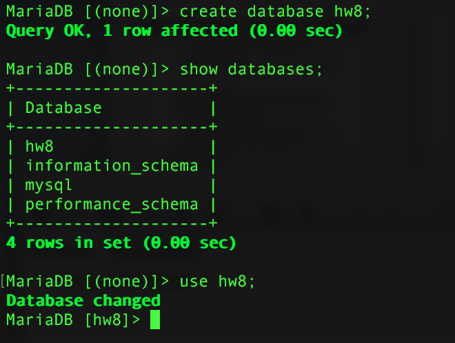
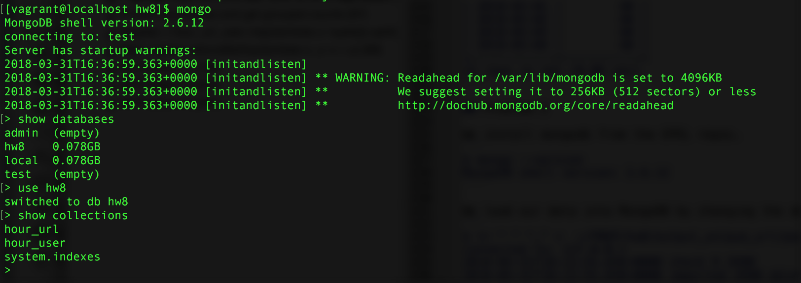

## Setup

We'll modify the Spark jobs we created in HW7 (`p1_q1.py` and `p1_q2.py`) to now output tuples with the hour and user for `unique_users.py` and the hour and url for `unique_url.py`. While we could collect the unique url and users for each hour into an array, this nested data structure isn't quite as nice to work with in MariaDB, so we will prefer flat records for the output of our batch job--even though there will be more records per hour instead of only one.

`unique_url.py`:
```
"""
Get unique URLs by hour
"""

from pyspark import SparkContext, SparkConf
from datetime import datetime


conf = SparkConf().setAppName("unique_url")
sc = SparkContext(conf = conf)

def extract_hourpart_url(dat):
    """
    Return timestamp (up to the hour) and the URL
    :param dat: An RDD from our log data
    """
    _, timestamp, url, _ = dat.split(' ')
    hourpart = timestamp[:13] + ':00:00'
    return '{} {}'.format(hourpart, url)

logs = sc.textFile('hw7_logs*.txt')
# Convert full timestamp to only hour and return only needed fields and remove duplicate URLs
hour_url = logs.map(extract_hourpart_url).distinct()

hour_url.coalesce(1).saveAsTextFile("output_unique_url/")
```

`unique_users.py`:
```
"""
Get unique visitors by URLs by hour
"""

from pyspark import SparkContext, SparkConf
from datetime import datetime


conf = SparkConf().setAppName("unique_users")
sc = SparkContext(conf = conf)

def extract_hourpart_user(dat):
    """
    Return timestamp (up to the hour) and user
    :param dat: An RDD from our log data
    """
    _, timestamp, url, user = dat.split(' ')
    hourpart = timestamp[:13] + ':00:00'
    return '{} {}'.format(hourpart, user)

logs = sc.textFile('hw7_logs*.txt')
# Extract hour, url, and user and remove duplicates
hour_user = logs.map(extract_hourpart_user).distinct()

# Form key/values and get grouped counts
#tuples = hour_url_user.map(lambda x: tuple([x.split(' ')[0] + ' ' + x.split(' ')[1], 1]))
#q2 = tuples.reduceByKey(lambda x, y: x + y)

hour_user.coalesce(1).saveAsTextFile("output_unique_users/")
```

We see that our Spark job of deduplciation has vasty reduced the size of our data: even though we decided to produce a "longer" set of results by using the flat records instead of a "wider" set with an array with the unique urls/users, we still have a manageable number of results:
```
$ wc -l output_unique_users/part-00000 
   11960 output_unique_users/part-00000
$ wc -l output_unique_url/part-00000 
    2990 output_unique_url/part-00000
```

And the output of the jobs:
```
$ head output_unique_users/part-00000 
2018-02-23T05:00:00 User_28
2018-03-01T10:00:00 User_30
2018-02-22T02:00:00 User_1
2018-02-23T12:00:00 User_19
2018-03-04T14:00:00 User_37
2018-02-24T10:00:00 User_16
2018-03-01T02:00:00 User_26
2018-02-23T04:00:00 User_14
2018-02-20T08:00:00 User_5
2018-02-21T20:00:00 User_32

$ head output_unique_url/part-00000 
2018-02-21T13:00:00 http://example.com/?url=8
2018-02-27T09:00:00 http://example.com/?url=7
2018-02-25T07:00:00 http://example.com/?url=7
2018-03-02T05:00:00 http://example.com/?url=7
2018-03-01T18:00:00 http://example.com/?url=4
2018-02-20T19:00:00 http://example.com/?url=5
2018-03-04T10:00:00 http://example.com/?url=7
2018-03-01T07:00:00 http://example.com/?url=8
2018-02-27T06:00:00 http://example.com/?url=0
2018-02-26T12:00:00 http://example.com/?url=4
```


## Problem 1

```
$ mysql --version
mysql  Ver 15.1 Distrib 10.2.14-MariaDB, for osx10.11 (x86_64) using readline 5.1
$ mysql
MariaDB [(none)]> show databases;
+--------------------+
| Database           |
+--------------------+
| hw8                |
| information_schema |
| mysql              |
| performance_schema |
+--------------------+
4 rows in set (0.00 sec)
```

Now we create the databases and tables in MariDB to hold these results:
```
MariaDB [(none)]> create database hw8;
Query OK, 1 row affected (0.00 sec)

MariaDB [(none)]> show databases;
+--------------------+
| Database           |
+--------------------+
| hw8                |
| information_schema |
| mysql              |
| performance_schema |
+--------------------+
4 rows in set (0.00 sec)

MariaDB [(none)]> use hw8;
Database changed
```




The schemas for the table we create will be very simple since we hold each url/user in its own record. For report 1, we will create a table with columns for the timestamp (always aligned to the hour) and the URL:
```
MariaDB [hw8]> create table hour_url (hour timestamp not null, url text not null);
Query OK, 0 rows affected (0.02 sec)

MariaDB [hw8]> show columns from hour_url;
+-------+-----------+------+-----+---------------------+-------------------------------+
| Field | Type      | Null | Key | Default             | Extra                         |
+-------+-----------+------+-----+---------------------+-------------------------------+
| hour  | timestamp | NO   |     | current_timestamp() | on update current_timestamp() |
| url   | text      | NO   |     | NULL                |                               |
+-------+-----------+------+-----+---------------------+-------------------------------+
2 rows in set (0.00 sec)
```

For report 2, we create a table with columns for the timestamp (always aligned to the hour) and the user:
```
MariaDB [hw8]> create table hour_user (hour timestamp not null, user text not null);
Query OK, 0 rows affected (0.02 sec)

MariaDB [hw8]> show columns from hour_user;
+-------+-----------+------+-----+---------------------+-------------------------------+
| Field | Type      | Null | Key | Default             | Extra                         |
+-------+-----------+------+-----+---------------------+-------------------------------+
| hour  | timestamp | NO   |     | current_timestamp() | on update current_timestamp() |
| user  | text      | NO   |     | NULL                |                               |
+-------+-----------+------+-----+---------------------+-------------------------------+
2 rows in set (0.00 sec)
```

Now we load the data into these tables:
```
MariaDB [hw8]> load data infile '~/PBDP/hw8/output_unique_url/part-00000' into table hour_url fields terminated by ' ';
Query OK, 2990 rows affected (0.01 sec)              
Records: 2990  Deleted: 0  Skipped: 0  Warnings: 0

MariaDB [hw8]> load data infile '~/PBDP/hw8/output_unique_users/part-00000' into table hour_user fields terminated by ' ';
Query OK, 11960 rows affected (0.03 sec)             
Records: 11960  Deleted: 0  Skipped: 0  Warnings: 0
```

The daily reports are now very easy to generate in SQL, and if we needed to generate reports based on some frequency other than daily, we all we need to do is modify our grouping condition.

**Report 1**
```
MariaDB [hw8]> select date(hour) as day, count(distinct(url)) as num_url from hour_url group by day order by day asc;
+------------+---------+
| day        | num_url |
+------------+---------+
| 2018-02-20 |      10 |
| 2018-02-21 |      10 |
| 2018-02-22 |      10 |
| 2018-02-23 |      10 |
| 2018-02-24 |      10 |
| 2018-02-25 |      10 |
| 2018-02-26 |      10 |
| 2018-02-27 |      10 |
| 2018-02-28 |      10 |
| 2018-03-01 |      10 |
| 2018-03-02 |      10 |
| 2018-03-03 |      10 |
| 2018-03-04 |      10 |
+------------+---------+
13 rows in set (0.02 sec)
```

**Report 2**
```
MariaDB [hw8]> select date(hour) as day, count(distinct(user)) as num_users from hour_user group by day order by day asc;
+------------+-----------+
| day        | num_users |
+------------+-----------+
| 2018-02-20 |        40 |
| 2018-02-21 |        40 |
| 2018-02-22 |        40 |
| 2018-02-23 |        40 |
| 2018-02-24 |        40 |
| 2018-02-25 |        40 |
| 2018-02-26 |        40 |
| 2018-02-27 |        40 |
| 2018-02-28 |        40 |
| 2018-03-01 |        40 |
| 2018-03-02 |        40 |
| 2018-03-03 |        40 |
| 2018-03-04 |        40 |
+------------+-----------+
13 rows in set (0.06 sec)
```

## Problem 2

We install mongodb from the EPEL repos.
```
$ mongo --version
MongoDB shell version: 2.6.12
```

We load our data into MongoDB by changing the delimiter to a comma; the result is piped to `mongoimport` with the specified field names, database, and collection:
```
$ tr " " "," <  ~/PBDP/hw8/output_unique_url/part-00000 | mongoimport -d hw8 -c hour_url --type csv -f hour,url
connected to: 127.0.0.1
2018-03-31T18:12:55.836+0000 check 9 2990
2018-03-31T18:12:55.838+0000 imported 2990 objects

$ tr " " "," <  ~/PBDP/hw8/output_unique_users/part-00000 | mongoimport -d hw8 -c hour_user --type csv -f hour,user
connected to: 127.0.0.1
2018-03-31T18:13:15.341+0000 check 9 11960
2018-03-31T18:13:15.369+0000 imported 11960 objects
```



We enter the Mongo shell and see that our dabase and collections have been populated. The schema we use for our two collections is essentially the same that we used for MariaDB: one field in the JSON contains the timestamp `hour` and the other contains the `user` or `url`. We can also see that our records have been inserted:
```
> db.hour_url.find()
{ "_id" : ObjectId("5abfe1535397feaeda6272e8"), "hour" : "2018-02-21T13:00:00", "url" : "http://example.com/?url=8" }
{ "_id" : ObjectId("5abfe1535397feaeda6272e9"), "hour" : "2018-02-27T09:00:00", "url" : "http://example.com/?url=7" }
{ "_id" : ObjectId("5abfe1535397feaeda6272ea"), "hour" : "2018-02-25T07:00:00", "url" : "http://example.com/?url=7" }
{ "_id" : ObjectId("5abfe1535397feaeda6272eb"), "hour" : "2018-03-02T05:00:00", "url" : "http://example.com/?url=7" }
{ "_id" : ObjectId("5abfe1535397feaeda6272ec"), "hour" : "2018-03-01T18:00:00", "url" : "http://example.com/?url=4" }
{ "_id" : ObjectId("5abfe1535397feaeda6272ed"), "hour" : "2018-02-20T19:00:00", "url" : "http://example.com/?url=5" }
{ "_id" : ObjectId("5abfe1535397feaeda6272ee"), "hour" : "2018-03-04T10:00:00", "url" : "http://example.com/?url=7" }
{ "_id" : ObjectId("5abfe1535397feaeda6272ef"), "hour" : "2018-03-01T07:00:00", "url" : "http://example.com/?url=8" }
{ "_id" : ObjectId("5abfe1535397feaeda6272f0"), "hour" : "2018-02-27T06:00:00", "url" : "http://example.com/?url=0" }
{ "_id" : ObjectId("5abfe1535397feaeda6272f1"), "hour" : "2018-02-26T12:00:00", "url" : "http://example.com/?url=4" }
{ "_id" : ObjectId("5abfe1535397feaeda6272f2"), "hour" : "2018-03-02T04:00:00", "url" : "http://example.com/?url=6" }
{ "_id" : ObjectId("5abfe1535397feaeda6272f3"), "hour" : "2018-03-01T14:00:00", "url" : "http://example.com/?url=0" }
{ "_id" : ObjectId("5abfe1535397feaeda6272f4"), "hour" : "2018-02-21T01:00:00", "url" : "http://example.com/?url=1" }
{ "_id" : ObjectId("5abfe1535397feaeda6272f5"), "hour" : "2018-02-21T03:00:00", "url" : "http://example.com/?url=7" }
{ "_id" : ObjectId("5abfe1535397feaeda6272f6"), "hour" : "2018-02-27T10:00:00", "url" : "http://example.com/?url=5" }
{ "_id" : ObjectId("5abfe1535397feaeda6272f7"), "hour" : "2018-03-03T20:00:00", "url" : "http://example.com/?url=7" }
{ "_id" : ObjectId("5abfe1535397feaeda6272f8"), "hour" : "2018-02-28T07:00:00", "url" : "http://example.com/?url=4" }
{ "_id" : ObjectId("5abfe1535397feaeda6272f9"), "hour" : "2018-02-26T06:00:00", "url" : "http://example.com/?url=3" }
{ "_id" : ObjectId("5abfe1535397feaeda6272fa"), "hour" : "2018-02-26T13:00:00", "url" : "http://example.com/?url=9" }
{ "_id" : ObjectId("5abfe1535397feaeda6272fb"), "hour" : "2018-02-22T21:00:00", "url" : "http://example.com/?url=2" }
Type "it" for more

> db.hour_user.find()
{ "_id" : ObjectId("5abfe0045397feaeda624430"), "hour" : "2018-02-23T05:00:00", "user" : "User_28" }
{ "_id" : ObjectId("5abfe0045397feaeda624431"), "hour" : "2018-03-01T10:00:00", "user" : "User_30" }
{ "_id" : ObjectId("5abfe0045397feaeda624432"), "hour" : "2018-02-22T02:00:00", "user" : "User_1" }
{ "_id" : ObjectId("5abfe0045397feaeda624433"), "hour" : "2018-02-23T12:00:00", "user" : "User_19" }
{ "_id" : ObjectId("5abfe0045397feaeda624434"), "hour" : "2018-03-04T14:00:00", "user" : "User_37" }
{ "_id" : ObjectId("5abfe0045397feaeda624435"), "hour" : "2018-02-24T10:00:00", "user" : "User_16" }
{ "_id" : ObjectId("5abfe0045397feaeda624436"), "hour" : "2018-03-01T02:00:00", "user" : "User_26" }
{ "_id" : ObjectId("5abfe0045397feaeda624437"), "hour" : "2018-02-23T04:00:00", "user" : "User_14" }
{ "_id" : ObjectId("5abfe0045397feaeda624438"), "hour" : "2018-02-20T08:00:00", "user" : "User_5" }
{ "_id" : ObjectId("5abfe0045397feaeda624439"), "hour" : "2018-02-21T20:00:00", "user" : "User_32" }
{ "_id" : ObjectId("5abfe0045397feaeda62443a"), "hour" : "2018-03-02T06:00:00", "user" : "User_0" }
{ "_id" : ObjectId("5abfe0045397feaeda62443b"), "hour" : "2018-03-01T00:00:00", "user" : "User_19" }
{ "_id" : ObjectId("5abfe0045397feaeda62443c"), "hour" : "2018-02-21T14:00:00", "user" : "User_1" }
{ "_id" : ObjectId("5abfe0045397feaeda62443d"), "hour" : "2018-02-22T12:00:00", "user" : "User_0" }
{ "_id" : ObjectId("5abfe0045397feaeda62443e"), "hour" : "2018-03-02T14:00:00", "user" : "User_39" }
{ "_id" : ObjectId("5abfe0045397feaeda62443f"), "hour" : "2018-02-21T05:00:00", "user" : "User_31" }
{ "_id" : ObjectId("5abfe0045397feaeda624440"), "hour" : "2018-02-28T03:00:00", "user" : "User_27" }
{ "_id" : ObjectId("5abfe0045397feaeda624441"), "hour" : "2018-02-21T19:00:00", "user" : "User_36" }
{ "_id" : ObjectId("5abfe0045397feaeda624442"), "hour" : "2018-03-01T21:00:00", "user" : "User_27" }
{ "_id" : ObjectId("5abfe0045397feaeda624443"), "hour" : "2018-03-03T19:00:00", "user" : "User_15" }
Type "it" for more
```

Our Mongo queries will consist of the following steps inside an aggregation pipeline:

1. Transform the full timestamp into its day part and select this field and the url or user--depending on the report.
2. Group the results based on day and build a set without duplicates.
3. Count the number of elements in the grouped set from step 3.
4. Sort the results by the date.

**Report 1**
```
> db.hour_url.aggregate([ 
{$project : {day :  {$substr: ["$hour", 0, 10]}, url : "$url"}},
{$group : {_id: "$day", uniqueCount : {$addToSet : "$url"}}},
{$project : {day : 1, num_url : {$size : "$uniqueCount"}}},
{$sort : {_id : 1}},
])
{ "_id" : "2018-02-20", "num_url" : 10 }
{ "_id" : "2018-02-21", "num_url" : 10 }
{ "_id" : "2018-02-22", "num_url" : 10 }
{ "_id" : "2018-02-23", "num_url" : 10 }
{ "_id" : "2018-02-24", "num_url" : 10 }
{ "_id" : "2018-02-25", "num_url" : 10 }
{ "_id" : "2018-02-26", "num_url" : 10 }
{ "_id" : "2018-02-27", "num_url" : 10 }
{ "_id" : "2018-02-28", "num_url" : 10 }
{ "_id" : "2018-03-01", "num_url" : 10 }
{ "_id" : "2018-03-02", "num_url" : 10 }
{ "_id" : "2018-03-03", "num_url" : 10 }
{ "_id" : "2018-03-04", "num_url" : 10 }
```

**Report 2**
```
$ db.hour_user.aggregate([ 
{$project : {day :  {$substr: ["$hour", 0, 10]}, user : "$user"}},
{$group : {_id: "$day", uniqueCount : {$addToSet : "$user"}}},
{$project : {day : 1, num_user : {$size : "$uniqueCount"}}},
{$sort : {_id : 1}},
])
{ "_id" : "2018-02-20", "num_user" : 40 }
{ "_id" : "2018-02-21", "num_user" : 40 }
{ "_id" : "2018-02-22", "num_user" : 40 }
{ "_id" : "2018-02-23", "num_user" : 40 }
{ "_id" : "2018-02-24", "num_user" : 40 }
{ "_id" : "2018-02-25", "num_user" : 40 }
{ "_id" : "2018-02-26", "num_user" : 40 }
{ "_id" : "2018-02-27", "num_user" : 40 }
{ "_id" : "2018-02-28", "num_user" : 40 }
{ "_id" : "2018-03-01", "num_user" : 40 }
{ "_id" : "2018-03-02", "num_user" : 40 }
{ "_id" : "2018-03-03", "num_user" : 40 }
{ "_id" : "2018-03-04", "num_user" : 40 }
```

Our schema and strategies were very similar for both MariaDB and MongoDB, and both used essentially the same schema. An advantage of this approach is that would could very easily generate new monthly reports as well (assuming the datasizes do not grow too large). If we were using these daily views very frequently (with no need for reports with granularity less than a day) and wanted to also generate monthly reports, we might consider modifying the Spark job to instead generate all the unique URLs/users for each day. This would keep data sizes small and allow us to generate the monthly report similar to how we did here very quickly.

## Problem 3

We modify our Spark jobs again. The major difference here is we will collect the final results in a dataframe to write to MariaDB with the JDBC connector.

`unique_url_mariadb.py`
```
```

`unique_users_mariadb.py`
```
```

Now we run the spark jobs and include the MariaDB ODBC connector jar downloaded from https://downloads.mariadb.com/Connectors/java/connector-java-2.2.3/mariadb-java-client-2.2.3.jar.

We launch the first job:
```

```

We launch the second job:
```

```
