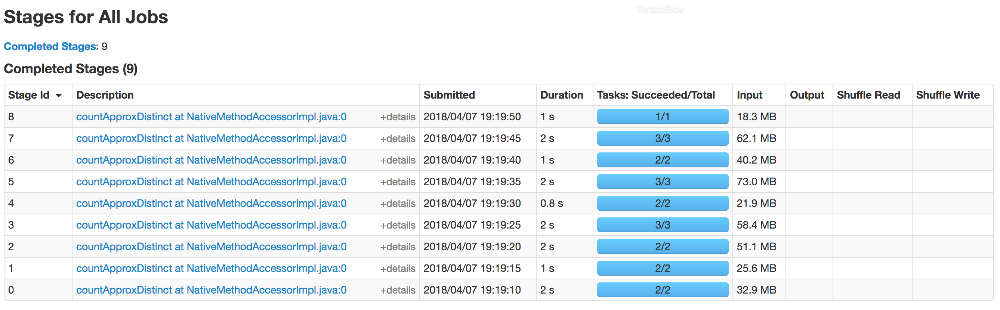
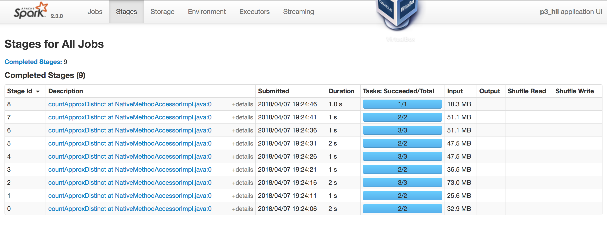
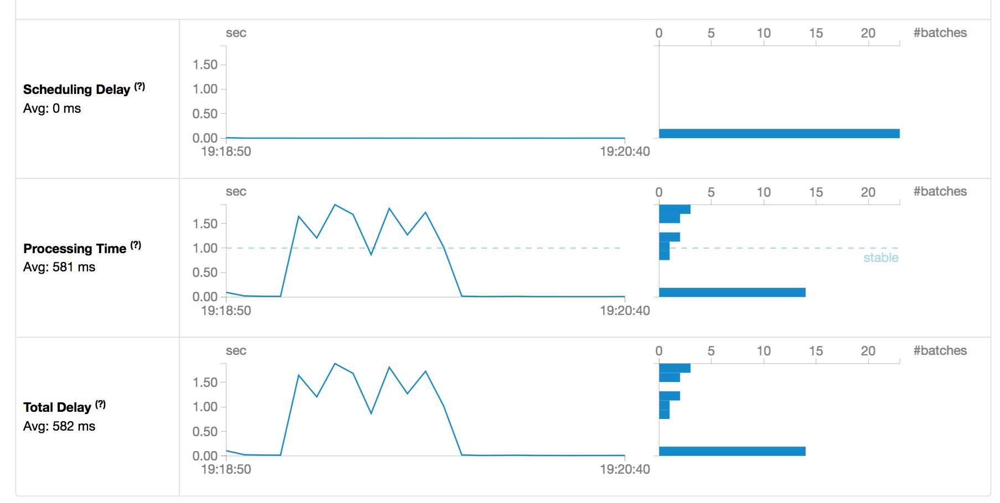
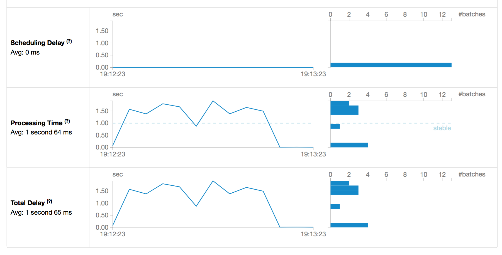

## Problem 1

Our Spark job `p1.py` for counting URLs is reproduced below. Note that this job produces *both* the counts of URLs in the current one second window and the running cumualtive count per URL.
```
from pyspark import SparkContext, SparkConf
from pyspark.streaming import StreamingContext
import os

def functionToCreateContext():
    """
    Setup checkpointing
    """
    conf = SparkConf().setAppName('p1').setMaster("local[*]")
    sc = SparkContext(conf=conf)
    sc.setLogLevel('ERROR')
    ssc = StreamingContext(sc, 1)
    ssc.checkpoint('checkpoints')
    return ssc

ssc = StreamingContext.getOrCreate('checkpoints', functionToCreateContext)

def updateFunction(newValues, runningCount):
    """
    Update the running count
    :param newValues: the number of records processed in the current window
    :param runningCount: the current running sum to increment
    """
    if runningCount is None:
        runningCount = 0
    return sum(newValues, runningCount)


def extract_url(line):
    """
    Parse a line with UUID, timestqmap, URL, and user. Return the URL.
    :param line: A string containing a record
    """
    (uuid, timestamp, url, user) = line.strip().split(' ')
    #hour = timestamp[0:14]
    return (url, 1)


print 'Counts in window'
lines = ssc.textFileStream('data_input')
url_count = lines.map(extract_url).reduceByKey(lambda x, y: x + y)
url_count.pprint()

print 'Cumulative counts'
running_counts = url_count.updateStateByKey(updateFunction)
running_counts.pprint()


ssc.start()
ssc.awaitTermination()
ssc.stop()

```

The first few lines from launching the job:
```
$ spark-submit p1.py 
2018-04-04 21:05:31 WARN  NativeCodeLoader:62 - Unable to load native-hadoop library for your platform... using builtin-java classes where applicable
2018-04-04 21:05:32 INFO  SparkContext:54 - Running Spark version 2.3.0
2018-04-04 21:05:32 INFO  SparkContext:54 - Submitted application: p1
2018-04-04 21:05:32 INFO  SecurityManager:54 - Changing view acls to: david.shaub
2018-04-04 21:05:32 INFO  SecurityManager:54 - Changing modify acls to: david.shaub
2018-04-04 21:05:32 INFO  SecurityManager:54 - Changing view acls groups to: 
2018-04-04 21:05:32 INFO  SecurityManager:54 - Changing modify acls groups to: 
2018-04-04 21:05:32 INFO  SecurityManager:54 - SecurityManager: authentication disabled; ui acls disabled; users  with view permissions: Set(david.shaub); groups with view permissions: Set(); users  with modify permissions: Set(david.shaub); groups with modify permissions: Set()
2018-04-04 21:05:32 INFO  Utils:54 - Successfully started service 'sparkDriver' on port 55529.
2018-04-04 21:05:32 INFO  SparkEnv:54 - Registering MapOutputTracker
2018-04-04 21:05:32 INFO  SparkEnv:54 - Registering BlockManagerMaster

```

And the last lines of the job output (excluding the window and cumulative counts that appear below):
```
2018-04-04 21:05:32 INFO  Executor:54 - Starting executor ID driver on host localhost
2018-04-04 21:05:32 INFO  Utils:54 - Successfully started service 'org.apache.spark.network.netty.NettyBlockTransferService' on port 55530.
2018-04-04 21:05:32 INFO  NettyBlockTransferService:54 - Server created on usmac2752dshau.local:55530
2018-04-04 21:05:32 INFO  BlockManager:54 - Using org.apache.spark.storage.RandomBlockReplicationPolicy for block replication policy
2018-04-04 21:05:32 INFO  BlockManagerMaster:54 - Registering BlockManager BlockManagerId(driver, usmac2752dshau.local, 55530, None)
2018-04-04 21:05:32 INFO  BlockManagerMasterEndpoint:54 - Registering block manager usmac2752dshau.local:55530 with 366.3 MB RAM, BlockManagerId(driver, usmac2752dshau.local, 55530, None)
2018-04-04 21:05:32 INFO  BlockManagerMaster:54 - Registered BlockManager BlockManagerId(driver, usmac2752dshau.local, 55530, None)
2018-04-04 21:05:32 INFO  BlockManager:54 - Initialized BlockManager: BlockManagerId(driver, usmac2752dshau.local, 55530, None)
2018-04-04 21:05:33 INFO  ContextHandler:781 - Started o.s.j.s.ServletContextHandler@7936f741{/metrics/json,null,AVAILABLE,@Spark}
Counts in window
Cumulative counts
```

We will expect the cumulative count to approach 420,000 for each URL:
```
$ awk '{print $3}' data_stage/hw9_logs_*.txt | sort | uniq -c
420000 http://example.com/?url=0
420000 http://example.com/?url=1
420000 http://example.com/?url=2
420000 http://example.com/?url=3
420000 http://example.com/?url=4
420000 http://example.com/?url=5
420000 http://example.com/?url=6
420000 http://example.com/?url=7
420000 http://example.com/?url=8
420000 http://example.com/?url=9
```

The results of running the job appear below. Notice that some windows do not have any new streaming data entering (e.g. 21:05:55), but we still print out the cumulative count after every window. The first block of results for each second represents the URL counts in that window, and the second block of results for each second represents the cumulative counts.
```
-------------------------------------------
Time: 2018-04-04 21:05:54
-------------------------------------------
(u'http://example.com/?url=6', 12000)
(u'http://example.com/?url=7', 12000)
(u'http://example.com/?url=4', 12000)
(u'http://example.com/?url=5', 12000)
(u'http://example.com/?url=2', 12000)
(u'http://example.com/?url=3', 12000)
(u'http://example.com/?url=8', 12000)
(u'http://example.com/?url=0', 12000)
(u'http://example.com/?url=9', 12000)
(u'http://example.com/?url=1', 12000)

-------------------------------------------
Time: 2018-04-04 21:05:54
-------------------------------------------
(u'http://example.com/?url=6', 164000)
(u'http://example.com/?url=7', 164000)
(u'http://example.com/?url=4', 164000)
(u'http://example.com/?url=5', 164000)
(u'http://example.com/?url=2', 164000)
(u'http://example.com/?url=3', 164000)
(u'http://example.com/?url=8', 164000)
(u'http://example.com/?url=0', 164000)
(u'http://example.com/?url=9', 164000)
(u'http://example.com/?url=1', 164000)

-------------------------------------------
Time: 2018-04-04 21:05:55
-------------------------------------------

-------------------------------------------
Time: 2018-04-04 21:05:55
-------------------------------------------
(u'http://example.com/?url=6', 164000)
(u'http://example.com/?url=7', 164000)
(u'http://example.com/?url=4', 164000)
(u'http://example.com/?url=5', 164000)
(u'http://example.com/?url=2', 164000)
(u'http://example.com/?url=3', 164000)
(u'http://example.com/?url=8', 164000)
(u'http://example.com/?url=0', 164000)
(u'http://example.com/?url=9', 164000)
(u'http://example.com/?url=1', 164000)

-------------------------------------------
Time: 2018-04-04 21:05:56
-------------------------------------------
(u'http://example.com/?url=6', 16000)
(u'http://example.com/?url=7', 16000)
(u'http://example.com/?url=4', 16000)
(u'http://example.com/?url=5', 16000)
(u'http://example.com/?url=2', 16000)
(u'http://example.com/?url=3', 16000)
(u'http://example.com/?url=8', 16000)
(u'http://example.com/?url=0', 16000)
(u'http://example.com/?url=9', 16000)
(u'http://example.com/?url=1', 16000)

-------------------------------------------
Time: 2018-04-04 21:05:56
-------------------------------------------
(u'http://example.com/?url=6', 180000)
(u'http://example.com/?url=7', 180000)
(u'http://example.com/?url=4', 180000)
(u'http://example.com/?url=5', 180000)
(u'http://example.com/?url=2', 180000)
(u'http://example.com/?url=3', 180000)
(u'http://example.com/?url=8', 180000)
(u'http://example.com/?url=0', 180000)
(u'http://example.com/?url=9', 180000)
(u'http://example.com/?url=1', 180000)

-------------------------------------------
Time: 2018-04-04 21:05:57
-------------------------------------------

-------------------------------------------
Time: 2018-04-04 21:05:57
-------------------------------------------
(u'http://example.com/?url=6', 180000)
(u'http://example.com/?url=7', 180000)
(u'http://example.com/?url=4', 180000)
(u'http://example.com/?url=5', 180000)
(u'http://example.com/?url=2', 180000)
(u'http://example.com/?url=3', 180000)
(u'http://example.com/?url=8', 180000)
(u'http://example.com/?url=0', 180000)
(u'http://example.com/?url=9', 180000)
(u'http://example.com/?url=1', 180000)

-------------------------------------------
Time: 2018-04-04 21:05:58
-------------------------------------------
(u'http://example.com/?url=6', 8000)
(u'http://example.com/?url=7', 8000)
(u'http://example.com/?url=4', 8000)
(u'http://example.com/?url=5', 8000)
(u'http://example.com/?url=2', 8000)
(u'http://example.com/?url=3', 8000)
(u'http://example.com/?url=8', 8000)
(u'http://example.com/?url=0', 8000)
(u'http://example.com/?url=9', 8000)
(u'http://example.com/?url=1', 8000)

-------------------------------------------
Time: 2018-04-04 21:05:58
-------------------------------------------
(u'http://example.com/?url=6', 188000)
(u'http://example.com/?url=7', 188000)
(u'http://example.com/?url=4', 188000)
(u'http://example.com/?url=5', 188000)
(u'http://example.com/?url=2', 188000)
(u'http://example.com/?url=3', 188000)
(u'http://example.com/?url=8', 188000)
(u'http://example.com/?url=0', 188000)
(u'http://example.com/?url=9', 188000)
(u'http://example.com/?url=1', 188000)

-------------------------------------------
Time: 2018-04-04 21:05:59
-------------------------------------------

-------------------------------------------
Time: 2018-04-04 21:05:59
-------------------------------------------
(u'http://example.com/?url=6', 188000)
(u'http://example.com/?url=7', 188000)
(u'http://example.com/?url=4', 188000)
(u'http://example.com/?url=5', 188000)
(u'http://example.com/?url=2', 188000)
(u'http://example.com/?url=3', 188000)
(u'http://example.com/?url=8', 188000)
(u'http://example.com/?url=0', 188000)
(u'http://example.com/?url=9', 188000)
(u'http://example.com/?url=1', 188000)

-------------------------------------------
Time: 2018-04-04 21:06:00
-------------------------------------------
(u'http://example.com/?url=6', 28000)
(u'http://example.com/?url=7', 28000)
(u'http://example.com/?url=4', 28000)
(u'http://example.com/?url=5', 28000)
(u'http://example.com/?url=2', 28000)
(u'http://example.com/?url=3', 28000)
(u'http://example.com/?url=8', 28000)
(u'http://example.com/?url=0', 28000)
(u'http://example.com/?url=9', 28000)
(u'http://example.com/?url=1', 28000)

-------------------------------------------
Time: 2018-04-04 21:06:00
-------------------------------------------
(u'http://example.com/?url=6', 216000)
(u'http://example.com/?url=7', 216000)
(u'http://example.com/?url=4', 216000)
(u'http://example.com/?url=5', 216000)
(u'http://example.com/?url=2', 216000)
(u'http://example.com/?url=3', 216000)
(u'http://example.com/?url=8', 216000)
(u'http://example.com/?url=0', 216000)
(u'http://example.com/?url=9', 216000)
(u'http://example.com/?url=1', 216000)

-------------------------------------------
Time: 2018-04-04 21:06:01
-------------------------------------------

-------------------------------------------
Time: 2018-04-04 21:06:01
-------------------------------------------
(u'http://example.com/?url=6', 216000)
(u'http://example.com/?url=7', 216000)
(u'http://example.com/?url=4', 216000)
(u'http://example.com/?url=5', 216000)
(u'http://example.com/?url=2', 216000)
(u'http://example.com/?url=3', 216000)
(u'http://example.com/?url=8', 216000)
(u'http://example.com/?url=0', 216000)
(u'http://example.com/?url=9', 216000)
(u'http://example.com/?url=1', 216000)

-------------------------------------------
Time: 2018-04-04 21:06:02
-------------------------------------------
(u'http://example.com/?url=6', 20000)
(u'http://example.com/?url=7', 20000)
(u'http://example.com/?url=4', 20000)
(u'http://example.com/?url=5', 20000)
(u'http://example.com/?url=2', 20000)
(u'http://example.com/?url=3', 20000)
(u'http://example.com/?url=8', 20000)
(u'http://example.com/?url=0', 20000)
(u'http://example.com/?url=9', 20000)
(u'http://example.com/?url=1', 20000)

-------------------------------------------
Time: 2018-04-04 21:06:02
-------------------------------------------
(u'http://example.com/?url=6', 236000)
(u'http://example.com/?url=7', 236000)
(u'http://example.com/?url=4', 236000)
(u'http://example.com/?url=5', 236000)
(u'http://example.com/?url=2', 236000)
(u'http://example.com/?url=3', 236000)
(u'http://example.com/?url=8', 236000)
(u'http://example.com/?url=0', 236000)
(u'http://example.com/?url=9', 236000)
(u'http://example.com/?url=1', 236000)

-------------------------------------------
Time: 2018-04-04 21:06:03
-------------------------------------------

-------------------------------------------
Time: 2018-04-04 21:06:03
-------------------------------------------
(u'http://example.com/?url=6', 236000)
(u'http://example.com/?url=7', 236000)
(u'http://example.com/?url=4', 236000)
(u'http://example.com/?url=5', 236000)
(u'http://example.com/?url=2', 236000)
(u'http://example.com/?url=3', 236000)
(u'http://example.com/?url=8', 236000)
(u'http://example.com/?url=0', 236000)
(u'http://example.com/?url=9', 236000)
(u'http://example.com/?url=1', 236000)

-------------------------------------------
Time: 2018-04-04 21:06:04
-------------------------------------------
(u'http://example.com/?url=6', 32000)
(u'http://example.com/?url=7', 32000)
(u'http://example.com/?url=4', 32000)
(u'http://example.com/?url=5', 32000)
(u'http://example.com/?url=2', 32000)
(u'http://example.com/?url=3', 32000)
(u'http://example.com/?url=8', 32000)
(u'http://example.com/?url=0', 32000)
(u'http://example.com/?url=9', 32000)
(u'http://example.com/?url=1', 32000)

-------------------------------------------
Time: 2018-04-04 21:06:04
-------------------------------------------
(u'http://example.com/?url=6', 268000)
(u'http://example.com/?url=7', 268000)
(u'http://example.com/?url=4', 268000)
(u'http://example.com/?url=5', 268000)
(u'http://example.com/?url=2', 268000)
(u'http://example.com/?url=3', 268000)
(u'http://example.com/?url=8', 268000)
(u'http://example.com/?url=0', 268000)
(u'http://example.com/?url=9', 268000)
(u'http://example.com/?url=1', 268000)
```


When all files are finished processing, we reach a cumulative count of 400,000, missing some 20,000 examples per URL that we expected from our count with command line tools:
```
-------------------------------------------
Time: 2018-04-04 21:06:35
-------------------------------------------
(u'http://example.com/?url=6', 400000)
(u'http://example.com/?url=7', 400000)
(u'http://example.com/?url=4', 400000)
(u'http://example.com/?url=5', 400000)
(u'http://example.com/?url=2', 400000)
(u'http://example.com/?url=3', 400000)
(u'http://example.com/?url=8', 400000)
(u'http://example.com/?url=0', 400000)
(u'http://example.com/?url=9', 400000)
(u'http://example.com/?url=1', 400000)

-------------------------------------------
Time: 2018-04-04 21:06:36
-------------------------------------------

-------------------------------------------
Time: 2018-04-04 21:06:36
-------------------------------------------
(u'http://example.com/?url=6', 400000)
(u'http://example.com/?url=7', 400000)
(u'http://example.com/?url=4', 400000)
(u'http://example.com/?url=5', 400000)
(u'http://example.com/?url=2', 400000)
(u'http://example.com/?url=3', 400000)
(u'http://example.com/?url=8', 400000)
(u'http://example.com/?url=0', 400000)
(u'http://example.com/?url=9', 400000)
(u'http://example.com/?url=1', 400000)
```

## Problem 2

We modify the job whereby counts within a window occur every 5 seconds with a 5 second offset so we achieve the tumbled, non-overlaping windows. Since the cumulative counts are themselves "forked" from the streams of individual counts, the cumulative counts are also automatically generated every 5 seconds. Our job is in `p2.py`:
```
from pyspark import SparkContext, SparkConf
from pyspark.streaming import StreamingContext
import os

def functionToCreateContext():
    """
    Setup checkpointing
    """
    conf = SparkConf().setAppName('p2').setMaster("local[*]")
    sc = SparkContext(conf=conf)
    sc.setLogLevel('ERROR')
    ssc = StreamingContext(sc, 1)
    ssc.checkpoint('checkpoints')
    return ssc

ssc = StreamingContext.getOrCreate('checkpoints', functionToCreateContext)

def updateFunction(newValues, runningCount):
    """
    Update the running count
    :param newValues: the number of records processed in the current window
    :param runningCount: the current running sum to increment
    """
    if runningCount is None:
        runningCount = 0
    return sum(newValues, runningCount)


def extract_url(line):
    """
    Parse a line with UUID, timestqmap, URL, and user. Return the URL.
    :param line: A string containing a record
    """
    (uuid, timestamp, url, user) = line.strip().split(' ')
    #hour = timestamp[0:14]
    return (url, 1)


print 'Counts in window'
lines = ssc.textFileStream('data_input')
url_count = lines.window(5, 5).map(extract_url).reduceByKey(lambda x, y: x + y)
url_count.pprint()

print 'Cumulative counts'
running_counts = url_count.updateStateByKey(updateFunction)
running_counts.pprint()


ssc.start()
ssc.awaitTermination()
ssc.stop()

```


We launch the job:
```
$ spark-submit p2.py 
2018-04-05 14:35:08 WARN  NativeCodeLoader:62 - Unable to load native-hadoop library for your platform... using builtin-java classes where applicable
2018-04-05 14:35:08 INFO  SparkContext:54 - Running Spark version 2.3.0
2018-04-05 14:35:08 INFO  SparkContext:54 - Submitted application: p2
2018-04-05 14:35:08 INFO  SecurityManager:54 - Changing view acls to: david.shaub
2018-04-05 14:35:08 INFO  SecurityManager:54 - Changing modify acls to: david.shaub
2018-04-05 14:35:08 INFO  SecurityManager:54 - Changing view acls groups to: 
2018-04-05 14:35:08 INFO  SecurityManager:54 - Changing modify acls groups to: 
2018-04-05 14:35:08 INFO  SecurityManager:54 - SecurityManager: authentication disabled; ui acls disabled; users  with view permissions: Set(david.shaub); groups with view permissions: Set(); users  with modify permissions: Set(david.shaub); groups with modify permissions: Set()
2018-04-05 14:35:09 INFO  Utils:54 - Successfully started service 'sparkDriver' on port 63721.
2018-04-05 14:35:09 INFO  SparkEnv:54 - Registering MapOutputTracker
2018-04-05 14:35:09 INFO  SparkEnv:54 - Registering BlockManagerMaster
2018-04-05 14:35:09 INFO  BlockManagerMasterEndpoint:54 - Using org.apache.spark.storage.DefaultTopologyMapper for getting topology information

```

Once again the job counts 400,000 results per URL, but this time we see the results for both the window and cumulative counts are returned every 5 seconds:
```
2018-04-05 14:35:09 INFO  Executor:54 - Starting executor ID driver on host localhost
2018-04-05 14:35:09 INFO  Utils:54 - Successfully started service 'org.apache.spark.network.netty.NettyBlockTransferService' on port 63722.
2018-04-05 14:35:09 INFO  NettyBlockTransferService:54 - Server created on usmac2752dshau.schq.secious.com:63722
2018-04-05 14:35:09 INFO  BlockManager:54 - Using org.apache.spark.storage.RandomBlockReplicationPolicy for block replication policy
2018-04-05 14:35:09 INFO  BlockManagerMaster:54 - Registering BlockManager BlockManagerId(driver, usmac2752dshau.schq.secious.com, 63722, None)
2018-04-05 14:35:09 INFO  BlockManagerMasterEndpoint:54 - Registering block manager usmac2752dshau.schq.secious.com:63722 with 366.3 MB RAM, BlockManagerId(driver, usmac2752dshau.schq.secious.com, 63722, None)
2018-04-05 14:35:09 INFO  BlockManagerMaster:54 - Registered BlockManager BlockManagerId(driver, usmac2752dshau.schq.secious.com, 63722, None)
2018-04-05 14:35:09 INFO  BlockManager:54 - Initialized BlockManager: BlockManagerId(driver, usmac2752dshau.schq.secious.com, 63722, None)
2018-04-05 14:35:09 INFO  ContextHandler:781 - Started o.s.j.s.ServletContextHandler@63009f6e{/metrics/json,null,AVAILABLE,@Spark}
Counts in window
Cumulative counts
-------------------------------------------
Time: 2018-04-05 14:35:15
-------------------------------------------

-------------------------------------------
Time: 2018-04-05 14:35:15
-------------------------------------------

-------------------------------------------
Time: 2018-04-05 14:35:20
-------------------------------------------

-------------------------------------------
Time: 2018-04-05 14:35:20
-------------------------------------------

-------------------------------------------
Time: 2018-04-05 14:35:25
-------------------------------------------
(u'http://example.com/?url=6', 44000)
(u'http://example.com/?url=7', 44000)
(u'http://example.com/?url=4', 44000)
(u'http://example.com/?url=5', 44000)
(u'http://example.com/?url=2', 44000)
(u'http://example.com/?url=3', 44000)
(u'http://example.com/?url=8', 44000)
(u'http://example.com/?url=0', 44000)
(u'http://example.com/?url=9', 44000)
(u'http://example.com/?url=1', 44000)

-------------------------------------------
Time: 2018-04-05 14:35:25
-------------------------------------------
(u'http://example.com/?url=6', 44000)
(u'http://example.com/?url=7', 44000)
(u'http://example.com/?url=4', 44000)
(u'http://example.com/?url=5', 44000)
(u'http://example.com/?url=2', 44000)
(u'http://example.com/?url=3', 44000)
(u'http://example.com/?url=8', 44000)
(u'http://example.com/?url=0', 44000)
(u'http://example.com/?url=9', 44000)
(u'http://example.com/?url=1', 44000)

-------------------------------------------
Time: 2018-04-05 14:35:30
-------------------------------------------
(u'http://example.com/?url=6', 56000)
(u'http://example.com/?url=7', 56000)
(u'http://example.com/?url=4', 56000)
(u'http://example.com/?url=5', 56000)
(u'http://example.com/?url=2', 56000)
(u'http://example.com/?url=3', 56000)
(u'http://example.com/?url=8', 56000)
(u'http://example.com/?url=0', 56000)
(u'http://example.com/?url=9', 56000)
(u'http://example.com/?url=1', 56000)

-------------------------------------------
Time: 2018-04-05 14:35:30
-------------------------------------------
(u'http://example.com/?url=6', 100000)
(u'http://example.com/?url=7', 100000)
(u'http://example.com/?url=4', 100000)
(u'http://example.com/?url=5', 100000)
(u'http://example.com/?url=2', 100000)
(u'http://example.com/?url=3', 100000)
(u'http://example.com/?url=8', 100000)
(u'http://example.com/?url=0', 100000)
(u'http://example.com/?url=9', 100000)
(u'http://example.com/?url=1', 100000)

-------------------------------------------
Time: 2018-04-05 14:35:35
-------------------------------------------
(u'http://example.com/?url=6', 64000)
(u'http://example.com/?url=7', 64000)
(u'http://example.com/?url=4', 64000)
(u'http://example.com/?url=5', 64000)
(u'http://example.com/?url=2', 64000)
(u'http://example.com/?url=3', 64000)
(u'http://example.com/?url=8', 64000)
(u'http://example.com/?url=0', 64000)
(u'http://example.com/?url=9', 64000)
(u'http://example.com/?url=1', 64000)

-------------------------------------------
Time: 2018-04-05 14:35:35
-------------------------------------------
(u'http://example.com/?url=6', 164000)
(u'http://example.com/?url=7', 164000)
(u'http://example.com/?url=4', 164000)
(u'http://example.com/?url=5', 164000)
(u'http://example.com/?url=2', 164000)
(u'http://example.com/?url=3', 164000)
(u'http://example.com/?url=8', 164000)
(u'http://example.com/?url=0', 164000)
(u'http://example.com/?url=9', 164000)
(u'http://example.com/?url=1', 164000)

-------------------------------------------
Time: 2018-04-05 14:35:40
-------------------------------------------
(u'http://example.com/?url=6', 24000)
(u'http://example.com/?url=7', 24000)
(u'http://example.com/?url=4', 24000)
(u'http://example.com/?url=5', 24000)
(u'http://example.com/?url=2', 24000)
(u'http://example.com/?url=3', 24000)
(u'http://example.com/?url=8', 24000)
(u'http://example.com/?url=0', 24000)
(u'http://example.com/?url=9', 24000)
(u'http://example.com/?url=1', 24000)

-------------------------------------------
Time: 2018-04-05 14:35:40
-------------------------------------------
(u'http://example.com/?url=6', 188000)
(u'http://example.com/?url=7', 188000)
(u'http://example.com/?url=4', 188000)
(u'http://example.com/?url=5', 188000)
(u'http://example.com/?url=2', 188000)
(u'http://example.com/?url=3', 188000)
(u'http://example.com/?url=8', 188000)
(u'http://example.com/?url=0', 188000)
(u'http://example.com/?url=9', 188000)
(u'http://example.com/?url=1', 188000)

-------------------------------------------
Time: 2018-04-05 14:35:45
-------------------------------------------
(u'http://example.com/?url=6', 48000)
(u'http://example.com/?url=7', 48000)
(u'http://example.com/?url=4', 48000)
(u'http://example.com/?url=5', 48000)
(u'http://example.com/?url=2', 48000)
(u'http://example.com/?url=3', 48000)
(u'http://example.com/?url=8', 48000)
(u'http://example.com/?url=0', 48000)
(u'http://example.com/?url=9', 48000)
(u'http://example.com/?url=1', 48000)

-------------------------------------------
Time: 2018-04-05 14:35:45
-------------------------------------------
(u'http://example.com/?url=6', 236000)
(u'http://example.com/?url=7', 236000)
(u'http://example.com/?url=4', 236000)
(u'http://example.com/?url=5', 236000)
(u'http://example.com/?url=2', 236000)
(u'http://example.com/?url=3', 236000)
(u'http://example.com/?url=8', 236000)
(u'http://example.com/?url=0', 236000)
(u'http://example.com/?url=9', 236000)
(u'http://example.com/?url=1', 236000)

-------------------------------------------
Time: 2018-04-05 14:35:50
-------------------------------------------
(u'http://example.com/?url=6', 76000)
(u'http://example.com/?url=7', 76000)
(u'http://example.com/?url=4', 76000)
(u'http://example.com/?url=5', 76000)
(u'http://example.com/?url=2', 76000)
(u'http://example.com/?url=3', 76000)
(u'http://example.com/?url=8', 76000)
(u'http://example.com/?url=0', 76000)
(u'http://example.com/?url=9', 76000)
(u'http://example.com/?url=1', 76000)

-------------------------------------------
Time: 2018-04-05 14:35:50
-------------------------------------------
(u'http://example.com/?url=6', 312000)
(u'http://example.com/?url=7', 312000)
(u'http://example.com/?url=4', 312000)
(u'http://example.com/?url=5', 312000)
(u'http://example.com/?url=2', 312000)
(u'http://example.com/?url=3', 312000)
(u'http://example.com/?url=8', 312000)
(u'http://example.com/?url=0', 312000)
(u'http://example.com/?url=9', 312000)
(u'http://example.com/?url=1', 312000)

-------------------------------------------
Time: 2018-04-05 14:35:55
-------------------------------------------
(u'http://example.com/?url=6', 40000)
(u'http://example.com/?url=7', 40000)
(u'http://example.com/?url=4', 40000)
(u'http://example.com/?url=5', 40000)
(u'http://example.com/?url=2', 40000)
(u'http://example.com/?url=3', 40000)
(u'http://example.com/?url=8', 40000)
(u'http://example.com/?url=0', 40000)
(u'http://example.com/?url=9', 40000)
(u'http://example.com/?url=1', 40000)

-------------------------------------------
Time: 2018-04-05 14:35:55
-------------------------------------------
(u'http://example.com/?url=6', 352000)
(u'http://example.com/?url=7', 352000)
(u'http://example.com/?url=4', 352000)
(u'http://example.com/?url=5', 352000)
(u'http://example.com/?url=2', 352000)
(u'http://example.com/?url=3', 352000)
(u'http://example.com/?url=8', 352000)
(u'http://example.com/?url=0', 352000)
(u'http://example.com/?url=9', 352000)
(u'http://example.com/?url=1', 352000)

-------------------------------------------
Time: 2018-04-05 14:36:00
-------------------------------------------
(u'http://example.com/?url=6', 48000)
(u'http://example.com/?url=7', 48000)
(u'http://example.com/?url=4', 48000)
(u'http://example.com/?url=5', 48000)
(u'http://example.com/?url=2', 48000)
(u'http://example.com/?url=3', 48000)
(u'http://example.com/?url=8', 48000)
(u'http://example.com/?url=0', 48000)
(u'http://example.com/?url=9', 48000)
(u'http://example.com/?url=1', 48000)

-------------------------------------------
Time: 2018-04-05 14:36:00
-------------------------------------------
(u'http://example.com/?url=6', 400000)
(u'http://example.com/?url=7', 400000)
(u'http://example.com/?url=4', 400000)
(u'http://example.com/?url=5', 400000)
(u'http://example.com/?url=2', 400000)
(u'http://example.com/?url=3', 400000)
(u'http://example.com/?url=8', 400000)
(u'http://example.com/?url=0', 400000)
(u'http://example.com/?url=9', 400000)
(u'http://example.com/?url=1', 400000)

-------------------------------------------
Time: 2018-04-05 14:36:05
-------------------------------------------

-------------------------------------------
Time: 2018-04-05 14:36:05
-------------------------------------------
(u'http://example.com/?url=6', 400000)
(u'http://example.com/?url=7', 400000)
(u'http://example.com/?url=4', 400000)
(u'http://example.com/?url=5', 400000)
(u'http://example.com/?url=2', 400000)
(u'http://example.com/?url=3', 400000)
(u'http://example.com/?url=8', 400000)
(u'http://example.com/?url=0', 400000)
(u'http://example.com/?url=9', 400000)
(u'http://example.com/?url=1', 400000)
```


## Problem 3

**Aggregation**

Our job `p3_aggregation.py` will peform the count of distinct users in each window using the traditional Spark aggregation techniques. We will use a 30 second window and slide it by 30 seconds each so that the windows are non-overlapping.
```
from pyspark import SparkContext, SparkConf
from pyspark.streaming import StreamingContext
import os

conf = SparkConf().setAppName('p3_aggregation').setMaster("local[*]")
sc = SparkContext(conf=conf)
sc.setLogLevel('ERROR')
ssc = StreamingContext(sc, 1)


def extract_user(line):
    """
    Parse a line with UUID, timestqmap, URL, and user. Return the user.
    :param line: A string containing a record
    """
    (uuid, timestamp, url, user) = line.strip().split(' ')
    return user

print 'Unique users in window'
lines = ssc.textFileStream('data_input')
users = lines.map(extract_user).window(30, 30).transform(lambda rdd: rdd.distinct())
users.pprint(100)
users.count().pprint()

ssc.start()
ssc.awaitTermination()
ssc.stop()

```

We see that there are 40 unique users, so we will modify our `pprint()` to print at least 40 results for 30 second batch.
```
$ awk '{ print $4 }' data_stage/hw9_logs_*.txt | sort | uniq
User_0
User_1
User_10
User_11
User_12
User_13
User_14
User_15
User_16
User_17
User_18
User_19
User_2
User_20
User_21
User_22
User_23
User_24
User_25
User_26
User_27
User_28
User_29
User_3
User_30
User_31
User_32
User_33
User_34
User_35
User_36
User_37
User_38
User_39
User_4
User_5
User_6
User_7
User_8
User_9
$ awk '{ print $4 }' data_stage/hw9_logs_*.txt | sort | uniq | wc -l
      40
```


We launch the job
```
$ spark-submit p3_aggregation.py 
2018-04-05 15:39:43 WARN  NativeCodeLoader:62 - Unable to load native-hadoop library for your platform... using builtin-java classes where applicable
2018-04-05 15:39:43 INFO  SparkContext:54 - Running Spark version 2.3.0
2018-04-05 15:39:44 INFO  SparkContext:54 - Submitted application: p3_aggregation
2018-04-05 15:39:44 INFO  SecurityManager:54 - Changing view acls to: david.shaub
2018-04-05 15:39:44 INFO  SecurityManager:54 - Changing modify acls to: david.shaub
2018-04-05 15:39:44 INFO  SecurityManager:54 - Changing view acls groups to: 
2018-04-05 15:39:44 INFO  SecurityManager:54 - Changing modify acls groups to: 
2018-04-05 15:39:44 INFO  SecurityManager:54 - SecurityManager: authentication disabled; ui acls disabled; users  with view permissions: Set(david.shaub); groups with view permissions: Set(); users  with modify permissions: Set(david.shaub); groups with modify permissions: Set()
```

When the job runs, we see that all logs were processed during two 30-second windows. In each window, 40 distinct users were encountered. We see that no duplicate users appear _within_ a window, but duplicate users do appear _across_ windows--as we would expect.
```
2018-04-05 15:39:44 INFO  Executor:54 - Starting executor ID driver on host localhost
2018-04-05 15:39:44 INFO  Utils:54 - Successfully started service 'org.apache.spark.network.netty.NettyBlockTransferService' on port 64559.
2018-04-05 15:39:44 INFO  NettyBlockTransferService:54 - Server created on usmac2752dshau.schq.secious.com:64559
2018-04-05 15:39:44 INFO  BlockManager:54 - Using org.apache.spark.storage.RandomBlockReplicationPolicy for block replication policy
2018-04-05 15:39:44 INFO  BlockManagerMaster:54 - Registering BlockManager BlockManagerId(driver, usmac2752dshau.schq.secious.com, 64559, None)
2018-04-05 15:39:44 INFO  BlockManagerMasterEndpoint:54 - Registering block manager usmac2752dshau.schq.secious.com:64559 with 366.3 MB RAM, BlockManagerId(driver, usmac2752dshau.schq.secious.com, 64559, None)
2018-04-05 15:39:44 INFO  BlockManagerMaster:54 - Registered BlockManager BlockManagerId(driver, usmac2752dshau.schq.secious.com, 64559, None)
2018-04-05 15:39:44 INFO  BlockManager:54 - Initialized BlockManager: BlockManagerId(driver, usmac2752dshau.schq.secious.com, 64559, None)
2018-04-05 15:39:45 INFO  ContextHandler:781 - Started o.s.j.s.ServletContextHandler@58c1dd51{/metrics/json,null,AVAILABLE,@Spark}
Unique users in window
-------------------------------------------
Time: 2018-04-05 15:40:15
-------------------------------------------
User_8
User_38
User_9
User_10
User_39
User_29
User_2
User_11
User_25
User_28
User_32
User_3
User_12
User_24
User_33
User_0
User_13
User_27
User_30
User_1
User_14
User_26
User_18
User_21
User_31
User_6
User_15
User_19
User_36
User_7
User_16
User_20
User_23
User_37
User_4
User_17
User_22
User_34
User_5
User_35

-------------------------------------------
Time: 2018-04-05 15:40:15
-------------------------------------------
40

-------------------------------------------
Time: 2018-04-05 15:40:45
-------------------------------------------
User_2
User_30
User_13
User_26
User_5
User_21
User_3
User_38
User_31
User_14
User_15
User_0
User_36
User_20
User_39
User_29
User_18
User_16
User_1
User_37
User_23
User_8
User_28
User_19
User_10
User_17
User_25
User_6
User_34
User_22
User_9
User_32
User_11
User_7
User_24
User_35
User_33
User_12
User_27
User_4

-------------------------------------------
Time: 2018-04-05 15:40:45
-------------------------------------------
40

-------------------------------------------
Time: 2018-04-05 15:41:15
-------------------------------------------

-------------------------------------------
Time: 2018-04-05 15:41:15
-------------------------------------------

-------------------------------------------
Time: 2018-04-05 15:41:45
-------------------------------------------

-------------------------------------------
Time: 2018-04-05 15:41:45
-------------------------------------------

-------------------------------------------
Time: 2018-04-05 15:42:15
-------------------------------------------

-------------------------------------------
Time: 2018-04-05 15:42:15
-------------------------------------------
```

**HyperLogLog**

Our job using HyperLogLog. We will use a very conservative `relativeSD=0.01` first, which means we should get the correct count of 40:
```
from pyspark import SparkContext, SparkConf
from pyspark.streaming import StreamingContext
from pyspark.sql.functions import approx_count_distinct
import os

conf = SparkConf().setAppName('p3_hll').setMaster("local[*]")
sc = SparkContext(conf=conf)
sc.setLogLevel('ERROR')
ssc = StreamingContext(sc, 1)


def extract_user(line):
    """
    Parse a line with UUID, timestqmap, URL, and user. Return the user.
    :param line: A string containing a record
    """
    (uuid, timestamp, url, user) = line.strip().split(' ')
    return user

def write_results(count):
    """
    Write the integer to a file
    """
    filename = 'hll_results'
    with open(filename, 'a') as res:
        res.write(str(count) + '\n')

print 'Apprxoimate unique users in window'
lines = ssc.textFileStream('data_input')
users = lines.map(extract_user).window(5, 5)

# countApproxDistinct returns an integer which we cannot print to the console using pprint()
# Instead we will pass this to a function that writes the results to a file
approx_unique = users.foreachRDD(lambda rdd: write_results(rdd.countApproxDistinct(relativeSD=0.01)))

ssc.start()
ssc.awaitTermination()
ssc.stop()
```

We launch the job. The console output is not very interesting since the job writes the results to a file `hll_results` instead, and Spark does not print anything to console while the streaming occurs:
```
$ spark-submit p3_hll.py 
2018-04-07 19:04:42 WARN  NativeCodeLoader:62 - Unable to load native-hadoop library for your platform... using builtin-java classes where applicable
2018-04-07 19:04:43 INFO  SparkContext:54 - Running Spark version 2.3.0
2018-04-07 19:04:43 INFO  SparkContext:54 - Submitted application: p3_hll
2018-04-07 19:04:43 INFO  SecurityManager:54 - Changing view acls to: david.shaub
2018-04-07 19:04:43 INFO  SecurityManager:54 - Changing modify acls to: david.shaub
2018-04-07 19:04:43 INFO  SecurityManager:54 - Changing view acls groups to: 
2018-04-07 19:04:43 INFO  SecurityManager:54 - Changing modify acls groups to: 
2018-04-07 19:04:43 INFO  SecurityManager:54 - SecurityManager: authentication disabled; ui acls disabled; users  with view permissions: Set(david.shaub); groups with view permissions: Set(); users  with modify permissions: Set(david.shaub); groups with modify permissions: Set()
2018-04-07 19:04:43 INFO  Utils:54 - Successfully started service 'sparkDriver' on port 51821.
2018-04-07 19:04:43 INFO  SparkEnv:54 - Registering MapOutputTracker
2018-04-07 19:04:43 INFO  SparkEnv:54 - Registering BlockManagerMaster
2018-04-07 19:04:43 INFO  BlockManagerMasterEndpoint:54 - Using org.apache.spark.storage.DefaultTopologyMapper for getting topology information
2018-04-07 19:04:43 INFO  BlockManagerMasterEndpoint:54 - BlockManagerMasterEndpoint up
2018-04-07 19:04:43 INFO  DiskBlockManager:54 - Created local directory at /private/var/folders/_b/jy0l3rkx14j7rn4098kf2rpd9f7r2c/T/blockmgr-78b1aa6e-d73d-4cfe-bc78-f80939c40dad
2018-04-07 19:04:43 INFO  MemoryStore:54 - MemoryStore started with capacity 366.3 MB
2018-04-07 19:04:43 INFO  SparkEnv:54 - Registering OutputCommitCoordinator
2018-04-07 19:04:43 INFO  log:192 - Logging initialized @1974ms
2018-04-07 19:04:43 INFO  Server:346 - jetty-9.3.z-SNAPSHOT
2018-04-07 19:04:43 INFO  Server:414 - Started @2035ms
2018-04-07 19:04:43 WARN  Utils:66 - Service 'SparkUI' could not bind on port 4040. Attempting port 4041.
2018-04-07 19:04:43 INFO  AbstractConnector:278 - Started ServerConnector@7abcf4f0{HTTP/1.1,[http/1.1]}{0.0.0.0:4041}
2018-04-07 19:04:43 INFO  Utils:54 - Successfully started service 'SparkUI' on port 4041.
2018-04-07 19:04:43 INFO  ContextHandler:781 - Started o.s.j.s.ServletContextHandler@5c6d5579{/jobs,null,AVAILABLE,@Spark}
2018-04-07 19:04:43 INFO  ContextHandler:781 - Started o.s.j.s.ServletContextHandler@2f2b8ecd{/jobs/json,null,AVAILABLE,@Spark}
2018-04-07 19:04:43 INFO  ContextHandler:781 - Started o.s.j.s.ServletContextHandler@25334e19{/jobs/job,null,AVAILABLE,@Spark}
2018-04-07 19:04:43 INFO  ContextHandler:781 - Started o.s.j.s.ServletContextHandler@7f7686dc{/jobs/job/json,null,AVAILABLE,@Spark}
2018-04-07 19:04:43 INFO  ContextHandler:781 - Started o.s.j.s.ServletContextHandler@cd82219{/stages,null,AVAILABLE,@Spark}
2018-04-07 19:04:43 INFO  ContextHandler:781 - Started o.s.j.s.ServletContextHandler@33a4e61d{/stages/json,null,AVAILABLE,@Spark}
2018-04-07 19:04:43 INFO  ContextHandler:781 - Started o.s.j.s.ServletContextHandler@2d33d78e{/stages/stage,null,AVAILABLE,@Spark}
2018-04-07 19:04:43 INFO  ContextHandler:781 - Started o.s.j.s.ServletContextHandler@3fbd45d2{/stages/stage/json,null,AVAILABLE,@Spark}
2018-04-07 19:04:43 INFO  ContextHandler:781 - Started o.s.j.s.ServletContextHandler@c016a0c{/stages/pool,null,AVAILABLE,@Spark}
2018-04-07 19:04:43 INFO  ContextHandler:781 - Started o.s.j.s.ServletContextHandler@2d3c036a{/stages/pool/json,null,AVAILABLE,@Spark}
2018-04-07 19:04:43 INFO  ContextHandler:781 - Started o.s.j.s.ServletContextHandler@68110481{/storage,null,AVAILABLE,@Spark}
2018-04-07 19:04:43 INFO  ContextHandler:781 - Started o.s.j.s.ServletContextHandler@3d575f84{/storage/json,null,AVAILABLE,@Spark}
2018-04-07 19:04:43 INFO  ContextHandler:781 - Started o.s.j.s.ServletContextHandler@3a010328{/storage/rdd,null,AVAILABLE,@Spark}
2018-04-07 19:04:43 INFO  ContextHandler:781 - Started o.s.j.s.ServletContextHandler@77eb7051{/storage/rdd/json,null,AVAILABLE,@Spark}
2018-04-07 19:04:43 INFO  ContextHandler:781 - Started o.s.j.s.ServletContextHandler@17be5721{/environment,null,AVAILABLE,@Spark}
2018-04-07 19:04:43 INFO  ContextHandler:781 - Started o.s.j.s.ServletContextHandler@1092912d{/environment/json,null,AVAILABLE,@Spark}
2018-04-07 19:04:43 INFO  ContextHandler:781 - Started o.s.j.s.ServletContextHandler@22b8c854{/executors,null,AVAILABLE,@Spark}
2018-04-07 19:04:43 INFO  ContextHandler:781 - Started o.s.j.s.ServletContextHandler@e7d5daa{/executors/json,null,AVAILABLE,@Spark}
2018-04-07 19:04:43 INFO  ContextHandler:781 - Started o.s.j.s.ServletContextHandler@6b1f141b{/executors/threadDump,null,AVAILABLE,@Spark}
2018-04-07 19:04:43 INFO  ContextHandler:781 - Started o.s.j.s.ServletContextHandler@6f80ebac{/executors/threadDump/json,null,AVAILABLE,@Spark}
2018-04-07 19:04:43 INFO  ContextHandler:781 - Started o.s.j.s.ServletContextHandler@b9e7460{/static,null,AVAILABLE,@Spark}
2018-04-07 19:04:43 INFO  ContextHandler:781 - Started o.s.j.s.ServletContextHandler@2fb5ba9a{/,null,AVAILABLE,@Spark}
2018-04-07 19:04:43 INFO  ContextHandler:781 - Started o.s.j.s.ServletContextHandler@cca5641{/api,null,AVAILABLE,@Spark}
2018-04-07 19:04:43 INFO  ContextHandler:781 - Started o.s.j.s.ServletContextHandler@36d9b7d2{/jobs/job/kill,null,AVAILABLE,@Spark}
2018-04-07 19:04:43 INFO  ContextHandler:781 - Started o.s.j.s.ServletContextHandler@4df3a3e4{/stages/stage/kill,null,AVAILABLE,@Spark}
2018-04-07 19:04:43 INFO  SparkUI:54 - Bound SparkUI to 0.0.0.0, and started at http://usmac2752dshau.local:4041
2018-04-07 19:04:43 INFO  SparkContext:54 - Added file file:/Users/david.shaub/PBDP/hw9/p3_hll.py at file:/Users/david.shaub/PBDP/hw9/p3_hll.py with timestamp 1523149483990
2018-04-07 19:04:43 INFO  Utils:54 - Copying /Users/david.shaub/PBDP/hw9/p3_hll.py to /private/var/folders/_b/jy0l3rkx14j7rn4098kf2rpd9f7r2c/T/spark-a24f2553-bd5f-400f-88cb-2d7f7b153549/userFiles-99e8be6e-6d9d-4565-b59e-dc0be663a3dc/p3_hll.py
2018-04-07 19:04:44 INFO  Executor:54 - Starting executor ID driver on host localhost
2018-04-07 19:04:44 INFO  Utils:54 - Successfully started service 'org.apache.spark.network.netty.NettyBlockTransferService' on port 51822.
2018-04-07 19:04:44 INFO  NettyBlockTransferService:54 - Server created on usmac2752dshau.local:51822
2018-04-07 19:04:44 INFO  BlockManager:54 - Using org.apache.spark.storage.RandomBlockReplicationPolicy for block replication policy
2018-04-07 19:04:44 INFO  BlockManagerMaster:54 - Registering BlockManager BlockManagerId(driver, usmac2752dshau.local, 51822, None)
2018-04-07 19:04:44 INFO  BlockManagerMasterEndpoint:54 - Registering block manager usmac2752dshau.local:51822 with 366.3 MB RAM, BlockManagerId(driver, usmac2752dshau.local, 51822, None)
2018-04-07 19:04:44 INFO  BlockManagerMaster:54 - Registered BlockManager BlockManagerId(driver, usmac2752dshau.local, 51822, None)
2018-04-07 19:04:44 INFO  BlockManager:54 - Initialized BlockManager: BlockManagerId(driver, usmac2752dshau.local, 51822, None)
2018-04-07 19:04:44 INFO  ContextHandler:781 - Started o.s.j.s.ServletContextHandler@6401acd8{/metrics/json,null,AVAILABLE,@Spark}
Apprxoimate unique users in window
```

The job results appear in `hll_results`:
```
$ cat hll_results 
0
40
40
40
40
40
40
40
40
0
0
0
0
0
0
0
0
0
0
0
0
0
0
0
0
0
```

The job completed using 9 stages.



Now we update `relativeSD=0.8`. This means we are likely to get an incorrect result, but the data structure necessariy for HyperLogLog is now smaller. We launch the job:
```
$ spark-submit p3_hll.py 
2018-04-07 19:12:16 WARN  NativeCodeLoader:62 - Unable to load native-hadoop library for your platform... using builtin-java classes where applicable
2018-04-07 19:12:16 INFO  SparkContext:54 - Running Spark version 2.3.0
2018-04-07 19:12:16 INFO  SparkContext:54 - Submitted application: p3_hll
2018-04-07 19:12:16 INFO  SecurityManager:54 - Changing view acls to: david.shaub
2018-04-07 19:12:16 INFO  SecurityManager:54 - Changing modify acls to: david.shaub
2018-04-07 19:12:16 INFO  SecurityManager:54 - Changing view acls groups to: 
2018-04-07 19:12:16 INFO  SecurityManager:54 - Changing modify acls groups to: 
2018-04-07 19:12:16 INFO  SecurityManager:54 - SecurityManager: authentication disabled; ui acls disabled; users  with view permissions: Set(david.shaub); groups with view permissions: Set(); users  with modify permissions: Set(david.shaub); groups with modify permissions: Set()
2018-04-07 19:12:17 INFO  Utils:54 - Successfully started service 'sparkDriver' on port 51869.
2018-04-07 19:12:17 INFO  SparkEnv:54 - Registering MapOutputTracker
2018-04-07 19:12:17 INFO  SparkEnv:54 - Registering BlockManagerMaster
2018-04-07 19:12:17 INFO  BlockManagerMasterEndpoint:54 - Using org.apache.spark.storage.DefaultTopologyMapper for getting topology information
2018-04-07 19:12:17 INFO  BlockManagerMasterEndpoint:54 - BlockManagerMasterEndpoint up
2018-04-07 19:12:17 INFO  DiskBlockManager:54 - Created local directory at /private/var/folders/_b/jy0l3rkx14j7rn4098kf2rpd9f7r2c/T/blockmgr-97a1fd6f-a88c-42e0-9233-538912cd3c54
2018-04-07 19:12:17 INFO  MemoryStore:54 - MemoryStore started with capacity 366.3 MB
2018-04-07 19:12:17 INFO  SparkEnv:54 - Registering OutputCommitCoordinator
2018-04-07 19:12:17 INFO  log:192 - Logging initialized @2141ms
2018-04-07 19:12:17 INFO  Server:346 - jetty-9.3.z-SNAPSHOT
2018-04-07 19:12:17 INFO  Server:414 - Started @2204ms
2018-04-07 19:12:17 WARN  Utils:66 - Service 'SparkUI' could not bind on port 4040. Attempting port 4041.
2018-04-07 19:12:17 INFO  AbstractConnector:278 - Started ServerConnector@3a5443db{HTTP/1.1,[http/1.1]}{0.0.0.0:4041}
2018-04-07 19:12:17 INFO  Utils:54 - Successfully started service 'SparkUI' on port 4041.
2018-04-07 19:12:17 INFO  ContextHandler:781 - Started o.s.j.s.ServletContextHandler@5b328308{/jobs,null,AVAILABLE,@Spark}
2018-04-07 19:12:17 INFO  ContextHandler:781 - Started o.s.j.s.ServletContextHandler@1bb98e0c{/jobs/json,null,AVAILABLE,@Spark}
2018-04-07 19:12:17 INFO  ContextHandler:781 - Started o.s.j.s.ServletContextHandler@16ce80c6{/jobs/job,null,AVAILABLE,@Spark}
2018-04-07 19:12:17 INFO  ContextHandler:781 - Started o.s.j.s.ServletContextHandler@13aa904e{/jobs/job/json,null,AVAILABLE,@Spark}
2018-04-07 19:12:17 INFO  ContextHandler:781 - Started o.s.j.s.ServletContextHandler@4434a5d9{/stages,null,AVAILABLE,@Spark}
2018-04-07 19:12:17 INFO  ContextHandler:781 - Started o.s.j.s.ServletContextHandler@261ec529{/stages/json,null,AVAILABLE,@Spark}
2018-04-07 19:12:17 INFO  ContextHandler:781 - Started o.s.j.s.ServletContextHandler@3435cfbf{/stages/stage,null,AVAILABLE,@Spark}
2018-04-07 19:12:17 INFO  ContextHandler:781 - Started o.s.j.s.ServletContextHandler@4246c0a8{/stages/stage/json,null,AVAILABLE,@Spark}
2018-04-07 19:12:17 INFO  ContextHandler:781 - Started o.s.j.s.ServletContextHandler@5894b768{/stages/pool,null,AVAILABLE,@Spark}
2018-04-07 19:12:17 INFO  ContextHandler:781 - Started o.s.j.s.ServletContextHandler@7b61c354{/stages/pool/json,null,AVAILABLE,@Spark}
2018-04-07 19:12:17 INFO  ContextHandler:781 - Started o.s.j.s.ServletContextHandler@621b97c8{/storage,null,AVAILABLE,@Spark}
2018-04-07 19:12:17 INFO  ContextHandler:781 - Started o.s.j.s.ServletContextHandler@162c58a3{/storage/json,null,AVAILABLE,@Spark}
2018-04-07 19:12:17 INFO  ContextHandler:781 - Started o.s.j.s.ServletContextHandler@6b7e82f9{/storage/rdd,null,AVAILABLE,@Spark}
2018-04-07 19:12:17 INFO  ContextHandler:781 - Started o.s.j.s.ServletContextHandler@1ef097a1{/storage/rdd/json,null,AVAILABLE,@Spark}
2018-04-07 19:12:17 INFO  ContextHandler:781 - Started o.s.j.s.ServletContextHandler@20ebf660{/environment,null,AVAILABLE,@Spark}
2018-04-07 19:12:17 INFO  ContextHandler:781 - Started o.s.j.s.ServletContextHandler@54765b9e{/environment/json,null,AVAILABLE,@Spark}
2018-04-07 19:12:17 INFO  ContextHandler:781 - Started o.s.j.s.ServletContextHandler@4b8072a3{/executors,null,AVAILABLE,@Spark}
2018-04-07 19:12:17 INFO  ContextHandler:781 - Started o.s.j.s.ServletContextHandler@51d7b9ed{/executors/json,null,AVAILABLE,@Spark}
2018-04-07 19:12:17 INFO  ContextHandler:781 - Started o.s.j.s.ServletContextHandler@2ef00d41{/executors/threadDump,null,AVAILABLE,@Spark}
2018-04-07 19:12:17 INFO  ContextHandler:781 - Started o.s.j.s.ServletContextHandler@48bc19aa{/executors/threadDump/json,null,AVAILABLE,@Spark}
2018-04-07 19:12:17 INFO  ContextHandler:781 - Started o.s.j.s.ServletContextHandler@616f74{/static,null,AVAILABLE,@Spark}
2018-04-07 19:12:17 INFO  ContextHandler:781 - Started o.s.j.s.ServletContextHandler@d4a1ceb{/,null,AVAILABLE,@Spark}
2018-04-07 19:12:17 INFO  ContextHandler:781 - Started o.s.j.s.ServletContextHandler@2d466f24{/api,null,AVAILABLE,@Spark}
2018-04-07 19:12:17 INFO  ContextHandler:781 - Started o.s.j.s.ServletContextHandler@49ea0ce3{/jobs/job/kill,null,AVAILABLE,@Spark}
2018-04-07 19:12:17 INFO  ContextHandler:781 - Started o.s.j.s.ServletContextHandler@7ed83761{/stages/stage/kill,null,AVAILABLE,@Spark}
2018-04-07 19:12:17 INFO  SparkUI:54 - Bound SparkUI to 0.0.0.0, and started at http://usmac2752dshau.local:4041
2018-04-07 19:12:17 INFO  SparkContext:54 - Added file file:/Users/david.shaub/PBDP/hw9/p3_hll.py at file:/Users/david.shaub/PBDP/hw9/p3_hll.py with timestamp 1523149937562
2018-04-07 19:12:17 INFO  Utils:54 - Copying /Users/david.shaub/PBDP/hw9/p3_hll.py to /private/var/folders/_b/jy0l3rkx14j7rn4098kf2rpd9f7r2c/T/spark-c7d5c77d-5cc9-4d25-a814-17e43dffc11a/userFiles-44979136-7674-4e3d-8a09-45662c7cf4a7/p3_hll.py
2018-04-07 19:12:17 INFO  Executor:54 - Starting executor ID driver on host localhost
2018-04-07 19:12:17 INFO  Utils:54 - Successfully started service 'org.apache.spark.network.netty.NettyBlockTransferService' on port 51870.
2018-04-07 19:12:17 INFO  NettyBlockTransferService:54 - Server created on usmac2752dshau.local:51870
2018-04-07 19:12:17 INFO  BlockManager:54 - Using org.apache.spark.storage.RandomBlockReplicationPolicy for block replication policy
2018-04-07 19:12:17 INFO  BlockManagerMaster:54 - Registering BlockManager BlockManagerId(driver, usmac2752dshau.local, 51870, None)
2018-04-07 19:12:17 INFO  BlockManagerMasterEndpoint:54 - Registering block manager usmac2752dshau.local:51870 with 366.3 MB RAM, BlockManagerId(driver, usmac2752dshau.local, 51870, None)
2018-04-07 19:12:17 INFO  BlockManagerMaster:54 - Registered BlockManager BlockManagerId(driver, usmac2752dshau.local, 51870, None)
2018-04-07 19:12:17 INFO  BlockManager:54 - Initialized BlockManager: BlockManagerId(driver, usmac2752dshau.local, 51870, None)
2018-04-07 19:12:17 INFO  ContextHandler:781 - Started o.s.j.s.ServletContextHandler@1da5ac97{/metrics/json,null,AVAILABLE,@Spark}
Apprxoimate unique users in window
```

Indeed the results arrive at an incorrect count:
```
$ cat hll_results 
0
31
31
31
31
31
31
31
31
31
0
0
0
0
0
0
0
0
0
0
```

The job completed using 9 stages.



The Spark jobs dashboard reported that regardless of the tunable accuracy measure we supplied to the HyperLogLog algorithm, the job consisted in the same number of stages. To further look for any differences, we examine the job performance statistics in the streaming tab.





By looking at the job processing time when load occured on spark, we see the windows took about 1.5 seconds to complete when data was entering the stream. This appears also the same between the two settings--although we would expect the more compact data structure with the the inaccurate approximation to be faster. It it possible the data size is small enough here that there is not an appreciable performance difference between the two, and random variance makes it difficult to observe difference between the jobs. Alternatively, the somewhat hacky way we are writing the results to a file instead of outputting to the console might be interfering with Spark's reporting in some way (since it doesn't really know about the output of the job).

## Problem 5

The `p5.py` job that removes duplicates:
```
from pyspark import SparkContext, SparkConf
from pyspark.streaming import StreamingContext
import os

conf = SparkConf().setAppName('p5').setMaster("local[*]")
sc = SparkContext(conf=conf)
sc.setLogLevel('ERROR')
ssc = StreamingContext(sc, 1)


def extract_user(line):
    """
    Parse a line with UUID, timestqmap, URL, and user. Return the user.
    :param line: A string containing a record
    """
    (uuid, timestamp, url, user) = line.strip().split(' ')
    return (url, 1)

print 'Count of each URL in window'
lines = ssc.textFileStream('data_input')
distinct_records = lines.transform(lambda rdd: rdd.distinct())
url_count = distinct_records.map(extract_user).window(60, 1).reduceByKey(lambda x, y: x + y)
url_count.pprint(40)

ssc.start()
ssc.awaitTermination()
ssc.stop()
```

We launch the job:
```
$ spark-submit p5.py 
2018-04-07 15:06:09 WARN  NativeCodeLoader:62 - Unable to load native-hadoop library for your platform... using builtin-java classes where applicable
2018-04-07 15:06:09 INFO  SparkContext:54 - Running Spark version 2.3.0
2018-04-07 15:06:09 INFO  SparkContext:54 - Submitted application: p5
2018-04-07 15:06:09 INFO  SecurityManager:54 - Changing view acls to: david.shaub
2018-04-07 15:06:09 INFO  SecurityManager:54 - Changing modify acls to: david.shaub
2018-04-07 15:06:09 INFO  SecurityManager:54 - Changing view acls groups to: 
2018-04-07 15:06:09 INFO  SecurityManager:54 - Changing modify acls groups to: 
2018-04-07 15:06:09 INFO  SecurityManager:54 - SecurityManager: authentication disabled; ui acls disabled; users  with view permissions: Set(david.shaub); groups with view permissions: Set(); users  with modify permissions: Set(david.shaub); groups with modify permissions: Set()
2018-04-07 15:06:10 INFO  Utils:54 - Successfully started service 'sparkDriver' on port 64925.
2018-04-07 15:06:10 INFO  SparkEnv:54 - Registering MapOutputTracker
```

And the job output:
```
2018-04-07 15:06:10 INFO  Executor:54 - Starting executor ID driver on host localhost
2018-04-07 15:06:10 INFO  Utils:54 - Successfully started service 'org.apache.spark.network.netty.NettyBlockTransferService' on port 64926.
2018-04-07 15:06:10 INFO  NettyBlockTransferService:54 - Server created on usmac2752dshau.local:64926
2018-04-07 15:06:10 INFO  BlockManager:54 - Using org.apache.spark.storage.RandomBlockReplicationPolicy for block replication policy
2018-04-07 15:06:10 INFO  BlockManagerMaster:54 - Registering BlockManager BlockManagerId(driver, usmac2752dshau.local, 64926, None)
2018-04-07 15:06:10 INFO  BlockManagerMasterEndpoint:54 - Registering block manager usmac2752dshau.local:64926 with 366.3 MB RAM, BlockManagerId(driver, usmac2752dshau.local, 64926, None)
2018-04-07 15:06:10 INFO  BlockManagerMaster:54 - Registered BlockManager BlockManagerId(driver, usmac2752dshau.local, 64926, None)
2018-04-07 15:06:10 INFO  BlockManager:54 - Initialized BlockManager: BlockManagerId(driver, usmac2752dshau.local, 64926, None)
2018-04-07 15:06:10 INFO  ContextHandler:781 - Started o.s.j.s.ServletContextHandler@7c876e0b{/metrics/json,null,AVAILABLE,@Spark}
Count of each URL in window
-------------------------------------------
Time: 2018-04-07 15:06:12
-------------------------------------------

-------------------------------------------
Time: 2018-04-07 15:06:13
-------------------------------------------

-------------------------------------------
Time: 2018-04-07 15:06:14
-------------------------------------------

-------------------------------------------
Time: 2018-04-07 15:06:15
-------------------------------------------
(u'http://example.com/?url=6', 20000)
(u'http://example.com/?url=7', 20000)
(u'http://example.com/?url=4', 20000)
(u'http://example.com/?url=5', 20000)
(u'http://example.com/?url=2', 20000)
(u'http://example.com/?url=3', 20000)
(u'http://example.com/?url=8', 20000)
(u'http://example.com/?url=0', 20000)
(u'http://example.com/?url=9', 20000)
(u'http://example.com/?url=1', 20000)

-------------------------------------------
Time: 2018-04-07 15:06:16
-------------------------------------------
(u'http://example.com/?url=6', 36000)
(u'http://example.com/?url=7', 36000)
(u'http://example.com/?url=4', 36000)
(u'http://example.com/?url=5', 36000)
(u'http://example.com/?url=2', 36000)
(u'http://example.com/?url=3', 36000)
(u'http://example.com/?url=8', 36000)
(u'http://example.com/?url=0', 36000)
(u'http://example.com/?url=9', 36000)
(u'http://example.com/?url=1', 36000)

-------------------------------------------
Time: 2018-04-07 15:06:17
-------------------------------------------
(u'http://example.com/?url=6', 60000)
(u'http://example.com/?url=7', 60000)
(u'http://example.com/?url=4', 60000)
(u'http://example.com/?url=5', 60000)
(u'http://example.com/?url=2', 60000)
(u'http://example.com/?url=3', 60000)
(u'http://example.com/?url=8', 60000)
(u'http://example.com/?url=0', 60000)
(u'http://example.com/?url=9', 60000)
(u'http://example.com/?url=1', 60000)

-------------------------------------------
Time: 2018-04-07 15:06:18
-------------------------------------------
(u'http://example.com/?url=6', 64000)
(u'http://example.com/?url=7', 64000)
(u'http://example.com/?url=4', 64000)
(u'http://example.com/?url=5', 64000)
(u'http://example.com/?url=2', 64000)
(u'http://example.com/?url=3', 64000)
(u'http://example.com/?url=8', 64000)
(u'http://example.com/?url=0', 64000)
(u'http://example.com/?url=9', 64000)
(u'http://example.com/?url=1', 64000)

-------------------------------------------
Time: 2018-04-07 15:06:19
-------------------------------------------
(u'http://example.com/?url=6', 84000)
(u'http://example.com/?url=7', 84000)
(u'http://example.com/?url=4', 84000)
(u'http://example.com/?url=5', 84000)
(u'http://example.com/?url=2', 84000)
(u'http://example.com/?url=3', 84000)
(u'http://example.com/?url=8', 84000)
(u'http://example.com/?url=0', 84000)
(u'http://example.com/?url=9', 84000)
(u'http://example.com/?url=1', 84000)
```

As another way to verify that the job is removing duplicates, we'll launch a script `generate_duplicates.sh` that produces one event every 10 seconds, but every event will be a duplicate. Spark will pick up the files and remove duplicates:
```
#!/bin/bash

rm data_input/*
num=0001
while true; do
    echo 'd8c6aff2-3cbb-4ecc-a909-700605db8285 2018-03-24T15:44:59.068Z http://example.com/?url=0 User_0' > data_input/dup_${num}.txt
    sleep 10
    num+=1
done

```

The results from `generate_duplicates.sh` show that only one unique URL occuring in the last 60 seconds for the window that is calculated each second:
```
2018-04-07 15:29:46 INFO  Executor:54 - Starting executor ID driver on host localhost
2018-04-07 15:29:46 INFO  Utils:54 - Successfully started service 'org.apache.spark.network.netty.NettyBlockTransferService' on port 65241.
2018-04-07 15:29:46 INFO  NettyBlockTransferService:54 - Server created on usmac2752dshau.local:65241
2018-04-07 15:29:46 INFO  BlockManager:54 - Using org.apache.spark.storage.RandomBlockReplicationPolicy for block replication policy
2018-04-07 15:29:46 INFO  BlockManagerMaster:54 - Registering BlockManager BlockManagerId(driver, usmac2752dshau.local, 65241, None)
2018-04-07 15:29:46 INFO  BlockManagerMasterEndpoint:54 - Registering block manager usmac2752dshau.local:65241 with 366.3 MB RAM, BlockManagerId(driver, usmac2752dshau.local, 65241, None)
2018-04-07 15:29:46 INFO  BlockManagerMaster:54 - Registered BlockManager BlockManagerId(driver, usmac2752dshau.local, 65241, None)
2018-04-07 15:29:46 INFO  BlockManager:54 - Initialized BlockManager: BlockManagerId(driver, usmac2752dshau.local, 65241, None)
2018-04-07 15:29:46 INFO  ContextHandler:781 - Started o.s.j.s.ServletContextHandler@2eec19c8{/metrics/json,null,AVAILABLE,@Spark}
Count of each URL in window
-------------------------------------------
Time: 2018-04-07 15:29:48
-------------------------------------------

-------------------------------------------
Time: 2018-04-07 15:29:49
-------------------------------------------

-------------------------------------------
Time: 2018-04-07 15:29:50
-------------------------------------------

-------------------------------------------
Time: 2018-04-07 15:29:51
-------------------------------------------

-------------------------------------------
Time: 2018-04-07 15:29:52
-------------------------------------------
(u'http://example.com/?url=0', 1)

-------------------------------------------
Time: 2018-04-07 15:29:53
-------------------------------------------
(u'http://example.com/?url=0', 1)

-------------------------------------------
Time: 2018-04-07 15:29:54
-------------------------------------------
(u'http://example.com/?url=0', 1)

-------------------------------------------
Time: 2018-04-07 15:29:55
-------------------------------------------
(u'http://example.com/?url=0', 1)

-------------------------------------------
Time: 2018-04-07 15:29:56
-------------------------------------------
(u'http://example.com/?url=0', 1)

-------------------------------------------
Time: 2018-04-07 15:29:57
-------------------------------------------
(u'http://example.com/?url=0', 1)
```

Finally, one more test will prove that the results calculated each 60 second window are correct. We'll modify the `generate_duplicates.sh` with `sleep 65` so that a log is generated less than every minute. This means that there should be five windows from Spark output where there are no URLs to show. We see that the the five seconds after `15:41:23` have no results since no logs occured in the last 60 seconds, but after 5 seconds later a new log enters the dstream.
```
2018-04-07 15:40:18 INFO  Executor:54 - Starting executor ID driver on host localhost
2018-04-07 15:40:18 INFO  Utils:54 - Successfully started service 'org.apache.spark.network.netty.NettyBlockTransferService' on port 49175.
2018-04-07 15:40:18 INFO  NettyBlockTransferService:54 - Server created on usmac2752dshau.local:49175
2018-04-07 15:40:18 INFO  BlockManager:54 - Using org.apache.spark.storage.RandomBlockReplicationPolicy for block replication policy
2018-04-07 15:40:18 INFO  BlockManagerMaster:54 - Registering BlockManager BlockManagerId(driver, usmac2752dshau.local, 49175, None)
2018-04-07 15:40:18 INFO  BlockManagerMasterEndpoint:54 - Registering block manager usmac2752dshau.local:49175 with 366.3 MB RAM, BlockManagerId(driver, usmac2752dshau.local, 49175, None)
2018-04-07 15:40:18 INFO  BlockManagerMaster:54 - Registered BlockManager BlockManagerId(driver, usmac2752dshau.local, 49175, None)
2018-04-07 15:40:18 INFO  BlockManager:54 - Initialized BlockManager: BlockManagerId(driver, usmac2752dshau.local, 49175, None)
2018-04-07 15:40:19 INFO  ContextHandler:781 - Started o.s.j.s.ServletContextHandler@59cdcb27{/metrics/json,null,AVAILABLE,@Spark}
Count of each URL in window
-------------------------------------------
Time: 2018-04-07 15:40:20
-------------------------------------------

-------------------------------------------
Time: 2018-04-07 15:40:21
-------------------------------------------

-------------------------------------------
Time: 2018-04-07 15:40:22
-------------------------------------------

-------------------------------------------
Time: 2018-04-07 15:40:23
-------------------------------------------
(u'http://example.com/?url=0', 1)

-------------------------------------------
Time: 2018-04-07 15:40:24
-------------------------------------------
(u'http://example.com/?url=0', 1)

-------------------------------------------
Time: 2018-04-07 15:40:25
-------------------------------------------
(u'http://example.com/?url=0', 1)

-------------------------------------------
Time: 2018-04-07 15:40:26
-------------------------------------------
(u'http://example.com/?url=0', 1)

-------------------------------------------
Time: 2018-04-07 15:40:27
-------------------------------------------
(u'http://example.com/?url=0', 1)

-------------------------------------------
Time: 2018-04-07 15:40:28
-------------------------------------------
(u'http://example.com/?url=0', 1)

-------------------------------------------
Time: 2018-04-07 15:40:29
-------------------------------------------
(u'http://example.com/?url=0', 1)

-------------------------------------------
Time: 2018-04-07 15:40:30
-------------------------------------------
(u'http://example.com/?url=0', 1)

-------------------------------------------
Time: 2018-04-07 15:40:31
-------------------------------------------
(u'http://example.com/?url=0', 1)

-------------------------------------------
Time: 2018-04-07 15:40:32
-------------------------------------------
(u'http://example.com/?url=0', 1)

-------------------------------------------
Time: 2018-04-07 15:40:33
-------------------------------------------
(u'http://example.com/?url=0', 1)

-------------------------------------------
Time: 2018-04-07 15:40:34
-------------------------------------------
(u'http://example.com/?url=0', 1)

-------------------------------------------
Time: 2018-04-07 15:40:35
-------------------------------------------
(u'http://example.com/?url=0', 1)

-------------------------------------------
Time: 2018-04-07 15:40:36
-------------------------------------------
(u'http://example.com/?url=0', 1)

-------------------------------------------
Time: 2018-04-07 15:40:37
-------------------------------------------
(u'http://example.com/?url=0', 1)

-------------------------------------------
Time: 2018-04-07 15:40:38
-------------------------------------------
(u'http://example.com/?url=0', 1)

-------------------------------------------
Time: 2018-04-07 15:40:39
-------------------------------------------
(u'http://example.com/?url=0', 1)

-------------------------------------------
Time: 2018-04-07 15:40:40
-------------------------------------------
(u'http://example.com/?url=0', 1)

-------------------------------------------
Time: 2018-04-07 15:40:41
-------------------------------------------
(u'http://example.com/?url=0', 1)

-------------------------------------------
Time: 2018-04-07 15:40:42
-------------------------------------------
(u'http://example.com/?url=0', 1)

-------------------------------------------
Time: 2018-04-07 15:40:43
-------------------------------------------
(u'http://example.com/?url=0', 1)

-------------------------------------------
Time: 2018-04-07 15:40:44
-------------------------------------------
(u'http://example.com/?url=0', 1)

-------------------------------------------
Time: 2018-04-07 15:40:45
-------------------------------------------
(u'http://example.com/?url=0', 1)

-------------------------------------------
Time: 2018-04-07 15:40:46
-------------------------------------------
(u'http://example.com/?url=0', 1)

-------------------------------------------
Time: 2018-04-07 15:40:47
-------------------------------------------
(u'http://example.com/?url=0', 1)

-------------------------------------------
Time: 2018-04-07 15:40:48
-------------------------------------------
(u'http://example.com/?url=0', 1)

-------------------------------------------
Time: 2018-04-07 15:40:49
-------------------------------------------
(u'http://example.com/?url=0', 1)

-------------------------------------------
Time: 2018-04-07 15:40:50
-------------------------------------------
(u'http://example.com/?url=0', 1)

-------------------------------------------
Time: 2018-04-07 15:40:51
-------------------------------------------
(u'http://example.com/?url=0', 1)

-------------------------------------------
Time: 2018-04-07 15:40:52
-------------------------------------------
(u'http://example.com/?url=0', 1)

-------------------------------------------
Time: 2018-04-07 15:40:53
-------------------------------------------
(u'http://example.com/?url=0', 1)

-------------------------------------------
Time: 2018-04-07 15:40:54
-------------------------------------------
(u'http://example.com/?url=0', 1)

-------------------------------------------
Time: 2018-04-07 15:40:55
-------------------------------------------
(u'http://example.com/?url=0', 1)

-------------------------------------------
Time: 2018-04-07 15:40:56
-------------------------------------------
(u'http://example.com/?url=0', 1)

-------------------------------------------
Time: 2018-04-07 15:40:57
-------------------------------------------
(u'http://example.com/?url=0', 1)

-------------------------------------------
Time: 2018-04-07 15:40:58
-------------------------------------------
(u'http://example.com/?url=0', 1)

-------------------------------------------
Time: 2018-04-07 15:40:59
-------------------------------------------
(u'http://example.com/?url=0', 1)

-------------------------------------------
Time: 2018-04-07 15:41:00
-------------------------------------------
(u'http://example.com/?url=0', 1)

-------------------------------------------
Time: 2018-04-07 15:41:01
-------------------------------------------
(u'http://example.com/?url=0', 1)

-------------------------------------------
Time: 2018-04-07 15:41:02
-------------------------------------------
(u'http://example.com/?url=0', 1)

-------------------------------------------
Time: 2018-04-07 15:41:03
-------------------------------------------
(u'http://example.com/?url=0', 1)

-------------------------------------------
Time: 2018-04-07 15:41:04
-------------------------------------------
(u'http://example.com/?url=0', 1)

-------------------------------------------
Time: 2018-04-07 15:41:05
-------------------------------------------
(u'http://example.com/?url=0', 1)

-------------------------------------------
Time: 2018-04-07 15:41:06
-------------------------------------------
(u'http://example.com/?url=0', 1)

-------------------------------------------
Time: 2018-04-07 15:41:07
-------------------------------------------
(u'http://example.com/?url=0', 1)

-------------------------------------------
Time: 2018-04-07 15:41:08
-------------------------------------------
(u'http://example.com/?url=0', 1)

-------------------------------------------
Time: 2018-04-07 15:41:09
-------------------------------------------
(u'http://example.com/?url=0', 1)

-------------------------------------------
Time: 2018-04-07 15:41:10
-------------------------------------------
(u'http://example.com/?url=0', 1)

-------------------------------------------
Time: 2018-04-07 15:41:11
-------------------------------------------
(u'http://example.com/?url=0', 1)

-------------------------------------------
Time: 2018-04-07 15:41:12
-------------------------------------------
(u'http://example.com/?url=0', 1)

-------------------------------------------
Time: 2018-04-07 15:41:13
-------------------------------------------
(u'http://example.com/?url=0', 1)

-------------------------------------------
Time: 2018-04-07 15:41:14
-------------------------------------------
(u'http://example.com/?url=0', 1)

-------------------------------------------
Time: 2018-04-07 15:41:15
-------------------------------------------
(u'http://example.com/?url=0', 1)

-------------------------------------------
Time: 2018-04-07 15:41:16
-------------------------------------------
(u'http://example.com/?url=0', 1)

-------------------------------------------
Time: 2018-04-07 15:41:17
-------------------------------------------
(u'http://example.com/?url=0', 1)

-------------------------------------------
Time: 2018-04-07 15:41:18
-------------------------------------------
(u'http://example.com/?url=0', 1)

-------------------------------------------
Time: 2018-04-07 15:41:19
-------------------------------------------
(u'http://example.com/?url=0', 1)

-------------------------------------------
Time: 2018-04-07 15:41:20
-------------------------------------------
(u'http://example.com/?url=0', 1)

-------------------------------------------
Time: 2018-04-07 15:41:21
-------------------------------------------
(u'http://example.com/?url=0', 1)

-------------------------------------------
Time: 2018-04-07 15:41:22
-------------------------------------------
(u'http://example.com/?url=0', 1)

-------------------------------------------
Time: 2018-04-07 15:41:23
-------------------------------------------

-------------------------------------------
Time: 2018-04-07 15:41:24
-------------------------------------------

-------------------------------------------
Time: 2018-04-07 15:41:25
-------------------------------------------

-------------------------------------------
Time: 2018-04-07 15:41:26
-------------------------------------------

-------------------------------------------
Time: 2018-04-07 15:41:27
-------------------------------------------

-------------------------------------------
Time: 2018-04-07 15:41:28
-------------------------------------------
(u'http://example.com/?url=0', 1)

-------------------------------------------
Time: 2018-04-07 15:41:29
-------------------------------------------
(u'http://example.com/?url=0', 1)

-------------------------------------------
Time: 2018-04-07 15:41:30
-------------------------------------------
(u'http://example.com/?url=0', 1)

-------------------------------------------
Time: 2018-04-07 15:41:31
-------------------------------------------
(u'http://example.com/?url=0', 1)

-------------------------------------------
Time: 2018-04-07 15:41:32
-------------------------------------------
(u'http://example.com/?url=0', 1)
```
