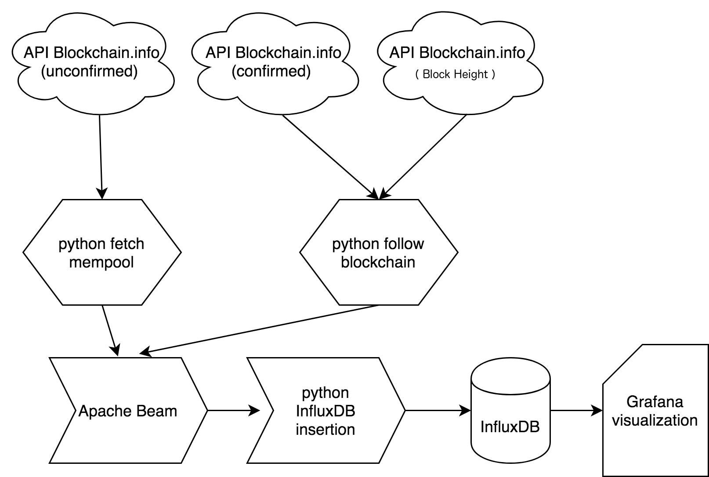
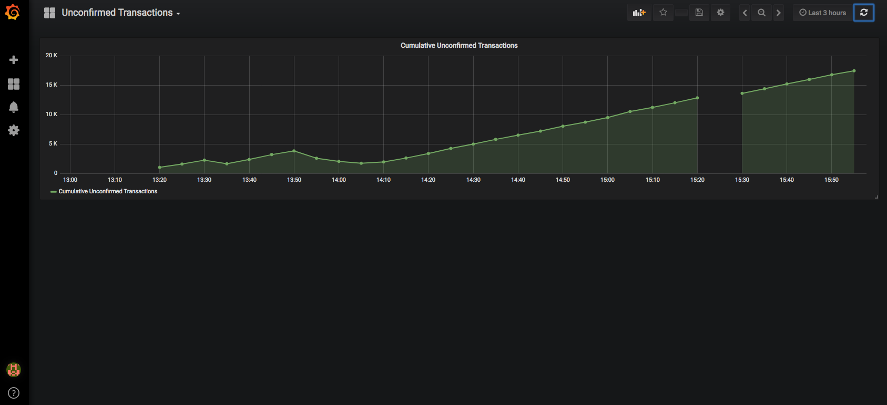

# Project Goal

# YouTube Demo
TODO: Insert link here

# Big Data Source

# Expected Results

# Processing Pipeline




Everything needed to run the project is contained inside `transaction_tracker.tar.gz`. The only requirements are Docker, an active internet connection to download the packages for the Docker container and to connect to the Blockchain.info API, and a browser to view the Grafana UI.

# Implementation

Once we launch our container, the job starts with the `run_pipeline.sh` script.
```
#!/bin/bash

set -euo pipefail
cd /root/transaction_tracker/

# Start the InfluxDB and Grafana service
service influxdb start
service grafana-server start

# Start collecting unconfirmed transactions
python fetch_mempool.py &

# Collect some events in the mempool before following the chain
sleep 120
python follow_chain.py &

echo "drop database blockchain;" | influx
echo "create database blockchain;" | influx
while :; do
    # Launch a Beam pipeline run every 5 minutes
    sleep 300
    timestamp=$(date -u '+%Y-%m-%dT%H%M%SZ')
    echo "Launching batch job at ${timestamp}"
    python beam_pipeline.py --timestamp="${timestamp}"

    # Insert the results in InfluxDB
    python influx_insert.py --timestamp="${timestamp}"
done

```

As part of the collection tier, `fetch_mempool.py` will run and collect transactions from Blockchain.info that are written to filesystem in batches.
```
"""
Fetch the current mempool
"""
SLEEP_TIME=2

from blockchain import blockexplorer
import time
import uuid
import argparse

def read_api_key():
    """
    Read the api key from the file
    """
    try:
        with open('api.key') as api:
            return api.readline().strip()
    except:
        return None

api_key = read_api_key()
parser = argparse.ArgumentParser()
parser.add_argument('--block_height', help='Get the block at the specified height',
                    type=int, required=False)
args = parser.parse_args()


def write_transactions(transactions):
    """
    Write transactions to file
    """
    output_file = 'unconfirmed/{}.txt'.format(uuid.uuid4().hex)
    with open(output_file, 'w') as output:
        for line in transactions:
            output.write(line + '\n')

def get_mempool():
    """
    Return a list of transaction hashes currently in the mempool
    """
    # Protect against API timeout with very crude try-catch
    try:
        unconfirmed = blockexplorer.get_unconfirmed_tx()
        transactions = ['{} unconfirmed'.format(tx.hash) for tx in unconfirmed]
    except:
        return None
    return transactions

print 'Using api key: ' + api_key
while True:
    transactions = set()
    # Collect batches together before writing results
    for _ in range(60 / SLEEP_TIME):
        current_transactions = get_mempool()
        # Prevent duplicates within one batch
        for transaction in current_transactions:
            transactions.add(transaction)
        time.sleep(SLEEP_TIME)
    transactions = list(transactions)
    print 'Writing {} transactions'.format(len(transactions))
    write_transactions(transactions)

```

We also laucnh the `follow_chain.py` in the collection tier to collect confirmed blocks and write these to the filesystem
```
"""
Follow the chain, download blocks, and extract transactions
"""
from blockchain import blockexplorer

import time
import uuid


def read_api_key():
    """
    Read the api key from the file. An API key is not absolutely required for the application
    to run, but it can help prevent request throttling and support higher query frequency.
    """
    try:
        with open('api.key') as api:
            return api.readline().strip()
    except:
        return None

api_key = read_api_key()
processed_heights = set()
best_height = blockexplorer.get_latest_block(api_code=api_key).height - 1


def process_block(block_height):
    """
    Fetch a block and write the results
    :param block_height: The chain height
    """
    print 'Processing new block at height {}'.format(block_height)
    transactions = fetch_block(block_height)
    write_block(transactions, block_height)
    processed_heights.add(block_height)

def fetch_block(block_height):
    """
    Fetches a block at a specified chain height and returns a list of its transactions
    :param block_height: The chain height
    """
    block = blockexplorer.get_block_height(height=block_height, api_code=api_key)[0]
    transactions = ['{} {}'.format(tx.hash, block.height) for tx in block.transactions]
    return transactions

def write_block(transactions, height):
    """
    Write a list of transactions to file
    :param transactions: A list of transaction hashes
    :param height: The block height
    """
    output_file = 'blocks/{}_{}.txt'.format(height, uuid.uuid4().hex)
    with open(output_file, 'w') as output:
        for line in transactions:
            output.write(line + '\n')

print 'Using api key: ' + api_key
while True:
    # Determine current best block
    current_height = blockexplorer.get_latest_block(api_code=api_key).height
    # Only process a block if it is better than current best block
    if current_height > best_height:
        process_block(current_height)
        # Process any other blocks we may have missed
        # more than 10 missed blocks in 1 minute occurs with probability 2.285845e-19
        for candidate_height in range(current_height - 10, current_height):
            if candidate_height not in processed_heights:
                process_block(candidate_height)
        best_height = current_height


    # Wait 5 minutes before checking for a new block
    time.sleep(60 * 5)

```

Now that we have collected the necessary data to determine if a transaction is still unconfirmed, we can launch of Apache Beam job `beam_pipeline.py`
```
import argparse
import apache_beam as beam
from apache_beam.options.pipeline_options import PipelineOptions

parser = argparse.ArgumentParser(description='Process some integers.')
parser.add_argument('--timestamp', type=str, help = 'Current run timestamp',
                    required = True)
args = parser.parse_args()
timestamp = args.timestamp

print 'Launching Beam job {}'.format(timestamp)

p = beam.Pipeline(options=PipelineOptions())

confirmed = (p | 'readConfirmed' >> beam.io.ReadFromText('blocks/*.txt')
               | 'tupleConfirmed' >> beam.Map(lambda x: x.strip().split(' ')))
unconfirmed = (p | 'readUnconfirmed' >> beam.io.ReadFromText('unconfirmed/*.txt')
                 | 'tupleUnconfirmed' >> beam.Map(lambda x: x.strip().split(' ')))


results = {'confirmed': confirmed, 'unconfirmed': unconfirmed} | beam.CoGroupByKey()
def filter_unconfirmed(x):
    """
    Extract the transaction id for transactions that have not been confirmed
    """
    if len(x[1]['unconfirmed']) > 0 and len(x[1]['confirmed']) == 0:
        yield x[0]

filtered = results |'filterTuples' >> beam.ParDo(filter_unconfirmed)

filtered | 'write_output' >> beam.io.WriteToText('beam/{}_results'.format(timestamp))
result = p.run()
result.wait_until_finish()

```

InfluxDB requires no additional configuration: the `run_pipeline.sh` script that we launch inside our Docker container already created the database for us. We do need to write the filesystem results from the Apache Beam job into InfluxDB, however, so `influx_insert.py` does this.
```
import argparse
import glob
from influxdb import InfluxDBClient

parser = argparse.ArgumentParser(description='Process some integers.')
parser.add_argument('--timestamp', type=str, help = 'Current run timestamp',
                    required = True)
args = parser.parse_args()
timestamp = args.timestamp

print 'Launching InfluxDB insert for job {}'.format(timestamp)

client = InfluxDBClient(database='blockchain')
#timestamp = '2018-04-23T193341Z'
def insert_influx(timestamp, count):
     """
     Insert the count into InfluxDB
     :param filename: The file to process
     """
     json_body = [{"measurement": "unconfirmed_transactions",
                   "time": timestamp,
                   "fields": {"count": count}
                   }]
     client.write_points(json_body)


def count_lines(filename):
     """
     Count the number of transactions in a file
     :param filename: The file to process
     """
     return sum(1 for line in open(filename))

# Safety if multiple output files
filenames = glob.glob('beam/{}*'.format(timestamp))

count = 0
# Insert total number of unconfirmed transactions into InfluxDB
for filename in filenames:
     count += count_lines(filename)
insert_influx(timestamp, count)

print 'InfluxDB insert complete for job {}'.format(timestamp)

```

The configuration for the configured Grafana dashboard in `grafana_dashboard.json` that we exported:
```
{
  "annotations": {
    "list": [
      {
        "builtIn": 1,
        "datasource": "-- Grafana --",
        "enable": true,
        "hide": true,
        "iconColor": "rgba(0, 211, 255, 1)",
        "name": "Annotations & Alerts",
        "type": "dashboard"
      }
    ]
  },
  "editable": true,
  "gnetId": null,
  "graphTooltip": 0,
  "id": 1,
  "links": [],
  "panels": [
    {
      "aliasColors": {},
      "bars": false,
      "dashLength": 10,
      "dashes": false,
      "datasource": null,
      "fill": 2,
      "gridPos": {
        "h": 8,
        "w": 24,
        "x": 0,
        "y": 0
      },
      "id": 2,
      "legend": {
        "avg": false,
        "current": false,
        "max": false,
        "min": false,
        "show": true,
        "total": false,
        "values": false
      },
      "lines": true,
      "linewidth": 2,
      "links": [],
      "nullPointMode": "null",
      "percentage": false,
      "pointradius": 2,
      "points": true,
      "renderer": "flot",
      "seriesOverrides": [],
      "spaceLength": 10,
      "stack": false,
      "steppedLine": false,
      "targets": [
        {
          "alias": "Cumulative Unconfirmed Transactions",
          "groupBy": [
            {
              "params": [
                "$__interval"
              ],
              "type": "time"
            },
            {
              "params": [
                "null"
              ],
              "type": "fill"
            }
          ],
          "measurement": "unconfirmed_transactions",
          "orderByTime": "ASC",
          "policy": "autogen",
          "refId": "A",
          "resultFormat": "time_series",
          "select": [
            [
              {
                "params": [
                  "count"
                ],
                "type": "field"
              },
              {
                "params": [],
                "type": "mean"
              }
            ]
          ],
          "tags": []
        }
      ],
      "thresholds": [],
      "timeFrom": null,
      "timeShift": null,
      "title": "Cumulative Unconfirmed Transactions",
      "tooltip": {
        "shared": true,
        "sort": 0,
        "value_type": "individual"
      },
      "type": "graph",
      "xaxis": {
        "buckets": null,
        "mode": "time",
        "name": null,
        "show": true,
        "values": []
      },
      "yaxes": [
        {
          "format": "short",
          "label": null,
          "logBase": 1,
          "max": null,
          "min": null,
          "show": true
        },
        {
          "format": "short",
          "label": null,
          "logBase": 1,
          "max": null,
          "min": null,
          "show": true
        }
      ]
    }
  ],
  "refresh": false,
  "schemaVersion": 16,
  "style": "dark",
  "tags": [],
  "templating": {
    "list": []
  },
  "time": {
    "from": "now-30m",
    "to": "now"
  },
  "timepicker": {
    "refresh_intervals": [
      "10s",
      "1m",
      "5m",
      "15m",
      "30m",
      "1h",
      "2h",
      "1d"
    ],
    "time_options": [
      "5m",
      "15m",
      "1h",
      "6h",
      "12h",
      "24h",
      "2d",
      "7d",
      "30d"
    ]
  },
  "timezone": "",
  "title": "Unconfirmed Transactions",
  "uid": "gVL19zMmk",
  "version": 5
}

```

# Results

## Build the project

From the top-level directory with `Dockerfile`, launch:
```
$ docker build . --compress -t transaction_tracker:1.0
```

## Launch the container

Once the build success, run the container:
```
$ docker run --init -p 3000:3000 -p 8086:8086 -ti transaction_tracker:1.0 /root/transaction_tracker/run_pipeline.sh
```

You should start to see output like
```
Starting influxdb...
influxdb process was started [ OK ]
 * Starting Grafana Server                                                                                                                                                                           [ OK ] 
Using api key: <REDACTED>
Writing 195 transactions
Using api key: <REDACTED>
Processing new block at height 519900
Processing new block at height 519890
Processing new block at height 519891
Processing new block at height 519892
Processing new block at height 519893
Processing new block at height 519894
Processing new block at height 519895
Processing new block at height 519896
Writing 160 transactions
Processing new block at height 519897
Processing new block at height 519898
Processing new block at height 519899
Writing 167 transactions
Writing 187 transactions
Writing 165 transactions
Writing 175 transactions
Launching batch job at 2018-04-25T192329Z
Launching Beam job at 2018-04-25T192329Z
Launching InfluxDB insert at 2018-04-25T192329Z
Writing 150 transactions
```

The pipeline will start collecting data and running. Results will appear in the Grafana dashboard in ~10 minutes, so go ahead and open up and start configuring Grafana.


## Using Grafana



Access the Grafana dashboard at `localhost:3000`. The default credentials as `admin` and `admin`.
Add a data source named `unconfirmed` using `InfluxDB` as the type. Use URL `http://localhost:8086` with `proxy` access. The database name is `blockchain`, and the Min time intervals should be `5m`.

Create your own visualizations for the plotting unconfirmed transaction volume across time. Alternatively, import `grafana_dashboard.json` to get started. The Grafana documentation claims that the `.json` file _should_ contain all of the 


## Troubleshooting

Even though an API key is used to attempt to avoid API rate-limiting, timeout errors can occur. If necessary, tweak `SLEEP_TIME` in `fetch_mempool.py`. The default value of 2 should provide a reasonable balance. Sleep times as low as 1 were tested and proved stable in some circumstances but failed in others. Running this with a high sleep values (in particular less than once every 10 seconds) will result in missed transactions, however, so we desire to keep this sleep time as low as possible. If there are failures, simply exit the Docker container, rebuild with a longer `SLEEP_TIME`, and launch the container again.

Both Grafana and InfluxDB have their ports mapped outside the container, so you can launch `influx` on your host OS and access data inside InfluxDB to see the data that is stored.
```
$ influx
Connected to http://localhost:8086 version 1.5.2
InfluxDB shell version: v1.5.2
> use blockchain;
Using database blockchain
> show measurements;
name: measurements
name
----
unconfirmed_transactions
> select * from unconfirmed_transactions;
name: unconfirmed_transactions
time                count
----                -----
1524684209000000000 1017
```

# Conclusions and Lesson Learned
* Like Spark, Apache Beam uses lazy evaluation and does not perform calculation on results until the final result must be computed. Unfortunately, beam does not have a REPL for examining intermediate data. This means debugging required writing out complete jobs that write to output files and slowly and incrementally adding on functionality. However, PySpark makes examining intermediate results for debugging very easy, so although the Apache Beam model seeks to unite the streaming/batch APIs, it seems somewhat more difficult to develop for compared to Spark's established toolset.
* Two major limitations exist in this pipeline and technologies: the query frequency of the public API and Apache Beam's IO format support. The Blockchain.info API was on some occassions stable when queried once per second, but on other occassions timeout errors occured. Beam's limited Python support meant that reading and writing from filesystem was necessary instead of directly writing to a database or messaging service as would be ideal.
* If implementing this project a second time, more care would be taken on the collection tier for ways to make collection robust. In particular, the current collection tier code performs more than simple collection: right now it also performs some deduplication to avoid writing redundant data that Apache Beam will remove anyway. Although the data volume for a single thread here is reasonable (and in fact bounded by the Bitcoin network to be approximately 400KB/minute), we ideally would record all data we received and then remove duplicates in a single location later. If we were collecting data from our own `bitcoind` node instead of from Blockchain.info, this problem could also go away, and our collection tier would be a very simple `tail -f` piped to `grep` on the node logs.
* Since the Blockchain.info API was the main source of job failure and running your own network node takes several weeks to sync with the chain, the natural improvement with more time would be to start your own node for collection instead. Once the initial network synchronization completes, the collection tier would become both more simple and robust.
* The batch job that runs in Apache Beam would be a good location for alternative technologies. If we desire to operate this with streaming support, we could use Spark, Flink, or Storm here. These also have better IO support with connectors to additional databases, so these would have been good choices in the pipeline.
* The obvious enhancement to this project would be to utilize your own `bitcoind` node instead of relying on the Blockchain.info APIs. By tailing the logs from our own node, we could guarantee that we do not miss events. Furthermore, we could set our own mempool parameters and run several nodes with very permissive retention policies so as to collect transactions that Blockchain.info may never have received. Additionally, if we wish to run this project for many months instead of merely for a few hours, we should lower the batch frequency to an acceptable level (e.g. once per day) since the amount of data will continue to grow as more transactions occur.
